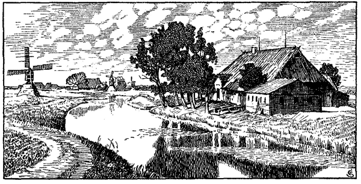

<@pagebreak 5/>

<h2>Schleswig-Holstein vor 300 Jahren.</h2>

<h3>Von H. Biernatzki.</h3>

Die Halbinsel, auf der unser Vaterland liegt, erstreckt sich 12 Tagereisen 
nach Norden, in der Breite 6 Tagereisen, nämlich zwischen
den beiden Inseln Büsum und Fehmarn. Die Gegend ist eben,
waldig und fruchtbar, der Boden an einigen Stellen flach und
wasserreich, zugleich ungemein ergiebig; die Einwohner nennen ihn
dann Marsch oder Märisch, weil er dem Meere abgewonnen ist; das
trockne und minder fruchtbare Land nennen sie Geest, so viel wie
güst oder unfruchtbar. Berge sind selten; auf zwei der höhern
liegen das Segeberger und das Plöner Schloß. An einigen Orten
sind Kalkgruben und Salzquellen; die Bewohner des Nordseestrandes
kochen aus Meereswasser Salz. Roggen, Gerste, Weizen,
Hafer, Hirse und viele Hülsenfrüchte bringt das Land in solchen
Mengen hervor, daß man wie aus einer Speisekammer eine Menge
davon ausführen kann. Die Viehweidung ist sehr bedeutend, und
die Einwohner verdienen sich viel dadurch, daß sie das Vieh in
andere Länder ausführen und verkaufen. Aber das Land ist auch
waldig und holzreich, und kein Wunder ist es, daß es Adlige gibt,
die bloß aus der Waldmast von Schweinen jährlich 4000 Taler
machen, denn die Mast eines Schweines kostet in Holstein einen
Taler, in Schleswig einen halben. Die meisten Waldungen gehören
dem Landesherrn, und einige derselben reichen fast zur Mast
von 20 000 Schweinen hin; so fanden z. B. im Jahre 1590 in den
Rendsburger Holzungen 14 000, in den Segeberger und den
<@pagebreak/>
anstoßenden über 17 000, in denen des Stifts Bordesholm 10 000, in
den Reinfelder 8000, in den Ahrensböker 4000, in den Reinfelder
und Trittauer Holzungen 8000 Stück Schweine ausreichende Mast.
Dazu kommt nun noch der große Ertrag aller schleswigschen und
der den Adligen zustehenden Holzungen; bloß in einem Jahr,
wenn Eicheln und Bucheln nur mittelmäßig gefallen sind, reicht die
Waldmast in den zum Schloß Gottorf gehörigen Waldungen für
30 000 Stück. Außerdem gewähren noch die Grasung von Ochsen
und Pferden, ferner die Schaf- und Ziegenherden bedeutenden Erwerb.
Wassermühlen gibt es in Menge, teils um Getreide und
andere Saatfrüchte zu mahlen, ferner Ölmühlen und Lohmühlen,
teils bei Goldschlägereien, Eisen- und Kupferhämmern, außerdem
noch Sägemühlen, Schleifmühlen, Papier- und Pulvermühlen. In
den zahlreichen Waldungen sind eine Menge von wilden Tieren,
weshalb die Jagd zur großen Belustigung der Fürsten und Ritter
sehr eifrig betrieben wird. Es finden sich namentlich Hirsche, Rehe,
Eber, Wölfe, Biber, Dachse, Ottern, ferner Kraniche, Schwäne, Krickenten,
Haselhühner, Fasane u. a. m.

Obgleich die Gegend keineswegs Wein und Gewürze hervorbringt,
so wird doch beides durch den Handel so reichlich herzugeführt,
daß man es sich um einen mäßigen Preis kaufen kann.
Auch sind hier mehrere schiffbare Flüsse, und es fehlt nicht an
guten und sicheren Häfen an beiden Meeresufern, wie an der Ostsee
zu Neustadt, Großenbrode, Heiligenhafen, Kiel, Eckernförde,
Schleswig (dessen Hafen nur größtenteils von dänischen Königen in
früheren Kriegen verstopft ist), Flensburg, Apenrade, Hadersleben.
An der Westküste sind Häfen bei Hamburg, Itzehoe, Sankt Margareten,
Brunsbüttel, Meldorf, Lunden, Tönning, Husum, Tondern, Ripen;
auch bei Nordstrand ist eine Bucht, Bottergatt genannt (die Gegend
vom heutigen Haramshafen bei den Reußen Kögen auf dem Festland),
und bei der Insel Ockholm ist die Reede Bolhus. Außer den
Flüssen hat das Land eine Menge fischreicher Seen, von denen es
in Holstein, Wagrien und Dithmarschen allein 36 größere gibt, die
kleineren nicht mitgerechnet; dazu kommen namentlich im Süden
eine Menge von Fischteichen; das Kloster Ahrensbök hat allein
400, die Güter Schönweide und Ranzau 24. In allen diesen Gewässern
und zumal aus der Ost- und Westsee wird fast das ganze
Jahr hindurch eine solche Menge von Fischen gefangen, daß die
durch den Kauf und Verkauf derselben gelöste Summe auf einige 
<@pagebreak/>
Tonnen Goldes geschätzt wird. Nicht bloß nach den benachbarten 
Landen sondern selbst nach den äußersten Gegenden Deutschlands,
Frankreichs, Italiens und nach noch entfernteren Küsten wird
diese Ware gebracht.

Die Einwohner in Holstein sprechen alle deutsch, insbesondere 
plattdeutsch. Von den Schleswigern sprechen die einen deutsch,
die anderen Dänisch, noch andere friesisch, letzteres nämlich
in Nord- oder Kleinfriesland. Obgleich alle die Völker dieses
Landes sich anfangs vielleicht untereinander kaum verstehen:
haben sie nur etwas untereinander gelebt, so gewöhnen sie sich
sehr leicht an die gangbare Volkssprache jeder Gegend.

Die Fürsten unternehmen in wichtigen Dingen hier nichts ohne
Einwilligung der Landstände. Die Adligen im Lande besitzen ihre
Güter frei mit dem Recht zu jagen und zu fischen. Daß sie nicht
mit neuen Auflagen beschwert werden, dafür ist in den
Landesprivilegien vorgesehen. Diese müssen die Fürsten, bevor
ihnen von den Untertanen der Huldigungseid geleistet wird,
mit einem Eide bestätigen; denn die Stände haben auch die freie
Befugnis, unter den Söhnen des Fürsten einen, wen sie wollen,
zum Landesherrn zu wählen. Die Fürsten dürfen auch ohne
Einwilligung der Stände keinen Krieg unternehmen. In Schleswig
und Holstein gibt es jetzt 50 adlige Familien; von diesen
besteht die der Rantzaus allein aus 118 männlichen Mitgliedern,
welche 71 Schlösser besitzen; die der Ahlefeldts und Rumohrs,
die ursprünglich ein Geschlecht sind, besteht aus 59 männlichen
Mitgliedern mit 31 Gütern; die der Pogwischs und von der
Wischs aus 28 mit 18, die der Buchwaldts aus 24 mit 11 Schlössern.

Bauern gibt es zweierlei. Die einen besitzen ihr Gut erblich
und frei, die andern pachtweise und frondienstpflichtig. Ihre
Streitigkeiten werden entweder nach dem geschriebenen Recht entschieden,
oder sie verhandeln sie vor ihren eigenen Richtern in Gegenwart
des Amtmanns und zweier Beisitzer. Nachdem dann die Streitenden
aufgetreten und die Streitpunkte von beiden Seiten hinreichend
dargelegt sind, so tritt das aus Bauern bestehende Gericht
ab, um sich über die Sache zu beraten und das Urteil zu fällen.
Wenn sie selbiges nach ihrem einfachen Rechtsbewußtsein herausgefunden
haben, kehren sie in den Gerichtssaal zurück; und was
ihnen dann in Gemäßheit anderer Fälle und ihres natürlichen Urteils
für Recht erschienen ist, wird sogleich durch einen
<@pagebreak/>
Gerichtsdiener den streitenden Parteien verkündigt. Wollen diese sich dabei
nicht beruhigen, so können sie an die Räte des Fürsten oder an
das Landgericht appellieren.

Das Herzogtum Holstein zerfällt in vier Teile: Stormarn, Wagrien,
das eigentliche Holstein und Dithmarschen. Stormarn liegt
zwischen Elbe, Bille, Trave, Schwale und Stör, ist ungemein freundlich
und fruchtbar an allen Lebensbedürfnissen, nur nicht wegen des
ungünstigen Klimas an Wein. Da ist nichts öde und unfruchtbar;
wo kein Ackerbau ist, herrscht Viehzucht. Es sind hier 3 Städte:
Hamburg, Itzehoe und Krempe; 3 Flecken, 25 landesherrliche und
adlige Schlösser, 2 Klöster und 50 Kirchen. Krempe ist unter den
Handelsstädten nicht die letzte, sie hat 440 Bürger (d. h. angesessene,
stimmberechtigte Bürger, also gewiß über 2000 Einwohner); es sind
dort 2 Weinhändler, 2 andere, die fremde Biere verkaufen; ferner
19 Schiffe, von denen die größern nach der Elbe, die kleinern nach
Kellinghusen fahren. Eines der Schiffe, das nach Lissabon und
Venedig geht, hält 90 Last; außerdem befrachten die Einwohner noch
sehr oft Hamburger Schiffe. Itzehoe hat jährlich 2 sehr wichtige
Märkte, an denen dort jedesmal gegen 3000 Pferde und ebensoviele
Ochsen zu Kauf kommen. Es sind dort fast 40 Bierbrauer, 1 Apotheke,
10 Schenken, in denen Wein und fremde Biere verkauft
werden; auch hat die Stadt 22 größere und kleinere Schiffe, die für
den Handel der Bürger nach der Elbe und Nordsee dienen. -- Die
alte slawische Provinz Wagrien enthält die fruchtbarsten Äcker und
Viehweiden, die Städte und Flecken Oldesloe, Segeberg, Oldenburg,
Neustadt, Plön, Eutin, Preetz, Großenbrode, Heiligenhafen, 54 landesherrliche,
bischöfliche und adlige Schlösser und 80 Kirchen, außerdem
die Klöster zu Preetz und Plön und die 4 Stifter und Abteien zu
Segeberg, Reinfeld, Cismar und Ahrensbök. Oldesloe hat 60 Bierbrauer,
4 Schenken, in denen Wein und fremde Biere verkauft werden,
im ganzen 250 Bürger. In Segeberg nähren sich die Einwohner
teils von Ackerbau und bürgerlichen Gewerben, besonders Tuchfabrikation,
teils von den zahlreichen Kalkgruben. Die stark mit
Geschütz befestigte Burg liegt auf dem Gipfel des steilen Kalkberges;
sie ist so hoch, daß man von derselben die Türme Hamburgs, Lübecks
und Lüneburgs erblickt. Es gibt Leute, die glauben, daß dieser
merkwürdige Berg von dem Teufel aus dem dichtanstoßenden See
erhoben und dorthin gesetzt sei, woher die Bauern sich auch gegenseitig
mit den Worten zu schimpfen pflegen: »Daß dich der tue 
<@pagebreak/>
plagen, der den Segeberg hat getragen.« Oldenburg war ehemals
durch Größe und Handel berühmt; die Stadt hatte eine weitläufige
Burg auf einem aufgeworfenen Hügel, ein ausgezeichnetes Gebäude,
dessen stolze und herrliche Ruinen noch vorhanden sind; sie
hatte auch einen sehr sichern Hafen, den jetzt der Strom durch fortwährende
Versandung ganz vom Meere ausgeschlossen hat, weshalb
die Stadt nunmehr mitten im Lande liegt. In Neustadt nähren
sich die Einwohner nicht so sehr von Schiffahrt wie von Ackerbau.
Bei Heiligenhafen ist eine Überfahrt nach Laaland, über welche Ochsen,
Pferde und Getreide nach den hiesigen Küsten aus Dänemark eingeführt
werden; die Einwohner leben von Ackerbau und Seehandel;
sie haben auch 18 größere und kleinere Schiffe; auch sind hier 7 Windmühlen.
Das Reinfelder Kloster hat außerordentliche Holzungen;
bloß aus dem Holzverkauf daselbst zog der Herzog Johann der
Jüngere in einem Jahr 5000 Taler. Derselbe Fürst hat zu Ahrensbök
ein glänzendes Schloß mit den schönsten Sälen erbaut. Das
alte und einträgliche Gut Rantzau hat 1590 der Statthalter Heinrich
Rantzau von seinem Vetter Hans gekauft für 59 000 Taler, was freilich
allzu teuer ist; es ist mit unglaublichem Aufwands neu aufgebaut
und von Albert Lomaier in Versen beschrieben. Das Rantzausche
Gut Arfrade hat teils sumpfigen teils salpeterhaltigen Boden; es ist
dort auch eine Salpetergrube, ferner ein auf norwegische Weise bloß
von Tannen erbautes Wohnhaus. -- Das eigentliche Holstein wird
von Dithmarschen durch den Kudensee und die Wolbersau getrennt.
Es ist wegen seines Waldreichtums sehr ergiebig für Viehzucht und
Waldmast; um Rendsburg ist der Boden sandig, aber jetzt durch
den Fleiß der Landleute doch schon sehr angebaut und selbst mit
Wiesen versehen worden. Holstein hat 4 Städte: Kiel, Rendsburg,
Wilster und Neumünster, 35 landesherrliche und adlige Schlösser,
60 Kirchen und ein Stift, nämlich Bordesholm. Kiel ist ausgezeichnet
durch seinen bequemen Hafen, beträchtliche Fischerei, den
besuchten Umschlag und als Sitz des Appellationsgerichts für die
Städte. Die Einwohner treiben auch Handel und haben 20 Schiffe,
die in ferne Länder segeln. Der Umschlag war früher in Lübeck
und wurde vom Grafen Johann dem Milden mit Einstimmung
seines Stiefbruders, Königs Christoph des Zweiten, hierher verlegt,
wodurch diese Stadt sich in wenigen Jahren außerordentlich gehoben
hat. Rendsburg ist ein sehr stark befestigter Ort, den die Eider umgibt
und durchfließt. Mit Hilfe eines Rades wird das Wasser in 
<@pagebreak/>
derselben emporgehoben und selbst in die Häuser geleitet. Das
Schloß hat 3 Türme; es ist von Herzog Johann dem Älteren 1578
sehr verschönert. Im Westen der Stadt ist ein sehr guter Hafen.
Rendsburg hat 70 Schiffe, 206 Häuser, worunter 25 Bierbrauereien;
das Bier ist aber mäßig. Wilster ist eine sehr schöne, fast runde
Stadt in einer fruchtbaren Marschgegend an der Wilsterau. Sie
hat 340 Bürger, worunter 50 Brauer; auch sind hier außer einer
Weinschenke 3 Häuser, in denen Hamburger Bier verkauft wird.
Die Stadt hat 26 Schiffe. -- Dithmarschen besteht halb aus Marsch,
halb aus Geest; die Küste ist seicht, und große Schiffe können dort
nicht landen. Diejenigen Einwohner, die sich von ihrem Grundstück
nicht nähren können, werden Soldaten oder Seefahrer. Das
Land hat eine Menge Wasser- und Windmühlen, die im Eigentum
der Besitzer stehen. Im ganzen hat es 3 Städte: Meldorf, Heide
und Lunden, 2 adlige Güter: Hattstedt und Friedrichshof, und
21 Kirchspiele.

Das Herzogtum Schleswig hat besonders 8 mit guten Häfen versehene
Städte und Flecken, ferner 28 landesherrliche Burgen, über
100 adlige Schlösser und Herrenhäuser und über 400 Kirchen, von
denen sehr viele mit Blei gedeckt sind; endlich noch 2 Klöster zu
Lügum- und Ruhkloster. Die Stadt Schleswig wird bei den Friesen
noch Hadebuy genannt; die ehemals sehr große und reiche Stadt
hat jetzt ein im ganzen beklagenswertes Aussehen; denn wie den
Menschen so sind auch den Königreichen, Staaten und Städten ihre
Tage gezählt. Es sind dort etwa 400 Bürger, unter ihnen 10 Brauer.
Nahe dabei liegt das Schloß Gottorf mit einem berühmten Zoll,
bei dem bisweilen in einem Jahre 50 000 Ochsen nach Deutschland
durchpassiert sind. Flensburg liegt am Meere mit einem vortrefflichen
Hafen; es hat schön gebaute Häuser, 2 bedeutende Vorstädte
und auf einem Hügel eine ansehnliche Burg. Die Stadt ist 2341 Schritt
lang, und es wohnen darin 1134 Bürger; diese treiben fortwährend
sehr bedeutenden Handel und haben etwa 200 Schiffe. Hadersleben
zerfällt in Alt-Hadersleben und Brobye; es hat einen sehr sichern
Hafen und 20 Schiffe; auch wohnen dort viele Adlige. Eine bedeutende
Burg auf einem Hügel ließ Herzog Johann der Ältere
abbrechen und hat jetzt auf einer Halbinsel das herrliche Schloß
Hansburg erbaut. Husum ist die wichtigste Nebenbuhlerin von Flensburg;
der Ort ist ungemein lebhaft; Handel und Gewerbe blühen
außerordentlich. Der Hafen ist in der Handelswelt berühmt; es 
<@pagebreak/>
werden hierher aus Holland, Zeeland, England, Schottland und
anderen Ländern die verschiedenartigsten Waren gebracht und von
hier nach Flensburg versandt, so daß sie auf diese Weise von der
Westsee in die Ostsee geschafft werden. Die Einwohner sind sehr
gebildet und schätzen Gelehrte hoch; gewöhnlich lassen sie ihre Söhne
studieren. Tondern hatte ehemals einen Hafen; aber jetzt ist es
durch Deiche bewirkt worden, daß die Schiffe nur eine Meile vor
der Stadt anlegen können; im Herbst und Frühjahr bloß können
Jachten und Schuten bis zu der stark befestigten Burg nahe bei der
Stadt kommen. Schwabstedt ist ein schön gelegenes Schloß und
ein Flecken, zum Bistum Schleswig gehörig; es sind hier im Osten
und Westen nur Waldungen voll von Hirschen, Rehen, Ebern und
Hasen, so daß hier die beste Jagd in beiden Herzogtümern ist.
Herzog Adolf von Gottorf erlegte hier 1579 an einem Tage
80 Hirsche. Noch jetzt kommen sie oft dem Wanderer in großer
Zahl entgegen und lassen sich selbst durch Drohungen nicht verscheuchen.

Außer den genannten Orten gehören zu Schleswig und zu
Holstein noch eine Menge von Inseln und Halbinseln, teils an der
Westseite teils an der Ostseite gelegen. Büsum ist eine Insel bei
Dithmarschen, jetzt mit Deichen umgeben, mit 3 Dörfern, Büsum,
Husen und Warren; die Einwohner leben vom Ackerbau und Fischfang,
auch vom Handel, da hier ein ziemlich tiefer Ankerplatz für
größere Schiffe ist. Stapelholm ist eine Halbinsel, die einen außerordentlichen
Überfluß von Hochwild hat. Kleinfriesland oder Nordfriesland
umfaßt die Gegend von der Eider bis Tondern; es ist
größtenteils Marsch. Dazu gehört Eiderstedt mit den Städten Tönning
und Garding und 17 Kirchspielen; dies Land ist ganz mit
Häusern besät, so daß man es für eine Stadt halten kann. Die
Weiden sind vortrefflich, und es herrscht hier ein Reichtum an Rindvieh
von solcher Größe, wie es sonst im ganzen Norden nicht gefunden
wird, selbst in Holland nicht, was alle, die dort gewesen sind,
sagen. Die Eiderstedter sprechen mit Fremden deutsch, unter sich
aber eine ganz besondere Sprache, die niemand sonst versteht. Ferner
gehören zu Nordfriesland die Inseln Nordstrand, Ockholm, Amrum,
Föhr, Sylt und Jordsand. Nordstrand ist 2 Meilen lang und enthält
36 350 Demat nebst 3200 Demat Außendeichsland, ferner 22 Kirchspiele
und 10 sehr gute Reeden. In der Mitte ist ein höher gelegener
Landstrich, Moor genannt (jetzt Nordstrandischmoor). Gerhard
<@pagebreak/>
Rantzau besitzt auf dieser Insel das adlige Gut Morsum. Die
Einwohner sind gegen Fremde außerordentlich gastfrei; sonst sind
ihnen die Untugenden unserer Zeit keineswegs fremd. Amrum ist
besonders von Fischern bewohnt. Die Einwohner rühmen es, daß
es dort gar keine Mäuse gäbe. Föhr hat einen großen Gewinst
durch das viele Strandgut, das dort beständig antreibt. Sylt
enthält 4 Kirchspiele und einen sehr schönen Herrenhof Heinrich
Rantzaus, den man fast unter die adligen Güter zählen kann. --
Auf der Ostseite Schleswigs liegen Fehmarn, Angeln, Schwansen,
Alsen u. a. m. Fehmarn ist ausnehmend angebaut; es hat 4 Kirchen
und 5000 Einwohner, welche auch etwas Handel treiben und 50 Schiffe
besitzen. Der Roggen und vorzüglich der Weizen gedeiht hier so
vortrefflich, daß er wegen seiner Schwere nach Frankreich, Spanien
und Italien ausgeführt und dort sehr teuer verkauft wird. Angeln
enthält den Flecken Kappeln, 4 Harden, 24 landesherrliche und adlige
Schlösser und 38 Kirchspiele. Alsen hat außer der Stadt und dem
Schlosse Sonderburg 5 Schlösser, die dem Herzoge Johann dem Jüngeren
gehören, ferner noch 5 adlige Güter, 3 Harden und 13 Kirchspiele,
die ganz außerordentlich bevölkert sind. Die Insel ist reich
an vorzüglichem Getreide, an Fischen, an Rindvieh und edlen Pferden;
voll von waldigen Hügeln hat sie eine sehr gute Jagd, und in einigen
Holzungen finden 5300 Schweine ihre Mast. Auch die Insel Ärrö
(die bekanntlich jetzt auch nicht einen Baum mehr hat) ist mit Wäldern
förmlich bedeckt und hat daher vorzügliche Jagd, besonders von Damwild,
das sich dort in Menge und von seltener Größe findet. Die
Insel Barsö bildet ein Kirchspiel, und die kleine Insel Aarö enthält
4 Dörfer.

Aus der ersten vaterländischen Landesbeschreibung von Heinrich Rantzau auf Breitenburg.

