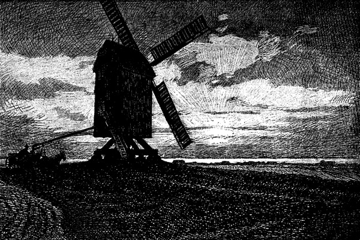

<h2>Städtchen der Niederelbe.</h2>

<h3>Von Jean Paul d'Ardeschah.</h3>

Die mächtige Niederelbe, die Hamburg reich und groß gemacht hat,
hat sonst keine andere Stadt annähernd so begünstigt. Es mögen
Harburg und Altona eine schöne Zukunft haben, doch ist diese unmittelbar
von Hamburg abhängig, sofern sie als Wasserstädte gelten
wollen. Außer diesen hat die Niederelbe nur Städtchen aufzuweisen.
Da gibt es Städtchen, die so stolz auf ihrer Geesthöhe liegen wie
Lauenburg; der Strom zieht tief unten vorüber; jeglicher Zutritt
ins Innere der Stadt ist ihm verwehrt. Schmal nur drückt sich ein 

<@pagebreak 24/>

Vom Seestrand bei Husum.

<@pagebreak/>
Häuserstreifen zwischen das Wasser und die aufsteigenden steinumsäumten
Terrassen der Anhöhen; keine stille Bucht breitet sich
aus zum freundlichen Willkomm der nahenden Schiffe, kein Hafen
mit ragenden Masten hinter grünen Deichen blinkt ihnen entgegen.
Abweisend recken sich die dunkelbewachsenen Hügelflanken empor.
Man muß oben auf dem Berge stehen, um das wahre Verhältnis
zu erkennen. Es gibt ein melancholisches Bild: weithin die stets
umflorten Wiesenflächen des entgegengesetzten Ufers, zerstreute
Bäume und Gehöfte, die im Marschendunst geisterhaft schwimmen,
näher die von kleinen qualmenden Dampfern geschleppten, achtlos
vorüberziehenden Kahnzüge. Der gleißende Fluß scheint das spröde
Städtchen vergessen zu haben, obgleich es so nahe an seinen Ufern
sitzt; und so hockt es auf seinen schwarzen Hügeln wie ein trutziger
sehnsuchtskranker Ritter, der nicht weiß, wie er seinen stachligen,
alten Panzer lösen soll und doch so gern sich mit ausgebreiteten Armen
dem Leben an die Brust werfen möchte und nicht mehr einsam
träumen auf seinem Hügel bis in unabsehbare Zeiten. Man muß
ein solches Städtchen an einem goldenen Nachmittag gesehen haben
und dann beim Mondschein die Elbe abwärts bis nach Hamburg
gefahren sein, um diesen Unterschied zu begreifen. Die in flutendes
Silber getauchte Melodie des dahingehenden, sich unaufhörlich
verbreiternden Stromes, verbrämt mit funkelnden Deichlaternen und
sprühenden Blinkfeuern, von schaukelnden Schiffslichtern übersät,
wird wie ein riesig anschwellender Lebenssang anmuten, dem die
noch frische Erinnerung wie ein Seufzer nachschleicht. Übrigens
haben auch Altona und Harburg ein ihrem Wesen nach ähnliches
Verhältnis zur Elbe, wenn auch hier manches nicht mehr so offen
liegt. Nur Blankenese, das zukünftige Elbluststädtchen, von dem
einmal sehr treffend gesagt wurde, daß es ewig Sonntag feiert,
hat sich diesem Fluch entzogen, wie eine verzauberte Prinzessin
durch den Blick in einen magischen Spiegel. Als Fischerdorf hat
es wenig Glück gehabt; es wäre auch anderweitig gescheitert, wenn
es auf den vorüberziehenden Strom gebaut hätte. Nun hat es sich
durch den Schein von seinem Verhängnis befreit, indem es vom
Bilde der Elbe lebt -- so zieht es alles an sich, was vom schönen
Schein leben will. Viel hat es aber auch den beiden Elbsanden zu
verdanken, dem großen und dem kleinen Schweinesand, die die Fahrrinne
der Elbe näher ans Ufer gedrängt haben, so daß man alle
vorüberziehenden Dampfer und Segler aus unmittelbarer Nähe
<@pagebreak/>
betrachten kann -- ein Bild voll ewig wechselnder Reize und wunderbar
belebten Lebens, doch wohlgemerkt -- nur ein Bild. Wer in
dunkler Nacht auf der Blankeneser Landungsbrücke steht, zur Zeit
der Ebbe besonders, wenn der Strom, von der Flut nicht aufgehalten,
geheimnisvoll gurgelnd und seufzend an den Brückenpfosten
vorüberfließt, der wird, wenn die meisten Lichter auf den Hügeln
hinter ihm erloschen sind, sich schwerlich des Eindrucks der Gespenstigkeit
seines augenblicklichen Daseins erwehren können. Lautlos
wird das nächtliche Leben der Elbe an ihm vorübergleiten, er
wird die Segelkutter mit grauen Fledermausflügeln und grünen
Lichtaugen stromabwärts huschen sehen in einer stummen gespenstigen
Reihe; dann wird vielleicht eins von ihnen auf ihn zusteuern mit
schwarzen Segeln, die riesenhaft emporwachsen, mit zwei glühenden
Augen, von denen eins rot, das andere grün starrt, und plötzlich
wird der unheimliche Segler sich lautlos wenden und lautlos in die
Nacht entschwinden. Und während der einsame Beobachter noch dasteht,
von einem plötzlichen Gruseln überrieselt, wird vielleicht ein
weißes Schiff vor seinen erstaunten Augen auftauchen mit langen,
goldenen Reihen funkelnder Lichter, mit nahem Stimmengewirr und
gut vernehmbarem Menschenlachen, das über das dunkle Wasser
sprüht; er wird jäh die Hände ausstrecken und doch das Bild kaum
einen Augenblick lang halten können. So pflegt sich der Schein
an dem zu rächen, der vom Scheine lebt, doch die meisten wissen
nichts davon. Sie verschlafen die Stunden solcher Offenbarungen.

Ein anderer Typus ist das versandete Städtchen der Niederelbe.
Hier ist nicht das Städtchen sondern umgekehrt die Elbe das abwehrende
Element. Das Städtchen lugt auf bläulich hügeligem
Geesthintergrund mit spitzen roten Dächern und ältlichen, meistens
grünpatinierten Türmen über die wallartigen Deiche ins flache, von
glitzernden Wasserstreifen durchzogene Land; es hat einen kleinen
blanken Hafen mit vielverankerten Kaimauern und alten Speicherbauten,
deren geborstene Wände von seltsamer Schönheit sind. Stille
Grachten mit alten Bäumen, feierlichen Giebeln, steinernen Treppenstufen
und rauschenden Schleusen schlummern, selten von bunten
Kähnen belästigt, im Schoße der Stadt. Die Häuser tragen noch
manche Erinnerung an eine vergangene hoffnungsvollere Zeit. Diese
Städtchen, so klein, unbekannt und unbedeutend sie auch daliegen
hinter ihren Deichen, verdienen liebevolle Beachtung. Sie sind von
einer eigentümlich elegischen Romantik, die um so tiefer ergreift, 
<@pagebreak/>
weil sie nicht nur erträumt sein kann sondern auch in der Wirklichkeit
immer noch tätig ist und von der umgebenden Natur zu einer
greifbaren Deutlichkeit verstärkt wird, so daß man sich ihr unmöglich
entziehen kann. Einst haben diese Städtchen fast unmittelbar an
dem Elbstrom gelegen, sie schickten ihre Schiffe hinaus aufs Meer
und träumten von einer stolzen Zukunft, manche von ihnen, wie
Stade z.&nbsp;B., glaubten, es sogar besser wie Hamburg zu haben, weil
sie näher dem Meere lagen. So getrauten sie sich, selbst zuweilen Hamburg
entgegenzutreten. Heute muß man darüber ungläubig lächeln.
Die Elbe hat vor die Mündung der Flüsse, an denen sie sich wie
an natürlichen Kanälen gelagert hatten, graue Sande geworfen.
Die Sande wuchsen, versperrten den Flüssen den Weg; die Flüsse
mußten sich krümmen und wenden, um an den seewärts eilenden
Strom zu gelangen. Ein neues Land tauchte empor, schlickig und
unzugänglich, nur der Elbe untertan, halb Wasser, halb Erde, und
wuchs hinaus, immer weiter hinaus in die flimmernde, schillernde
Wasserweite. Die Menschen haben dieses Land dem Wasser abgerungen
mit unendlicher Zähigkeit, stolzer Standhaftigkeit und bewährter
Kunst. Wie eine Erfüllung von Fausts letztem Traum ist
ihre mühsame Deicharbeit geworden; überall haben sie fruchtbarstes
Bauernkunstland geschaffen, das durch seine Bauten und sein Kunstgewerbe,
seine Bewirtschaftung und seine Eigenart auffällt. Die
Städtchen aber sahen sich immer weiter zurückgedrängt. Sie haben
daher alle etwas Elegisches. Mag diese Elegie einer versandeten
Existenz, wie in Buxtehude an der Este, durch freundlichere Züge
einer gewissen schläfrigen Behaglichkeit gemildert werden; mag der
Widerschein der eigenartigen Bauernkunst, die hier die ganze Este
mit phantastisch schönen oder farbenfrohen Giebeln, kunstvollen,
schmiedeeisernen Wetterfahnen geschmückt hat -- und in der Stadt
als blühendes Möbel- und Goldschmiedegewerbe dem Besucher entgegentritt,
wie ein versöhntes Lächeln dünken: etwas Trauriges wird
er trotzdem nicht abschütteln können. In Stade an der Schwinge,
wo die Elegie des Versandens sich mit einer gespenstigen Reiterballade
verbindet, die aus den Zeiten der Schwedenherrschaft hinüberklingt,
am Rathaus mit dem schwedischen Wappen, an alten Kirchen und
Bürgerhäusern leibhafte Spuren zu einem romantischen Gespinst
zusammenfügt und durch das Rosseelement des benachbarten Kehdinger
Landes etwas Überzeugend-Körperhaftes gewinnt, kommt das
Dunkle stärker zum Ausdruck.
 
<@pagebreak/>
Auch werdende Städtchen an der Niederelbe bilden einen besonderen
Typus. Ihre Zahl ist nicht groß. Eher modernen Hilfsmitteln
als einer Naturnotwendigkeit verdanken sie ihr Wachstum,
und es bleibt abzuwarten, wie sich die Elbe mit ihnen auseinandersetzen
wird. Für Cuxhaven scheinen die Aussichten günstig zu sein,
besonders seitdem man es unternommen hat, den Cuxhavener Hafen
großzügig auszubauen und die Zentrale für den Seefischhandel hier
zu errichten; so werden wohl die umliegenden Bauernhöfe mit den
rauschenden Schutzwänden aus beschnittenen Bäumen allmählich
weichen müssen. Vielleicht bleibt aber das stille Idyll des Ritzebütteler
Schlosses mit den prächtigen, lindenbewachsenen Wällen als
Wahrzeichen einer einst stillen, in sich versponnenen Vergangenheit
in die bewegtere Gegenwart und Zukunft hineinragend. Recht eigenartig
scheint sich die Zukunft des neugebildeten Städtchens Wedel-Schulau
gestalten zu wollen. Ob aber das kleine Marktstädtchen
Wedel mit seinem grotesk bunten Roland auf dem Marktplatz, der
besonders gut zur Zeit der Märkte aussieht, die Kraft haben wird,
das geehelichte Dorf Schulau umzubilden und sich an der Elbe
häuslich niederzulassen, dort, wo der kleine Schulauer Segelschiffhafen
und die grüne, flache Landzunge sich dehnen, bleibt eine Frage
der Zukunft.

Eine ganz besondere Geschichte unter allen Städten der Niederelbe
und ein von seinen Geschwistern gänzlich verschiedenes Äußere
hat Glückstadt, diese gegen den Willen der Natur auf gut Glück und
königlichen Wunsch erbaute Stadt, in der sogenannten Wildnis, dem
fruchtbarsten Stück der Elbmarschen, das zweimal zu ernten pflegt.
Dänische Kriegsschiffe haben einst den Aufbau Glückstadts bewacht.
Wenn man oben auf dem eleganten Aussichtsturm steht, den ein vom
Glück in Amerika begünstigter Glückstädter seiner Vaterstadt geschenkt
hat, kann man die regelmäßige Anlage der Stadt bewundern, die
vom Mittelpunkt aus durch strahlenförmig nach allen Seiten hin
laufende Straßen einen zierlichen Stern bildet. Mit einer Spitze,
die zugleich ihre Achse ist, berührt die Stadt den kleinen schlickigen
Hafen, der wie eine schmale, sich zu einem Rachen verbreiternde Kehle
aussieht. Die Bauten, die am Hafenkanal stehen, haben das Aussehen
von alten Kriegsmagazinen und Zeughäusern. Dahinter
schillert die Elbe; die vorüberziehenden Schiffe sieht man aber nur
in der Ferne hinter »der Rhinplatte«, einem schmalen, nadelförmigen
Sand, der Glückstadt von der eigentlichen Fahrrinne trennt, so 
<@pagebreak/>
daß man nur selten und mit vielen Umständen von Hamburg auf
dem Wasserwege nach dieser »Stadt des Glücks«, wie sie einst die
Hofdichter der dänischen Könige nannten, gelangen kann. Hamburg,
die von zahllosen Wasseradern durchrieselte Wasserstadt, in
der das nasse Element bis an die Wohnhäuser und belebtesten Straßen
klatscht, an den Fundamenten entlangsickert, die Häuserzeilen spiegelt,
die Kirchturmspitzen grün malt und die Straßen und Fleete mit
bläulichem Dunst füllt -- und Glückstadt, wo der letzte verschlickte
Kanal am Marktplatz im Mittelpunkte der Stadt zugeschüttet wurde,
angeblich wegen seines Gestankes, wo der Schlickfall im Hafen täglich
fast 1½ Zoll erreicht, -- das sind zwei recht verschiedene
Welten. Nur noch nachts bei spärlichem Laternenscheine erwacht
in den schnurgeraden Straßen Glückstadts ein seltsam gespenstiges
Leben. Dann sehen die langen Häuserreihen, aus denen die Dunkelheit
den Zug des kleinstädtischen Lebens getilgt hat, residenzmäßig
vornehm aus; der Blick gleitet erstaunt an den spalierbildenden
stillen Bauten entlang und erhebt sich zögernd zu den spitzen, altertümlichen
Dächern, die in einer Avenueperspektive wie schwarze
Wächterhelme gleißen. Dann fühlt man wieder und wieder den
Königstraum der dänischen Könige durch die menschenleeren Straßen
Glückstadts schleichen, vom Leuchtturm an der festumdeichten feindlichen
Elbe bis zum Friedhof der spanischen und portugiesischen
Juden, die einst Glückstadts Reichtum vermehren helfen sollten.

