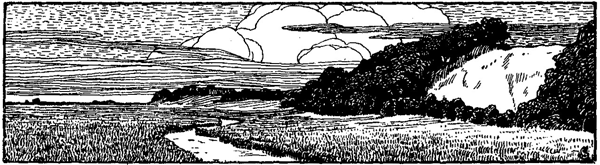

<h2>Der Donn.</h2>

<h3>Von Klaus Harms.</h3>

Nach Mai 1784 zogen meine Eltern nach St. Michaelis Donn,
eine kleine Meile von Fahrstedt entfernt. Ich saß bei unserer
Einfahrt in dieses Dorf auf einem Koffer, freute mich, aber mit
Bangen über die große Zahl der Knaben beieinander: »wenn es
mir nur gut ginge unter ihnen«, und über die hohen Berge, die 
ich nun ganz von nahem sah und nächsten Tages besteigen wollte.
Hier will mein St. Michaelis Donn etwas beschrieben werden und
der hohe lange Berg daneben.

Der St. Michaelis Donn ist nämlich eine Sandstrecke zwischen
Marsch und Geest, unterhalb einer meilenlangen Anhöhe, deren
Fuß, der Donn und andere Distrikte, die ebenfalls Donn heißen,
wie von der Anhöhe abgespülter Sand erscheint. Donn, früher geschrieben
Donnen = Dünen; St. Michaelis, weil die Kirche dieses
Donnes, früher und noch bis jetzt auch Rethdieker Donn genannt,
dem heiligen Michael geweiht ist. An Stellen erscheint auch einige
Fuß unter dem Sande hier Marsch, dort Moor, an welchen letzteren
Stellen man allenfalls in der Küche Torf graben könnte. Dieser
hohe Geestrücken mag ein paar Häuser hoch sein, und von dem St. Michaelis
Donn, dem Kirchdorfe gegenüber, da auch eine Mühle steht,
hat man eine Aussicht über eine weite Marschgegend. In späteren
Jahren manchmal auf dieser Mühle stehend und in die volle, reiche,
schöne Marsch hineinsehend ist mir der Spruch zugegangen: »Und
zeigete ihm alle Reiche der Welt und ihre Herrlichkeit.« Fahr' ich
fort, hier mein Naturgefühl anzugeben, indem diese Gegend nach
dem gewöhnlichen Urteil zu den allertraurigsten des Landes gehört,
und es manchmal für mich bedauert worden ist, daß ich in einer
so schlechten Gegend aufgewachsen wäre. O, was wollt ihr doch mit
eurer schönen Natur! Einmal: die größere Hälfte, der Himmel
mit Sonne, Mond und Sternen, ist daselbst, wie ihr einräumt,
ebenso schön wie anderswo und überall; aber dann: eine solche
Aussicht, nicht in ein leeres sondern in ein volles Land, solche
Äcker mit ihren Früchten, solche Weiden mit ihrem Vieh, solche
Häuser und Scheunen -- wo seht ihr die? Und wenn Wasser nicht
fehlen darf: eben bei meinem Donn findet sich ein See, der
den Knaben, der bisher nur Gräben und Fleten gesehen hatte,
ein großer schien. O, welche Naturfreude habe ich an und in
diesem See gehabt, und in seinem Reth (Rethdieker Donn), das ihn
zur Hälfte umkränzte! Ich weiß keine Stelle, da ich reinere, tiefere
Freuden dieser Art empfunden habe, und -- nun kann es ja
nicht mehr geschehen, ich hab' es zu lange verschoben -- wie manchmal
hab' ich mir vorgenommen in meinen höheren Jahren, diese
Plätze noch einmal in meinem Leben zu besehen und zu betreten!
-- Wollet ihr Wald? Nun, Hölzungen fanden sich auch in einiger
Nähe: das Holz bei Hopen, bei Frestedt und die Windberger Hese, 
den Namen tragend vom heidnischen Gotte Hesus. -- Innerhalb
dieses Donns gab es hin und wieder Sandhügel, mit Gras bewachsene,
auf welchen, unter welchen, zwischen welchen man so schön
spielen konnte. Und dann die Marsch dicht daran, wo man sich im
Springen über die Gräben ergötzen und üben konnte!

Aus: Klaus Harms, Lebensbeschreibung.
»Bibliothek theologischer Klassiker« Bd. 7. (Gotha. F. A. Perthes.)

