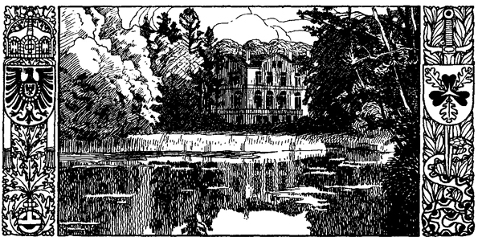

<#include "pagebreak.ftl">
\<@pagebreak 42/>

<h2>Der Sachsenwald.</h2>

<h3>Von Johannes Schmarje.</h3>

Das größte Waldgebiet der Nordmark ist der Sachsenwald. Dieser
uralte, schöne Wald, in dem Fürst Otto v. Bismarck seinen
Lebensabend zubrachte, und dessen Wipfel nun über seiner Grabstätte
rauschen, bildete einst das umstrittene Grenzgebiet zwischen dem
Sachsenstamme, der in Stormarn (= große Mark) seßhaft geworden
war, und dem östlich wohnenden Slavenstamm der Polaben. Zahlreiche
Hünengräber und Riesenbetten, die sich im Walde selbst oder
an seinem Rande befinden, verleihen der Landschaft ein interessantes
Gepräge. Sind sie Zeugen von Fehden, die hier einst um den
Besitz des Grenzgebietes ausgefochten wurden? In alten Zeiten
hatte der Wald unstreitig eine noch größere Ausdehnung als jetzt.
Westwärts erstreckte er sich über die Bille hinaus und ostwärts bis
an die Delvenau, weshalb die Slaven ihn Delvundez, d. i. Delvenau-
Wald, nannten. Seine jetzige Gestalt erhielt er indessen wahrscheinlich
schon in der zweiten Hälfte des 16. Jahrhunderts. Sie gleicht einem
mit der Spitze nach Norden gerichteten Dreieck, dessen nordwestliche
Seite von der Bille und dessen nordöstliche von einer Linie gebildet
wird, die sich an den Gemarken der Dörfer Kuddewörde, Kasseburg,
Möhnsen und Schwarzenbek entlang zieht. Als Grundlinie
mag die ostwestlich verlaufende Chaussee Bergedorf-Schwarzenbek
angesehen werden. Sie wird allerdings nur von den Ausläufern
des Sachsenwaldes berührt. Der eigentliche Sachsenwald bedeckt
eine Gesamtfläche von 6175 ha mit einem Umfang von reichlich
40 km. Der Wald wird von Chausseen und zahlreichen Wegen 
\<@pagebreak/>
durchschnitten. Von Osten nach Westen durchfließt ihn die Au,
die sich bei Aumühle in die Bille ergießt. Das anmutige Tal dieses
Bächleins begleitet die Berlin-Hamburger Eisenbahn, die den Wald
durchquert.

Seit 1228 gehört der Sachsenwald zu Lauenburg. Die Herzoge
blieben freilich nicht immer im ungestörten Genuß ihres Besitzes;
denn die Hansestädte Hamburg und Lübeck erhoben Ansprüche auf
einen Teil des wertvollen Waldes. Erst als nach dem Tode des
Herzogs Julius Franz, des letzten Askaniers, Lauenburg an Braunschweig
und darauf an Hannover fiel, mußten die Hansestädte ihre
Ansprüche auf den Wald notgedrungen aufgeben. Den Waldbauern
wurden von den landesherrlichen Besitzern dagegen die weitgehendsten
Gerechtsame eingeräumt. Sie hatten z. B. freie Weide für ihr Vieh
und die Nutzung des Weichholzes (dazu gehörten alle Bäume außer
Eichen und Buchen) zum Meilerbetrieb. Diese Gerechtsame, die
zu einer Waldverwüstung führen mußten, wurden später abgelöst
und aufgehoben. In früheren Zeiten wurde der Sachsenwald auch
zur Schweinemast benutzt. Im Spätherbst tummelten sich oft Tausende
der Rüsselträger in den Waldgründen, um sich an der Eicheln- und
Buchenmast zu feisten. Die Mast wurde an den Meistbietenden
verpachtet. Selbst die Hamburger hatten das Recht, ihre Schweine
in den Wald zu treiben. Als ihnen dieses Recht bestritten wurde,
entstand der sog. Schweinekrieg. Von jeher ist der Sachsenwald
wegen seines Wildreichtums berühmt gewesen. Noch jetzt soll ein
Bestand von über 1000 Edelhirschen vorhanden sein. An jagdbaren
Tieren birgt der Wald außerdem zahlreiche Rehe, Hasen und
hin und wieder auch Dachse. Der frühere große Bestand an Schwarzwild
ist dagegen sehr zusammengeschmolzen. In dem eingehegten
Brunstorfer Revier werden etwa noch 100--150 Wildschweine gehalten.
Der reiche Wildstand wurde den anliegenden Dorfgemeinden
oft sehr lästig; kein Wunder, daß die Wilddieberei in Blüte stand.
In den 30er Jahren des 18. Jahrhunderts wußte man viel von
den kühnen Taten des Wilderers Eidig zu erzählen, dem von den
Waldbauern in jeder Weise Vorschub geleistet wurde, und um dessen
Haupt sich ein ganzer Sagenkreis wob.

Der vorherrschende Baum des Sachsenwaldes ist die Buche,
die hier allerdings nicht die stattliche Höhe und Schönheit ihrer
Schwester auf dem fruchtbaren Boden des Ostens erreicht. Auf
lehmigem Boden sind schöne Eichenbestände, auf sandigem Boden 
\<@pagebreak/>
herrscht Nadelholz vor, und in den sumpfigen Niederungen des
Sachsenwaldes gedeihen Erlen, Birken und Sahlweiden. Durch Fürst
Bismarck wurde eine planmäßige Forstwirtschaft eingeführt. Zur
Verwertung der Walderzeugnisse legte er in Friedrichsruh eine
große Sägerei an, in der Faßdauben, Pflasterklötze, Gruben- und
Parketthölzer sowie Bohlen und Balken hergestellt werden.

1871 fiel das im Amte Schwarzenbek belegene lauenburgische
Domanium als freies, unbeschränktes Eigentum an Kaiser Wilhelm I.
Am 24. Juni desselben Jahres überwies der Kaiser seine Herrschaft
Schwarzenbek, deren Hauptbestandteil eben der Sachsenwald ist, dem
Fürsten Bismarck »in Anerkennung seiner großen Verdienste um
das Vaterland als eine Dotation zum Eigentum«. Im Jahre 1763
ließ ein Graf Friedrich zur Lippe, der die Jagd des Sachsenwaldes
gepachtet hatte, ein Jagdhaus an der Au erbauen, das er Friedrichsruh
nannte. Nach dem Abbruch dieses Hauses wurden dort
drei Wirtshäuser erbaut; das schönste derselben hieß Fraskati, im
Volksmund: Freßkate. Dieses ließ Fürst Bismarck zu einem Herrenhause
ausbauen, und hier verbrachte der Reichskanzler nach seinem
Austritt aus dem Staatsdienste seinen Lebensabend. Friedrichsruh
aber wurde zu einem Wallfahrtsort, der jährlich von Tausenden besucht
wurde, die das Bedürfnis fühlten, dem großen Manne ihre
Verehrung und Dankbarkeit zu bezeugen. An der Südseite der
Bahn, dem Herrenhause schräg gegenüber liegt das Mausoleum,
in dem er mit seiner Gattin beigesetzt ist.

Aus: Johannes Schmarje, Die Provinz Schleswig-Holstein.
»Landeskunde Preußens« Heft 5. (Stuttgart, W. Spemann.)

