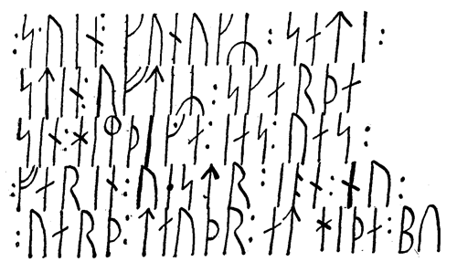

<h2>Das Dannevirke.</h2>

<h3>Von Friedrich Quehl.</h3>

Wohl das interessanteste Befestigungswerk und gleichzeitig das 
erhabenste Denkmal nordalbingischer Vergangenheit, das in seiner
Eigenart dem <i>limes romanus</i> in nichts nachsteht und auf einen mehr 
als tausendjährigen Ursprung zurückblicken kann, ist das Dannevirke,
die gewaltige Schutzwehr der Dänen nach Deutschland zu,
die dem Vordringen der südlich der Schlei wohnhaften germanischen
Völkerstämme geraume Zeit lang trotzigen Widerstand zu leisten
vermochte. Die ganze bedeutungsvolle Anlage, nicht von gestern
auf heute entstanden, ist noch in unseren Tagen eine imposante
Schöpfung und das Ziel der kleinen Menschenflutwelle, die alljährlich
<@pagebreak 58/>
auch über diese Gegend sich ergießt, deren Mittelpunkt die
mythenhafte Handelsstadt Hithabu ist. Ein Sagenkranz von Immortellen
umflicht diesen Erdwall, wuchernd und tausendfältige
Blüten treibend, wo an grauen Herbstabenden verheißend, sinnend
und spinnend am Totenkleide der Natur die Heidefee sitzt; und wir
hören geheimer Stimmen Raunen, gleich als wollten sie den alten
Glanz vergangener Tage noch einmal in seinem Zauber vor uns
erstehen lassen, um ihn dann für immer dem Zeitenschoß anzuvertrauen.
Alljährlich dasselbe Singen und Sagen von Ruhm und
unverlöschbaren Heldentaten längst verblichener Geschlechter, die, wie
die Fama sagt, »hier um Hithabu (Hedeby) saßen«. Uralte Mythen
und der Historie ewige Wahrheit machen das stolze Dannevirke zu
einem Anziehungspunkt für Einheimische und ungezählte Fremde
und halten es dauernd der Beachtung wert, die es in den weitesten
Kreisen der Bevölkerung von jeher gefunden hat.

Das von Osten nach Westen mit mehr oder weniger sichtbaren
Spuren quer über die cimbrische Halbinsel sich ziehende Dannevirke
umfaßt die im Volksmunde mit dem Namen Margaretenwall
belegten Schutzanlagen, denen südlich das Kovirke vorgestreckt ist,
und die in östlicher Richtung im Osterwall auslaufen. Unter verschiedenen
Namen taucht diese Grenzwehr im Laufe der Jahrhunderte
auf: Danwirke, Dinawerc, Vallum Danorum, Danawirk, Dannewerk,
Dannewirke -- alle besagen sie, daß ihre Erbauer Dänen
gewesen. Nur ein einziger Weg durchkreuzte einst den Erdwall,
der sog. Ochsenweg, der seinen Namen nach den Viehtransporten
erhalten hat, die auf ihm in früheren Zeiten in endlosen Zügen
von Dänemark nach den Elblanden geleitet wurden. Wo dieser
Weg das Dannevirke quert, lag das berühmte Kalegat oder Wiglesdoor,
dessen Thietmar, der Bischof von Merseburg, in seinen Annalen
Erwähnung tut, und das auch Isarndoor genannt wurde.

Den Anlaß zur Aufführung dieses Riesenwerkes mögen die
fortgesetzten Kämpfe um den Besitz des innersten Teiles der Schleibucht
gegeben haben; doch schon lange vor seinem Ursprung waren
derartige Wallanlagen in Cimbrien bekannt, darüber berichten u. a.
das Beowulfepos, die Knytlinga- und die Jomsvikingasaga; auch
setzten bereits die im 5. Jahrhundert unserer Zeitrechnung nach Britannien
auswandernden Angeln dort ihrer Baukunst ein bleibendes
Denkmal durch den zum Schutz gegen Pikten und Skoten errichteten
Grenzwall.
 
<@pagebreak/>
Die Erbauung des ältesten Teiles des Dannevirke führt in die
Heroenzeit zurück. Bereits zur Zeit der angelsächsischen Auswanderung
wurde das Kovirke angelegt, das im Osten an das Selker
Noor, im Westen an das Schwemmland der Rheider Au grenzte.
Bestimmte Nachrichten geben uns erst die altfränkischen Annalen
aus Kaiser Karls des Großen Zeit, die nach Sachs »Geschichte der
Stadt Schleswig« besagen: »Hier (in Sliesthorp) -- d. i. Schleswig
-- blieb er (Godofried) mehrere Tage und beschloß, die Grenze
seines Reiches nach Sachsen zu mit einem Wall zu schirmen, in
der Weise, daß von dem östlichen Meerbusen, den jene Ostarsalt
(Ostsee) nennen, bis zum westlichen Meer, an dem ganzen nördlichen
Ufer des Flusses Aegidora (Eider) entlang ein Bollwerk
reichte, nur von einem einzigen Tor unterbrochen, durch das
Wagen und Reiter hinaus und wieder herein kommen könnten.«
Der Umstand, daß diese Befestigung binnen zwei Jahren aufgeführt
wurde, erhellt, daß sie nicht von besonderer Güte sein konnte. Deshalb
war es erforderlich, wiederholt Verbesserungen und Verstärkungen
vorzunehmen, so durch die Witwe König Gorms des
Alten, Thyra, eine englische Prinzessin, der aus ihrer Heimat der
Piktenwall bekannt gewesen sein mag, so durch die Könige Waldemar 
I. und Knut V. von Dänemark, König Christophers I. Witwe
Margarethe Sambiria, »die schwarze Grete«, u. a. m. Erst in der
zweiten Hälfte des 13. Jahrhunderts ist die Gesamtanlage als vollendet
anzusehen.

Der wichtigste Teil des Dannevirke ist in unbestrittener Übereinstimmung
seiner Erforscher der Margaretenwall. Von Westen
nach Osten verfolgt setzt er sich zusammen aus dem Krummwall,
nordöstlich abbiegend der Waldemarsmauer, dem Burgwall mit der
Thyraburg. Hier gabelt er sich. Der in gleicher Richtung sich hinziehende
Teil heißt Alter Wall; direkt ostwärts abbiegend dagegen
folgen der sog. Doppelwall, der Reesendamm (Riesendamm) und
die Oldenburg. Der Osterwall, den man als Fortsetzung des sich
in gerader Linie an den Krummwall schließenden Kovirke ansieht,
und der in nur geringen Überresten zwischen der Schlei und der
Eckernförder Bucht erhalten ist, ist neuerer Forschung zufolge jüngeren
Datums als der Margaretenwall aber dennoch als Teil des
Dannevirke anzusehen, da ohne ihn die Verteidigungslinie unvollständig
sein würde.

Drei Burganlagen geben den Wällen besondere Stützpunkte: 
<@pagebreak/>
die Mildeburg südlich von Mildstedt, die Thyraburg bei Groß-Dannewerk,
die Oldenburg mit der Hoburg bei Haddeby, dem alten
Hithabu.

Die Mildeburg wurde vermutlich im Jahre 1151 durch König
Knut V. von Dänemark mit Hilfe der Friesen erbaut. Als Mildesburg,
Mildaenburgh, Mildeborgh und Mildeburg taucht ihr Name,
bei den verschiedenen Chronisten verschieden geschrieben, in der Geschichte
auf -- wo sie gestanden, läßt sich genau nicht mehr sagen.
Zuerst wird sie in dem Kriege Sven Grathes und Knuts um die
dänische Krone erwähnt, in welchem Sven seinen Gegner bei Mildesburg
schlug. Wahrscheinlich ist sie im Jahre 1300 bei der großen
Sturmflut mit untergegangen; jedenfalls war sie ein für damalige
Zeiten nicht zu unterschätzendes Befestigungswerk und insbesondere
für das Dannevirke, bevor der Nordstrand und die Südermarsch
vom Meer verschlungen wurden, von hervorragender Bedeutung.
»Geregte Vestung Mildesborg ist noch gestanden zur Zeit König
Abels (d. i. um 1250), und von dieser Stadt, oder aus der Mildstedter
Marsch hinüber in Eyderstede ist ein Damm gegangen, dann
Husum war etwa zu der Zeit noch ein geringes Dorff, und gieng
die Heerstraße über Mildstede und Mildesborg durch die Mildstedter
Marsch, und folgig über den Milderdamm in Eyderstede hinein.
Wie wir dann lesen, daß König Abel sein Heer, damit er Eyderstede
gedachte zu bezwingen, versammelt und gemustert habe, auff oder
bey der Mildesburg und auff dem Milderdamm ist in der Flucht
im Wiederkehren von den Eyderfriesen erschlagen worden ....«
(so bei Dankwerth: Neue Landesbeschreibung der zwey Hertzogtümer
Schleswich und Holstein -- 1652 --).

Über die Entstehung der Thyraburg ist ein abschließendes Urteil
noch nicht abzugeben. Östlich, nach anderer Meinung westlich von
ihr lag der ehemalige Dannewerker See in der Wiesenniederung,
die heute im Volksmunde den Namen Lohsiek führt. Als ihre Erbauerin
wird Königin Thyra Danebod (Dänentrost) genannt, die
Gemahlin Gorms des Alten; es scheint aber, als ob sie einen weit
älteren Ursprung hat und von der Genannten nur neu aufgeführt
worden ist. Erst im sechzehnten Jahrhundert taucht der Name Thyraborg
auf. Aber schon in der Lohheideschlacht (1261) bot sie einen
starken Stützpunkt für das Dannewerk, und noch heutigen Tages
ist die jetzt bewaldete Festungsanlage mit ihrem rechteckigen Burgplatz
zu erkennen.
 
<@pagebreak/>
Weit wichtiger als die Mildeburg und die Thyraburg, weil
sie die Schutzwehr des mächtigen Sliasvik (Schleswig) und seines
Hafens war, ist die noch jetzt in ihrer Uranlage bestehende Oldenburg.

Diese Wallanlage ist älter als das Dannevirke, mag in der
Heroenzeit ein Schlupfwinkel der Seefahrer gewesen sein oder auch
den Weibern und Kindern der in den Kampf gezogenen Krieger
als sichere Unterkunftsstätte gedient haben. Ihre ersten Anfänge
mögen wohl auf eine Zeit zurückzuführen sein, die vor dem Zusammenprall
der Dänen und Sachsen liegt. Damals bildete die
Schlei die Südgrenze der gotisch-germanischen Nordlandsvölker,
während die Südgermanen bis zum Isarnho vorgedrungen waren,
einem unwegsamen Walde, der sich, ab und zu von Lichtungen
unterbrochen, über die Halbinsel zog von der Trave bis in die Nähe
der Schlei und westlich bis an den Mittelrücken Cimbriens. Der
Landgürtel zwischen Isarnho und der Schleswiger Bucht dagegen
war Moor- und Heideland, auf dem nur kärgliche Frucht gedieh,
das eben deshalb jedoch ein passendes Hinterland für den schützenden
Hafen war, den die Seefahrer gern anliefen -- das heutige Haddebyer
Noor. Nach und nach setzten sich auch hier Dänen fest, und
es bildete sich ein zweites Schleswig gegenüber dem alten, das mit
diesem durch eine Brücke verbunden ward, die über die Möweninsel
führte. Feindliche Einfälle brachten blutige Fehden und bedingten
eine Befestigungsanlage. Nun wurde ein hoher Ringwall
aufgeworfen, der nordwärts von einer Anhöhe überragt wird, auf
der noch heute geringe Spuren auf eine verfallene Schutzwehr
deuten. Es sind dies die Reste der einstigen Hohburg, nach Münzfunden
aus der Karolingerzeit zu schließen, von Kaiser Karl dem
Großen errichtet und vermutlich mit Hohbuoki identisch, dessen Einhard
Erwähnung tut, und das man bei Boberg an der Bille gefunden
zu haben glaubte. Allerdings ist auch die Ansicht nicht
ganz von der Hand zu weisen, daß die Hohburg erst von Kaiser
Otto II. erbaut worden ist; denn nach dem bereits oben erwähnten
Thietmar von Merseburg ließ jener hierorts eine Burg errichten,
auf der lange Zeit ein sächsischer Markgraf residierte. Nachdem
die Dänen ihren Stützpunkt am Südufer der Schlei verlassen, taucht
zuerst der Name Haethun, später Heitabyr, Haithabu, Hithabu auf,
was soviel als Heideort bedeutet, eine Bezeichnung, welche die Besiegten
dem alten Stadtteil beilegten. Die Namen Schleswig und 
<@pagebreak/>
Haddeby in ihren verschiedenen Schreib- und Sprechweisen sind im
Laufe der Jahrhunderte vielfach durcheinandergewürfelt, ein Umstand,
der wohl darauf zurückzuführen ist, daß einmal deutscher, ein
andermal dänischer Einfluß für den Geschichtsschreiber bestimmend
war. Es ist unstreitig, daß die Hohburg mit ihren nach der Wasserseite
steilen Abhängen die Zitadelle des zwar umwallten aber dennoch
nicht genügend befestigten Hithabu gewesen. Da dieser Ort infolge
des Hafens nach Osten nicht geschlossen werden konnte, bedurfte
er eines weiteren Schutzes. Hierzu war die waldversteckte
Hohburg wie geschaffen. Ein reges Leben entwickelte sich in und
um diese Grenzstadt, zu deren Füßen der Mönch Ansgar 827 die
erste christliche Kirche auf der cimbrischen Halbinsel erbaute.

Ist sonach die Dannevirkelage bestimmt, so käme es nun darauf
an, ihre geschichtliche Bedeutung zu beleuchten.

Im Kieler Altertumsmuseum befinden sich drei Runensteine,
die mit einem vierten, auf dem Twieberge in unmittelbarer Nähe
des Reesendammes bei Busdorf errichteten, Kunde aus uralter Zeit
übermitteln. Die in den Schriftzügen des Futharkalphabets erhaltenen
Worte erzählen von den Kämpfen um Haithabu, Hithabu
und von den Recken, die ihr Blut fürs Vaterland ließen. Zwei
dieser Steine heißen im Volksmunde die Sigtryggsteine, während
der dritte der Erik- und der vierte der Skarthestein genannt werden.
Ihre Inschriften sind:

<ol type="a">
<li>Asfrid machte dies Grabdenkmal, die Tochter Odinkars nach
Sigtrygg den König, ihren und Gnupas Sohn.</li>

<li>Asfrid machte dies Grabdenkmal nach Sigtrygg, ihrem auch
Gnupas Sohn.</li>

<li>Thorulf, der Gefolgsmann Svens, setzte diesen Stein dem
Erik, seinem Waffenbruder, der den Tod fand, als die Männer saßen
um Haithabu, aber er war Schiffsführer, ein gar guter Mann.</li>

<li>König Sven setzte Stein nach Skarthe, seinem Heimdegen,
welcher war gefahren westwärts (d. h. nach England) und nun ward
tot bei Hithabu.</li>
</ol>

Von Mutterliebe, Freundestreue und Heldenmut reden diese
lapidaren Runenschriften, die das Eine gemeinsam haben, daß sie
Nachrufe für im Kampf gefallene Recken sind. Der Umstand, daß
die Fundorte der Steine in der Nähe von Haddeby (aet Haethum)
liegen, läßt untrüglich darauf schließen, daß die Männer im Kampfe
um diese Grenzstadt untergingen. Was jene Kämpfe aber veranlaßt,
<@pagebreak/>
davon zeugen die Funde, die sachkundige Forscher im Laufe
des letzten Jahrhunderts zutage förderten, die die Angaben älterer
Schriftsteller bestätigen, daß Hithabu nicht nur eine Königsstadt
sondern vor allem auch eine weithin bekannte Handelsstadt gewesen.

Es ist erwiesene Tatsache, daß schon vor einem Jahrtausend in
diesem innersten Winkel der Schleibucht ein schwunghafter Handel
mit allerlei fremdländischen Waren betrieben wurde. Auf der Suche
nach Bernstein kamen Araber und Phönizier bis Hedeby; Bulgaren
brachten Silber, das sog. Hacksilber, aus dem die Münzen damaliger

Inschrift des Skarthesteins.

Zeit geprägt wurden. Auch mit England, Holland und der Normandie
wurden einträgliche Handelsbeziehungen gepflogen; die
Schiffe der Kaufleute jener Stadt, die nach Ethelwordi Historia
Anglorum die Sachsen »Slesvic« und die Dänen »Heithaby« nannten,
besuchten die Häfen Schwedens, Finnlands und Rußlands. Ebenso
gingen landwärts Frachten aus Hedeby. Über Hollingstedt brachten
die Händler die Erzeugnisse des Landes nach Hamburg und weiter.
Funde von Urnen beim Bahnhofsneubau in Groß-Neuhausen, wie
sie in gleicher Art nur in der Gegend von Schleswig -- aus dem
10\. Jahrhundert stammend -- bekannt sind, lassen darauf schließen,
daß trotz der Mühsale der Landreisen mit den Thüringern Handelsbeziehungen
bestanden.

<@pagebreak/>
Interessant ist, was der arabische Kosmograph Qazwînî im
13\. Jahrhundert über Schleswig, die damals mächtigste Stadt in
der Nähe des Dannewerks schreibt: Nach ihm ist Schleswig eine
große Stadt am äußersten Ende des Weltmeeres. In ihrem Innern
gibt es Quellen süßen Wassers. Ihre Bewohner beten den Sirius
an, außer einer kleinen Anzahl, die Christen sind und dort eine
Kirche besitzen. Tartusi erzählt: »Sie feiern ein Fest, an dem sie
alle zusammenkommen, um den Gott zu ehren und um zu essen
und zu trinken. Wer ein Opfertier schlachtet, befestigt an der Tür
seines Hauses ein Holz und tut das Opfertier daran, sei es ein
Rind oder ein Widder, Ziegenbock oder Schwein, damit die Leute
wissen, daß er es geopfert zur Ehre seines Gottes. Die Stadt ist
arm an Gütern und Segen. Die Hauptnahrung ihrer Bewohner
besteht aus Fischen, von denen sie eine Menge haben. Werden
einem von ihnen Kinder geboren, so wirft er sie ins Meer, um
sich die Ausgaben zu sparen. Das Recht der Scheidung liegt bei
den Frauen. Das Weib scheidet sich selbst, wenn sie will. Auch
gibt es dort eine künstlich hergestellte Augenschminke, bei deren
Gebrauch die Schönheit niemals abnimmt sondern noch zunimmt
bei Männern und Frauen. Nie hörte ich häßlicheren Gesang als
den der Schleswiger, und er ist ein Gebrumm, das herauskommt
aus ihren Kehlen gleich dem Gebell der Hunde, nur noch wilder
als dies.« Wieviel hiervon ins Reich der Fabel gehört, mag jeder
selbst entscheiden. Mancherlei Wahres enthält die Schilderung der
beiden doch: die Süßwasserquellen finden sich noch heutigentags
und waren viel wert für sich hinter dem Dannevirke postierende
Kriegsheere; auch der Fischreichtum ist unbestritten. Das Recht
der Kinderaussetzung bestätigen alte Schriften. Die Ansgarkirche
zu Haddeby war weithin bekannt. Von hier aus nahm die Ausbreitung
des Christentums auf der cimbrischen Halbinsel ihren
Anfang.

Wichtige Funde in den letzten 150 Jahren haben uns den Beweis
geliefert, daß neben dem Handel auch die Industrie im alten
Hedeby in hoher Blüte stand. Töpfer formten Urnen, mehr als
Haushaltungsgegenstände denn zu Begräbniszwecken. Gehobene
Sargreste und silberne Sargbeschläge weisen darauf hin, daß mit
der Einführung des Christentums auch die Leichenverbrennung aufhörte,
wenngleich auch aus der nämlichen Zeit stammende Opfer- und
Beisetzungsurnen zutage gefördert wurden. Die große Anzahl 
<@pagebreak/>
vorhandener tönerner Spinnwirtel, ein Stück Lodengewebe und gewebte
Sargauslage sprechen dafür, daß Spinnstuben bestanden. Ungezählte
Knochenreste von Haustieren und Hirschgeweihbruchstücke
neben bearbeiteten Geweihsprossen bezeugen die Herstellung von
Beingegenständen. Auch das Schmiedehandwerk war nicht unbekannt,
davon reden eiserne Nieten, Nägel und Äxte. Silber wurde zu

phot. von Auqustiny-Kassel.

Der Runenstein bei Busdorf (Skarthestein).

Münzen, Spangen und Fibeln geformt und verarbeitet; selbst Goldsachen
hat man in dem Schoße der Erde gefunden, die von Haddebys
Vergangenheit reden. Wandbewurf und ein steinerner Herd lassen
erkennen, daß die Männer in Hithabu -- absichtlich wechsele ich mit
der Bezeichnung des Namens der Ansiedlung analog der Gepflogenheit
der älteren Schriftsteller und Historiker -- ein seßhaftes Heim
hatten. Daß die Schiffbaukunst hoch obenan stand, lehrt uns die
Geschichte. In der Gegend der Waldemarsmauer mögen sich
<@pagebreak/>
Ziegelbrennereien befunden haben; denn das Mauerwerk enthält noch
jetzt Spuren von roten Ziegeln, die mit festem Mörtel gebunden sind,
wie sie vielfach mit viel Mühen aus der Mauer gebrochen wurden,
um von späteren Geschlechtern zum Hausbau verwendet zu werden.
Die Steinhaukunst bekunden die schon erwähnten Runensteine.

Diesseits und jenseits der Schlei, von Eckernförde am Windebyer
Noor vorbei nach Haddeby, besonders von hier über Klein-Dannewerk,
Schuby, hinter Schleswig entlang nach Triangel zu sieht
man noch heutigentags eine stattliche Anzahl von Hünengräbern,
in denen die sterblichen Überreste der in vorchristlicher Zeit verstorbenen
Großen des Volkes ruhen. Außer dem neuerdings abgetragenen
Dronninghoi (Königinhügel) bei Schuby ist wohl der sog. Königshügel
das bekannteste. »Köng Sie' Höh« heißt dies Grabmal im
Volksmund, und nach alter Tradition soll König Sigurd hier begraben
liegen. Heute schmückt die Stätte, an der vermutlich einst
einer der Sigtrygg- (Sigurd) Steine stand, zur Erinnerung an
die Schlacht zwischen Oberselk, Wedelspang und Jagel am 3. Feb.
1864 ein Stein mit der Inschrift auf die gefallenen Österreicher:

<pre style="display: inline-block; text-align: left;">»Den tapferen Gefährten
sei dieser Kranz gewunden,
die hier in fremder Erde
ihr kaltes Grab gefunden. &mdash;</pre>

<pre style="display: inline-block; text-align: left;">Den braven Kameraden
voll hohem Heldenmut,
die unsern Sieg erkauften
mit ihrem Herzensblut. &mdash;</pre>

<pre style="display: inline-block; text-align: left;">Heimwärts nach Östreichs Auen
schwebt auf des Ruhmes Flügel
der Name aller Helden
vom Grab am Königshügel.«</pre>

Ein Denkmal, das wie die alten Runensteine noch nach einem
Jahrtausend der Nachwelt die deutsche Waffenbrüderschaft verkünden
möge!

Noch andere Namen stehen mit dem Dannevirke in enger Verbindung.

Da ist die Lohheide, berühmt durch die am 28. Juli 1261 daselbst
geschlagene Schlacht, in der die Dänen unterlagen. Schleswig, von
Dänemark losgerissen, ward fortan ein Bollwerk Holsteins gegen
jütischen Einfluß, und die Doppeleiche, der Verbrüderung Symbol,
schlug feste Wurzeln in dem vielumstrittenen Boden der cimbrischen
Halbinsel.

<@pagebreak/>
Hollingstedt, ein wichtiger Handelsort und Stapelplatz im Schutze
der Wallanlagen, wird schon im 11. Jahrhundert erwähnt. Damals
erbauten dort die Engländer ein großes Kauf- und Packhaus, das
später in eine Kirche umgewandelt wurde. Nach der Knytlinga-
Saga brachte König Sven zu Lande seine Schiffe nach hier. Lange
Jahre führte der einzige Weg von Schleswig nach Husum am Dannevirke
entlang über Hollingstedt (Hölingstada). Hier oder bei Klein-Rheide
befand sich eine Zollstätte, deren das Schleswiger Stadtrecht
mehrere erwähnt. Eine andere war z. B. die Juriansburg
auf der Möweninsel bei Schleswig in der Schlei.

Rheide heißt Reede und soll sagen, daß in der Zeit, als noch
die Nordsee tiefer in das Land eingriff, daselbst eine Schiffsreede
vorhanden war.

Große Sümpfe lagerten auch früher schon vor einem Teil des
Dannevirke; eine Stelle am Kohgraben heißt Grundlos.

Das schon früher erwähnte Wiglesdoor (auch Fifeldoor = Meerestor)
erhielt später den Namen Kalegat. Von hier aus zog Kaiser
Otto II. in Jütland ein; Kaiser Lothar dagegen mußte dem sich
ihm an dieser Stelle bietenden Widerstande weichen. Noch Ende
des 16. Jahrhunderts soll das Kalegat die einzige Öffnung des Dannevirke
und in seiner Nähe eine Viehzollstätte belegen gewesen sein.

Südwestlich der Hohburg, sagt man, habe einst ein mächtiger
Opferstein gestanden; die Gegend wird noch heutigentags Bredensteen
genannt.

Und so ließe sich gar mancherlei anführen, was zur Erläuterung
von Namen dient, die im Volksmunde fortleben, deren Bedeutung
indes den meisten unbekannt ist.

An der Kirche zu Norder-Fahrenstedt im Lande Angeln befindet
sich ein Steinbild, das einen Lindwurm, einen Eichbaum,
einen Vogel und einen Reiter zu Pferde darstellt. Da dieses Mal
ein sehr hohes Alter hat, läßt es vermuten, daß den Hithabubewohnern
die Sage von Siegfried dem Drachentöter nicht unbekannt gewesen
sein kann. Das bestätigt auch Nornagest, des Dänen Thord Tingbit
Sohn, der dem König Olaf Trygvason von dem Kampfe Sigurds
(als des Begleiters König Gunnars) mit den Gandulfsöhnen erzählt.
Olaf Trygvason aber war der treue Waffenbruder Svens,
der bei Hithabu kämpfte.

Daß ein soviel umstrittenes Stück Erde wie das Dannevirke,
das ein Jahrtausend lang Zeuge großer Taten gewesen, der Sage 
<@pagebreak/>
willkommene Stätte sein mußte, ist selbstverständlich. Bei der geachteten
Stellung des Weibes unter den germanischen Völkerstämmen
nimmt es auch nicht wunder, daß gerade die Heldinnen des Volkes
der Mittelpunkt von Märchen und Dichtungen sind, die noch heute
im Volksmunde fortleben. Und so begegnen wir allerorten am
Dannewerk den Sagen von zwei Frauengestalten, die viel für ihr
Vaterland getan und sich um den Grenzwall große Verdienste erworben
haben; es sind dies die Königinnen Thyra Danebod und
Margareta Sambiria.

Von der ersteren heißt es: Auf der Thyraburg bzw. auf dem
Margaretenwall wandelt oft beim Mondschein, immer in der 
Mittsommernacht, eine Königin. Es ist die Tochter Harald Klacks, als
deren Vater auch König Ethelred von England bezeichnet wird.
Während sie ihr Kind im Arme trägt und über die Wallkrümmung
schreitet, machen sich im Schatten des Dannevirke Schwarzelfen zu
schaffen, goldene Platten herbeizuholen, aus denen sie einen Stuhl
und eine Wiege errichten. Zur selbigen Zeit sprengte einst ein Reiter
durchs Wiglesdoor. Er gewahrt die herrliche Frau, und geheime
Regungen steigen in seiner Seele auf. Während Thyra das Kind
in die Wiege legt und auf dem Stuhl Platz nimmt, versucht der
Reiter, den Wall zu erreichen. Aber überall Moor und unwegbare
Flächen. So sehr auch sein Rappe schäumt und schnauft, so sehr
er sich auch dagegen sträubt, über den Sumpf zu jagen, des Helden
Wille ist fest, und er unternimmt das Wagnis. Drüben singt Thyra
ein Wiegenlied, um den Kleinen zur Ruhe zu lullen, dazu kämmt
sie ihr goldenes Haar, das ihre Schultern umwallt. Im Wiesengrunde
tanzen die Elfen. Leise wehen die Winde, und die Sterne
blinken am Himmelszelt. Immer tiefer begibt sich der Reiter ins
Moor, unerschütterlich in seinem Vorhaben. Nebel lagern im Tal
und überziehen die braune Fläche. Nun gibt es kein Zurück mehr.
Als die Nacht weicht, ist die Königin verschwunden; Roß und Reiter
hat niemand wieder gesehen. Hellsehende Menschen können dagegen
noch heutigentags Thyra Danebod und das Königskind
schauen.

Während diese Frauengestalt an die lichte Göttin der Liebe,
Frigga oder Freia, erinnert, finden wir in Margareta Sambiria,
der »schwarzen Grete«, ein Abbild der todbringenden Hel.

Von letzterer plaudert die Sage: Sie sei eine sehr kriegerische
Frau gewesen. Einst habe sie Krieg für ihren unmündigen Sohn 
<@pagebreak/>
mit einem sächsischen Prinzen geführt. Als sie jedoch die Wahrnehmung
machte, daß die Schlacht zu ihren ungunsten auslaufen
möchte, bot sie dem Fürsten einen Zweikampf an. Der Arglose
ging darauf ein, und es wurde ein Walplatz in der Nähe des
Dannevirke abgesteckt mit großen Feldsteinen; andere verlegen die
Stätte auf die Südseite des Kohgrabens. Auf feurigen Rossen,
wohlbewaffnet, rückten der Prinz und Margareta gegen einander
vor. Sie warf zuerst den Speer, den der Schild des anderen geschickt
auffing, so daß er den seinen schnell auf die Angreiferin
richten konnte. Beim nächsten Anprall zerbrachen die eschenen
Lanzenschäfte; bluttriefend sanken die schäumenden Rosse zu Boden.
Nun begann ein heftiger Schwertkampf. Da lockerte sich Margaretas
Sturmhaube, und sie bat um Waffenruhe. Der Prinz willigte
ritterlich ein und wollte auf der Hinterlistigen Wunsch sogar sein
Schwert bis zum Knauf in die Erde stecken. Doch kaum hatte er
sich gebückt, als ihm Margareta das Haupt abschlug. -- Im Dronninghoi
beim Deckerkrug in der Gemarkung Schuby, westlich von Schleswig
hat man vor wenig Jahren neben einem Skelett, das das der von
Gewissensbissen gepeinigten »falschen Fraue« sein soll, die auf
ihren ausdrücklichen Wunsch der Sage nach hier bestattet wurde,
weitere menschliche Überreste gefunden. Auffallend ist, daß der einen
Leiche der Kopf vor der Beerdigung vom Rumpf getrennt sein muß;
denn er lag zu Füßen der noch verhältnismäßig gut erhaltenen
Skelettreste. Auch sagt man, daß hier ein Prinz begraben liege,
der noch manchmal an silberner Tafel beim silbernen Teetopf gesehen
würde.

Bemerkenswert ist in diesen beiden Sagen der dänischen Königinnen,
daß beide als sorgende Mütter auftreten. Beide sind in
Gefahr: Thyra wird von einem Reiter bedroht, der sie für sich gewinnen
will; Margareta kämpft für das Erbe ihres Sohnes. Jedesmal
siegt die Frau; aber Thyras Sieg ist der über die Macht der
Finsternis, während Margareta, die schwarze Grete, über das Gute
siegt, den edlen Prinzen von Sachsen. Thyra, die Lichthelle, erscheint
mit goldenem Haar; Stuhl, Wiege, sogar der Kamm sind
golden. Margareta trägt der Erzählung nach eine silberne Brünne
und silberne Sturmhaube. Auch das Teegerät des Prinzen besteht
aus Silber. Das Helle, der Tag mit der Sonne, golden -- das
Dunkle, die Nacht mit dem Monde, silbern. Gut und Böse in
schroffem Gegensatz!

<@pagebreak/>
So sehen wir, wie das Dannevirke in jeder Beziehung ein
hervorragendes Völkermal geworden, eine unerschöpfliche Quelle des
Forschens auf allen Gebieten. Solche Stätten müssen weiter in
bestem Zustande erhalten werden. Hierauf zielt eine Reihe Verfügungen
und Verordnungen der Staatsbehörden. Auf die Erhaltung
der Denkmäler und Erdwerke aus der Vorzeit bezieht sich
für das Geltungsbereich des Dannewerks insbesondere die Bekanntmachung
der Königl. Regierung in Schleswig vom 5. März 1887
(Amtsblatt Stück 62, Seite 783), nach welcher die unbefugten
Ausgrabungen der Überreste der Vorzeit -- Stein- und Erdmonumente,
Gräberfelder, Reihengräber, Urnenfriedhöfe, Wendenkirchhöfe, Steinhäuser,
Hünengräber, Hünen- oder Riesenbetten, Ansiedlungsplätze,
Ringwälle, Landwehren, Schanzen, Mauerreste, Pfahlbauten, Bohlbrücken
usw. aus römischer, heidnisch-germanischer oder unbestimmbar
vorgeschichtlicher Zeit -- sowie die Verschleppung der dabei gewonnenen
Fundstücke einen derartigen Umfang angenommen hatten,
daß ihnen im allgemeinen Interesse entgegengetreten werden mußte.
Wenn die in vorstehend erwähnter Bekanntmachung gegebenen 
Bestimmungen beachtet werden, insbesondere auch die Grundbesitzer
in ihrem Teil dazu mitwirken, daß das Dannevirke vor weiterer Zerstörung
geschützt bleibt, dann werden diese Worte Wahrheit werden:
»Feilscht auch die Welt oft um fremde Gunst, reißt auch das Schicksal
gar manchen von der Scholle hinweg in die Ferne -- eins bindet
doch alle: die Heimatliebe, die der Urväter Art und germanische
Treue am besten im Beharren am guten Alten kennzeichnet.«

