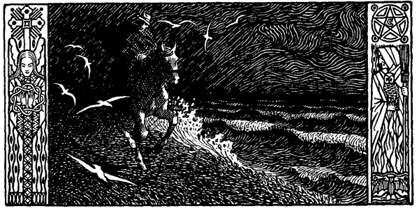

<#include "pagebreak.ftl">
\<@pagebreak 81/>

<h2>Der Deichbruch.</h2>

<h3>Von Theodor Storm.</h3>

Es war vor Allerheiligen, im Oktober. Tagüber hatte es stark
aus Südwest gestürmt; abends stand ein halber Mond am Himmel,
dunkelbraune Wolken jagten überhin, und Schatten und trübes Licht
flogen auf der Erde durcheinander; der Sturm war im Wachsen.
Im Zimmer des Deichgrafen Hauke Haien in Nordfriesland stand noch
der geleerte Abendtisch; die Knechte waren in den Stall gewiesen,
um dort des Viehes zu achten; die Mägde mußten im Hause und
auf den Böden nachsehen, ob Türen und Luken wohl verschlossen
seien, daß nicht der Sturm hineinfasse und Unheil anrichte. Drinnen
stand Hauke neben seiner Frau am Fenster; er hatte eben sein Abendbrot hinabgeschlungen; er war draußen auf dem Deich gewesen.
Zu Fuße war er hinausgetrabt, schon früh am Nachmittag; spitze
Pfähle und Säcke voll Klei oder Erde hatte er hie und dort, wo
der Deich eine Schwäche zu verraten schien, zusammentragen lassen.
Überall hatte er Leute angestellt, um die Pfähle einzurammen und
mit den Säcken, vorzudämmen, sobald die Flut den Deich zu schädigen
beginne; an dem Winkel zu Nordwesten, wo der alte und
der neue Deich zusammenstießen, hatte er die meisten Menschen
hingestellt; nur im Notfall durften sie von den angewiesenen Plätzen
weichen. Das hatte er zurückgelassen; dann, vor kaum einer Viertelstunde, naß, zerzaust war er in seinem Hause angekommen, und
jetzt, das Ohr nach den Windböen, welche die in Blei gefaßten
Scheiben rasseln machten, blickte er wie gedankenlos in die wüste
Nacht hinaus; die Wanduhr hinter ihrer Glasscheibe schlug eben 
\<@pagebreak/>
acht. Das Kind, das neben der Mutter stand, fuhr zusammen und
barg den Kopf in deren Kleider.

»Es geht nicht länger, Elke!« sagte der Hausherr, »ruf eine
von den Dirnen; der Sturm drückt uns die Scheiben ein, die Luken
müssen angeschroben werden!« Auf das Wort der Hausfrau war
die Magd hinausgelaufen; man sah vom Zimmer aus, wie ihr
die Röcke flogen; aber als sie die Klammern gelöst hatte, riß ihr
der Sturm den Laden aus der Hand und warf ihn gegen die
Fenster, daß ein paar Scheiben zersplittert in die Stube flogen
und eins der Lichter qualmend auslosch. Hauke mußte selbst hinaus
zu helfen, und nur mit Not kamen allmählich die Luken vor die
Fenster.  Als sie beim Wiedereintritt in das Haus die Tür aufrissen,
fuhr eine Bö hinterdrein, daß Glas und Silber im Wandschrank
durcheinander klirrten; oben im Hause über ihren Köpfen
zitterten und krachten die Balken, als wolle der Sturm das Dach
von den Mauern reißen.

Aber Hauke kam nicht wieder in das Zimmer; Elke hörte, wie
er durch die Tenne nach dem Stalle schritt. »Den Schimmel! Den
Schimmel, John! Rasch!« So hörte sie ihn rufen; dann kam er
wieder in die Stube, das Haar zerzaust aber die grauen Augen
leuchtend. »Der Wind ist umgesprungen!« rief er -- «nach Nordwest,
auf halber Springflut! Kein Wind; -- wir haben solchen
Sturm noch nicht erlebt!« Elke war totenblaß geworden: »Und
du mußt noch einmal hinaus?« Er ergriff ihre beiden Hände und
drückte sie wie im Krampfe in die seinen: »Das muß ich, Elke.«
Sie erhob langsam ihre dunklen Augen zu ihm, und ein paar
Sekunden lang sahen sie sich an; doch war's wie eine Ewigkeit.
»Ja, Hauke,« sagte das Weib, »ich weiß es wohl, du mußt!« Da
trabte es draußen vor der Haustür. Sie fiel ihm um den Hals,
und einen Augenblick war's, als könne sie ihn nicht lassen; aber
auch das war nur ein Augenblick. »Das ist unser Kampf!« sprach
Hauke; »ihr seid hier sicher; an dies Haus ist noch keine Flut gestiegen. Und bete zu Gott, daß er auch mit mir sei!« Hauke hüllte
sich in seinen Mantel, und Elke nahm ein Tuch und wickelte es
ihm sorgsam um den Hals; sie wollte ein Wort sprechen, aber die
zitternden Lippen versagten es ihr.

Draußen wieherte der Schimmel, daß es wie Trompetenschall
in das Heulen des Sturmes hineinklang. Elke war mit ihrem
Manne hinausgegangen; die alte Esche knarrte, als ob sie
\<@pagebreak/>
auseinanderstürzen solle. »Steigt auf, Herr!« rief der Knecht, »der
Schimmel ist wie toll; die Zügel könnten reißen.« Hauke schlug
die Arme um sein Weib: »Bei Sonnenaufgang bin ich wieder
da!« Schon war er auf sein Pferd gesprungen; das Tier stieg mit
den Vorderhufen in die Höhe, dann gleich einem Streithengst, der
sich in die Schlacht stürzt, jagte es mit seinem Reiter die Werfte
hinunter in Nacht und Sturmgeheul hinaus.

»Vater, mein Vater!« schrie eine klägliche Kinderstimme hinter
ihm darein; »mein lieber Vater!« Die kleine Wienke war im Dunkeln
hinter dem Fortjagenden hergelaufen; aber schon nach hundert
Schritten strauchelte sie über einen Erdhaufen und fiel zu Boden.
Der Knecht Iven Johns brachte das weinende Kind der Mutter
zurück; die lehnte am Stamme der Esche, deren Zweige über ihr
die Luft peitschten, und starrte wie abwesend in die Nacht hinaus,
in der ihr Mann verschwunden war; wenn das Brüllen des Sturmes
und das ferne Klatschen des Meeres einen Augenblick aussetzten,
fuhr sie wie in Schreck zusammen; ihr war jetzt, als suche alles
nur, ihn zu verderben und werde jäh verstummen, wenn es ihn gefaßt
habe. Ihre Knie zitterten, ihre Haare hatte der Sturm gelöst
und trieb damit sein Spiel. »Hier ist das Kind, Frau!« schrie
John ihr zu; »haltet es fest!« und drückte die Kleine der Mutter
in den Arm. »Das Kind? -- Ich hatte dich vergessen, Wienke!«
rief sie; »Gott verzeih mir's.« Dann hob sie es an ihre Brust,
so fest nur Liebe fassen kann, und stürzte mit ihr in die Knie:
»Herr Gott und du mein Jesus, laß uns nicht Witwe und nicht
Waise werden! Schütz ihn, o lieber Gott; nur du und ich, wir
kennen ihn allein!« Und der Sturm setzte nicht mehr aus; es tönte
und donnerte, als solle die ganze Welt in ungeheurem Hall und
Schall zugrunde gehen. »Geht in das Haus, Frau!« sagte John,
»kommt!« und er half ihnen auf und leitete die beiden in das Haus
und in die Stube. --

Der Deichgraf Hauke Haien jagte auf seinem Schimmel dem
Deiche zu. Der schmale Weg war grundlos; denn die Tage vorher
war unermeßlicher Regen gefallen; aber der nasse, saugende Klei
schien gleichwohl die Hufe des Tieres nicht zu halten; es war, als
hätte es festen Sommerboden unter sich. Wie eine wilde Jagd
trieben die Wolken am Himmel; unten lag die weite Marsch wie
eine unerkennbare, von unruhigen Schatten erfüllte Wüste; von
dem Wasser hinter dem Deiche, immer ungeheurer, kam ein dumpfes 
\<@pagebreak/>
Tosen, als müsse es alles andere verschlingen. »Vorwärts, Schimmel!«
rief Hauke, »wir reiten unseren schlimmsten Ritt!« Da klang es
wie ein Todesschrei unter den Hufen seines Rosses. Er riß den
Zügel zurück; er sah sich um; ihm zur Seite dicht über dem Boden,
halb fliegend, halb vom Sturme geschleudert, zog eine Schar von
weißen Möwen, ein höhnisches Gegacker ausstoßend; sie suchten
Schutz im Lande. Eine von ihnen -- der Mond schien flüchtig
durch die Wolken -- lag am Weg zertreten: dem Reiter war's, als
flatterte ein rotes Band an ihrem Halse. »Klaus!« rief er. »Armer
Klaus!« War das der Vogel seines Kindes? Hatte er Roß und
Reiter erkannt und sich bei ihnen bewegen wollen? -- Der Reiter
wußte es nicht.

»Vorwärts!« rief er wieder, und schon hob der Schimmel zu
neuem Rennen seine Hufe; da setzte der Sturm plötzlich aus, eine
Totenstille trat an seine Stelle; nur eine Sekunde lang, dann
kam er mit erneuter Wut zurück; aber Menschenstimmen und verlorenes
Hundegebell waren inzwischen an des Reiters Ohr geschlagen,
und als er rückwärts nach seinem Dorf den Kopf wandte,
erkannte er in dem Mondlicht, das hervorbrach, auf den Werften
und vor den Häusern Menschen an hochbeladenen Wagen umher
hantierend; er sah, wie im Fluge noch andere Wagen eilend nach
der Geest hinauffahren; Gebrüll von Rindern traf sein Ohr, die
aus den warmen Ställen nach dort hinaufgetrieben wurden. »Gott,
Dank! sie sind dabei, sich und ihr Vieh zu retten!« rief es in ihm;
und dann mit einem Angstschrei: »Mein Weib! Mein Kind! -- Nein,
nein; auf unsere Werfte steigt das Wasser nicht!« Aber nur einen
Augenblick war es; nur wie eine Vision flog alles an ihm vorbei.

Eine furchtbare Bö kam brüllend vom Meer herüber, und ihr
entgegen stürmten Roß und Reiter den schmalen Akt<a class="refnote" id="rn1" href="#fn1">*)</a> zum Deich
hinan. Als sie oben waren, stoppte Hauke mit Gewalt sein Pferd.
Aber wo war das Meer? Wo Jeverssand? Wo blieb das Ufer
drüben? -- -- Nur Berge von Wasser sah er vor sich, die dräuend
gegen den nächtlichen Himmel stiegen, die in der furchtbaren Dämmerung
sich übereinander zu türmen suchten und übereinander gegen
das feste Land schlugen. Mit weißen Kronen kamen sie daher,
heulend, als sei in ihnen der Schrei alles furchtbaren Raubgetiers
der Wildnis. Der Schimmel schlug mit den Vorderhufen und schnob
\<@pagebreak/>
mit seinen Nüstern in den Lärm hinaus; den Reiter aber wollte
es überfallen, als sei hier alle Menschenmacht zu Ende, als müsse
jetzt die Nacht, der Tod, das Nichts hereinbrechen. Doch er besann
sich: es war ja Sturmflut; nur hatte er sie selbst noch nimmer
so gesehen; sein Weib, sein Kind, sie saßen sicher auf der hohen
Werfte, in dem festen Hause; sein Deich aber, -- und wie ein
Stolz flog es ihm durch die Brust -- der Hauke-Haien-Deich, wie
ihn die Leute nannten, weil er ihn erbaut hatte, der mochte jetzt
beweisen, wie man Deiche bauen müsse!

Aber -- was war das? -- Er hielt an dem Winkel zwischen
beiden Deichen; wo waren die Leute, die er hierher gestellt, die hier
die Wacht zu halten hatten? Er blickte nach Norden den alten
Deich hinan; denn auch dorthin hatte er einzelne beordert. Weder
hier noch dort vermochte er einen Menschen zu erblicken; er ritt
ein Stück hinaus, aber er blieb allein; nur das Wehen des Sturmes
und das Brausen des Meeres bis aus unermessener Ferne schlug
betäubend an sein Ohr. Er wandte das Pferd zurück; er kam
wieder zu der verlassenen Ecke und ließ seine Augen längs der
Linie des neuen Deiches gleiten; er erkannte deutlich: langsamer,
weniger gewaltig rollten hier die Wellen heran; fast schien's, als
wäre dort ein ander Wasser. »Der soll schon stehen!« murmelte
er, und wie ein Lachen stieg es in ihm herauf.

Aber das Lachen verging ihm, als seine Blicke weiter an der
Linie seines Deiches entlang glitten: an der Nordwestecke -- was
war das dort? Ein dunkler Haufen wimmelte durcheinander; er
sah, wie es sich emsig rührte und drängte -- kein Zweifel, es waren
Menschen! Was wollten, was arbeiteten die jetzt an seinem Deich?
-- Und schon saßen seine Sporen dem Schimmel in den Weichen,
und das Tier flog mit ihm dahin; der Sturm kam von der Breitseite,
mitunter drängten die Böen so gewaltig, daß sie fast vom
Deiche in den neuen Koog hinabgeschleudert wären; aber Roß und
Reiter wußten, wo sie ritten. Schon gewahrte Hauke, daß wohl
ein paar Dutzend Menschen in eifriger Arbeit dort beisammen seien,
und schon sah er deutlich, daß eine Rinne quer durch den neuen
Deich gegraben war. Gewaltsam stoppte er sein Pferd: »Halt!«
schrie er, »halt! Was treibt ihr hier für Teufelsunfug?« Sie
hatten in Schreck die Spaten ruhen lassen, als sie auf einmal den
Deichgrafen unter sich gewahrten; seine Worte hatte der Sturm ihnen
zugetragen, und er sah wohl, daß mehrere ihm zu antworten strebten; 
\<@pagebreak/>
aber er gewahrte nur ihre heftigen Gebärden; denn sie standen alle
ihm zur Linken, und was sie sprachen, nahm der Sturm hinweg,
der hier draußen jetzt die Menschen mitunter wie im Taumel gegeneinander
warf, so daß sie sich dicht zusammenscharten. Hauke maß
mit seinen raschen Augen die gegrabene Rinne und den Stand
des Wassers, das fast an die Höhe des Deiches hinaufklatschte und
Roß und Reiter überspritzte. Nur noch zehn Minuten Arbeit --
er sah es wohl --, dann brach die Hochflut durch die Rinne, und
der Hauke-Haien-Koog wurde vom Meer begraben!

Der Deichgraf winkte einem der Arbeiter an die andere Seite
seines Pferdes. »Nun, so sprich!« schrie er, »was treibt ihr hier,
was soll das heißen?« Und der Mensch schrie dagegen: »Wir sollen
den neuen Deich durchstechen, Herr, damit der alte Deich nicht
bricht!« »Was sollt ihr?« »Den neuen Deich durchstechen!« »Und
den Koog verschütten? -- Welcher Teufel hat euch das befohlen?«
»Nein, Herr, kein Teufel; der Bevollmächtigte Ole Peters ist hier
gewesen, der hat's befohlen!« Der Zorn stieg dem Reiter in die
Augen: »Kennt ihr mich?« schrie er. »Wo ich bin, hat Ole Peters
nichts zu ordinieren! Fort mit euch! An eure Plätze, wo ich euch
hingestellt!« Und da sie zögerten, sprengte er mit seinem Schimmel
zwischen sie: »Fort, zu eurer oder des Teufels Großmutter!« »Herr,
hütet Euch!« rief einer aus dem Haufen und stieß mit seinem
Spaten gegen das wie rasend sich gebärdende Tier; aber ein Hufschlag
schleuderte ihm den Spaten aus der Hand, ein anderer stürzte
zu Boden. Da plötzlich erhob sich ein Schrei aus dem übrigen
Haufen, ein Schrei, wie ihn nur die Todesangst einer Menschenkehle
zu entreißen pflegt. Einen Augenblick war alles, auch der
Deichgraf und der Schimmel, wie gelähmt; nur ein Arbeiter hatte
gleich einem Wegweiser seinen Arm gestreckt; der wies nach der
Nordwestecke der beiden Deiche, dort wo der neue auf den alten
stieß. Nur das Tosen des Sturmes und das Rauschen des Wassers
war zu hören. Hauke drehte sich im Sattel; was gab das dort?
Seine Augen wurden groß: »Herr Gott! Ein Bruch! Ein Bruch
im alten Deich!« -- »Eure Schuld, Deichgraf!« schrie eine Stimme
aus dem Haufen; »Eure Schuld! Nehmt's mit vor Gottes Thron!«

Haukes zornrotes Antlitz war totenbleich geworden; der Mond,
der es beschien, konnte es nicht bleicher machen; seine Arme hingen
schlaff, er wußte kaum, daß er den Zügel hielt. Aber auch das war
nur ein Augenblick; schon richtete er sich auf, ein hartes Stöhnen 
\<@pagebreak/>
brach aus seinem Munde; dann wandte er stumm sein Pferd, und
der Schimmel schnob und raste ostwärts auf dem Deich mit ihm dahin.
Des Reiters Augen flogen scharf nach allen Seiten; in seinem
Kopfe wühlten die Gedanken: Was hatte er für Schuld vor Gottes
Thron zu tragen? -- Der Durchstich des neuen Deichs -- vielleicht,
sie hätten's fertig gebracht, wenn er sein Halt nicht gerufen hätte;
aber -- es war noch eins, und es schoß ihm heiß zu Herzen, er
wußte es nur zu gut -- im vorigen Sommer, hätte damals Ole
Peters' böses Maul ihn nicht zurückgehalten -- da lag's! Ole Peters
und die anderen Deichgevollmächtigten hatten nichts wissen wollen
von umfangreichen Erneuerungsarbeiten an der Stelle, wo jetzt
der Deichbruch erfolgt war; sie scheuten Mühe und Kosten und
meinten, es sei keine Gefahr. Er allein hatte die Schwäche des
alten Deichs erkannt; er hätte trotz alledem das neue Werk betreiben
müssen. »Herr Gott, ja, ich bekenn' es,« rief er plötzlich laut in
den Sturm hinaus, »ich habe meines Amtes schlecht gewartet!«

Zu seiner Linken, dicht an des Pferdes Hufen, tobte das Meer;
vor ihm und jetzt in voller Finsternis lag der alte Koog mit seinen
Werften und heimatlichen Häusern; das bleiche Himmelslicht war
völlig ausgetan; nur von einer Stelle brach ein Lichtschein durch
das Dunkel. Und wie ein Trost kam es an des Mannes Herz: es
mußte von seinem Haus herüber scheinen, es war ihm wie ein
Gruß von Weib und Kind. Gottlob, die saßen sicher auf der hohen
Werfte! Die anderen, gewiß, sie waren schon im Geestdorf droben;
von dorther schimmerte so viel Lichtschein, wie er niemals noch gesehen
hatte; ja selbst hoch oben aus der Luft, es mochte wohl vom
Kirchturm sein, brach solcher in die Nacht hinaus. »Sie werden alle
fort sein, alle!« sprach Hauke bei sich selber; »freilich auf mancher
Werfte wird ein Haus in Trümmern liegen, schlechte Jahre werden
für die überschwemmten Fennen kommen, Siele und Schleusen zu
reparieren sein! Wir müssen's tragen, und ich will helfen, auch
denen, die mir Leids getan; nur, Herr, mein Gott, sei gnädig mit
uns Menschen!« Da warf er seine Augen seitwärts nach dem neuen
Koog; um ihn schäumte das Meer, aber in ihm lag es wie nächtlicher
Friede. Ein unwillkürliches Jauchzen brach aus des Reiters Brust:
»Der Hauke-Haien-Deich, er soll schon halten; er wird es noch nach
hundert Jahren tun!«

Ein donnerartiges Rauschen zu seinen Füßen weckte ihn aus
diesen Träumen; der Schimmel wollte nicht mehr vorwärts. Was 
\<@pagebreak/>
war das? -- Das Pferd sprang zurück, und er fühlte es, ein Deichstück
stürzte vor ihm in die Tiefe. Er riß die Augen auf und schüttelte
alles Sinnen von sich; er hielt am alten Deich, der Schimmel hatte
mit den Vorderhufen schon darauf gestanden. Unwillkürlich riß er
das Pferd zurück; da flog der letzte Wolkenmantel von dem Mond,
und das milde Gestirn beleuchtete den Graus, der schäumend, zischend
vor ihm in die Tiefe stürzte, in den alten Koog hinab. Wie sinnlos
starrte Hauke darauf hin; eine Sündflut war's, um Tiere und Menschen
zu verschlingen. Da blinkte wieder ihm der Lichtschein in die Augen;
es war derselbe, den er vorhin gewahrt hatte; noch immer brannte
der auf seiner Werfte; und als er jetzt ermutigt in den Koog hinabsah,
gewahrte er wohl, daß hinter dem sinnverwirrenden Strudel,
der tosend vor ihm hinabstürzte, nur noch eine Breite von etwa
hundert Schritten überflutet war; dahinter konnte er deutlich den
Weg erkennen, der vom Koog heranführte. Er sah noch mehr: ein
Wagen, nein, eine zweiräderige Karriole kam wie toll gegen den
Deich herangefahren; ein Weib, ja, auch ein Kind saßen darin.
Und jetzt -- war das nicht das kreischende Gebell eines kleinen
Hundes, das im Sturm vorüberflog? Allmächtiger Gott! Sein
Weib, sein Kind waren es; schon kamen sie dicht heran, und die
schäumende Wassermasse drängte auf sie zu. Ein Schrei, ein 
Verzweiflungsschrei brach aus der Brust des Reiters: »Elke!« schrie er,
»Elke! Zurück! Zurück!«

Aber Sturm und Meer waren nicht barmherzig, ihr Toben
zerwehte seine Worte; nur seinen Mantel hatte der Sturm erfaßt,
es hätte ihn bald vom Pferd herabgerissen; und das Fuhrwerk flog
ohne Aufenthalt der stürzenden Flut entgegen. Da sah er, daß
das Weib wie gegen ihn hinauf die Arme streckte: Hatte sie ihn
erkannt? Hatte die Sehnsucht, die Todesangst um ihn sie aus dem
sicheren Haus getrieben? Und jetzt -- rief sie ein letztes Wort ihm
zu? -- Die Fragen fuhren durch sein Hirn; sie blieben ohne Antwort:
von ihr zu ihm, von ihm zu ihr waren die Worte all verloren;
nur ein Brausen wie vom Weltenuntergang füllte ihre Ohren
und ließ keinen anderen Laut hinein. »Mein Kind! O Elke, o getreue
Elke!« schrie Hauke in den Sturm hinaus. Da sank aufs
neue ein großes Stück des Deiches vor ihm in die Tiefe, und donnernd
stürzte das Meer sich hinterdrein; noch einmal sah er drunten den
Kopf des Pferdes, die Räder des Gefährtes aus dem wüsten Greuel
emportauchen und dann quirlend darin untergehen.
 
\<@pagebreak/>
Die starren Augen des Reiters, der so einsam auf dem Deiche
hielt, sahen weiter nichts. »Das Ende!« sprach er leise vor sich
hin; dann ritt er an den Abgrund, wo unter ihm die Wasser unheimlich
rauschend sein Heimatsdorf zu überfluten begannen; noch
immer sah er das Licht von seinem Hause schimmern; es war ihm
wie entseelt. Er richtete sich hoch auf und stieß dem Schimmel die
Sporen in die Weichen; das Tier bäumte sich, es hätte sich fast
überschlagen; aber die Kraft des Mannes drückte es herunter. »Vorwärts!«
rief er noch einmal, wie er es so oft zum festen Ritt gerufen
hatte. »Herr Gott, nimm mich; verschon die anderen!« --
Noch ein Sporenstich; ein Schrei des Schimmels, der Sturm und
Wellenbrausen überschrie; dann unten aus dem hinabstürzenden
Strom ein dumpfer Schall, ein kurzer Kampf. -- Der Mond sah
leuchtend aus der Höhe; aber unten auf dem Deiche war kein Leben
mehr als nur die wilden Wasser, die bald den alten Koog fast völlig
überflutet hatten. Noch immer aber ragte die Werfte von Hauke
Haiens Hofstatt aus dem Schwall hervor, noch schimmerte von dort
der Lichtschein, und von der Geest her, wo die Häuser allmählich
dunkel wurden, warf noch die einsame Leuchte aus dem Kirchturm
ihre zitternden Lichtfunken über die schäumenden Wellen.

Aus: Theodor Storm, Der Schimmelreiter. (Berlin, Gebr. Paetel.)

<a href="#rn1">*)</a> Die schräge Auffahrt zum Kamm des Deiches.

