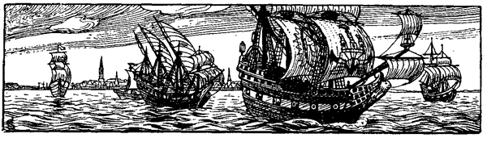

<h2>c. Frevel und Gewalttat.</h2>

<h2>Hamburger Seehelden.</h2>

<h3>Von Johannes Schmarje.</h3>

Über die Helgoländer Allee, den ehemaligen Stadtgraben, spannt
sich in kühnem Bogen die Kersten Miles-Brücke. Sie trägt als
Schmuck die Wappen von 32 früheren Hansestädten, während an
den Pfeilern die Standbilder vier berühmter Hamburger Seehelden
angebracht sind. An der Südseite links sehen wir das Standbild
des 1420 gestorbenen Bürgermeisters Kersten Miles, der dem adeligen
Land- und Strandräuber, dem Herrn von Lappe, das feste Haus
Ritzebüttel mit dem heutigen Cuxhaven entriß und sich so als
weitschauender Politiker bezeigte, indem er seiner Vaterstadt diesen
wichtigen Punkt an der Elbmündung zu verschaffen wußte. An
dem andern Pfeiler der Südseite fesselt uns das meisterhaft ausgeführte
Standbild des Seehelden Simon von Utrecht († 1437). 

Gerade so, muß man meinen, hat der kühne Seeheld ausgeschaut,
als er auf der Höhe von Helgoland seine Kriegskogge, die in alten
Liedern vielbesungene »Bunte Kuh«, zum Angriff gegen den gefürchteten
Seeräuber Störtebecker führte. Den besiegte er und brachte
ihn gefangen nach Hamburg. Zum Andenken an die kühne Tat,
ist das Modell der »Bunten Kuh« im Hamburger Ratskeller aufgehängt.
An der Nordseite der Brücke erblicken wir die Standbilder
der Seehelden Ditmar Kohl († 1563) und Jakob Karphanger.
Letzterer lieferte 1678 mit der Fregatte »Kaiser Leopold« fünf französischen
Kaperschiffen in der Elbmündung ein siegreiches Treffen.
Fünf Jahre später ging er auf einem Zuge gegen die Korsaren im
Hafen von Cadix mit seiner brennenden Fregatte »Wappen von
Hamburg« zugrunde, nachdem er zuvor seine Mannschaft in Sicherheit
gebracht hatte.

Von Ditmar Kohl aber soll hier ausführlicher erzählt werden.
Wir folgen dabei dem anschaulichen Bericht, den ein Zeitgenosse
unseres Helden in niedersächsischer Sprache für die Nachwelt abgefaßt
hat.

Die Überschrift lautet:

Volget ene waraftige Historie, wo Clawes Kniphof, ein weldich
seerouer, von den Hamborgern is genamen vnd gefangen vnd
vp dem Broke de kop afhouwen.

Der landflüchtige König Christian&nbsp;II. von Dänemark hatte einen
Haß auf die Hansen geworfen. Darum suchte er ihnen zu schaden,
wo er nur konnte. Derweilen er nun an befreundeten Höfen Hilfe
und Trost begehrte und endlich in Holland heimlichen Beistand gewann,
rüstete er im Jahre 1525 ein Geschwader von vier Schiffen
aus, mit dem er den Hansen zu schaden und gleichzeitig Norwegen
zu erobern gedachte. Die Ausrüstung der Schiffe und deren Bemannung
geschah zu Vere in Zeeland unter dem Schutz der Frau
Margareta, der Regentin der Niederlande. Öffentlich wurde
freilich von einem ehrlichen Kriegszuge und nicht von beabsichtigter
Piraterei geredet.

Das Hauptschiff des Geschwaders war »Die Gallion«, ein großer
Viermaster. Zur Unterstützung waren ihm drei andere Schiffe beigegeben:
»Der Bartum«, »Der fliegende Geist« und eine kleine
Jacht »Der weiße Schwan«.

Zum Hauptmann über dieses Geschwader setzte König Christian
einen jungen Mann, der sich durch seine kühnen Taten schon einen
Namen gemacht hatte. Er hieß Klaus Kniphof, war 24 Jahre alt
und der Pflegesohn des Bürgermeisters Johann Myeter zu Kopenhagen.
Zu ihm gesellte sich ein wilder Abenteurer, der »Rote
Klaus«, der bald sein Vertrauter wurde und einen schlimmen Einfluß
auf ihn gewann. Klaus Kniphof erhielt einen Kaperbrief,
der ihn mit weitgehenden Vollmachten über alle Schiffe, Schlösser,
Städte und Lande, die ihm Gott als gute Prisen verleihen würde,
ausrüstete. So ließ er denn die Werbetrommel rühren, und angelockt
durch die Aussicht auf reiche Beute hatte er bald einen großen
Zulauf von verwegenen Gesellen, Abenteurern und Glücksrittern
aller Art. Darunter waren sogar adlige Herren, wie z. B. der holsteinische
Ritter Benedikt von Ahlefeldt, der aber Anefeld genannt
wurde, weil er seine Güter verkauft und verpraßt hatte. Den Herren
von Amsterdam war das Beginnen Kniphofs unbequem; denn es
war allenthalben ruchbar geworden, daß er ein Seeräuber sei. Darum
sandten sie ihm Botschaft, er möchte die Schelde räumen, damit
sie nicht in Verdacht bei den Städten der Hansa kämen. Diese hatten
sich schon über ihn zu Brüssel beschwert. Infolge davon sah sich
auch die Regentin Frau Margareta genötigt, Siegel und Brief
an die Hansestädte zu schicken, daß sie Kniphof, so sie seiner habhaft
werden könnten, nach Seeräuberrecht behandeln möchten. Kniphof
mußte nun die niederländischen Gewässer verlassen. Er segelte in
die offene Nordsee und machte diese zum Schauplatz seiner Taten.
Jedes hanseatische Schiff, dessen er habhaft werden konnte, brachte
er auf; er plünderte an der norwegischen Küste und verübte Gewalttat
gegen Geistliche, Bürger und Bauern. Danach wagte er
sogar einen Überfall auf die Stadt Bergen mit ihren reichen Klöstern,
Stiftungen und Kirchen. Er hatte es besonders abgesehen auf die
berühmten Kontore der Hansestädte, in deren Gewölben er große
Schätze vermutete. Aber die Kaufleute brachten ihre Wehre zu
werke, so daß er ihnen nichts tun konnte.
 
Dieses böse Spiel verdroß nun billig die Hansestädte, also daß
sie die Hamburger angingen, den Freibeutern das Handwerk zu
legen. Die wollten sich erst nicht in die Sache begeben, aber die
Not forderte, daß sie es mußten wagen. Die Hamburger rüsteten
nun eine Flotte von vier Kraffeln<a class="refnote" id="rn1" href="#fn1">*)</a> aus. Das erforderte großes
Geld, nämlich dreißigtausend Gulden, und noch heutigentags sind
die andern Städte ihnen mit keinem Pfennig zur Hilfe gekommen.
Kurz vor Pfingsten waren die Schiffe aufgetakelt, mit wehrhaftem
Volk zum Kampf gegen die Seeräuber trefflich ausgerüstet und zur
Ausfahrt bereit. Simon Parseval wurde vom Rat zum Admiral
ernannt; er sowie Ditmar Kohl, Klaus Hasse und Dirk van Minden
befehligten je einen der vier Kraffeln. Darauf lief die Flotte aus
der Elbe und kreuzte während der langen Sommerzeit in den Gewässern
der norwegischen Küste; den sauberen Gast aber, den sie
allenthalben suchte, konnte sie nicht finden. Gegen den Herbst lief
sie die Elbe hinauf und kehrte unverrichteter Sache nach Hamburg
zurück. Das wollte dem Rat sehr wenig behagen; um sich nicht
schimpflicher Nachrede auszusetzen, gab er darum dem Admiral Befehl,
wieder in See zu laufen. Überdies hatte er kurz vorher
sichere Zeitung erhalten, daß Kniphof in der Osterems läge. Die
Schiffspatrone und Hauptleute waren es wohl zufrieden, ausgenommen
Hans Holk und Grote Helmke, die mochten nicht wieder
hinaus. Nachdem sie durch Asmus Stolte und Kord Blomen ersetzt
worden waren, gab Ein Ehrbarer Rat Befehl zur Ausrüstung
der Flotte, die durch zwei Bojer (kleine einmastige Fahrzeuge)
verstärkt worden war.

Kurz darauf erhielt der Rat eine zweite Nachricht, wie es sich
begeben hatte, daß Klaus Kniphof in die Osterems gekommen war.
Weil er sich vorgesetzt hatte, Norwegen zu erobern und es ihm
dazu an Volk und Viktualien gebrach, hatte er einen gefangenen
Hamburger Steuermann gezwungen, seine Flotte in die Osterems
zu steuern. Dort wollte er sich für die Kriegsfahrt ausrüsten.
Um seinen Hals zu retten, hatte der Steuermann dem Kniphof zu
Willen sein müssen. Es war ihm aber gelungen, bei höchster Fluttide
die Gallion auf eine Sandbank zu setzen, ehe Kniphof es hatte
hindern können. Da hatte das Schiff Not gelitten, einen Mast
eingebüßt und fürs erste festgesessen. Das Schiffsvolk hatte nun
den Steuermann über Bord werfen wollen, war aber daran durch
Kniphof verhindert worden; denn gegen ihn hatte der Steuermann
vorher geklagt, daß er die Schiffe gerne hineinbringen wolle, daß
er aber des Fahrwassers nicht kundig sei. Nun wußte der Steuermann
wohl um die Gründe und Untiefen in der Flußmündung
Bescheid, aber er hatte das Schiff mit Vorsatz auf den Sand gesetzt
und gehofft, die Hamburger würden es erfahren und mit ihrem
Volk darüber herfallen.

Als nun Ein Ehrbarer Rat von dieser Lage Kniphofs Kunde
erhielt, ließ er sogleich die Trommel rühren, daß sich jeder eilends
an Bord begebe. Das geschah am 3. Oktober, und der Himmel verlieh
der Flotte einen guten Ostwind, der sie schnell der See und dem
Feinde entgegenführte. Als sie Neuwerk ansegelte, erfuhr der Admiral,
daß Kniphof noch immer in der Osterems liege, um dort
Mannschaft für die Bezwingung Norwegens anzuwerben. Da ließ
er noch mehr Segel setzen; denn der Wind war günstig, so daß die
Flotte schon am 6. Oktober bei Gretsyl in den Meeresarm segelte,
den man die Grete nennt. Hier warfen sie vorerst Anker, und die
Hamburger Schiffspatrone und Hauptleute hielten einen Kriegsrat,
wer von ihnen mit Hilfe der beiden Bojer die Gallion entern solle.
Und weil jeder der tapfern Männer die Ehre des schwersten Kampfes
für sich begehrte, warfen sie das Los darüber. Und das Los entschied,
daß der Admiral mit den beiden Bojern, dazu Ditmar Kohl
mit seinem Kraffel sich auf die Gallion werfen sollten, und daß
Klaus Hasse den »Fliegenden Geist« und Dirk van Minden den
»Bartum« zu nehmen hätten. Die Hamburger Schiffe lagen am
6\. Oktober so ferne von der Flotte Kniphofs, daß sie einander wohl
sehen aber mit ihren Geschützen nicht schaden konnten.

Als nun Kniphof die Hamburger Schiffe gewahrte, rief er sein
Volk zusammen. Er hatte die Meinung, davonzufahren, wollte
sich aber zuvor mit seinen Gesellen besprechen, was sie dazu sagten.
Da haben sie geantwortet, er möchte nur liegen bleiben und die
Feinde herankommen lassen, sie wollten ihrer wohl mächtig werden.
Die Hamburger wären doch nur Apfelschützen, dererwegen sie unverzagt
seien. Und wenn die Kunde vor Fürsten und Herren käme,
daß sie vor den Apfelschützen geflohen wären! Die Schande wollten
sie nicht leiden; sie sollten sich wehren mit Macht und meinten auch,
daß sie die Hamburger Kraffeln mit ihren Kartaunen und Serpentinen
leichtlich in den Grund schießen könnten.

Als nun Kniphof aus dieser Antwort vernahm, daß sein Volk
unverzagt war, kriegte auch er frischen Mut und sprach: »Hei frisch,
liebe Gesellen, wir wollen Preis und Ehre einlegen. Dort liegen
güldene Berge, die sollen unser sein. Ein jeder Büchsenschütz lade
seine Büchse und jeder Konstabler sein Geschütz. Aber bei Leib
und Gut! er schieße nur auf die Kraffeln und nicht auf die Bojer,
damit wir Lot und Kraut nicht unnütz verschießen.« Dieser Befehl
hat ihm hernach großen Schaden gebracht.

Nun steckte Kniphof seine Fähnlein aus und ließ sie fliegen;
dazu lösete er drei Schüsse aus seinen größten Stücken, um die
Hamburger zu ehren und sie als achtbare Feinde willkommen zu
heißen. Solchen Kriegsgruß erwiderten die Hamburger geziemend,
indem auch sie drei ihrer größten Stücke losbrannten. Dabei ist es
am Abend des 6. Oktobers geblieben. Aber Kniphof, den das Grauen
biß, hat an selbigem Abend seinen Schiffsschreiber an Land setzen
lassen, damit er während der Nacht Volk in den Dörfern anwerbe
und auf die Schiffe brächte. Das hat der Schreiber getan. Er
brachte in der Nacht auf, wen er konnte, holte die Hausleute aus
ihren Betten und versprach ihnen große Dinge, wie sie große Beute
machen könnten, wenn sie nur eine Stunde helfen wollten. Die
Fischersleute und Bauern haben sich von ihm bereden lassen, sind
mit ihm aufs Schiff gegangen und sind auch hier in Hamburg
vors Gericht gekommen, obwohl sie nicht länger auf den Schiffen
hatten sein wollen, als Zeit dazu gehört, um den Schwanz eines
Pökelherings zu verzehren. Als der Tag hervorbrach, fragte sich
jeder, wie wohl sein Abend sein würde. Klaus Kniphof, der sich
sonst herrenmäßig kleidete, zog am 7. Oktober ein weißes Hemd
an, dazu ein blaues Wams und ebensolche Hosen, in welchem Anzuge
er auch gefangen nach Hamburg gebracht worden ist. Und
hernach im Kerker hat er seinem Beichtvater gezeigt, wie die Kugeln
die Hemdsärmel zerrissen und doch seine Haut nicht verletzt hätten.

Die Hamburger hatten großes Verlangen zum Kampf, nach
den Feinden stand ihr Begehr. Die Schiffspatrone ließen ihrem
Volke einen Morgentrunk verabreichen, nämlich Warmbier mit
Büchsenkraut (Schießpulver), wohl vermengt und ineinander gerührt;
und diesen zarten Trunk haben sie einander zugetrunken, bis sie
halb betrunken waren. Da wußten die Hauptleute, daß es losgehen
könnte. Sie redeten ihr Kriegsvolk nun also an: »Gesellen, nehmt
euch zusammen und habt der Feinde wohl acht! Wenn ihr euch 
von ihnen bezwingen lasset, so ist es gewiß, daß es euch wird kosten
Leib und Leben. Darum denket darauf, daß ihr es euren Vorfahren
gleich tut, die alle Seeräuber von der See geholt haben.
Auf daß die ehrliche Stadt Hamburg ihren Ruhm behalten möge!
Das wollet alle gedenken!«

Nun hatten die Hamburger Anführer beschlossen, daß die beiden
Bojer sich zuerst an die Gallion machen und ihr Deck beschießen
sollten. Sie rechneten darauf, daß die Geschütze der hochbordigen
Gallion über die kleinen Bojer hinwegschießen würden.

Das hatte Kniphof auch wohl bedacht und daher verboten,
auf die kleinen Fahrzeuge zu schießen.

Es war am Sonnabend, dem 7. Oktober morgens um 7 Uhr,
als die Hamburger zum Angriff schritten. Nun waren die flinken
Bojer die ersten an dem Feind. Sie legten sich längs der Gallion,
daß sie ihr Deck bestreichen konnten und schossen ihr manch guten
Kerl aus der Wehre. Kurz darauf kommt Simon Parseval, der
Admiral, mit seinem Kraffel heran, wirft seinen Draggen<a class="refnote" id="rn2" href="#fn2">*)</a> in die
Gallion, um sich daran festzumachen, und gibt die Ladungen seiner
Büchsen und groben Stücke auf den Feind ab. Die Gallion blieb
dem Admiral die Antwort nicht schuldig; aber ihre Kartaunen und
Schlangen, wiewohl sie Blitz und Donner auf den Kraffel spieen,
richteten nicht viel Schaden an; denn der Admiral hatte sein Volk
unter Deck beordert, so daß nur 12 Mann zur Regierung des
Schiffes oben waren. Nun riß aber der Draggen los, so daß das
Admiralschiff von der Gallion abtrieb.

Währenddessen hatte Klaus Hasse mit seinem Kraffel den »Fliegenden
Geist« angelaufen und wurde seiner Herr, bevor noch der
Hauptangriff auf die Gallion geschah. Weniger Glück hatte Dirk
van Minden. Er sollte den »Bartum« angreifen, lief aber auf den
Grund, ehe er herankam. Das ging Dirk sehr nahe, aber sein Volk
sandte er mit dem Boot den andern Hamburger Schiffen zur Hilfe.
Derweilen nun das Admiralschiff von der Gallion abtrieb, vergaßen
die kleinen Bojer ihren Dienst nicht; mit unaufhörlichem Schießen
setzten sie dem mächtigen Gegner tapfer zu.

Nun hielt auch Ditmar Kohl nicht länger zurück. Er hielt
seinen Kraffel hart auf die Gallion zu, um den Hauptangriff zu
wagen. Als Kniphof Ditmars Kraffel heransegeln sah, vermutete
er, daß auch dessen Volk unter Deck sein würde gleich wie im Admiralschiff.
Darum ließ er alle seine wehrhaften Männer aufs Deck und
an die Reling treten und befahl ihnen, den Kraffel sofort zu entern,
wenn er längsseit käme und seinen Draggen fallen ließe. So gedachte
er den Kraffel in seine Gewalt zu bekommen, ehe die Hamburger
sich dessen versähen.

Die Sache kam aber ganz anders. Ditmar Kohl war mit seinen
Hauptleuten eins geworden, es anders zu machen wie der Admiral.
Er rechnete darauf, daß die beiden Bojer die Gallion nicht umsonst
beschossen hätten. Darum rief er all sein Volk an Deck und gab
Befehl, daß sich jeder bereithalten sollte, sobald die Gallion herankäme.
Die Konstabler und Büchsenschützen sollten in der Hast ihre
Geschosse in den Feind feuern, und dann sollten die Enterhaken
und Faustrohre ihr Werk tun. Als nun Ditmar Kohls Kraffel
herankam, stand das Volk der Gallion dicht gedrängt an Deck, und
in diesen dichten Haufen schlugen nun die Kugeln aus den Stücken
und Hakenbüchsen der Kraffel, so daß sofort 30 Mann niedergestreckt
wurden. Da entfiel manchem Gesellen Kniphofs der Mut; sie vergaßen
das Entern und flüchteten unter Deck.

Als die Leute in den Bojern vernahmen, was Ditmars Volk
mit dem Schießen angerichtet hatte und daß es sich nun zum Entern
anschickte, da sind sie in ihre Boote gesprungen, haben sie schnell
an die Gallion gestoßen und haben dann ihr Deck erklommen.
Hier tobte ein wilder Kampf Mann gegen Mann, daß unter den
Tritten der Männer das Schiff erbebte. Und hinter den Kriegsleuten
der Hamburger wollten die Bootsleute nicht zurückstehen.
Sie ließen ihre Handbeile tanzen, gönnten keinem das Leben, sondern
wer ihnen vor die Faust kam, der wurde totgeschlagen. Die
Kriegsleute nahmen dagegen diejenigen gefangen, die um ihr Leben
baten. Nun trafen die Bootsleute auf den Roten Klaus, den sie
lange gesucht hatten, fielen über ihn her und zerhieben ihn in
Stücke, wie man das Fleisch zu einem Hamburger Grapenbraten
zerhaut. Mittlerweile war der Ausgang des Kampfes doch schon
außer Zweifel. Die Hamburger wurden Meister der großen Gallion.
Von Kniphofs Gesellen lagen die besten in ihrem Blute oder trieben
als zerhauene Leichen auf den Meereswogen dahin. Dem Herrn
Benedikt von Ahlefeldt war gleich anfangs die Schädeldecke (»de
pregenpanne«) weggeschossen; auch ein früherer Bürgermeister von
Kopenhagen lag unter den Erschlagenen. Als Kniphof das grausige 
Ende des Roten Klaus mit seinen eigenen Augen hatte ansehen
müssen, da wurde er inne, welch grimmig Volk die Hamburger Bootsleute
wären. Von ihren Beilen zerhauen zu werden, deuchte ihn
schlimmer als ehrliche Kriegsgefangenschaft. Darum haute er sich
durch die Bootsleute hindurch, bis er einen Rottmeister der Landsknechte
ersah, und zu dem sprach er: »Nimm mich gefangen, lieber
Krieger.« Der Krieger sprach: »Was ist dein Name, was bist für
einer?« »O lieber Kriegsmann,« sprach Kniphof, »ich bin der Hauptmann
der Schiffe, schone meines Lebens und verrate mich doch den
Bootsleuten nicht, denn die schonen meiner nicht.« »Höre,« sprach
der Krieger, »du sollst einen frommen Namen haben. Hinrik Moller
sollst du heißen, damit du unerkannt bleibest.« Kniphof gab dem
Rottmeister einen güldenen Ring dafür, daß er ihn so gefangen
nahm und ihn von der Gallion auf Ditmar Kohls Schiff brachte.
Ditmar Kohl erkannte den Gefangenen sofort, aber er brachte ihn
aus dem Wege; denn sein Hauptmann Cord Blome raste noch mit
den Bootsleuten umher, die jeden totschlugen, der ihnen in den
Weg kam; und insonderheit schrien sie nach Kniphof, dem wollten
sie seinen Lohn geben.

Dieses grimmige Spiel hatte nun wohl an die acht Stunden
gedauert, von des Morgens um acht bis nachmittags vier Uhr.
Kniphof war's sonderlich ergangen. Die Kugeln der Büchsen hatten
ihm seine Kleider auf dem Leibe zerrissen; seine Hemdsärmel waren
durchlöchert, und doch hatte seine Haut keine Schramme bekommen.
Er blieb auf Ditmars Kraffel, wiewohl der Admiral sehr darum
bemüht war, daß er selber den Gefangenen in Gewahrsam bekäme.
Aber daraus wurde nichts, Ditmar hatte ihn, behielt ihn und
brachte ihn auch nach Hamburg.

Während des Kampfes war der »Bartum« auf Grund geraten.
Da warf man das schwere Geschütz über Bord; denn der Hauptmann
gedachte, auf diese Weise das Schiff flott zu machen und
davonzukommen. Aber als es nichts helfen wollte, ließen sich etliche
der Freibeuter vom Bord ihres Schiffes ins Wasser in der Hoffnung,
Grund zu finden, aber sie wurden von den Hamburgern abgefangen
oder niedergemacht, ehe sie den Strand erreichten. Als
der Admiral Simon Parseval den »Bartum« auf Grund sitzen sah,
schickte er einen Haufen seines Volks mit dem Boote hin, der das
Schiff einnehmen sollte. Als das Boot längsseits des »Bartum«
kam, stießen die Freibeuter eine schwere Steinbüchse über Bord, 
um das Boot zu zerschmettern. Zum Glück konnten die Bootsleute
rechtzeitig ausweichen. Da schleuderten die Freibeuter Teile der
Ladung, Geschütze, Steinkugeln und, was sie zu fassen kriegen konnten,
ins Boot hinunter, so daß die meisten Bootsleute verwundet wurden
und Gott dankten, als sie wieder vom »Bartum« abkamen. Aber
ehe die Freibeuter sich dessen versahen, war einer der kleinen Bojer
herangekommen, hatte seine Leute aufs Deck des »Bartum« geworfen,
die sich nun mit Handbeilen an die Feinde machten. Als
das Admiralschiff heransegelte, um den Bojersleuten zu helfen, war
die Arbeit schon getan; wer nicht erschlagen war, wurde gefangen
genommen. Danach blieb dem Admiral nur noch die Einnahme
der kleinen Jacht übrig, in der nur wenig Volk war.

Die Hamburger hatten einen herrlichen Sieg erfochten; darum
ließen sie ihre Fähnlein fliegen, auf daß alle, so am Lande stünden,
sehen möchten, daß Kniphof durch Gottes Gnade geschlagen war.

Am Ufer bei Gretsyl standen viele Menschen, die von frühmorgens
an dem Kampfe zugesehen, und als sie nun den Sieg
der Hamburger vernahmen, erhuben sie groß Geschrei und Wehklagen
um das Geschick ihrer Gefreundeten, die an dem Kampfe
teilgenommen hatten. Auf dem Deich stand der Graf von Friesland.
Den hatte Kniphof zuvor gebeten, er möchte doch zuschauen,
wie kurz und gut er den Hamburgern aufspielen werde.

Danach verteilten die Hamburger ihre Gefangenen auf die Schiffe,
bei welcher Gelegenheit es die Bootsleute nach ihrer Weise »kurz
und gut« machten, indem sie die Gefangenen, die nicht unterzubringen
waren, totschlugen oder über Bord warfen.

Andern Tages wehte ein heftiger Sturm aus Nordwest, so
daß sie auf der Osterems liegen bleiben mußten und nicht einmal
an Land fahren konnten, um die Toten zu begraben; sie mußten
sie daher ins Meer werfen.

Danach richteten die Hamburger mit den erbeuteten Schiffen
und 162 Gefangenen ihren Kurs auf die Elbe. Der widrigen Winde
wegen ging die Fahrt nur langsam vonstatten. Ihnen voraus aber
flog die gute Kunde des glorreichen Sieges nach Hamburg. Da
schickte Ein Ehrbarer Rat zwei seiner Mitglieder, nämlich Herrn Dirik
Lange und Herrn Otto Bremer, den Siegern entgegen, um sie willkommen
zu heißen. Da die Herren nun in Ditmar Kohls Schiff
traten, haben sie Klaus Kniphof freundlich angeredet, ihn aufgefordert,
sich zu ihnen zu setzen, und gesagt: »Klaus, willkommen!« 
Er hat geantwortet: »Ja, meine Herren, ihr möget mich billig willkommen
heißen.« Danach setzten sie ihm einen Trunk vor mit den
Worten: »Trinket nur aus Eurem Becher, Klaus!« Antwortete er:
»Es ist nicht mehr mein Becher, sondern er gehört den guten Gesellen,
die ihr Leben darum gewagt haben. Und, meine lieben Herren,
das mögt ihr wohl wissen, ich hätte nicht geglaubt, daß solche Männer
in solchen grauen Wämsern steckten. Sie fielen zu mir ins Schiff
nicht, als ob sie Menschen wären sondern wie die Teufel!«

Danach am 22. Oktober, am Sonntag vor St. Katharinen-Kirchweih, 
wurden Kniphof und seine Gesellen ausgeschifft und durch
das Millerntor bis vor das Rathaus geführt. Von hier ging der
Zug nach dem Winsertore. Zu beiden Seiten standen bewaffnete
Bürger. Trommler und Pfeifer und fünf Fähnlein Landsknechte
zogen voran; dann ging Klaus Kniphof zwischen zwei seiner Mitgefangenen,
den Edelleuten Simon Gans und Jürgen Sidou. Darauf
kam das geringere Volk seiner Gesellen paarweise oder zu dreien.
Ein langes Tau lief zwischen ihnen hindurch, an dem sie hintereinander
festgeschnürt waren. Die Verwundeten, die nicht gehen
konnten, wurden mit einem Boot ans Rathaus gebracht und dort
reihenweise eingeschnürt. Kniphof wurde dann auf den höchsten
Boden des Winserturmes gebracht; ein Stockwerk niedriger sperrte
man die beiden Edelleute ein und den gemeinen Haufen in das
untere Gelaß, so viele ihrer dort Platz fanden. Die übrigen wurden
im Büchsenhause und im Brooktorturm untergebracht.

Desselbigen Tages kam ein Brief des Grafen Edgard von Friesland
an den Rat, des Inhalts, daß er Kniphof mit seinem Volk
und seinen Schiffen ausgeliefert haben wolle; denn sie seien auf
seinem Stromgebiet erbeutet worden. Noch an demselbigen Sonntage
forderte der Rat die Bürgerschaft auf das Rathaus, und man
beschloß, dem Grafen zu schreiben: wenn er ihr Volk und ihre
Schiffe haben wolle, so wollten sie ihm die wohl senden, die sollten
auch ihn holen, wenn er die Seeräuber verteidigen wolle. Der
Hehler sei so gut wie der Stehler. Auf diese mannhafte Antwort
hatte der Graf nichts weiter zu sagen.

Am 25. Oktober wurden Kniphofs Fähnlein in dem Dom über
dem Predigerstuhl aufgehängt. Am folgenden Tage ist Kniphof mit
etlichen seiner Gesellen vor Gericht geführt und daselbst von acht Uhr
morgens bis drei Uhr nachmittags verhört worden. Er wurde des
Seeraubs angeklagt -- nicht weniger als 172 Schiffe hatte er
geplündert und viel unschuldig Blut vergossen -- und als Seeräuber
verurteilt. Als Kniphof den Spruch der Richter vernommen, bat
er für seine Gesellen, die er zur Freibeuterei gezwungen hatte.
Dann wurde er wieder in seinen Kerker im Winserturm geführt, wo
er auf Veranlassung der Richtherren von dem Klosterbruder Stephan
Kempe ermahnt wurde. Und Kniphof schlug in sich und fand Trost
in Gottes Wort, so daß er seinen Tod durch Henkers Hand als
gerechte Strafe seiner vielen Sünden erkannte. Deshalb bereitete
er sich mit Hoffnung auf die Absolution und das Sakrament mit
Freudigkeit zum Tode.

Am Montag, dem 30. Oktober, wurde Kniphof nach dem Grasbrook
geführt, an den Ort, wo man angesichts des freien Elbstromes
seit uralten Zeiten die Seeräuber zu enthaupten pflegte. Es war
frühmorgens, als der Frohn ihn ganz allein abholte; denn dieses
hatte er sich als eine Gnade erbeten, damit es ihm nicht das Herz
breche, wenn er die Verwünschungen der durch ihn ins Verderben
gebrachten Genossen vernehmen möchte. Ohne Furcht und Zagen
schritt der junge, schöne Hauptmann zwischen den Bütteln und Landsknechten 
durch die dichtbesetzten Straßen. Auf dem St. Katharinenkirchhof 
wartete schon sein Beichtvater Stephan Kempe. Der erteilte 
ihm hier vor allem Volk, das betend niederfiel, die Absolution und
das heilige Sakrament der Versöhnung. Dann ging's zum Brooktore
hinaus, und am Strand der Elbe, auf derselben Stelle, wo
vor 123 Jahren Klaus Störtebecker mit seinen Gesellen den Tod
von Henkershand erlitten hatte, empfing er mit gefalteten Händen
den Schwertstreich, der sein Haupt vom Rumpfe und seine Seele
von der Erde schied.

Eine Stunde später wurden 16 seiner Gesellen zur Stelle gebracht
und enthauptet; und am 10. November empfingen noch 46
ihr Urteil, das lautete auch auf den Hals. Als sie das hörten,
sind sie ganz wild geworden und haben auf den Rat und die Bürger
gescholten. Aber es half ihnen nichts, am Montag nach Martini
wurden sie abgehauen. Danach am 24. November wurden 26 und
am 4. Dezember 20 Gefangene freigesprochen, der Ursache willen,
daß Kniphof sie zu seinem Dienst gezwungen hatte. Am 13. Dezember
wurden wieder 8 Freibeuter, darunter der Edelmann Simon
Gans verurteilt und Montags darauf hingerichtet. Im ganzen erlitten
75 Freibeuter ihren Tod von Henkershand. Ihre Köpfe aber
wurden auf hohe Pfähle gesteckt allen bösen Gesellen als weithin 
sichtbare Denk- und Warnungszeichen. Die alte plattdeutsche Chronik,
die wahrscheinlich aus der Feder des Paters Stephan Kempe stammt,
schließt ihren Bericht mit den beweglichen Worten: »Hebben se de
rechtsculdigen gestrafet ond de onsculdigen losgelaten, dat is Gade
dem Heren am besten bekant. Auerst o here, barmhertige God,
dorch dine grote barmherticheit erbarme di der, de in dusser sake
sint ommegekamen! Amen.«

Nach einer niedersächsischen Chronik.

<a href="#rn1">*)</a> Solch ein Kraffel war ein zweimastiges Seeschiff, etwa von der Größe
eines heutigen Schoners, jedenfalls viel kleiner als die Gallion Kniphofs.

<a href="#rn2">*)</a> Ein Draggen ist ein kleiner Anker mit vier Zähnen, wie er noch heute
auf den Elbfischerbooten gebraucht wird.

 
