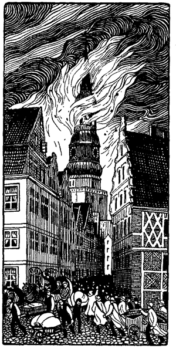

<#include "pagebreak.ftl">
<h2>d. Dunkle Tage.</h2>

<h2>Der Brand der Nikolaikirche in Hamburg am 5. Mai 1842.</h2>

<h3>Von Carl Reinhardt.</h3>

Ein wochenlang anhaltender Ostwind und Sonnenschein hatte die
jahrhundertealten Bauwerke der Hansastadt bis zur äußersten
Dürre ausgetrocknet.

Der immer stärker werdende Wind trieb einen glühenden Aschen- und
Funkenregen über die Stadt und jagte das Flugfeuer vor sich
her. Die brennbaren Sachen aus den Speichern stiegen turmhoch
in die Luft, wobei sie ein furchtbar prachtvolles Schauspiel
\<@pagebreak 124/>
gewährten. Dann verteilten sie sich, garbenmäßig herabsinkend und
wurden vom Wind in unbewachte Bodenluken oder zwischen die
Holzgesimse getrieben, wo sie zündeten und Feuer, Schreck und
Verwirrung weitertrugen.

Der alte Nikolaiturm ward manchmal von solchen glühenden
Funkenschwärmen gänzlich eingehüllt. Brennender Schellack und
dergl. legte sich auf sein Kupferdach, und durch die offene Kuppel
flogen solche Massen Flugfeuer, daß die Leute darin oft von der
Brandseite weichen mußten. Nur ein kleiner Schornsteinfegerjunge
saß in halsbrecherischer Stellung vor dem Geländer und kehrte die
Funken mit einem Besen von den schadhaften Stellen, wo das Kupfer
vom Wetter zerfressen und das Holz darunter sichtbar war.

Es wurde dem alten Turme aber dennoch zu heiß. Das Kupfer
begann an mehreren Stellen abzuplatzen, weil das Holz so zusammentrocknete,
daß die Nägel nicht mehr hielten. Vom wochenlangen
Ostwind schon fast zur Mumie ausgedörrt, schwand bei der furchtbaren
Feuerhitze jeder Rest von Feuchtigkeit aus dem alten Gebälk.
-- Der ganze Holzaufsatz fing an zu knarren und zu knacken. Er
reckte und dehnte sich förmlich wie in todesangstvoller Feuerqual,
als ahne der Turm, daß seine letzte Stunde gekommen sei.

Der Türmer hörte entsetzt das spukhafte Leben, das sich im
Holzwerke über ihm regte und zog verzweifelt fort und fort an der
Feuerglocke.

Die Feuermasse verdünnte die Luft dermaßen, daß sich mehr
und mehr Wind erzeugte, der fast zum Sturme wuchs.

Die Spritzen waren machtlos. Der Stolz der alten Hamburger
Spritzenleute war gebrochen. -- Man mußte auf andere ungewöhnliche
Mittel denken, um dem furchtbaren Elemente einen Damm
entgegenzusetzen.

Aller Augen hingen am Nikolaiturm, der jetzt aus dem Flammen- und
Funkenmeer wie ein Leuchtturm hervorragte, den eine feurige
See umspült.

Der Turm hatte den 5. Mai in zwei Hälften geteilt und die
zwölfte Stunde geschlagen. Es war das letztemal, daß er dies tat.

Gegen 1 Uhr sahen tausend Augen eine leichte Röte zwischen
den Kugeln, welche die oberste Spitze trugen. Schwache Dampfwolken
schienen sich unter dem Kupfer hervorzuziehen. -- Man
hielt es für eine Täuschung, für den Widerschein des unten wütenden
Feuers.
 
\<@pagebreak/>
Die oben im Turme wußten es jedoch besser. Ihr Schreckensschrei
ward unten im Tumulte nicht gehört, aber man sah ihre
Bewegung. Der kleine Schornsteinfeger ließ seinen Besen herabfallen
und kletterte eiligst zwischen die Säulen hinein. -- Es zogen
stärkere Rauchwolken von der Spitze hinweg.

»Der Turm brennt!« -- -- Dieses Schreckenswort ward von
hunderttausend Menschen gleichzeitig im Umkreise der Stadt ausgesprochen.
-- Bisher waren es wachsende Gerüchte, die Stadt
und Vorstadt alarmierten. Dann bestätigten sie die wachsenden
Rauch- und Flammensäulen, und jetzt schrieb ein feuriger Finger
hoch oben vom Turme die Kunde, daß das Unglück über die Stadt
schreite. Der Eindruck war furchtbar, gleich dem, als die geheimnisvolle
Hand die feurigen Worte <i>mene, mene, tekel, upharsin</i> an die
Wand des Belsazerpalastes schrieb, in dem man bei frohem Mahle
saß. Wer die Schrift lesen konnte, erbleichte und sah, daß ein Tag
gekommen war, wie seit Davousts Scheiden keiner dagewesen. --
Mit dem Brande des Turmes war das Unheil vollständig entfesselt
und schritt riesengroß einher. Der Widerstand dagegen
begann zu sinken. Die Bürger standen neben ihren brennenden
Möbeln und hatten keinen Blick, keine Hand für sie. Die
Augen hafteten am Turme und fragten: »Wird man ihn retten
können?« -- --

Man versuchte es. -- Der Feuerbeamte Moltrecht stieg hinauf
und befahl zugleich die Kirchenspritze und Wasser nach oben zu
bringen. -- Die Kirchenspritze war nicht in Ordnung. -- Man
brachte Schläuche und Wasser auf den Turm und versuchte, einen
Wasserstrahl zwischen das brennende Gebälk zu leiten. Er langte
jedoch nicht hinauf. Es brachte irgend jemand eine Leiter. Moltrecht
lehnte sie an eine der Säulen und stieg mit dem Eimer hinauf,
um das Feuer zwischen den Kugeln auszugießen. Es war ein
schwindelnder Weg, eine waghalsig gefährliche Stellung. Die Leiter,
nur einen schmalen Stützpunkt an der runden Säule findend, würde
mit ihm, wenn sie ins Schwanken gekommen, durch die Kuppel
hinaus in die furchtbare Tiefe gestürzt sein. Er sah neben sich die
freie Luft mit Rauch und Funken erfüllt, unter sich den Hopfenmarkt
voller Menschen in Pygmäengestalten, Däumlinge, die alle ihre Gesichter
aufwärts gegen ihn gekehrt hatten. Seine Nerven waren
aber eisenfest, wie sie bei einem Manne in der Gefahr sein müssen.
Er rief den Leuten zu, die Leiter gut zu halten und goß den Eimer 
\<@pagebreak/>
nach den leckenden Flammen hinauf. Er traf sie aber nicht. Sie
züngelten hinter den Kugeln. Die Leiter war zu kurz.

»Ich möchte beim Teufel wissen, was dahinten steckt und Feuer
gefangen hat!« rief er, die flackernden Flämmchen betrachtend. »Die
Balken brennen noch nicht. -- Herr Gott! Nur eine ordentliche
Spritze herauf! -- Ich glaube, die Zimmerleute haben Hobelspäne
beim Bauen in den Ecken liegen lassen.«

»Nein, es sind Vogelnester zwischen den Kugeln!« schrie der
kleine Schornsteinfeger. -- »Dort, wo es brennt, ist ein großes
Habichtsnest, und dort und da sind Dohlennester, die verlassen sind,
seit der Habicht hier ist. -- Ich habe schon mehrmals versucht, die
Jungen auszunehmen, aber es ist nicht möglich, da hinauf zu kommen,
ohne den Hals zu brechen.«

»Es ist unverzeihlich, daß keine Leiter hier oben ist, um nach
solchen Stellen zu kommen und daß die Kirchenspritze in so jämmerlichem
Zustande ist!« riefen die Männer. -- Man versuchte nochmals,
die Glut mit den Eimern zu löschen, allein vergeblich. Sie
griff weiter, und es fing in der verdeckten Spitze an zu prasseln und
zu knacken. Bald fielen einzelne glühende Kohlen herab. Die
Flammen krochen unter dem Kupfer hervor und liefen nach dem
Kreuze hinauf. Der Sturmwind pfiff zwar durch die Säulen und
blies das Feuer auf Augenblicke aus, aber nur, um es dann wieder
stärker anzublasen.

Die Männer oben standen in verzweifeltem Schweigen. Einige
ergriffen die Flucht und eilten die Treppen hinab. Mehrere Zimmerleute,
die mit einem Stadtbaumeister heraufgekommen waren,
standen auf ihre Äxte gelehnt und blickten kummervoll auf das
Meisterstück und den Stolz der Zimmerkunst, den Holzbau des Turmes,
der jetzt der Vernichtung anheim fallen sollte.

Moltrecht sah ihre Mienen und ihre Äxte. Ein Gedanke fuhr
durch seinen Kopf.

»Hierher, Leute!« rief er. »Haut diese Säulen durch! -- Hier,
auf der Luvseite, wo der Wind herkommt. -- Dann stürzen wir
die ganze Spitze hinunter und retten so vielleicht das, was unter
uns ist.«

»Das geht nicht!« sprach der Baumeister, eine Prise nehmend.
»Wir müßten wenigstens die Hälfte der Säulen abhauen und dann
würde uns die ganze Geschichte über dem Kopfe zusammenfallen. --
Wir haben auch keine Zeit mehr. -- Da!« -- -- --

\<@pagebreak/>

Ein Regen von glühenden Kohlen und ein furchtbares Prasseln
der Flammen von oben folgte den Worten und trieb alle hinab.
Es war etwa gegen drei Uhr, als die Verteidiger des Turmes die
Flucht ergreifen mußten. Die alte Wendeltreppe, die aus dem
Holzbau herunterführte, knackte
und schwankte sehr bedenklich
unter der ungewohnten Menschenlast.
Der Feuerregen von
oben nahm zu und trieb zur
höchsten Eile. Dennoch blieben die
Hinabsteigenden einen Augenblick
verwundert stehen, als sie
die Töne des Glockenspieles
in so wilder Verwirrung erklingen
hörten, als ließen die
Glocken ihren Todesschrei erschallen.
-- Ein Krachen von
oben trieb jedoch alles in schleunigster
Flucht hinab. Die Glocken
verstummten. Das Feuer brach
in den Turm hinein; und oben
an der glühenden Treppe erschien
der kleine Schonsteinfeger,
der das Spiel noch einmal in
Bewegung gesetzt hatte, um die
oft gehörten und angestaunten
Klänge zum letztenmale zu
hören. Er sprang die brennenden
Stufen herab, wobei ihn die
Flammen und fallende Holzbrände
wie böse Geister verfolgten
und zu ungeheuren Sätzen
zwangen, als wollten sie Rache für seinen Kampf gegen sie nehmen.
Von Rauch und Funken geblendet, tat er einen Fehltritt und stürzte
eine Strecke hinab, wo er besinnungslos, mit einem zerbrochenen
Beine liegen blieb. Ein mitleidiger Spritzenmann trug ihn fort
und legte ihn in einer Straße auf ein Sofa, das er dort fand.

Etwa eine Stunde, nachdem die Männer vom Turme weichen
mußten, brach seine Spitze herab und zerschmetterte das Kirchendach 
\<@pagebreak/>
sowie das der Predigerhäuser, aus denen sogleich die Flammen
schlugen. Der Turm erschien jetzt wie ein riesiger Schmelzofen voll
Glut erfüllt. Die Luft stürzte unten in alle Öffnungen und fuhr
mit entsetzlichem Heulen und Krachen samt der Lohe oben hinaus.
Eine Flamme von nie gesehener Größe entstieg dem Holzbau, von
dem die Kupferdachung teils in grünen Flammen verbrannte teils
schmelzend herablief, bis das ganze innere Balkenwerk des Aufsatzes
rotglühend erschien, was den Anblick bot, als sei es von
purem Golde. -- Alle Blicke hingen staunend daran. Es war wie
in einem furchtbaren Zaubermärchen; denn die vier kolossalen Rinnen
mit den abenteuerlichen Drachenköpfen an der Galerie spien Kaskaden
von glühendem, geschmolzenem Kupfer hinab, das alles, was
lebte, unten verjagte. Die Glocken fielen in Tropfen hinunter;
und gegen halb sechs Uhr brach das goldige Gerippe zusammen und
trieb eine Glutsäule aus den Turmmauern gegen den Himmel,
welche die Höhe des Turmes vierfach überstieg und dem Ausbruche
eines Vulkans gleichkam. Dann erschien ein dicker, massiver Qualm,
der alles verhüllte und sich wie Hagel zur Erde herabsenkte, bis
er anfing, rötlich zu schimmern und ein unbeschreiblicher Kohlen- und
Brandregen daraus hervorbrach, der die Stadt nach allen Richtungen
überschüttete und an hundert Orten zugleich zündete.

Entmutigung, Flucht, Geschrei und Verzweiflung sowie unendliche
Verwirrung war die Folge dieser Szene. Kein Mensch
und keine Gegend der Stadt fühlte sich nun mehr sicher. Die Blicke
der Fliehenden kehrten nochmals nach dem Turme zurück, der Fuß
hielt an. -- Der Qualm war gewichen, und die glühenden Mauern
des Turmes und der Kirche standen klar in der Luft und zwar in
hellen, goldigen Farben. Die alten Spitzbogenfenster waren von
der innern Glut wie von geschmolzenem Gold erfüllt, während hoch
aus dem obersten Turmstumpf eine gigantische, spitze, hellgrüngoldige
Flamme ohne jeden Rauch flackerte. Eine Opferflamme auf dem
Grabe eines stolzen Bauriesen der nordischen Hansastadt, die weit
in das Land hinaus leuchtete und die Nachbarn zur Hilfe herbeirief.

So weit aber auch die Flamme ihr Licht hinauswarf, so weit
trat alles andere in den Hintergrund. Neugier und Mitleid für
die brennende Stadt erfüllte jedes Gemüt. Der Trieb zu helfen
erwachte, und was im Umkreise vieler Stunden zum Löschen der
Flammen dienen konnte, eilte dem Feuerzeichen des Turmes zu.

Aus: Carl Reinhardt, Der fünfte Mai. Lebensbild von der Unterelbe, IIlustr. Roman.
(Hamburg Kramersche Sort.-Buchhandlg. [Steudel &amp; Hartkopf].)

