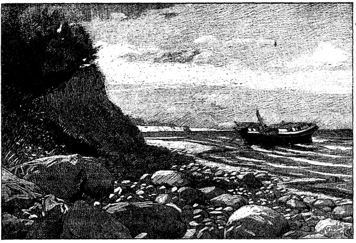

<h2>Die Sturmflut in der Ostsee am 13. November 1872.</h2>

<h3>Von Otto Kallsen.</h3>

Während die Nordsee nicht selten mit furchtbaren Überschwemmungen 
in das Besitztum der Menschen einbricht und
die Bewohner der Küste zu unablässigem Ringen mit dem wilden
Elemente zwingt, streckt sich die Ostsee wie ein großer Binnensee
friedlich hin; vom Ozean entlegen und durch die dänischen Inseln
beinahe abgesperrt, bleibt sie vom regelmäßigen Wechsel der Ebbe
und Flut so gut wie unberührt, und um ihr von Nordost nach
Südwest gedehntes, buchtenreiches Meeresbecken haben sich deshalb
Städte und Dörfer in reichem Kranz herumgelegt, und zwar in
sorgloser Sicherheit; denn nicht schützen Deiche den Anbau und das
Eigentum der Menschen.

Aber am 13. November 1872 zerriß eine Sturmflut, wie sie
noch nie über diese Gewässer dahingegangen war, den blühenden
Kranz am Gestade der Ostsee. Es mag immerhin, wie manche meinen,
ein unterirdischer Stoß wie bei einem Erdbeben die Wasser wild
aufgewühlt haben; sicher ist, daß ein heftiger Wind aus Westen das
sonst abfließende Wasser im Kattegat und in der Ostsee aufstaute,
bis der am 12. November nach Nordost umspringende Sturm den
vollen Wogenschwall mit um so größerer Wucht wieder zurückwarf.
Der furchtbare Nordost hielt 24 Stunden lang an und wuchs zum
Orkan. So quoll die hochgehende Wassermenge vom Finnischen
und Rigaischen Meerbusen her in südwestlicher Richtung vorwärts.
Die Küste Gotlands nur streifend traf sie mit vollem Andrang Bornholm
und andere dänische Inseln; die Südspitze von Falster wurde
sogar gänzlich überschwemmt. Dann verheerte sie die Insel Fehmarn
und warf sich mit unwiderstehlicher Gewalt auf die deutsche Küste
und in die tief ins Land einschneidenden Buchten hinein. Es war
ein Schrecknis von unerhörter Furchtbarkeit; das Wasser stieg mehr
als 3 Meter über seine gewöhnliche Höhe und übertraf den bisher
höchsten Wasserstand von 1694 um 60, den des Jahres 1836 um
67 Zentimeter. Wie entsetzlich die hochgeschwollene See vordrang,
beweist die Tatsache, daß die Stadt Oldenburg in Holstein, die zwei
Stunden von der Ostsee entfernt liegt, noch von dem Wasser erreicht
und ein Haus in der Stadt sogar noch verwüstet wurde. Niemand
war auf ein solches Naturereignis vorbereitet; denn wenn auch alte
Geschichtsbücher der Hansastädte von einer wilden Flut erzählen, 
die im Jahre 1304 die jetzige Insel Rügen von Pommern abriß,
so waren seitdem über fünf Jahrhunderte vergangen, und die Begebenheit
haftete nicht mehr in der Menschen Gedächtnis. Soweit
beglaubigte geschichtliche Nachrichten reichen, hatte man von einem
solchen Wüten der Ostsee nicht gehört. Man betrachtete anfänglich
auch diesmal das Anschwellen des Wassers allgemein als eine der
sonst wohl vorkommenden Sturmfluten, die gewisse Grenzen nicht
übersteigen; daher überraschte der Eintritt der wirklichen Überschwemmung,
die gegen neun Uhr abends ihren Höhepunkt erreichte,
fast überall in dem Maße, daß die Bevölkerung an der seichten, durch
Deiche nicht geschützten Küste sich kaum zu retten vermochte. Von
den Städten wurden Stralsund, Rostock, Warnemünde, Kiel, Apenrade
schwer beschädigt; am furchtbarsten litt Eckernförde an Schleswigs
Küste. Die kleine Stadt liegt auf einer schmalen, von Süden nach
Norden hinlaufenden Landzunge, die östlich von der Ostsee, westlich
von einem Einschnitt derselben, dem Windebyer Noor, begrenzt wird;
ein etwa neun Meter breiter, starker Damm verbindet die Stadt mit
dem kleinen Badeorte Borby. In der Frühe des 13. Novembers
rollte die Sturmflut an dem Strand empor, fegte die nahegelegene
Häuserreihe weg und drang in die Straßen der Stadt. Alsdann
wühlte das Wasser binnen anderthalb Stunden den mächtigen Damm
hinweg und füllte das Noor, bis es sich auch aus diesem wie aus
einer überfließenden Schale in die Straßen ergoß. Nur wenige
Stunden noch -- und die ganze Stadt wäre hinweggeschwemmt
worden; aber glücklicherweise sprang der Wind nach Südost um, und
das Wasser strömte rasch ab. Aber eine Stadt in Trümmern blieb
zurück; denn gegen drittehalb hundert Häuser waren zerstört oder
beschädigt, über 160 Familien obdachlos geworden.

Niemand vermag das Elend zu beschreiben, das diese Flut an
dem einen Unglückstage von der Insel Usedom an Pommerns Küste
bis nach Jütland entlang getragen hat. Wer möchte auch allen
Spuren des Verderbens leidtragend nachgehen? Es genüge, um das
entsetzliche Unglück zu fassen, ein Blick auf die holsteinische Küste.
Das Seebad Travemünde wurde arg verheert, in dem nahegelegenen
kleinen Badeorte Niendorf verloren 38 Familien ihr Obdach; die
Insel Fehmarn wurde fast ganz überschwemmt; am Sunde, der die
Insel von Holstein trennt, versank das Lotsenhaus mit seinen Bewohnern;
von dem Dorfe Dahme blieb nur der dritte Teil stehen,
40 Wohnhäuser zertrümmerte des Wassers Andrang; das kleine 

Ostseestrand

Rietbruch verschwand ganz; auf dem einzigen Hofe Klostersee ertranken
350 Kühe. Und ähnlich wie hier bot die ganze weitgestreckte
Ostseeküste ein Bild der Zerstörung; es war, als ob ein Todesengel
an ihr entlanggegangen wäre. Einzelne kleine Ortschaften wurden
gänzlich vom Erdboden getilgt, Tausende von Wohnhäusern zertrümmert;
weite, fruchtbare Landstrecken lagen mit ödem Schlamm
und Gerölle überdeckt; Wasser und Erde hatten sich in einen unfruchtbaren
Brei ineinander gemischt, für gewinnbringenden Anbau
auf Jahre lang unbrauchbar. Vielfach lagen die Schiffe, von
der Windsbraut fortgeschleudert, auf dem festen Lande, und ihr Kiel
furchte den Boden, über den bis dahin nur der Pflug hingegangen
war; einzelne waren in nahegelegene Waldungen geworfen, wo
sie wie ein Wrack zwischen den Bäumen festsaßen. Ungeheuer waren
die Verluste an Vieh, an Booten und Netzen der Strandbevölkerung,
an Hausgerät und allem, was durch Gebrauch und Andenken dem
Menschen wert und lieb ist. In Schleswig-Holstein allein überstieg
der Verlust an Eigentum drei Millionen Mark. Und nicht selten
weinte der seiner Habe Beraubte auch noch um das Leben eines
in der Sturmflut dahingerissenen Angehörigen.

Wunderbar war die Rettung eines Knaben. Als das Lotsenhaus
am Sunde von Fehmarn von den Wogen zerstört war, trug
die Flut das noch zusammenhaltende Gebälk des Daches in die
offene See hinaus. Daran klammerten sich der Lotse und sein
Weib und ihr dreizehnjähriger Sohn. Aber nach einigen Stunden
erlahmten die Kräfte der vom eisigen Sturme halberstarrten Menschen.
Eine Welle spülte zuerst die Frau hinunter in die Tiefe des Meeres,
eine andere verschlang bald danach den Lotsen. Nur der Knabe
hielt sich auf dem wunderbaren Fahrzeug, ja, er hatte die Besonnenheit,
die noch haftenden Ziegel des Daches abzulösen und
in die See zu schleudern, um auf diese Weise das Gebälk zu erleichtern.
So trieb er ohne Nahrung und Schlaf, einsam und
hilflos, von der Kälte des Windes und der spritzenden Wogen erstarrt
über 24 Stunden in der schaurigen Öde des Meeres umher;
zweimal sah er die Sonne aufgehen, und noch immer kam keine
Rettung. Endlich gewahrte ihn und sein seltsames Fahrzeug der
Kapitän eines französischen Schiffes; der menschenfreundliche Mann
setzte unter großer Gefahr ein Boot aus, und es gelang ihm, den
Knaben, der wie durch ein Wunder so lange das Leben gefristet
hatte, zu retten. Er brachte ihn in den Kieler Hafen hinein, und 
hier erholte sich das Kind unter sorgsamer Pflege so rasch, daß es
schon nach wenigen Tagen in die Heimat zurückgesandt werden
konnte.

Zweierlei Erhebendes nimmt der Mensch hinweg aus diesen
Schrecknissen der Naturgewalten. Man steht in dumpfem, starrem
Staunen am Gestade, sagt ein Augenzeuge, zu nichts fähig, als die
Allmacht zu bewundern, die nach diesem Riesenkampfe der Elemente
gegeneinander dennoch wieder Frieden zu stiften vermochte. Das
ist das erste: über unserer menschlichen Ohnmacht führt ein allmächtiger
und allgütiger Gott alles herrlich hinaus. Und das zweite: der
trübe, schaurige Novembertag hat viele schöne Werke barmherziger
Bruderliebe gesehen. Wie mancher hat wie im Liede vom braven
Mann hochherzig sein Leben für das Leben der Bedrängten eingesetzt,
wie mancher die Hungernden und Frierenden gesättigt und
bekleidet! Und als die Größe des Unglücks bekannt wurde, da ergriff
ein edler Wetteifer zu helfen und zu trösten das ganze Volk.
Hat doch die eine Stadt Hamburg über 300 000 Mark hergegeben,
und in Schleswig-Holstein allein sind 750 000 Mark an freiwilligen
Beiträgen zusammengeflossen. Und ähnlich rührte es sich im ganzen
großen Vaterlande; selbst unsere kaum zu uns zurückgekehrten
Brüder im Elsaß spendeten mit offenen Händen. Das scheint wie
ein freundliches Licht durch das Dunkel; und wie herbe auch das
Unglück gewesen ist, aus dem Menschenleid und Jammer wuchs
trostvoll die edle Blüte der Menschenliebe empor.

