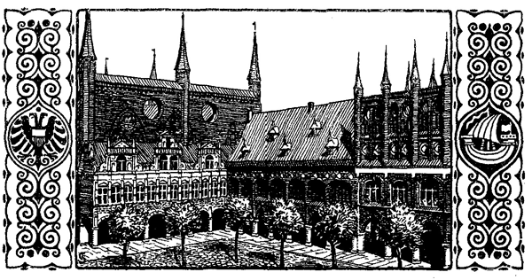

<h2>e. Im Kampf für Land und Volk.</h2>

<h2>Johann Wittenborg fordert auf zum Kampf.</h2>

<h3>Von Wilhelm Jensen.</h3>

Mit fieberhafter Tätigkeit wurden im Travehafen, auf den Werften
und Helgen bei Sonnen- und Fackellicht Schiffe gezimmert,
gebessert, gerüstet; der Handel zur See war völlig unterbrochen,
alle sonst ihm zugewandte rege Geschäftigkeit des Friedens wetteiferte
einzig zur Herstellung von Werken und Bedürfnissen des
Krieges. Überall aber ruhten die Augen Johann Wittenborgs
prüfend, ordnend, gebietend, selbst; er schien, zehnfach geteilt,

zugleich hier und dort zu sein, über die doppelte Anzahl von Tagesstunden
als andere zur Bewältigung aller seinen Rat und Entschluß
begehrenden Anforderungen zu verfügen. Das Wort »Krieg«
wurde noch von keiner Lippe laut gesprochen, doch jeglicher wußte,
daß auf den Bänken des »großen Hansesaales« droben im obern
Geschoß des Rathauses Abgesandte von Wismar, Rostock, Stralsund,
Greifswald, Hamburg, Anklam, Stettin und Kolberg, ja sogar von
Kulm und Danzig versammelt seien, zum erstenmal nicht als Vertreter
der Kaufmannsgilden ihrer Heimatorte sondern als Vollmachtsboten
der hanseatischen Städte selbst, über die dem Bunde der
deutschen Hansa zu Wisby zugefügte Unbill zu tagen und ihre Bereitschaft
zu sichern, der Bedrohung des gesamten Handels durch
König Waldemar vereinigte Waffengewalt entgegenzusetzen. Viele
laute Stimmen klangen vom Morgen bis zum Abend aus dem Rathaussaale
auf den Markt und die Breitestraße der Stadt hinaus, wo
eine gedrängte Volksmenge atemlos horchte. Droben jedoch schüttelte
manch bedächtiger Kopf sein graues Haar, eindringlich vor dem Unerhörten
warnend, daß man von den besonnenen Wegen der Väter
abweiche und eine Gemeinschaft von Kaufleuten sich zu kriegerischem
Unterfangen wider den mächtigsten Fürsten des Nordens vermesse.
Wie könne ein Bündnis von Städten, die nicht frei seien sondern
unter der Hand ihrer Landesherren, eine Gewalt aufbieten, zusammenhalten
und schlachtentüchtig ins Feld führen, um König
Waldemars Panzerrittern zu trotzen, da die Hansa doch bisher
nicht einmal allerorten auf der Ostsee ihre Schiffe vor gemeinen Seeräubern
zu sichern imstande gewesen? So ging die Ratschlagung 
manchen Tag, während in den Werkstätten draußen unablässig
Hammer und Amboß erdröhnten, Schiffsbeil und Säge; wechselnden
Meerwellen gleich schwankte der Ausfall des Entscheids hin und
wider. Es schien fast die Wagzunge sich auf die Seite der sorglich
Bedachtsamen zu neigen; denn sie erhoben den Antrag, der
Rat von Lübeck möge zuvörderst beschließen, um den Zorn des
Dänenkönigs nicht zu reizen, die lauten Zurüstungen einzustellen,
die der neue Bürgermeister eigenmächtig ins Werk gesetzt habe,
und es ward ersichtlich, daß der letztere vielfältig von den Geschlechtern
der Stadt nicht mit besonderer Gunst betrachtet wurde, vielmehr
wider ihren Willen zu seinem hohen Amt nur durch den Ungestüm
des Volkes nach der Botschaft von Wisby erzwungen worden. Da
trat in bedrohlicher Stunde Herr Johann Wittenborg in den stimmenhallenden
Hansesaal. Er kam eilig herbeigerufen von den Schiffswerften
des Hafens, geleitet von dem jungen Ritter Wernerkin;
und schwer vom Haupt zum Fuß im Eisenpanzer klirrend wie ein
Feldherr, der siegesmutig zum Angriff vorstürmt, schritt er rasch
die Stufen zur Rednerbühne hinan. Dort nahm er den Helm
von der Stirn, daß ein Ton der Bewunderung alle Köpfe unter
ihm überlief, wie sein unbedecktes Antlitz edelstolz, fest und mannesernst
und doch jugendkühn, mit blitzenden Augen über der kriegerischen
Rüstung vor sich hinaussah. Er begann, von dem hurtigen
Lauf noch erschöpft, mit unberedtem, seiner gewaltigen Erscheinung
nicht gleichgeartetem Stimmenklang, daß ringsum das Deutsche Reich
zerfalle und verderbe und das Haupt keinen Schutz mehr ausbreite
über seine Glieder. Darum wage der Sperber seine Fänge an
den geduldigen Leib des Königsadlers und hohnlache über die
stiebenden Goldfedern, die er von ihm herabstoße. Dessen hätte
sich keiner getraut, als die staufischen Kaiser noch gewesen und der
Löwenherzog an der Ostsee das Schwert des Sachsenreiches gehalten.
Doch gefallen liege alles, Kaiser und Reich, in Armut, Ohnmacht
und Entartung, daß in oberdeutschen Landen nirgendwo mehr Kraft,
Recht, Sicherung, Wohlstand und Gesittung zu finden sei als in
den ruhmvollen Städten stolzer und hochgesinnter Bürger zu Nürnberg
und Augsburg, Ulm und Regensburg, Leipzig, Frankfurt, Mainz
und Köln und wie sonst ihr weitgerühmter Name klinge. Ihrer
aller Blüte und Ansehen aber habe die nämliche Mutter gehabt,
die sie geboren und mit der nämlichen Milch zu unvergleichlichem
Wachstum emporgenährt, mit der Freiheit, Sicherheit und
Herrschaft des Handels, die heute als Lebensblut in ihren kraftstrotzenden
Gliedern rolle. Und ingleichem sei auch die großmächtige Stadt
Venedig durch den Handelsbetrieb des Kaufmanns allein zur Beherrscherin
des Mittelmeeres, zur Herrin des Morgenlandes, Kaisern
und Königen ebenbürtig geworden, wie dort der Ritter Wernerkin
es vor kurzem mit Augen gesehen und Wunderberichte davon heimgebracht.

Soweit hatte Johann Wittenborgs Stimme, ob auch allgemach
anwachsend, nur gleich derjenigen anderer Redner geklungen; nun
aber schwoll sie machtvoller empor und lief wie der Widerhall
eines tönenden Erzes an den Wänden um. So auch wie in oberdeutschen
Landen liege das Reich im Niederland ohnmächtig am
Boden, altersschwach und verspottet, und sei kein Schirm gegen Raub,
Gewalt und Willkür als im Mut und in der Faust jedes Mannes,
der nicht Schimpf und Unrecht zu dulden gewillt sei. Solcher Feigheit
zwar schuldige er nur wenige an -- flammend lief der Blick
des Redenden über die Köpfe -- doch der Einzelne fühle sich nicht
an Kräften dem Raubritter gleich, der ihn im Felde bedrohe, und
die einzelne Stadt fühle sich zu waffenlos wider die Gewalttat heeresmächtiger
Fürsten. So aber auch wie im oberdeutschen Lande seien
an der Ostsee reichblühende Städte aufgewachsen an den vollen
Brüsten des Handels, bis heute indes jede ein Rohrhalm nur, im
wechselnden Winde schwankend, gemeinsamen friedlichen Vorteil nachtrachtend, 
doch in der Gefahr des Einzelnen keinen gemeinsamen
Feind erkennend. Nur Geldesfreundschaft zum Gewinn habe zwischen
ihnen gewaltet, nicht Blutstreue zu Schutz und Trutz, auf Leben
und Tod. Darum habe eine räuberische Faust frech sich nach Gut
und Leben der Kaufleute auszustrecken gewagt.

Wie Schwertklang schnitten die Worte des neuen Bürgermeisters
von Lübeck durch die laut- und atemlos unbewegte Luft des
Saales:

»Wollt ihr Rohrhalme verbleiben, von jedem Wind gebrochen?
Ein Wort von euch schnürt sie zum Pfeilbund, der unzerbrechlich
ist! Wollt ihr das Lebensblut in euch verströmen lassen, wo gierige
Hand ihm die Adern aufreißt? Seid ihr dazu gekommen, so geht
nach Hause, reißt die Mauern eurer Städte nieder; denn ihr tragt
kein Blut in euch, sie zu schützen -- werft Feuer in eure Schiffe,
denn ihr braucht sie nicht mehr! Bittet Waldemar Atterdag, daß
er auch eure Kaufhöfe zu Bergen und Nowgorod seinen Töchtern 
zur Mitgift gibt und die Ostsee von euch zum Geschenk nimmt!
Kniet hin vor ihn und bittet, daß er den ermordeten Bürgern der
edlen Stadt Wisby vergibt, daß ihr Reichtum seine Gier gereizt,
und leistet ihm Eidpflicht, Gold und Gut eurer Stadt ihm vor
die Füße zu leeren. Denn wenn ihr ihm heute eure Habe, eure
Rechte und Freiheit nicht bringt, wird er morgen zu euch kommen,
sie zu holen.«

Ein lautes, wirres Stimmengetöse brach hinter den Worten
des Redners drein. »Einen Hansebund zu Schutz und Trutz! --
Krieg gegen Dänemark! -- Sieg oder Untergang!« Nur da und
dort regte noch einer der vorherigen Warner zu flüsternder Abmahnung
die Lippen; Johann Wittenborg aber riß scharf klirrenden
Tones sein langes Ritterschwert aus der Scheide und rief, daß
es weit über die tausendfach gedrängten Köpfe drunten auf dem
Markt hinaushallte:

»Was steht ihr noch, zu raten und zu raunen! Seid ihr Memmen
oder Männer der Löwenstadt? Ihr habt bis heute mit Wage und
Maß gehandelt, hier ist eine neue Eisenelle für Waldemar Atterdag,
laßt ihn sein blutiges Königsschwert daran messen! Falle
dieses auf meinen Kopf, wenn der Handel mißlingt! Ihr ruft:
Krieg wider Dänemark! Ich rufe: Herab mit der Dänenherrschaft
auf der deutschen See! Gebrochen sind Kaiser und Reich und zerrissen
liegt die stolze Sachsenmacht des Löwenherzogs. Aber die
Stadt, die seine Hand aufgerichtet, steht, und sie ruft auch aus
meinem Munde: Eine Stadt der Hansa für alle, und alle für eine,
oder gehet unter in Armut, Knechtschaft und Verderben! Zu dieser
Stunde fällt eure Wahl -- ich aber schaue in kommende Tage und
sehe den Löwen wieder Wacht halten am deutschen Meer, doch nicht
mit Fürstenschild und Streitaxt sondern mit dem Schwert freier
Bürger der hundertköpfig für alle Zeit in Not und Tod verbündeten
Dudeschen Hanse!«

Und mit Augen, als gewahrten sie leibhaftig eine stolzragende,
glanzumleuchtete Zukunft vor sich gebreitet, hob der neue Bürgermeister
Lübecks das funkelnde Schwert hoch über sich empor; von
hundert Lippen im Saale aber brach donnernder Ruf: »Den Krieg!
Den Krieg! Schutz und Trutz wider Waldemar Atterdag! Rache
und Sühne für die edle Stadt Wisby! Gen Seeland aufs Meer
mit den Schiffen der Dudeschen Hanse! Herr Johann Wittenborg
sei ihr Führer und Feldherr!«
 
Und wie aufbrausender Sturm kam es tausendzungig vom Markt
zurück: »Johann Wittenborg sei unser Feldherr!«

Die Treppen herauf drängte das Volk, jeden Widerstand brechend,
jubelnd, tobend in den Ratssaal; scheu verstohlen raunte nur da
und dort ein Mund: Er steigt auf den Schultern des Pöbels über
die Geschlechter und setzt uns den Fuß auf den Nacken; verflucht
sei Waldemar Atterdag! Ein Haufen war nach der nahen Marienkirche
gestürzt, hatte die Läutstricke gefaßt, und plötzlich wogte der
eherne Glockenmund einer Stimme vom Himmel gleich in das
unermeßliche Getöse herab, das durch alle Gassen, in jedes Haus
den Namen Johann Wittenborgs rief, des Erretters, des Rächers,
des Kriegsoberhauptes der Dudeschen Hanse. Es war ein Tag,
wie die Stadt Lübeck ihn noch nie gesehen, seit Herzog Heinrich
der Löwe ihre ersten Steine zusammengefügt.

Aus: Wilhelm Jensen, Aus den Tagen der Hansa, Bd. 3.
(Leipzig, E. Avenarius.)

