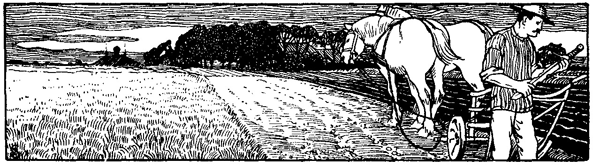

<@pagebreak 151/>

<h2>Die Schlacht bei Hemmingstedt.</h2>

<h3>Von Cajus Moeller.</h3>

Anfang Februar des Jahres 1500 stand das Heer der Fürsten an
der Grenze Dithmarschens; man harrte indes noch einige Tage,
ob nicht die Furcht im Rate der Gegner das Wort führe. Und wohl
ließen sich bei den Dithmarschern einzelne Stimmen vernehmen,
man müsse der Notwendigkeit weichend sich der ungeheuren Übermacht
unterwerfen. Aber die weit überwiegende Mehrzahl hielt
unerschütterlich am Vaterlande fest. Man flehte zu Gott und seinen
Heiligen und verließ sich im übrigen auf die besten Helfer tapferer
Männer: das gute Recht und das gute Schwert!

Als nun kein Bote kam, die Kunde von der Unterwerfung zu
überbringen, überschritten die Fürsten bei Hanerau die Grenze und
zogen ein in das verödete Land. Wie ausgestorben waren die nächsten
Ortschaften; die ganze Bevölkerung war mit aller ihrer Habe in die
nördliche Marsch geflohen. Über Albersdorf ging man auf die
Norderhamme los. Einige Dithmarscher, die, in den beständigen
blutigen Geschlechtsfehden aus der Heimat vertrieben, jetzt im Gefolge
des Feindes den heimatlichen Boden wieder betraten, widerrieten
den Angriff an diesem Punkte, wo er auch eines heißen
Empfanges sicher gewesen wäre. Überraschen müsse man die Bauern.
Man ging daher auf einem Wiesenwege schräg auf die Meldorfer
Straße zurück, so völlig unerwartet, daß zu Windbergen die vorangeschickten
leichten Truppen auf einen Hochzeitszug stießen, der sich
alsbald in bluttriefende Flucht warf. Dann ging es vor Meldorf,
in das die Dithmarscher ihre wenigen geworbenen Truppen als Besatzung
gelegt hatten. Bei den ersten Schüssen stoben sie auseinander,
die Stadt fiel wehrlos in der Feinde Hand; wehrlos ward,
was von Greisen, Kindern und Weibern nicht hatte entfliehen wollen
oder können, ein Opfer der Kriegswut. So war fast die Hälfte des
Landes und sein alter Hauptort ohne den geringsten Verlust dem 
<@pagebreak/>
fürstlichen Heere zugefallen. Hier rasteten die Fürsten; das Kloster
ward zum Hauptquartier, die Stadt und die umliegenden Ortschaften
lagen voll Kriegsvolk; drei brennende Dörfer leuchteten die
Unglücksbotschaft in die Marsch hinein, hinüber in das nur elf
Kilometer entfernte Heide, wo die ganze Mannschaft des Landes
versammelt war.

In stürmischer Sitzung wogten die Meinungen hin und her.
Auf billige Bedingungen Unterwerfung suchen, -- nach der Insel
Büsum fliehen und dort ruhig warten, bis sich der Schwarm des
Kriegsvolks verlaufen hätte: in so verschiedene Mäntel kluger Vorsicht
hüllte sich geschickt die Feigheit einzelner. Aber die bei weitem
größere Mehrzahl wollte nicht ohne Schlacht von einem Boden
weichen, der so viele beispiellose Siege gesehen hatte. Den Ausschlag
gaben die Weiber, die zum erstenmale in diesem Lande an
der Beratung teilnahmen. Nicht weiter dürfe man weichen, hier
sei eine Schlacht zu bieten, sie selber wollten mitstreiten. »Noch
ist nichts verloren, als was wir selbst freiwillig aufgegeben haben.
Unser sind die Hammen, wo jede Mannslänge die Leiche eines Edelmanns
getragen hat, unser die Schleusen, die, in der Flutzeit geöffnet,
das ganze große Feindesheer im Wasserschwall verderben
können.« Noch einmal überwog der Entschluß, alles an alles, das
Leben an die Freiheit zu setzen, die, von den Heldenvätern überkommen,
man den Söhnen unverkürzt vererben wollte, -- wenn es
sein müßte, mit dem eigenen Blute besiegelt. Den Todesmutigen
half das Geschick. Späher an Späher hatten die Fürsten von Meldorf
her entsandt; keiner kam zurück; bis auf einen büßten alle ihr
schmähliches Handwerk mit dem Tode. Der eine, ein Nordfriese,
erkaufte sein Leben mit den kurzen Worten: »Nächsten Montag
bricht man über Hemmingstedt nach Heide auf!« Diese Worte brachten
ihm und dem ganzen dithmarsischen Lande Rettung.

Näher an Heide als an Meldorf liegt Hemmingstedt, gleich den
beiden andern Ortschaften auf der Geest; aber der Weg von Meldorf
her geht durch schweres Marschland. Wie alle Marschwege im
Winter schlimm zu befahren, war er durch den Umstand, daß den
Sommer vorher alle umwohnenden Bauern ihre Wassergräben hatten
reinigen und die ausgegrabene schwere Kleie auf den Fahrdamm
hatten werfen lassen, bei nassem Wetter vollends unergründlich geworden.
Hier, wo ein alter Erdaufwurf, der durch mancherlei Spukgeschichten
zu dem Namen »Dusenddüwelswarf« gelangt war, den 
<@pagebreak/>
Weg durchschnitt, ließ jetzt einer der Achtundvierziger, Wulf Isebrant,
der im Auslande einige Kriegserfahrung gesammelt hatte,
eine Schanze aufwerfen, zu der Geschütz aus der nahen Norderhamme
herbeigeführt wurde. Angestrengt ward die ganze Nacht
-- vom 16. auf den 17. Februar -- gearbeitet; die Mannschaft
der drei Kirchspiele Hemmingstedt, Oldenwörden und Nienkarken vollbrachte
das Werk und bezog dann im Morgengrauen die vollendete
Erdfeste. Noch kamen einige Freiwillige hinzu, die ihr Leben wagen
wollten; die ganze Besatzung mochte tausend Mann stark sein. Eine
Jungfrau aus dem Kirchspiel Oldenwörden, durch das Gelübde ewiger
Jungfräulichkeit für die Männerschlacht geheiligt, trug das Kruzifix
als Banner voran. Die Losung war: »Hilf, Maria milde!« --
Einer von den Achtundvierzigern, Karsten Holm von Heide, gedachte,
sein Vaterland zu verraten. Er schlich nach Meldorf hinüber in
das Fürstenlager, lud die beiden Fürsten in sein Haus zu Heide
und schlich dann wieder zurück. Er wußte nichts von dem Anschlage
Wulf Isebrants oder spielte ein doppeltes Spiel des Verrats. --
Nichts von der Hemmingstedter Schanze verlautete im Fürstenlager.

Der Montag -- es war der 17. Februar 1500 -- kam langsam
herauf; die Luft verdunkelten Sturm und Hagelwetter, in Tau war
der starke Frost der letzten Tage umgeschlagen, Hagel und Schnee
trieb der Nordwest den Söldnern ins Gesicht. Da riet Marschall
Hans von Ahlefeldt zu warten; auch Junker Slentz, der von früheren
Feldzügen her wußte, was ein Marschweg bei Tauwetter zu bedeuten
hatte, stimmte bei; selbst Herzog Friedrich legte sein Ansehen
in die Wagschale. Umsonst. Die andern Gardehauptleute
sprachen für das Drauflosgehen: nach Heide werde man schon kommen,
das Wetter werde sich schon aufklären. Den Ausschlag gab der
König mit dem Bemerken, es seien ja doch nur Bauern. Eine kleine
Besatzung schützte den Besitz von Meldorf, der übrige schwere Zug
setzte sich in Bewegung. Voran war die Garde, Bürger und Bauern
bildeten das zweite Treffen, dann kamen die Ritter, zuletzt der unermeßliche
Wagentroß. Die Ritter trugen Festgewänder unter dem
Harnisch, teilten schon die Beute und beklagten nur, daß sie wohl
kaum mehr zum Schlagen kommen würden.

Plötzlich entstand in dem langsam aber doch beständig fortschreitenden
Zuge eine Hemmung; von vornher erdröhnte Kanonendonner.
Alles stockte; im Schlamm bis an die Knie steckend hielt
der Zug. Noch getröstete man sich, die Garde werde schon aufräumen. 
<@pagebreak/>
Sie tat, was sie konnte; sie stritt ihres Ruhmes wert. -- Die erste
Überraschung war groß aber kurz. Das Geschütz ward aufgefahren.
Spieße und Faschinen wurden über die Gräben gelegt; die Schlachtordnung
wurde ausgedehnt, die Schanze zu umgehen versucht. Alles
vereitelte die Natur des für seine Söhne mitstreitenden Bodens.
Gräben reihten sich an Gräben, durchschnitten die Schlachtordnung
immer bedrohlicher; der strömende Regen verdarb das Geschütz,
das die Dithmarscher in einem kühnen Ausfalle vergebens zu nehmen
oder umzuwerfen suchten. Furchtbar wüteten die Kugeln der nahen
Schanze in dem dichtgedrängten Haufen der Garde. Noch einmal
ward eine Umgehung der Schanze versucht: unerschrocken im Geschützfeuer
drangen die Kriegsgewohnten von Graben zu Graben vor.
Die Schlacht wankte.

Plötzlich stürzten dreihundert Männer, langbärtig nach Landesart,
voran die Jungfrau mit dem Kruzifix und der Lanze, aus der
Schanze hervor und fielen in ungestümem Angriff die Garde an.
Zweimal von der Überzahl zurückgeschlagen, warfen sie, um durch
größere Beweglichkeit den Nachteil ihrer Minderzahl auszugleichen,
Brustharnisch, Helm, Schild und Schuhe fort; barfuß mit unbedeckter
Brust sprangen sie mit ihren »Kluwerstaken« über die Gräben,
hinein in die Reihen der Garde. Die kurze Bauernhellebarde klirrte
gegen den langen Spieß der Landsknechte; die Kugeln der Schanze
schmetterten in das Gewirr hinein. Noch hielt die Garde stand,
selbst als nun durch die rechtzeitig geöffneten Nordseeschleusen der
Nordweststurm die Flut weit landeinwärts trieb und Wogen an
den Kämpfenden emporschlugen, mit Jubel von den Landeskindern,
mit Grausen von den fremden Kriegsknechten begrüßt, die nun in
fürchterlicher Enge ein Meer um sich, wachsende Feindesgewalt vor
sich, unlösbare Verwirrung hinter sich sahen. Hoch zu Roß im
Getümmel hielt Junker Slentz, feuerte an zum Streite, rief herab,
es möge einer kommen und es mit ihm aufnehmen. Der lange Reimer
von Wimerstedt aus dem Kirchspiel Nienkarken sprang heran, schlug
den Ritterspieß mit der Hellebarde zu Boden, hieb den Junker vom
Pferde, trat dem Überwundenen mit dem Fuße die im schweren
Panzer steckengebliebene Waffe tief in die Brust hinein und stürzte
den Röchelnden in den nächsten Graben. Erst als sie den Führer
nicht mehr sahen, wankte der Garden Kriegszucht. Wie aus der
Erde wuchsen die Dithmarscher hervor; furchtbar umdröhnte der Ruf:
»Wahr di, Garr, de Bur de kummt!« die sicherem Tode Geweihten. 
<@pagebreak/>
Stehen bleiben hieß den Untergang unfehlbar machen; die Trümmer
der Garde erkämpften sich die Flucht.

Die Schlacht war zu Ende, das Schlachten begann. Widerstandslos
fiel das zweite Treffen der Bürger und Bauern der siegreichen
Wut der Dithmarscher zum Opfer. Wenige entkamen; das
kalte Eisen oder die noch kältere Flut räumten furchtbar unter den
zwischen die Ritterpferde, die Wassergräben und die unbarmherzigen
Sieger Eingeklemmten auf, die, bis über die Knie in dem eisigen
Schlamme versunken, harren mußten, bis die Reihe des Verderbens
an sie kam. Jetzt beklagten die Ritter nicht mehr, daß sie gar nicht
einmal zum Schlagen kommen würden; über die mit Leichen gefüllten
Gräben setzten sie in wilder, zumeist doch vergeblicher Flucht.
Ringsumher wogten dichte Massen der erbitterten Feinde. »Slat
de Per, schont de Riders!« scholl der verderbenbringende Ruf. Die
getroffenen Pferde überschlugen mit ihren geharnischten Reitern;
unberührt von Feindes Schwert wurden die Ritter zerschmettert,
zertreten oder ertränkt. Über die Leichen der eigenen Brüder hinweg
entkamen endlich einige. Den altberühmten Danebrog, das
Banner des dänischen Reiches, noch im Tode in der starren Eisenfaust
festhaltend, sank hier nach blutiger Gegenwehr Marschall Hans
von Ahlefeldt, so im rühmlichen Tode ein langes Leben voll unmenschlicher
Freveltaten sühnend.

Die fürstlichen Brüder entkamen. Sie hatten wohl gleich zu
Anfang, als die Schlacht eine üble Wendung nahm, durch die Wagenburg
hindurch, -- die, zur Aufnahme der Siegesbeute bestimmt,
jetzt das gehetzte adelige Wild vollends umschloß, -- Rettung und
Flucht gesucht und gefunden. Das anbrechende Dunkel traf sie in
Meldorf. Noch gedachten sie, die Besatzung des Ortes zur Rettung
derer aufzubieten, die für ihre Herrschsucht da draußen eines grausamen
Todes sterben mußten. Als aber die Süderkirchspiele der Landschaft
auch hier sie anzugreifen drohten, wichen sie mit dem ärmlichen
Reste des stolzesten Heeres, das diese Lande seit Jahrhunderten
gesehen hatten, in eiliger Flucht über die Grenze zurück. Sie hatten
ihren Mut gekühlt.

Gegen 8000 Erschlagene deckten das Feld: 1426 allein von der
Garde, Unzählige von dem Bürger- und Bauernaufgebot, fünfzig
Rendsburger Bürger, das ganze fehmarnsche Aufgebot bis auf vierzehn.
Schwerer als die Mietlinge und Bürger verschmerzte man
die Blüte des Adels, die dort in jäher Ernte niedergemäht war. 
<@pagebreak/>
Beide Grafen von Oldenburg, 50 dänische, 50 märkische, über 200
schleswig-holsteinische Edelleute waren gefallen, allein 20 Poggwische,
Hans von Ahlefeldt mit 10 Geschlechtsgenossen; keine adelige Familie,
die nicht für die große Schlachtbank geschmückte Opfer gesandt hätte.
Jetzt verwesten sie, all ihres Glanzes und Schmuckes beraubt, nackt
auf dem Schlachtfelde. Als die Priors von Segeberg, Ahrensbök
und Bordesholm um die Leichen der beiden Oldenburger Grafen,
der Rantzaus und der Ahlefeldts baten, konnte sie niemand aus
dem modernden Haufen mehr ausfindig machen. Die Leichen der
Bürger und Bauern wurden beerdigt.

Unermeßlich war die gemachte Beute an Harnischen, goldenen
und silbernen Kleinoden, auch barem Gelds, das viele der reichen
Bürger mit sich geführt hatten, um bei der Versteigerung die Grundstücke
der Unterworfenen gleich bar bezahlen zu können. Ein besonderer
Schmuck war die Danebrogsfahne, erst 1497 von der Großen
Garde aus Schweden wiedergewonnen, jetzt in der Oldenwördener
Kirche zum Gedächtnis des herrlichen Tages von den Vätern, die
selbst mitgestritten hatten, dem jüngeren Geschlechts mit männlicher
Ermahnung oft gezeigt. Auch sonst wurden die Kirchen reich bedacht;
die Sieger demütigten sich vor dem Herrn der Heerscharen. Nur mit
einem Nonnenkloster, das man in der Stunde der Gefahr gelobt
hatte, wollte es nicht gedeihen; die Töchter des Landes verspürten
keinen Beruf zum Leben ausschließlicher Gottseligkeit. Man mußte
sich begnügen, kirchliche Dankfeste anzustellen und Seelenmessen lesen
zu lassen für die eigenen Erschlagenen, deren man an dem beispiellosen
Tage nur 60 verloren hatte.

