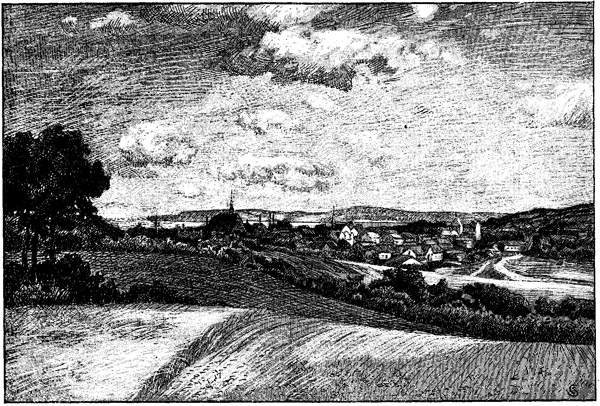

<#include "pagebreak.ftl">
<h2>Schleswig-Holstein.</h2>

<h3>Von Matthäus Friedrich Chemnitz.</h3>

<pre>Schleswig-Holstein, meerumschlungen,
deutscher Sitte hohe Wacht,
wahre treu, was schwer errungen,
bis ein schön'rer Morgen tagt!
Schleswig-Holstein, stammverwandt,
wanke nicht, mein Vaterland!

Ob auch wild die Brandung tose,
Flut auf Flut, von Bai zu Bai,
o, laß blüh'n in deinem Schoße
deutsche Tugend, deutsche Treu'!
Schleswig-Holstein, stammverwandt,
bleibe treu, mein Vaterland!

Doch wenn inn're Stürme wüten,
drohend sich der Nord erhebt,
schütze Gott die holden Blüten,
die ein mild'rer Süd belebt.
Schleswig-Holstein, stammverwandt,
stehe fest, mein Vaterland!</pre> 

\<@pagebreak 187/>

Eckernförde

\<@pagebreak/>
<pre>Gott ist stark auch in den Schwachen,
wenn sie gläubig ihm vertrau'n;
zage nimmer, und dein Nachen
wird trotz Sturm den Hafen schau'n!
Schleswig-Holstein, stammverwandt,
harre aus, mein Vaterland!

Von der Woge, die sich bäumet
längs dem Belt, am Ostseestrand,
bis zur Flut, die ruhlos schäumet
an der Düne flücht'gem Sand:
Schleswig-Holstein, stammverwandt,
stehe fest, mein Vaterland!

Und wo an des Landes Marken
silbern blinkt die Königsau,
und wo rauschend stolze Barken
elbwärts zieh'n zum Holstengau:
Schleswig-Holstein, stammverwandt,
bleibe treu, mein Vaterland!

Teures Land, du Doppeleiche
unter einer Krone Dach,
stehe fest und nimmer weiche,
wie der Feind auch dräuen mag!
Schleswig-Holstein, stammverwandt,
wanke nicht, mein Vaterland!
</pre>

