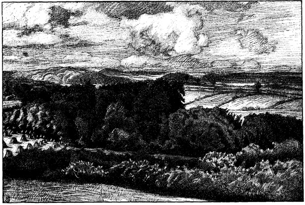

<#include "pagebreak.ftl">
<h2>In den Hüttener Bergen.</h2>

<h3>Schleswig-holsteinische Kriegserinnerungen aus dem Frühling 1848.</h3>

<h3>Von Felix Schmeißer.</h3>

Als wäre es heute gewesen, so steht mir ein Bild von jenem
Sonntagmorgen vor Augen. Es war am 26. März 1848. Am
24\. März hatte die Erhebung Schleswig-Holsteins durch die Proklamierung
der provisorischen Regierung in Kiel ihren Anfang genommen.

Meine Eltern hatten mich mit nach Hütten zur Kirche genommen,
doch ich muß gestehen, ich war an jenem Morgen wenig andächtig
gewesen, und aus der Kirche erinnere ich nur, daß der Sonnenschein
in breiten Streifen sich über die schwarz gekleideten Andächtigen
ergoß und die Stare draußen laut auf dem Dach lärmten. Desto
besser erinnere ich mich des Bildes, das sich nach Schluß der Kirche
entrollte.
 
\<@pagebreak 193/>
Der freie Platz vor dem Hüttener Kruge war von einer schwarzen
Menschenmenge angefüllt, zwischen der hier und da schon die Wagen
mit den vorgespannten Pferden zur Heimreise bereit standen.

Aber wer dachte an dem Tage ans Nachhausefahren?

Herrgott, war das ein Jubel, war das eine Begeisterung! Nicht
wiederzuerkennen waren die sonst so nüchternen phlegmatischen Hüttener
Bauern. Da wurde gesungen und geredet, hurrat und gejubelt;
noch niemals habe ich »Schleswig-Holstein meerumschlungen«
so aus vollem Herzen singen hören wie damals.

Da redete der Hegereuter Bracklow, der glühende deutsche Demokrat
-- »es lebe Schleswig-Holstein und Deutschland, es lebe
die Freiheit« --, da redete der Herr v. Wasmer von Friedrichshof,
der aristokratische Monarchist, -- aber jetzt waren sie sich einig, es
galt dem Vaterlande, und gleicher Beifall erschallte nach den Reden
beider. -- Und der Frühlingssonnenschein flutete durch das weite
Hüttener Tal, über Kirchhof und Dorfplatz und über die tausend
begeisterten Menschen.

Es war an einem der nächsten Tage. Der Hegereuter war
in unserem Elternhause, um Abschied zu nehmen.

Er wollte nach Rendsburg, um eine Freischar von Forstleuten
zu bilden, die die Büchse zu führen verstanden. »Ich gehe mit in
den Kampf für Freiheit und Recht, ich kann nicht zu Hause bleiben.«
Das ist, was ich noch heute von seinen Worten höre. -- Und dann
standen wir Kinder an der Straße und sahen, wie er das Dorf verließ.
Der alte Mars Gosch, ein guter Patriot, hatte es sich nicht
nehmen lassen, ihn zu fahren. Seine doppelläufige, von allen
»Krupschützen« abergläubisch gefürchtete Büchse steil in die Höhe
haltend, saß Bracklow mit seinem hageren, grobknochigen Gesicht
neben dem dicken, gemütlichen Bauern und erschien uns so doppelt
kühn und verwegen. Der mußte den Dänen ebensolche Furcht einjagen
wie den Krupschützen, meinten wir; ja, der würde die Dänen
schon kriegen.

Und während wir so unsere Meinungen austauschten, verschwand
der Wagen unten im Rendsburger Wege.

Wenige Tage später wollte mein Vater nach Schleswig fahren,
um den Einmarsch der schleswig-holsteinischen Truppen und Freischaren
zu sehen.
 
\<@pagebreak/>
Ich hatte ihn so lange gequält und gebettelt, bis er mir erlaubte
mitzufahren. Und jetzt waren wir in der alten Schleistadt.

Welch ein Leben an diesem Frühlingstage!

Alle Straßen voller Soldaten; Infanteristen und Jäger, Artilleristen
und Dragoner, alle noch in den verhaßten, nur wenig
abgeänderten dänischen Uniformen.

Turner, Studenten und andere Freischärler in Blusen und
Joppen, mit breitrandigem Schlapphut mit Kokarde und herabwallender
Feder, in phantastischen, aus Pferdedecken zugeschnittenen
Mänteln, die Gurte oft mit Pistolen und Dolchen gespickt. --

Auch Bekannte waren unter ihnen; da war Gerhard, der Sohn
des Barons v. Brockdorff vom Hüttener Hofe, da waren zwei
von meines Vaters Leuten aus der Papiermühle, da war hoch zu
Pferd der Herr v. Wasmer, der, wie unser Nachbar Bracklow,
selbst ein Korps gegründet hatte. Arm und reich, hoch und niedrig,
alles stand Seite an Seite in den Reihen der Freiwilligen.

Aus allen Fenstern flatterten schwarz-rot-goldene und blau-weiß-rote
Fahnen über sie hin, überall ward ihnen zugejubelt und aus
allen Türen reichten Frauen und Mädchen ihnen Erfrischungen. --

Als wir wieder auf der Rückfahrt waren und eben Busdorf
hinter uns hatten, löste sich von einer durchs Dorf reitenden Dragonerschwadron ein Offizier und sprengte unserem Wagen nach. Wir
erkannten den alten Baron Brockdorff vom Hüttener Hofe; sein
Gesicht war bleich und krank.

»Herr R., Herr R.,« rief er meinem Vater zu, ehe er noch unseren
Wagen ganz erreicht hatte, »helfen Sie mir, raten Sie mir, was
soll ich tun? Ich habe dem König von Dänemark die Treue geschworen,
und Schleswig-Holstein ist mein Vaterland. Helfen Sie
mir!« --

Meines Vaters Gesicht wurde ebenso ernst wie das des Barons.

»Herr Baron, so gerne ich's wollte, hier kann ich Ihnen nicht
raten; folgen Sie der Stimme Ihres Gewissens!«

Der Baron sprengte seiner Schwadron nach, und wir fuhren
weiter. --

Den Eindruck, den jene Begegnung auf den Knaben machte,
hat die Zeit nicht verwischt. Noch jetzt sehe ich oft die gequälten
Gesichtszüge, höre ich die hilfeflehende Stimme des schleswig-holsteinischen
Dragoneroffiziers. --

 
\<@pagebreak/>
Wieder waren ein paar Tage verstrichen.

Die Schlacht bei Bau war geschlagen und verloren, die heldenmütigen
Turner und Studenten waren aufgerieben. Trauer und
Niedergeschlagenheit war an Stelle der frohen Hoffnung in die
Herzen aller Patrioten gezogen. Wieder war ein sonniger Frühlingsmorgen
im Lande. Doch keiner achtete des Sonnenscheins, voll
Lärm und Aufregung war unser stilles Dorf; ein Teil der Freischaren
war eben auf seinem Rückzuge hier eingezogen und bald
war auch die Papiermühle voll von den abenteuerlichen Gestalten.

Den ganzen Tag waren wir Kinder bei ihnen und konnten uns
nicht satt sehen und hören. Sie waren besseren Muts, als man
glauben sollte; waren doch die Preußen und die Bundestruppen
inzwischen schon in Rendsburg eingerückt, und mit ihnen zusammen
wollten sie den Dänen Bau schon heimzahlen.

Noch höre ich sie ihre Lieder singen: »Nun wohlauf zu frohem
Singen,« »Reich mir die Büchse von der Wand« und »Hört ihr
das mächtige Klingen?« -- Am Abend wurden wir zu Bett geschickt,
aber wie hätten wir da einschlafen können! -- Wenn auch viele der
ermüdeten Kämpfer schon in tiefem Schlummer lagen, so war doch
noch ein fortwährendes Hin- und Herlaufen und Stimmengewirr
im Hause. Die Offiziere saßen mit Vater und dem Pastor zusammen
in der besten Stube. Dort sangen und tranken sie, dort brachten
sie Hochs auf Schleswig-Holstein und Deutschland aus, und wir
Kinder lagen und lauschten. Und wenn wir uns einmal im Nachthemd
an die Tür schlichen und durch Spalt und Schlüsselloch spähten,
dann konnten wir im rötlichen Lichtschimmer ihre Gestalten erkennen.

Zuletzt gingen wir doch wieder zu Bett, und der Schlaf siegte.

Am anderen Morgen, als wir erwachten, waren die Freischärler
wieder fort, und Haus, Mühle und Dorf lagen so still und verlassen,
daß uns alles schier wie ein Traum vorkam.

Wieder war ich mit meinen Eltern zur Hüttener Kirche. Eine
schwarze Menschenmenge umstand die geöffnete alte Erbgruft des
Hüttener Hofes, und die Glocken läuteten -- klagend, bang und
zitternd, so daß ich mich ängstlich an meinen Vater drückte. Der
Baron Brockdorff wurde begraben. Es war eine traurige, düstere
Geschichte. Er hatte keinen Ausweg gewußt, nicht beruhigen können
hatte ihn der Gedanke, daß der König selbst zuerst sein Wort
\<@pagebreak/>
gebrochen hatte. »Schleswig-Holstein ist mein Vaterland, und dem
König von Dänemark habe ich die Treue geschworen.«

Er war zum Prinzen von Noer gegangen und hatte dem seine
Not geklagt.

»Mein lieber Baron,« hatte der gesagt, »Sie brauchen ja nicht
gegen den König und Ihre früheren Kameraden in der Front zu
stehen. Wir brauchen auch Offiziere für die Grenzgendarmerie.
Sie können an die mecklenburgische Grenze gehen!«

Und der Baron war einverstanden gewesen und hingegangen.

Aber er hatte sich auch da nicht beruhigen können. Und als
da die unglückliche Schlacht bei Bau verloren ging, da hatte er gemeint,
die Sache müsse ungerecht und deshalb von Gott verlassen
gewesen sein. Da hatte er sich voll Verzweiflung erschossen.

Und während sein Sarg in die Gruft gesenkt wurde, standen
seine Söhne getrosten Mutes in den Reihen der Kämpfer für
Schleswig-Holstein. Sie kannten nur ihr Vaterland, sie gehörten
der neuen Generation an. --

Die Glocken läuteten durch das Hüttener Tal.

Nun war der Feind im Dorfe.

Es hatte zuerst eine furchtbare Aufregung gegeben, und viele
Patrioten waren nach Süden geflüchtet. Glaubten sie doch, die
Dänen würden jetzt schlimmer hausen als die Kosaken Anno 1813--14.

So schlimm wurde es nicht, aber viel besser auch nicht.

Viele Patrioten, die hier geblieben waren, hatten die Dänen
arretiert und fortgeschleppt, -- erst nach Eckernförde und von da
zu Schiff nach den dänischen Inseln hinüber. Besonders hatten die
Dänen nach den Waffen der Volksbewaffnung gefahndet. Mein
Vater hatte es aber vorgezogen, seine ohnehin unbrauchbare Muskete
gleich gutwillig abzuliefern. Täglich erwartete er den Besuch der
Dänen, er hatte schon alles für eine plötzliche Flucht vorbereitet. --

Im letzten Hause des Dorfes, am Wege, der durch die Berge
nach Brekendorf führte, bei Detlev Sohrt, lag eine starke dänische
Dragonerwache.

Wir Kinder hatten so lange gebettelt, bis Vater uns eines Tages
dahingeführt hatte und wir die langen kräftigen Kerle in ihren
Waffenröcken und blinkenden hohen Raupenhelmen aus gebührender
Entfernung anstaunen konnten.
 
\<@pagebreak/>
Am anderen Tage in der Dämmerung kam Vater mit einer
abenteuerlichen Nachricht aus dem Kruge nach Hause.

Er glaubte wohl, wir Kinder achteten nicht auf das, was er
Mutter leise erzählte, aber er irrte sich; wir ließen uns kein Wort
entgehen. Eben waren zwei als Bauern verkleidete Freischärler
im Kruge gewesen, um auszuforschen, wie viele Dänen im Kruge
lagen usw.

Sie hatten rein herausgesagt, wer sie waren und daß übermorgen
eine Schleichpatrouille von ihrem Korps die Dragonerwache
im Dorfe überfallen würde. Leichtsinn hätte man ihre Offenheit
nennen können, wenn man nicht gewußt hätte, wie sehr sich jetzt
ein Schleswig-Holsteiner auf den anderen verlassen konnte.

Das ganze Dorf wußte noch an demselben Abend Bescheid,
und wo am anderen Tage zwei Bauern zusammen auf der Dorfstraße
standen, da sprachen sie gewiß vom Überfall.

Jedermann war eingeweiht, nur die Dänen selbst waren ahnungslos.
Nur ein einziger Bauer war im Dorfe, der dänische Gesinnung
hegte und vielleicht imstande gewesen wäre, den Dänen
etwas zu verraten; aber er durfte es nicht wagen; als Verräter
würde er seines Lebens nicht mehr sicher gewesen sein.

Wir Kinder erwarteten den Tag des Überfalls, den 18. April,
wohl am allersehnlichsten. Kaum schlafen konnten wir mehr vor
Aufregung. Endlich, endlich war der Tag, endlich der Abend da.

Die Eltern schickten uns zu Bett, sie waren besorgt, wir könnten
auf die Dorfstraße gehen und ins Gefecht geraten.

»Geht zu Bett, Kinder, geht zu Bett. Glaubt doch nicht, daß
die Freischärler wirklich kommen. Deshalb schlaft ruhig ein!«

Aber wir wußten Bescheid, wir ließen uns nichts weißmachen.

Zu Bett gehen mußten wir zwar, aber ich tat es nur mit der
festen Absicht, so bald wie möglich wieder aufzustehen und mich
hinauszuschleichen. Und bald kam die Gelegenheit. Mutter schlief,
und Vater war ins Dorf gegangen.

Husch war ich wieder heraus und in den Kleidern. Und nun
lief ich hinaus auf die dunkle Dorfstraße. Totenstill und dunkel
war es, kein Lichtschein fiel aus den Fenstern, keine menschliche
Stimme war zu vernehmen, nur der Nachtwind rauschte im vorjährigen
verdorrten Laube der Knicks. --

Jetzt stieg der Vollmond mit rotgelbem Scheine auf, aber schon
verdeckten ihn schwarze, schwere Frühlingswolken. --
 
\<@pagebreak/>
Am östlichen Ausgang des Dorfes, nicht weit von unserer Mühle,
hielt der erste Dragonerposten regungslos zu Pferde; hin und wieder,
wenn die Wolken sich vom Monde verzogen, blinkte sein Helm auf,
nichts anderes war zu erkennen.

Da -- plötzlich leise Schritte und Stimmen.

Der Dragoner zuckte zusammen und horchte auf. Ein Knall,
ein Blitz -- er hatte einen Warnungsschuß abgefeuert und sprengte
ins Dorf.

Ein zweiter Warnungsschuß hallte beim zweiten dänischen Posten,
der weiter hinauf im Brunnenredder unter einer alten, in Sohrts
Steinwall stehenden Eiche seinen Stand hatte.

Von allen Seiten erscholl jetzt der Hufschlag der dänischen
Dragonerpferde, aber von allen Seiten tauchten jetzt auch die Schatten
der Freischärler auf, die jeden Weg besetzt hatten, und mit donnerndem
Hurra vordrangen.

Rasselnd und dröhnend stürzten die Dragoner in ungeordnetem,
wirrem Hausen ins Dorf zurück, immer enger von den Freischärlern
umschlossen. Auf dem »Klint«, einem freien Platz in der Mitte des
Dorfes vorm Kruge, wurden sie einen Augenblick später zusammengetrieben
und von allen Seiten umzingelt. »Ergebt euch, ihr seid
doch verloren, Widerstand ist nutzlos,« rief eine Stimme von den
Freischärlern.

Die Dragoner wollten sofort ihre Waffen hinwerfen, als eine
feste Stimme aus ihrer Mitte kommandierte: »Nej, skyder!« (Nein,
schießt!)

Noch zögerten die Dragoner, die das Unsinnige dieses Befehls
einsahen, ihm zu folgen, als dieselbe Stimme härter und schärfer
wiederholte: »Skyder!«

Ein Blitzen, ein Donnern, ein lauter Aufschrei auf der Seite
der Freischärler, -- aber noch war nicht das hundertfach rollende
Echo an den Hügeln und Wäldern ringsum verhallt, als auch schon
eine donnernde Salve der Freischärler erkrachte. Mehrere Aufschreie
folgten bei den Dänen. Deren Pferde bäumten sich hoch
auf und rannten wiehernd und schnaubend mit ihren Reitern nach
allen Seiten davon; das eine zerschmetterte sich beide Beine am
Steinwall des Brunnenredder.

\<@pagebreak/>

Die Hüttener Berge

\<@pagebreak/>
Aber nur wenige Sätze kamen sie vorwärts, da wurden sie von
den Schüssen der Deutschen wieder ohne Gnade auf den Klint
zurückgetrieben. Das war ein Stampfen und Wiehern, ein Dröhnen
und Schnaufen, das war ein Gestöhne, Gefluche und Hurrageschrei!

Dazu begannen die Dorfhunde zu heulen, und in den Fenstern
erschienen plötzlich Lichter, die ihren Schein auf den Klint mit seiner
wüsten Szene warfen.

Wenige Augenblicke noch, und die Dänen waren gefangen und
entwaffnet.

Von allen Seiten kamen jetzt die Dorfleute mit Essen und
Trinken für die Freischärler herbei. Das war einmal wieder eine
Freude und ein Jubel! --

Doch auch traurige Bilder gab es; in einem Hause lagen zwei
schwer verwundete Dänen in ihrem Blut.

In Klaus Jöns' Haus auf der großen Diele lag ein Freischärler
mit einem Schuß im Unterleib, und der alte Iwersen beugte
sich gerade über ihn, um die Wunde zu reinigen und mit Charpie
zu füllen.

Noch heute sehe ich dieses vom roten Dämmerlicht einer Stalllaterne
übergossene Bild vor mir. --

Und dann zogen sie wieder ab nach Süden; die Freischärler
zum Teil auf den erbeuteten Pferden reitend, die Dragoner zu
Fuß in ihrer Mitte. Und nach einer halben Stunden lag das Dorf
wieder in tiefer Ruhe. --

Gab das am anderen Tage ein Erzählen im Dorfe!

Zwei Dragoner waren doch nach Schleswig entwichen, aber
ihre Pferde mit allem Sattelzeug waren im kleinen Moor am Brekendorfer
Wege stecken geblieben und am Morgen dort gefunden worden.
Die Bauern brachten diese und die Sättel und Karabiner, die längs
dem ganzen Brunnenredder und Klint gelegen hatten, nach
Rendsburg.

Und als sie wiederkamen, erzählten sie, daß der eine Däne schon
seinen Wunden erlegen sei.

In Bünsdorf am Wittensee liegt er begraben, und kein Pastor
sondern ein Freischärler, ein Student, hat die Grabrede gehalten.
Aber nicht etwa über Gottes Wort, nein, über »Gestern noch auf
stolzen Rossen, Heute durch die Brust geschossen, Morgen in das
kühle Grab ...« Ja, das war eine Zeit! --

 
\<@pagebreak/>
Aber jetzt kamen die Dänen wieder!

Herrgott, so viele hatte ich noch nie gesehen.

Infanterie, Kavallerie, Artillerie.

Ich sehe noch die lange Kette der dänischen Infanterie in ihren
roten Fräcken durch die überschwemmten Wiesen neben unserer
Mühle waten.

Das war ein Schrecken! Man glaubte, daß die Dänen sich
jetzt sicher rächen würden; denn sie meinten, die Bauern hätten sich
am Überfall beteiligt.

Gleich nachdem die Dänen das Dorf besetzt hatten, kam der
alte Mars Gosch mit einer schlimmen Nachricht zu meinem Vater.
Sein Sohn stand bei der dänischen Infanterie, die eben ins Dorf
eingerückt war, -- da das Bataillon in Jütland lag, hatte er nicht
zu seinen Landsleuten übergehen können.

Als er mit seinem Bataillon von Schleswig in sein Heimatsdorf
eingerückt war, hatte er den Kapitän gebeten, zu seinem Vater
gehen zu dürfen. Aber die Dänen trauten dem Schleswiger nicht;
sie gaben ihm zwei Mann Bewachung mit. Da diese aber kein
Deutsch verstanden, hatte er seinem Vater doch sagen können, er
möge sofort zum Pastoren und zum Müller gehen und sie warnen;
die Dänen hielten sie für »Oprörsmänd« und würden sie unbedingt
fortschleppen.

Mein Vater ging schnurstracks zum Pastoren, und beide trafen
Vorbereitungen zur sofortigen Flucht.

Aber merkwürdig, wieder ging es gut, -- vielleicht weil die
Dänen zu schnell wieder fort mußten.

Denn wenige Tage später brach der 23. April herein, jener unvergeßliche
Ostersonntag.

Keine Osterglocken erklangen, aber von Schleswig und Missunde
hallte der dumpfe Kanonendonner den ganzen Tag bis in unsere
stillen Berge herüber.

Um die Mitte des Vormittags kam Hegereuter Bracklows Freischar
zu Wagen durch unser Dorf und wurde bewirtet; sie war vom
äußersten rechten Flügel auf dem Marsch gegen Missunde nach
dem Zentrum gerufen, und wenige Stunden später kämpfte sie
bei Schleswig an der Seite der Preußen und Schleswig-Holsteiner
im Tiergarten und Pulverholz wacker mit. Und in der Nacht noch
drang die Kunde vom Siege in unser Dorf. Die Heimat war frei,
deutsch und frei bis zum Sommer 1850.

