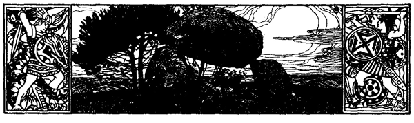

<#include "pagebreak.ftl">

<h2>Das Hünengrab.</h2>

<h3>Stimmungsbild vom schleswigschen Heiderücken.</h3>

<h3>Von Felix Schmeißer.</h3>

Oben auf der Heide liegt ein Hünengrab. Hoch und massig winkt
es dem Wanderer schon aus der Ferne über Heide und Feld
zu. Mannshoch wächst hier ungestört der grüne Ginster und bedeckt
jeden Sommer wieder die Höhe des Hügels mit einem Meer
von gelben Blüten. Und wenn er ausgeblüht hat und voll schwarzer,
schwerer Samenschoten hängt, dann steht ringsum die Heide in
ihrer violetten Blüte, und wo der Ginster ihr ein Fleckchen frei
ließ, da schimmert auch am Hügel ihre milde Farbe. Und die
Lerchen jubeln, die Grillen zirpen, die Bienen summen, und über
allem wölbt sich ein blauer Spätsommerhimmel. An einem solchen 
\<@pagebreak 208/>
Tage habe ich dort oben auf dem alten Hügel gelegen. Und in
traumverlorener Stunde stieg die Geschichte dieses uralten Grabhügels
vor mir auf. Noch im Abendröte habe ich sie niedergeschrieben.

Hier ist sie.

Auf den Heiden schlugen die Alten ihre Schlachten. Deshalb
blieben dort die mächtigen Gräberhügel, und deshalb geht auch die
Sage, daß die Heide einst vor Zeiten weiß geblüht, sich aber durch
das viele Blut rot gefärbt habe.

Hier über diese Heide ging die Grenzscheide zweier Völkerschaften,
die mehr im Streit als im Frieden miteinander lebten.
Und einst schlugen sie auf diesem Plane eine blutige Schlacht; die
Sperre sausten, die Schwerter und Keulen klirrten gegen die Schilde,
und vom nahen Walde hallte Waffengeklirr und Kampfgeschrei
wider. Erst da die Sonne tief im Westen stand, begannen die Mannen
vom Norden der Heide zu weichen. Die Sieger verfolgten sie, bis
sie im Krattbusche nördlich der Heide entschlüpft waren. Da gingen
sie mit jubelndem Geschrei zum Kampfplatze zurück. Es war ihnen
aber ein teurer Sieg geworden; rings herum im Heidekrauts lagen
unter den Verstümmelten und Leichen der Feinde auch die ihrer
eigenen Mannen, und unter ihnen auch ihr König. Als nun die
Knaben und die Sklaven die Leichname in das Lager am Waldrande
schleppten, da jammerten die Weiber laut; doch ein alter
Barde sang Ruhmeslieder von dem Heldentod derer, die jetzt bald
durch die Lüfte zum Allvater in der Walhalla reiten würden, und
die Männer erzählten sich mit gedämpfter Stimme von ihren Taten.

Dann streckten sie sich zum Schlummer. Ein dunkles Abendrot
leuchtete noch durch Wald und Dämmerung. Leise erloschen die
Feuer. Auf der Heide, wo die weißen Körper der gefallenen Feinde
durch die Dämmerung schimmerten, heulten die Wölfe.

Auf der Heide, wo sie gefallen waren, sollten der König und
seine Mannen ruhen. Fast einen Mond lang hatten die Sklaven
unter Bewachung von Freien den Grabhügel aufgeworfen. Die
höchste Stelle der Heide war dazu ausgesucht. Vom nahen Walde
holten sie schwarze, schwere Erde, da der lockere Heidesand allzu
leicht war. Die ganzen langen Spätsommertage arbeiteten sie in 
\<@pagebreak/>
ihrem Schweiße. Und wenn sie des Nachts um ihr Feuer ruhten,
dann heulten die Wölfe durch die Heide, wo noch die abgenagten
Gebeine der gefallenen Feinde lagen.

Hoch und dunkel ragte der gewaltige Hügel in die Dämmerung.

Die Sklaven, welche die letzte Arbeit beendet hatten, standen
auf seiner Höhe und sahen, wie der Abendnebel rings über die
Heide kroch.

Am anderen Tage kam ein seltsamer Zug über die Heide:
Voran vier Lurenbläser, die aus ihren mächtigen, sie überragenden
Instrumenten wunderbar klagende, feierliche Töne über die Heide
schmetterten, so daß die Lerchen schier verstummten. Hinter ihnen
wurden langsamen Schrittes auf einer langen Reihe von Bahren
die in Tücher gehüllten Toten getragen. Dann folgte ein langer
Zug von Männern und Weibern, deren bronzene Waffen und Zierate
wie Gold in der heißen Sonne glänzten. Schon war ein großer,
hoher Scheiterhaufen neben dem Hügel aufgerichtet und angezündet.
Sein Rauch zitterte bläulich durch die warme Sommerluft. Der
Zug machte Halt, die Leichen wurden nebeneinander in die Flammen
gelegt, die Luren verstummten und feierlichen Schrittes trat der
alte Skalde vor den Scheiterhaufen. Er sang Lieder von den Taten
der Gefallenen und unverständliche, geheimnisvolle Weisen. Als
endlich die Flammen erloschen, sammelte der Alte die Gebeine,
Asche, Waffen und Zierate der Toten in große irdene Krüge.
Schweigend wurden diese vom Volke in den Hügel gesenkt, mit
Steinen umstellt und mit Erde überschüttet. Einen Augenblick noch
blieb man stumm vorm Hügel stehen. Dann setzte sich der Zug
wieder in Bewegung. Wieder schmetterten die Luren. Ferner und
ferner. Noch ein letztes Herüberwehen der Lurenklänge; noch ein
letztes goldenes Glänzen an der Kimmung; dann waren die Toten
allein in ihrem Hügel. Und die Heidelerchen hoben sich wieder
hoch in die blaue Luft und jubelten ihre Lieder.

Die Heide verblühte, braun und düster lag sie im grauen Herbstnebel.
Dann fiel weißer, weicher Schnee auf sie und das Hünengrab.
Klingender Frost kam hinzu und in den Nächten, wenn der
Vollmond auf die beschneite Heide schien, brachen die ausgehungerten
Wölfe, die noch immer nicht den Fraß des Sommers vergessen 
\<@pagebreak/>
konnten, heulend aus Kratt und Wald. Doch das Hünengrab ragte
stumm und schweigend in die Winternacht. Und als der Schnee
schmolz, da grünte das erste Gras, der erste Ginster und das erste
Heidekraut auf der Decke des Hügels. Dann stand es in gelber
Ginster- und darauf in roter Heideblüte. Und wieder ging der
Sommer, kamen und gingen ein Herbst und ein Winter; und höher
wurde der Ginster, dichter das Heidekraut.

Und es kamen und gingen Jahrtausende.

Andere Zeiten waren hereingebrochen; man betete zu einem
anderen Gott und redete in einer anderen Zunge. Nur die Heidelerchen
sangen noch immer die alten Lieder, die sie vor Jahrtausenden
sangen. Auch jene beiden Völker, die einst auf dieser
Heide bluteten, lebten noch. Lange hatten sie miteinander in Frieden
gelebt, doch allmählich war der alte Haß wieder erwacht, und wieder
lagen sie miteinander im Kampfe. Und noch einmal sollte diese
Heide von ihrem Blute sich röten. Seit einigen Tagen lag die
schleswig-holsteinische Armee hier, den Feind vom Norden erwartend.

Ein junger Soldat in blauer Infanterieuniform erkletterte das
Hünengrab. Mit wehmütigem Genießen schweifte sein Auge von
hier über das weite, stille Land. Ringsherum Heide und Moor, noch
in grünem Kraute, hier und dort ein Flecken rosablühender Edelheide,
weißen Wollgrases und blauen Enzianes. Weiterhin gelbe
Haferfelder, magere Koppeln, einzelne einsame Katen und hohe
Wälder. Ein feiner, süßer Duft der blühenden Pfefferminzen lag
in der Luft. Still und feierlich war es. Horch, aus Nordwesten
klingt eine Dorfkirchenglocke halbverweht herüber. Es ist ja Sonntag
heute ... Der Tag des Herrn ... Und vielleicht der letzte
für den, der auf dem Hünengrabe träumt. Wie so voll und feierlich
klingen doch die Glocken der Vaterstadt; und wie dünn und
bang zittern diese ... Ach, daß er auch an diesem schönen Sonntagmorgen
die Todesahnung nicht vergessen kann! Immer und immer
kommt sie wieder.

In wenigen Tagen vielleicht würde er im kalten Moor liegen.

Ja, die Alten einst, die hatten ihren Toten bessere Gräber
gegeben in diesem Hügel mit seinem weiten Blicke über Heide, Feld
und Wald.

\<@pagebreak/>
Ein Gedanke durchzuckte ihn; wenn er dann fallen sollte, so
wollte er hier begraben liegen; hier oben, hoch über dem feuchten
Moor, wo dicht über seinem Haupte die Sonne scheinen und die
Lerchen singen würden. -- Ach, es würde schwer fallen, aber er
wollte doch seinem besten Kameraden, der drüben im Holze mit bei
der Feldwache lag, seinen Wunsch ans Herz legen; auf den konnte
er bauen.

Er setzte sich in eine Vertiefung zwischen dem Ginster und bedeckte
das Gesicht mit beiden Händen. Aber plötzlich riß er sich
los, stieg vom Hügel und ging über die Heide nach dem Holze zu.

Nach wenigen Tagen ging es wie ein Lauffeuer von Kamerad
zu Kamerad, daß der Feind vorrücke. An einem schwülen Vormittage, da ringsumher am Himmel schwere, schwarze Gewitterwolkenstanden, kam es zum ersten Treffen. Eine Kolonne stürmte auf der Landstraße vor, lange Ketten schwärmten ringsumher über Heide und Feld. Die Hörner schmetterten, die Trommeln wirbelten, die Schüsse donnerten und brüllten. Und hier und da stand das ausgedörrte Heidekraut in roten Flammen. So kämpften sie den ganzen Tag. Doch in der Dämmerung hielten Freund und Feind wie auf Verabredung inne. Dunkle Kolonnen zogen sich hüben und drüben zurück. Dann begann ein feiner Regen zu tröpfeln, und auf den dies- und jenseitigen Höhen hoben sich die Gestalten der Posten dunkel von der Dämmerung ab. Nirgends loderte ein Feuer, und die gedämpften Stimmen der Soldaten verhallten auf kurze Entfernung. Nur weiter zurück, auf der Landstraße, hörte man hin und wieder den Hufschlag eines Ordonnanzpferdes oder das Rollen eines Trainwagens.

Oben auf dem Hünengrabe gruben drei Soldaten ein Grab für
einen Kameraden, der mit zerrissener blutiger Stirn im hohen Ginster
lag. Dabei stießen sie auf einige graue Urnen. Achtlos warfen
sie die beiseite. Und als sie ihren Kameraden sanft und behutsam
ins Grab gebettet hatten, da schaufelten sie die Scherben mit ins
Grab zurück.

Tränenden Auges blieben sie noch eine Weile neben dem Grabe
stehen. Ringsum am Himmel zuckten Blitze, der Nachtwind rauschte
durch den Ginster, und der Regen wurde strömend.

\<@pagebreak/>
Da der Tag graute, begann die Schlacht von neuem. Die Kolonnen
wallten durch Nebel und Regen, trüb flammten hier und
da Fanale auf, und Wald und Heide erbebten im Donner der Geschütze. Mitten in der brausenden Schlacht lag das Hünengrab --
in Nebel und Pulverdampf gehüllt -- stumm und schweigend.

Auch über dem neuen Grabe dort oben blühen Heide und
Ginster schon viele Sommer lang. Und an heißen Sommertagen
jubeln hoch darüber die Lerchen ihre Lieder wie vor Jahrtausenden.

