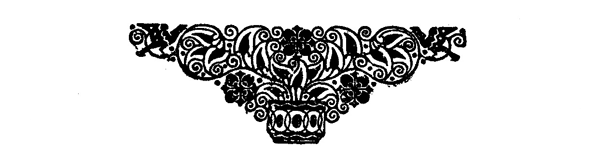

<h2>Die Schleswig-Holsteiner im Deutsch-französischen Kriege.</h2>

<h3>Von Gustav Frenssen.</h3>

<h4>I. Mobilmachung.</h4>

Es war bei Rendsburg auf der Loher Heide, und Frankreich hatte
vor vier Tagen den Krieg erklärt. Vor vier Tagen war der
Gefreite Lohmann ins Lager gejagt und hatte dem Lagerkommandanten
eine Depesche gebracht. Eine Minute später wußten alle
Batterien: es geht gegen Frankreich. Da waren sie ohne Kommando,
wie wenn Alarm geblasen wäre, an die Pferde gesprungen
und hatten mit fliegenden Händen angefangen zu satteln und zu
schirren. Sie meinten, es ginge sofort los.

Hans Lohmann, des Gefreiten Bruder, zweite Schwere, Nummer
drei, rechts am Geschütz, Wischer und Ansetzer, war drei Wochen
lang stumm und starr. Erst am dritten Tage nach Gravelotte wurde
es wieder klar bei ihm. Erstens begriff er nicht, warum es nicht
sofort losging, zweitens, warum die Franzosen nicht am anderen
Tage auf der Loher Heide erschienen, drittens, als die Batterien
endlich unterwegs waren, wie es möglich wäre, daß die Welt so
groß sei; er hatte geglaubt, die Franzosen wohnten gleich hinter
Hohenwestedt und Heinkenborstel. Zu dem geographischen Irrtum
kam ein sittlicher: was der Hauptmann ihnen von altem Recht
und von Liebe zum Vaterlands und von großen Hoffnungen gesagt
hatte, das hatte er nicht verstanden. Aber nachher hatte der Gefreite
Lindemann, der für ihn dasselbe war, was für die dunkle
Stube die helle Lampe, ihm kurz gesagt, daß die Franzosen den
alten König beleidigt hätten. »Sie haben so getan, Lohmann.«
Und er hob die Hand zum Schlage. »Wie alt ist er?« fragte Lohmann.
»Über die siebzig hinweg.« Von Stund an, als er das
hörte, hatte Lohmann klare Erkenntnis und gutes Gewissen. »Wenn
sie den alten Mann ins Gesicht schlagen, dann haben wir das Recht,
ihnen an die Jacke zu kommen.«
 
<@pagebreak 250/>
Also herrschte bei Lohmann II einige Dunkelheit. Bei Hauptmann
Gleiser aber war helles Licht. Was hat der Mann in diesen
sieben Tagen bis zum Auszug gearbeitet! Hat er nicht drei Tage
lang, vom Morgen bis zum Abend, wie ein Pfahl im Sande gestanden
und Menschen und Pferde gemustert? Und nie war es
ihm gut genug. Der ist in diesen Tagen auch mehr als einmal
starr gewesen. Er, Hauptmann Gleiser, Seiner Majestät schönster
Offizier, wie er selbst sagte: er hat in diesen Tagen mehr als einmal
behauptet, daß er die schlechteste Batterie hätte, die nach Frankreich
zöge.

Die Schmiede war zum achtenmal an ihm vorbeigefahren, mit
sechs gleichen Rappen bespannt, Schritt, Trab, Ga ... lopp ...
So! Das klappte. Da entstand unten ein Gedränge. Ein langbeiniger
Gaul, ein schönes Tier, wollte nicht länger guttun. Er
riß am Halfter, hoppte, kam zwischen die Reservisten, die da mit
ihren Bündeln standen, und schien auf seinen Hinterbeinen Polka
tanzen zu wollen. »Wollen ihn kirre machen!« schrie der Hauptmann.
»Den Braunen vor!« Der Fahrer, mit starkem Schwunge
hinaufgehoben, eben oben, lag er schon auf dem Rücken im Staub.
»Laß dich auf der Stelle begraben! Gefreiter Jürgens! hinauf!
Mit den Kerlen nach Frankreich!? Ich gehe allein! Ich gehe ganz
allein!« Gefreiter Jürgens lag in der Höhlung im Sande, die der
Fahrer gemacht hatte.

Hauptmann Gleiser sah sich um. Er sah sich um wie ein
Mensch, der, im Zentrum der Welt stehend, nur sich selbst als Menschen
anerkennt. Er wollte das Pferd reiten. Es ist der Mühe wert,
vierhundert geringwertigen Menschen zu zeigen, was Hauptmann
Gleiser kann. So, mit solchen Gedanken, sah er sich um. Unter den
Reservisten, die da noch in ihren Zivilkleidern standen, hundert und
einigen Mann, stand einer ein wenig abseits in einem alten, blauleinenen
Anzug, auf dem große, neue Kniestücke frisch aufgesetzt
waren. Er war bei ziemlicher Länge und Hagerkeit eine Rassefigur,
breitschulterig, gerade und von stolzem, schmalem Gesicht. Auf dem
hellen, fast weißen Haar hatte er eine blaue Schirmmütze, und in
der Hand hielt er einen mäßigen Koffer. Den Mann entdeckte
Gleiser. »Gefreiter Uhl!« schrie er. Der kam heran. »Leichtfüßiger
sind Sie nicht geworden,« schrie er. »Ist der Alte Holzschuhmacher?«
»Bauer, Herr Hauptmann.« »Ist mir ganz egal! Können Sie den
Deubel reiten, oder sind Sie auch so'n gebeulter Teekessel ... Los!«

<@pagebreak/>
Jedermann von den Männern, der an dem Tage auf der Loher
Heide gewesen -- die noch leben, haben graues Haar --, der weiß,
wie steif und bedächtig der Gefreite Uhl aus Wentorf den grauleinenen
Koffer in den Sand stellte, und wie er sich wieder aufrichtete,
als knackten ihm alle Gelenke; und wie er, als er sich wieder
aufgerichtet hatte und die Hand an den Braunen legte, ein anderer
war, wie seine Augen sich aufrichteten wie aufspringende Löwen,
wie er hinaufflog, wie der Braune bäumte und bockte und sich
drehte und sich schüttelte und zuletzt über den Sand jagte, daß er
in einer Staubwolke verschwand und nichts unversucht ließ, um
nicht mit nach Frankreich zu kommen; wie er dann aber den Kampf
aufgab und der Gefreite Uhl, den Kopf ziemlich hoch, auf ihm wieder
zurückkam. »Uhl,« schrie Gleiser, »Sie reiten das Pferd und sind
Geschützführer vom sechsten Geschütz.« So zog Jörn Uhl als Unteroffizier
in den Krieg.

<h4>II. Auf dem Marsch.</h4>

Acht Tage später zogen sie bei strömendem Regen durch die
lange Pappelallee, welche die Vierundsiebziger vor sechs Tagen durchquert
hatten, als sie gegen die Spichern-Berge stürmten. Es war
ein jämmerliches Wetter und alle etwas müde und geschlagen. Wer
es erzählte oder gesehen hatte, blieb unbekannt: sie sahen den alten
General reiten, und einer sagte es dem andern: »Er hat eben gesehen,
daß sie mit Trommelschlag einen Offizier begruben; dort links
von den Bäumen. Da ist er herangeritten und hat gefragt: ›Wen
begrabt ihr da, Leute?‹ ›Unseren Hauptmann!‹ ›Laßt mich ihn
noch einmal sehen,‹ hat der Alte gesagt, ›es ist mein Sohn‹.« Gleich
nachher ritt er mit seinem Adjutanten an den Batterien, die im
Regen dahinzogen, vorüber. Er war keine gute Figur zu Pferde,
zu dick und zu kurz. Sie sahen ihm nach und zogen weiter. --
Ein jämmerliches Wetter. »Sieh da, drei tote Pferde! Junge,
die sind dick geworden!« »Du, was bedeuten die langen Beete?
Das ist ja merkwürdig: da haben sie Säbel hineingesteckt?« »Kannst
nicht sehen, Mensch? Das sind frische Gräber.« »Für Menschen?«
»Ja, für Menschen. Für wen sonst? Nun laß dein dummes Reden!«
»Sieh! Da steckt ein Gewehr in der Erde. Das hat einer als
Krücke gebraucht. Die Krücke steht noch; er nicht mehr.« -- Jämmerliches
Wetter. Wie der Regen durch die Bäume schlägt! Die Geschütze
rasseln und klirren langsam vorwärts. Gräber. Lauter Gräber. 
<@pagebreak/>
Und die Pappeln sind abgeschält, und zerbrochene Zweige zeigen
ihre zersplitterten Knochen. -- »Wir kommen nicht an den Feind ...
Wir Schleswig-Holsteiner? ... Nie und nimmermehr! ... Wir
sind den preußischen Eisenfressern viel zu unerfahren und wabbelich.
Wir ziehen nur zur Parade mit. Wir sind bloß da, um
hinterdrein zu fahren.« »Die Sechsundsechzig mitgemacht haben,
die müssen es ausfressen.« Wer die Meinung aufgebracht hat, und
ob sie richtig ist, das fragt kein Mensch.

In der Nacht biwakierten sie auf den windigen und nassen
Höhen westlich von Spichern und warfen vierzehn französische Wagen,
die da standen, in die Wachtfeuer. Sie waren alle still und bedrückt,
wenn auch viele laut lachten und viel sprachen. Der Feldwebel
knurrte die ganze Nacht, daß die schönen Wagen verbrannt würden,
und ließ gegen Morgen die Eisenteile auf den Feuerstätten zusammentragen
und freute sich, daß er sieben Franken für die Batteriekasse
gewann.

Die Batterien zogen weiter. Es wurde mühselig. Dies ewige:
weiter, weiter. Lieber mal 'ran an den Feind, ihn schlagen und
dann wieder nach Haus. »Wer soll sonst pflügen und säen? Der
Herbst kommt heran. Vater kann nicht allein für den vollen Stall
sorgen. Und die Mutter? Und das Mädchen?« -- »Wir ziehen
immer weiter in Frankreich hinein! Ich glaube, wir haben Weg
und Steg verloren. Wenn die Geschichte man gut geht.« -- Weiter,
immer weiter! Wie ist Wentorf klein geworden! Es gibt ja wohl
zehntausend Dörfer in der Welt und Menschen wie Sand am Meer.
Erst war ihre Batterie allein gewesen, damals, als sie auf zwei
Dampfschiffen über die Elbe setzten. Dann waren sie Regimenter
geworden, dann ein Korps, dann ein Heer. Seit gestern waren sie
ein Volk.

Die Batterie hielt am vierzehnten auf einer Anhöhe, an einem
Kreuzwege. Neben Jörn Uhl hielt Hauptmann Gleiser. Da lagen
und marschierten Regiment an Regiment, Kanonen und Reiter und
endlose Wagenzüge, Mensch an Mensch bis an die Höhen in dunstiger
Ferne. Da wandte Gleiser sich um: »Uhl, was sagen Sie?«
Jörn Uhl starrte hin und sagte nichts. »Sie Bauer! Das Vaterland,
Deutschland reißt sich aus alter Not!« Er riß das Pferd
herum und sagte nichts. Da sah Jörn Uhl noch einmal auf und
sah all die ziehenden Menschen, die alle nach einem Ziele strebten,
und fühlte die Größe der Zeit.

<@pagebreak/>
<h4>III. Bei Gravelotte.</h4>

In der folgenden Nacht zogen sie bei Fackelschein über einen
Fluß. Am sechzehnten hörten sie Kanonen von ferne, zur Rechten,
von Höhen herunter. »Da gibt es ein wenig Geschützkampf! Sieh
mal an! Aber zweitausend Schritt! Ein wenig Feuerlärm!« Weiter
dachten sie nicht nach. Es kam aber etwas wie Neugier über sie;
und über das Ganze kam eine Unruhe wie eine Jägerunruhe.

Der achtzehnte brach an, und sie sahen wieder wie vor vierzehn
Tagen frische Gräber, diesmal in der hellen Sonne. Elf ist
die Uhr. »Ein schöner Tag.« Wenn nur die Gräber nicht wären.
Es war doch gut, daß sie in der Reserve blieben. Vorgestern und
so immer. Immer hinterher. »Wir sind ja viel zu junge, frischgebackene
Truppen, dazu aus der neuen Provinz. Wir kommen nicht
an die Front. Und das ist gut ... Und das ist schade ... Nein
... es ist doch gut. Ich muß zu meinem Vater. ... Ich muß
zu meinem Mädchen. So jung noch! Ich will noch was erleben!
Zehn Jahre will ich noch leben. Dann meinetwegen.«

Elf ist die Uhr. So still wie am Sonntag in Holstein. Nur
das Klappern und Stoßen der Geschütze und das Knarren und
Janken des Lederzeuges. »Merkwürdig! ... Da vorne rechts!« ...
»Siehst du?« ... -- »Die Schwere biegt wahrhaftig vom Wege ab
auf die Höhe!« -- »Dort rechts, Mensch! Kannst nicht sehen?« --
»Was will die da?« -- »Weiß ich es?« -- »Wie still und schön
ist der Tag.« -- »Wir kriegen in diesem ganzen Feldzuge kein Pulver
zu riechen. Bald heißt es: umkehren in die Heimat!« -- »Es ist doch
dumm, so wiederkommen und nichts erlebt haben! Nachher kommen
die großschnauzigen Preußen und reden hinterm Bierglas von ihren
Heldentaten, daß die Balken sich biegen, und wir müssen das Maul
halten.« -- »Sieh! Da oben die erste Reitende!« -- »Siehst du?« --
»Was will die da oben? ... Mensch, was bedeutet das?« -- »Gut
schwenken die jungen Pferde!« -- »Da stehen die sechs.« -- »Das
ist so ein übereifriger Hauptmann.« -- »Was ist das?« -- »Die
feuern?« ... -- »Die feuern?« ...

»Batterie ... trab ... trab!« ... Hauptmann Gleiser sieht
über seine Batterie hin. Den Blick vergißt keiner. Das ist Ernst.
Wer sieht noch etwas? Wer hört noch etwas? Wer redet noch?
»Batterie Ga ... lopp!« Da hält Hans Detlef Gleiser auf seinem
hohen, schönen Fuchs; die Sonne blitzt in seinem Helm und in seinen 
<@pagebreak/>
Augen. Das ist seine Freude, seine sechs Geschütze an sich vorüberjagen
zu lassen und dann dem Fuchs die Sporen zu geben und noch
als der erste am Platze zu sein. »Im Avancieren« ... Die Pferde
fliegen zur Seite. »Mit Granaten geladen! Auf das feindliche Lager!
Achtzehnhundert Schritt.« Nun keine Gedanken mehr. »Es ist nicht
möglich.« Keine Gedanken mehr. Ruhig Blut! Der Major jagt
ihnen entgegen. Er will wohl Stellung bezeichnen. ... Der Major
sitzt gut zu Pferde, auch ohne Kopf ... Wie grausig das. ...
Nun stürzt der Tote herunter. Das Pferd rast weiter. Was ist das
für ein Pferd, das gerade vor Jörn Uhls aufjagendem Geschütz
vorüber rast? Reitet Oberst von Jagemann diesen Braunen? Seine
Seite ist naß und rot von Blut.

Herum ist das Geschütz. ... Die weißen Zelte. ... Da laufen
Menschen. Tausende ziehen dort hin und her, stehen da in Rauch.
Pjjuu. ... Pjjuu. ... Ein Sausen und Pfeifen schwillt auf und
ab. »Ruhig Blut, Jungens! Wenn ihr's hört, ist's vorüber.« Es
fliegt hoch singend vorbei, schlägt hart vom Radreif ab ... verkriecht
sich mit kurzem, sirrenden Ton in den Leib des Stangenpferdes.
Das zittert und fällt zur Seite. Der Stangenreiter sieht
es mit zorniger Miene an. »Was so einem Tier einfällt?!« ...
Pjjuu. ... Sein Zorn ist verflogen. Er hebt mit langgezogenem
Schrei die Hände, als hätte ihn einer mit spitzem Pfahl ins Kreuz
gestoßen, macht den Rücken hohl und stürzt hinterrücks vom bäumenden
Pferde.

Jörn Uhl wirft den Kopf herum und sieht auf Leutnant Hax;
der hat etwas gesagt, aber es ist nicht zu verstehen. Es brüllt und
lärmt und klirrt und donnert. Ist auch nicht nötig. Er weiß schon
so. »Geschütz vor! Geschütz vor!« Eins und zwei die Fäuste in
die Speichen. Granaten auf dem Arm. ... Der Verschluß ist offen.
»Tschuu ... uu.« Die Mücken da wollen stechen; da vorne: die
lange, weiße Linie. Aber keine Zeit ... keine Zeit. Wir müssen
uns die Brummer vom Leibe halten ... dort auf den Höhen.

»Auf die Batterien! ... Tausend Schritt.« Nummer eins
zieht ab. Das Feuer fliegt. Aus dem Knallen und Krachen ist
Melodie geworden. Ein Heer von schrecklichen Tönen fliegt und rast
mit wahnsinnigen Augen und verzerrten Gesichtern über die Höhen.
Von halblinks her klingt immerfort ein Quäken und Kratzen, ein
niederträchtiges Geräusch, als wenn einer mit Eisen in einen Haufen
Glasscherben stößt. Eine Garbe davon fliegt quer über die keuchenden
<@pagebreak/>
Menschen. -- »Feuer!« -- Das Feuer fliegt. Jörn Uhls Augen
fliegen mit. Das war ein Treffer. Eine Garbe fliegt. Knatternd
knirscht sie vorüber. Ein Leutnant kommt im Trabe gelaufen. Jörn
Uhl wirft einen Blick hin. Der Leutnant wird gemäht und fliegt
zur Seite. Sein Rücken ist plötzlich in Dunkelrot getaucht.

Leutnant Hax geht von Geschütz zu Geschütz, ganz wie auf der
Loher Heide. Einer stellt sich stramm vor ihn hin; das Blut leckt
ihm vorn längs dem Beine herunter und bildet eine breite Biese,
als wär's ein General. »Abtreten!« Der Mann geht fünf Schritt;
dann taumelt er. Einer sagt den Namen: »Sieh da, Geert Dose.«

Leutnant Hax bleibt plötzlich stehen, als hörte er auf ein Kommando.
»Uhl!« -- »Herr Leutnant!« Er dreht sich um. »Sehn
Sie mal nach. Ich bin im Rücken verwundet.« -- »Nichts zu sehen.«
-- »Kein Loch?« -- »Kein Loch!« -- »Na ... denn nicht ... die
grobe Batterie dort an den Bäumen!« -- »Feuer! ... das war
zu kurz.« -- »Feuer!« -- »So ist es recht.«

Nummer zwei stolpert. Gefreiter Jan Busch. Er taumelt zurück
und schlägt die Hände vor den Kopf, als sähe er plötzlich etwas
Schreckliches, und fällt schwer aufschlagend hintenüber. Mit gehobenen
Händen bleibt er auf dem Rücken liegen, mit denselben
entsetzten Augen. Jörn Uhl springt ans Geschütz. -- Nummer fünf
ist am Fuße verwundet. Stöhnend hinkt er heran und legt zu Jörn
Uhls Füßen neue Granaten. Leutnant Hax schreit den Pferdehaltern
zu: »Weiter zurück!« Es sind noch drei Pferde. Die
anderen liegen an der Erde. Und noch drei Mann am Geschütz.
Die anderen liegen an der Erde. Jörn Uhl steht über der Lafette,
hat den Kartuschentornister hinter sich, die Granaten liegen neben
ihm auf der Erde. Er nimmt sie auf. Vorstecker und Zündschraube.
Mit starrem Auge über Aufsatz und Korn. Lohmann II zieht ab
und braucht den Wischer. »Lohmann!« schreit Hax. »Nicht so langsam,
Mensch! Röhr di! Wir sind nicht auf der Loher Heide.«
Lohmann kann nicht anders. »Eins ... und ... zwei.« Ganz
wie auf der Loher Heide. -- »Feuer!« -- Von links her kommt es
fürchterlich näher und näher, knarrend und krachend. Leutnant Hax
greift nach seinem Rücken und seufzt laut: »Dee Lohmann ... dat
ist'n Kerl. Dee kann nie anners.« Hauptmann Gleiser reitet heran:
»Gut, Leute! So ist's gut!«

Vier oder fünf Stabsoffiziere reiten zum zweitenmal vorüber
und halten dicht hinter ihnen. Gleich spüren sie es: es surrt und 
<@pagebreak/>
brüllt ... es splittert ... es schlägt hart auf ... es wühlt in der
Erde. Das Pferd eines Offiziers fällt in die Knie; der Reiter fliegt
über den Hals weg, springt auf und rennt auf ein Pferd zu, das
zwischen den Geschützen durchjagt; er greift es; Jörn Uhl hilft
ihm; schon sitzt er auf der roten Schabracke. Die Reiter traben ab.
Die Mütze des Generals flaggt; ein Stück des Randes ist losgerissen;
ein Stück Watte hängt heraus und fliegt nach.

Sie arbeiten am Geschütz; sie arbeiten im Schweiße ihres Angesichts.
Immerzu. Immerzu. Sie keuchen und zielen, stoßen und
schieben, rufen und fluchen. Es geht ein sonderbar kurzatmiger,
heißer Wind, hin- und zurückstoßend. Die Erde wirft Feuer auf;
durch aufwallenden Rauch blinkt es gelb. Aus den undicht gewordenen
Verschlüssen fliegt bei jedem Abzug eine lange, rote Feuerzunge.
Sie haben keinen Gedanken als: arbeiten, arbeiten. Sie
haben keine Sorge. Sie denken nur: »Es geht heiß her: Wann
nimmt es ein Ende?« Sie denken nicht daran, daß der überstarke
Feind, der im weiten Halbbogen auf sie dringt, in jedem Augenblick
den Ansturm wagen kann.

Da kommt Nummer fünf von der Protze gelaufen: »Keine Granaten
mehr!« Nun ist die Not da, die bittere Not. Sie stehen
wie versteinert am Geschütz, Lohmann mit erhobenem Wischer; Jörn
Uhl, die eine Hand am Verschluß, die andere im Grimm geballt,
starrt vor sich hin in das Blitzen; Leutnant Hax kommt mit schweren
Füßen heran und zeigt Lohmann den Rücken: »Ist da noch keen Lock?«
--	»Ja, Herr Leutnant, nun ist da ein Loch, und Blut ist da auch.«
--	»Stehen kann ich nicht mehr. Weggehen mag ich nicht. Ich
mag nicht.« Er spuckt verächtlich aus. Da rast ein Stabsoffizier
heran. »Warum feuern Sie nicht?« -- »Keine Granaten.« -- »In
drei Deuwels Namen! So feuern Sie mit Kartuschen.« -- »Befehl!«
Sie feuern blind, mit Leinwandfetzen ... immerzu ...
immerzu ... eine ganze Weile. Jörn Uhl, über die Lafette gebeugt,
langt in Gedanken nach rechts: da liegen wieder Granaten. Das
geht besser. Ein blutjunger Leutnant steht hinter ihnen und lobt
sie mit hoher Stimme: »Gut, Unteroffizier! Sehr gut! ...
Kamerad!« Er grüßt zu Hax hinüber, der auf der Erde sitzt, mit
dem Rücken am Rad der Protze. Aber Hax sieht ihn nicht; Hax
sieht unter halbgeschlossenen Augen verächtlich mit vorgeschobener
Unterlippe nach der Richtung des Feindes.

Da schweigen links von ihnen die Geschütze. »Was machen 
<@pagebreak/>
die beiden Batterien? Warum schießen sie nicht mehr?« Schweres
Infanteriefeuer kommt halblinks von hinten, vom Waldrande her.
Deutsche Infanterie springt auf, wirft sich hin, kommt näher. »O...
die wollen uns helfen«... »Die Geschütze! ... Warum schießen
Sie nicht?« -- »Schießt doch, Brüder!« Hier und da steht noch ein
einzelner Mann ... blitzt noch ein Rohr. Unteroffizier Heesch von
Eesch bedient mit einem einzigen Mann sein Geschütz. In Rauch
und Feuer steht er. Der ist ein Held. Von dem wird man in der
Heimat reden noch nach fünfzig Jahren. »Schießt, Brüder!« Ein
fremdartiges Lärmen und Tosen kommt brüllend näher. Der junge
Leutnant springt heran und schreit überlaut: »Auf die Batterie zur
Linken ... Kartätschen! Kartätschen!« -- »Herr Leutnant,« schreit
Uhl ... »das ist ja unsere Batterie!« -- »Sehen Sie nicht? Sie
ist voll von roten Hosen!« -- »Herum!« Sie greifen alle zu. Die
Fäuste in den Speichen. Schwer fällt es herum. »Kartätschen! ...
Vierhundert Schritt!« ... Leutnant Hax steht wieder aufrecht, will
kommandieren, langt nach seiner Seite und fällt lang hin. Von
der verlorenen Batterie kommen drei oder vier Flüchtige. Einer
davon fällt im Laufe, wie ein Kind fällt, und hält sich am Rade
und fängt an, einzelne Bitten des Vaterunsers zu beten. Die vierte
Bitte sagt er zweimal. Er war armer Leute Kind.

Deutsche Infanterie immer neu aus dem Walde herausströmend
steht, liegt, hier und da, im Haufen und einzeln. Sie stehen und
liegen zwischen den Geschützen und feuern gegen den anstürmenden,
brüllenden und heulenden Feind. Ein Infanterist, ein flinker,
sehniger Mensch mit rötlich rundem Kopf ist dicht neben Jörn
Uhl gesprungen und schießt ... und schiebt eine neue Patrone
ein. »Jörn Uhl! Junge! ... <i>adsum</i>, Jörn!« Jörn Uhl schiebt eine
Kartätsche ins Rohr und schlägt den Verschluß zu.... Warum
soll Fiete Krey (sein Jugendfreund) nicht neben ihm stehen? »Dein
Schießen nützt nichts mehr. Dat geiht to Enn.« Er wirft das Geschütz
in die Richtung des Feindes. Fiete Krey hilft stoßen und
werfen. Der Kartätschenhagel fliegt ... noch einmal... noch einmal.
Sie stocken da drüben. Aber es kommen mehr. Es wimmelt
von fremden, roten Menschen, die in Rauch und Feuer vorwärtsdringen.
Es geht zu Ende.

Pferde! Pferde! Die Pferde liegen alle an der Erde. Da rennt
Lohmann übers Feld und holt von den Pferden, die da verlassen
jagen und traben und stehen, drei; und kommt wieder, und sie 
<@pagebreak/>
schirren mit fliegenden Händen an. -- Ab ... ab! ... Ein jammervoller
Rückzug. Fiete Krey sitzt vorn auf der Protze und fährt mit
der Kreuzleine. Lohmann, aufrecht neben ihm stehend, haut mit
der Karbatsche auf die elenden, verwundeten Tiere. Jörn Uhl trabt
neben dem Geschütz her und hält den Leutnant, der auf dem Achssitze
mit krummem Rücken hin und her schwankt. Zwei Feuergarben
teilen den Rauch; sie fegen schräg vor ihnen übers Feld. »Die
dritte ist für uns.« Nein. ... Es ist kein Eisen für sie geworfen;
es ist kein Feuer für sie aufgesprungen. Sie kommen lebend bis
in den Schutz des Waldes.

Und da stehen zehn bis zwölf Geschütze. Andere kommen noch
an ganz wie sie: mit wankenden, strauchelnden Pferden, mit drei
oder vier Mann, denen Jammer und Zorn, Angst und wilde Erregung
in den schweißbedeckten Gesichtern steht. Wie sie arbeiten!
Pferde werden herangezerrt mit lautem Schelten und kurzen, wilden
Worten. Geschosse werden herbeigeschleppt und in die Kasten gelegt.
Der Batterieschlosser, ohne Mütze, mit wirrem Haar und aufgerissener
Uniform, liegt vor einem kranken Geschütz in den Knien; ein Unteroffizier
stopft einem Pferde Scharpiepfropfen in die tiefen Wunden,
aus denen das Blut sprang. Als wenn man einen Hahn in die
Biertonne stößt! Kommandorufe dazwischen. »Merkwürdig, daß der
Feind nicht hierher kommt.«

Drei Geschütze, frisch bespannt und leidlich mit Mannschaft besetzt
-- darunter versprengte Infanteristen -- fahren wieder vor.
Der junge Leutnant arbeitet, schreit, rennt.... Nun kann auch er
mit zwei Geschützen wieder abfahren. Ein Offizier hält oben und
zeigt mit der Schwertspitze die Richtung: »Da hinüber! An den
Waldrand!« Jörn Uhl sitzt auf dem ersten Geschütz, Fiete Krey
neben ihm. Ringsum aus der Nähe und aus der Ferne rollt und
braust in alter Furchtbarkeit das schreckliche Knattern, Dröhnen und
harte Aufschlagen. Als sie den Waldweg zu Ende traben und am
Rande ankommen, klingt der Donner ferner. »Wissen Sie, Unteroffizier?«
-- »Ich glaube, da hinüber.« -- »Ich muß 'ran!« sagt
das junge Blut und knirscht mit den Zähnen.... »Mein Vetter
von der zweiten Leichten ist gefallen; morgen muß ich an seine
Mutter schreiben.« -- »Es sind viele gefallen, Herr Leutnant.« --
»Es ist ein schrecklicher Tag.« Als sie sich umsahen, war das
andere Geschütz nicht mehr da. Der brüllende Lärm hatte nachgelassen.
 
<@pagebreak/>
Vom Himmel war der Abend gekommen. Und es hob keiner
seine Hände und beschwor Sonne und Mond wie einst der rasende
Jude: »Sonne, stehe still zu Gibeon und Mond im Tale Ajalon!«
Nein ... nein.... Sie fahren weiter und kommen an der rechten
Stelle aus dem Wald heraus. Aber die Geschütze werden zurückgezogen.
Frische Infanterie steht in Massen und bedeckt das Feld.
Der Feind ist still geworden. Der Abend kommt. Und wie es stiller
wird ... ruft es in den Furchen und an den Büschen: »Hölp mi...
O ... Hölp mi doch.« Und auf der Höhe: »<i>Je prie ... ma mère
... pitié!</i>« Und aus dem trockenen Bachlauf: »Soo dösti ... so
dösti ... Mien Moder.«

Es wird stiller. Die am Waldrand steigen von Pferd und
von Eisen. »Meine Mutter hat mir für die höchste Not ein Paket
in die Brusttasche gesteckt,« ... sagt der Leutnant ... »aber ich
kann den Arm nicht hochkriegen.« Da nahm Jörn Uhl es ihm
aus der Tasche und gab es ihm, und der bot ihm die Hälfte. Das
Stangenpferd hatte den Scharpiepfropfen verloren. Das Blut schoß
aus der Wunde. Jörn Uhl sprang auf und riß es zur Seite. Es
stürzte. Der Leutnant, vom Blutverlust ermattet, setzte sich auf die
Lafette, Fiete Krey warf sich ins Gras. »Lohmann, geh hin! Sieh
zu, wo die anderen stehen!« Er legte den Wischer, den er wieder
in die Hand genommen hatte, in sein Lager und verschwand im
Waldwege. »Ach,« sagte der Leutnant, »geben Sie mir einen einzigen
Schluck. Ich habe meine Flasche dem langen Johann gegeben;
der hat sie in einem Hub ausgetrunken.« Er sagte sonst:
»Herr Leutnant Hax«; aber in dieser Stunde sagte er: »Der lange
Johann«.

»Sehen Sie, Herr Leutnant?« sagte Fiete Krey, »da kommt
einer von der anderen Seite!« Ein Soldat in weiter, roter Hose
und kurzer, blauer Jacke kam langsam auf sie zugehinkt. Er hatte
den zerbrochenen Unterschenkel mit seinem Seitengewehr geschient
und mit der Koppel umbunden. Aber der Fuß glitt zur Seite, und
er schrie laut auf. Fiete Krey stand auf und faßte ihn an und setzte
ihn auf die Erde. »Ich bin ein Franzose,« sagte er. »O, o...«
»Was?« sagte Fiete Krey und sah ihn verblüfft an. »Ich bin von
Straßburg.« -- »Na, dann tröste dich! Bleib sitzen und laß dein
Quasseln.« Er holte Tauwerk aus der Tasche und richtete das Bein
wieder gerade. »Laß dein Stöhnen, Straßburger: ich kann nicht
mehr für dich tun.« -- Lohmann kam wieder und meldete, daß 
<@pagebreak/>
da ... da drüben ... die Batterien wären. »Wir wollen aufbrechen,«
sagte der Leutnant. Sie hoben den Elsässer auf die Protze
und zogen ab. Sie trafen wirklich in einer Senkung am Walde die
anderen Batterien. Und wieder war keine Ruhe.

Das ist ein Arbeiten gewesen am Rande des <i>Bois de la Cusse,</i>
diese ganze Nacht hindurch! Und als die Morgenröte kam, da
standen vierzig Geschütze nebeneinander, wie auf der Loher Heide;
zwei waren in Feindeshände gefallen. Pferde und Mannschaft, von
den Staffeln ergänzt, standen wieder neben den schwarzen Rohren,
bereit, wenn die Sonne kam, wieder auf dasselbe gelbliche, mit kleinen
Steinen übersäte Feld zu fahren, das von Pferden und Rädern
zertreten, von Granaten zerwühlt und mit Leichen und dunklen Blutflecken,
zerrissenem Lederwerk, zerbrochenen Waffen und gesplittertem
Holz übersät war. -- Aber der Feind kam nicht. Der Feind war
kein Tiger mehr in brüllendem Ansprung. Er war ein gebundener
Stier, der stöhnend mit den Hörnern in der Erde wühlt.

Aus: Gustav Frenssen, Jörn Uhl.
(Berlin. Grotesche Verlagsbuchhdlg.)

