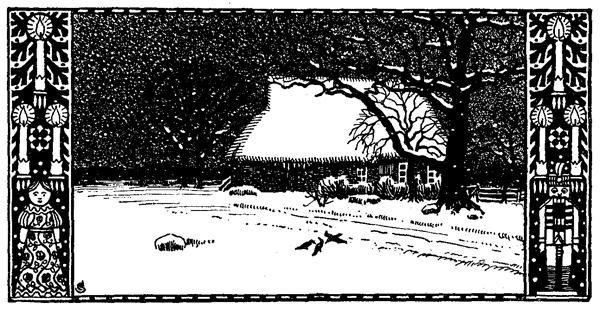

<#include "pagebreak.ftl">
<h2>Üm hundert Daler.</h2>

<h3>Von Joh. Hinr. Fehrs.</h3>

Dat fründliche Burhus, wat dar an't Olndieks-Holt twischen hoge
Kastang-, Appel- un Berböm rutkieken deit, weer so üm't Jahr
1825 recht old un pultrig. Wenn son Hus twischen gröne Böm steit,
Blom'n in un ünner't Finster, denn süht dat noch ganz lustig ut --
de Armot kiekt wol dör de Ritzen un Löcker, awer se lacht. Nu
weer't Winter, vunabend Wihnachten-Abend; de Böm un Büsch
weern kahl un sor, Rugriep glinster an de Tilgen, de lütten Finsterruten
weern tofrarn, un an't Dack hungn rundüm kole Istappens,
as weern dat Franschen an en toreten Kleed. Dat Hus seeg heel
trurig ut un stunn dar so still as en Sark -- Daern to, op'e Hofsted
keen Minsch, keen Hund oder Hahn.

Un dochen weer Leben darin. In de Döns speln an den groten
Ekendisch twe Kinner, en Deern von söben un en lütten Jung von
dre Jahr. De sproken un lachen man lies, awer dat Vergnügen weer
doch heel grot, denn lütt Trina harr allerhand bunte Flickens un
Bandn tohopen söcht un harr sik den Wakplock ut dat Klockenhus
halt, se wull em smuck antrecken un sik en Popp maken. Heini keek 
\<@pagebreak 278/>
to un wunnerwark aewer den Staat, toletz sä he: »Tina, Popp ok
Büx anhebbn?«

»Ne, min Heini, dat is en lütt Deern, Büxen dregt blot de
Jungs.«

Kinnjes'<a class="refnote" id="rn1" href="#fn1">*)</a> mi en Büx bingt?« frog he.

»Dat glöv ik nich, Heini, du büst noch to lütt.«

»Ik garkeen Büx hebbn?«

»Ja, du kriegst noch mal een, awer du mußt noch töben. Moder
sä di güstern jo.- to en Büx hört Verstand, dat kunn noch nich
angan.«

Heini keek mit sin groten blauen Ogen rop na de tofrarn Ruten
un dach deep na. »Wat is Vertand, Tine?« frog he toletz.

»Dat weet ik nich, min Heini, mußt Vader mal fragen.« Darbi
wies se mit er Popp, de nu bald klar weer, na'n Ahm.

Heini klatter von de Bank hindal un schraekel na sin Vader
hin. De seet dar krumm, de Ellnbagen op de Knee, Kopp in beide
Handn un deep in Gedanken. Heini tucks em so lang an sin Hemdsmau,
bet he em anseeg. »Na?« frog de Vader mit en deepe Stimm.

»Va'r, wat is Vertand?«

»Wat?«

»Vertand!«

»Verstand meent he,« sä Trina.

Dat weer nu wol so licht nich seggt, denn de Vader besunn
sik. »Wenn du gröter warrst, min lütt Jung, denn kriegst du Verstand,
un denn kannst du ok begriepen, wat dat is.«

Heini stell sik twischen de groten Been von sin Vader und spel
mit de blanken Westenknöp. »Bingt Kinnjes' Vertand?«

»Düt Jahr noch nich, mußt noch en betjn töben.« De grote
Hand strakel mal den lütten Flaßkopp.

Heini sunn en Ogenblick, denn schraekel he wedder in grote II
na sin Swester. »Dü, Tine, Tine, Vertand is Büx!« reep he mit
helle Ogen.

»Dat glöv ik nich.« lach Trina, »dat Verstand en Büx is!«

»Doch du!« sä he un slog er mit sin lütte Hand op'n Arm,
»Vertand is Büx!«

En Schritt achter't Finster war lud, de Vader keem in's höch
un hork.

\<@pagebreak/>

»Kinnjes', hör!« tuschel Heini. Trina schütt mit'n Kopp un
seeg &#281;rn Vader lurig an mit en Og, binah to old un to klok för dat
junge Gesicht.

De Blangdäer klapper un jank. »Go'n Dag, Henn Kark, kam
He neeger!« sä en Frunsstimm.

»Is Steffen to Hus?« Dat klung so hell, as keem dat ut en
Trumpett. De Stubendäer gung apen, un herin trä en Mann,
de wol en Fot körter weer as Steffen Pahl, ok wol en Jahrer
twintig öller. Awer he heel sik stur un steil un dreih sik, as gung
dat op Kommando. Dat weer »Bonapart«, de riekste Bur rund
üm den Vierth<a class="refnote" id="rn2" href="#fn2">*)</a> in alle Dörper; so nöm'n em de Lüd, wil he mit
sin Geld Lütt un Grot regeer, dat allens na sin Pipen danzen müß.
Sin grote Broder in Frankriek leeg al en paar Jahr in't Sark,
un von sin Weltriek weer nix nabl&#281;ben as Schörren un Stücken;
he, de lütt Bonapart, l&#281;v un str&#281;v noch, un de em seeg in sin
g&#281;ln hirschleddern Kneebüxen, sin blau Kamsol un rode West mit
blanke sülwern Knöp, den Dremaster op sin aschgriesen Kopp, de
bög em geern wid ut'n Weg un wenn't ok mit en voll Föhr
Heu weer.

»Dag, Steffen Pahl!« reep he, as wenn he mit en dowen Mann
to don harr; darbi leepen sin lütten scharpen Ogen dör de Stuv
un bleeben an de beiden Kinner hang'n. »Deern, wat makst dar!
Lettst du den Wakplock in din Hus danzen, Steffen? weetst du ok,
wat dat bedüd?«

\<@pagebreak/>
»Dat bedüd en Doden,« sä Stessen Pahl langsam.

»Na, dat is Wiwergloben! Awer ik mag't nich liden, wenn
Gäern mit Saken spelt, de anner Lüd tohört un wahrt warrn mäet.
Weg mit den Plünnkram! so, nu legg den Plock hin, wo he hinhört!«

Lütt Trina rak mit en bewerige Hand er bunten Lappens tosam,
krop ünnern Disch dör un smeet den Plock in't Klockenhus, denn
leep se rut. Heini schraekel achterher un sä ganz lud: eische Mann!
heel sik awer nich op.

»Will He sik nich dalsetten, Henn Karl?« Steffen schov em
den Laehnstohl hin.

»Sitt nich geern op'n Stohl, de annereen warm seten hett!
Wat ik to seggn heb, kann ik in't Stän afmaken. Weetst du, wat
wi förn Dag hebbt?« He stell sik dicht vör em hin, schov de Hand
in de Büxentasch un klaeter mit Geld. »Mutt ik dar sülben üm her
tüffeln? Bün sowat nich gewennt!«

»Ik weer hüt Middag al bi Em west, Henn Kark, wenn ik Geld
harr kriegen kunnt. Kann He nich noch en halb Jahr töben?« Dat
keem dump un drang ut'n Mund, un de grote Gestalt weer dalbögt,
as stunn se ünner en sware Last.

»Ne, Steffen, dat Töben is ut! Ik heb nu al twe Jahr op min
Geld lurt, un de Zinsen kamt ok man druppenwis. Wat hev ik för
Sekerheit? wies mal wat!«

»Ik heb doch min Hus un Hof, un hundert Daler sünd dat jo
man!« sä Steffen möhsam.

»Wat snackst du dar för dumm Tüch? man hundert Daler?
Dat is in düsse trurigen Tiden en grot Kaptal, min Jung! Hest
du di nich binah ut Hasen<a class="refnote" id="rn3" href="#fn3">*)</a> un Schoh lopen, üm de hundert Daler to
lehn, un wat hest utricht!«

Steffen sweeg un seeg vör sik dal.

»Wat de Haef opstunns weert sünd, dat lat di von de Krein
vertelln, de dat enanner togröhlt in't Olndieksholt! In Dithmarschen
hett en Bur sin Hof verköfft för en Pund Toback, en anner
för en oln Schimmel! De Stüern sünd aewer de Maten hoch un
sugt den Burn dat Mark ut de Knaken, Korn un Veh gelt nix,
un de Botter is so billig, dat man de Wagens damit smern kann.«

Steffen süfz mal hoch op. »Dat ward jowol mal beter,« sä he
unseker.

\<@pagebreak/>
»Ja, wenn wi op'n Karkhof liggn dot! Ik seh dat Enn nich
af. Un darüm mutt ik min Geld hebbn, Steffen Pahl, un dat bald!«

»Un wenn ik dat nu ganz un gar nich kann? Gev He doch en
paar Jahr Geduld, Henn Kark, He kann jo töben! Wat schall ik ...«
he sweeg op'n mal still -- sin Fru keem in de Daer; he kunn't er
ansehn, dat se wedder weent harr. »Antje, bliv buten!« sä he un
wink er af.

»Ik kann di nich bedeln hörn!« reep se dull un trurig togliek.
»Henn Kark, wie hebbt noch dre Schüllng in't Hus, dat is uns ganz
Kaptal -- wat will He?«

»Min hundert Daler hebbn, Antje, awer von Steffen, nich von
di!« He stött mal sin Stock in de Lehmdel un schütt ärgerlich den
Kopp: »Wiwerkram! büst keen Herr in Din Hus, Steffen Pahl?«

»Min Mann spelt nich den Herrn in't Hus, he is uns Husvader,
Henn, dat is mehr. Wat he seggt, dat gelt, un wenn he as en
Bedelmann aewer de Heid gan müß -- wi gat mit em un muckt
nich!« Se wisch sik de Ogen un fat ern Steffen bi de Hand.

»Dat is heel nett, Antje, denn mi is bang, dat Ji son Reis
noch mal maken maet. -- Ik seh wol,« wenn he sik an Steffen,
»dat hier op'n Stutz nix to haln is; ik will di en Vörslag maken:
giv mi en Pand, so kann ik mi noch en Jahr un wenn't ok twe
sünd, gedülln.«

»Geern, wenn ik kann!«

»Ik verlang nix, wat du nich kannst! Du gibst mi de Grotwisch
so lang, bet du mi betalt hest.«

»Un wokeen kriggt Gras un Heu, wat darop wassen deit?« frog
Antje gau.

»Wat en Frag! Ik, versteit sik von sülben!«

»Womit schüllt wi denn uns' Köh satt maken?«

»Ik will min Geld hebbn oder Sekerheit, Antje, un op'e Stell,
un wenn Ji mi nich een Deel geben wüllt, denn ga ik morgenfröh
na'n Avkaten!«

Antje wull noch wat seggn, awer Steffen schov er trügg, un as
se em anseeg, verschrak se sik.

»Wenn He mi de Wisch nimmt, denn snört He mi den Hals af,
dat weet He, Henn Kark!« sä Steffen, un darbi flogen em Kinn un
Handn; ik will em dat Lukdeel gxben, dat is eben so grot un godes
Plogland.«

\<@pagebreak/>
»Un ik will de Wisch hebbn oder min Geld, darmit basta!«

»Sin letz Wort, Henn Kark?«

»Min allerletz Wort!«

Ȇm Gott, Steffen, besinn di! He deit dat nich, he geit nich na'n
Avkaten op'n hilligen Dag!« Se klammer sik an sin Arm un heel
em trügg, awer he seeg un hör nix mehr, he schütt sik un stött &#281;r
trügg, dat se hard gegen de Wand full, denn störrt he na de Daer.
Awer Herrn Kark harr Tid funn, en Vörsprung to kriegen.

In de Eck bi den Fürherd Huken de lütten Gaern un flogen
vör Angst un Küll an't ganze Liv. »Eische Mann weg,« sä Heini,
»komm, Tine, kold!« De beiden Kinner kropen wedder in de Döns
rin. Dar leeg de Moder noch an'e Eer, as weer se dod. Heini stunn
vör &#281;r un wüß nich, wat dat bedüden schull, awer Trina fung an to
ween un to jammern. »Ach min lütt Moder, min witte Moder,
wat fehlt di!« Se smeet sik aewer &#281;r un strakel &#281;r de Backen un
tucks &#281;r bi de Hand. Nu fung Heini ok an to schrien, awer so, as
wenn he Arm un Been braken harr; wenn noch L&#281;ben in de Moder
weer, den Lärm müß se hörn. Se keem ok würklich to sik sülben,
keek sik mal verlarn üm un frog Trina, wo de Vader weer. Darbi
keem se möhsam in'e höch, de Kopp weer &#281;r noch düsig, swar un
nüsselig. De Kinner wüssen von nix -- de Vader weer rut lopen,
dat harrn se sehn.

Antje war hitt un kold. Se kraepel sik ut de Daer, reep un
hork, str&#281;v üm't Hus rüm, na de Schün, seeg lank de Strat -- &#281;r
Steffen weer narms! Do gung dar in den Radmaker Wraag sin
Kath de Blangdaer, un en paar Tüffeln keem'n anslarrn, un as
Antje sik ümkeek, stunn ol Abel vör &#281;r.

»Wat wullt du mit din blödigen Kopp in'e Küll?«

»Min Steffen! -- weetst du ...?«

»Komm man eerst rin, min Deern, denn will ik vertelln, wat
ik weet. Wenn man en Lock in'n Kopp hett, mutt man dat toheeln
un nich tofreern laten!« Se hak &#281;r in, bröch &#281;r na de warm Stuv
un bleev bi &#281;r.

Steffen weer wildeß al buten vör Ilenbeck op den Weg, de na
Lohdörp geit. Wat wull he dar? won&#281;m str&#281;v he hin? He weer
op Tüffeln, in Haarn un Hemdsmaun un seeg stief un biestrig vör
sik hin, as en Minsch, de in Slap ümgeit. He leep nich, gung awer
mit grote Schritten driebens weg. De H&#281;ben weer aewerher gries
un grau, de Wind leet wat na un weer nich mehr so kold -- Steffen 
\<@pagebreak/>
acht dat nich. He keem an dat Maartenholt; dat brus in de Dann'n,
un op de anner Sit von den Weg in den Reetschalm von den Fischdiek
dar russel un krop wat -- weer't en Fischotter oder en Voß,
de Enten griepen wull? Dat Water weer aewerher dick tofrarn,
blot een Stell bleev in den strengsten Frost apen, dat weer de Bornstell
bi den Schalm. Hier rög sik wat hin un her -- dat weern
Enten, en ganz Tümp -- hrrrr! dar flogen se op un seiln in'n
Bagen na de Stör to. Steffen seeg un hör nix, he gung man
ümmer sin Nes na. -- Wenn man en Koh mit'n Steen an't Horn
smitt, so is dat narrsch antosehn, woans son Brest sik tiern deit.
Den Kopp hoch un en betjn scheef, de Ogen wid apen -- so steit
dat en Ogenblick still un geit denn dribens hin gegen Bom un
Wall an, rein benaut un benüsselt von den Dräehn in'n Kopp.
So weer Steffen Pahl tomot. As he Herrn Kark naspring'n de
wüß he noch, wat he wull: he wull den Hund von Kerl dalslan as
en Ossen. Jahrn lang harr he em al as en Deubel op'e Nack seten,
nu greep he em na de Kehl un wull em den Wind afkniepen. Dat
weer to vel! He vergeet Fru un Kind un Seel un Seligkeit --
he störrt em na, un dat harr en grot Unglück geb'n, wenn he em
funn harr. Awer Henn weer narms -- oder mak de Ras em
blind? He funn em nich op'e Strat, nich achter Hus un Schün,
nich in't Olndieksholt. Dat Rümlopen in de Küll mak em toletz
en betjn nüchtern, ün nu flog em dat as en Steen hard an'n Kopp:
wat Hest du dan! nu is allens ut! he vergitt un vergibt di dat sindag'
nich, he stött di Hus un Schün üm un jagt di mit Fru un
Kinner in Frost un Snee! Sin Kopp draehn, he stunn still un
keek vör sik hin, as marscheern de Hunger, de Sük un de Dod an
em voraewer; denn sett he sik in Gang, ahn sik to seggn: worüm,
woto un wohin, as en Uhrwark, wat optrocken is -- dweer dör't
Feld na de Landstrat un wider, man ümmer wider. Nu weern al
Holt un Fischdiek wid achter em, de Hüs von Lohdörp weern al to
sehn, de hogen Pappelböm bi't Scholhus un de swarten Dann'n
achter den Burvagt sin Gaarn -- Steffen seeg blot sin Hus, sin Fru
un Kinner un Henn Kark, de daraewer swev as de Hav aewer de
Höhner un jeden Ogenblick dalstöten kunn.

»God'n Dag, Steffen Pahl! Wat hem hem wullt du hier in son
Optog?«

Steffen stunn mit err Ruck still as en Perd, dat op'n mal mit
en Stangtom in't Mul reten ward; he hopp en Schritt torügg ün 
\<@pagebreak/>
dreih de verglasten Ogen, de nu wedder lebennig warn, na den Wall:
»Is He dat, Dirk Panjer?« stamer he.

»Ja Steffen, ik bün dat sülben hem hem. Won&#281;m wullt du hin?«

Steffen keek sik verlarn üm. »Wo bün ik?«

»Hem hem Steffen, du büst krank, ik bring di na Hus, wat?«

»N&#281;, mi f&#281;hlt nix!« sä he, mak awer darbi son trurig un gottverlaten
Gesicht, dat Dirk sin Klappmest, dat he in'e Hand harr,
tomak un denn stiefbeenig von den Wall hindal steeg. »Ik wull en
b&#281;tjn Bessenries snieden hem hem, awer dat hett Tid, Steffen,« sä
de ol Mann, as he vör em stunn. »Komm mit mi na min Kath,
Moder schall uns en Taß Kaffi kaken, de warmt un quickt un makt
vergnögt. N&#281; n&#281;, lütt Jung, wat wullt du?« reep Dirk, as he seeg,
dat Steffen den Kopp schütt un wedder umkehrn wull. »Ik weet
jo nich gewiß, wat di fehlt, awer de Lüd hebbt mi wat vertellt --
du mußt di mal utspr&#281;ken! Komm, lütt Jung, lat mi in din Arm
haken -- so! Nich to grote Schritten, ik bün al wat stümperig.«

Se gungn langsam na Lohdörp to -- en ungliek Paar: de een
jung un grot mit breede Schullern, de anner old un swach an Arm
un Been; awer dalbögt warn se beid: Dirk dörch en lang Leben voll
Glück un Unglück, Steffen dörch en Stormwind, de em de tragen
Gedanken in sin groten Kopp rumküseln leet, dat he dummerig,
daesig up dun war un sik ganz nich faten kunn.

»Wat du för'n starken Arm hest!« snack de Ol. »Dar mutt ik
denken an min Hans, dat weer en staatischen Jung, de weer ok wol
son Ries warn, as du büst. Du hest em nich kennt, du weerst domals
noch en lüttjn Baeker in'n Pierock, un din selig Vader l&#281;v
noch.« He stunn still un wies mit'n Handstock hindal na de Wischen.
»Dar nerrn weer't hem hem. Dar gras min swarte Hingst, en
schönes P&#281;rd, awer hem hem en w&#281;lig un tücksch Tier. He hett wol
op em rieden wullt ahn Taegel un Tom -- hem hem ja he weer
waghalsig as son Slag Jungs sünd -- dat P&#281;rd slog em dod, slog
em mutzdod hem hem, ik funn em nerrn op'e Wisch in't Gras, bleek
un blödig.«

De Ol sweeg en ganze Wil un keek na de Wischen hindal;
toletz sä he: »Lat uns wider gan, Steffen. Ik lop nich lank düsse
Landstrat, ahn hier stilltostan un na de Stell to sehn, wo min Saehn
l&#281;gen hett. -- Dat is wol dat Swarste in'e Welt,« sä de Ol lies un
as wenn he mit sik sülben snack, »wenn uns Herrgott uns eerst en 
\<@pagebreak/>
groten Schatz in'n Schot un an't Hart leggt un denn em naher tobrickt
un wegnimmt. Sowat vergitt man nich, dat is as en Fotspor
in'n Steen, dat vergeit nich.« He sweeg wedder un schraekel still
wider, denn frog he op'n mal: »Wat harrst du dan, lütt Jung,
wenn du in min Stell west weerst?« Steffen wüß wol nich recht
wat darop to seggn -- oder harr he garnich tohört? He schütt den
Kopp un brumm lies vör sik hin, sä awer nix. »Ik drog de Lik
eerst op'e Nack to Hus, hem hem en swar Last! Denn hev ik em
begraben. Awer ik kunn mi vör Wehdag' nich faten un nich laten
un toletz keem de Dullheit darto, ik weer gramm op Gott un de
ganze Welt. As ik von'n Karkhof wedder trügg keem, lad ik en
Kugel in min Flint, gung hindal na de Wisch un reep den Hingst.
He kenn mi un nehm geern en Stück Brod oder Zucker von mi.
Vundag kreeg he'n Kugel hem hem -- he schreeg gresig op un störrt.
So as he leeg, is he liggn blbben hem hem, en Aas för Voß un
Krei. :-- De Mörder mutt starb'n, so is't recht, awer ik harr dat en
annern aewerlaten schullt -- to Rau keem ik dardörch doch nich.
Jahrnlang hev ik mi mit min egen Gedanken rümslan, un ik harr
mi sach nich wedder torecht funn, wenn min gode Anna mi nich
holpen harr. -- Süh dar, lütt Jung,« reep he op eenmal mit en
ganz annern Ton, »dar sünd wi al vör de Daer! Nu komm man
rin na Döns, ne ne nu komm man! Moder!« reep he na de Kaek
rin, »ik bring hier Besök, mak mal gau en Taß Kaffi!«

En ol fründlich Gesicht keek na Del: »Ach Steffen Pahl! wonem
wullt du ...« »Gau to, lütt Moder!« reep de Ol un plink er to,
»Steffen hett nich lang Tid!«

Dirk Panjer wahn al en Jahrer tein in't Afscheed, sin Stell
harr he an sin Swiegersaehn geben, de god to sitten keem, denn sin Fru
weer eenzig Dochter. Dirk harr lang Bur spelt, un he un sin Anna
harrn sik't sur warrn laten; so kunn he sik bargen in de trurigen
Jahrn, ja he heg gar noch en smuck Kaptal achter de Oken, denn damals
leeten de Burn dat Geld still liggn, wenn se wat harrn; dat
op Zinsen to don, weer garto gefährlich -- alle Hüs un Haef wackeln,
dar weer keen Sekerheit.

»Süh mal, dar spelt al Sneeflocken von baben hindal, un dat
ward schummerig, bald is de Klock veer,« sä de Ol, as se binn'n
weern. »Sett di hier bi mi her, lütt Steffen, so! hem hem nu vertell
mi mal, wat du op'n Harten hesst, awer gau, du mußt wedder
an't Hus.«
 
\<@pagebreak/>
Dat weer nu garnich so licht för Steffen, denn he dach un sprok
ümmer wat langsam, un nu weer sin Kopp noch darto en b&#281;tjn ut
Spor; awer ol Dirk holp na un frog un snack so lang, bet he allens
wüß. He schüttkopp. »Hem hem min Soehn, wenn du hütabend to
Bett geist, denn dank unsen Herrgott daför, dat du Bonapart buten
nich funn hest! Du harrst em dodslan, weetst dat! dodslan üm
hundert Daler, Steffen Pahl! Hem hem, de Hingst weer en Beest
un min eegen, un dochen hem hem noch hör ik em na'n H&#281;ben ropschrien, 
as wull he mi bi unsen Herrgott verklagen; awer Bonapart
is en Minsch!«

De Fru keem rin mit den Kaffi, snack heel fründlich un schenk
in, sett ok Brod un Botter op'n Disch. »Hest al en Dannbom för
din Kinner?« frog se.

Steffen schütt den Kopp un keek vör sik dal.

Dirk plink &#281;r wedder to un wink na buten; se verstunn em un
gung na Kaek. »Bring uns en Licht, Moder!« reep he &#281;r na, denn
mak he de Finsterluken to, dat dat ganz düster war in de Döns.

»Luken sünd heel nett, lütt Jung, ik hev son Dinger in Itzho
bi Jehann Mehrens sehn un mi ok wülk maken laten. Ik mag mi
achtern Ahm von den oln soren Ostwind nich anpusten un von n&#281;swiese
Lüd nich in de Finstern lurn laten. So drink doch Din Kaffi
un nimm di en Botterbrod!«

He nehm sin Fru dat Licht af un sett dat op'n Disch, denn slot
he de Lad apen un hal dar en leddern Büdel rut.

»Hundert Daler, seggst du, Steffen?« frog he.

»Gott du leewe Gott, Dirk Panjer, will He ...?«

»Hier sünd hundert in Speetschen hem hem -- nu drink din
Kaffi, lütt Jung!« sä de Ol un heel Steffen trügg, de opstan wull.
As he seeg, dat den jung'n Mann de Tran' in de Ogen stiegen d&#281;n,
mak he sik wedder bi de Lad to schaffen un frog: »Büst ok noch
Zinsen schüllig, min Saehn?«

»Fief Daler.«

De Ol kram in de Bilad un klaeter dar mit Geld. »Hier sünd
noch tein Daler hem hem, dat ward bi di in't Hus sach en b&#281;tjn
knapp utsehn -- n&#281; n&#281; min Saehn, spar din Wör, mi is't jo en
Freud, dat ik di bistan kann! De 110 Daler lehn ik di, bet de Tiden
b&#281;ter ward, ahn Zinsen; starv ik vörher, so betalst du dat Geld an
min Kinner, un kannst du dat in din L&#281;ben nich trügg g&#281;ben, so seggst 
\<@pagebreak/>
du din Kinner dat hem hem, denn maet de dat in Richtigkeit maken.
Segg mal, min Jung, hest du Bonapart en Papier darop geben?«

»En Schuldschien, ja!«

»Vergilt nich, di em wedder geben to laten, Steffen, vergilt
dat jonich!« Denn stött he de Daer apen un reep: »Moder, büst
du klar? Steffen mutt na Fru un Kind!«

»Hier, min Saehn,« sä de ol Fru un seit en Hangelkorf op'n
Disch, »ik hev di allerhand Kramsticken tohopen söcht för din Kinner
-- in düsse trurige Tid ward de arm Gaern garto licht vergeten.«
Se snack in een fort, dat Steffen garnich to Wort keem.

Wildeß söch de Ol em en warmen Kuller un en Hot, awer Hot
un Kuller weern to lütt un to eng; nu wull he em sin Kapittelmütz
ansnacken, awer Steffen meen, de Küll de em god, sind Kopp weer
garto hitt. Se bröchen em bet an de Blangdaer un leeten em ut.

Dat Weder weer anners warn; de Wind weer binah still, un von
den swartgriesen Heben fulln man ümmerto de groten Flocken un
län sich sach op Bom un Busch un op de kole Eer; de Küll harr
nalaten, dat schien, as wenn't Dauweder warrn wull.

Steffen stunn merrn op de Strat, de Daer weer eben achter em
slaten. De beiden Oln leeten em gar nich to sik sülben kam -- nix
harr he torügg laten in dat gode Hus as den Sand von sin Tüffeln,
keen'n Dank, keen Adüs -- se harrn em rut schaben mit er warm'n
Hand'n: »Man to, man to, Steffen, du mußt na Fru un Kind!«
Nu stunn he buten un weer alleen, un nu eerst keem de ganze Freud
aewer em un trock em dör un dör. He föhl noch mal in den Korf
rin, wo ok de Büdel mit Geld liggn de, denn greep he an de Eer
un nehm sin Tüffeln in de Hand un leep al wat he kunn op Strümpsöcken
in de düstre Nacht rin un na Ilenbeck to. -- -- 

Henn Kark schimp un schüm un sä all, wat he wull, as Steffen
em dat Geld op'n Disch tell. He wull dat nich anrögen, reep he,
dat weer wol stahln oder he harr een ümbröcht un utplünnert, awer
dat holp em nix, Steffen wiek un wackel nich un gung nich von'n
Placken.

»Wonem hest denn dat Geld her?« frog Trina, Henn sin Fru,
de breed achtern Ahm seet, »lett sik dat garnich vertelln?« Henn
un sin Olsch weern Ehlüd, as in Land un Stadt oftins vörkamt: de
Leev harr er nich tosam bröcht, un jahrnlang harrn se levt as Katt
un Hund, de een noch tager as de anner; toletz harrn se sik tosam 
\<@pagebreak/>
funn op'n Geldsack, dar seeten se nu old un kold bi enanner un weern
sik so eenig as twe Spitzbobenhand'n.

»Dat Geld hev ik von Dirk Panjer lehnt kregen,« sä Steffen,
»stahln is't nich.«

»Ik weet doch nich,« reep Henn Kark mit en fühnsch Gesicht;
»dat sünd hungerige Tiden, Steffen, een fritt den annern op, ja se
lopt al bi helligen Dag achter enanner her, üm sik aftoslachten.
Hier is de Schien un nu ga, awer dat segg ik di: leppst du mi
noch mal aewern Weg, denn wahr di!«

Steffen hör wol garnich, wat Henn sä; he greep na den Schien,
bekeek em von alle Siten un steek em in de Westentasch. Denn nehm
he sin Korf un gung mit »gode Nacht!« ut de Daer.

»De Speetschen verköp ik morgen an Matten Krus in Kellnhusen;
dar lett sik nu wat op verdeen, de Stürn sünd vör de Daer,«
sä Trina un bekeek dat Geld mit blanke Ogen.

»Büst en Kindskopp, en Tweernbüdel!« schull Henn un sprung
in'e Stuv hin un her. »Ik arger mi, dat mi en schöne Burstell ut'e
Handn wunn is, un du freust di aewer dat Drinkgeld, wat du darbi
verdeen kannst, ol Kalv!« He leep na Del un schull dar mit de Knechten
rüm, de de Köh fodern. --

Aewerher voll Snee, de Strümp natt bet an de Knee, blanke
Waterdruppens an Haar un Backenbart un Parln vör de Steern
-- so keem Steffen to Hus un sett stillswiegens sin Korf op'n Disch.
Antje keek em bang an, awer ol Abel, de mit er scharp Og glik wies
war, woans dat Laken scharn weer, lach hell op: »Kinner, nu fohlt
de Handn, de Kinnjes' is dar! Süht ut as en Spök, awer hett
helle Ogen un en Hangelkorf mit Pepernaet un Pottrosin! -- Büst
en netten, nützlichen Kerl, Steffen Pahl! Smittst din gode Fru an
de Wand, dat er dat Blot ut'n Kopp springt, jagst din Kinner in't
Aschlock un lettst mi ol Minsch hier sitten, üm Moder un Gaern to
begöschen! Wat schöllt de Lüd van mi denken, Steffen? All de
Jahrn hev ik Wihnachten-Abend vör de Daern sungn, un vunabend
-- ja nu fichel man mit er rüm, dat de min selige Töns ok, wenn
he mi dat Mul scheef slan harr, denn weer he den annern Dag so
glier un glei -- ne ne dat is denn doch sach anners, dat kunn min
Töns nich!« reep se op'n mal un fol de Handn. »Kinner nu kiekt
mal, Moder lacht un weent in een Tasch!«

Steffen harr sin Antje op'n Arm nahm, as weer't en lütt Popp,
un tuschel er wat in't Ohr; do blöh de Freud op in dat bleeke 
\<@pagebreak/>
Gesicht ünner den witten Koppdok, un dat Is, wat sik üm er Hart leggt
harr, leep er in Tran' lank de Backen hindal. He le er lies op't Bett
un sä mit en deepe bewerige Stimm: »Nu besinn di man en betjn,
min Antje, ik will för de Kinner sorgen!«

Na en lütt Stunn seeten se all üm den Disch. Heini wunnerwark
aewer den Dannbom, Trina leet en ol hölten Popp, de sik in
den Korf funn un de se mit er bunten Lappens en betjn opvijolt harr,
op un dal danzen; Steffen un sin Antje weern still, awer bet an
den Hals voller Gottlov un Dank. Abel et un drunk för alltosam,
un darbi sprung er scharp Og von den een to'n annern, toletz sä se:
»Ji schulln man tolangn, Kinners, op sowat hört en dennigen Proppen
op!« Awer dat verslog nix, de beiden Lüd rögen nix an. --

»So, dat weer mal en Dag na min Smack!« reep Abel, as se
an de Daer stunn un gan wull. »Sühst du, Antje? Ick segg: to
en recht Minschenleben hört ok af un an en deftigen Larm un Spitakel!
Wenn de Not ranstörrt, Finstern un Daern insleit, un dar
kommt denn de helle Freud as en hilligen Engel liesen rin gan,
dat is wat, dat is de Seligkeit op Eern. Kennst du Sinksanken? Op
un dal, dat een dat Haar op'n Kopp singt un de kolen Gresen aewern
Puckel treckt, dat is en Vergnögen! Nu slapt man, Kinners, un
lat Ju wat Godes drömn!«

Darmit wull se ut de Daer. Awer Steffen smeet er en Perdek
aewern Kopp: »De Snee liggt fothoch, Abel, ik bring di gau
raewer!« Denn drog he er na er Kath.

De Snee full de ganze Nacht man ümmerto in grote Flocken
un stopp alle Löcker un deck all de Palten to von dat ol Hus an't
Olndieksholt, damit dat doch ok en schönes reines Kleed harr för den
Fierdag.

Aus: J. H. Fehrs, Allerhand Slag Lüd. (Garding, H. Lühr &amp; Dircks.

<a href="#rn1">*)</a> Kind Jesus -- Weihnachtsmann.

<a href="#rn2">*)</a> Weite Heidefläche.

<a href="#rn3">*)</a> Strümpfe

