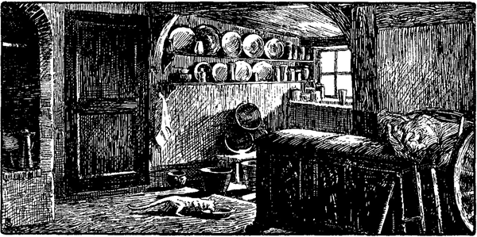

<#include "pagebreak.ftl">
\<@pagebreak 296/>

<h2>Die alte Truhe.</h2>

<h3>Von Timm Kröger.</h3>

»Anna,« sagte Trien Paulsen zu ihrem Töchterchen, »dat's Merra,
roop Vadder!«

Bei Trien ging es immer auf den Glockenschlag. Fünf Minuten
vor halb zwölf wurde gerufen; wenn er in die Küche gekommen war
und sich die Hände wusch (die halbe Stunde war inzwischen voll
geworden), dann trug sie die Suppe auf.

»Roop Vadder,« sagte Trien Paulsen zu Anna.

Anna lief, so hurtig wie die flinken Füße nur wollten, über
die Diele und aus dem Dielentor über die Hofstelle. Eine gelbe
Henne flüchtete und verschwand mit großem Geschrei um die Hausecke
zwischen Streudiemen und Schweinekoben. Anna aber sprang
auf den Wall, der Hofstelle und Koppel trennte, und rief in den
Nebel hinein: »Vadder, dat's Merra!«

»Is good!« klang es von einer Stelle her, wo der Nebel am
dichtesten war.

Man hörte, wie jemand die Karre niedersetzte, den Spaten einsteckte;
dann trat Vater aus dem Nebel heraus und ging auf
Anna zu.

Hans Paulsen war ein kräftiger, bäurischer Mann in den besten
Jahren. Er steckte in der kleidsamen Tracht von Blauleinen; die
Hosen waren in die kurzen Schäfte seiner Stiefel getan.

Er verließ seine Arbeit wie einer, dem die Mahlzeit eine unliebsame
Unterbrechung ist, der sich freut, bald wieder anfangen zu 
\<@pagebreak/>
dürfen. Er war dabei, wie er sich ausdrückte, mit Gottes Erdboden
herumzukarren, und mit Gottes Erdboden karren tat er zu
gern.

Wenn in den Ländern an der Wasserkante die Wintersaat bestellt
worden ist, wenn es keine dringenden Arbeiten mehr gibt,
wenn die üblichen Herbstnebel (sie ziehen in der Regel bis Weihnachten
hin) die Natur grau anstreichen: dann fing Hans Paulsen
an, mit Gottes Erdboden herumzuwirtschaften. Denn das Vieh
besorgen und was sonst im Hause zu tun war, machte das Frauenvolk
spielend ab.

Hans Paulsen gehörte zu den Bauern, die für gerade Linien
schwärmen. Seine Weide hatte an Lerchs Koppel einen Buckel und
in der Mitte eine »Lunk«, das heißt ein Loch, eine Vertiefung,
worin sich zeitweilig Wasser ansammelte. Nun war es seit Jahren
sein Vorsatz gewesen: der Buckel soll verschwinden und auch das
Loch -- der Buckel soll das Loch ausfüllen. Und nun war er schon
ein paar Jahre jedesmal ein paar Wochen dabei, den Buckel in die
Tiefe zu karren. Die gute Ackererde wurde dabei hüben wie drüben
zurückgelegt und später auf die Ebene wieder aufgelegt, damit nichts
umkomme und alles fruchtbar und tragend bleibe.

Wenn Hans die Arbeit in Tagelohn durch fremde Leute hätte
ausführen lassen sollen, so würde es sich kaum gelohnt haben. Nun
aber, da er es selbst tat, kam es ihm wie geschenkt vor. Den dicken,
grauen Nebel liebte er und hielt ihn für gesund, darin fühlte er
sich frisch und wohl. Im Nebel beschwerte ihn weder die Kälte, die
im strengen Winter allem um ihn her einen tönernen Klang gab,
noch die Hitze, die sich im Sommer unter den Kleidern aufstaute.

Und dann liebte er das, was der Nebel mit sich bringt -- die
Stille, die Einsamkeit. Wenn er nicht weiter als zwanzig Schritt
sah, wenn er mitten drin in dem grauen Wolkengerinsel steckte, dann
ging bei ihm die Gleichung auf, die in jedes Menschen Brust nach
einer Lösung sucht.

Immenheide hieß der noch wenig angebaute Sandrücken, auf
dem Hans Paulsens Kate lag. Und an der lang ausgedehnten Landstraße
war durchschnittlich alle fünf Minuten Wegs ein einsamer
Katenbesitz hingestreut.

Ruhig und versonnen war auf solchem Fleck das Leben immer;
im Herbstnebel kam es, wenn er den Buckel wegkarrte, zu Hans in
ganz kleinen Pulsschlägen her.
 
\<@pagebreak/>
Nach Osten fiel das Land gleich von seiner Weide weg hinab,
und dicht an seiner Grenze wuchs ein kleines Wäldchen auf, in dem
ein Elsternpaar hauste. Das schrakelte öfters auf; der Laut fiel scharf
auf Hans Paulsens Trommelfell. Er hörte es gern, freute sich und
segelte mit der Karre auf dem Laufbrett nach der Lunk donnernd
hinab.

Nachbar Thießen -- der wohnte etwas weiter nach Norden hin
-- war kein so ganz kleiner Bauer; er hielt aber an der alten Mode
fest -- er wollte keine Maschine und drosch mit der Hand. Die
ganzen Tage, wo Hans gekarrt hatte, war er nicht aus der Melodie
der Dreschflegel herausgekommen. Vormittags hieben bei Thießens
drei ein, das gibt immer was Gehacktes; nachmittags hieb die Tochter,
Grete Thießen, mit ein, das gab die rechte Melodie. Und das Geklapper
hörend, schaufelte und schaufelte Hans Paulsen die Karre
voll und schob und schob.

»Vadder, dat's Merra!« hatte Anna gerufen.

»Dat's good, ik kom.«

Es gab Erbsensuppe. Hans Paulsen aß wie ein gesunder Arbeiter,
der den ganzen Vormittag mit Gottes Erdboden geschoben
hat, tut. Und nachmittags ging er wieder in der Karre.

Am andern Tag um halb zwölf lief Anna wieder über die Hofstelle,
diesmal war keine Henne da; die schwarze Katze ging wie
eine feine Dame mit feinen Pfötchen über den Hof.

»Vadder, dat's Merra!«

»Good, Kind!«

Es gab Mehlbeutel und Speck und Rauchfleisch und braune
Tunke und Pflaumen darin.

»Nun,« sagte Trien, »hilft's bald mit dem Berg?«

»Ja, Trien, wenn das Wetter so bleibt, und wenn ich mich daran
halte, kann es diesen Herbst glücken. Aber ich weiß nicht, vielleicht
muß ich mal abbrechen.«

»Nu?«

»Ja, Trien, ich glaub', ich muß mal nach Hohenwichel.«

Trien legte den Löffel weg und sah ihren Mann verwundert an.

»Nach Hohenwichel, Hans, zu Klaus?«

»So dacht' ich.«

»Hans, was hat das zu bedeuten? Vergessen kannst du's doch
nicht haben? Klaus hat gesagt, du sollst ihm nicht wieder ݟbern
Drüssel‹ kommen.«
 
\<@pagebreak/>
»Das stimmt, Trien. Aber übermorgen sind's zehn Jahre, daß
Mutter starb. Und wenn ich auch nicht hineinkommen sollte, daß
ich mal vorbeigehe, kann Klaus mir nicht wehren.«

Trien schwieg.

»Und wer weiß, Trien ...,« sagte Hans weiter, »wer weiß,
wozu es gut ist?«

»Du mußt's wissen,« erwiderte Trien und fing an abzuräumen.

»Sieh, Trien! Wenn ich auf dem Berg steh' und mein Tragseil
um den Nacken leg' und die Karre hebe und dann in den Nebel
hineinseh', dann ist mir immer, als sähe ich Hohenwichel und sähe
zwei Männer, die Arm in Arm auf das Haus zugehen. Und ich
will mir immer einreden: es sind Klaus und ich.«

Hohenwichel, in anderer Landschaft gelegen (man rechnete vier
Stunden dahin), hieß die Landstelle, auf der Hans groß geworden
war. Der Vater war früh verschieden, die Mutter hatte die Wirtschaft
fortgesetzt; ein Krieg hatte sein struppiges Haupt erhoben, die
Verhältnisse hatten sich verschlechtert. Die Mutter starb zu einer
Zeit, als Hans und Trien die Kate auf Immenheiderfeld bereits
mit dem Geld, das sie sich bei Bauern verdient, zu eigen erworben
hatten. Die Mutter hinterließ ein verschuldetes Erbe, und es war
fraglich, was mit Hohenwichel werden sollte. Da verheiratete sich
der einzige Bruder von Hans, Klaus, so günstig, daß er die Stelle
mit »Schuld und Unschuld« übernehmen konnte.

Hans war damit einverstanden; er bat sich nur die Truhe, die
immer in der Hörn an der Kellerwand gestanden hatte, als Andenken
an seine Mutter aus. Die Mutter stammte aus der Buchholzkate
(sie liegt etwa in Wegesmitte zwischen Immenheiderfeld
und Hohenwichel, wo jetzt ihr Brudersohn Mars Schütt wohnt) und
hatte die Lade als Aussteuer mitbekommen.

Die Truhe war immer hoch gehalten worden nicht so sehr wegen
der trefflichen Holzschneidekunst (die kannte und wertete man nicht),
sondern weil ein Urältervater der Mutter sie selbst gemacht und geschnitzt
haben sollte. Überall waren Figuren und Blattwerk und
Laubwerk; Löwenköpfe und Löwenfüße und Adlersflügel sprangen an
den Ecken heraus. Die Vorderseite war in zwei Felder geteilt, und
die waren durch Gruppenbilder geziert, die man als Kain und Abel
und David und Jonathan erkannte. Und an der unteren Leiste 
\<@pagebreak/>
längs war quer über beide Felder weg frei nach Matthäi 5, 23--24
ein Spruch hingeschnitzt:

> »Sobald du denkst, es hab ein Bruder
> etwas gegen dich, geh hin, versöhne dich!
> Und dann zu mir, zu deinem Gott!«

Die Lade bat Hans sich aus. Aber Klaus wollte nicht. Nicht
aus Eigennutz (beide Brüder hatten weder von dem materiellen
noch von dem Kunstwert des alten Stücks eine Ahnung) -- nein!
-- aus Ehrfurcht gegen das Andenken der Mutter, die er ebenso
tief und ebenso verschlossen geliebt hatte wie sein Bruder Hans.

»Laß sie mir, Klaus!« bat Hans. »Mutter hat mir zugesagt,
daß ich sie haben solle.«

Da war das unselige Wort heraus, das die beiden Männer, die
so ehrlich waren und sich so ehrlich liebten, vor der Welt und auch
vor sich selbst zu bitteren Feinden machte. Denn auch Klaus glaubte,
von der Mutter die gleiche Zusage erhalten zu haben.

»Dat is ni wohr« -- entgegnete er -- »Mi het se se versproken.«

Eine Zeitlang überlegten beide. -- Die Mutter kann nicht falsch
gewesen sein. Das war der Vordersatz, von dem beide ausgingen.
Daher -- folgerten beide Brüder -- kann sie nur einem das Versprechen
gegeben haben. Einer von uns beiden muß lügen, muß
unglaublich gemein und falsch sein. Und da ich die Wahrheit auf
meiner Seite weiß, so ist mein Bruder der Lügner und Lump.

Natürlich waltete ein Mißverständnis bei einem von ihnen
oder bei beiden vor. Aber wer hätte diesen ehrlichen und heftigen
Männern von Mißverständnissen predigen wollen?

Wenn sie nur nicht so heftige Leute gewesen wären, wie es die
Paulsen von Hohenwichel, die immer wegen ihres gerechten Sinnes
in hohem Ansehen gestanden hatten, von jeher gewesen waren. ...
Wenn sie nur ein bißchen weniger rechtlich und ehrlich und sittlich
hätten denken können, ... ein bißchen sich selbst betrügend um den
Pol, der alle hält, herum denken können. ... Wenn sie nur ein
bißchen so gewesen wären, wie die meisten Menschen sind. ... Wenn
nur ein bißchen bei ihnen anders gewesen wäre, als es war ... dann
wären sie vielleicht selbst auf den Gedanken gekommen, daß doch
wohl ein Irrtum vorliege, oder sie hätten es nicht so hochtragisch
genommen, hätten sich erzürnt und wieder vertragen, oder der eine
hätte sich von dem andern auskaufen lassen.
 
\<@pagebreak/>
Aber da sie das alles nicht waren und das alles nicht kannten,
so war jeder bereit, den langbewährten rechtlichen Sinn seines
Bruders für nichts zu achten, zu vergessen, daß jener immer ehrlich
gewesen sei. Jeder war bereit, das alles lieber für eine Täuschung
zu halten als die Falschheit, die er jetzt mit Händen greifen zu können
glaubte. Jeder glaubte an eine Charakterverkehrung seines Bruders
und hielt ihn für einen ganz erbärmlichen Kerl. So flammte ihre
sittliche Empörung auf.

Hans sagte es zuerst.

»Klaus,« sagte er, »wat böst du för'n leegen Kerl!«

Klaus wurde bleich und schwieg eine halbe Minute; dann spie
er vor seinem Bruder aus.

»Pfui Deubel, dat seggt mi en Lump. Ja, en Lump. Un dat
man mit so'n Lump ünner en Dack sin mot!«

Solch harte Worte fielen auf der Diele, wo die alte Truhe stand
und an der untern Leiste der fromme, sanfte Spruch: Sobald du
denkst, es hab ein Bruder etwas gegen dich, geh hin, versöhne dich! ...

Die Zornentbrannten sahen ihn nicht, wollten ihn nicht sehen
oder hatten gar vergessen, was die alte Lade sagte.

»Daß man mit solchem Lump unter einem Dach hausen müß,«
hatte Klaus geschrien.

»Dat schall ni lang durn,« entgegnete Hans. »Dat ward je
doch Tied, na'n Afkaten to gah'n.«

Er nahm seinen Stock und seine Mütze und ging nach der Tür.

»Dat du mi ni weller öwer'n Drüssel kommst!« schrie Klaus
ihm nach.

»Het niks to segg'n!« antwortete Hans, da war er schon draußen.

Das war das letzte Wort, das sie zusammen sprachen.

Als Hans wegging, hatte er die Absicht, gleich nach der Stadt
zum Advokaten zu gehen. Der Weg nach seinem Heim zweigte
ungefähr in der Mitte des Weges ab. Da stand er an der Scheide.
Und gerade an dieser Stelle -- ein Bach schwatzte still durch ein
Buchenwäldchen -- lag die Kate, wo die Mutter groß geworden
war. Mars Schütt wohnte dort; es waren gute Leute. Hans ging
hinein und sog den Schmerz um seine Mutter und um seinen Bruder
noch einmal in allen Winkeln des alten Hauses ein. Er ließ sich
den Platz zeigen, wo die alte Lade gestanden hatte. Jetzt war da 
\<@pagebreak/>
blankgescheuertes Kupfer- und Messinggeschirr an derselben Stelle
auf einer gemauerten Platte, die das alte Stück würdig gehoben
und präsentiert hatte: Sobald du denkst, ein Bruder hab etwas
gegen dich, geh hin, versöhne dich! Und dann zu mir, zu deinem
Gott!

Hans ging weiter, nach Immenheiderfeld zu. Er konnte den
Weg zum Advokaten nicht mehr finden; die alte Truhe sollte bleiben,
wo sie war, aber seinen Zorn wollte er behalten.

Zehn Jahre waren dahingegangen, und Hans Paulsen hatte
von seinem Bruder nichts gesehen und wenig gehört. Er hatte
noch immer geglaubt, den alten Groll in seinem Herzen zu tragen;
in Wahrheit trug er an der Stelle nur eine Leere und eine nie verstummende
Klage um eine verlorene Liebe. Freilich, in der Regel
vermochte er seinen Schmerz in dem allgemeinen Gleichgültigkeitsmeer
zu ertränken, aber es kamen Stunden ... wo es anders war.

Nun hatte er bei seiner Arbeit Hohenwichel im Nebel gesehen
und auch die beiden Männer Arm in Arm ... Er brauchte gar
nicht hinzusehen; wenn er die Augen schloß, sah er es beinahe besser
und deutlicher. Namentlich auch Hohenwichel. Sieh mal an! --
Ordentlich das Haus und den Kreuzbau, worin das Vieh aufgestallt
wird, daran. Die hohen Linden am Weg und die Goldweiden am
Kuhhaus. Goldweiden auf den Knicken. Es war ein Haus, so recht
in Goldweiden eingebettet, hieß darum auch Hohenwichel.

Das Wunderlichste aber waren die beiden Männer, die nach
Hohenwichel gingen und sich nicht ließen. Zum erstenmal war es
vor drei Tagen gekommen. Ein Wagen war auf der Landstraße
im Nebel schattenhaft vorübergefahren; Hans Paulsen hatte immer
die Wegschlacken gehört, wie sie vom Rad in die tiefen Geleise zurückfielen.
Der Wagen war verschwunden; Hans hörte ihn kaum
noch, ... da sah er die Männer Arm in Arm.

Am Tag vor der zehnten Wiederkehr des Todestags der Mutter
ging Hans nach dem Nachmittagskaffee nicht wieder nach der Koppel.
Er bat Trien um warmes Wasser und nahm sich den Bart ab; er
wollte in der Frühe nach Hohenwichel gehen.

»Das tu man,« sagte Trien und kriegte das Sonntagszeug ihres
Mannes aus der Lade.

 
\<@pagebreak/>
Hans ging früh vor Tag im Nebel weg.

Um acht Uhr sollte die Sonne aufgehen. Er hatte schon eine
ganze Strecke auf dem Immenheidervierth zurückgelegt; er sah, als
die Sonne vermeintlich gekommen war, nur einen blassen Schein
im Osten.

Der Nebel blieb, wie er war, oder wurde gar noch dichter. Hans
Paulsen, der mit dem Stock den breiten Fußsteig maß, war das recht.
Je einsamer es war, um so deutlicher sah er die beiden Männer,
die Arm in Arm auf Hohenwichel zugingen, vor sich her.

Er ging und ging.

Vor Jahren, als er, ein neuer Ansiedler, hierhergekommen war,
da hatten die Katen in kleinen Gärten und Koppeln gelegen, alles
andere war struppige Heide gewesen. Nun war wenigstens am Weg
hin eine mehr oder weniger breite Leiste angebauten Landes. Hans
schlug einen Richtsteig ein, der ihn tiefer in das Blachfeld führte;
nun streifte er wieder das ungekämmte Jungfernhaar einer unbegebenen
Erde.

Und immer die beiden im Nebel vor ihm auf. In den Gemarkungen
glücklicher Dörfer mit altem Kulturland endigte der wilde
Steig. Alte, glückliche Dörfer sind auch die, zu denen die Buchholzkate
und nachher auch Hohenwichel gehört. Vorher ist aber ein unheimliches
Moor zu überschreiten, das seine Dünste brütend gen
Himmel schickt. Das Moor war besonders wild und weich und
morastig. Wenn Hans bei Sonnenlicht von der Höhe her einen
Menschen hinübergehen sah, so war es ihm immer vorgekommen, als
sähe er eine tote Seele zum Tor der Verdammnis schleichen.

Nun stieg er ohne Sorge hinab. Was kümmerte ihn das Moor?
Der Nebel deckte alles zu. Sonst hatte auch ihm an Schilf und
Binsen entlang die Natur etwas zu sagen gehabt. Nun schwieg
sie. Jedenfalls sagte sie nichts von den Schrecknissen des schwarzen
Moors. Der Nebel machte alles gleich. Und zwei Schatten gingen
vor ihm her.

Er sah auch Hohenwichel. -- In der Tür stand die Mutter und
wartete auf die, die Arm in Arm daherkamen.

Nun war das Moor hinter ihm; das Flüßchen, vor dessen
sumpfigen Ufern es abgelagert war, hatte er überschritten, nun war
Hans in den glücklichen Knickdörfern angelangt.

Und überall um Haus und Hof und auf der Straße, da war
es still, daß er das Rieseln des Nebels hörte. Nur ein paar Hühner 
\<@pagebreak/>
hatten es für nötig befunden, zehn Schritt vom »Wieben« zu gehen.
Hier und da sah man Bauernmädchen Geschirr auf die Regale am
Hauskamin stellen. Und im grauen Nebel schauten sie frisch und
fröhlich aus.

Aber nein, das war mehr ein Eindruck als ein Schauen; alle
Formen verschwammen, und alles Harte und Herbe wurde weich. Ja,
selbst Geräusche, deren Quelle zum Greifen nahe lag, kamen wie
aus weiter Ferne und aus alten Zeiten her.

Die Schatten gingen Arm in Arm.

Er erreichte das Wäldchen mit dem Häuschen, aus dem die Mutter
herstammte. Der Bach schwatzte an seinem Weg entlang, leiser als
sonst ... kling ... klung ... ganz leise.

Hans Paulsen ging vorbei -- er wollte sich der Schatten getrösten,
aber er sah sie nicht mehr. Aber ein anderer Schatten ...
nein ... kein Schatten ... ein Mann, der fest auftrat (sein Stecken
hinterließ Löcher im Sand) ... der kam ihm entgegen.

Und vor der Buchholzkate im Weg, da begegneten sie sich.

Und beide standen still ... und waren starr ... und ließen
die Augen über sich hergehen ... und ... schwiegen.

Hans nahm zuerst das Wort.

»God'n Dag, Klaus!«

»God'n Dag, Hans!«

Und sie reichten sich die Hände. -- Und sahen sich in die
Augen. ... Und jeder sah die Bewegung des andern. ...

»Ik wull hen na di, Klaus!«

»Ik wull hen na di, Hans! Dat sönd vun Dag tein Johr.«

»Dorüm jüst, Klaus.«

Und wieder schwiegen sie.

»Wi hebbt uns lang ni sehn,« fing Hans wieder an.

»Wi sönd ni good utenanner kam. Ik hew di unrech dahn,
Klaus!«

»Nä, ik hew di unrech dahn, Hans!«

Und wieder Schweigen ... eine halbe Minute lang.

Dann trat Hans dicht an Klaus heran und streichelte ihm die
Backen.

»Wat böst du för'n goden Kerl! ... Du böst min lewe, witte
Klaus!«
 
\<@pagebreak/>
Klaus war der Weichere; in seinen Zügen fing es an zu arbeiten,
er machte krause Falten ... sein Gesicht war des Weinens nicht
gewohnt. Aber er tat es doch, er weinte mitten auf der Landstraße,
vor der Buchholzkate und schlang den Arm um seines Bruders
Nacken.

»Komm mit trüg, Broer, ... ik dröm ömmer, ik ga Arm in
Arm mit di na Hohenwichel hen.«

Auch in Hans Paulsens Auge glänzte es verdächtig.

»Komm, Broer,« sagte er und schob seine Hand unter Klaus
Paulsens Arm.

So gingen sie.

Es kam, wie sie beide geträumt und träumend gesehen hatten.
Und wenn die Tote auch nicht gerade in Person im Türrahmen stand,
sie zu empfangen, -- so war sie doch bei der stillen Feier, die man
in Hohenwichel feierte, zugegen.

Nach langer Zeit sah Hans seines Vaters Haus wieder -- und
siehe da! -- es war alles sehr gut. -- Wie das Haus so warm im
Nebel auf der Höhe lag, -- die Linden noch immer vor der Tür
und die Goldweiden im Knick. Der Nebel sperrte zwar die Aussicht,
aber für Hans bedurfte es keiner Sonne zu schauen. Er wußte,
vom alten Steinwall am Stall sah man am weitesten. Vor dem
Wall fand er eine Hecke, nun war der Wall eigentlich überflüssig.
Und es juckte ihm ordentlich in den Fingern, die Erde unten nach
den Wiesen hinunterzukarren.

Von dem Erbstück -- von der alten Lade sah er nichts. -- Von
dem Erbstück sprach keiner ein Wort.

Am andern Tag nahm Hans seinen Stock ... »Nun will ich
nach Haus und an Trien und an mein Kind sagen, damit auch sie
sich freuen.«

»Wenn es dir recht ist, Hans,« entgegnete der andere, »dann
gehe ich ein bißchen mit längs.«

Sie gingen zusammen.

Unterwegs sagte Klaus zu seinem Bruder: »Es muß doch davon
gesprochen werden, Hans. -- Ich meine von der alten Lade ...«

Hans nickte.
 
\<@pagebreak/>
»Sieh, Hans, ich hab' sie nicht mehr. Ich hab' so gedacht in meinem
Sinn: Es ist nicht mehr zu erforschen, was Mutter eigentlich gemeint
hat. Und da hab' ich gedacht, es sei das beste, weder ich kriegte
sie noch du. Und das beste sei, sie wieder nach dem Haus und
nach der Familie hinzugeben, wo sie hergekommen ist. Da hab'
ich sie nach unserm Vetter Mars Schütt gebracht.«

Hans sah schweigend vor sich nieder.

Klaus faßte seine Rechte.

»Sag mir, Bruder, hab' ich recht getan? Das wäre schön, wenn
du das meintest. Denkst du aber anders -- auch das ist recht und
gut. Dann wird dir niemand wehren, an dich zu nehmen, was
dein gutes Eigentum ist. Denn das weiß ich, und das ist gewiß:
meines Bruders Hand, Hans Paulsens Hand, legt sich nur auf
Sachen, die das Recht ihm zu eigen gegeben hat.«

Da rief Hans Paulsen: »Sprich nicht so töricht, mein Bruder!
Jedes Wort, das du sagst, als ob ich nicht einverstanden sein könnte,
tut mir weh. Die Truhe gehört dahin, wo du sie hingebracht hast.
Und da soll sie bleiben.«

Das Gespräch fand nicht weit von der Buchholzkate statt; es
war still rings umher; nur der Bach schwatzte leise in die Worte
hinein.

Bei Mars Schütt kehrten die Brüder ein. Die große Dielentür
war zu; da lief Klaus nach der Seitentür (Blangdör), die nach
dem Garten geht, hin. Und Hans wartete.

Da wurde das Tor aufgeschlagen, da standen der Vetter und
seine Frau; und ein paar Kinder standen herum und führten ihn
in das gastliche Haus. Und des Herbstes fahler Schein lief mit
ihm hinein auf die Diele.

Und siehe da! -- in der Hörn auf dem alten Platz, -- da stand
ehrwürdig die alte, vom Urältervater Schütt geschnitzte Truhe. Adlerflügel
und Löwenklauen aus Ecken und Kanten springend, Laubwerk
und Blattwerk die Felder umrahmend, und auf der Vorderseite
Kain und Abel -- und David und Jonathan. -- Mit ihrer Kunst
und mit ihrer Liebe stand die alte Lade da; der Spruch der Vergebung
lief an der unteren Leiste hin: Sobald du denkst, ein Bruder
hab etwas gegen dich, -- geh hin, versöhne dich! -- Und dann --
zu mir, zu deinem Gott!

Aus: Timm Kröger, Aus alter Truhe. (Hamburg, Alfr. Janssen.)

