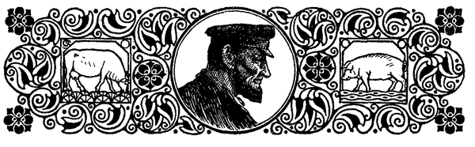
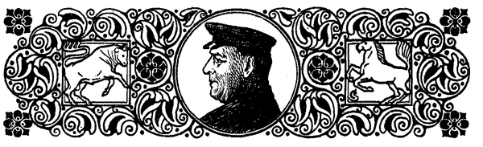

<#include "pagebreak.ftl">
<h2>Marsch- und Geestbauer.</h2>

<h3>Von K. v. d. Eider.</h3>

Herr -- Lehnsmann!« schallte es über den Hofplatz des Lehnsmanns
Kätels zu Olderswort und noch einmal in langgezogenem
Tone: »Herr Lehnsmann!«

Eine dicke Magd in kurzgeschürztem Rock stand in der Hoftür;
sie hielt den bloßen Arm über die Stirn und schaute blinzelnd nach
ihrem Herrn aus.

\<@pagebreak 340/>

Da kam er die Trift herauf, ein Hüne von Gestalt, groß, breitschulterig,
mit einem Ansatz von Leibesfülle. Er beeilte sich nicht
sonderlich, mit großen, langsamen Schritten kam er näher.

»Herr Lehnsmann, da ist einer, der Sie sprechen will!« rief
Stina ihm auf gut plattdeutsch entgegen.

Der Lehnsmann tat im Näherkommen noch einen ordentlichen
Zug aus seiner kurzen Pfeife. »Wer ist da?« fragte er.

»Einer von der Geest. Herr Lehnsmann hat schon ein paar
Bullen und Jungvieh von ihm gekriegt. Ich glaube, er heißt Schwart
oder auch Witt.«

»Gröhn,« sagte der Lehnsmann. Ein Lächeln flog über das
gebräunte, nicht unintelligente Gesicht des Ortsvorstehers.

»Ja, Gröhn, Klas Gröhn aus Wisch.«

»Wo ist er? Auf der Diele?«

»Nein, uns' Herr, die Vordiele wurde gerade geschrubbt; es
ist doch Sonnabend heute.«

»Na, und -- ?«

»Ja, in der Wohnstube war gerade uns' Frau bei zu ölen;
da haben wir ihn in die beste Stube genötigt. Ich wußte nicht,
wo ich anders mit ihm hinsollte.«

»Deern, du bist wohl  närrisch! Meinst	du, ich	halte mir die
beste Stube für die Geestbauern? Konntest ihn ja mitnehmen in
den Stall; er konnte sich ja was mit den Ochsen erzählen.«

»Das wollte ich auch zuerst; aber er hatte einen feinen, schwarzen
Rock an und gewichste Stiefel.«

»Das ist einerlei, ein Geestbauer bleibt ein Geestbauer, und
wenn er Lackstiefel anhätte.« Mit diesen Worten schob Lehnsmann
Kätels sich an der Magd vorbei zur Tür hinein.

\<@pagebreak/>

In der besten Stube, der Staatsstube des friesischen Bauern,
sah es nicht sehr behaglich aus. Sie war ungeheizt und jedenfalls
lange nicht gelüftet. Die roten Ripsmöbel trugen bunte Kattunüberzüge,
die Rouleaus waren heruntergelassen, und in einer Ecke 
des Zimmers waren die Winteräpfel aufgeschüttet und verbreiteten
einen säuerlichen Modergeruch.

Die Ungemütlichkeit des Zimmers schien sich auch dem Gaste
mitgeteilt zu haben. Der kleine, dicke Mann mit dem roten Bulldoggengesicht
saß unruhig auf einem der ungastlichen Stühle und
drehte die Daumenmühle abwechselnd nach rechts und links. Sein
eigener Rock schien ihn zu beengen. Daheim auf seinem Hofe ging
er meistens in Hemdsärmeln, und er hatte die Gewohnheit, wenn er	
sprach, die Daumen in die Ärmellöcher der Weste zu stecken; so
fühlte er sich als Herr.

Das ging hier nicht an. Er hatte den schwarzen Rock an, einen
Rock, der mindestens zwölf Jahre alt war, und der nicht wie sein
Besitzer mit den Jahren an Breite zugenommen hatte. So saß
Klas Gröhn denn in etwas steifer Haltung auf seinem Stuhl und
besah seine großen, arbeitsrauhen Hände und räusperte sich vor
Ungeduld.

»Bleiben Sie sitzen, Gröhn, bleiben Sie sitzen!«

Geräuschvoll wie immer trat der Lehnsmann ein und zwang
mit einer Handbewegung den anderen in seine alte Stellung zurück.

»Man immer sitzen bleiben. In die Wohnstube dürfen wir
nicht hinein, da gehen die Frauensleute zu kehr, schrubben und
ölen und Gott weiß, was. Ja, wenn die Frauensleute das Reinmachen
in den Kopf kriegen! Stopfen Sie sich die Pfeife, Gröhn,
es ist ein echter schwarzer G, Gebrüder Kramer. Was? Sie haben
die Pfeife zu Hause gelassen? Na, denn einen lüttjen Köm. Sti--na,
die Flasche!«

»Machen Sie sich doch keine Umstände, Herr Lehnsmann.«

»Ach was, Umstände! Was gibt es Neues in der Wisch?
Was macht das Viehzeug?«

»Alles gut zuwege, Herr Lehnsmann -- wenn Sie mal wieder
einen Bullen brauchen --«

\<@pagebreak/>
»Ne, ne, lieber Gröhn, kein Mangel, kein Mangel. Frauensleute
brauchen wir, deftige Frauensleute.« Er schlug sich auf die
Knie, daß es klatschte und lachte geräuschvoll über den selbstgemachten
Witz. Erst als der andere ihn verdutzt ansah, merkte er, daß er
nicht verstanden worden war. Er klopfte ihn auf die Schulter und
fügte gewissermaßen erklärend hinzu: »Wenn Sie mal ein paar
trächtige Milchkühe haben, die könnte ich gebrauchen, aber keine
englischen, keine englischen! Die sind nur fürs Auge. Was tue
ich mit der Schönheit! Hab' ich recht, Klas Gröhn?«

Klas Gröhn nickte nur; er war offenbar nicht ganz bei der
Sache. Endlich nahm er den Griff seines Handstockes, den er zwischen
den Knien hielt, aus dem Munde und fragte ganz unvermittelt:
»Nächstens haben Sie hier Pastorenwahl?«

»Jawohl, jawohl.« Der Lehnsmann nickte eifrig. »Was wir
da für einen Kerl kriegen, soll mich verlangen. Wir gehen freilich
nur in den Festtagen mal zur Kirche; wir Bauern können ja nicht
deswegen alle Sonntage anspannen. Aber wenn ich dann mal in
die Kirche gehe, dann will ich auch einen ordentlichen Mann vor
mir auf der Kanzel sehen, keinen Waschlappen.«

»Ich verstehe, so einen wie den Pastor Hinrichs; der war wohl
sehr beliebt?«

»Beliebt? Ja, das weiß ich nicht. Für gewöhnlich kam man
ja nicht mit ihm zusammen. Aber er war ein guter Pastor, alles,
was recht ist. Wenn der auf der Kanzel stand, dann stand er über
einem. Und im gewöhnlichen Leben war er bescheiden wie ein Kind.
So einen bekommen wir schwerlich wieder. Bloß von der Landwirtschaft
verstand er nichts, rein gar nichts.«

»Das wäre!«

«Ja -- er ist ja nun tot, und es ist auch gewiß nichts Schlechtes,
was ich von ihm rede; aber wahr ist's: auf der Kanzel war er ein
Mann, jedoch für die Welt -- nicht zu brauchen, nicht zu brauchen!«

»Das wäre!«

»Ja, ja. Und die Frau Pastor, sie ist ja nun schon alt und
grau, aber nicht plietscher als ein dreijähriges Kind. Manche Leute
sind förmlich darauf ausgegangen, sie anzuschmieren. Erst neulich
kam der Husumer Schlachter hier vorbei; das war, als der alte
Pastor noch lebte. Er brachte uns einen Mörbraten; den esse ich
ganz gern mal, wissen Sie, nicht zu rot gebraten, aber so recht saftig.
Na, um kurz zu erzählen, ich sage zu Henn Alsen: ›Was hat Er 
\<@pagebreak/>
denn da für ein Stück Fleisch in dem Wagen? Da steckt ja der
Kinderkopfsknochen drin, und aussehen tut es, als war' es von
einem Franzosen.‹ -- ›Ja,‹ sagt Henn, ›das kriegt die Frau Pastor.
Da kann ich gern das schlechteste Stück von einem Biest anbringen,
das nächstemal sagt sie doch: ›Ach, Alsen, ein prachtvolles Stück
Fleisch war es, unsere alten Zähne wollen nur nicht recht mehr.‹ --
So ging es überall, für den Pastor war das Schlechteste immer
noch gut.«

»Khm, khm, ja, was ich sagen wollte.« Klas Gröhn räusperte
sich, er suchte nach einem Übergang zu dem, was er sagen wollte.

Der Lehnsmann kam ihm zuvor. Er war gerade in bester
Redelaune und froh, daß er einen Zuhörer gefunden hatte; er ließ
sich das Wort nicht so leicht nehmen. »Ich will Ihnen doch mal
erzählen, was mir passiert ist mit unserem alten Pastor. Es sind
ja schon viele Jahre her, aber mir ist gerade so, als wär' es erst
heute oder gestern passiert. Es war, als unser Jüngster getauft
werden sollte, der nachher am Rachenkrupp gestorben ist -- jetzt hat
man ja ein neues Mittel dagegen --, na, kurz zu erzählen -- ich
hole also unseren Pastor Hinrichs zur Taufe. Die Frau Pastor
war ja auch mit eingeladen; aber sie kam nicht mit, sie war nicht
dafür. Also, es war gerade im Frühjahr, und die beiden Braunen
waren ein bißchen briemsch. Sie kennen sie ja; ein paar echte
Dänen. Na, ich glaube, der Hafer steckte ihnen noch in den Knochen.
Ich denke bei mir: Wenn es man gut geht! Denn als ich hinfuhr,
hatte ich Last, sie zu halten. Wir fahren also ab. Ich sitze auf dem
Bock, vor mir unters Leder habe ich das Taufgeschirr und den Somari,
und hinter mir auf dem Stuhle sitzt mein Pastor und hat die Hände
über den Bauch gefaltet -- er war so recht behäbig -- und macht
ein recht vergnügtes Gesicht. Es ging ja alles gut, bis wir zum
Dorfe hinaus waren. Da langen die Pferde wahrhaftig an, löpsch
zu laufen. Mit einem Male gehen sie mir durch die Wicken, da
gab es kein Halten und Möten. Na, das hoppte nicht schlecht, man
fiel bald auf die rechte, bald auf die linke Seite, bald an die Grabenkante,
bald an den Chausseebock. Jeden Augenblick denke ich: Na,
nun kippt die Kiejohle um, und wir liegen im Graben. Mit aller
Macht halte ich noch die Zügel -- ich habe Kraft, das können Sie
mir glauben. -- Da, als wir näher an den Hof 'rankommen, an
unsere Trift, da werden sie sachter, und ich kriege die Biester wieder
in die Macht. Da drehe ich mich denn nach meinem Pastor um 
\<@pagebreak/>
und denke, ob er wohl noch lebt, ob er wohl vor Schreck in Ohnmacht
gefallen ist, weil er gar nicht schreit und lamentiert. Als ich mich
umdrehe -- was meinen Sie? -- da sieht mich der Alte seelenvergnügt
an, ist ganz kandidel, hat sich ordentlich nach hinten übergelegt
und sagt: ›Da haben Sie mal flott gefahren, Lehnsmann,
Sie verstehen es. Schade, daß es schon vorbei ist?‹ -- Was sagen
Sie dazu, Gröhn? Er hat gar nicht mal gemerkt, daß die Pferde
löpsch liefen. Flott gefahren! Haha! Dazu sind wir Bauern doch
viel zu sehr auf unser Pferd und Wagen bedacht, als daß wir
Galopp führen, was?«

»Da haben Sie recht, Herr Lehnsmann. Ich denke, es wäre
ganz gut, wenn Sie hier mal einen Pastor kriegten, was ein Bauernsohn
ist.«

»Kriegen wir nicht, kriegen wir nicht, Gröhn. Wir Bauern
lassen doch unsere Jungens nicht Pastor studieren.«

Klas Gröhn hüstelte verlegen. »Na ja, hier in der Marsch mag
das wohl nicht in der Mode sein, aber bei uns auf der Geest studieren
viele Bauernsöhne. Mein Jung' ist vergangenen Monat
Pastor geworden.«

»Was, Ihr Junge ist Pastor geworden? Alle bonnör! Welcher
ist es, der Älteste?«

»Nein, der kriegt doch den Hof, der andere ist es, der Detlef.«

»So, so, den haben Sie studieren lassen. Hätt' ich nicht getan,
hätt' ich nicht getan. Bauer bleibt Bauer!«

»Ach Gott ja, Sie haben ja recht, Herr Lehnsmann, aber es
war ja mit dem Jungen rein gar nichts anzufangen. Den ganzen
lieben Tag schmökerte er in den Büchern herum, und wenn ich ihn
hinausjagte und nachher dachte, er wäre beim Futtern oder Misten,
dann lag er in der Bodenluke und kiekte in die blaue Luft. Er
hat was von seiner Mutter. Sie wissen wohl, Herr Lehnsmann,
was meine Frau ist, die ist ein bißchen schnaksch. Ich will nicht
sagen, daß sie ihren Verstand nicht hat. Gott bewahre! Nein --
aber ein bißchen bedenklich ist sie und ein bißchen menschenscheu.
Wenn irgendein Fremder über den Hof kommt, dann läuft sie in
ihre Kammer und kommt nicht eher heraus, bis er fort ist -- davon
hat auch der Junge etwas abgekriegt. Was soll man nun mit
solchem Bengel machen? Ich wollte ihn erst Schulmeister werden
lassen, weil das doch lange nicht so viel kostet; aber er ist man
schmal von Brust; ich glaube, den ganzen Tag auf die unartigen 
\<@pagebreak/>
Gören herumzuhauen, das hätte er auf die Dauer nicht ausgehalten.
Ich sagte mir: Wenn es auch ein bißchen mehr kostet, nachher hat
er doch als Pastor sein ruhiges Brot.«

Lehnsmann Kätels rückte seinen schweren Körper unruhig auf
dem Stuhle hin und her, nickte mit dem Kopfe und tat hastige Züge
aus der kurzen Pfeife. Er, der Vielredende, der überall das große
Wort führte, war nicht gewohnt, so lange zuzuhören. Er schüttelte
den Kopf, »Hätt' ich nicht getan. Warum ließen Sie den Jungen
nicht Advokat werden oder Doktor, da war er doch mehr zwischen
Menschen und konnte auch mehr Geld verdienen. Geld, das ist die
Hauptsache!«

»Das ist man so 'ne Sache.« Klas Gröhn kraute sich hinter
den Ohren. »Vor den Advokaten habe ich bannige Manschetten.
Soll ich nun nachher bange sein, wenn mein Sohn über den Hof
kommt, daß er mir was ans Zeug flicken will? Ne, ne! Und
Doktor, ja, das wollte der Junge ja gerade werden, mit Gewalt,
mit Händen und Füßen wollte er Doktor werden. Aber was für
einer? Nicht für die Krankheiten, nein, bloß für die Wissenschaften
und die Titulatschon. Was meinen Sie, Herr Lehnsmann, wenn
dann ich oder meine Altsche mal krank werden, dann kann er einem
nicht mal ein Rezept verschreiben; dann ist er ein Doktor und doch
wieder keiner. ›Ne,‹ sage ich, ›entweder ziehst du die blaue Jacke
an und gehst in den Stall, oder du wirst Pastor. Punktum --
streu Sand auf!‹ Da hat er denn Einsicht gehabt. Vergangenen
Sonntag hat er seine Einführungspredigt als Pastor gehalten. Es
war eine sehr feine Predigt; der Herr Generalsuperintendent und
der Herr Propst waren auch dabei. Na, er ist ja auch hellisch klug
und ist viel in der Welt herumgekommen. In Husum ist er auf
die Schule gegangen, dann war er unten in Deutschland; sogar in
Berlin ist er gewesen, wo der Kaiser sein Schloß hat. In Berlin --«

»In Berlin? War ich auch, lieber Gröhn, war ich auch. Vor
ein paar Jahren, damals als die Mastviehausstellung war. Hab'
auch 'ne Auszeichnung bekommen. Da hängt sie unter Glas und
Rahmen. Ich hatte ein paar Bullen da. Ei, das waren Kerle!
Unter uns, Gröhn, es ist nichts los mit Berlin. Bloß Häuser und
Menschen. Was hat man davon? ›Unser Willem‹ war gar nicht
da. Und das Essen -- ich hab' mich die drei Tage nicht einmal satt
gegessen. Sehen Sie, da auf der Kommode liegt noch das Rundstück,
das ich meiner Altschen als Andenken von Berlin mitgebracht 
\<@pagebreak/>
habe, damit die Frauensleute auch mal einen Begriff davon haben,
wie es in der Welt hergeht. ›Knüppel‹ sagen sie in Berlin zu diesem
Backwerk; nicht größer als mein Daumen ist es. Und von ein paar
solcher Dinger und einem kleinen Klecks Butter soll ein gesunder
Mensch satt werden, wenn er morgens aufsteht und die ganze Nacht
hindurch nichts gegessen hat. Nein, da lob' ich mir ein paar
Rundum Schwarzbrot mit Speck zum Kaffee. Ich bin auch in ein
paar Resteratschons gegangen; ich hatte mir es in den Kopf gesetzt,
ich wollte satt werden. Aber was meinen Sie, da kriegt man bloß
eine oder zwei Kartoffeln zum Fleisch und dann trocken Brot in
'nem kleinen Korb. Trocken Brot zum Fleisch! Trocken Brot, so
wahr ich hier sitze.«

«Ja, ja,« nickte Klas Gröhn. »Dick und fett ist mein Junge
da auch nicht geworden; aber ich glaube, bei ihm setzt es nicht an.
Na, nun ist er ja Gott sei Dank aus dem gröbsten; wenn er nun
man erst 'ne gute Stelle hätte. Darum wollte ich den Herrn Lehnsmann
bitten, ob der Herr Lehnsmann nicht ein gutes Wort für ihn
einlegen könnte, daß er mit auf die Wahl kommt.«

Jetzt war es heraus. Jetzt hatte Klas Gröhn sein Anliegen
vorgebracht.

Der Lehnsmann tat einen kurzen Pfiff durch die Zähne. »Ach,
das ist Ihr Junge, der sich gemeldet hat, der Gröhn. Ja, es sind
ja eine ganze Menge. Es ist ja auch ein schönes Pastorat; mit
Landheuer, und alles in allem steht sich der Pastor beinahe auf zehntausend
Mark im Jahre. Ja, wir können uns das leisten. Aber
ob Ihr Sohn da ankommen wird, ist die Frage. Bei dem Kollegium
habe ich es ja in der Hand. Daß er mit auf die Wahl kommt,
dafür kann ich schon sorgen. Aber nachher habe ich auch bloß eine
Stimme, wenn sich auch wohl manch einer danach richtet. Das beste
wäre, wenn er ein paar Tage vorher bei den Bauern herumginge
zu kuren; das ist hier so Mode. Dann braucht er auch hinterher
keine Visiten zu machen. Die Arbeiter richten sich ja nach ihren
Bauern, und wenn er gut anspricht, dann kann etwas daraus werden.
Warum nicht?«

»Ja, das soll er machen, bei den Bauern herumgehen; dazu ist
er nicht zu gut. Auch vielen Dank, Herr Lehnsmann.«

»Kein' Ursach', kein' Ursach'! Sagen Sie mal, hat er schon
eine Frau?«
 
\<@pagebreak/>
»Nein, noch nicht, aber es geht los, sobald er eine Stelle hat.
Er ist versprochen mit Frau Todsen ihrer Tochter aus Husum. Die
Alte hat das Papiergeschäft auf der Twiete. Sie ist 'ne ganz rare
Deern und kriegt auch einen netten Groschen Geld mit. Die Alte
hat was zusammengeschrapt, die hat Moses und die Propheten.«

»Aber das wundert mich doch, daß er eine Frau aus der Stadt
nimmt; das ist nicht recht was fürs Land.«

»Ja, mich war das auch erst gar nicht recht, daß er 'ne Stadtdeern
freien wollte. Ich sage, das ist nichts mit einer Frau, die
so schrecklich gebildet ist, womit man den ganzen Tag hochdeutsch
sprechen muß. Man mag doch auch mal ein Wort Platt schnacken.
Das ist ja gerade, als wenn man die ganze Woche hindurch die
Sonntagskledasche auf dem Leibe hätte.«

Der Lehnsmann nickte verständnisinnig. »Ganz recht, mein
lieber Gröhn, ganz recht. Aber nun will ich Ihnen noch eins sagen:
Wir leben hier in der Marsch, und das ist lange nicht so, als wenn
Sie auf der Geest sind; das ist ein gewaltiger Unterschied. Bei
Ihnen in Wisch, da ist der Pastor ein großer, mächtiger Mann.
Da heißt es Herr Pastor vorn und Herr Pastor hinten und Herr
Pastor von beiden Seiten. Bei uns dagegen wird der Pastor nicht
mehr gerechnet als die anderen Leute. Da kommt zuerst der Bauer,
und dann kommt er noch einmal, und zum drittenmal kommt er erst
recht, und dann kommen erst der Pastor und die anderen an die
Reihe. Wir müssen ja einen Pastor haben, der Sonntags den
Dorfleuten etwas vorpredigt und Festtags auch mal vor den Bauern
spricht, und der nebenbei die Kindtaufen und die Leichen besorgt
und auch die Trauungen, was aber man über lang mal vorkommt.
Das Dorf hat ja noch keine tausend Einwohner. Für all das kriegt
er freie Wohnung, das Pastorat mit anderthalb Morgen Garten
und kriegt auch sein gutes Gehalt in Landheuer; das ist doch nicht
schlecht, was? Wenn er dann Zeit übrig hat, kann er sich ja mal
ein bißchen um die armen Leute kümmern, wenn da mal einer
krank oder stuckelig wird. Wir Bauern haben keine Zeit, daß wir
uns viel um ihn bekümmern können; wir brauchen ihn auch nicht.
Wenn mal Hochzeit oder Kindtaufe ist, muß man ihn ja anstandshalber
nötigen und seine Frau auch, aber die braucht nicht mitzukommen,
und der Pastor bleibt auch bloß bis nach dem Essen, dann
lauern die jungen Leute schon darauf, daß er man geht; sie wollen
doch auch ein bißchen lustig sein. Aber Umgang halten wir mit 
\<@pagebreak/>
unseren Pastoren nicht, das sage ich Ihnen gleich; das ist uns zu
umständlich!«

»Ist auch gar nicht nötig, Herr Lehnsmann. Was braucht ein
Pastor Umgang? Der hat ja Frau und Kinder und dann seine
Bücher; wenn ein Pastor man Bücher hat, dann kümmert er sich
nicht um die Welt. Dis Hauptsache ist doch, daß er sein Brot hat.«

»Das hat er bei uns, das hat er hundertmal und noch Fett
dazu.« Bei diesen Worten erhob sich der Lehnsmann. Er hatte
auf der Diele ein verdächtiges Klirren von Messern und Gabeln
vernommen, und er kannte seine Frau.

Klas Gröhn stand auch auf. »Ich kann mich also auf Ihr Wort
verlassen, Herr Lehnsmann? Ich tu' Ihnen gern mal wieder einen
Gefallen, und wenn ich etwas von einer guten Milchkuh höre --«

»Versteht sich, versteht sich, lieber Gröhn! Adjüs, und grüßen
Sie zu Hause.«

Aus: K. v. d, Eider, Meerumschlungen. (Berlin, F. Fontane &amp; Co.)

