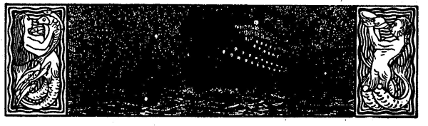

<h2>Schipper Harms.</h2>

<h3>Von W. Peper.</h3>

Auf einer kleinen Anbaustelle am Wege, der zu den großen Höfen
abseit vom Städtchen führte, wohnte Schipper Harms. Die
Schifferjacke und die blaue Mütze paßten nicht recht auf die dunkle
Hausdiele mit den kleinen Ställen, ebensowenig die beiden verstaubten
Modelle von ein paar schwerfälligen holländischen Kuffen.
Auch Harms paßte nicht unter die Menschen; mit den Nachbarn
hatte er keinen Verkehr. Nur die Jungen, manchmal auch die
kleinen Schulmädchen wanderten gern vorbei an der Hofstelle, besonders
wenn der Alte bei irgendeiner Arbeit im Garten oder auf
den beiden Wenden Land zu sehen war, die ihm gehörten. Da kam 
<@pagebreak 358/>
er wohl langsam an den flachen Graben hinan und reckte die große,
braune, verarbeitete Hand über den Dornenzaun. »Min Jung,
magst'n Appel?« fragte er dann in seiner sachten Art. »Hier, min
lütt Deern, kumm, do de Hand op!« Und begehrliche, glückliche
Kinderaugen blickten ihn dann oft dankbar an; still und scheu
glitten seine harten Hände dann auch wohl über die Flachsköpfe
hin, die er besonders liebte.

Die Leute aber sagten, er hätte seinen Sohn auf dem Gewissen.

Das sollte lange her sein, und die älteren Schiffer des Städtchens
wußten, daß es sich wirklich so verhielt.

Was war Harms damals für ein glücklicher Mensch! Er hatte
als Vollmatrose für ein Hamburger Kontor gefahren. Was er sich
erspart hatte, und was er von seinen Eltern an einer kleinen Hinterlassenschaft
geerbt, langte gerade, einen Ewer zu kaufen, und so fuhr
denn Harms Stückgut nach Hamburg und zurück. Wenn aber mit
der Flut die Schiffe in den kleinen Heimathafen einzulaufen pflegten,
stand am Bollwerk die junge Frau Anna mit ihrem flachsköpfigen
Hinrich auf dem Arm. Wenn der Ewer vertaut war, sprang Fritz
Harms an Land und ließ sich den Jungen geben, und zwei glückliche
Menschen wanderten nach Hause. Als der Junge größer wurde,
kletterte er am Deck herum, kroch durch die Luken, schlug sein Quartier
in der Kombüse auf und schaute auch wohl sehnsüchtig in die streng
verbotenen Wanten hinauf. So war er zwölf Jahre geworden.

Schon zwei Jahre lang hatte der Vater ihm versprochen, ihn
mit hinaufzunehmen nach Hamburg. Die »Herrlichkeit«, wo diese
Schiffer anzulegen pflegten, war in Hinrichs Träumen ein
Märchenland.

Harms hatte Steine geladen von einer der großen Ziegeleien
am Strom. Das Schiff lag mit tiefem Bord schwer im Wasser. Am
Nachmittage wollte man mit der passenden Tide den Hafen verlassen.
Da wurde das Wetter böig, und von der Seeseite her zog grauer
Dunst. In Frau Annas Augen aber flackerte eine gewaltsam unterdrückte,
sie unruhig umhertreibende Angst. Endlich hielt sie es nicht
mehr aus.

»Mann, bleib heute noch liegen. Der Sturmball ist hoch, und
ihr kriegt zu schwere Fahrt.«
 
<@pagebreak/>
»Ach was,« lachte Harms sorglos, »wenn man Euch Frauensleute
hört, könnte man das ganze Jahr in der Kombüse liegen; wenn
ich nicht rechtzeitig abliefere, kann ich bezahlen.«

»Dann laß Hinrich heut bei mir bleiben«, bat die Mutter.
»Ich hab so eine Angst auf mir. Ich weiß mir nicht zu helfen.
Laß Hinrich hier, Mann. Laß ihn hier; es passiert was.«

Als könnte sie ihr Kind schützen, umfaßte sie es. Hinrich machte
sich los, voller Sorge, daß ihm die Reise in das Märchenland, dies
Ziel seiner Jugendträume, wieder vor den Augen schwinden könnte.
Nichts half der verängsteten Frau, und am Nachmittag gingen die
drei zum Hafen.

In den Blöcken rollten die Schoten, die Segel gingen hoch und
der Knecht löste die Vertauung. Da ging Anna noch einmal an
ihren Mann hinan: »Laß mir den Hinrich hier; ich weiß nicht,
was es ist; aber die Angst bringt mich um.« Heißer als ihre Worte
flehten ihre Augen. Der sonst so gutmütig ruhige Schiffer brummte
unwirsch: »Ach was, Weiberkram, was soll dem Jungen passieren,
wenn ich dabei bin?«

Dann reichte er der Frau die Hand zum Abschied. Sie ging
nun still über die Planke zurück; die wurde schnell fortgezogen, und
langsam setzte sich das Schiff in Drift. Anna stand still am Bollwerk;
sie sah die Gestalt ihres Knaben neben dem Vater an der
Steuerpinne stehen. Der Ewer mußte zuerst aufkreuzen gegen den
Wind, und fliehend und wieder nahend schwand er zuletzt im Gewühl
der braunen und weißen Segel. Die Frau ging dann heim
mit wehem Herzen; ihr war's, sie könnte ihr Kind, ihr einziges, nie
wiedersehen.

Dann kam die Nacht, die entsetzliche Nacht. Schlaflos, ruhelos
stand die Mutter und starrte durch die Fensterscheiben hinaus in
das wüste Gejage der Wolken, durch das nur verloren ein flüchtiger,
kahler Streifen Mondlicht herabbrach.

Der Nordwest peitschte das Flutwasser in die Elbe hinauf. Harms
und der Knecht hatten schwere Arbeit; das Schiff lag für den unruhigen
Wellengang zu tief. Die Luken waren dicht gemacht; den
Knaben hatte der Vater in die Koje geschickt zum Schlafen.

Wenn der nur hätte schlafen können! An die Planken platschte,
gurgelte, dröhnte das Wasser. Ein heulendes, rauschendes Getöse,
das noch durch die Deckplanken zu spüren war.
 
<@pagebreak/>
In der schweren, unsichtigen Luft glitten wie Riesenschatten
rechts und links die Schiffe vorbei, mit kümmerlichem Schein, der
in breitem Dunstkreis zerfloß, glimmerten wie Raubtieraugen die
Laternen. Die straffgefüllten Segel schlugen knatternd. Da geriet
am Klüverbaum die Sache in Unordnung. Der Knecht lief nach
vorn und arbeitete an den Schoten herum. Harms, der das Steuer
genommen hatte, unterließ es ein paar Augenblicke, das Fahrwasser
abzulugen, weil er die Arbeit des Knechtes im Auge hielt.

Da glinstert vor ihm roter Schein auf; es faucht und stampft.
Wie ein riesenhaftes Raubtier springt es auf. Harms reißt das Ruder
hart Backbord. Zu spät!

Ein Zittern durchläuft das kleine Schiff. Ein knirschendes
Scharren, ein splitterndes Krachen -- und der Koloß gleitet ruhig
weiter.

Der Knecht war ins Wasser hinabgefegt. Harms rief vom Bord
herab; aus dem gurgelnden Rauschen und dem hellen Sturmpfeifen
klang aber kein Menschenlaut wieder.

Die Stunde, die nun anbrach, grub sich dem armen Manne tief
und furchtbar ins Herz. Der Dampfer hatte die Planken des Ewers
vorne aufgerissen, und das Schiff fing sofort an, schwer Wasser zu
ziehen. Der Schiffer drehte bei und hielt auf das Land zu, um
den Ewer am Ufer auf Grund zu setzen. Da! Sein Junge in der
Koje! Er muß ja herauf!

Harms stürzt vom Steuer fort. Da triff's wie ein dumpfer Schlag
sein Gehirn. Die Deckverkleidung ist beim Stoß zusammengedrückt
und versperrt den Kojeneingang. Und der Junge ist drinnen! Der
Schiffer stürzt hin und her über Deck, ein Beil zu finden, ein Beil!

Nur noch die Planken sprengen, und dann mit dem Jungen
ins Boot! Das ist die einzige Rettung. Er merkt es; keine Viertelstunde
mehr geht das Schiff.

Kein Beil, kein Stück zu finden -- nichts, nichts!

Grauenvolle Angst will den Vater überwältigen. Da! Ein
Gedanke der Rettung! Wenn der Junge sich durch die kleinen Kojenfenster
zwängen könnte. Harms springt hinab in das tanzende Boot,
das hinten nachschleppt.

Er schlägt mit der Faust an das Fenster. Der Junge öffnet
es. Mit Augen, in denen das Entsetzen starrt, schaut er den Vater
an und schluchzt:
 
<@pagebreak/>
»Min Vadder, watt is los? Mutt ik verdrinken? Help mi
doch, min Vadder, help mi doch!«

Harms ergreift seines Jungen Arm: »Flink, min Jung, kannst
du nich dör't Finster? Kumm! Kumm!« Er zerrt und zieht. Es
ist unmöglich. Da sinkt des Vaters Hand schlaff zurück. Ihm ist,
als schlüge das Wasser zusammen über ihm, als läg er mit seinem
Jungen auf tiefem Grunde.

Der Knabe weint leise.

»Watt schall min Mudder denken, min söte Mudder, wenn ik
nich na Hus kam?«

Das Schiff fängt an, ruckweise zu sinken. Der Schiffer umfaßt
seines Sohnes Kopf; er küßt den Jungen. »Heinrich, kumm, wi
wüllt dat Vaterunser beden!«

Zitternd lallt der arme Junge das Gebet. Des Vaters Worte
sind wie ein einziger Hülfeschrei.

Das Wasser plätschert zur Koje herein; es steigt an dem weinenden
Kinde herauf, es umfassend und umschmiegend.

»O min Mudder, min söte Mudder!«

Rundum grollt die Finsternis. Dicht sein Gesicht an die Öffnung
pressend, sieht Harms in das zitternde, blutlose Antlitz seines Kindes.
Die Hände der beiden liegen fest ineinander geklammert; ihre ganze
Seele ist in ihre Augen getreten, mit denen sie Abschied nehmen voneinander.
Was Menschenseelen leiden können, in jener Stunde
erfuhr es der Mann.

Ein neuer Ruck. Das Wasser spült in die Fenster. -- Was
dann kam -- nie trat über die Lippen des Schiffers ein Wort davon.

Seit jener Nacht hat Harms keine Schiffsplanke wieder betreten.

Aus: Niedersachsen. (Carl Schünemann, Bremen.)

