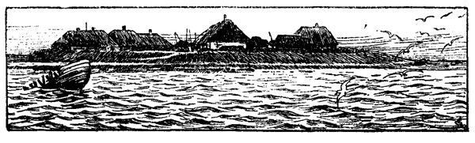

<#include "pagebreak.ftl">
\<@pagebreak 367/>

<h2>Drinnen und Draußen.</h2>

<h3>Von Friedrich Paulsen.</h3>

Mit unbegrenzter Befriedigung blicke ich auf das Elternhaus
zurück, das mich gehegt und gebildet hat, gebildet nicht so
sehr durch Reden und Hören als durch unmittelbare Teilnahme an
der Fülle von Leben und Wirksamkeit, das es in seinem engen Kreise
beschloß. In der Tat, wenn ich ein solches Bauernhaus mit den
Großstadthäusern vergleiche, in welchen nun ein immer mehr anschwellender
Teil unseres Volkes lebt und aufwächst, dann kann ich
nicht umhin, die fortschreitende Verarmung der Jugend zu beklagen,
Verarmung an Bildungsmöglichkeiten und Verarmung an Freuden.
Dort war die ganze Welt in lebendiger Wirklichkeit gegenwärtig:
die Natur mit allem Reichtum ihrer Formen und Erzeugnisse war
uns zugänglich und vertraut, Äcker und Felder, Wiesen und Weiden,
Heide und Moor, fließende Bäche und stehende Gräben, Wehlen
und Teiche, Dünen und Hügel, Deiche und Dämme, Watten und
Priele, Flut und Ebbe, wir kannten sie, nicht von einem kurzen
Sonntagnachmittagsausflug sondern aus täglichem intimsten Umgang;
in jedem Graben haben wir gewatet und Fische gefangen, in
jedem Teich und Fluß gebadet, jeden Bach abgedämmt, auf jedem
Acker gepflügt, in jeder Fenne gearbeitet, auf jeder Wiese Heu gemacht;
über jede Heide sind wir gesprungen und haben Beeren gepflückt
oder den Eidechsen zugesehen, auch wohl einmal eine Schlange
gescheucht, von jeder Düne haben wir uns im Sommer heruntergewälzt
oder im Winter auf Schlitten herabsausen lassen. So haben
wir den Himmel bei Tag und bei Nacht gesehen, am Morgen das
Erblassen der Sterne und das Aufleuchten des Frührots erlebt,
am Abend der untergehenden Sonne ins Angesicht geschaut und
die ersten Sterne wetteifernd gesucht und gezählt, das heraufziehende
Wetter beobachtet und die sengenden Blitze in fast fühlbarer Nähe
niederfahren sehen, den Regen über uns niederrauschen lassen und
in der glühenden Sonne nackt im Sande gelegen. Auf Pferden 
\<@pagebreak/>
haben wir uns getummelt, ohne Sattel und Zaum manchen wilden
Ritt getan, bis der Reiter zur Erde glitt oder auch einmal kopfüber
in den Graben geschleudert wurde; mit Kälbern und Lämmern
haben wir gespielt, mit Pferden und Kühen auf der Weide gelegen,
mit Schafen und Ochsen, die den Weg nicht wollten, den sie sollten,
sind wir um die Wette gelaufen; den Fischen haben wir mit Netzen
und Schlingen nachgestellt, den Vögeln ihre Nester abgelauscht, den
Kibitzen und Rebhühnern die Eier genommen, den Grasmücken
und Bachstelzen die Jungen mit Fliegen füttern helfen, ob sie sie
schätzten oder nicht. Kurz, die ganze Natur lag innerhalb des Bereichs
nicht nur unserer Augen sondern auch unserer Hände und
Füße, wir lebten mit ihr als ein Teil ihrer selbst.

Und wie die Natur, so lag das ganze menschliche Dasein in
unserem Bereich, nahe, faßlich, verständlich. Alle elementaren Künste
der Kultur hatten im Haushalt ihren Ort; das Großstadtkind sieht
nur die fertigen Dinge und ihre Verzehrung, wir sahen sie alle
entstehen, vom ersten Anfang bis zur Vollendung, das Brot und
das Bier, das Hemd und die Jacke, fast nichts kam in unseren Gesichtskreis,
von dessen Herstellung wir nicht eine anschauliche Erkenntnis
gehabt hätten. Denn auch die Dinge, die das Haus nicht
selber herstellte, sahen wir entstehen: der Schneider kam und schnitt
auf dem großen, aufgeschlagenen Klapptisch nach großem Papiermuster
den Stoff zum Anzug zurecht, dann setzte er sich, ein Wunder
zu sehen, mit untergeschlagenen Beinen auf denselben Tisch und
nähte die Stücke zusammen. Im Frühjahr und Herbst kam der
Zimmermann auf einige Tage ins Haus, besserte aus und fertigte
Neues, hobelte und sägte, natürlich wir immer dabei zusehend und
wohl auch einmal Hand anlegend. Und was nicht ins Haus kam,
das suchten wir auf; bei dem alten Schuhmacher waren wir häufige
Gäste: man wartete eine Stunde, um das zum Ausbessern gebrachte
Schuhwerk gleich wieder mitnehmen zu können und sahen ihm inzwischen
zu, wie er mit Leder und Leisten, mit Ahle und Pechdraht,
mit Schusterhammer und Messer hantierte oder am Abend durch
eine gefüllte Wasserkugel das Licht des dürftigen Öllämpchens auf
einen Punkt sammelte.

Und nicht minder kehrten wir gern beim Schmied ein: es war
ein fröhlicher Mann, und er hatte uns gern, wenn wir im Winter
aus der Schule kommend vorsprachen und zusahen, wie er das weißglühende
Eisen mit der Zange aus der Kohlenglut zog und mit dem 
\<@pagebreak/>
Hammer bearbeitete, daß die Funken in alle Ecken der dunklen
Werkstatt stoben und die Mädchen laut aufschrien.

Wie abstrakt und oberflächlich und dürftig bleibt hiergegen die
Vorstellungswelt des Großstadtkindes. Die Natur sieht es nur
auf dem Papier, das Bilderbuch und das Lesebuch geben blasse Vorstellungen
von Feld und Wald, von Tieren und Pflanzen, höchstens
daß es noch einmal am Sommernachmittag die Dinge selbst sieht,
aber wieder nur von weitem und ohne an sie heranzukommen: alles
ist vor ihm verschlossen und vergittert. Dagegen hat es täglich um
sich eine Welt künstlicher Dinge und Vorgänge, in deren Inneres
es nicht hineinzusehen vermag: die elektrische Lampe und die Straßenbahn,
das Telephon und das Automobil, das Warenhaus mit seinen
tausend die Begierde aber nicht die Erkenntnis herausfordernden
Dingen, das Museum mit seinen unverstanden angestarrten Kunstwerken
oder Resten einer nur dem Gelehrten erreichbaren Vergangenheit.
So wächst es auf unter lauter Dingen, die ihm stumm bleiben,
und endlich gewöhnt es sich, nicht mehr zu fragen sondern mit der
Oberfläche und der unverstandenen Benutzung sich zufrieden zu geben.

Und nicht viel anders steht es mit den menschlichen Verhältnissen,
den privaten und den öffentlichen. Die Großstadtmenschen
sehen sich nur von weitem und kennen sich von der Oberfläche, sie
wissen voneinander Namen und Titel, Stellung und Parteirichtung
und derlei Äußerliches, aber die Wurzeln des Daseins des andern,
die erreichen sie nicht, und darum wissen sie auch von dem Innersten
des persönlichen Lebens so wenig. Ich bin oft erstaunt gewesen,
nach dem Tode eines Mannes, den ich jahrelang gekannt, den ich
täglich gesehen hatte, aus seiner Biographie zu erfahren, wie wenig
ich im Grunde von ihm gewußt hatte. Dagegen im Dorf weiß jeder
vom andern, nicht bloß von gestern und vorgestern sondern von
Eltern und Großeltern her; man sieht die Verhältnisse, unter denen
er geworden ist, in denen er lebt, seine Frau und Kinder, seine Heimstätte
und seine Arbeit, sein Gedeihen und Mißlingen. Was weiß
von allen diesen Dingen in der Großstadt der Kollege vom Kollegen?
Sie sehen sich täglich, sie tauschen Gedanken und Meinungen über
alle Dinge aus, aber von ihrem eigentlichen Erleben sehen sie meist
so gut wie nichts; es bleibt eine schattenhafte Kenntnis von dem
Reden, Meinen und Sichgeben des andern.

Und ähnlich mit den öffentlichen Angelegenheiten. Man liest
davon in der Zeitung und redet davon am Biertisch und vielleicht 
\<@pagebreak/>
in der Volksversammlung. Aber wie am letzten Ende »der Staat«
und »die Gesellschaft« aussieht und wirkt, davon gewinnt der Junge,
der auf dem Lande aufwächst, viel eher eine lebendige Anschauung.
Ich kannte den Landvogt und den Aktuar in Bredstedt, ich wußte,
zu wem man geht, wenn man dies oder jenes Geschäft hat, ich kannte
die Gemeindebeamten und die Kirchspielsversammlung und wußte,
wie es darin hergeht, ich wußte, was der und jener zu tun hatte, der
Vater hatte das Geschäft selbst jahrelang gehabt, und ich hatte ihm
Handlanger- und Botendienste dabei verrichtet. Ich wußte von den
Rechtsgeschäften, von Hypotheken und Stempelpapieren, von Kaufbriefen
und Mietsverträgen, sie gingen früh durch meine Hände.
Ebenso von Steuern und Abgaben, die »Quittungsbücher« über
bezahlte Grundsteuern und Koogssteuern, Kirchen- und Schullasten
lagen in der Schatulle des Vaters, und er verwehrte mir nicht, sie
durchzusehen. So hab' ich auch von Einnahmen und Ausgaben des
Haushalts früh konkrete Einsicht gehabt: was die Ochsen und Schafe,
der Roggen und Hafer, das Heu und Stroh kosteten und also einbrachten,
war das tägliche Gespräch. Und wie mit den Preisen der
Erzeugnisse die Landpreise stiegen und fielen, wie die Art des Anbaus
des Landes mit dem Wechsel der Konjunktur sich änderte,
wie der Kornbau zurückging, als der Fettviehexport nach England
in den fünfziger Jahren begann, wie bei steigenden Wollpreisen
die Aufzucht von Schafen sich rasch vermehrte und wieder nachließ,
als der große Import von Australien einsetzte: alles dies lag vor
den Augen schon des aufmerkenden und aufhorchenden Knaben.

Und nicht bloß die wirtschaftlichen Verhältnisse der Gegenwart,
auch ihre Einordnung in den geschichtlichen Zusammenhang wurde
ihm sichtbar. Meine Jugendjahre fielen in die Zeit mächtig aufsteigenden
Gedeihens der Landwirtschaft; sie begann langsam in den
vierziger Jahren, ging dann stoßweise aufwärts in den fünfziger
Jahren; man führte das Steigen aller Preise, der Pferde, des Hafers,
des Fleisches, auf den Krimkrieg zurück, der die Nachfrage für den
Militärbedarf rasch in die Höhe trieb. Dann kamen die sechziger
Jahre mit der wachsenden Industrie, die Jahre des Aufschnellens
nach dem Krieg von 1870, in denen das Land unbegrenzten Wert
zu erhalten schien. Vorher war aber eine Zeit der Not gegangen,
die den Eltern noch lebendig vor der Seele stand und oft in den
Gesprächen vorkam: in den zwanziger, dreißiger Jahren waren die
Erzeugnisse der Landwirtschaft fast wertlos und unabsetzbar gewesen; 
\<@pagebreak/>
für einen dreijährigen Ochsen wurden 10--12 Taler Hamburgisch,
für eine Tonne Hafer 2 Mark Lübsch, für ein Pfund Butter 2 Schilling
(15 Pfennig) bezahlt. Kein Wunder, daß die Geldknappheit
aufs äußerste stieg und daß die schönsten Bauernstellen in Masse
für nichts im Konkurs verkauft werden mußten; wer Schulden hatte
aus früherer besserer Zeit, oder wer ein wenig leichter das Geld
ausgab, der kam alsbald von Haus und Hof.

Von allen diesen Dingen hatte ich eine lebendige Anschauung,
ehe ich die Namen von »Staat« und »Gesellschaft« gehört haben
mochte: in der friesischen Sprache gibt es keine Wörter dafür. Was
will gegen solche konkrete Belehrung der Unterricht besagen, den
das Stadtkind, so Gott will, in der Schule über die »Verdienste der
Hohenzollern um die Bürger und Bauern« oder über die »Verderblichkeit
der sozialdemokratischen Lehren« erhält? oder den es sich
selber aus Zeitungen oder Gesprächen gewinnt? Ich habe nachher
zeitweilig mit Leidenschaft Nationalökonomie studiert; es war die
Freude, das, was ich aus der Anschauung kannte, nun in der großen
Theorie wiederzufinden; vor allem hat es mir aus diesem Grund
Roschers Nationalökonomie des Ackerbaus angetan; ich hab' sogar
den Vater dahin gebracht, von mir Vorträge darüber sich halten
zu lassen, natürlich nicht Kathedervorträge.

Nicht minder lag auch die soziale Struktur in einfacher und
durchsichtiger Gestalt vor Augen. Das Dorf bildete eine übersehbare
Lebensgemeinschaft. Das tragende Grundgerüst machten die selbständigen,
Bauernhöfe aus. Daran lehnten sich die Handwerke:
alle notwendigen Arbeiten waren vertreten, jeder Handwerker hatte
regelmäßig eine Anzahl Bauern als seine Kundschaft, der Müller,
der Schmied, der Rademacher usw.; ihre Aufträge waren die Unterlage
seiner Lebenshaltung. Dazu kam als eine dritte Gruppe der
Pastor, der Schullehrer, der Arzt, der Beamte: sie standen einigermaßen
außer oder über der Gesellschaft, sie mit Leistungen versehend,
die nicht auf einheimischen, bodenständigen Künsten beruhen. Ebenso
trat die soziale Schichtung, die Klassenbildung in primitiver Form
faßlich zutage. Es gab Großbauern, sie waren mehr in den neuen
Kögen heimisch, die nicht selbst mit Hand anlegten bei der Arbeit,
dann eine sehr breite Schicht von mittleren Bauern, die regelmäßig
mehr oder minder sich selber an der landwirtschaftlichen Arbeit beteiligten.
Dann folgte eine Schicht kleiner Besitzer, die auf dem
eigenen Landbesitz nicht mehr ausreichende Arbeit für die Familienglieder
\<@pagebreak/>
hatten und daher durch übernommene Dienste ihr Einkommen
steigerten, sei es durch Fuhrdienste oder durch Krämerei, Tagelohn
und Handwerk. Endlich kamen die eigentlichen Tagelöhner, die nur
ein Haus mit Garten und vielleicht noch Land für eine Kuh oder
ein paar Schafe hatten, sonst es mieteten; sie standen meist in regelmäßigem
Arbeitsverhältnis zu einem Bauernhof, ihre Kinder gingen
erst als Hütejungen, dann als Dienstboten in Stellung. Endlich
am Rand eine sehr kleine Schicht von Armen, meist durch Krankheit
und Unglück heruntergekommene oder auch durch eigene Schuld,
durch Trunk und Trägheit verkommene Familien: sie lebten von
gelegentlicher Arbeit und vom Betteln. Einige Insassen des Armenhauses,
erwerbsunfähige Alte, unversorgte, meist uneheliche Kinder,
Krüppel, Idioten, machten den Beschluß.

Anmerkung: In der Kirche zu Langenhorn ist unter dem von Prof.
Fr. Paulsen gestifteten, dem Andenken seiner Eltern gewidmeten Fenster, das
den Apostel Paulus darstellt, eine Gedächtnistafel angebracht. Sie besteht aus
drei Teilen. Die mittlere Haupttafel trägt folgende Inschrift:

<pre class="center">An
<i>D. Dr.</i> Friedrich Paulsen
Geboren allhier zu Langenhom
Am 16. Juli 1846
Wo seine Eltern waren
Paul Fr. Paulsen u. Christine geb. Ketelsen
Seine Lehrer
Küster S. Brodersen und Pastor C. Thomsen
Gestorben zu Steglitz bei Berlin
Am 14. Aug. 1908
Nachdem er an der Berliner Universität
durch 33 Jahre als Lehrer der Philosophie
und Pädagogik gewirkt hat.

Der Wahrheit
Und der gesunden Vernunft Freund
Feind der Lüge und dem Schein
Ein Anhänger der guten Sache
Auch der nicht siegreichen
Der Ehre der Welt nicht allzu begierig
Nicht im Gefolge des Willens zur Macht
Der Heimat treu
Den Eltern u. Lehrern seiner Jugend dankbar zugetan
Lebte er in einer Zeit
Die von dem Allen das Gegenteil hielt
Und verließ darum nicht unwillig diese Welt
In der Hoffnung
einer besseren.</pre>

\<@pagebreak/>
So lag die Gliederung der Gesellschaft nach dem Besitz sichtbar
vor Augen; man wußte von jedem Bauern, wieviel Demat Land er
besaß, und von jeder Familie, in welchen Verhältnissen sie sich befand,
sah auch, wie die Verhältnisse von dem Verhalten abhängig
waren, warum diese Familie im Aufsteigen war, jene nicht auf einen
grünen Zweig kommen konnte: alles Dinge, die in der Großstadt
unsichtbar oder doch undurchsichtig bleiben. Womit es denn doch
wohl zusammenhängt, daß allerlei seltsame Meinungen hier so leicht
sich durchsetzen, z. B. daß das ökonomische Ergehen des einzelnen von
seinem Verhalten überhaupt nicht abhängig sei, oder daß seine Verhältnisse
nun eben von den Verhältnissen kommen, und ähnliche.

Hinzufügen möchte ich noch dies, daß die soziale Gliederung die
Einheit der Lebensgemeinschaft nicht aufhob. Es gab in dieser
Bauerngesellschaft nirgends eine Spaltung, eine Kluft zwischen den
Klassen, wie sie im Osten des Landes vorhanden ist, ja wie sie hier
eigentlich die Grundlage der ganzen Gesellschaftsordnung bildet:
die Spaltung in Rittergutsbesitzer und Tagelöhner, in offiziersfähige

Die linke Tafel trägt folgende Inschrift:

<pre class="center">Der Lieben und Guten,
Der Gefährtin meines ersten Glücks,
Der Mutter meiner Kinder,
Ihr, deren Glück es war, Freude zu machen,
Frau Emilie Paulsen geb. Ferchel
Geb. zu Kaufbeuren 13. März 1846
Durch einen allzufrühen
Vielbeweinten Tod abgerufen
Zu Pyrmont 14. Juni 1883
In treuer Erinnerung
Gewidmet.</pre>
         
Inschrift der rechten Tafel:

<pre class="center">Der Gottgeliebten
Der treuesten Gattin
Der aufopferndsten Mutter
Der umsichtigen Hausfrau
Der Freundin der Armen
Der allezeit Fröhlichen
Tapferen Tätigen
Frau Laura Paulsen geb. Ferchel
Geb. Nördlingen 26. Sept. 1851
schrieb diese Inschrift
ihr vor ihr dahingegangener	
Gatte.</pre>

\<@pagebreak/>
Familien und Gemeine, in Gebildete und Ungebildete, in Hochwohlgeborene
und überhaupt Nicht-Geborene. Alle Stufen des
Besitzes waren durch kontinuierliche Übergänge verknüpft; zwischen
allen bestand, wenn auch mit Abstufungen, <i>conubium</i> und <i>commercium;</i>
man saß wie in der Kirche so in der Schule und im Wirtshaus beisammen.
In der Schule hatten die Kinder der reichen Bauern neben
denen der Tagelöhner ihren Platz, und selbst die Insassen des Armenhauses
saßen durch die Klasse verteilt, je nachdem ihre Fähigkeiten
und ihr Fleiß ihnen einen Platz verschafften. Im ganzen hatten
natürlich die Wohlhabenden den Vorzug, schon wegen des regelmäßigeren
Schulbesuchs; aber zuletzt gab doch die persönliche
Leistungsfähigkeit den Ausschlag. Und nicht anders war es beim
Spiel: jeder gilt, soviel er kann; eine Ausschaltung kam auch hier
nicht vor, wenn einer sich nicht selbst unmöglich machte. Und dieses
einheitliche Leben in der Jugend setzte sich fort auch bei den Erwachsenen.
Zwar traten die Unterschiede des Besitzes stärker hervor;
doch blieb auch hier die Gemeinsamkeit des Tanzplatzes und der
Kegelbahn, der Liedertafel und des Ringreitens: auch der Knecht und
das Dienstmädchen war nicht ausgeschlossen. Und so kamen denn
Zwischenheiraten nicht so gar selten vor; ein tüchtiger und bewährter
Knecht konnte um die Tochter eines Bauern oder die Hand
seiner Witwe anhalten, ohne von vornherein der Ablehnung gewiß
zu sein, und das Umgekehrte kam wohl noch häufiger vor, daß
Bauernsöhne Töchter von Handwerkern oder kleinen Leuten, die
dienten, heirateten.

Dieser demokratische Charakter der Gesellschaft prägte sich auch
überall in der Sitte und Sprache aus. Wie man bei der Arbeit
und bei Tisch auf dem Fuß der Gleichheit verkehrte, -- es war selbstverständlich,
daß die Dienstboten bei uns mit am Tisch aßen -- so
machte die Sprache in einer bemerkenswerten Weise alle zu Gleichen:
alle Gleichalterigen nannten sich du, dagegen wurde die ältere Generation
ohne Rücksicht auf die gesellschaftliche Stellung mit der Anrede
durch den Namen, wie die Eltern durch die Anrede mit Vater
oder Mutter, geehrt, während sie die jüngeren mit dem Du ansprach.
Nur der Altersunterschied, ein allgemein menschlicher, nicht der gesellschaftliche
Unterschied gab eine Vorzugsstellung. Ausgenommen
waren nur die Pastoren, Lehrer, Beamte, die natürlich mit ihren
Amtsnamen angeredet wurden, meist auch Fremde waren und nicht
Friesisch redeten. So bin ich, wenn ich als Student oder junger 
\<@pagebreak/>
Doktor nach Hause kam, von den älteren Leuten, auch unserem
Tagelöhner, mit Du angeredet worden, vielleicht einmal mit einer
Art Entschuldigung: eigentlich darf ich ja wohl so nicht mehr sagen;
während ich sie mit dem Namen anredete. Es wäre mir einfach gegen
den eingeborenen Sprachsinn gegangen, anders zu verfahren. So
wenig ich gegen Vater und Mutter jemals das Du über die Zunge
gebracht hätte -- man konnte durchaus nur sagen: ich bitte Vater,
dies oder das zu tun -- so wenig konnte ich einen doppelt so alten
Mann anders als mit Namen anreden: Wie geht es, Carsten?

Aus: Friedrich Paulsen, Aus meinem Leben. (Jena, Eugen Diederichs.)

