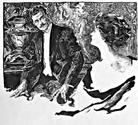

Erstes Kapitel
==============
Es gibt überall Gelegenheit zu Heldentaten
------------------------------------------

Mister Hungerton, ihr Vater, war der taktloseste Mensch auf der Welt – ein flaumiger, fedriger, schmuddeliger Kakadu von einem Menschen, durchaus gutmütig, aber restlos eingestellt auf sein eigenes lächerliches Selbst. Wenn irgend etwas mich von Gladys hätte wegtreiben können, so wäre es der Gedanke an solch einen Schwiegervater gewesen. Ich bin überzeugt, dass er in der Tiefe seines Herzens glaubte, ich käme dreimal in der Woche zu den alten Kastanienbäumen herum, um das Vergnügen seiner Gesellschaft zu genießen, insbesondere aber um seine Ansichten über Bimetallismus – eine Materie, in der er eine Art von Autorität war – zu hören.

Länger als eine Stunde schon ließ ich an diesem Abend sein eintöniges Geschwätz über Verschlechterung des Geldes, über den angenommenen Wert des Silbers, die Entwertung der Rupie und die wahren Normen der Wechselkurse über mich ergehen.

»Stellen Sie sich vor,« rief er in einem Anfall von Heftigkeit aus, »dass alle Schulden in der Welt zu gleicher Zeit und sofort bezahlt werden müssten! Was würde unter den gegenwärtigen Verhältnissen geschehen?«

Ich gab die selbstverständliche Antwort, dass ich dann ein ruinierter Mann sein würde, worauf er von seinem Stuhl auffuhr, mir meinen gewohnten Leichtsinn, der es ihm unmöglich mache, irgendeinen ernsthaften Gegenstand in meiner Gegenwart zu diskutieren, vorwarf, wütend aus dem Zimmer stampfte und die Tür heftig ins Schloss warf, um sich für die Loge umzuziehen.

Ich war also endlich allein mit Gladys, und der Augenblick, der mein Schicksal entscheiden sollte, war gekommen! Den ganzen Abend hatte ich das Gefühl eines Soldaten, der das Signal erwartet, das ihn auf einen verlorenen Posten schickt, ein Gefühl, in dem die Hoffnung auf den Sieg mit der Furcht vor der Niederlage abwechselt.

Sie saß vor mir, ihr stolzes und zartes Profil hob sich klar gegen den roten Vorhang ab. Wie schön sie war! Und doch wie fern! Wir waren bisher gute Freunde gewesen, recht gute Freunde, niemals aber war es mir gelungen, über jenen Grad von Kameradschaftlichkeit hinauszukommen, wie er etwa zwischen mir und einem Kollegen von der Zeitung hätte bestehen können, – ganz aufrichtig, sehr liebenswürdig und völlig platonisch. Meine innersten Gefühle sind immer gegen ein weibliches Wesen eingenommen, das mir gegenüber frei und unbefangen ist. Diese Haltung ist kein Kompliment für einen Mann. Sobald der Gegensatz der Geschlechter erwacht, regen sich Furcht und Misstrauen, diese Erbschaft aus roheren Zeiten, als Liebe und Gewalt noch Hand in Hand gingen. Das gesenkte Haupt, die abgewendeten Augen, die stockende Stimme, die bebende Gestalt – all dies und nicht der freie Blick und die ungezwungene Antwort sind der wahre Ausdruck der Leidenschaft. Soviel hatte ich sogar schon während meines kurzen Lebens erfahren – oder lebte doch als Instinkt, wie wir das Rassengedächtnis nennen, in mir.

Gladys besaß alle echt weiblichen Eigenschaften. Einige hielten sie für kalt und gefühllos, aber dies Urteil war nicht zutreffend. Der zarte Bronzeton ihrer Haut, fast orientalisch in der Färbung, das rabenschwarze Haar, die großen sanften Augen, die vollen, aber entzückend geformten Lippen, – alle diese Zeichen der Leidenschaft waren vorhanden. Aber ich war mir schmerzlich bewusst, dass ich bis jetzt das Geheimnis, diese Leidenschaft zu entflammen, nicht entdeckt hatte. Indessen, mochte kommen was da wollte, ich musste der Ungewissheit ein Ende machen und meine Sache heute abend noch zur Entscheidung bringen. Mochte sie mich abweisen; besser ein zurückgestoßener Liebhaber als ein geduldeter Bruder.

Soweit war ich in meinen Gedanken gekommen und im Begriff, das lange und peinliche Schweigen zu brechen, als zwei kritische, dunkle Augen sich auf mich richteten und Gladys, vorwurfsvoll lächelnd, das stolze Haupt schüttelte.

»Ich habe das Gefühl, dass Sie im Begriff sind, mir einen Heiratsantrag zu machen, Ned. Ich möchte nicht, dass Sie es tun, es ist viel hübscher so, wie es jetzt ist.«

Ich zog meinen Stuhl etwas näher heran.

»So, woher wissen Sie denn, dass ich die Absicht habe, Ihnen einen Heiratsantrag zu machen?« fragte ich ehrlich erstaunt.

»Wissen Frauen nicht immer alles? Glauben Sie, dass es irgend ein Weib auf der Welt gibt, das es nicht merkt, wenn sich jemand für sie interessiert? Nein, Ned, unsere Freundschaft war so schön und so reizvoll! Wie schade wäre es, sie zu zerstören! Fühlen Sie nicht, wie herrlich es ist, wenn ein junger Mann und ein junges Mädchen so freimütig miteinander sprechen, wie wir es getan haben?«

»Ich weiß nicht, Gladys. Freimütig sprechen kann ich auch mit – dem Stationsvorsteher.« Ich habe keine Ahnung, wie dieser Beamte in unsere Unterhaltung hineingeriet, aber er geriet hinein, und wir mussten beide lachen.

»Das genügt mir auf die Dauer nicht. Ich möchte meinen Arm um Sie legen und Ihren Kopf an meine Brust drücken, und, ach Gladys, ich möchte – – –«

Sie sprang vom Stuhle auf, da ihr klar wurde, dass ich die Absicht hatte, meine weiteren Wünsche in die Tat umzusetzen.

»Sie haben alles zerstört, Ned,« sagte sie, »es ist alles so schön und natürlich, bis eine gewisse Grenze überschritten wird. Es ist so schade. Warum können Sie sich nicht besser beherrschen?«

»Das ist keine Erfindung von mir,« verteidigte ich mich, »das ist Natur, das ist Liebe.«

»Es mag wohl anders sein, wenn beide lieben. Ich habe noch niemals geliebt.«

»Aber Sie müssen – – – Sie mit Ihrer Schönheit, mit Ihrer Seele! O Gladys, Sie sind ja geschaffen für die Liebe. Sie müssen lieben!«

»Man muss warten, bis die Liebe kommt.«

»Aber warum können Sie mich nicht lieben, Gladys? Ist es mein Äußeres oder was sonst?«

Ihr Gesicht hellte sich auf. Sie streckte eine Hand aus – ihre ganze Haltung war so gütig und so herablassend – und bog meinen Kopf zurück. Dann sah sie mir mit einem gedankenvollen Lächeln in das aufwärts gerichtete Gesicht.

»Nein, das ist es nicht,« sagte sie schließlich, »Sie sind nicht gerade ein hässlicher Mann, und darum kann ich wohl sagen, dass es das nicht ist. Es liegt tiefer.«

»Mein Charakter?«

Sie nickte ernst.

»Was kann ich tun, um ihn zu verbessern? Setzen Sie sich doch und sagen Sie mir etwas darüber. Nein, bitte, ich möchte, dass Sie sich setzen.«

Sie sah mich mit einem erstaunten Misstrauen an, das mir viel besser gefiel als ihr Vertrauen bei unbewegtem Herzen.

Wie primitiv und dumm das alles aussieht, wenn man es schwarz auf weiß niederschreibt! Aber schließlich ist es vielleicht eine Empfindung, die nur mir selbst verständlich ist. Genug, sie setzte sich.

»Nun sagen Sie mir, woran es mir fehlt.«

»Ich liebe jemand anders«, sagte sie.

Jetzt war die Reihe an mir, vom Stuhle aufzuspringen.

»Es ist niemand im besonderen,« fuhr sie, über meinen Gesichtsausdruck lachend, fort, »es ist nur ein Ideal. Ich bin einem solchen Mann, wie er mir vorschwebt, niemals begegnet.«

»Erzählen Sie mir etwas über ihn. Wie sieht er aus?«

»Oh, er könnte Ihnen sehr ähnlich sein.«

»Wie entzückend von Ihnen, das zu sagen! Gut, und was tut er, was ich nicht täte? Sagen Sie es mir gerade heraus! Abstinenzler, Vegetarier, Luftschiffer, Theosoph, Übermensch – ich werde alles versuchen, Gladys, wenn Sie mir nur eine Vorstellung davon geben wollen, was Ihnen gefallen könnte.«

Sie lachte über die Elastizität meines Wesens.

»Gut, zunächst einmal glaube ich, mein Ideal würde nicht so reden«, sagte sie. »Er würde ein kühner, energischer Mann sein, der nicht so leicht bereit wäre, der Laune eines törichten Mädchens zu entsprechen. Auf jeden Fall aber müsste er ein Mann der Tat sein, der dem Tode ohne Furcht ins Auge blickt – ein Mann von großen Taten und außerordentlichen Erlebnissen. Es ist niemals der Mann, den ich lieben würde, sondern immer der Ruhm, mit dem er sich bedeckt. Denn davon würde ein Abglanz auf mich fallen. Denken Sie an Richard Burton! Als ich die Biographie seiner Frau über ihn las, konnte ich ihre Liebe verstehen. Und Lady Stanley! Haben Sie das wundervolle letzte Kapitel über ihren Mann jemals gelesen? Das ist die Art von Männern, die eine Frau von ganzer Seele anbetet, die dabei doch und nicht zum wenigsten durch ihre Liebe die größere sein kann, die von aller Welt geehrt wird als die Urheberin edler Taten.«

Sie sah so schön aus in ihrem Enthusiasmus, dass ich fast das Ziel unserer Unterhaltung aus dem Auge verlor. Ich riss mich zusammen, um in meiner Beweisführung fortzufahren.

»Wir können nicht alle Stanleys und Burtons sein«, sagte ich. »Übrigens trifft der Glücksfall nicht jeden – mir jedenfalls hat immer die richtige Gelegenheit gefehlt. Sollte der Zufall mir günstig sein, so würde ich ihn nutzen.«

»Aber Gelegenheit zu Heldentaten gibt es doch überall. Es ist das Zeichen dieser Art von Männern, die ich meine, dass sie ihres eigenen Glückes Schmied sind. Solch ein Mann lässt sich nicht zurückhalten. Ich habe ihn niemals getroffen, und doch ist mir, als kenne ich ihn ganz genau. Es gibt so viele heroische Taten rings um uns herum, die nur darauf warten, getan zu werden. Es ist die Aufgabe der Männer, sie zu tun, und die Aufgabe der Frauen, ihre Liebe als Geschenk für solche Männer aufzuheben. Sehen Sie diesen jungen Franzosen, der in der vorigen Woche mit einem Ballon aufstieg. Es wehte eine steife Brise, aber da die Ballonfahrt einmal angezeigt war, bestand er darauf, aufzusteigen. Der Wind trieb ihn 1500 Meilen weit in 24 Stunden, und er kam mitten in Russland zu Boden. Das ist die Art von Mann, die ich meine. Denken Sie an die Frau, die er liebte, und wie die anderen Frauen sie beneidet haben müssen! Das ist es, was ich liebe – beneidet werden meines Mannes wegen.«

»Ich würde es getan haben, um Ihnen zu gefallen.«

»Aber Sie sollen es nicht tun, nur um mir zu gefallen, Sie sollen es tun, weil Sie nicht anders können, weil es Ihre Natur ist, – weil alles in Ihnen schreit nach einer heroischen Tat. Warum konnten Sie nicht, als Sie neulich von der Kohlenstaub-Explosion in Wigan berichteten, in den Schacht hinuntersteigen, um trotz der giftigen Gase den Bergleuten zu helfen?«

»Ich tat es.«

»Aber Sie haben niemals davon gesprochen.«

»Das war nichts, was der Rede wert gewesen wäre.«

»Das wusste ich nicht.«

Ihre Augen ruhten mit stärkerem Interesse auf mir. »Das war brav von Ihnen.«

»Ich musste das doch tun. Wenn man einen guten Bericht schreiben will, muss man doch da sein, wo etwas passiert.«

»Was für eine prosaische Begründung. Damit nehmen Sie Ihrer Handlungsweise alles Romantische. Aber immerhin, was auch Ihr Grund gewesen sein mag, ich freue mich, dass Sie in den Schacht hinuntergestiegen sind.«

Sie reichte mir ihre Hand, aber mit solcher Anmut und Würde, dass ich mich nur darüber beugen und sie küssen konnte.

»Ich möchte sagen, ich bin ja nur ein törichtes Weib mit den Phantasien eines jungen Mädchens im Kopfe; und doch ist meine Empfindung so. Sie ist so völlig ein Ausdruck meines inneren Wesens, dass ich nicht anders handeln kann. Wenn ich jemanden heirate, so muss er ein berühmter Mann sein.«

»Na, und warum denn nicht?« rief ich aus. »Gerade ein Weib wie Sie macht den Mann stark. Geben Sie mir eine Gelegenheit, und Sie werden sehen, dass ich sie ausnutze. Übrigens, wie Sie sagen, soll der richtige Mann sich die Gelegenheit selber schaffen und nicht warten, bis sie ihm gegeben wird. Sehen Sie Clive – nur ein kleiner Schreiber, und doch eroberte er Indien. Beim heiligen Sankt Georg! Ich werde schon noch etwas unternehmen in der Welt!«

Sie lachte über mein plötzliches irisches Feuer.

»Warum nicht«, sagte sie. »Sie haben alles, was ein Mann haben kann – Jugend, Gesundheit, Kraft, Bildung, Energie. Ich war so traurig, dass Sie gesprochen haben, und jetzt bin ich froh – so froh, wenn unser Gespräch solche Gedanken in Ihnen erweckt hat.«

»Und wenn ich es tue – – –?«

Ihre Hand legte sich wie warmer Samt auf meine Lippen.

»Kein Wort mehr, mein Herr! Sie sollten schon vor einer halben Stunde in der Abendredaktion sein. Ich konnte es nur nicht übers Herz bringen, Sie daran zu erinnern. Wenn Sie eines Tages vielleicht sich Ihren Platz in der Welt erobert haben werden, dann wollen wir von neuem darüber reden.«

Und so entdeckte ich mich selbst an diesem nebligen Novemberabend, als ich hinter der Trambahn, die nach Camberwall fährt, herlief, mit glühendem Herzen in der Brust und fest entschlossen, keinen Tag vergehen zu lassen, bevor ich die Tat ausfindig gemacht hätte, die mich meiner Herzensdame würdig machte.

Aber wer in aller Welt hätte sich eine Vorstellung machen können von der unglaublichen Gestalt, die diese Tat annahm, oder von den seltsamen Wegen, die ich zu gehen hatte, um sie auszuführen?

Und am Ende wird es dem Leser noch scheinen, als ob dies Einleitungskapitel gar nichts mit meiner Erzählung zu tun hat. Und doch würde diese Erzählung ohne dieses Kapitel nicht zustande gekommen sein, denn nur, wenn ein Mann mit dem Gedanken in die Welt hinausgeht, dass überall heroische Taten möglich sind, und mit dem immer lebendigen Wunsche im Herzen, eine solche auszuführen, sobald sie sich ihm darbietet, wird er mit seinem Leben brechen, wie ich es getan habe, und sich hinauswagen in das zauberhaft mystische Dämmerland, wo die großen Abenteuer und die großen Erfolge ihm winken. Schaut mich an denn, ihr in der Redaktion der Daily Gazette, deren höchst unbedeutendes Mitglied ich bisher war, wie ich fest entschlossen bin, wenn möglich noch in dieser Nacht das Abenteuer zu suchen, das mich meiner Gladys würdig macht.

War es Hartherzigkeit, war es Eigennutz, wenn sie mich aufgefordert hat, mein Leben für ihre Ruhmsucht zu wagen? Solche Gedanken mögen einem Manne reiferen Alters kommen, niemals aber einem kühnen dreiundzwanzigjährigen Jüngling im Feuer seiner ersten Liebe. 
