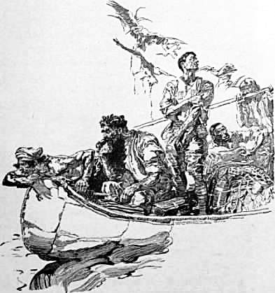
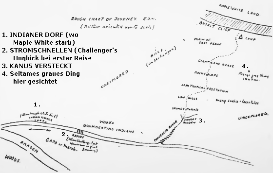

Achtes Kapitel
==============
Die Vorposten der neuen Welt
----------------------------

Unsere Freunde in der Heimat mögen sich mit uns freuen, denn wir sind am Ziel und stehen kurz davor, den Beweis für die Richtigkeit der Behauptungen Professor Challengers zu liefern. Wir haben zwar das Plateau noch nicht erstiegen, aber es liegt vor uns, und sogar Professor Summerlee zeigt eine sanftere Stimmung. Nicht, dass er auch nur einen Augenblick zugeben würde, dass sein Rivale im Recht wäre, aber er ist weniger nachdrücklich in seinen unaufhörlichen Einwendungen und meistens versunken in schweigende Beobachtung. Ich muss indessen zurückgreifen und den Faden meiner Erzählung dort, wo ich ihn habe fallen lassen, wieder aufnehmen. Wir senden jetzt einen unserer Eingeborenen, der sich eine Verletzung zugezogen hat, zurück, und ich übergebe ihm diesen Brief zur Beförderung, wenn auch mit erheblichen Zweifeln, ob er jemals seine Adresse erreichen wird.

Als ich das letzte Mal schrieb, waren wir im Begriff, das indianische Dorf, wo uns die »Esmeralda« abgesetzt hatte, zu verlassen. Ich muss meinen weiteren Bericht mit einer unerfreulichen Mitteilung beginnen. Denn wir hatten heute abend einen ernsten persönlichen Vorfall, der leicht zu einem tragischen Ende hätte führen können (die unaufhörlichen Häkeleien zwischen den beiden Professoren übergehe ich). Ich habe unseren englisch sprechenden Mischling Gomez erwähnt, einen tüchtigen Arbeiter und fleißigen Menschen, aber behaftet, wie mir scheint, mit dem Laster der Neugierde, die offenbar das Allgemeingut dieser Art Menschen ist. Er schien sich gestern abend in der Nähe unseres Zeltes, in dem wir unsere Pläne diskutierten, versteckt zu haben und wurde von dem riesenhaften Neger Zambo, der ihn beobachtet hatte und der uns ebenso treu ist wie er, wie alle seiner Rasse, die Mischlinge hasst, aus seinem Versteck herausgeholt und vor uns gebracht. Gomez zückte sein Messer und hätte den Neger sicherlich niedergestoßen, wenn es diesem mit seinen enormen Kräften nicht gelungen wäre, ihn mit einer Hand zu entwaffnen. Die Sache lief aus mit Vorwürfen, die beiden Gegner wurden gezwungen, sich die Hand zu reichen, und man darf hoffen, dass alles wieder in Ordnung ist. Was die Fehden unserer beiden gelehrten Männer angeht, so wurden sie dauernd und mit Erbitterung fortgesetzt. Ich muss zugeben, dass Challenger im höchsten Grade herausfordernd ist, aber auch Summerlee hat eine scharfe Zunge, die das Verhältnis nicht besser macht. Gestern abend sagte Challenger, dass er niemals Interesse daran gehabt hätte, auf dem Themsekai spazierenzugehen, um zu dem Ort hinüberzuschauen, in dem so mancher das Ziel seiner Wünsche erblicke. Natürlich ist er innerlich fest davon überzeugt, dass er einst in der Westminster-Abtei ruhen wird. Summerlee antwortete jedoch mit einem sauertöpfischen Lächeln: soweit er wisse, wäre doch das Millbank-Gefängnis abgerissen. Challengers Eigendünkel ist viel zu kolossal, als dass er ihm erlaubte, sich durch diese Worte getroffen zu fühlen. Er lächelte nur in seinen Bart hinein und wiederholte: »So ist es, so ist es«, mit dem mitleidigen Ton, wie man ihn Kindern gegenüber gebraucht. In der Tat, sie sind beide Kinder – der eine vertrocknet und streitsüchtig, der andere gewaltsam und überheblich –, und doch jeder von ihnen mit einem Gehirn, das ihm einen Platz in den ersten Reihen seines wissenschaftlichen Zeitalters anweist.

Schon am nächsten Tage brachen wir tatsächlich auf zu unserer bedeutsamen Expedition. Alles, was wir besaßen, ließ sich sehr leicht in den beiden Kanus verstauen. Das Personal verteilten wir gleichmäßig, wobei wir nur die begreifliche Vorsicht gebrauchten, im Interesse des Friedens in jedem der beiden Boote je einen der Professoren unterzubringen. Ich persönlich war mit Challenger zusammen, den ein prächtiger Humor erfüllte und dessen ganzes Wesen stille Ekstase und strahlende Güte war. Ich habe ja allerdings bereits einige andere Erfahrungen mit ihm gemacht und würde mich nicht wundern, wenn plötzlich ein Gewittersturm den Sonnenschein unterbräche. Es ist unmöglich, sich in seiner Nähe behaglich zu fühlen, und ebenso unmöglich, sich bei ihm zu langweilen, denn man ist immer im Zustande erwartungsvoller Neugierde, welche Wendung sein erregbares Temperament nehmen wird.

Zwei Tage lang fuhren wir auf dem gut schiffbaren, einige hundert Meter breiten Strom, auf diesem dunkel gefärbten, aber meist bis auf den Grund durchscheinenden Wasser dahin. Die Hälfte der Nebenflüsse des Amazonenstroms ist von demselben Charakter, während die andere Hälfte ein weißliches und undurchsichtiges Wasser führt. Die dunkle Farbe rührt von pflanzlichen Verfallstoffen her, während die anderen Verunreinigungen ihren Ursprung in lehmigem Boden haben. Zweimal gelangten wir an Stromschnellen, und in jedem Fall mussten wir unser Besitztum etwa eine halbe Meile weit tragen, um sie zu umgehen. Der Urwald auf beiden Seiten war noch in seinem ursprünglichen Zustand, in dem er leichter zu durchschreiten ist, als wenn er mit Nachwuchs durchsetzt ist, so dass wir keine großen Schwierigkeiten beim Transport unserer Kanus hatten. Niemals werde ich die geheimnisvolle Feierlichkeit in seinem Innern vergessen. Die Höhe der Bäume, die Dicke der Stämme überschritt alles, was ich mir mit meiner an städtisches Leben gewohnten Seele jemals hätte vorstellen können. In prächtigen Säulen stiegen sie auf bis zu einer gewaltigen Höhe über uns, in der wir kaum die Stellen erkennen konnten, wo sich ihre Zweige zu gotischen Spitzbögen zusammenfügten und zu einer grünen Decke verflochten, durch die nur gelegentlich ein goldener Sonnenstrahl herniederschoss, um eine zitternde Lichtlinie inmitten der majestätischen Dunkelheit zu bilden. Als wir so geräuschlos auf dem dichten, weichen Teppich modernder Vegetation dahinschritten, legte sich ein Schweigen auf unsere Seele, wie es uns überkommt im Zwielicht eines Domes, und sogar Professor Challengers lautschallende Reden verwandelten sich in ein Flüstern. Wäre ich allein gewesen, ich hätte nicht gewusst, unter welchen riesenhaften Gewächsen ich wandelte, aber unsere Männer der Wissenschaft bezeichneten uns die Zedern, die großen Baumwollbäume, die Rotholzstämme und jene ganze Mischung der verschiedenen Pflanzen, die diesen Kontinent für das Menschengeschlecht zur Hauptquelle aller jener Gaben macht, die aus dem Pflanzenreich herrühren, während er in all solchen Produkten, die aus der Tierwelt stammen, außerordentlich hinter anderen zurücksteht. Leuchtende Orchideen und wundervoll gefärbte Flechten glommen auf den düsteren Stämmen, und wo ein wandernder Lichtstrahl auf goldene Allamandas, auf die scharlachroten Sternblüten der Taxonia oder das üppige Tiefblau der Ipomäa fiel, wurde der Traum aus einem Wunderland lebendig. In diesen weiten Wäldern strebt das Leben, das die Dunkelheit verabscheut, immer kämpfend zum Licht. Jede Pflanze, selbst die kleinste, steigt zur grünen Oberfläche empor, indem sie sich um stärkere und größere Brüder herumwindet. Riesenhaft und üppig sind die Schlinggewächse entwickelt. Aber auch solche, die man an anderen Orten nicht als Kletterpflanzen zu sehen gewohnt ist, lernen die Kunst, sich der dunklen Tiefe zu entziehen, so die gewöhnliche Nessel, der Jasmin und sogar die Jacitara-Palme umklammern die Zedernstämme und streben danach, deren Kronen zu erreichen. Kein animalisches Leben regte sich inmitten dieser gewölbten Bogengänge, die sich während unseres Marsches vor uns auftaten. Aber eine beständige Bewegung hoch über unseren Köpfen erzählte von jener unendlichen Welt von Schlangen und Affen, von Vögeln und Faultieren, die im Sonnenschein leben und mit Erstaunen auf unsere kleinen, dunklen, stolpernden Gestalten in der unermesslichen dämmerigen Tiefe unter ihnen herniederblickten. Bei Sonnenauf- und -niedergang ertönte das vielstimmige Geheul der Brüllaffen und das schrille Geschnatter der Papageien, während in den heißen Stunden des Tages nur das laute Summen der Insekten, ähnlich dem Geräusch einer entfernten Brandung, an unser Ohr schlug. Nichts regte sich sonst inmitten des düsteren Bildes der riesenhaften Stämme, die langsam in der uns umhüllenden Dunkelheit verschwanden. Einmal nur bewegte sich ein krummbeiniges schleichendes Tier, vielleicht ein Ameisenfresser oder ein Bär, schwerfällig durch das Dunkel. Es war die einzige Spur von tierischem Leben, die ich auf dem Boden dieses großen Urwaldes bemerkte.

Und doch hatten wir Anzeichen, dass selbst Menschen nicht weit von uns in dieser geheimnisvollen Abgeschiedenheit vorhanden waren. Am dritten Tage nach unserer Abfahrt vernahmen wir ein eigenartiges tiefes Klopfen aus der Ferne, das, rhythmisch und feierlich, dann und wann im Laufe des Vormittags ertönte und wieder aufhörte. Die beiden Boote paddelten wenige Meter voneinander entfernt, als wir das Geräusch zuerst vernahmen, und unsere Indianer verharrten in regungslosem Schweigen, als ob sie in Bronzestatuen verwandelt wären, mit dem Ausdruck des Schreckens auf den Gesichtern in die Ferne horchend.

»Was ist denn das?« fragte ich.

»Trommeln,« sagte Lord John in gleichgültigem Ton, »Kriegstrommeln, die kenne ich von früher her.«

»Ja, Herr, Kriegstrommeln«, sagte Gomez, der Mischling. »Wilde Indianer, Banditen, keine Ansässigen. Sie belauern uns auf unserem Wege, töten uns, wenn sie können.«

»Wie können die uns denn auflauern?« fragte ich, in die dunkle, regungslose Weite starrend.

Der Mischling zuckte die Achsel.

»Die Indianer wissen schon. Verstehen das. Beobachten uns. Reden die Trommelsprache miteinander, töten uns, wenn sie können.«

Am Nachmittag desselben Tages – mein Taschenbuch weist aus, dass es Donnerstag, der 18. August war – hörte man mindestens sechs oder sieben Trommeln aus verschiedenen Richtungen. Manchmal erklangen sie im lebhaften Tempo, manchmal langsam; zuweilen unterschied man klar Frage und Antwort. Eine weit im Osten rasselte plötzlich im hohen Stakkato, worauf nach einer Pause die Antwort in einem dumpfen Rollen aus dem Norden erfolgte. Dieses beständige Wirbeln hatte etwas unbeschreiblich Nervenerregendes und Drohendes an sich, das seinen Ausdruck sogar in dem endlos wiederholten Gemurmel der Mischlinge fand: »Wir werden euch töten, wenn wir können, wir werden euch töten, wenn wir können.« Nichts regte sich sonst in den schweigenden Wäldern. Der tiefe Friede und die besänftigende Ruhe der Natur lag in diesem dunklen Vorhang der Vegetation. Aber aus weiter Ferne hinter ihm tönte immer wieder die eine Botschaft unserer Mitmenschen herüber. »Wir werden euch töten, wenn wir können,« sagten die Menschen im Osten, »wir werden euch töten, wenn wir können«, sagten die Menschen im Norden.

Den ganzen Tag über dröhnten und ratterten die Trommeln, und ihre Drohungen spiegelten sich wider in den Gesichtern unserer farbigen Hilfsmannschaft. Sogar der verwegene, prahlerische Mischling schien entmutigt. Ich aber habe an diesem Tage ein für allemal festgestellt, dass unsere beiden Professoren, Summerlee und Challenger, jenen höchsten Typ des Mutes besaßen, der Darwin bei den Gauchos in Argentinien oder Wallace unter den malaiischen Kopfjägern aufrechterhielt. Eine gütige Natur hat es so eingerichtet, dass das menschliche Gehirn nicht an zwei Dinge gleichzeitig denken kann, so dass es, wenn es von wissenschaftlichem Interesse erfüllt ist, keinen Raum mehr für lediglich persönliche Rücksichten hat. Den ganzen Tag über haben unsere beiden Professoren während des unaufhörlichen und geheimnisvollen Dröhnens jeden fliegenden Vogel beobachtet und jeden Strauch am Ufer gemustert. Mit manchem scharfen Wortstreit, in dem das Knurren von Summerlee in rascher Folge mit dem tiefen Brummen Challengers abwechselte, aber ohne die Empfindung irgendeiner Gefahr, und nicht mehr Rücksicht auf die Trommel schlagenden Indianer nehmend, als wenn sie miteinander im Rauchzimmer des Royal Society Club in St. James' Street gesessen hätten. Nur einmal ließen sie sich herab, diesen Gegenstand zu diskutieren.

»Miranha- oder Amajuaca-Kannibalen«, sagte Challenger, mit dem rückwärts gewendeten Daumen auf den vom Trommeln widerhallenden Wald weisend.

»Kein Zweifel, Herr Kollege«, antwortete Summerlee. »Ich nehme an, dass sie wie diese ganzen Stämme eine polysynthetische Sprache haben und von mongolischem Typus sind.«

»Polysynthetisch sicherlich«, sagte Challenger mit Nachsicht. »Ich wusste nicht, dass irgendein anderer Typus der Sprache auf diesem Kontinent vorkommt, und ich habe Aufzeichnungen von mehr als hundert von ihnen. Die Mongolentheorie betrachte ich allerdings mit tiefem Argwohn.«

»Ich sollte meinen, dass sogar eine begrenzte Kenntnis der vergleichenden Anatomie sie bestätigen könnte«, sagt« Summerlee gereizt.

Challenger schob das aggressive Kinn vor, bis er nur noch Bart und Hutkrempe war. »Kein Zweifel, Herr, eine begrenzte Kenntnis würde diese Wirkung haben. Erschöpfende Kenntnisse würden allerdings zu anderen Schlussfolgerungen führen.« Sie funkelten einander in gegenseitiger Verachtung an, während es um uns herum in weiter Ferne tönte: »Wir werden euch töten, wenn wir können, wir werden euch töten, wenn wir können.«

In dieser Nacht verankerten wir unsere Kanus mit schweren Steinen in der Mitte des Stroms und trafen Vorbereitungen für einen eventuellen Angriff. Es ereignete sich jedoch nichts, und in der Frühe setzten wir unseren Weg fort, während sich das Trommeln hinter uns verlor. Um drei Uhr nachmittags kamen wir an eine ziemlich große Stromschnelle, die mehr als eine Meile lang war – dieselbe, in der Professor Challenger auf seiner ersten Reise das Bootsunglück zugestoßen war. Ich muss gestehen, dass ihr Anblick mir eine Genugtuung bereitete, denn es war das erste direkte Zeugnis, so unbedeutend es auch sein mochte, von der Wahrheit seines Berichts. Die Indianer trugen zuerst unsere Boote und dann unsere Vorräte durch den Busch, der an dieser Stelle sehr dicht ist, während wir vier Weißen, die Gewehre auf den Schultern, zum Schutze gegen eine eventuell vom Walde herkommende Gefahr, neben ihnen hinschritten. Wir hatten die Stromschnelle vor Einbruch der Dunkelheit passiert und ruderten oberhalb derselben noch etwa zehn Meilen, um dann für die Nacht Anker zu werfen. Ich rechnete, dass wir an dieser Stelle etwa 180 Kilometer weit auf dem Nebenfluss vorgedrungen waren.

Es war in der Frühe des nächsten Morgens, als wir zu unserem entscheidenden Weg aufbrachen. Seit Sonnenaufgang war Professor Challenger auffallend unruhig und musterte beständig mit prüfendem Blick beide Ufer. Plötzlich stieß er einen Ausruf der Befriedigung aus und wies auf einen einzelnen Baum hin, der schräg über die eine Seite des Stroms hervorragte.

»Wofür halten Sie das?« fragte er.

»Das ist sicherlich eine Assaipalme«, sagte Summerlee.

»Richtig. Es war eine Assaipalme, die ich als Landmarke gewählt hatte. Der geheime Eingang ist eine halbe Meile oberhalb derselben auf der anderen Seite des Stroms. Es ist da keine Lücke zwischen den Bäumen. Das ist das Wunder und das Geheimnis des Eingangs. Dort, wo Sie die hellgrünen Sträucher statt des dunkelgrünen Unterholzes sehen, dort zwischen den großen Baumwollbäumen ist mein eigenes Eingangstor in das Unbekannte. Also vorwärts. Sie werden es bald sehen.«

Es war in der Tat ein wunderbarer Ort. Als wir die Stelle, die durch eine Reihe hellgrüner Sträucher bezeichnet wurde, erreicht hatten, stießen wir unsere beiden Kanus mit dem Bootshaken einige hundert Meter hindurch und gelangten schließlich in einen ruhigen und flachen Flusslauf, dessen klares und durchscheinendes Wasser über einen sandigen Grund hinfloss. Er mochte etwa 2O Meter breit sein, und seine Ufer waren auf beiden Seiten mit üppiger Vegetation bedeckt. Wohl niemand, der nicht bemerkt hatte, dass auf einer kurzen Strecke Schilf an die Stelle von Buschwerk getreten war, hätte die Existenz dieses Flusslaufes ahnen können oder sich das Vorhandensein des vor uns liegenden Wunderlandes träumen lassen.

Denn ein Wunderland war es. Das Wunderbarste, was die Phantasie sich vorstellen konnte. Die dichte Vegetation schloss sich über uns zusammen zu einer natürlichen Pergola, und durch diesen grünen Tunnel floss der grüne, durchsichtige Fluss in goldenem Zwielicht dahin. Schön in sich selbst, aber bezaubernd durch die seltsamen Farben, die das zitternde Licht von oben im malerischen Wechsel über ihn ausgoss. Klar wie Kristall, regungslos wie eine Glasscheibe, grün wie die Ränder eines Eisberges, erstreckte er sich vor uns unter dem grünen Bogengang, während jeder Schlag unserer Ruder tausend gekräuselte Wellchen auf seiner glänzenden Oberfläche hervorrief. Es war die richtige Straße in ein Wunderland. Alle Anzeichen von Indianern waren verschwunden, aber das tierische Leben war zahlreicher, und die Zahmheit aller Geschöpfe zeigte, dass sie nichts von einem Jäger wussten. Drollige, kleine, schwarzsamtne Äffchen mit schneeweißen Zähnen und glänzenden, höhnischen Augen schnatterten während der Fahrt zu uns herunter. Mit einem plumpen, schweren Aufklatschen warf sich zuweilen ein Kaiman vom Ufer ins Wasser. Einmal starrte ein dunkelfarbiger, plumper Tapir aus einer Lücke im Gebüsch zu uns herüber und trottete dann in den Wald zurück. Einmal auch strich die gelbe, gebogene Form eines großen Pumas durch das Unterholz, und seine grünen, tückischen Augen glänzten hassvoll über seine gefleckte Schulter zu uns hinüber. Reich war das Vogelleben, insbesondere bemerkten wir Scharen von Watvögeln, Störchen, Reihern und Ibissen in blauen, scharlachroten und weißen Farben auf jedem vorspringenden Teil des Ufers, während das kristallklare Wasser unter uns von Fischen jeder Form und Farbe wimmelte.

Drei Tage lang ruderten wir in diesem Tunnel mit seinem gedämpften grünen Schein dahin. Auf weitere Entfernung hätte man kaum sagen können, wo das grüne Wasser aufhörte und der grüne darüber geschwungene Bogen anfing. Kein Zeichen eines Menschen störte den tiefen Frieden dieses seltsamen Wasserweges.

»Keine Indianer mehr. Zu viel Furcht. Curipuri«, sagte Gomez.

»Curipuri ist der Geist der Wälder«, erklärte Lord John. »Das ist der Name für alles, was teuflisch ist. Die armen Kerle denken, dass sich in dieser Richtung irgend etwas Fürchterliches befindet, und vermeiden deswegen die Gegend.«

Am dritten Tage wurde es klar, dass unsere Reise auf den Booten nicht länger fortgesetzt werden konnte, denn der Strom wurde in rasch zunehmendem Maße flacher. Mindestens zweimal gerieten wir innerhalb einer Stunde auf Grund. Schließlich ruderten wir die Boote bis ins Unterholz am Ufer und verbrachten die Nacht am Lande. Am nächsten Morgen gingen Lord John und ich einige Meilen allein durch den Wald, wobei wir aber dauernd in der Nähe des Flusses blieben. Aber da dieser immer flacher wurde, kehrten wir zurück und bestätigten, was Professor Challenger bereits vermutet hatte, dass wir den höchsten Punkt, bis zu dem man mit Kanus kommen konnte, erreicht hatten. Wir zogen sie infolgedessen aufs Ufer, verbargen sie im Gebüsch und kennzeichneten einen Baum mit der Axt, um sie wieder finden zu können. Dann verteilten wir die Lasten unter uns – Gewehre, Munition, Lebensmittel, ein Zelt, Decken und das übrige – und setzten, nachdem jeder sich mit seinem Teil beladen hatte, unseren nunmehr etwas mühsamer werdenden Weg fort.

Ein unglücklicher Streit zwischen unseren beiden reizbaren Geistern bezeichnet den Anfang dieses neuen Reiseabschnittes. Challenger hatte von dem Augenblicke seiner Ankunft an der ganzen Expedition Anweisungen gegeben, und zwar sehr zum Missbehagen Summerlees. Jetzt kam die Sache anlässlich eines diesem gegebenen Auftrages (es handelte sich darum, einen Aneroid-Barometer zu tragen) unvermittelt zum Austrag.

»Darf ich Sie fragen, Herr,« sagte Summerlee mit unheimlicher Ruhe, »in welcher Eigenschaft Sie sich herausnehmen, diese Befehle zu erteilen?«

Challenger richtete sich mit wutblitzenden Augen auf. »Ich tue das, Professor Summerlee, als Leiter dieser Expedition.«

»Und ich muss Ihnen sagen, Herr, dass ich Sie in dieser Eigenschaft nicht anerkenne.«

»Ach, wirklich?« Challenger verbeugte sich spöttisch. »Vielleicht haben Sie die Freundlichkeit, meine Stellung etwas genauer zu umreißen.«

»Jawohl, Herr. Sie sind ein Mann, dessen Glaubwürdigkeit der Nachprüfung unterliegt. Und dieser Ausschuss ist hergekommen, um die Prüfung vorzunehmen. Sie sind auf dem Wege mit Ihren Richtern, Herr!«

»Ach, du lieber Gott!« sagte Challenger, seitwärts auf einem der Kanus Platz nehmend. »In diesem Falle werden Sie natürlich Ihre eigenen Wege gehen, und ich werde Ihnen folgen, wie es mir passt. Wenn ich nicht der Führer bin, können Sie auch nicht erwarten, mich zu führen.«

Dem Himmel sei Dank, dass es noch zwei normale Menschen – Lord John Roxton und mich – gab, die es verhinderten, dass wir infolge der Launenhaftigkeit und Tollheit unserer gelehrten Professoren mit leeren Händen nach London zurückkehrten. Welch ein Hin- und Herreden, Bitten und Erklären, bevor es uns gelang, die beiden zu besänftigen! Schließlich ließ sich Summerlee mit seinem höhnischen Lächeln und seiner Pfeife doch bewegen, weiter zu marschieren, und Challenger kam grollend und schimpfend hinterher. Ein glücklicher Zufall wollte es, dass wir in dieser Stunde die Entdeckung machten, dass unsere beiden Gelehrten eine recht geringe Meinung von Dr. Illingworth in Edinburgh hatten. Das war von jetzt an unsere Rettung. Jede gefährliche Situation wurde behoben, sobald wir den Namen dieses schottischen Zoologen erwähnten, da unsere beiden Professoren dann sofort in ihrer Verachtung und Missbilligung des gemeinsamen Rivalen ein zeitweiliges Bündnis schlossen. In einer Linie am Ufer entlang marschierend, stellten wir bald fest, dass der Fluss sich immer mehr verengte und sich schließlich in einem großen, grünen Sumpf, voll von schwammigem Moos verlor, in das wir bis zu den Knien versanken. Die Gegend wimmelte von Moskitos und anderen Insekten. Wir waren daher froh, als wir endlich wieder festen Grund unter den Füßen fühlten, so dass wir einen Bogen um den verseuchten Sumpf machen konnten, dessen reiches Insektenleben aus der Ferne wie eine Orgel zu uns herüberdröhnte.

Zwei Tage, nachdem wir unsere Boote verlassen hatten, fanden wir den ganzen Charakter der Landschaft verändert. Unser Weg führte beständig aufwärts, und während des Aufstiegs wurde der Wald immer lichter und verlor seine tropische Üppigkeit. Die riesigen Bäume des Alluvialbodens in den Ebenen am Amazonenstrom wichen den Phönix- und Kokospalmen, die in einzelnen, mit dichtem Unterholz durchsetzten Gruppen zusammenstanden. In den feuchten Senkungen breitete die Mauritiapalme ihre zierlich herabhängenden Wedel aus. Wir konnten uns nur mit Hilfe des Kompasses orientieren, und ein- oder zweimal gab es Differenzen in der Auffassung zwischen Challenger und den beiden Indianern, bei welchen Gelegenheiten, um die unwilligen Worte des Professors zu zitieren, die ganze Expedition sich einig war, »den trügerischen Instinkten unentwickelter Wilden mehr zu vertrauen als dem höchsten Produkt moderner europäischer Kultur«. Dass wir aber recht hatten, so zu verfahren, zeigte sich am dritten Tage, als Challenger zugeben musste, dass er verschiedene Merkzeichen von seiner früheren Reise her wiedererkannte. An einer Stelle stießen wir tatsächlich auf feuergeschwärzte Steine, aus denen man sicher auf einen Lagerplatz schließen konnte.

Der Weg stieg immer noch an, und wir durchquerten in den nächsten zwei Tagen einen mit Steinen bedeckten Abhang. Die Vegetation hatte wieder einen anderen Charakter angenommen, und nur die Pflanzen-Elfenbein-Palme blieb uns treu. Daneben eine große Mischung wunderbarer Orchideen, unter denen ich die seltene *Nuttonia vexillaria*, und die herrlichen kirsch- und scharlachroten Blüten der Cattleya und des Odontoglossums kennen lernte. Einige Bäche mit kieselbedecktem Grund und farngeschmückten Ufern rieselten die flachen Schluchten des Berges hinunter. Die Ufer ihrer mit Felstrümmern besäten Ausbuchtungen boten uns jeden Abend geeignete Stellen für unser Nachtlager und zugleich die Gelegenheit, eine Unmenge von kleinen, blaurückigen Fischen, die in Größe und Form unserer Forelle ähnelten, für ein wohlschmeckendes Abendessen zu fangen.

Am neunten Tage unseres Marsches, als wir nach meiner Rechnung etwa 200 Kilometer gemacht hatten, ließen wir die Bäume hinter uns, die immer kleiner wurden, bis sie zuletzt sich in Buschwerk verwandelten. An ihre Stelle trat ein riesiges Bambusdickicht, durch das wir uns unseren Weg mit den Haumessern der Indianer schlagen mussten. Wir brauchten einen ganzen Tag von sieben Uhr morgens bis acht Uhr abends mit nur zwei Unterbrechungen von je einer Stunde, um dies Hindernis zu überwinden. Etwas Einförmigeres und Ermüdenderes als dieser Marsch ist nicht denkbar, denn sogar an den etwas gelichteten Stellen konnte ich nicht weiter als etwa zehn Meter sehen, während mein Blick sonst meistens vor mir durch die Rückseite der Baumwolljacke Lord Johns und an den Seiten durch zwei gelbe Mauern, die etwa einen Fuß von mir entfernt waren, begrenzt wurde. Von oben fiel ein schmaler Streifen von Sonnenlicht hernieder, und fünfzehn Fuß über unseren Köpfen sahen wir die Spitzen der Bambusstämme gegen den tiefblauen Himmel schwanken. Ich weiß nicht, was für eine Art von Lebewesen ein solches Dickicht bewohnt, aber mehrmals vernahmen wir ganz in unserer Nähe das Plumpsen großer, schwerer Tiere. Aus ihren Stimmen schloss Lord John auf eine Art wilden Horntiers. Gerade als die Nacht hereinbrach, hatten wir den Bambusgürtel durchquert und, erschöpft von der unendlichen Tagesmühe, schlugen wir unser Lager auf.

Am nächsten Morgen waren wir bereits früh wieder auf und fanden, dass der Charakter der Landschaft sich wiederum verändert hatte. Hinter uns stand die Bambusmauer so scharf gezeichnet, als ob sie einen Flusslauf begleitete. Vor uns befand sich eine leicht ansteigende offene Ebene, die mit Gruppen von Farnbäumen bedeckt war und in einer walfischrückenartigen Erhebung endete. Diese erreichten wir mittags, um auf der anderen Seite ein flaches Tal zu entdecken, das wiederum zu einer kleinen, uns einen Rundblick gewährenden Anhöhe anstieg. An dieser Stelle ereignete sich ein Vorfall, dem man je nach der Auffassung eine gewisse Bedeutung beimessen kann.

Professor Challenger, der mit den beiden eingeborenen Indianern den Vortrupp bildete, blieb plötzlich stehen und wies mit der Hand aufgeregt nach rechts. Dorthin blickend, sahen wir in der Entfernung von etwa zwei Kilometern etwas, was wie ein riesenhafter grauer Vogel aussah, mit langsamem Flügelschlag vom Boden aufsteigen und dann ruhig abstreichen, indem es sehr tief und in gerader Richtung fortflog, bis es sich zwischen den Farnbäumen verlor.

»Haben Sie es gesehen?« schrie Challenger frohlockend. »Summerlee, haben Sie das gesehen?«

Sein Kollege starrte nach der Stelle, an der das Tier verschwunden war. »Was glauben Sie, was es war?« fragte er.

»Allem Anscheine nach ein Pterodactylus.«

Summerlee brach in ein höhnisches Gelächter aus. »Ein Pterononsens«, sagte er. »Das war ein Storch, oder ich habe niemals einen Storch gesehen.«

Challenger war zu wütend, um etwas zu erwidern. Er schwang sich seine Last wieder auf den Rücken und setzte seinen Marsch fort. Lord John allerdings, der an meine Seite kam, war ernster, als man es sonst bei ihm zu sehen gewohnt war. Er hatte sein Zeißglas in der Hand.

»Ich habe es scharf gesehen, bevor es über die Bäume hinwegglitt«, sagte er. »Ich möchte es nicht wagen zu sagen, was es war. Aber dafür kann ich meinen Kopf auf den Block legen, dass es keiner von den Vögeln gewesen ist, die ich je in meinem Leben gesehen habe.«

So stehen die Dinge jetzt. Befinden wir uns tatsächlich hier am Rande des Unbekannten? Und stoßen wir hier auf die Vorposten der verlorenen Welt, von denen unser Führer spricht? Ich gebe den Vorfall hier wieder, wie er sich ereignet hat, so dass Sie genau soviel wissen wie ich. Er steht allein; denn wir sahen nichts weiter, was bemerkenswert hätte sein können.

Und nun, meine Leser (wenn ich überhaupt welche habe), habe ich Sie den breiten Strom hinaufgeführt, durch den Schilfgürtel, den grünen Tunnel entlang, über den palmenbestandenen Abhang, durch das Bambusdickicht und über die Ebene mit den Farnbäumen. Und jetzt liegt das Ziel unserer Bestimmung klar vor uns. Als wir den zweiten Erdwall überschritten, erblickten wir vor uns eine unregelmäßige, palmenbedeckte Ebene und dann jene Reihe von roten Felswänden, die ich auf dem Bilde gesehen hatte. Dort liegt sie, während ich hier schreibe, und es kann kein Zweifel sein, dass es dieselbe ist. Ihr nächster Punkt ist vielleicht 15 Kilometer von unserem jetzigen Lager entfernt, und sie erstreckt sich in einem Bogen so weit, wie ich sehen kann. Challenger stolziert umher wie ein prämiierter Pfau, und Summerlee ist schweigsam, wenn auch immer noch skeptisch. Einer der nächsten Tage sollte bereits einige unserer Zweifel beheben. Inzwischen hatte José, dessen Arm durchbohrt war, darauf bestanden, zurückzukehren. Ich übergebe ihm diesen Brief und hoffe nur, dass er schließlich seine Adresse erreichen wird. Ich werde weiter berichten, sobald ich dazu Gelegenheit habe. Ich habe dem Brief eine rohe Karte unseres Reiseweges, die vielleicht geeignet ist, das Verständnis meines Berichts zu erleichtern, beigeschlossen. 

