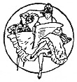

Hasse Zetterström

Der Dynamithund

und andere Unmöglichkeiten

<@spacer 4/>

Deutsch von Åve Avenstrup und Elisabeth Treitel.

Illustrationen und Umschlagsgestaltung Eigil Schwab

<@spacer 2/>

16.–20. Tausend.

<@spacer 4/>

<@spacer 2/>

Berlin 1918
Verlag der Lustigen Blätter
(Dr. Eysler &amp; Co.) G. m. b. H.

