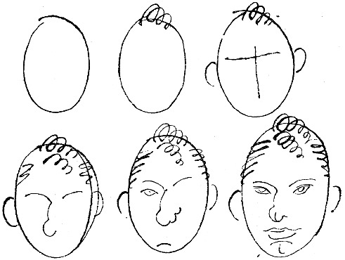

<@pagebreak 3/>

<h1>Der Dynamithund und andere Unmöglichkeiten</h1>

<h2>Merkwürdige Einzelheiten aus meinem
wunderlichen Leben.</h2>

Mein ganzes Leben ist eine Kette merkwürdiger Erlebnisse
gewesen.

Ich war kaum 3 Jahre alt, als ich von einem Verwandten
einen Stoß bekam, so daß ich eine Treppe
hinunterfiel und ein Loch in sie schlug, — ich selbst
entging dem sonst sicheren Tod durch einen schlauen
Handgriff.

Zur Erinnerung an dieses Ereignis habe ich eine
Narbe über dem linken Auge und eine Locke von dem
Haar des Verwandten behalten. Die Narbe pflege ich
sorgfältig, denn sie steht mir sehr gut und verleiht mir
ein interessantes Aussehen, wenigstens bei Abendbeleuchtung.

Im Alter von 6 Jahren verschwand ich aus meinem
lieben Elternhaus. Niemand wußte, wie das zugegangen
war. *Ich verschwand ganz einfach.*
Später habe ich mehrmals in unangenehmen Situationen
versucht, dasselbe zu tun, aber es ist mir immer mißlungen.
Die Wachsamkeit der Polizei ist heutzutage
<@pagebreak/>
auch größer als früher. Als ich beinahe 2 Stunden
verschwunden gewesen war, tauchte ich plötzlich wieder
zu Hause auf. Die Freude meiner Familie war ebenso
groß wie der Schmerz, der meines Vaters Spazierstock
mit seiner silbernen Krücke bei mir hervorrief.

Im Alter von 8 Jahren erhielt ich bei Semesterschluß
»Sehr gut« im Betragen. Meine Tante, bei der ich
damals erzogen wurde, war dadurch so überrascht, daß
sie plötzlich, ohne vorherige Warnung, starb und mir
ihr Vermögen von 60000 Pfund Sterling hinterließ.
(Meine Tante war väterlicherseits Engländerin.)

Das Vermögen war bald verpulvert, — mein Vormund
hatte das besorgt und keine Entschädigung dafür
verlangt. Er war eben eine edle Natur.

Mit kaum 22 Jahren machte ich eine Reise, auf der ich
mit dem später so berühmten Gentlemandieb Westermark-Rosén
bekannt wurde, der incognito (ohne Bewachung)
fuhr. Er bat, mir zur Erinnerung an die angenehme Fahrt
eine goldene Remontoiruhr mit Kette aus demselben Metall
überreichen zu dürfen. Als Herr Rosén mir die Uhr
schenkte, war sie noch im Besitze eines älteren, ziemlich
fetten Großhändlers, der uns gegenüber im Coupé saß.
Aber er war gerade eingeschlafen. Es war nämlich im
Sommer, und da schläft man ja so leicht ein. Ich trage
diese Uhr immer noch. Sie geht ziemlich gut, denn ich ziehe
sie morgens auf. Meine Tante (siehe oben) hatte gesagt:

»Ziehe die Uhr immer morgens auf, denn dann bist
Du vielleicht nüchtern.«

Westermark-Rosén sitzt jetzt im Gefängnis. Wenn
<@pagebreak/>
Sie ihm begegnen sollten, — Verzeihung! — dann grüßen
Sie ihn, bitte, von mir.

Also. Im Alter von 25 Jahren bestieg ich einen
Ballon. Der Ballon stieg von selber 2000 Meter. Da
platzte er, auch von selber, und ich fiel dicht neben einem
Kirchhof nieder, was meine Freunde sehr praktisch von
mir fanden. Von diesem Erlebnis habe ich weiter keinen
Schaden zurückbehalten, als daß der rechte Fuß etwas nach
innen geht. Es war nämlich gerade Ostwind an diesem Tag.

Ende der neunziger Jahre besuchte ich Hamburg und
machte dort die flüchtige Bekanntschaft einer Zahnathletin,
die im Zirkus Busch auftrat. Sie heiratete mich später.
Sie war eine gute Frau. Aber einmal hat sie mich so
stark in den Arm gebissen, daß ich mich scheiden lassen
mußte. Vor Gericht weinte sie laut und sagte, daß sie
das aus Zuneigung getan hätte. Der Richter aber, —
der selber verheiratet war, — war unerbittlich, und ich
wurde geschieden. Ich denke oft an sie. Sie hat sich
sozusagen in mein Gedächtnis festgebissen. Aber warum
sollen wir bei so trüben Erinnerungen verweilen, — sie
hatte blaue Augen.

Mein 30. Geburtstag wurde einfach und würdig bei
einem Freunde mit einem kleinen Feuerwerk gefeiert. Es
war eine helle Sommernacht, das Feuerwerk kam also
nicht recht zur Geltung. Aber die Villa war gegen Feuer
versichert, so daß der Schaden nicht so groß war,
wenn man die Schwiegermutter meines Freundes nicht
mitrechnet, die wir nicht übers Herz bringen konnten
zu wecken.

<@pagebreak/>
Natürlich habe ich noch viel mehr erlebt, aber warum
soll ich das unbekannten und vielleicht rohen Menschen
erzählen, die womöglich über meine Sorgen und Leiden
höhnisch lachen würden.

O Welt, wie bist Du grausam!

Hasse Zetterström.

P. S. Wenn die Polizei in Schweden einen Verbrecher
für ihr Verbrecheralbum photographiert, dann
macht sie zwei Aufnahmen. Schwab, der meinen
Charakter schon seit vielen Jahren kennt, ist der Ansicht,
daß von mir sechs Aufnahmen gebraucht werden.
Alle Bilder sind sehr gut gelungen, besonders das erste.

H. Z.

