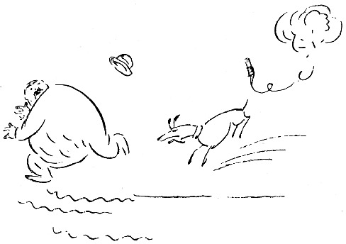

<@pagebreak 7/>

<h2>Der Dynamithund.</h2>

Abends kamen sie mit Lärm und Gepolter nach Hause,
brachten einen zerschossenen Vogel mit und fingen sofort
an, Karten zu spielen und zu trinken. Die Hunde wurden
unten im Flur festgekoppelt, und wenn einer der Herren
verlor, dann ging er hinunter und verprügelte seinen Hund.

Das war in der Bretagne, und mein Freund erzählte
von einer Jagd, die ein paar junge Leute mitgemacht
hatten. Durch diese Erzählung kamen wir auf Tiere
zu sprechen, und irgend jemand sagte:

»Da sind wir freundlicher zu unseren Hunden. Erinnerst
Du Dich noch an Bonells Grete, den Foxterrier?«

<@pagebreak/>
»Ja, das war ein schönes Tier! Ist sie tot?«

»Ja, sie ist eines natürlichen Todes gestorben. Aber
wenn es nach Bonell gegangen wäre, so wäre sie schneller
abgedampft. Bonell ist Mitglied des Tierschutzvereins
und setzt sich lebhaft für das schmerzlose Verenden der
kleineren Haustiere ein.«

»Es gibt ja besondere Anstalten für so was.«

»Ja, aber Bonell hatte kein richtiges Vertrauen dazu.
Er merkte, daß die Grete langsam alt zu werden begann.
Sie wich höflich aus, wenn sie unten auf dem Hof einer
großen Ratte begegnete, und derartiges deutet ja auf
Altersschwäche, wenigstens bei Hunden. Bonell wurde dadurch
aufrichtig verstimmt, denn nachdem seine Wirtschafterin,
die zwanzig Jahre bei ihm gewesen war, den Korbmacher
geheiratet hatte, stand er fast allein auf der Welt.

Er hatte nur die Grete. Er gab ihr bulgarische
Sauermilch, denn er dachte, daß das, was einem Menschen
hilft, auch einem Hunde gut tun müßte. Aber
die Grete weigerte sich, die Sauermilch zu genießen,
auch wenn sie — die Milch natürlich — gezuckert wurde.

Da beschloß Bonell, daß die Grete sterben sollte, um
ihr ein klägliches Alter zu ersparen. Sie sollte schmerzlos
sterben. Bonell überlegte nur die Art und Weise.

Ein Flintenschuß konnte versagen. Gift ebenfalls.
Endlich, nachdem er einige Tage nachgedacht hatte,
bekam Bonell einen guten Einfall. Er wollte sie mit
Dynamit in die Luft sprengen! Eine Dynamitpatrone
mit einer Zündschnur am Ende — und alles würde
in einer hundertstel Sekunde vorüber sein.

<@pagebreak/>
Bonell wählte sich einen Sonntag für das Experiment.
Teils war er an diesem Tage frei von Geschäften,
und teils fand er, es läge etwas Schönes und Stimmungsvolles
darin, sich gerade an einem Sonntag von
einer alten Freundin zu trennen.

Die Dynamitpatrone war in Ordnung, die Zündschnur
ebenfalls, als die Grete und ihr Herr einen Spaziergang
zum Tore der Stadt hinaus machten.

Es war ein schöner Sommersonntag. Die Leute
wanderten nach dem Walde hinaus, einige hatten Essen
mit und lagerten sich auf irgendeinem grünen Hügel.
Bonell und Grete gingen an allen Ausflüglern vorbei.
Sie sehnten sich nach verlassenen, ungestörten Gegenden.
Schließlich, gegen Mittag, erreichten sie einen einsamen
Waldpfad. Bonell folgte ihm und war bald im tiefsten
Wald. Ein stiller Friede herrschte in der Natur. Bonell
setzte sich auf einen Baumstamm, nahm den Hut
ab und holte tief Atem. Natur bleibt doch Natur,
dachte er bei sich. Der Mensch sollte mehr in der
Natur sein, dann wäre alles viel besser.

Die Grete lag Bonell zu Füßen, und treu schaute
sie in sein liebes Gesicht hinauf.

Bonell holte behutsam die Dynamitpatrone aus der
Tasche, und mit leichter Hand band er sie der Grete
an den Schwanz. Die Zündschnur befestigte er an der
Patrone. Dann erhob er sich, holte eine Streichholzschachtel
hervor, machte Feuer und zündete die Schnur an, die
sofort zu glühen anfing. Die Grete lag still. Sie war
vielleicht ein wenig müde nach dem langen Spaziergang.

<@pagebreak/>
Bonell sah die Zündschnur brennen, und plötzlich verstand
er, daß es hier auch sein eigenes Leben galt. Er
stülpte den Hut auf den Kopf und begann in den Wald
hineinzulaufen. Die Grete fand das Benehmen ihres
Herrn sehr eigentümlich — sicher drohte ihnen beiden
irgendeine Gefahr, und da lief die Grete hinter Bonell her.

Bonell wandte sich um. Diese Entwickelung hatte
er sich nicht gedacht. Der Hund war zwei Meter von
ihm entfernt, und er sah, wie die Zündschnur glühte.
Der Funke näherte sich …

Bonell lief schneller. Er war stark und das Laufen
nicht gewöhnt, aber er tat sein Bestes. Die Grete folgte ihm.

Hinein, durch den Wald ging die Jagd. Über Berghöhen
und Grashügel und durch Sümpfe und Moraste.
Manchmal waren sie drinnen im Gebüsch, zwischen
Strauchwerk und großen Büschen von Nesseln und
Disteln.

Bonell lief und lief. Die Grete kam näher. Mitunter
bellte sie, frisch und fröhlich, wie in ihrer Jugendzeit,
aber was fiel ihrem Herrn denn ein? Was trieb
er für ein Spiel? Wie erschrocken sah er aus, als er
sich umwandte?

Die Zündschnur glühte. Bonell konnte nicht mehr.
Ob er versuchen sollte, auf einen Baum hinauf zu kommen?
Aber das ging ja nicht mit dem Überzieher und bei
seiner Korpulenz.

Er lief weiter. Der Schweiß triefte, den Hut hatte
er verloren, den Stock hatte er fortgeworfen, und zwei
Hosenknöpfe waren ihm abgesprungen. Die Zündschnur …

<@pagebreak/>
Da, in seiner unbeschreiblichen Not, erblickte Bonell
zwischen den Bäumen blaues Wasser. Es galt, dort hinzukommen!
Hinaus in den See, und dann wäre er gerettet!

Er erreichte das Ufer, und ohne Bedenken stürmte
er weiter. Das Wasser spülte ihm um die Beine, die
Hosen klebten ihm fest, die Füße sanken in den Lehmboden.
Aber er hielt sich tapfer.

Als er zehn Meter gewatet war, stand ihm das
Wasser bis an die Kniee. Er drehte sich um und sah
zurück. — Die Grete war am Ufer geblieben. Sie
stand ganz still, und in ihrem kleinen Hundeköpfchen
war nur ein Gedanke: Ihr Herr war verrückt! Er
wollte sich ertränken!

Da ging sie entschlossen ins Wasser und schwamm
auf Bonell zu. Sie schwamm ruhig und schön, und
die ganze Zeit hielt sie den Schwanz über der Wasserfläche
— und die Zündschnur glühte!

Bonell dachte: Wenn sie heran ist, tauche ich sie unter,
und dann mag es gehen, wie es will! Ich kann nicht mehr!«

* * *

Mein Freund machte eine Pause in seiner Erzählung.
Aber die Spannung war zu stark. Wir fragten alle
zu gleicher Zeit:

»Nun — und was wurde?«

»Tja,« sagte der Erzähler, »als die Grete dicht an
Bonell herankam, wagte er doch nicht, sie unterzutauchen.
Er tauchte lieber selber ins Wasser, und der Hund tat es
ihm nach — und — da erlosch die Zündschnur.

Und dann kamen sie beide wieder fröhlich in die Höhe.«

