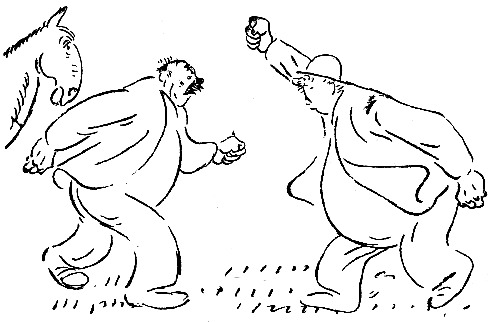

<@pagebreak 12/>

<h2>Das Pferd.</h2>

Ich wohne an der Peripherie der Stadt, in einem
verhältnismäßig modernen Haus mit elektrischem Licht,
das auch nachts brennt, wenn man es auszudrehen vergißt.

Unter meinem Fenster führt die Straße entlang, und
jenseits dieser liegt eine kleine eingezäunte Wiese. Die
Wiese liegt grün und schön da. Jeden Morgen sehe
ich sie an und freue mich, daß sie kein vierstöckiges Haus ist.

Da geschieht eines Tages etwas. Ein Pferd springt
auf der Wiese umher! Ein schönes, braunes, junges,
fröhliches Pferd. Es springt umher, weidet das Gras
ab und wedelt mit dem Schwanz vor lauter Freude, —
denn die Fliegen sind noch nicht so schlimm.

<@pagebreak/>

Alle sehen wir das Pferd von unseren Fenstern, und
wir sprechen nur von ihm. Die Kinder laufen auf die
Straße, hängen sich an den Zaun und wundern sich,
wo es hergekommen ist, aber niemand weiß es.

Die Jungens sprechen von ihm auf den Treppen, und
in den Läden hört man:

»So ein hübsches Pferd! Es sieht wie ein Reitpferd
aus!«

Aber die Jungens sind am meisten interessiert. Ob
man näher gehen kann? Und es streicheln? Es könnte
beißen.

Eines Tages erscheint schließlich Olof, der Nr. 35
wohnt, mit einem harten Brotkanten und gibt ihm den.
Das Pferd nimmt ihn, und schon ist es aller Freund.

Aber damn — — —

Ich komme eines Mittags nach Hause wie immer.
Und da sehe ich eine kleine Versammlung da unten auf
der Wiese. Irgend etwas ist passiert. Auf der Straße
steht der Schuster und redet mit dem Glaser. Ich habe
sie nie vorher draußen auf der Straße gesehen.

»Was ist geschehen? Was ist los?«

»Denken Sie mal, da ist ein Kerl, der das Pferd
stehlen will! Vor einer halben Stunde ist er gekommen
und gleich durch die Zauntür gegangen und wollte das
Pferd mitnehmen. Aber es waren Leute da unten, und
nun rechnen sie mit ihm ab.«

»Soso,« sagte ich und ging hinauf. Ich setzte mich
ans Fenster und beobachtete die kleine Gruppe, die da
unten debattierte. Dann sagte ich zu meiner Frau:

<@pagebreak/>
»Wem gehört eigentlich das Pferd?«

Meine Frau erwiderte:

»Ich glaube, das weiß niemand,«

»Es ist jemand da unten, der es holen will.«

»Das ist ja gemein.«

»Vielleicht gehört es ihm?«

»I bewahre!«

Ich stand plötzlich auf. Mir war einer der besten
Gedanken gekommen, die ich je gehabt habe.

Ich nahm meinen Hut und ging ruhig und gelassen
nach der Wiese hinunter. Da stand ein großer, vierschrötiger
Mann, der wie ein Bauer aussah, und hielt
das Pferd bei der Mähne. Er sah hochgradig verärgert
aus, und ich hörte ihn sagen:

»Soll ich mir mein eigenes Pferd nicht holen dürfen?!
Laßt mich gefälligst durch!«

»Sie wollen einfach das Pferd stehlen!« sagte Herr
Johansson, der Geschäftsführer in der Bonbonfabrik.

»Es ist mein Pferd! Ich habe es vorige Woche auf
dem Markt gekauft,« erwiderte der Mann.

»Das sollen Sie mal erst beweisen!« sagte jemand in der
Gruppe, und alle lachten.

Jetzt trat ich auf den zu, der behauptet hatte, daß
das Pferd ihm gehöre, sah ihm gerade ins Gesicht und
sagte:

»Sind Sie toll, Mensch, Sie wollen mir mein Pferd
wegnehmen?«

Der Mann ließ die Mähne des Pferdes los, der
Arm fiel ihm schlaff herunter, und er sah mich mit großen,
<@pagebreak/>
erstaunten Augen an. In die Gruppe kam Bewegung,
und die Leute sagten halblaut:

»Dem gehört das Pferd! Das hätten wir uns gleich
denken können!«

Der Mann, der versucht hatte, das Pferd zu stehlen,
fing an zu grinsen; er dachte: Einen so gelungenen Spaß
habe ich lange nicht erlebt! Als er das Pferd wieder
anfassen wollte, trat mein Portier hervor, hielt ihm die
Faust unter die Nase und sagte:

»Mach daß Du fortkommst, Du Gauner! Du hast
ja gehört, daß das Pferd dem Redakteur gehört! Schämst
Du Dich nicht?!«

Der Mann wurde plötzlich ernst, tat einen Schritt
auf mich zu und sagte:

»Sagen Sie noch einmal, daß das Ihr Pferd ist!«

»So oft Sie wollen,« sagte ich. »Ich habe es gekauft,
um morgens darauf zu reiten. In der nächsten
Woche kommt es in den Tattersall.«

»Eigentlich müßte man einen Schutzmann holen,«
sagte jemand.

»Ach was, laßt ihn laufen,« sagte ein anderer.

Der Mann sah uns an, einen nach dem andern, mich
am längsten, und dann ging er ganz plötzlich. Ich
streichelte das Pferd und tat, als gäbe ich ihm ein Stück
Zucker. Dann grüßte ich die Anwesenden freundlich und
ging nach Hause,

Ich hatte Mittag gegessen und Kaffee getrunken, und
dann legte ich mich auf mein Sofa, guckte an die Decke
und wartete. Die Abendzeitungen kamen, ich las sie
<@pagebreak/>
ruhig, beherrscht, und dann schlief ich ein. Ich erwachte
davon, daß das Dienstmädchen an die Tür klopfte und sagte:

»Ein Mann steht draußen. Er möchte mit — — —«

»Lassen Sie ihn hereinkommen!«

Ich blieb auf dem Rücken liegen, ruhig und gelassen.
Es war der Mann mit dem Pferd. Er blieb an der
Tür stehen. Ich sagte freundlich:

»Bitte, nehmen Sie Platz!«

Er setzte sich, und wir sahen uns an. Dann sagte er:

»Das war ein feines Ding, was Sie da unten mit
dem Pferd gedreht haben!«

»Sie müssen sich deutlicher ausdrücken,« sagte ich.

Er erhob sich rasch und stieß hervor:

»Das ist mein Pferd!«

»Bitte, bleiben Sie sitzen,« sagte ich, »und lassen Sie
uns ruhig reden. Sie sagen, daß es Ihr Pferd ist.
Ich behaupte, daß es *meins* ist. Können Sie mir
Ihren Kaufvertrag zeigen?«

»Nein,« sagte der Mann, »ich habe es bar bezahlt
und habe mir keine Quittung geben lassen. Können
Sie mir eine zeigen?«

»Das wäre möglich,« sagte ich, »aber ich brauche das nicht,
denn niemand zweifelt daran, daß das Pferd mir gehört.«

»Doch, ich!«

»Ja, Sie sind bisher der einzige, und es tut mir leid,
daß das der Fall ist. Es ist ein hübsches Tier; schade,
daß es seinetwegen zu Differenzen kommen soll.«

Der Mann saß schweigend da. Ich nahm mir eine
Zeitung. Einige Minuten verstrichen, dann sagte er:

<@pagebreak/>
»Wollen Sie mir das Pferd verkaufen?«

»Nichts ist unverkäuflich,« sagte ich. »Wieviel wollen
Sie geben?«

Er schnellte wieder in die Höhe und schrie:

»Das geht zu weit! Soll ich mein eigenes Pferd
kaufen?!«

»Sie wollen es ja haben,« sagte ich.

Er holte seine Brieftasche hervor.

»Was kostet es?«

»Es ist billig,« sagte ich. »Sie sollen es für 200 Kronen
haben. Sie machen ein gutes Geschäft. Ein so hübsches
Pferd findet man nicht jeden Tag. Zweihundert bar!«

Ich erhob mich vom Sofa, der Mann zählte zwei
blaue Scheine auf und legte sie wortlos auf den Schreibtisch.
Ich steckte sie in die Tasche, während er mir starr
in die Augen sah und sagte:

»Wollen Sie mir eine Quittung geben?«

»Das ist nicht nötig zwischen uns,« sagte ich. »Sie
können sich das Pferd holen.«

»Das kam mir da unten eben nicht so vor!«

»Beruhigen Sie sich!« Und ich schrieb auf einen Zettel:
*Ich habe nichts dagegen, daß das Pferd
fortgeführt wird.* Unterschrieb und gab dem Mann
den Zettel. Er las ihn, lächelte und sagte:

»Sie sind wirklich der gerissenste Mensch, der mir
vorgekommen ist!«

»Ich weiß,« sagte ich. »Sollte wieder mal etwas
mit Pferden zu machen sein, dann werde ich mich melden.«

Er nickte mehrmals, und dann ging er. Ich sah,
<@pagebreak/>
wie er unten den Zettel vorzeigte und das Pferd wegführte.

Am nächsten Morgen bekam ich einen Brief. Der
lautete:

»Herr Kompagnon! Wir haben gestern ein gutes
Geschäft gemacht, Sie und ich. Das Pferd gehörte
weder Ihnen noch mir, ich habe nie ein so schönes
Exemplar so billig gekauft. Ich bekomme sicher tausend
Kronen dafür. Wenn Sie nicht gekommen wären und
sich in die Sache eingemischt hätten, dann hätte ich es
umsonst gehabt. Ich habe lange nach dem Gaul geangelt.
Besten Dank jedenfalls! Wenn Sie wieder etwas vorhaben,
dann denken Sie an mich. Gute Provision! X.D.T.«

Ich habe den Brief zu meinen Sammlungen gelegt.
Ein Freund von mir vom Magistrat hat mir erzählt,
daß das Pferd der Stadt gehört. Mein Kompagnon
und ich können ruhig sein. Eine Behörde wie die Stadt
erfährt nichts, wenn so eine Kleinigkeit wie ein Pferd
verschwindet.

