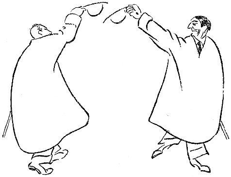

<@pagebreak 19/>

<h2>Der kluge Amerikaner.</h2>

Eines Tages sagte meine Frau:

»In die Wohnung unter uns sind Leute eingezogen.«

»Aussehen?«

»Nichts Besonderes. Sie fett, er banal.«

»Klavier?«

»Ja.«

»Grammophon?«

»Ja.«

»Lege doppelte Teppiche in mein Zimmer und laß
durch das Mädchen andeuten, das wir sämtliche Lärmparagraphen
des Gesetzes auswendig können.«

<@pagebreak/>

Die Leute unter uns in der Wohnung störten mich
nicht sehr. Sie spielten Klavier, dann und wann, damit
ich hören sollte, daß sie sich ein Klavier leisten könnten.
Das Grammophon kam mir heiser vor,

Die Frau war wirklich recht fett, sah aber ganz nett
aus. Der Mann war Großhändler und kam nachts
spät nach Hause. Dann zankten sie sich. Aber so ist
das ja bei allen verheirateten Leuten.

Ich konnte alles hören, was sie sich sagten, aber die
Unterhaltung wich sehr unbedeutend von dem ab, was
ich von früheren Ehepaaren in derselben Wohnung gehört
hatte.

Eines Nachts aber geschah etwas. Ich war früh zu
Bett gegangen, wie ich es zu tun pflege, als ich durch
ein Geräusch geweckt wurde. Irgendwo klopfte es.

Ich sprang aus dem Bett und öffnete die Tür. Nein,
da war es nicht. Ich horchte. Das Klopfen begann
von neuem. Es kam aus der Wohnung unter mir.
Es wurde unten an die Decke zu mir herauf geklopft.

Das belustigte und interessierte mich, und, dem Instinkt
des Augenblick folgend, klopfte ich auf meinem Fußboden
zurück. Da hörte ich eine Frauenstimme, die deutlich sagte:

»Bitte kommen Sie doch herunter zu mir!«

Ich stand mitten im Zimmer, leicht angezogen, wie
man es ist, wenn man direkt aus dem Bett gestiegen ist.
Ich fror um die Beine und fing an, mich anzuziehen.

Das Haus war still. Meine Familie schlief. Als
ich fertig angezogen war, klopfte es wieder, und als ich
das Klopfen erwidert hatte, sagte die Stimme:

<@pagebreak/>
»Wann kommen Sie?«

»Sofort,« antwortete ich, und dann schlich ich mich
in den Korridor hinaus, öffnete die Tür und ging nach
der Wohnung eine Treppe tiefer hinunter.

Die Dame, die geklopft hatte, stand in ihrer Entréetür.
Wir sagten beide nichts. Leise betrat ich die
Wohnung.

Das elektrische Licht brannte in einem Wohnzimmer,
das unter dem meinen lag. Die Dame, die ganz angekleidet
war, schien diese Nacht nicht im Bett gewesen zu
sein. Sie bat mich, Platz zu nehmen. Ich tat es,
indem ich sagte:

»Ich muß zugeben, daß dies immerhin ein außergewöhnliches
Ereignis in meinem Leben ist. Womit kann
ich dienen?«

»Sie müssen hier warten, bis mein Mann nach Hause
kommt. Ich fürchte mich, allein zu sein. Ich halte es
nicht aus, jede Nacht aufzusitzen und zu warten.«

»Ihr Mann ist vielleicht durch wichtige Geschäfte in
Anspruch genommen, die ihn verhindern, nach Hause zu
kommen,« sagte ich. »Das passiert mir auch manchmal.«

»*Die* Geschäfte kenne ich,« sagte die Dame. »Bitte,
hier haben Sie eine Zeitung zu lesen. Beliebt es Ihnen,
Patience zu legen, so sind hier Karten, oder wollen Sie
einen Likör trinken?«

»Meine Gnädige,« sagte ich, »ich will schlafen gehen.
Ich bin gewöhnt, um diese Zeit zu schlafen. Es war
unrecht von Ihnen, mich zu wecken, — ich gehe hinauf
in meine Wohnung.«

<@pagebreak/>
»Sie werden doch eine Dame nicht mitten in der
Nacht allein lassen?!«

»Das muß ich leider mit so vielen einsamen Damen
tun. Meine Frau ist auch allein.«

»Sie schläft.«

»Das will ich hoffen.«

Da hörten wir, wie ein Schlüssel in die Entrèetür
gesteckt wurde. Vorsichtig und leise, wie es ein verheirateter
Mann tut, wenn er nachts nach Hause kommt.

Es dauerte ein paar Augenblicke; er legte Hut und
Überzieher ab, dann stand er in der Türöffnung zum
Wohnzimmer. Die Augen blinzelten gegen das Licht,
und er atmete ein bißchen schwer nach den zwei Treppen.
Er hatte einen roten Kopf, und sein ganzes Gesicht
drückte tiefes und großes Erstaunen aus.

Schließlich sagte er:

»Was macht dieser Mensch hier mitten in der Nacht,
Julia?!«

»Ich will es Ihnen erklären,« sagte ich.

»Mit Ihnen habe ich nicht gesprochen,« sagte der
Mann und hielt sich an dem Türrahmen fest. »Meine
Frau soll antworten!«

»Gustav,« sagte Julia, »ich war so einsam, ich habe
vier Stunden auf Dich gewartet, ich wurde so unruhig,
daß Dir etwas zugestoßen wäre, ich wußte nicht, was
ich machen sollte, da klopfte ich an die Decke und habe
ihn gebeten, herunterzukommen. Ich *konnte* nicht
allein sein. Ich wollte ihm gerade einen Likör anbieten,
als Du kamst.«

<@pagebreak/>

Gustav machte einen Schritt ins Zimmer hinein und
sagte: »Du — — — bietest — — — fremden — — —
Personen — — — Likör — — — an, — — —
wenn — — — ich — — — weg — — — bin?!«

»Lassen Sie mich bitte zu Bett gehen,« sagte ich,
»ich bin so müde.«

»Bitte!« sagte Gustav, ohne die Verbindlichkeit im
Ton, die man bei einem Gastgeber gewöhnt ist.

Ich ging hinauf, schlich hinein, zog mich aus und
kroch ins Bett.

Ich lag lange und horchte, aber ich hörte nichts aus
der Wohnung unter mir. Alles war still und ruhig.

Was für ein schlaues, kleines Weib, dachte ich, —
sie zwingt den Mann, nachts früh nach Hause zu kommen!
Das wird nun ein tugendhafter Mann werden. Sicher!
Und dabei bin ich ihr behilflich gewesen. Aber ich bin
ein schlechter Gesellschafter gewesen, — es tut mir leid,
daß ich hinuntergegangen bin.

Dann schlief ich ein.

Gustav kam eine Zeitlang jeden Abend pünktlich nach
Hause. Ich hörte, wie sie plauderten und scherzten, ehe
sie zu Bett gingen.

Sie sind glücklich, dachte ich, und das ist dein Verdienst!

Aber eines Nachts, — gegen drei Uhr, — wurde ich
wieder durch ein Geräusch geweckt. Ich setzte mich im
Bett hoch. Es klopfte gegen den Fußboden.

Ich klopfte zurück, und dann horchte ich. Einen
Augenblick später hörte ich Julias Stimme:

»*Bitte*, kommen *Sie doch herunter zu mir*!«

<@pagebreak/>

Ich legte mich auf den Fußboden und antwortete:

»*Ich kann nicht hinunterkommen, ich habe
mir den Fuß verstaucht. Kommen Sie lieber
zu mir herauf*!«

Es wurde still, dann antwortete Julia:

»*Ich komme*!«

Erst schaltete ich das elektrische Licht ein und zog
mich an. Dann schlich ich mich in den Korridor hinaus,
öffnete und ließ meine Hausgenossin ein.

»Gehen Sie leise,« sagte ich, »meine Frau schläft.«

Julia trat ein, und wir saßen einander gegenüber,
genau wie unten bei ihr.

»Ist er heute Nacht wieder aus?« fragte ich.

»Ja, er hat wieder angefangen! Er muß einen Denkzettel
haben!«

»Frau Julia,« sagte ich, »ich werde Ihnen eine
kleine Geschichte erzählen. Ich hoffe, ich werde damit
fertig, bis Ihr Mann nach Hause kommt und meine
Frau aufwacht. Ich muß Ihnen diese Geschichte erzählen,
damit wir uns vollkommen verstehen. Hören Sie!
In Amerika war ein Mann wegen Untreue gegen
seine Frau angeklagt worden. Die Beweise waren erdrückend,
und die Geschworenen, die den Mann beurteilen
sollten, — — es waren lauter verheiratete Männer,
— — sollten sich gerade zurückziehen, als der Mann
bat, jedem einzelnen der Geschworenen eine Mitteilung
machen zu dürfen, die von großer Wichtigkeit für die
Beurteilung der Sache wäre.

Der Vorsitzende gewährte dem Mann diese Bitte, und
<@pagebreak/>
der Angeklagte flüsterte jedem Geschworenen schnell etwas
ins Ohr.

»*Was flüsterte der Lump*?« fragte Julia, die
meine Erzählung mit starkem Interesse angehört hatte.

»Jetzt,« sagte ich, »werde ich Ihnen das nicht verraten;
ihrem Manne werde ich es sagen, — — ich höre
seine Schritte auf der Treppe.«

Julia hatte sich erhoben und einen Schritt nach der
Tür getan.

»Kommen Sie!« sagte ich. »Wir wollen ihm entgegen
gehen!«

Ich nahm ihren Arm und führte sie durch den Korridor
und die Treppe hinunter. Die Nachtbeleuchtung
brannte, und auf dem Treppenabsatz stand Gustav mit
dem Hut im Genick und dem Wohnungsschlüssel in der
Hand. Höchst erstaunt sah er seine Frau an, die auf
das Geländer gestützt dastand.

»Jetzt, Frau Julia,« sagte ich, »können Sie erfahren,
was der Amerikaner den Geschworenen gesagt hat:

»*Wir verheirateten Männer halten zusammen*!«
sagte er. Gute Nacht!«

* * *

Am folgenden Tag traf ich Gustav auf der Straße.
Er grüßte sehr freundlich, und wir lächelten uns gegenseitig
an, — — wie früher die Augurn, — — wie
jetzt die verheirateten Männer.

Julia war ziemlich fett.

