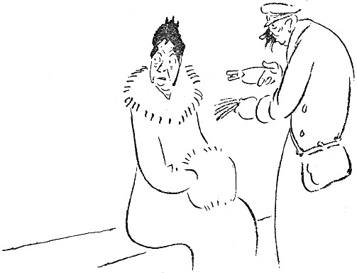

<@pagebreak 26/>

<h2>In der Elektrischen.</h2>

Neulich fuhr ich mal mit der Elektrischen. Es war
eine gewöhnliche, langweilige, mit ernsten, stillen Menschen
voll besetzte Elektrische. Ich war auch sehr still
und ernst. Nach einer Weile aber sagte ich zu Halldén,
der neben mir saß:

»Das mit dem Prinzen Eugen war doch schrecklich!«

»Tja,« sagte Halldén, »er hätte etwas vorsichtiger
sein müssen!«

Sämtliche Fahrgäste zuckten zusammen. Was war
<@pagebreak/>
denn mit dem Prinzen? Alle Blicke richteten sich auf
uns, und die Luft war mit Neugier gesättigt und dick
wie Grütze. Und diese unheimliche Stille, die grabesdumpf
mitten im Wagen stand!

Die Elektrische rollte weiter. Eine ältere Dame hielt
es nicht länger aus. Sie ging nach dem Hinterperron
und fragte den Schaffner:

»Was ist denn mit dem Prinzen Eugen?«

»Was weiß ich!« sagte der Schaffner.

»Ein paar Herren erzählten drin etwas von ihm. Es
soll ihm etwas zugestoßen sein.«

Der Wagen hielt an einer Haltestelle. Drei Herren
drängten sich gleichzeitig zum Wagen hinaus und riefen
nach der Abendzeitung. Der Schaffner stieg ab, ging
zu dem Wagenführer und sagte:

»Hast Du das vom Prinzen Engen gehört?«

Da kam ein Kontrollör, und der Wagen fuhr weiter.
Als wir ausstiegen, um umzusteigen, kam ein dicker Herr
schnaufend hinter uns her und fragte:

»Was ist denn eigentlich mit dem Prinzen Eugen?«

»Tja,« sagte ich, — »wenn Sie einen grünen Wagen
benutzen und damit bis zur Schleuse weiterfahren und
dort in einen weißen Wagen steigen, dann kommen Sie
nach der Sybillenstraße.«

Der dicke Herr steht noch immer auf demselben Fleck
und stiert vor sich hin. Er steht ganz still. Man muß
leise gehen, damit man ihn nicht weckt. Sein Hirn arbeitet.

Halldén und ich bestiegen einen weißen Wagen, um
<@pagebreak/>
weiter zu fahren. Eine ältere Frau drängte sich vor
mir hinauf und trat mir dabei auf die Lackstiefel. Sie
setzte sich ganz vorn in den Wagen, und ich blieb auf
dem Hinterperron.

Der Schaffner kam, um das Geld einzukassieren. Ich
gab ihm 20 Öre und sagte:

»Das ist für mich und die Dame da vorn.«

Der Schaffner ging in den Wagen, und als er zu
der älteren Dame kam, reichte sie ihm 10 Öre, aber
der Schaffner sagte:

»Ist schon bezahlt!«

»Nein, — ich habe noch nicht bezahlt,« protestierte
die Dame.

»Ihr Begleiter auf dem Hinterperron hat bezahlt,«
erwiderte der Schaffner.

»Ich habe keinen Begleiter,« sagte die Dame. »Wollen
Sie kein Geld haben?«

Der Schaffner antwortete nicht. Er hatte das Geld
bekommen. Das genügte. Dann sagte die ältere Dame:

»Aber ich wollte einen Umsteigeschein haben!«

Der Schaffner kam auf den Hinterperron hinaus
und sagte zu mir:

»Die Dame wollte ja einen Umsteigeschein haben!«

»Verzeihung, das habe ich vergessen,« sagte ich, »hier
haben Sie Geld, geben Sie der Dame einen Umsteigeschein.«

Der Schaffner ging hinein und händigte den Schein
aus.

Die Dame nahm ihn in Empfang und sagte:

<@pagebreak/>
»Fährt man hier immer umsonst?«

»Nein, Ihr Begleiter hat ja für Sie bezahlt,« erwiderte
der Schaffner.

Da erhob sich die ältere Dame, ging gerade und steif
durch den Wagen und stieg während der Fahrt ab.

Sie war sofort tot.

Man soll mir nie auf die Lackstiefel treten!

An der nächsten Haltestelle stieg mein Freund Björkman
auf. Er war schmutzig und schäbig. Er hatte
einen alten, verbeulten Hut auf und ganz lehmbeschmierte
Stiefel an.

»Wie Du aussiehst!« sagte ich.

»Ich bin draußen auf Lidingön gewesen und habe mir
mein Grundstück angesehen,« antwortete Björkman. »Ich
ziehe mich immer so an, wenn ich aufs Land fahre.
Es hat ja keinen Zweck, jetzt im Frühjahr für die Lehmhügel
etwas Anständiges anzuhaben.«

»Nein, natürlich nicht,« sagte ich.

Und als der Wagen das nächste Mal hielt, ging ich
zu den Fahrgästen hinein, nahm den Hut ab, blieb
mitten im Wagen stehen und sagte:

»Ist hier vielleicht jemand, der einem armen Teufel
auf dem Hinterperron, der nicht weiß, wie er zu Gelde
kommen soll, ein Almosen schenken will? Es ist ein
anständiger Kerl. Ich kenne ihn schon von früher her.
Er wird den besten Gebrauch von dem Gelde machen.«

Alle Fahrgäste guckten Björkman durch die Tür an;
er sah schäbig aus, und dann holte man die Portemonnaies
heraus. Es wurden 6 Kronen und 35 Öre.

<@pagebreak/>
Ich ging hinaus, überreichte Björkmann das Geld und
sagte:

»Du müßtest nun eigentlich hineingehen und Dich
bedanken. Aber wenn Du dich genierst, dann kann ich
es auch tun.«

Dann öffnete ich die Tür und sagte mit lauter Stimme:

»Björkman dankt vielmals!«

Ich stieg dann ab, Björkman aber blieb mit dem
Geld in der Hand stehen.

Er blieb auf dem Perron stehen und stierte vor sich
hin und fuhr immer hin und zurück mit dem Wagen,
bis zu dessen letzter Fahrt.

Dann hob ihn der Schaffner herunter.

Er hatte 3 Kronen und 40 Öre verfahren und hatte
also 2 Kronen und 95 Öre übrig.

Das war immerhin etwas!

