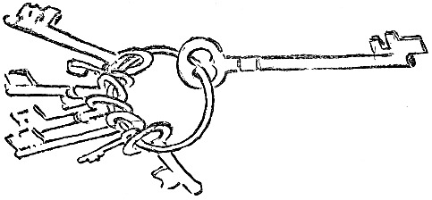

<@pagebreak 31/>

<h2>Die Tür.</h2>

Fräulein Alice Akerholm kam aus der Stadt, um
meinen Freund Lindström und mich zu besuchen. Wir
freuten uns sehr, daß sie kam, denn sie brachte gute
Konserven und mehrere Flaschen Wein mit.

Fräulein Akerholm ist eine sehr angenehme und liebenswürdige
junge Dame, die oft sehr unmittelbare und
originelle Eingebungen hat.

Am Abend des ersten Tages sagte Lindström:

»Du schläfst im Gaststübchen. Wir haben extra ein
kleines Häuschen für Dich gemietet. Da kannst Du in
einem Patentbett schlafen, daß höchstens 1½ Meter zu
kurz ist. Du bist ziemlich lang, meine liebe Alice!«

Fräulein Akerholm war mit dem Gasthäuschen sehr
zufrieden. Sie wohnte drei Tage dort. Als sie abfuhr,
nahm sie den Schlüssel zur Haustür mit. Niemand
glaubte, daß Fräulein Akerholm den Schlüssel
<@pagebreak/>
gestohlen hätte; wir begriffen gleich, daß sie ihn aus
Irrtum mitgenommen hatte.

Wie sich später herausstellte, hatte sie ihn gar nicht
mitgenommen.

Da wir keinen Schlüssel hatten, konnten wir das
Häuschen nicht zuschließen, was uns drei Tage lang
beunruhigte und störte. Es wohnte zwar niemand
in dem Häuschen, — wir halten aber alle beide
auf Ordnung. Außerdem hatten wir das Häuschen
mit Schlüssel gemietet. Es mußte einen sehr schlechten
Eindruck machen, wenn wir es ohne Schlüssel zurückgaben.

Am vierten Tage sagte Lindström:

»Du mußt wegen des Schlüssels bei Alice anklingeln.
So geht das nicht. Was soll denn der Großhändler
Lewin, dem doch das Haus gehört, denken? Ich bin
zu Genauigkeit und Ordnung in allem erzogen. Alice
muß den Schlüssel herschicken.

Fräulein Akerholm erklärte, daß sie den Schlüssel
nicht gesehen hätte. Daß sie die Tür zugeschlossen und
den Schlüssel herausgezogen habe, nachher aber nicht
weiter an ihn gedacht hätte. In ihrem Gepäck könne
sie keinen Schlüssel finden. Es müsse ein Irrtum vorliegen.
Sie pflege nicht anderer Leute Schlüssel mitzunehmen.
Sicher läge der Schlüssel in oder vor dem
Häuschen. Sie grüßte herzlich und fügte hinzu, daß
sie einen Mückenstich am linken Bein habe.

Wir suchten aufs neue nach dem Schlüssel. Ohne
Erfolg. Wir stellten sämtliche Möbel auf den Kopf,
rüttelten sie, ließen sie los, packten sie wieder an und
<@pagebreak/>
schleuderten sie abermals von uns. Wir benahmen
uns genau so, wie man es immer tut, wenn man nach
einer Sache sucht, die man nicht findet. Aber wir fanden
keinen Schlüssel.

Nach drei Tagen schrieben wir an Fräulein Akerholm
und sagten ihr, daß, wenn sie den Schlüssel auch
nicht gehabt hätte, es doch ihre Pflicht wäre, einen
neuen anzuschaffen, denn sie hätte zuletzt den Schlüssel
in der Hand gehabt.

Fräulein Akerholm antwortete, daß ihr das Geschehene
sehr leid täte, erklärte aber gleichzeitig, daß sie unmöglich
einen Schlüssel anschaffen könnte, da sie ja nicht
wüßte, wie er sein müßte, um zu der Tür zu passen. Sie
könnte doch nicht gut zu einem Schlosser gehen und
sagen: »Wollen Sie so gut sein und einen Schlüssel
zu einem roten Häuschen mit Vorgarten machen.«
Kein Schlosser auf der Welt könne so einen Schlüssel
machen. Hochachtungsvoll usw.

»Das sind nur Ausflüchte,« sagte Lindström. Sie will
sich drücken. Aber sie muß einen Schlüssel besorgen!«

»Natürlich,« sagte ich. »*Wir schicken ihr die
Tür zum Maßnehmen*. Wir könnten ja auch
nur das Schloß schicken, aber das würde sie wahrscheinlich
auch verbummeln. *Wir schicken die Tür*!«

Am folgenden Tage wurde Fräulein Akerholm die
Tür geschickt, nach ihrer Wohnung in der Stadt. Wir
beauftragten einen Spediteur, ihr die Tür ins Haus
zu tragen.

Spät abends klingelte Fräulein Akerholm bei unserem
<@pagebreak/>
Amt an, man möchte doch mal hinschicken und nachsehen
lassen, ob bei uns zu Hause alles in Ordnung wäre.

Aber kein Schlüssel kam. Wir schrieben eine kleine
Postkarte und fragten ergebenst an, ob denn die Arbeit
im Gange wäre. Am Abend brachten zwei Männer
vom Dampfer her die Tür angeschleppt.

Wir saßen gerade auf der Veranda und besprachen
die Möglichkeit eines Dorschfanges am Husvudskär, als
die Tür kam. Sie war dieselbe geblieben, aber im
Schlüsselloch steckte ein Zettel, auf dem stand:

»Ihr könnt sonst jemand verulken. Ich habe keine
Zeit für Euch. Alice.

P. S. Übrigens fahre ich in ein paar Tagen nach
Kopenhagen.«

Fräulein Akerholm pflegt in Kopenhagen im Bristol
zu wohnen. *Wir sandten also die Tür nach
Hotel Bristol in Kopenhagen*. Das war eine sehr
mühselige und sehr kostspielige Sache. Aber wenn wir
uns mal etwas vorgenommen hatten, mußten wir es
auch durchführen.

Fräulein Akerholm kam ins Hotel. Der Portier erkannte
sie wieder, freute sich sehr und sagte:

»Es ist ein großes Kolli für Sie angekommen, gnädiges
Fräulein. Wir haben es auf dem Speicher, denn
es ist so groß.«

Fräulein Akerholm ging mit nach dem Speicher hinaus
und, nachdem zwei Leute der Bedienung 35 Minuten
mit Beil und Zange gearbeitet hatten, kam die Tür
zum Vorschein.

<@pagebreak/>
Fräulein Akerholm ging auf ihr Zimmer und weinte.

Dann schrieb sie eine Depesche:

»Was soll das heißen? Ich verbrenne die Tür! Alice.«

Wir antworteten umgehend:

»Die Tür gehört Lewin. Beschädigung strafbar.
Sende den Schlüssel. Dänisches Eisen geht auch.«

Darauf erhielten wir keine Antwort. Wir warteten
lange. Schließlich erfuhren wir, daß Fräulein Akerholm
weitergereist sei und die Tür im Bristol zurückgelassen
habe, wo sie noch im Speicherraum läge.

Wir gingen nun zum Tischler Lundström auf der Insel
und bestellten eine neue Tür nebst Schlüssel. Der Tischler
Lundström nahm Maß und fertigte eine nette Tür an,
aber weil es abends dunkel war, irrte er sich und nahm
schwarze Farbe statt rote zum Anstreichen der Tür.

Eine schwarze Tür paßt nicht so gut zu einem roten
Haus wie eine rote Tür, weshalb wir eines schönen
Vormittags, als die Sonne schien, das Häuschen schwarz
anstrichen. So hatte alles dieselbe Farbe.

Wir zogen dann fröhlich nach der Stadt und schrieben
dem Eigentümer der Insel:

»Die richtige Tür zu dem schwarzen Haus ist rot,
weil das Haus rot war. Aber nun ist das Haus
schwarz. Hochachtungsvoll usw.«

Lindström fand später den richtigen Schlüssel.

Eines Abends, als er sich auszog, fiel er ihm aus einer
Hosentasche.

Wie er dahingekommen war, war ihm total unverständlich.

