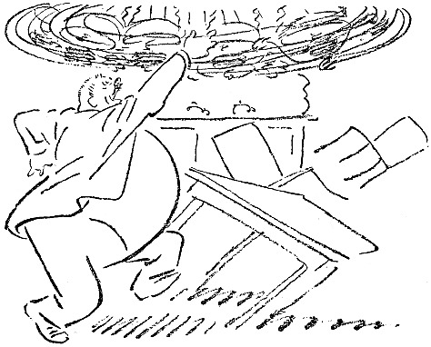

<@pagebreak 36/>

<h2>Lärm.</h2>

Man kann sich an Lärm gewöhnen, auch an nächtlichen.

Wenn man in einer verkehrsreichen Straße wohnt,
wird einem der Nachtschlaf durch Wagen und Autos
nicht gestört. Wohnt man aber an einem stillen und
ruhigen Ort, wo gleich in der Nähe ein Steinhammer
aufgestellt ist, so wird man gestört.

An den Lärm kann man sich nicht gewöhnen. Ich
habe es probiert. Und habe das Attest eines Polizeikommissars
<@pagebreak/>
über die Unmöglichkeit, das auszuhalten,
bekommen.

Der Steinhammer kam fort. Eigentümlich genug.

Der Lärm an sich ist übrigens nicht das Peinigende.
Das Peinigende ist *das Warten auf den Lärm*.

Ich weiß, daß der Steinhammer um sechs Uhr anfangen
wird, und ich werde um vier Uhr wach und
warte auf den Lärm. — — —

Eine Treppe tiefer wohnte einmal ein Herr, der mich
regelmäßig durch seine Unregelmäßigkeiten störte. Hätte
er um zehn Uhr abends damit angefangen, so wäre ich
eingeschlafen; aber vor ein Uhr begann er den Spektakel
nicht, und bis dahin lag ich und wartete und wartete.

Es fing damit an, daß er die Gigerlkönigin (eine
recht alte und abgeleierte Melodie, — aber der Mann
gehörte dieser Jahresklasse an) schon auf der Treppe
pfiff.

Am Takt der Melodie hörte ich den Grad seiner
Betrunkenheit heraus.

Wenn er hineingekommen war, hängte er sehr behutsam
Hut und Überzieher auf, ging dann ins Speisezimmer
und zündete sämtliche Kerzen in einem großen Kronleuchter
an.

Diesen Kronleuchter versetzte er in schwingende Bewegung,
ringsherum, ringsherum, wie ein Karussell, anfangs
langsam, dann aber in immer wilderer Fahrt. Währenddessen
gröhlte er toll vor Freude und guter Nachtlaune.

Nach dem Karussell mit dem Kronleuchter zog er sich
aus und nahm eine kalte Dusche in der Badestube. Ich
<@pagebreak/>
hörte das Rauschen des Wassers und wußte, wie weit
er gekommen war.

Nach der Dusche ging er in sein Zimmer, holte ein
Futteral mit Rasiermessern hervor und ging damit nach
der Mädchenkammer, wo er in der Stille der Nacht dem
vor Entsetzen erstarrten Mädchen das Deckbett wegzog
und sich hinsetzte, um ihr die Hühneraugen zu schneiden.

Dabei machte er keinen Lärm, *aber das Bewußtsein
dessen, was sich abspielte*, störte mich.

Der Mann war ruhig und sicher, er machte nie einen
Fehlschnitt. Außerdem hatte er ein gutes Herz, und
seine nächtliche Handlung war nur durch Wohlwollen
für das arme Mädchen diktiert.

Wenn er seine Operation ausgeführt hatte, ging er
zu Bett. Wahrscheinlich glücklich.

Wir wurden nie miteinander bekannt, aber wir begegneten
uns manchmal auf der Treppe, und er machte
einen sympathischen Eindruck, weil er nie versuchte, Bekanntschaft
anzuknüpfen.

Nach drei Jahren zog er nach einem anderen Stadtteil.
Unter den Umzugssachen sah ich sowohl das
Mädchen wie den Kronleuchter. An beiden sah man
keinerlei Spuren nächtlicher Abenteuer.

Haltbare Sachen!

