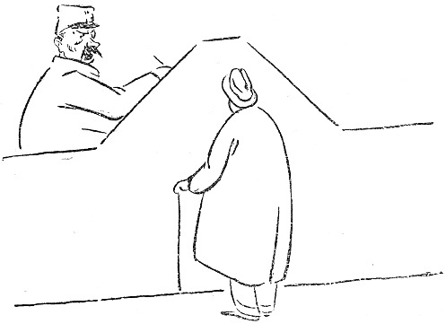

<@pagebreak 39/>

<h2>Der Tischler</h2>

Gegen Ende des Herbstes fing es an, kalt zu werden,
und wir entdeckten, daß unsere Fenster repariert werden
mußten. Wenn es regnete, lief das Wasser über das
Fensterbrett ins Zimmer, und wenn es windig war,
mußten wir vom Salontisch aus gegen den Wind Backbord
halten, um nicht dicht vor dem Sofa zu kentern.

Meine Frau, die ziemlich praktisch ist, sagte eines Tages:

»Es wird wohl am besten sein, wenn ein Tischler
herkommt und den Schaden besieht.«

<@pagebreak/>

Ich klingelte beim Wirt an und verlangte einen Tischler.

»Ich werde ihn schicken,« sagte der Wirt.

Wir warteten zwei Tage. Kein Tischler. Ich klingelte
aufs neue beim Wirt an. Er war sehr freundlich und
sagte, daß der Tischler sehr in Anspruch genommen sei.
Es wären viele Fenster in vielen Häusern reparaturbedürftig.

Ich richtete dann die schüchterne Frage an ihn, ob
es vielleicht noch einen Tischler in der Stadt gäbe, außer
diesem, der so in Anspruch genommen wäre.

Der Wirt sagte, daß das nicht der Fall wäre. Dieser
Tischler hätte ganz allein sämtliche Arbeiten in seinen
Häusern. Er würde in ein paar Tagen kommen.

In ein paar Tagen kam kein Tischler, aber zwei
Blumentöpfe, die im Fenster standen, wurden vom Wind
hinuntergefegt. Es war Erde drin und Blumen.

Ich klingelte wieder bei meinem Wirt an. Sein Buchhalter
antwortete:

»Der Direktor ist nicht hier, aber ich sehe durch das
Fenster, daß er über den Platz kommt.«

»Wie ist Ihr werter Name, mein Herr?« fragte ich.

»Anderberg,« sagte der Buchhalter.

»Gut. Wollen Sie, Herr Anderberg, so freundlich
sein und tun, was ich sage: Legen Sie den Hörer auf
den Tisch, machen Sie das Fenster auf und rufen Sie
dem Direktor, der über den Platz kommt, zu, daß der
Tischler, der in ein paar Tagen zu mir kommen sollte,
noch nicht hier gewesen ist.«

Es wurde fünf Minuten lang ruhig im Telephon.
<@pagebreak/>
Dann hörte ich die atemlose Stimme meines Hauswirtes:

»Der Mensch kommt heute!«

»Wann?« fragte ich. »Damit wir es uns ein bißchen
gemütlich machen können, bis er kommt!«

»Nachmittag!«

Nachmittags saßen wir alle da und warteten auf den
Tischler. Wir hatten das elektrische Licht in allen Zimmern
eingeschaltet und unsere besten Kleider angezogen. Es
herrschte große Spannung.

Um halb sieben klingelte es an der Tür. Wir erhoben
uns alle gleichzeitig und sagten:

»Das ist er!«

Die Kinder wetteiferten beim Aufmachen. Nach ein
paar Sekunden stand ein großer, kräftiger Mann in
Arbeitskleidung im Korridor. Ich ging auf ihn zu und sagte:

»Willkommen! Wir haben lange auf Sie gewartet,
aber wir freuen uns, daß Sie endlich gekommen sind.
Das ist meine Frau, und das sind meine Kinder. Die
haben sich auch sehr nach Ihnen gesehnt!«

Der Mann sah etwas verlegen aus. Er hatte augenscheinlich
nicht so viel Freundlichkeit von einer Familie,
die so lange auf das Reparieren der Fenster hatte warten
müssen, erwartet.

»Es ist vielleicht indiskret,« sagte ich, »aber könnte
ich im Interesse eines weiteren Verkehrs Ihren werten
Namen erfahren?«

»Persson,« sagte der Tischler.

»Aha, — Sie sind vielleicht mit dem Direktor Persson
verwandt?« sagte ich.

<@pagebreak/>
»Das kann schon sein,« sagte Persson, und dann
lachten wir alle miteinander.

»Es war ein recht kühler Herbst,« sagte ich, um auf
die Fenster zu kommen.

»Ja, ja,« sagte Persson. »Und ein strenger Winter
wird’s wohl werden. Es gibt so viele Ebereschenbeeren
und Eicheln.«

»Darf ich Ihnen eine Tasse Kaffee anbieten?« sagte
meine Frau.

»Ich bitte recht sehr,« sagte Persson.

Wir tranken Kaffee, und Persson stippte tapfer ein.

»Wollen wir uns nun die Fenster besehen?« fragte ich.

»Nun hören Sie aber auf, mich zu uzen, mein Herr,«
sagte Persson, ich komme von der Gasanstalt und möchte
um Bezahlung der letzten Vierteljahrsrechnung bitten.«

Am nächsten Tage telephonierte ich an den Wirt:

»Der Tischler, der gestern Nachmittag kommen sollte,
war kein Tischler! Wann kommt der, der einer ist?«

»Ich verspreche Ihnen bestimmt, daß er heute nachmittag
kommt, « sagte der Wirt, »bestimmt!«

Nachmittags klingelte die Entreeklingel.

»Das ist er!« sagten wir alle gleichzeitig.

Ich ging selber hin und öffnete. Auf dem Flur stand
ein Mann in Arbeitskleidung.

»Ich bin der Tischler,« sagte er.

Er sagte das, wie er gesagt haben würde:

»Darf es außer Sirup noch etwas sein?« So sanft
war seine Stimme.

Ich nahm in bei der Hand und führte ihn in die Wohnung.

<@pagebreak/>
»Das ist der Tischler,« sagte ich. »Er soll unsere
Fenster nachsehen. Der Wirt hat ihn sofort hergeschickt,
als er hörte, daß unsere Fenster in Ordnung gebracht
werden müssen.«

Der Tischler ging hin und besah sich die Fenster.
Von außen und von innen, und dann sagte er:

»Ich will nur nach Hause gehen und mein Handwerkszeug
holen, dann komme ich gleich wieder.«

Als er gegangen war, sagten wir fast alle gleichzeitig:

»Der — — kommt — — nie — — wieder!!!«

Fünf Minuten vergingen. Er kam nicht. Zehn
Minuten vergingen. Er kam nicht. Zwei Stunden
vergingen. Er kam nicht. Da sagte meine Frau:

»Dem Manne ist etwas passiert! Es muß ihm ein
Unglück zugestoßen sein!«

»Er ist entführt worden,« sagte unser Hausmädchen,
das Schauerromane liest. »Vor ein paar Tagen ist
erst ein Kind entführt worden.«

»Früher sind auch Jungfrauen entführt worden,«
sagte ich. »Jetzt passiert das nur noch selten. Jedenfalls
ist mir klar, daß ich für das Leben dieses Mannes
haftbar bin. Das war die letzte Stelle, die er besucht
hat. Wenn er nicht gefunden wird, kann es sehr möglich
sein, daß wir ihn getötet und in einen Kleiderschrank
versteckt haben. Um mich von diesem Verdacht zu reinigen,
muß ich mein Alibi beweisen. Das kann ich nur dadurch,
daß ich zur Polizei gehe und das Verschwinden
des Mannes melde. Er war von mittlerer Größe und
hatte blondes Haar.«

<@pagebreak/>
»Nein, er hatte dunkles Haar und dunklen Schnurrbart,«
sagte meine Frau.

»Er hinkte,« sagte mein ältester Sohn, um die Sache
etwas verwickelter zu machen.

Ich ging zur Polizei. An einer Tür stand:

»Meldungen von verlorenen Gegenständen.«

»Ein Tischler ist kein Gegenstand,« dachte ich, »aber
er ist verloren gegangen. Da gehe ich hinein.«

An einem Tische saß ein Kriminalbeamter und schrieb.
Er schrieb noch zwanzig Minuten, dann blickte er zu
mir auf und sagte:

»Der Name?!«

»Er hat mir seinen Namen nicht gesagt,« sagte ich.
Denn das hatte der Tischler nicht getan.

»Wo wohnen Sie?« fragte der Kriminalbeamte.

»Jungfernstraße 45.«

»Der Name?! Wie heißen Sie?«

»Das verstehe ich nicht!« sagte ich. »Soll das ein
Verhör sein? Ich habe nichts getan. Ich will nur
eine Person melden, die abhanden gekommen ist — — —«

»Der Name?!«

»Er hat mir seinen Namen nicht gesagt!«

»Wollen Sie die Untersuchung erschweren? Sie wollen
Ihren Namen nicht angeben, aber wir werden ihn schon
ermitteln!!!«

Da wurde mir klar, daß ich mich in einer ernsten
Lage befand, aus der mich nur eins retten konnte: Der
Beamtentrick! Ich sah dem Manne gerade in die Augen
und sagte mit fester Stimme:

<@pagebreak/>

»Holma, kolma, dolma, Himla, dimla, krimla, kro!
Sim, sam, so!!!«

Der Mann tat seine Pflicht, — er schrieb weiter
und sagte, ohne mich anzusehen, wie es ebenfalls seine
Pflicht verlangte:

»Sie können ja in acht Tagen wieder nachfragen;
da werden wir sehen, ob etwas ermittelt worden ist.«

Als ich am nächsten Tage zum Mittagessen nach
Hause kam, sagte meine Frau:

»Der Tischler ist hier gewesen und hat die Fenster
in Ordnung gebracht. Gestern hatte er keinen Kitt zu
Hause, so daß er erst heute kommen konnte.«

Da ging ich ans Telephon, um meinem Wirt zu
erzählen, daß der Tischler da gewesen wäre.

»Der Tischler — — — « sagte ich, aber ich kam
nicht weiter, denn der Hauswirt unterbrach mich und
schrie mit lauter Stimme:

»Ich verspreche bei allen Heiligen des Himmels, daß
er heute nachmittag kommt!!!«

Ich möchte wohl wissen, was für Heilige ein Hauswirt
eigentlich hat.

