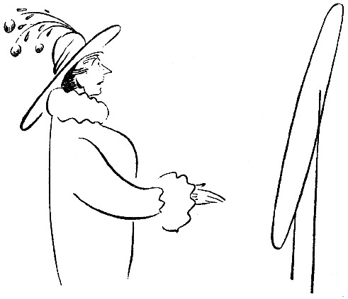

<@pagebreak 46/>

<h2>Ein Hut.</h2>

Wenn sich ein Mann einen Hut kaufen will, dann
geht er in einen Laden, in dem Hüte verkauft werden.

Mit entschuldigendem und scheuem Blick setzt er den
verschimmelten, verbeulten, mottigen Stoffetzen, den er
auf dem Kopf trägt, ab und sagt zu dem Verkäufer:

»Darf ich mir vielleicht einen Hut aussuchen?«

Dann holt der Verkäufer eine große, schwere, runde
Maschine und stülpt sie dem Mann auf den Kopf, so
daß der Mann auf einen Stuhl sinkt, weil ihm ist, als
<@pagebreak/>
wenn er einen Berg auf dem Kopfe hätte. Dann drückt
der Verkäufer auf eine Feder, so daß es in dem Kopf
des Mannes knackt, und dann sagt der Verkäufer:

»58!«

Er kann auch 63 sagen, aber dann ist es ein ungewöhnlich
dicker Kopf.

Hierauf bekommt der Mann einen Hut, der ihm genau
paßt, nachdem er (der Hut) umgepreßt und nach
allen Richtungen gezerrt worden ist und noch Korkstreifen
und zusammengekniffte alte Zeitungen hinter den
Schweißriemen gelegt worden sind.

Wenn der Mann auf die Straße gekommen ist, fliegt
ihm der Hut vom Kopf, und wenn er nach Hause gekommen
ist, legt er ihn auf einen Stuhl und setzt sich
drauf. Das wiederholt sich ziemlich häufig, zwei Jahr
lang, bis der Mann merkt, daß seine Wechsel nicht mehr
diskontiert werden. Dann borgt er sich 10 Kronen
von einem Freund und kauft sich einen neuen Hut.

So macht es ein Mann. Aber wie macht es eine
Frau? Z.&nbsp;B. meine Frau? —

Wir frühstückten neulich zusammen, ein ernstes,
schweigsames Frühstück, denn morgens ist niemand zu
Scherzen aufgelegt. Schweigend macht man sein Programm
für die Taten des Tages.

Beim Kaffee sagte meine Frau:

»Ich wollte Dich um etwas bitten. Ich brauche einen
neuen Hut.«

»Ja, weil es jetzt vierzehn Tage her ist, daß Du
Dir einen gekauft hast.«

<@pagebreak/>
»Ich habe mir seit dem Frühjahr keinen neuen Hut
gekauft. Ich kann doch im Winter keinen Sommerhut
tragen. Oder möchtest Du das?«

»Ich habe nichts dagegen. Ich trage keinen besonderen
Hut im Winter.«

»Du trägst keinen Strohhut im Winter.«

»Nein, aber vielleicht möchtest Du, daß ich es tue.
So daß die Leute sich amüsieren und ich mich erkälte.«

Pause.

Ich: »Was kostet denn ein neuer Hut?«

»Ich hatte mir gedacht, daß ich mir eine Form machen
lasse und dann meine alte Feder benutze.«

»Ich will wissen, was das kostet.«

»Das weiß ich nicht.«

»Dann gehe ich mit und kaufe den Hut. Es gibt
einfache, wirklich geschmackvolle und preiswerte Hüte.
Wir wollen so einen kaufen. Wir treffen uns um vier
Uhr vor Skillts Putzgeschäft.«

Wir trafen uns. Und tief ernst gingen wir hinein.

Das Putzgeschäft war voll mit Damen, die Hüte
aufprobierten, und während sie sie ausprobierten, sprachen
sie von Hüten, die sie früher gehabt hatten, von Federn
und Pleureusen und Schleifen.

Vor einem Spiegel stand Fräulein Nyqvist vom Theater,
die ich sehr bewundere. Sie probierte einen entzückenden
Pelzhut mit etwas rotem Samt auf. Ich
grüßte, denn ich habe Fräulein Nyqvist bei einem Diner
des Theaterdirektors kennen gelernt, und Fräulein Nyqvist
war gleich sehr erfreut und sagte:

<@pagebreak/>
»Wie nett! Jetzt können Sie mir aussuchen helfen!
Steht mir dieser? Finden Sie, daß er zu groß ist?
Soll ich das Rote dran lassen? Oder eine einfache
Feder nehmen?«

»Der ist großartig,« sagte ich. »Einfach wundervoll.
Man kann sich nichts Geschmackvolleres denken. Der
steht Ihnen vorzüglich.«

»Ja, aber er kostet 85 Kronen.«

»Das ist kein Preis für so einen Hut.«

Die Verkäuferin warf mir einen freundlichen Blick
zu, und in demselben Augenblick fühlte ich ein Kneifen
in meinem rechten Arm, ein hartes und energisches
Kneifen, und dann hörte ich meine Frau:

»Ich dachte, Du bist mitgegangen, um mir einen
Hut zu kaufen!«

»Sofort,« erwiderte ich und wandte mich an die Putzmacherin.

»Können wir einen einfachen und billigen Hut sehen,
aber geschmackvoll?«

Wir sahen uns einen einfachen und billigen Hut an.
Er war auch sehr geschmackvoll für einen Elefanten
oder ein jüngeres Nilpferd, das Sonntags am Nil kokettieren
will.

Meine Frau warf ihn hinter den Ladentisch.

Wir probierten einen anderen Hut auf.

»Der sitzt ja verkehrt herum,« sagte ich.

»Nein, der sitzt richtig,« sagte die Verkäuferin.

»Dann sitzt er nicht auf dem richtigen Kopf,« sagte ich.

Und dann warfen wir den auch hinter den Ladentisch.

<@pagebreak/>
Der nächste Hut.

Das war ein sehr hübscher Hut. Sehr einfach, aber
schick.

»Das ist der richtige Hut,« sagte ich. »Der steht
Dir. Den nehmen wir. Was kostet der?«

»185 Kronen,« sagte die Verkäuferin.

Ich ging auf die Straße und holte fünfmal tief Atem,
und dann ging ich wieder hinein.

Ein anderer Hut wurde aufprobiert.

»Der ist ausgezeichnet,« sagte ich. »Er paßt zu
Deinen Augen und Deinem Mund und Deinem Teint
und Deinem Haar, aber nicht zu Deiner Nase. Es
kommt sehr darauf an, wie ein Hut zur Nase paßt.
Eine etwas stülpnasige Person kann nicht jeden ixbeliebigen
Hut tragen.«

»Stülpnasig??!!« sagte meine Frau, und wir gingen
zu einem andern Hut über.

Wir gingen zu achtzehn andern Hüten über. Keiner
paßt. Das heißt, es ist möglich, daß alle paßten, aber
ich hatte vielleicht die unrichtige Frau für sämtliche achtzehn
Hüte mitgenommen.

Wir setzten uns, um uns auszuruhen, und dann begannen
wir von neuem.

Schließlich kauften wir den Hut, den wir zuerst aufprobiert
hatten, und dann gingen wir nach Hause, müde
und verdrossen.

Als wir in die Hauptstraße gekommen waren, trafen
wir Olga. Olga hatte genau denselben Hut auf wie
meine Frau.

<@pagebreak/>
»Hast Du gesehen, daß die Person denselben Hut auf
hatte wie ich?« sagte meine Frau.

»Er war ziemlich ähnlich,« antwortete ich.

»Es war derselbe Hut! Ich kann nicht denselben
Hut tragen wie die.«

»Ich kenne viele Herren, die denselben Hut tragen
wie ich.«

Acht Stunden Pause.

Am nächsten Tage verkaufte meine Frau den neuen
Hut an das Fräulein im Bäckerladen für 15 Kronen,
auf Abschlagszahlung. Und morgen will sie sich einen
neuen Hut kaufen.

Ich habe schon mit einem Dienstmann gesprochen,
der mitgehen soll. Er soll 2 Kronen pro Stunde haben,
eine Kiste Zigarren und 5 Kronen extra, wenn der Hut
billiger als 45 Kronen ist.

Später kann seine Frau den Hut bekommen.

Wahrscheinlich schon im nächsten Monat.

O, Ihr Frauen!

