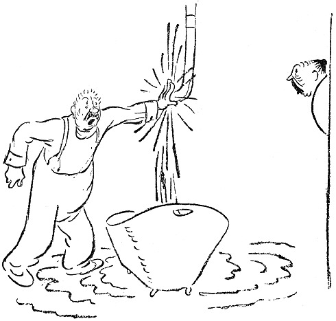

<@pagebreak 52/>

<h2>Der Badewannenhahn.</h2>

Adolph Blom lag im Bett und las die Morgenzeitung.
Seine Frau, die ziemlich früh aufsteht, weil sie zeitiger
schlafen geht als Blom, kam herein und sagte:

»Der Hahn im Badezimmer läuft.«

Blom hörte wohl, was seine Frau sagte, aber wenn
Blom die Zeitung liest, darf er nicht gestört werden.
Er las also den Artikel über den drohenden Kohlenmangel
zu Ende, legte dann die Zeitung fort und sagte:

<@pagebreak/>
»Mir war, als wenn Du etwas gesagt hättest.«

»Ich habe gesagt, daß der Hahn im Badezimmer läuft.«

»Dann wird wohl jemand dran gewesen sein.«

»Ich nicht,« sagte Frau Blom, »ich habe seit Donnerstag
nicht gebadet.«

»Ein Hahn geht nicht von selber kaputt,« sagte Herr
Blom und ging im bloßen Hemd nach dem Badezimmer.
Es tropfte vom Hahn in die Wanne. Blom hielt die
Hand unter und fühlte, daß es tropfte.

»Wollen wir einen Rohrleger herkommen lassen?«
fragte Frau Blom.

»Einen Rohrleger, — so’n Mensch kommt erst in
acht Tagen. Hol mal meinen Patentschlüssel, dann
werde ich die Mutter ein bißchen anziehen.«

»Patentschlüssel?!?!«

Herr Blom sah seine Frau an, dann sagte er:

»Ein Patentschlüssel ist ein Schraubenschlüssel, der
durch das Verstellen eines seiner Teile in verschiedene
Lagen gebracht werden kann. Diese Patentschlüssel sind
im höchsten Grade praktisch. Man kann sie bei den
verschiedensten Gelegenheiten verwenden, und sie passen
für alle Muttern. Bitte such’ meinen Patentschlüssel!«

»Bester Adolph, — sei nicht böse, — aber ich habe
nie solchen Schlüssel gesehen, — ich weiß nicht —«

Blom ging selbst, um den Schlüssel zu holen. Er
suchte ihn im Werkzeugkasten und fand ihn unter dem
Schreibtisch. Er ging ins Badezimmer zurück. Die
Familie war versammelt. Ein Regisseur beim Königlichen
Dramatischen Theater hätte sie nicht besser gruppieren
<@pagebreak/>
können. Der acht Jahre alte Karl-Erik war
der Wanne am nächsten. Frau Blom stand neben ihm,
und hinter ihnen stand Albertina, das Dienstmädchen,
mit einem Milchtopf in der Hand, denn sie war im
Milchladen gewesen.

Herr Blom setzte sich auf den Rand der Wanne,
legte den Schraubenschlüssel um die Hahnmutter und
drehte. Die Mutter bewegte sich nicht. Sie saß fest.

»Du mußt fester anziehen, Adolph,« sagte Frau Blom.

Adolph zog fester an. Als er über den Rand der
Wanne guckte, in die er hineingefallen war, hörte er
einen Schrei des Entsetzens. Der Patentschlüssel war
Karl-Erik mitten in die Stirn geflogen, und der Junge
schrie entsprechend.

»Immer steht Ihr im Wege,« sagte Blom.

»Tue Dir etwas Kaltes drauf,« sagte Albertina.

»Holen Sie doch Butter, Menschenskind, und stehen
Sie nicht da und gaffen! Dann wird es keine Beule!«
schrie Frau Blom.

Herr Blom blieb allein im Badezimmer. Er stieg
aus der Badewanne und fixierte den tropfenden Hahn
wie ein Boxer, ehe er auf seinen Gegner losgeht. Er
war ernst, ruhig und beherrscht. Er sagte sich:

»Wenn ein Hahn tropft, dann ist der Hahn entzwei;
am besten ist es also, den ganzen Hahn abzuschrauben
und zu untersuchen, wo der Fehler steckt.«

Blom praktizierte den Patentschlüssel wieder auf die
Mutter und drehte in der anderen Richtung. Das ging
leichter. Er schraubte den ganzen Hahn los, und im
<@pagebreak/>
Augenblick brauste das Wasser mit dickem Strahl aus
dem Rohr mitten ins Badezimmer hinein.

»He! Halloh! Herkommen!!!«

Albertine kam. Sie hielt die Hand vors Gesicht,
denn sie hatte Angst vor dem Patentschlüssel.

»Holen Sie etwas, was man ins Rohr stopfen kann,«
schrie Blom. »Sonst gibt’s eine Überschwemmung!«

Albertine rannte davon und kam mit einem Bierflaschenkorken
zurück.

»Rufen Sie meine Frau,« schrie Blom, »denken Sie,
man kann Bierflaschenkorken in ein Rohr stecken, das
dicker ist als eine Riesenschlange?!«

»Lieber, guter Herr Blom, seien Sie nicht böse!«
wimmerte Albertina, und dann kam Frau Blom.

Das Wasser strömte über den Fußboden des Badezimmers.
Frau Blom schürzte ihre Röcke hoch und sagte:

»Wenn Du die Hand vorhältst, Adolph, dann werde
ich nach dem Rohrleger telephonieren!«

Blom überlegte nicht —, er drückte die Hand auf
das Loch und hielt das Wasser etwas zurück. Das
Wasser war kalt, und die Hand wurde ihm bald steif.

Frau Blom kam wieder und meldete: »Vor morgen
früh kann kein Rohrleger hier sein.«

»Klingle beim Wirt an,« schrie Blom, »klingle bei
den Wasserwerken an, klingle beim Magistrat an,
klingle überall an, sage, daß sie das ganze Stadtviertel
abstellen sollen! Und stehe mir nicht im Wege, ich
muß die Hand wechseln!«

Frau Blom klingelte bei einer neuen Rohrlegerfirma
<@pagebreak/>
an. Sie weinte und flehte, und die Firma versprach
ihr, sofort einen Arbeiter zu schicken. Dieser Arbeiter
kam nach zwei Stunden sofort.

Blom hatte inzwischen 630mal die Hand gewechselt
und drei Pilsener getrunken. Albertina hatte gekündigt,
und Frau Blom ging zwischen dem Badezimmer und
der Entréetür hin und her und tröstete und ermunterte
und rang die Hände.

Im Schlafzimmer saß Karl-Erik und drückte ein
blankes Einkronenstück, das er von seiner Mutter bekommen
hatte, gegen die Stirn; es ertrug sich leichter so.

Der Arbeiter der Rohrlegerfirma kam. Frau Blom
wäre ihm um den Hals gefallen und hätte ihn geküßt,
wenn sie nicht so gut erzogen gewesen wäre,

Der Mann ging schnurstracks in das Badezimmer,
schloß die Tür hinter sich, sah Herrn Blom ein
Weilchen an, stellte sich dann auf den Rand der Wanne
und schraubte an einem Hahn, der etwas höher auf
dem Rohr saß, worauf das Wasser aufhörte zu laufen.

»Das hätten Sie auch allein machen können!« sagte
der Arbeiter der Rohrlegerfirma.

Blom überlegte einen Augenblick, dann ging er ins
Schlafzimmer, nahm die Krone von Karl-Eriks Stirn,
gab sie dem Rohrleger und sagte:

»Hier haben Sie. Aber sagen Sie nichts meiner Frau.«

Worauf Blom den Hahn, den er abgeschraubt hatte,
wieder anschraubte, den oberen Hahn wieder öffnete
und sich überzeugte, daß es genau so tropfte wie vorher.
Da kroch er ins Bett.

