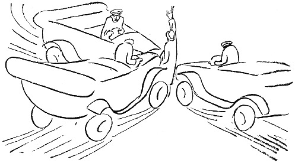

<@pagebreak 57/>

<h2>Der Hexenschuß.</h2>

Vor ein paar Tagen bekam ich einen Hexenschuß. Das
ist das Wenigste, was man in so kriegerischen Zeiten
verlangen kann. Ich bekam ihn auf der Straße, ohne vorherige
Warnung, und ich stand plötzlich ganz unbeweglich.

Mein erster Gedanke war: »Der Rücken ist mir auseinandergegangen!
Wenn ich ein bißchen warte, wächst
er vielleicht wieder zusammen!«

Ich stand mitten auf der Straße, mitten im Verkehr.
Straßenbahnwagen rollten, Autos jagten umher, Menschen
drängten sich, und Jungens radelten. Ein Auto
kam gerade auf mich zu, und hinter mir kam auch eins.
Ich dachte: »Wenn ich die rechte Hand hochstrecke,
halten sie vielleicht! Die Schutzleute machen es hier
so und in Berlin auch.«

<@pagebreak/>
Ich hielt den Arm hoch, und die Autos blieben
stehen. Ich hörte die Chauffeure rufen: »Was ist denn
los! Zum Donnerwetter, was will denn der?«

Ich versuchte, mich zurückzuziehen, zu gehen, aber es
gelang mir nicht. Noch ein Auto hielt, und dessen
Chauffeur rief: »Gehen Sie aus dem Weg! Ich muß
nach dem Zentralbahnhof, 12 Uhr 40!«

Meine rechte Hand erschlaffte, und ich dachte: »Jetzt
gilt es, stattdessen die linke hoch zu bekommen! Ehe
sie sich in Bewegung setzen!«

Zu spät — — die drei Autos fuhren mich um.

Der Verkehr stockte aufs neue, und einer der drei
Chauffeure kam zu mir heran. »Leben Sie?« fragte er.

»Noch ja,« sagte ich. »Aber lassen Sie sich durch mich
nicht stören. Ich habe einen Hexenschuß und kann mich sowieso
nicht bewegen. Ich bitte die Herren vielmals um Entschuldigung
und will natürlich die Kosten für alles tragen.«

»Ich muß nach dem Zentralbahnhof, 12 Uhr 40!«
sagte der dritte Chauffeur.

»Ich weiß,« sagte ich, »lassen Sie die Fahrgäste
meinetwegen nicht warten!«

Der andere Chauffeur sah mich an. Er sah freundlich
aus. Dann kam er auf mich zu, hob mich auf
und legte mich auf den Rücksitz in seinem Auto. Ich
gab ihm meine Adresse, und er fuhr mich nach Hause.
Er war so liebenswürdig, mich die Treppen hinaufzutragen.
Meine Frau öffnete, und als sie mich in den
Armen des freundlichen Chauffeurs sah, sagte sie: »Wie
spät ist es denn eigentlich?«

<@pagebreak/>
Ich habe lange überlegt, warum sie das wissen wollte.
Der Chauffeur trug mich hinein und setzte mich auf
einen Stuhl. Und als er fort war, sagte meine Frau:

»Kannst Du denn nicht gehen?«

»Doch,« erwiderte ich, »aber ich kann doch auch
mal auf Händen getragen werden. Ein auf Händen
getragener Schriftsteller — — —«

Meine Frau ging hinaus und weinte. Da klingelte
das Telephon. Das hing in Reichweite, und ich meldete
mich. Es war mein Freund B.

»Ich habe einen Hexenschuß,« sagte ich, »— kann
nicht gehen.« — »Ach,« sagte B., »den habe ich schon
häufig gehabt. Du mußt Antophontabletten nehmen,
dann bist du bald wieder auf dem Posten. Das ist
das einzige, was hilft.«

Nach einer Weile kam eine Frau herauf, die eine
Treppe tiefer wohnt. Sie hätte gehört, daß ich überfallen
und von zwei dänischen Juwelendieben beraubt
und von drei Schutzleuten nach Hause gebracht worden
wäre. Sie hätte auch erfahren, daß ich einen Hexenschuß
habe. Sie sagte:

»Mein Mann hat auch oft einen Hexenschuß. Oft
hat er einen Hexenschuß. Er legt dann Termogenwatte
auf. Termogenwatte legt er dann auf. Termogenwatte
ist das Beste gegen Hexenschuß. Gegen Hexenschuß ist
Termogenwatte das Beste.«

»Vielen Dank«, sagte ich. »Ich werde mir Termogenwatte
besorgen, Termogenwatte werde ich mir besorgen.«

Gleich darauf kam mein Freund, der Jäger.

<@pagebreak/>
»Hahaha«, sagte er. »Hexenschuß! Den habe ich
jeden Monat. Dann kann ich nicht mal die Augenbrauen
bewegen, so verflixt weh tut das! Aber es
gibt ein Mittel, nur eins, und das ist ein Katzenfell!
Du legst ein Katzenfell auf den Rücken, und über
Nacht bist Du wieder gesund.«

Da nahm ich Antophontabletten, legte Termogenwatte
auf den Rücken und wurde so gesund, daß ich in langsamem
Tempo ausgehen und mir ein Katzenfell besorgen konnte.

Ich ging in ein Ledergeschäft. Der Kommis war
eine junge, blonde Dame. Sie sah mich forschend an
und sagte: »Wozu soll das Fell sein?«

Ich errötete und sagte: »Ich wollte es bloß zum
Vergnügen haben. Ein Katzenfell kann man doch immer
gebrauchen.«

Dann brachte sie Katzenfelle. Sie hatten verschiedene
Farben: schwarz, grau und schwarzweiß.

»Was kosten diese Katzenfelle?« fragte ich.

»6,50,« sagte die Dame.

»Das ist teuer,« sagte ich. »Sie müssen wissen, mein
Fräulein, es braucht keine Rassenkatze oder eine Katze
mit besonders vornehmem Stammbaum zu sein. Ich
bin mit einer ganz gewöhnlichen Katze zufrieden. Die
einfache schwedische Hauskatze genügt mir.«

»Solche Katzenfelle führen wir nicht«, sagte die junge
Dame und stellte den Karton weg.

»Verzeihung«, sagte ich und kroch nach einem anderen
Geschäft, einem richtigen Pelzwarengeschäft. Da war
ein Herr, der bediente:

<@pagebreak/>
»Katzenfelle?« sagte er, wie nachsinnend; »Katzenfelle
das ist nicht mehr modern. Jetzt muß es Skunks sein.«

»Auch fürs Kreuz?« sagte ich. »Gegen Hexenschuß?«

»Soso«, sagte er, »solch ein Katzenfell? Das haben
wir für 2,50.«

Ich bekam das Fell. Es war weiß mit einem
schwarzen Fleck mitten auf dem Rücken.

»Arme Katze,« dachte ich, »du mußt wie ein bunter
Hund bekannt gewesen sein. Wie viele Steine und
alte Stiefel und Gummischuhe sind in deinem Leben
über dich hergerasselt! Aber jetzt hast du deine Bestimmung
erfüllt.«

Ich humpelte nach Hause und legte das Fell dahin,
wo es liegen sollte. Es blieb zehn Minuten liegen,
dann rutschte es in die Kniekehlen. Katzenfell ist glatt.

Ich war an diesem Tage zu Tisch geladen, und dann
und wann mußte ich den Gastgeber flüsternd bitten,
allein sein zu dürfen. Als ich auf diese Weise sechsmal
im Schlafzimmer gewesen und einmal von der
Dame des Hauses überrascht worden war, die sehr erstaunt
schien, als Sie mich halbnackt, mit einem Katzenfell
in der Hand, erblickte, sah ich ein, daß ich möglichst
unbemerkt nach Hause gehen mußte. Das gelang mir.

Ich kam auf die Straße, ohne daß mich jemand
gesehen hatte. Als ich ein Stück gegangen war, begegnete
ich einem großen Hund. Er blieb mit einem
Ruck stehen. Der Schwanz hob sich, und er knurrte
dumpf.

»Na, na,« sagte ich, »Freundchen!« Wie man so
<@pagebreak/>
zu Hunden zu sagen pflegt. Aber er knurrte weiter und kam
näher. Er schnupperte mit der Schnauze, und ich verstand,
daß er die »Fährte« des Katzenfell gefunden hatte.

»Freundchen,« sagte ich freundlich, »das ist eine tote
Katze, eine durch und durch tote Katze, also nichts von
Bedeutung!«

Da kam noch ein Hund. Das war ein Terrier.
Er bellte aus vollem Halse, und alle beide begannen,
um mich herumzuspringen und zu hüpfen. Ich ging
die Straße geradeaus, und je weiter ich ging, desto
mehr Hunde kamen. Ich konnte bis acht Stück zählen,
als ich die elektrische Lampe eines Kinos entdeckte.

Da flitzte ich hinein und fühlte plötzlich, daß das
Katzenfell von meinem Kreuz verschwunden war.

Ich erstand eine Karte zu einem der hinteren Plätze,
und es war dunkel im Zuschauerraum, als ich mich
setzte. Draußen hörte ich die Hunde bellen.

Ich kam mitten in ein Drama. Ein junger Mensch
saß an seinem Schreibtisch und schrieb folgendes, das
auf der Leinwand erschien:

»Ich libe dich, und wen ich dich nicht bekome, töte
ich mich. Dein Teudor.«

Gleich darauf wurde es hell, denn es war Pause.
Ich sah mich um. Hinter mir saß ein junges Mädchen
mit ihrer Mutter. Sie (das Mädchen) war süß. Nach
einer Weile hörte ich die Mutter sagen: »Das ist doch
wirklich unanständig!«

Das Drama unanständig, dachte ich. Vielleicht
schickt es sich nicht für meine Tugend.

<@pagebreak/>
»Ich finde es furchtbar«, sagte die Tochter. Wollen
wir gehen?«

Dann wurde ich ruhig, und ich fühlte, daß mir jemand
auf den Rücken tippte. Ich drehte mich schnell um und
blickte gerade in das erregte Gesicht der Mutter.

»Schämen sollten Sie sich!« sagte sie.

»Ich verstehe nicht«, sagte ich.

»Oh, ich bitte«, sagte die alte Dame, »das weiß ich
wohl! Wenn man in solcher Verfassung ist, dann soll
man nicht unter Leute gehen! Das meine ich!«

Ich spürte etwas, das mich im Genick kitzelte. Ich
faßte mit der Hand hin. Der Katzenschwanz ragte
zwischen Kragen und Hals heraus!!!

Die Alte glaubte, es wäre mein Hemdzipfel.

»Verzeihung,« sagte ich, ohne zu wagen, die junge
Tochter anzusehen, »es ist wirklich nicht mein Hemdzipfel!«

»Um so merkwürdiger«, sagte die Mutter; »komm,
Greta, wir gehen! Solche Geschmacklosigkeiten kann ich
nicht länger mit ansehen!«

Ich sah mir das Drama bis zum Schluß an —
Teudor bekam seine Geliebte — und als ich auf die
Straße kam, riß ich das Katzenfell am Genick entlang
heraus, warf es den wartenden, heulenden Hunden hin
und lief nach Hause. — Und der Hexenschuß war
ebenso schnell verschwunden, wie er gekommen war.

