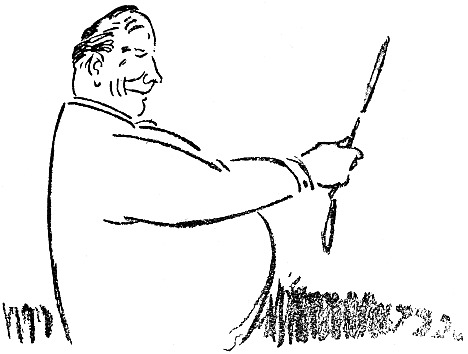

<@pagebreak 70/>

<h2>Das fröhliche Lächeln.</h2>

Jüngst erhielt ich ein Büchelchen mit dem Titel
»Hygienische Morgentoilette« von einem Sanitätsrat
Sperling.

Das Büchelchen enthielt ein neues Turnsystem, dessen
Vorteil in seiner Bequemlichkeit lag — alle Bewegungen
werden im Bette, liegend, ausgeführt, gleich nach dem
Erwachen. Kein Laufen, kein Abrackern am Reck, keine
Sprünge usw.; denn so etwas bringen wir ja heute
nur schwer fertig. Jetzt wollen wir lieber ein Turnen
<@pagebreak/>
im Liegen haben, und in einigen Jahren sind wir
hoffentlich so weit, daß wir uns darauf beschränken,
uns die verschiedenen Bewegungen nur zu denken, und
schon dabei gedeihen.

Also das System des Sanitätsrats Sperling gipfelte
in einer Übung, die bisher im Turnen unbekannt war:

»Wenn Du das System im Bette ausgeführt hast,
dann stehe auf, gehe vor einen Spiegel und nimm ein
fröhliches Aussehen an. Behalte dieses Aussehen
während des Tages — was auch geschehen mag!«

Als ich den Paragraphen zweimal durchstudiert hatte,
begriff ich, daß er mehr wert war als sämtliche Bewegungen
miteinander. Wer fröhlich ist, der ist auch gesund,
und man kann natürlich fröhlich sein — wenn
man sich nur dazu entschließt.

Ich entschloß mich also für die Fröhlichkeit. Ich
formte meinen Mund zu einem Lächeln, einem ungezwungenen
Lächeln, gewinnend, sympathisch, und ich
strich die Falte zwischen meinen Augen weg.

Ich sah aus, als hätte ich in der Lotterie gewonnen,
oder als hätte mein Feind — nicht gewonnen. Nach
einer Weile spannte es im Gesicht, aber ich hielt aus,
und mit freundlichem Lächeln und fröhlichen Augen
trat ich an den Frühstückstisch.

Meine Familie war vollzählig versammelt. Meine
Söhne stießen sich neckisch mit den Füßen unter dem
Tisch an, und meine Frau strich gerade ein Butterbrot
für meine Tochter, die auf einem Stuhl stand und eben
eine Tasse Schokolade umwarf.

<@pagebreak/>
Ich behielt die freundliche Maske bei. Meine Frau
sah mich mit großem Erstaunen an und sagte:

»Du siehst ja so komisch aus, ist Dir nicht wohl?«

»Ausgezeichnet«, sagte ich und lächelte strahlend.

Meine Söhne sahen mich an, und meine Tochter
sah mich auch an, und ihre Augen wurden groß vor
Erstaunen — solch eine Morgenlaune hatten sie noch
nie bei ihrem Vater gesehen. Nach einer Weile sagte
meine Frau:

»Der Gasmann kommt heute. Es macht 56 Kronen.«

»Ich schwärme für Gasleute, und 56 Kronen ist billig.«

Meine Frau erbleichte. Das war ihr neu. Sie
fügte schnell hinzu: »Und dann muß ich der Schneiderin
130 Kronen bezahlen.«

»Natürlich mußt Du das«, sagte ich. »Ich habe mich
schon danach gesehnt, Dir das Geld dazu zu geben.«

Wir aßen unser Frühstück unter allgemeiner Fröhlichkeit,
und als ich fortging, gab mir meine Familie unter
Hurrarufen die Treppe hinunter das Geleit.

Ich bestieg eine Elektrische, um nach meinem Bureau
zu fahren. Der Wagen leuchtete ordentlich auf vor
Freude, als ich einstieg.

Ein alter Bekannter, den ich jahrelang nicht gesehen
hatte, kam herein und setzte sich neben mich.

»Guten Tag, guten Tag, wie geht’s Dir, Du siehst
ja so vergnügt aus? Ist Dir was Spaßiges passiert?«

»I bewahre,« sagte ich, »man kann doch auch vergnügt
aussehen, ohne es zu sein!«

»Soso, das ist mir neu.«

<@pagebreak/>
»Ja,« sagte ich, »es gibt ja doch auch Menschen, die
intelligent aussehen, ohne es zu sein.«

Mein alter Bekannter zuckte zusammen und sagte:

»Versuche nur nicht, witzig zu sein! Das sollte wohl
ein Hieb für mich sein?!«

»Ich habe nie behauptet, daß Du intelligent aussiehst«,
sagte ich und lächelte genau so freundlich wie
vorher.

Mein Freund stieg aus.

Mir gerade gegenüber saß eine junge Dame. Sie
war allerliebst. Ich sah sie mit meinem strahlenden
Lächeln an, und sie errötete tief. Ich sah sie immerfort
an, bis ein Herr, der neben ihr saß, sagte:

»Kennst Du den Herrn, Anna?«

»Nein«, sagte Anna.

»Dann ist es höchst unverschämt von ihm, eine unbekannte
Dame zu beleidigen!«

Ich erhob mich und stieg aus, denn ich wollte keinen
Streit verursachen.

An der Haltestelle stand meine Tante. Sie trug
den rechten Arm in einer Binde und sah leidend aus.

»Wie geht’s?« fragte ich.

»Wie es geht?« sagte die Tante. »Ich bin von der
Leiter gefallen und habe mir den Arm gebrochen und
will jetzt nach der Klinik! Dabei ist übrigens nichts
zu lachen!«

»Ich lache ja gar nicht, Tante,« sagte ich, »ich lächele.
Ich sehe froh aus. Wenn wir alle etwas fröhlicher
aussähen, dann wäre es viel besser hier auf der Welt.
<@pagebreak/>
Wenn zum Beispiel Du, Tante, jetzt froh aussähst,
dann würde Dich der Arm nicht so sehr schmerzen.«

»Schon als Du noch ein kleiner Junge warst, habe
ich Deiner Mutter gesagt, daß Du ein Lümmel werden
würdest, und ich sehe, daß ich recht behalten habe.
Mach, daß Du fortkommst!«

Ich ging in mein Bureau. Als ich ins Wartezimmer
kam, saßen drei Leute da, die Empfehlungen haben
wollten, sechzehn Personen, denen ich ihre Manuskripte
durchsehen sollte, acht Personen, die mich zu Mittag
einladen, und zwei, die Geld von mir pumpen wollten.

Ich blieb an der Tür stehen, und mit einem Schlage
kehrte mein altes, ernstes Aussehen wieder, und mit
lauter Stimme verkündigte ich:

»Der persönliche Empfang fällt heute aus!«

Worauf ich in mein Privatbureau hineinging und
einen Brief an den Sanitätsrat Sperling schrieb, daß
sein neues Turnsystem mit dem fröhlichen Lächeln
nichts taugt. Wenigstens nicht für Geschäftsleute.

