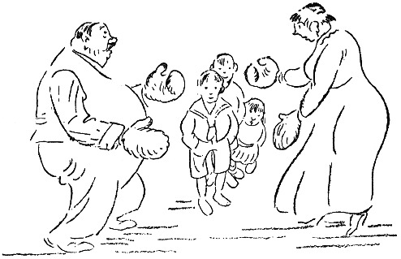

<@pagebreak 75/>

<h2>Boxe zu Hause.</h2>

Herr Blom kam mit zwei Paar Boxhandschuhen nach
Hause, die er auf einer Auktion gekauft hatte, das Paar
zu 75 Öre. Das ist billig, wenn man bedenkt, daß
das Boxen ein aufstrebender Sport ist.

Herr Blom nahm also die Handschuhe mit nach Hause,
und beim Mittagbrot sagte er zu Fritz und Oskar,
seinen zwölf und vierzehn Jahre alten Söhnen, die
gerade damit beschäftigt waren, sich unter dem Tisch
gegenseitig mit den Füßen zu stoßen:

»Heutzutage muß man sich verteidigen können! Ich
meine, nicht nur das eine Volk gegen das andere, sondern
auch rein individuell. Das eine Individuum muß sich
gegen das andere verteidigen können, wenn es angegriffen
wird.«

<@pagebreak/>
»Daß der Krieg auch gar kein Ende nimmt!« sagte
Frau Blom. »Seit gestern sind die Erbsen wieder
10 Öre teurer!«

»Die Verteidigung, von der ich spreche,« fuhr Herr
Blom fort, »ist eine Verteidigung, die in allen Lebenslagen
zu brauchen ist. Der große französische Schriftsteller
Metterlinck — —«

»Maeterlinck heißt er,« sagte Oskar, »und ist ein Belgier.«

»Nicht Papa verbessern!« rügte Frau Blom.

»Wenn er aber Unrecht hat,« sagte Oskar. »Ich
weiß, er heißt — —«

»Namen werden ja verschieden ausgesprochen,« sagte
Herr Blom, »einmal war ein Engländer bei mir im
Bureau, und der nannte mich Blaam, so daß wohl nicht
so leicht zu sagen ist, wie Metterlinck eigentlich heißt.
Jedenfalls hat dieser Schriftsteller irgendwo geschrieben,
daß der Mensch das einzige Tier sei, das sich von Natur
aus nicht verteidigen kann. Alle anderen Tiere können
sich verteidigen. Der Ochse hat seine Hörner, die Katze
ihre Krallen, die Schlange ihren Stachel.« — »Und was
hat der Regenwurm?« fragte Oskar.

»Der Regenwurm,« sagte Herr Blom und legte seine
Gabel mit einer halben Sardine hin, »der Regenwurm
hat eine schützende Ähnlichkeit mit dem Erdboden; er
ist nicht zu sehen.«

»Das hilft ihm nicht viel, wenn er an einem Angelhaken
im Wasser hängt und ein Barsch kommt,« sagte Oskar.

»Metterlinck meint,« fuhr Herr Blom fort, »daß der
Mensch zum Verteidigen seine Hände hat, aber daß er
<@pagebreak/>
diese Kunst vernachlässigt hat. Statt dessen benutzt er
Waffen, was roh und gemein ist. Ein Mensch, der
boxen kann, greift niemanden an, aber wenn er angegriffen
wird, verteidigt er sich mit ruhigem und kaltem
Blut und macht seinen Gegner schnell kampfunfähig,
ohne selbst nennenswert verletzt zu werden. Nach Tisch
werde ich Euch ein paar kleine Tricks im Boxen zeigen,
die ich vor ein paar Tagen bei einem Schauturnen gesehen
habe.«

Als die Familie gegessen hatte, zog sich Herr Blom
das eine Paar Handschuhe an und reichte Frau Blom
das andere:

»Ziehe diese hier an, Berta, ich will den Jungens
nur ein paar Stöße zeigen!«

»Ich denke nicht daran,« sagte Frau Blom, »ich raufe
mich nicht!«

»Es ist ja keine Rede von raufen, aber ich muß doch
jemand haben, an dem ich das vorführen kann. Also
ziehe Dir die Handschuhe an!«

Fritz reckte sich zum Fenster hinaus und rief auf die
Straße hinunter:

»Kommt rauf, zugucken, Jungens, Mama und Papa
hauen sich! Aber dalli!!!«

Frau Blom zog schließlich die Handschuhe an und
stellte sich ihrem Mann gegenüber. Es schien, als dächte
sie an etwas.

Herr Blom sagte: »Wenn Du jetzt den linken Arm
ausstreckst — —«

Frau Blom streckte den linken Arm aus, so daß ihre
<@pagebreak/>
Faust mit hartem Klatsch mitten in Herrn Bloms Gesicht
sitzen blieb.

Die Jungens kicherten.

Herr Blom fühlte eine brennende Hitze im Gesicht
und sagte etwas hart:

»Du mußt doch nicht loshauen, wenn ich keine Ahnung
habe!«

»Denkst Du, ein Boxer sagt vorher: Jetzt kommt die
Watschen!« sagte Frau Blom. »Ich haue, wann ich will!«

»So,« sagte Herr Blom und machte einen Ausfall
mit dem rechten Arm. Frau Blom wich aus, und die
Salonlampe, die Blom als Hochzeitsgeschenk von Frau
Bloms Großmutter bekommen hatte, fing den Stoß
auf. Aber schlecht. Die Glocke zersprang.

»Danke bestens«, sagte Herr Blom und stieß die Glasscherben
fort, und dann gab er seiner Frau einen Stoß
mitten in die Brust. Frau Blom schnappte nach Luft,
riß die Handschuhe ab und schrie:

»So ein Kerl, schlägt ein Weib, wenn es an nichts
denkt! Und mitten in die Brust, so daß man nicht
atmen kann! Was würden die Leute sagen, wenn sie
wüßten, wie Du Dich benimmst! Sich so zu betragen!
Uhuuuuu!«

Da klingelte es. Das war der Großhändler Larsson,
der zu Besuch kam. Frau Blom war sehr froh darüber,
warf einen Blick in den Spiegel und lachte und sagte:

»Wie nett, Herr Larsson, daß Sie mit herankommen!
Denken Sie sich, Olaf bringt mir gerade das Boxen
bei, das ist riesig spaßig!«

<@pagebreak/>
Herr Larsson legte Überzieher und Hut ab, und als
er hereinkam, sagte Blom: »Du, Larsson, Du solltest
boxen lernen! Wer nachts herumsumpft wie Du, kann
leicht überfallen werden! Zieh Dir die Handschuhe da
an, dann werde ich Dir ein paar Tricks zeigen!«

»Ach was,« sagte Larsson, »ich bin für so was zu
alt, aber als ich jung war, — da hättest Du sehen sollen!«

»Zieh Dir die Handschuhe an! Wir machen ein paar
Stöße! Nur zum Scherz!« Larsson zog die Handschuhe
an, stellte sich in regelrechte Boxerpositur und gab Blom
schnell und sicher einen Linkshieb gerade zwischen die
Augen.

Blom sah sechsunddreißig kleine Sterne und eine
mittelgroße Sonne, und als die Vision vorüber war,
sagte er:

»Du hast früher geboxt, Larsson, schwindle nicht!«

»Ja, ein bißchen, in Amerika, als ich noch jung war,«
sagte Larsson, und dabei kriegte Blom einen »*uppercut*«,
daß er schluckte und nahe daran war, in den Bücherschrank
hineinzusausen. »Kannst Du denn gar nicht zurückschlagen,
Olaf?!« sagte Frau Blom. — »Ich pariere
vorläufig bloß,« sagte Blom, und damit bekam er einen
Stoß gegen den rechten Backenknochen, daß ihm war,
als würde ihm das Genick ausgerenkt. Nach diesem
Stoß kam ein neuer, direkt unters Herz. Dann folgte
eine Serie Schläge rings um den Kopf und überallhin,
wo Larsson herankonnte.

Herr Blom hatte jedes Gefühl von Raum verloren
und von Zeit auch. Er wußte nur, daß er aus der
<@pagebreak/>
ganzen Geschichte herauswollte. Er lief ins Schlafzimmer,
Larsson verfolgte ihn. Blom erhielt einen
Schlag nach dem andern. Das Blut begann ihm langsam
aus der Nase zu tropfen, und Frau Blom stand
im Korridor und suchte im Telephonbuch nach einer
Unfallstation.

Blom verlor schließlich alle Besinnung. Er machte
einen Schritt rückwärts und stieß Larsson mit dem Fuß
gegen das rechte Schienbein!

Das wurde Bloms Unglück. Larsson war beleidigt.
Er vergaß, daß er Gast in der Familie war, daß er
hinaufgegangen war, um zu plaudern und einen Grog
zu trinken; die Wut packte ihn! Er wurde fürchterlich
in seinem Zorn. Er sah in Blom einen schändlichen
und rohen Feind, den es zu bekämpfen galt. Blom
schrie und brüllte, und Frau Blom hatte schon längst
ihr Telephonbuch hingeworfen und war auf die Straße
gelaufen, um einen Schutzmann zu holen. Bloms Gesicht
war total verschwollen, seine Augen stierten mit kindisch
blödem Blick geradeaus in den Weltenraum, seine Beine
zitterten unter ihm, und mit schlaffen, hängenden Armen
fing er einen Stoß nach dem andern auf, und zwischen
den Schlägen rief er seine Frau, seine geliebten Kinder,
die Polizei und einen Herrn, der eine Treppe tiefer
wohnte. Aber niemand antwortete. Niemand kam ihm
zu Hilfe gegen den rasenden Larsson.

Nach drei und einer halben Minute beharrlichen
Kampfes war Blom kampfunfähig. Er brach über einem
kleinen, niedlichen Nähtisch zusammen; ein Stecknadelbrief
<@pagebreak/>
drang ihm in die Nase und die Stopfnadel aus
einem Knäuel ins Zwerchfell.

Da kam Frau Blom mit dem Schutzmann! Larsson
wurde verhaftet.

Als die Sache schließlich zur Verhandlung kam, stellte
Blom Strafantrag wegen Hausfriedensbruches und grober
Körperverletzung unter erschwerenden Umständen. Larsson
wurde zu acht Monaten Gefängnis verurteilt. Und
Blom nimmt nun Unterricht im Boxen und wartet nur
auf Larssons Entlassung!

Und Frau Blom legt nun immer zwei Sicherheitsketten
vor die Eingangstür und hat mit dem Schutzmann,
der auf der Straße auf und ab geht, ein besonderes
Pfeifsignal verabredet.

