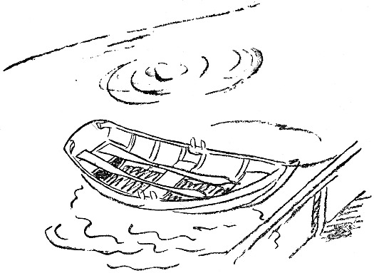

<@pagebreak 82/>

<h2>Die Ruder.</h2>

Morgens, als ich nach dem Hafen hinunter kam, um
nach den Booten zu sehen, entdeckte ich, daß ein paar
Ruder in meinem Boot verschwunden waren.

Ich suchte auf der Brücke, am Strande und in den
Strandbuden. Sie waren nirgends zu finden.

»Es hat sie jemand gestohlen,« sagte Lars, der mit auf
die Suche gegangen war. »Irgendein Segler von den
Nachbarinseln ist nachts gekommen, hat die Ruder gesehen,
sie haben ihm gefallen, und er hat sie mitgenommen.«

<@pagebreak/>
»Das ist mir noch nie in dieser Gegend passiert,«
sagte ich. »Hier wird nichts »geliehen«. Wir glauben
an gegenseitige Ehrlichkeit.«

Wir standen schweigend da. Dann sagte Lars:

»Ist das eine Laufangel für Hechte, die Du da im
Boot hast?«

»Ja, das ist eine Hechtangel. Ich war gestern fischen
damit.«

»Hast Du etwas geangelt?«

»Ja, einen, der ein Kilo wog.«

»Sooo? Wo hast Du denn den ergattert?«

»Bist Du Polizist im Ort?«

»Nein, nur interessiert.«

»Ich habe ihn vor Norrön erwischt.«

»Dann hat auch der Norröer die Ruder genommen.
Er kann es nicht leiden, daß man in seinen Gewässern
wildert. Er ist in der Nacht hergerudert und hat die
Ruder geholt, um Dich zu bestrafen.«

»Soll ich ihn bei der Polizei anzeigen?«

»Dann zeigt er Dich wegen Wilderns an. Übrigens
hast Du ja keine Beweise, daß er die Ruder genommen
hat. Wenn er sie hat, dann hat er sie versteckt.«

»Oder ins Wasser geworfen.«

»Das tut er nicht. Er ist geizig. Ein paar Ruder
kann man immer gebrauchen.«

»Wollen wir hinfahren und sehen, ob er die Ruder hat?«

»Ja — — wenn wir recht dumm sind — — —.
Übrigens hat er das Landen an seiner Insel verboten.
Er jagt uns fort.«

<@pagebreak/>

»Ich *brauche* die Ruder!«

»Das sehe ich ein, denn Du hast einen Motor. Aber
ich habe eine andere Idee. Funktioniert der Motor?«

»Gestern lief er ausgezeichnet.«

»Das ist keine Garantie. Aber wir wollen versuchen.
Ich fahre nach Norrön und spreche ein paar Worte
mit ihm. Mich kennt er nicht. Ich werde an der
Meerseite landen, dann weiß er nicht, wo ich herkomme.«

Der Motor schnurrte los, und Lars fuhr ab. Nach
einer Stunde kam er zurück, und wir trafen uns am
Mittagstisch.

»Naaa?« sagte ich.

»Das war ein resoluter Kerl, der Norröer. Er wohnt
hübsch. Und Kühe hat er auch. Und Schafe.«

»Das gehört nicht hierher — — hatte er die Ruder?«

»Warte nur ab. Er kam mir vor dem Haus entgegen,
und da stellte ich mich vor: Mein Name ist Holmström,
Agent der Diebstahlsversicherungsgesellschaft. Ich
bin hergekommen, um Ihnen eine Versicherung anzubieten.«

»Was soll ich versichern?« fragte der Norröer. »Hier
wird nicht gestohlen.«

»Das kann man nicht wissen. Boote und Bootsutensilien
sind begehrte Sachen. Wenn etwas wegkommt,
so bekommt man Entschädigung von der Gesellschaft,
volle Entschädigung.«

»Sooo.«

»Ja, da ist ein Fall auf Ytterön passiert. Ein Ingenieur,
der dort wohnt, ist um ein paar Ruder bestohlen
<@pagebreak/>
worden. Das ist wahrscheinlich diese Nacht geschehen.
Die Ruder waren versichert. Sie hatten einen Wert
von 15 Kronen und jetzt bekommt er 30. Er ist recht
froh, daß er die Ruder los geworden ist.«

»Sooo — — —«.

»Das heißt: sollten die Ruder bis Sonntag gefunden
werden, so bekommt er natürlich nichts. Wollen Sie
sich nicht versichern lassen?«

»Ich werde es mir überlegen,« sagte der Norröer.

* * *

Wir aßen zu Mittag, und dann gingen wir ans
Meer und genossen den schönen Sonnenuntergang. Der
Abend war still und ruhig.

Am nächsten Morgen erwachte ich früh und ging
nach dem Hafen hinunter, um nach den Booten zu sehen.

*Die Ruder waren wieder zum Vorschein gekommen
und lagen an ihrem Platz im Boot*.

Dafür war die Laufangel fort.

Das war die Visitenkarte des Norröers.

