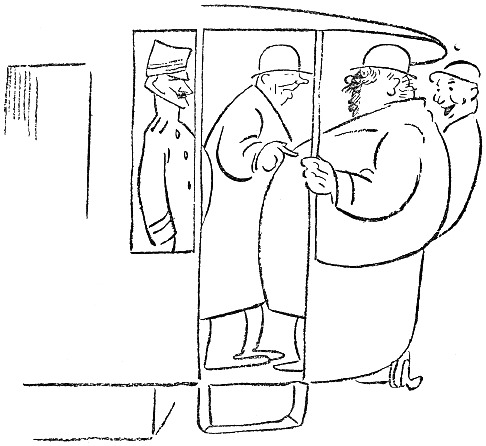

<@pagebreak 86/>

<h2>Bloms Unbekanntschaften.</h2>

Wir standen auf dem Hinterperron einer Elektrischen.
Wir waren fünf Fahrgäste, von denen Blom einer
war, und der sagte plötzlich zu mir:

»Wir alle sind steif und zugeknöpft. Wir können
nicht miteinander sprechen, ohne gegenseitig vorgestellt zu
sein. Da wäre wohl mal eine Reform am Platze.«

<@pagebreak/>
»Sieh mal,« sagte ich, »hier auf dem Perron stehen
drei Menschen. Da ein älterer, fetter Herr, da ein
junges, niedliches Mädchen und da ein Leutnant. Fange
doch ein Gespräch mit ihnen an. Leite Deine Reformarbeit
ein!«

Es leuchtete auf in Bloms Augen. Er wandte den
Blick nach dem älteren, fetten Herrn, sah ihn freundlich
und interessiert an und sagte schließlich in verbindlichem
Ton:

»Sie sind ziemlich fett, mein Herr.«

Ich beobachtete die drei Fahrgäste. Der Leutnant
lächelte, das junge Mädchen sah erschrocken aus, und
der ältere Herr, dem die Sache galt, bekam einen roten
Kopf und erwiderte:

»Was geht das Sie an?«

»Oho,« sagte Blom ebenso freundlich, »das geht mich
wohl etwas an. Eine fette Person ist nicht recht gesund.
Jede Korpulenz ist krankhaft. Das Individuum
hat kein Recht, sich auf irgend eine Weise aus der Gesellschaft
herauszustellen. Sollten Sie durch Ihre Korpulenz
nicht mehr imstande sein, sich zu ernähren, dann
muß ja ich eingreifen. Sie werden der Gesellschaft, —
d.&nbsp;h. mir, — zur Last liegen. Sie sehen also, daß
Ihre Korpulenz mich interessiert. Sie sollten etwas
tun, um sie los zu werden. Essen Sie abends? Trinken
Sie viel?«

Der ältere Herr hatte Mühe zu atmen; und als der
Schaffner aus dem Wagen herauskam, wandte er sich
an diesen und sagte mit angestrengter Stimme:

<@pagebreak/>
»Muß man sich hier auf dem Wagen beleidigen
lassen?«

Der Schaffner sah sich fragend nach uns anderen
um. Er konnte sich nicht besinnen, den älteren Herrn
beleidigt zu haben. Der Schaffner stand seit fünf
Jahren im Dienst der Elektrischen, er hatte alle Sorten
Leute gesehen, und so ließ er sich nicht aus der Fassung
bringen. Da er wußte, daß er den älteren Herrn nicht
beleidigt hatte, verkniff er sich die Antwort, denn er
war klug genug, keinen Streit ohne Ursache anzufangen.

Blom fuhr fort:

»Massage ist in vielen Fällen nützlich. Seifenmassage
mit türkischem Bad verbunden. Baden Sie nie?«

Der Wagen hielt, und der fette Herr stieg ab. Er
ging auf einen Schutzmann zu und sprach in aufgeregtem
Ton. Aber der Wagen rollte weiter.

»Nicht wahr,« sagte Blom und wandte sich an die
junge Dame, »wir haben entzückendes Wetter heute?«

Die junge Dame, die wirklich sehr niedlich war, stierte
geradeaus in die Luft, und der Leutnant lächelte fortwährend.

»Ich muß Ihr Schweigen als Zustimmung deuten,«
fuhr Blom fort. »Gestatten Sie mir gleichzeitig, Ihnen
sagen zu dürfen, daß Ihr kleiner Hut Sie ganz reizend
kleidet. Gerade die richtige Farbe und Form. Sie
haben einen guten Geschmack. Haben Sie ihn selber
ausgesucht?«

Die junge Dame richtete den Blick nach der Decke
des Perrons und las dreizehn Mal hintereinander:

<@pagebreak/>
»*Nichtabsteigen während derFahrtwegen
der damit verbundenen Lebensgefahr.*«

»*Nicht absteigen während der Fahrt wegen
der damit verbundenen Lebensgefahr.*«

»*Nicht absteigen*« …

Blom sah ihr die ganze Zeit in die Augen und
sagte:

»Ich habe Ihnen in meinem ganzen Leben nichts
Böses getan, und doch sind Sie so unfreundlich.
Wäre ich Ihnen auf einem Ball oder einem Diner begegnet,
so hätten Sie vielleicht mit mir geflirtet, wir
hätten uns vielleicht verlobt, wir wären vielleicht …«

Das junge Mädchen wurde feuerrot im Gesicht, sie
drängte sich durch die Fahrgäste und rief:

»Halten Sie Schaffner! Ich will absteigen!«

Sie stieg während der Fahrt ab, und der Leutnant
bot ihr freundlich den Arm. Als er seinen Liebesdienst
erledigt hatte, wandte er sich zu Blom und sagte:

»Sie sind kein Gentleman! Man behandelt eine
Dame nicht so, wie Sie es getan haben!«

Blom strahlte.

»Endlich!« sagte er. »Ausgezeichnet! Sie haben
richtig auf meine Absicht reagiert. Ich hoffe, daß Sie
mir dasselbe gesagt hätten, — das von dem Gentleman,
— auch wenn es hier zu Lande Duelle gäbe.
Dann wäre es übrigens riskant gewesen. So kann
ich weiter nichts zur Sache tun. Am allerwenigsten
kann ich böse werden.«

Der Leutnant antwortete nicht. Er stand in strammer
<@pagebreak/>
Haltung da, bis er einen Schritt zur Seite machte, um
einem Herrn, der einstieg, Platz zu machen.

Es war ein Mann in mittleren Jahren mit einem
frommen und freundlichen Kindergesicht. Er hatte dichtes,
lockiges Haar, und obendrauf saß ein kleiner Hut. Der
Mann blieb zwischen Blom und dem Leutnant stehen.
Der Wagen rollte weiter.

Vor der Kunstakademie unternahm Blom etwas, was
sogar mich überraschte. Er schnappte urplötzlich den
Hut von dem dichten, lockigen Haar des frommen Mannes
weg, sah sich das Haar an, und dann ließ er seine
freie Hand rasch in der wolligen Perrücke verschwinden.
Er wühlte in den Haarmassen herum, hin und her, und
dabei sagte er:

»Was für Haar! Was für Haar! Das ist das
herrlichste, was ich in meinem Leben angefühlt habe!
Was tun Sie, damit es so weich ist? Haben Sie Pomade
drin?«

Der fromme Mann ließ sich von Blom frisieren,
lächelte ganz freundlich und erwiderte ruhig:

»Mein Haar ist immer dicht gewesen. Ich brauche
nichts besonderes dafür, aber manchmal wasche ich es.
Meine Mutter hatte auch sehr dichtes Haar.«

Bloms Hand glitt sachte herab. Er hatte etwas
anderes erwartet. Er wußte nichts zu sagen, aber der
Leutnant sagte anstelle des Frommen:

»Daß Sie dulden, daß ein fremder Mensch Sie auf
diese Weise behandelt!«

»Ach,« antwortete der Mann mit dem frommen Aussehen
<@pagebreak/>
und dem dicken Haar, »ich bin Wärter in einer
*Anstalt für solche Leute gewesen*, ich weiß,
wie die zu nehmen sind, — nur *Milde* und *Geduld*,
— nur *Milde*, es hat keinen Zweck, grob zu sein.«

Blom setzte den kleinen Hut wieder dahin, wo er
ihn hergenommen hatte und sprang während der Fahrt
vom Wagen.

