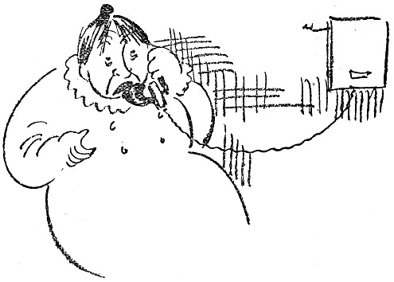
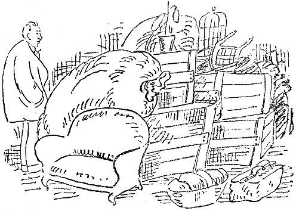

<@pagebreak 92/>

<h2>Dalströms Telephon.</h2>

Am 1. Mai zog ich in eine neue Wohnung. Das
heißt, für mich war sie neu. Dalström, der sie sechs Jahre
lang vor mir bewohnt hat, wird sie wohl kennen. Ich
kam abends nach Hause. Meine Familie war nicht anwesend.
Vermutlich hatte sie sich, müde und matt von
den Strapazen des Umzuges, eine Wohnung im Grand-Hotel
mit Aussicht nach dem Wasser gemietet.

Ich war, wie gesagt, allein. Man weiß, was das
heißt, allein in einer Wohnung zu sein, ohne elektrisches
Licht, zwischen Möbeln und Packkisten.

Ich saß mitten auf dem Fußboden und stierte auf
<@pagebreak/>
eine Wand. An der Wand hing ein Telephon, — Dalströms
Telephon. Das hing noch da wie eine Erinnerung,
und daneben hing der übliche Zettel mit den üblichen
Nummern, die in einer bürgerlichen Familie benutzt
werden: der Kohlenmann, der Milchladen, der Kaufmann,
die Friseurin, die Schneiderin und die Waschanstalt.
Dann stand da: Hilda 3048 und August 4375. Ich dachte
gerade ein bißchen über Hilda nach, als der Apparat plötzlich
klingelte. Ich hob das Mikrophon ab, sagte »Hallo«
und erhielt von einer Männerstimme folgende Mitteilung:

»Du bist ein Aas!«

Ich bin nicht gewöhnt, grob angeredet zu werden.
Eine Frau hat mich einmal, als sie nicht wußte, was
sie tat, einen Schuft genannt, aber das ist ihre Sache.

Ich trat erschrocken einen Schritt vom Telephon zurück
und erwiderte:

»Das muß ein Irrtum sein.«

»Irrtum?« sagte die Stimme, »den Deibel auch!
Irrtum! Den ganzen Tag habe ich hier gesessen und
auf das Geld gewartet, das Du heute früh herschicken
wolltest! Ich hatte mit dem Geld gerechnet, und wenn
ich es nicht bis morgen früh habe, mußt Du für die
Folgen aufkommen!«

Dann klingelte der Mann ab, und ich stand da. Ich
konnte nicht bei ihm anklingeln und ihm sagen, daß er
falsch verbunden gewesen war. Übrigens war er ja eigentlich
nicht falsch verbunden gewesen. Ich ging in die
Küche und drehte den Wasserhahn auf. Das ist merkwürdig
bei mir: sobald ich in eine Küche komme, drehe
<@pagebreak/>
ich den Wasserhahn auf. Dann kann ich dastehen und
das laufende Wasser anstarren, bis ich den Hahn plötzlich
wieder zudrehe und zu mir komme.

Diese Wasserleitung war wie alle anderen. Als das
Wasser zehn Minuten gelaufen war, drehte ich den Hahn
zu. Da klingelte das Telephon. Ich lief hin, um zu
antworten, und tat es auch. Eine fidele Frauenstimme sagte:

»Ich habe eine Kommode in der Wohlfahrtslotterie gewonnen!
Darüber freue ich mich riesig!«

»Ich freue mich auch riesig,« sagte ich. »Ist sie aus
Mahagoni?«

»Nein, aus Nußbaum, was viel feiner ist. Was
machst Du übrigens?«

»Ich? Nichts.«

»Dann komme ich einen Augenblick rauf. Berta ist
wohl nicht zu Hause.«

»Nein, Berta ist nicht zu Hause.«

»Ich komme über die Küchentreppe!«

Abläuten.

Ich dachte: »Wer ist das? Ist sie jung, ist sie niedlich,
soll ich die Küchentür zuschließen?«

Da klingelte es wieder und ein anderes weibliches
Wesen sagte:

»Kannst Du dir denken, er hat gesagt, er ist nicht
der Vater von dem Kind!«

»Er hat gesagt, daß er nicht der Vater von dem Kind
ist?« antwortete ich. »Das weiß doch die ganze Stadt,
daß er es ist!«

»Es genügt, daß ich es weiß,« sagte die Stimme.

<@pagebreak/>
»Tja, Du mußt es ja am besten wissen, »sagte ich, »Du
als seine Mutter!«

»Was redest Du da für Blech? Bin ich die Mutter
von Agdas Kind?«

»Ich meine, daß Du wie eine Mutter gegen das
Kind gewesen bist, — Du mit Deinem guten Herzen,
die niemals —«

»Ich habe die Range nie gesehen. Hat Berta schon
Preißelbeeren gekauft?«

»Ja gestern!«

»Was hat sie gegeben?«

»76 Öre pro Liter, aber sie waren reif, — fast kein
Abgang.«

»Bist Du verückt?! 75 Öre pro Liter! Auf dem
Heumarkt kosten sie 38! Kann ich mal mit Berta
sprechen? Du scheinst wieder getrunken zu haben!«

Bei dieser Beleidigung klingelte ich ab.

In diesem Augenblick kam meine Familie nach Hause.

»Bist Du zu Haus?« fragte meine Frau.

»Nein,« sagte ich, »ich bin ausgegangen,« denn ich
weiß, wie man geistreiche Fragen beantwortet.

»Ist was gewesen?« fragte meine Frau.

»Ja,« sagte ich, »das Telephon.«

Und ich dachte an die Dame mit der Nußbaumkommode,
die die Küchentreppe heraufkommen wollte. Ich beschloß,
nicht zu öffnen.

Da klingelte das Telephon. Meine Frau wollte sich
melden. Ich sagte zu ihr: »Tu’ das nicht! Du kannst
nicht wissen, was Du zu hören bekommst! Dieser Apparat
<@pagebreak/>
enthüllt die unheimlichsten Geheimnisse. Melde
Dich nicht!«

Folglich meldete sie sich. Sie sagte »Hallo«, und
ich sah, wie sie gleich darauf vor Freude aufleuchtete.
Sie senkte den Hörer einen Augenblick, wandte sich zu
mir und sagte:

»Er hat mich Liebling genannt!«

»Laß ihn weiter reden,« sagte ich. »Man kann nicht
wissen, wie das endet!«

Meine Frau horchte eine Weile, dann hängte sie den
Hörer an. Ich sah, daß sie ärgerlich war.

»Was wollte er?« fragte ich.

»Er hat Berta zu mir gesagt und wollte, daß ich
ihn in einer halben Stunde in der Regierungsstraße
erwarten sollte.«

»Gehst Du hin?« fragte ich.

Da klingelte es an der Küchentür.

»Die Dame mit der Kommode,« dachte ich, zog die Weste
glatt und ordnete die Krawatte und ging und
öffnete.

Es war ein Packer von einer Speditionsfirma, der
einen Korkenzieher haben wollte, den er vormittags vergessen
hatte. Er hätte sich sehr beunruhigt, daß er weggekommen
sein könnte. Als ich wieder ins Zimmer kam,
stand unser Dienstmädchen am Telephon und ich hörte
folgendes Gespräch:

»Zum Piepen! Och! Warum ooch? Det jlobe ick!
Jott wie schade! Och! Nich in de Hand! Wat meenen
Se? Ick heeße Amalje!«
<@pagebreak/>

Da ging ich hin, nahm Amalie den Hörer ab, hängte
ihn an, klingelte beim Amt an, ließ mich mit der Aufsicht
verbinden und verlangte die sofortige Sperrung des
Apparates.

Die Dame mit der Kommode kam bald darauf. Ich
öffnete, und als sie mich sah, errötete sie schüchtern,
und als sie meine Frau sah, sagte sie, daß sie sich geirrt
hätte.

Und das hatte sie ja auch.

