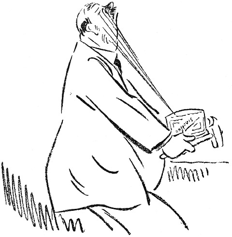

<@pagebreak 98/>

<h2>Die Anchovisbüchse.</h2>

»Diese Anchovis hier taugen nichts.«

»Das ist die beste Marke«, wandte Frau Blom sanftmütig
ein.

»Die beste Marke! Wie oft soll ich Dir sagen, daß
die Marke oder die Firma bei Anchovis absolut nichts
<@pagebreak/>
zu bedeuten hat! Sämtliche Anchovis sind, wenn sie
eingelegt werden, ganz gleich, — ganz gleich. Danach
kommt es darauf an, ob sie gegoren sind. Diese hier
sind nicht gegoren. Die taugen nichts.«

»Es ist schon am besten, daß Du Dir Deine Anchovis
selber kaufst, dann bekommst Du sie, wie Du sie haben
willst.

»Ja«, sagte Herr Blom, »es ist vielleicht, am besten,
daß ich alles kaufe. Den Kalbsbraten, die Erbsen, den
Speck und das Bier und den ganzen übrigen Kram.
Ich habe ja weiter nichts zu tun. Soll ich nicht auch
nach den Kindern sehen und mit dem Stubenmädchen
spazieren gehen?«

»Warum mußt Du denn mit dem Stubenmädchen
spazieren gehen?«

»Du darfst Dich nicht an einzelne Worte klammern.
Ich werde Anchovis kaufen.«

Herr Blom kaufte eine Büchse Anchovis. Die war
so gegoren, daß der Deckel sich bog. Das war die
richtige Sorte. Er konnte Anchovis kaufen. Voll Stolz
trug er sie nach Hause; der erwartete Triumph beschleunigte
seine Schritte.

»Hier siehst Du Anchovis, wie sie sein sollen. Ich
werde die Büchse selber aufmachen.«

Herr Blom ging nach der Küche. Die ganze Familie
stand um ihn herum. Niemand wagte zu sprechen.

»Was haben die Kinder hier zu suchen?« fragte
Herr Blom und sah sich um. »Habe ich nicht gesagt,
Ihr sollt nicht in der Küche sein? Warum gehorcht Ihr
<@pagebreak/>
nicht? Eure Mutter verzieht Euch wohl?! Macht die
Tür zu! Gebt den Büchsenöffner her!«

»Was?!«

»Den Büch-sen-öff-ner! Wissen Sie nicht, was das
ist, Amanda? Denken Sie, daß man Konservenbüchsen
mit Haarnadeln oder Feuerhaken oder alten Linealen
aufmacht?! Ja?«

»Wir machen sie immer mit so einem kleinen Dings
auf, das an der Büchse ist.«

»Es ist kein »Dings« an dieser Büchse, meine verehrteste
Amanda. Diese Büchse muß mit einem Büchsenöffner
aufgemacht werden. Es muß einer im Hause
sein! Er stand auf der Ausstattungsrechnung, als wir
uns verheirateten! Ich sehe es heute noch: An …
Ein Büchsenöffner … Kr. 1,50 stand da. Wer hat
eben geklingelt? Geht und macht auf! Ich bin nicht
zu sprechen. Laß doch Amanda gehen, warum mußt
Du denn rennen? Steh nicht da und guck durch die
Türritze! Wer war es?«

»Es war der elektrische Arbeiter …«

»Der elektrische Arbeiter! Was meinen Sie damit?
Ist der Kerl elektrisch?«

»Es war der Elektrizitätsarbeiter …«

»Hahaha, — elektrischer Arbeiter! Vorsicht, nicht berühren,
nicht wahr? Hahaha! Wo ist also der Büchsenöffner?«

»Hier ist er! Ich habe ihn eben gefunden!«

»Du hast ihn gefunden?! Diesen Büchsenöffner?!
Das ist nicht unserer! Den kenne ich nicht!«

<@pagebreak/>

»Du hast ihn Dir damals wohl nicht so genau angesehen.«

»So? Ich habe ihn mir nicht angesehen?! Was ich
einmal gesehen habe, erkenne ich auch wieder.«

»Na also, — ich bin zum Kapitän nebenan gegangen
und habe mir diesen geborgt, damit es keinen Zank gibt.«

»Du borgst Dir Hausgerät? Damit es keinen Zank
gibt?! Anderer Leute Büchsenöffner!! Wer weiß, wozu
der schon gebraucht worden ist!!«

Herr Blom verschwindet mit dem Apparat und kehrt
nach einer Weile wieder.

»Ich habe ihn mit Sublimat abgewaschen. Das wird
wohl etwas nützen. Gib mir ein Tuch, — nein, —
ein trockenes! Na also!«

Herr Blom stemmt den Öffner gegen den Deckel. Der
gibt nicht nach.

Frau Blom vorsichtig:

»Man klopft erst ein kleines Loch. Nimm den
Hammer.«

»Das kann man auch. Gib den Hammer her.«

Herr Blom klopft mit dem Hammer auf den Öffner.
Der Deckel bekommt ein Loch, und ein Strahl salziger
Lake spritzt Herrn Blom gerade in das rechte Auge.
Er läßt die ganze Geschichte fallen und tanzt umher:

»Ogottogottogott: Himmerherrgot! Au-u-u-uh!«

Er zieht sich nach dem Schlafzimmer zurück, und die
Damen beenden den Akt.

Als ihm ein bißchen wohler geworden ist, öffnet Frau
Blom leise die Tür und sagt:

<@pagebreak/>

»Bernhardchen, es waren *Heringe in Gabelbissen*
die Du gekauft hast!«

Bernhardchen stiert mit rotgeschwollenen Augen geradeaus
in die Luft. Dann macht er die Augen zu
und sieht sich in Gedanken die Straße entlang und in
das Delikatessengeschäft stürmen und über den Ladentisch,
gerade auf den nachlässigen Kommis springen,
den er mit einem einzigen Schlag zermalmt.

Laut aber sagt er zu seiner Frau:

»Hering in Gabelbissen, ist das etwa schlecht? Das
schmeckt ausgezeichnet, — mit Pellkartoffeln!«

Blom ist eben ein Mann!

