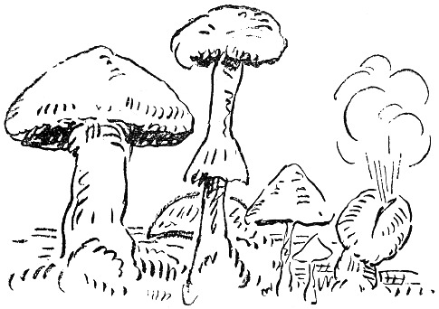

<@pagebreak 103/>

<h2>Pilze.</h2>

Jetzt sind wir in der Pilzzeit. Nun müssen sie gesammelt
und eingemacht und auf Regale gestellt werden,
so daß man etwas hat, was man sich im Winter über ißt.

Als meine Frau Stachelbeer- und Himbeer- und
Johannisbeer- und Wachholderbeer- und Hagebutten- und
Brombeer- und Faulkirschen- und Ebereschenbeer- und
gemischtes Himbeerundblaubeerundpreißelbeergelee
eingemacht hatte, sagte sie:

»Jetzt muß ich aber wirklich mit dem Einmachen anfangen!«

<@pagebreak/>
Ich ging auf die Veranda und sah mir die Natur
an. Es war eine schöne Natur, und mittendrin ging
Janssons Kuh und graste ein bißchen Natur hier und
ein bißchen Natur da. Einen Teil lieferte sie gütigst
zurück, ein anderer Teil verschwand völlig.

Ich rief meine Frau. Sie kam sofort, denn sie dachte,
Leutnant Lindgren ritte gerade vorbei.

»Da geht Janssons Kuh«, sagte ich. »Es ist keiner
hier, der uns sieht. Wir wollen sie für den Winter einmachen.
Eingemachte Kuh, — das ist gut, wenn die
Zeiten knapp werden sollten.«

Meine Frau schleuderte mir denselben Blick zu, den
Cleopatra dem Sokrates zuwarf, ehe sie ihm den
Giftbecher reichte, und ging hinein und schrieb ein Rezept
über das Einmachen von rohgeschälten Gurken ohne
Kerne ab.

Ich dagegen ging hinaus. Auf der Dampferbrücke
saßen die Damen, und eine sagte:

»Ich habe gestern sechzehn Liter gepflückt, liebe Amelie.
August ißt am liebsten Schafpilze. Die werden in Butter
mit etwas Meerrettig geschwenkt. Butterpilze sind delikat.«

»Denken Sie sich, die Frau Doktor hat am Sonnabend
achtzehn Liter Pfefferlinge bekommen.«

»Sagte sie. Ich habe den Korb gesehen. Da haben
armselige drei Stück drin gelegen und nach einander geschielt.
Nein, Du, ich kenne die *Stellen*.«

»Die Majorin war gestern oben im Hag. Sie hat
einen Fliegenpilz mit nach Hause gebracht, und ihr Mann
mußte sich den ganzen Abend einschließen.«

<@pagebreak/>
Am nächsten Tage ging ich hin und pflückte Pilze.
Meine Frau kam mit, und wir trugen einen Waschkorb
zwischen uns.

Unterwegs begegneten wir der Frau Rendantin:

»Holden die Herrschaften Ihre Wäsche selber?« sagte
sie und lächelte süßlich-maliziös.

»Nein«, sagte ich, »wir pflücken Pilze. Ich habe
gestern eine Stelle im kleinen Hag gesehen. Wir haben
eben einen Waschkorb voll nach Hause getragen, und
jetzt wollen wir noch einen Korb holen.«

»Ach du meine Güte«, sagte die Frau Rendantin und
schlich zum Pächter und schenkte seinem Olof drei Kronen
und einen Apfel, den sie im Garten stiebitzt hatte, damit
er sich uns nachschleichen und nachsehen sollte, wo
wir blieben.

Und wir sammelten Pilze und Holz. Ich pflückte
Fliegenpilze und Rauchpilze und Karl-Johannspilze und
Pfefferlinge und noch mehr Fliegenpilze und Schieflinge
und Trieflinge und alles, was ich nur finden
konnte, und dann trugen wir alles nach Hause, und
dann sonderte ich die giftigen Pilze aus, und dann
legte ich sie in ein Körbchen und ging in die Küche
von Svensson. Da stand Svenssons Dienstmädchen,
das vor Dummheit beinahe schielt.

»Hier sind ein paar Pilze«, sagte ich. »Das sind
ausgesucht feine Pilze. Kochen Sie sie zu Mittag und
bestellen Sie der Herrschaft einen Gruß von mir. Das
ist eine kleine Überraschung.«

»Danke schön«, sagte Svenssons Mädchen und knixte
<@pagebreak/>
und warf das eine Auge durch das Fenster um die
Ecke herum und nach der See, wo ihr Schatz saß und
mit Olssons Boot in Perssons Fischwasser wilderte.

Die Familie Svensson wurde nachmittags zu Bett
gebracht; es geht ihr jetzt wieder besser.

Ich ging fort, um mehr Pilze zu sammeln. Als ich
aber nach dem Hag kam, standen Frau Hansson und
Frau Persson und Frau Jonsson und Frau Lönnblad
und Frau Höglund da, alle miteinander gebückt, die
Locken vornüber, und pflückten Pilze aus Leibeskräften.
Ich kam von hinten angeschlichen.

»Bitte bleiben Sie stehen, Frau Hansson«, sagte ich,
»ganz ruhig!«

Frau Hansson blieb unbeweglich stehen, denn sie
glaubte, daß sich an ihrem rechten Bein gerade eine
Kreuzotter hochschlängelte.

Ich nahm einen Anlauf, einen tüchtigen Anlauf, und
sprang über Frau Hansson Bock. Sie stand ausgezeichnet.
Dann rannte ich weiter.

»Bitte bleiben Sie stehen, Frau Persson«, rief ich.

Frau Persson blieb unbeweglich stehen, denn sie glaubte,
daß ihr eine Wespe unter das Korsett kriechen wollte.
Dann nahm ich einen Anlauf und sprang über Frau
Persson. Sie stand auch gut.

Darauf sprang ich über Frau Jonsson und Frau
Nilsson und Frau Lönnblad und Frau Höglund. Frau
Höglund stand nicht ganz so gut, — sie sackte in den
Kniekehlen, — sie ist 65 Jahr alt, — aber über sie
weg kam ich doch.

<@pagebreak/>
Ich war ein bißchen müde, aber ich konnte doch nach
Hause gehen und das Notwendigste packen, um mit dem
nächsten Dampfer nach der Stadt zu ziehen.

Es fängt nämlich jetzt abends an, etwas kühl zu
werden. Sonst ist der Sommer herrlich gewesen, gerade
richtig warm und gerade richtig windig.

Aber ich mache mir weiter nichts aus Wind.

