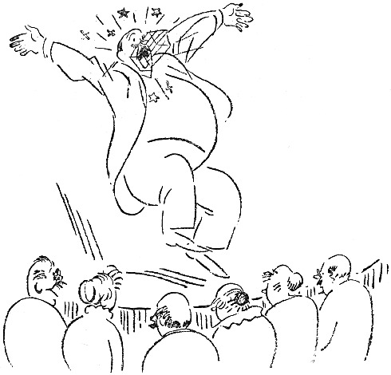

<@pagebreak 108/>

<h2>Rosenlunds Zaubervorstellung.</h2>

Wir verkehren mit Rosenlunds, — nicht etwa, daß
ich damit prahlen will. Wir gehen zu ihren Gesellschaften,
weil man ja irgend wohin gehen muß. Dabei
pflege ich Rosenlund sein Geld abzugewinnen, wenigstens
das, was er zu Hause hat. Dann vergeht eine Zeit, ehe
wir wieder hingehen. Schon auf der Treppe höre ich Amalie
— Rosenlunds Gattin ziert dieser Name — wimmern:

<@pagebreak/>
»Aber Adolf! Wie kannst Du Dich so benehmen!
Dasitzen und alles verspielen, was Du hast, — und
noch dazu an so einen! Wo soll denn das hin? Aber
Adolf!«

Dann pflegt Adolf zu antworten:

»Hätte er nur nicht gerade diese Karten gehabt!
Hätte ich bloß das As gehabt! Dann hätte ich ihn
reingelegt! Hätte ich geahnt, daß die Kreuz acht da
steckte!«

Einmal machte ich dann die Entréetür auf, steckte ein
Einkronenstück dazwischen und sagte:

»Gerade oder ungerade, auf die Jahreszahl, Adolfchen!«

Beinahe hätte er mir die Finger abgeklemmt!

Da sagte meine Frau eines Tages zu Rosenlunds Frau:

»Sage mal, Amalie, könnten wir denn nicht ohne
das gräßliche Kartenklopfen zusammenkommen?«

»Aber, liebes Susannchen«, sagte Amalie, »die Herren
amüsieren sich doch so sehr dabei …«

»Ja, aber wir haben doch auch etwas zu sagen?!«
»Natürlich«, sagte Amalie.

In der nächsten Woche wurden wir zu Rosenlunds
eingeladen. Rosenlund klingelte an und tat geheimnisvoll.

»Wir haben am Mittwoch eine kleine Gesellschaft.
Nur ein einfaches Butterbrot …«

»Ich kenne Eure einfachen Butterbrote«, sagte ich,
»ich kenne sie tagelang«.

»Ihr kommt doch«, sagte Rosenlund, »nur Ihr seid
da und Carlssons und Fräulein Halldin …«

<@pagebreak/>
»Dann komme *ich*!«

»Und Fredrikssons und der junge Blomdahl …«

»Dann kommt *meine Frau* …«

»Und dann noch ein paar Leute. Ihr werdet etwas
zu sehen bekommen, was Ihr noch nie gesehen habt.«

»Hast Du etwa die Absicht, guten Whisky kommen
zu lassen?« sagte ich.

»Ich *werde eine Zaubervorstellung geben*!«

»Dann dürfen wohl die Kinder mitkommen? Sowas
macht ihnen Spaß.«

»Nein, keine Kinder. Es wird eine Seance in der
höheren Magie.«

»Danke sehr«, sagte ich, »wir werden kommen, lege
den Punsch und Fräulein Halldin auf Eis!«

Wir kamen. Es war wie immer bei Rosenlunds.
Die Frau des Hauses begrüßte im Salon. Sie trug
ein neues Kleid. Meine Frau sagte gleich, daß sie
früh nach Hause gehen müßte.

Carlssons waren vor uns da. Frau Carlsson hatte
einen neuen Stiftzahn in der oberen Perlenreihe. Ich
habe es gesehen. Aber ich habe nichts gesagt. Man
ist ja diskret.

Fräulein Halldin kam gleich darauf. Sie war süß.
Ich sagte ihr das. Sie lächelte. Meine Frau wiederholte,
daß sie früh nach Hause gehen würde.

Dann kam der junge Blomdahl. Er trug einen
Stehumlegekragen zum Smoking und hatte vorher eine
Stunde im Café gesessen. *Den* Duft merkte man schon
auf zwei Meter.

<@pagebreak/>
Rosenlund war in unruhiger und gemacht guter
Laune. Er rannte hin und her durch alle Türen, und
seine Frau sagte:

»Aber Adolf, was ist Dir denn?«

Und Rosenlund antwortete — mit den Augen:

»Schweig, Weib! Wenn ich nur wüßte, wo ich das
Coeur-As hingelegt habe, das ich für das Kartenkunststück
haben muß.«

Allmählich kamen wir ins Wohnzimmer. Da herrschte
eine gewisse Dämmerung. Rosenlund sagte, daß das
des magischen Effekts wegen notwendig sei.

»Hahaha«, sagte Carlsson.

Niemand weiß, warum Carlsson so oft, ohne jeden
Grund »hahaha« sagt. Wie soll das enden?

Rosenlund hatte Sitzplätze angeordnet, genau so wie
im Parkett. Fräulein Halldin saß neben mir. Wir
sprachen über schwedische Literatur, — Fräulein Halldin
hat ein Abonnement im Lesezirkel, — als Rosenlund
mit einer kleinen Glocke läutete.

»Geh und mach auf, Ernst«, sagte Frau Carlsson.

»Hahaha«, sagte Carlsson wieder.

»Meine Damen und Herren«, begann Rosenlund.
»Ich will Ihnen jetzt ein paar kleine Zauberkunststücke
zeigen. Natürlich kann kein Mensch zaubern, das heißt, —
hm, — ich meine, — es gibt nichts Übernatürliches.
Ich will Ihnen also zuerst ein paar kleine Kartenkunststücke
vormachen. Sie sehen hier ein gewöhnliches
Spiel Karten.«

»Darf ich es mal sehen?« fragte ich.

<@pagebreak/>
»Hier siehst Du es ja. Ich habe es ja hier.«

»Darf ich es vielleicht mischen?« fragte ich.

»Ich mische selber«, sagte Rosenlund.

»Hahaha«, sagte Carlsson.

Dann sollte ich eine Karte ziehen. Frau Carlsson
wollte nicht. Sie ist so schüchtern. Ich zog Coeur-Acht.
Ich legte sie schnell zurück und zog eine neue
Karte. Das war auch Coeur-Acht! Das ganze Spiel
bestand aus Coeur-Achten. Rosenlund mischte, machte
die Augen zu und dachte nach. Dann sagte er:

»Du hast Coeur-Acht gezogen!«

»Nein«, antwortete ich, »es war Piquebube«.

»Es war Coeur-Acht«, sagte Rosenlund.

»Piquebube!« sagte ich. »Darf ich noch einmal ziehen?«

»Nein, jetzt werde ich ein anderes Kunststück zeigen,
das noch nie ausgeführt worden ist«, sagte Rosenlund.
»Das ist der verschwindende Vogelbauer. Einen Augenblick,
bitte!«

Rosenlund rannte in ein anderes Zimmer. Nach
einer Weile hörten wir ihn rufen:

»Amalie, komm doch mal her!«

Amalie ging zu ihm hinein, und nachdem sie sich
eine Weile gezankt hatten, kam Rosenlund wieder heraus.
Er sah angestrengt aus und hielt einen Vogelbauer
vor dem Bauch. Er stellte sich vor uns hin,
stierte in die Luft und schrie aus Leibeskräften:

»*Geh*!«

Er wollte, daß der Bauer verschwinden sollte, ohne
daß man sah, wo er geblieben war. Es tut mir leid,
<@pagebreak/>
sagen zu müssen, daß das Kunststück völlig mißlang.
Der Bauer sollte zusammenklappen und in den Ärmel
hinaufrutschen, als Rosenlund »geh«! schrie und die
Arme ausstreckte. Der Bauer faltete sich aber zusammen
wie ein alter Regenschirm, schlug Rosenlund auf die
Nase und verfing sich in der Manschette.

Rosenlund schrie nach Handtüchern und Bleiwasser,
und Frau Rosenlund rang die Hände und rief:

»Hätten sie bloß Karten gespielt!«

Der junge Blomdahl sagte:

»Das ist ganz entsetzlich«, und Carlsson erwiderte:

»Hahaha, — famoses Kunststück, — hahaha!«

Allmählich beruhigte sich Rosenlund. Er lächelte fast
und sagte:

»Meine Herrschaften! Auch dem Geschicktesten kann
etwas danebengelingen. Ich werde das Kunststück ein
andermal wiederholen. Aber jetzt werde ich Ihnen
mein größtes Kunststück zeigen. Ich muß das elektrische
Licht einen Augenblick ausdrehen!«

»*Jaaa* nicht!« sagte Fräulein Halldin.

»Ausdrehen!« rief ich. Rosenlund drehte aus. Als
das Licht wieder eingeschaltet wurde, sah Carlsson
Fräulein Halldin an und sagte:

»Hahaha!«

Carlsson ist immer ein frecher Lümmel gewesen.

Rosenlund hielt ein Tuch in die Höhe. Es war leer.

»Hokus, Pokus!« sagte Rosenlund und holte eine
Schüssel mit Wasser unter dem Tuch hervor.

Wir klatschten wahnsinnig.

<@pagebreak/>
»Abwarten, es kommt noch mehr«, sagte Rosenlund.

»Hokus, Pokus!« Und er holte noch eine Schüssel
mit Wasser hervor, noch größer als die erste. Rosenlund
sah riesig vergnügt aus. Aber gerade, als er die
Schüssel auf den Tisch stellen wollte, entglitt sie ihm,
und er ließ alles miteinander, das Wasser und die ganze
übrige Geschichte, in den Schoß meiner Frau fallen.
Gerade bei ihr hätte ihm das nicht passieren dürfen. — —

Ich erinnere mich an nichts von dem, was später
geschah. Aber ich weiß, daß wir in einer geschlossenen
Droschke nach Hause fuhren. Das heißt, ich saß neben
dem Kutscher auf dem Bock. Frauen, die im Wasser
gelegen haben, sind nie mein Fall gewesen. Aber ich
war dennoch so freundlich, eine Fahrt um den Tiergarten
herum vorzuschlagen, ganz außen herum, damit
sie trocknen könnte.

In der darauffolgenden Woche spielten wir bei Rosenlunds
wieder Karten.
