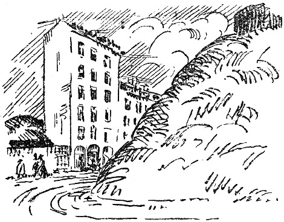

<@pagebreak 115/>

<h2>Die Mietskaserne.</h2>

Heute ist Sonntag und ein sehr schöner Tag. Gestern
sind wir in die Wohnung gezogen, und heute sind wir
froh wie über einen Schatz. Die Sonne brennt durch
die Fenster, ein hellblauer Himmel wölbt sich über der
großen Ebene, an deren Rand ich gerade noch eine
blaue Bucht sehen kann.

Ich höre die Trommel in der Nähe einer Kaserne,
und auf der Straße weint ein Kind, wahrscheinlich nur,
weil so schönes Wetter ist.

<@pagebreak/>
Unsere Zimmer sind renoviert, und wir haben die
Tapeten bekommen, die wir haben wollten. Die Kindermöbel
sind ganz neu, aber sie können das Anfassen
vertragen.

Ich schalte die elektrischen Kontakte ein: das Licht
brennt, und ich drehe den Wasserhahn im Badezimmer
auf: das Wasser läuft. Alles ist, wie es sein soll. Ich
fühle ein Bedürfnis auszugehen und eine schöne Blume
zu kaufen. Aber die Läden sind ja geschlossen.

Ich öffne das Fenster nach der Straße, und plötzlich
werden wir ganz still; wir hören die Töne des ältesten
und schnarrendsten Grammophons der Welt.

»Das ist nicht hier im Hause«, sagte meine Frau.

»Das ist gleich«, erwidere ich, »ich höre es doch aber!«

Ich verabscheue Grammophone. Warum werden sie
nicht verboten?!

»Mach doch das Fenster zu!«

»Ich höre es trotzdem, wenn ich es einmal gehört
habe.«

x-r-s-t-p-r-s-t-ü-s-t-q-t — haben Sie —
x-p-t-gesehen-r-s-g-z-Carlsson-h-t-ppuh—

Ich gehe aus, aber ich kaufe keine Blume. All
Blumengeschäfte haben auf.

* * *

Heute ist die Klingelleitung entzwei. Man kann nicht
klingeln. Wir heften einen Zettel an die Tür: Klopfen!
Es ist uns immerzu, als wenn es klopft, und wir gehen
immerzu und machen auf. Keiner da!

<@pagebreak/>
Ich telephoniere an den Wirt:

»Es muß jemand kommen und die Klingel nachsehen!«

An diesem Tage kommt niemand, aber mein Freund
T., der aus dem Ausland gekommen ist, sucht mich auf
und klopft. Niemand hört ihn. Er geht wieder fort
und fährt ins Ausland, und ich sehe ihn nie wieder.

Am dritten Tage kommt ein Mann und sieht sich
die Klingelleitung an. Als er sie sich angesehen hat,
geht er fort. Er kommt nicht wieder. Ich überlege,
ob ich mir das Buch der Erfindungen in einem Antiquariat
kaufen soll, um mich über die Anlage und die
Reparatur von elektrischen Klingelleitungen zu belehren.

Meine Frau klingelt beim Wirt an. Er ist verreist.

* * *

Heute hat das elektrische Licht versagt.

»Haha«, sagte ich, denn ich habe Reservepfropfen, die
an etwas, das an der Wand im Vorderkorridor sitzt,
festgeschraubt werden.

Meine Pfropfen paßten nicht. Eine Petroleumlampe
hatten wir nicht.

Wir essen im Restaurant zu Mittag und gehen dann
nach Haus, um, jeder für sich dazusitzen und im Dunklen
zu brüten.

Eine Familie zieht unter uns ein, und das Grammophon
spielt im Nebenhaus. Die Klingelleitung ist kaputt.

Es ist zwei Uhr nachts. Ich werde wach. Ich höre
Gesang. Ich wecke meine Frau.

Der Gesang kommt von der Straße. Wir lugen
<@pagebreak/>
hinaus. Draußen stehen zwölf Herren und singen
»Schlaf in Ruh«.

Ich bin gerührt und sage:

»Das gilt mir: Man ist endlich dahintergekommen,
daß ich eine Huldigung verdiene!«

Nachdem der Gesang 45 Minuten gedauert hat, öffne
ich das Fenster und werfe eine faule Pflaume nach
dem ersten Tenor. Die Pflaume trifft ihn auf die Nase,
und er fährt fort zu singen.

Dann gehe ich wieder zu Bett. Einen Tenor kann
man nicht zum Stoppen bringen.

* * *

Am nächsten Morgen kommt der Herr, der unter uns
eingezogen ist, und bittet uns, die Brause nicht zu benutzen.
Das Wasser läuft in seinen Salon.

Wir telephonieren an den Wirt und bitten ihn, uns
einen kombinierten Brause- und Klingelleitungsreparatör
zu schicken. Er verspricht, es sofort zu tun.

* * *

Heute hat die Frau des Mannes, der unter uns
wohnt, angefangen, Klavier zu spielen. Sie hat zwei Stunden
gespielt. Dann hat eine andere mitangepackt, und sie
selber hat dazu gesungen. Es war ein altes Kuplet:

»Willst Du mi—ar gehören?«

»»O naaiin, o naaiin!««

Wir zogen uns an und gingen ins Café. Da ist
die Musik besser.

<@pagebreak/>
Wir kamen ziemlich früh nach Haus. Der Gesang
dauerte immer noch an.

Da klingelte ich bei der nächsten Unfallstation an:

»Es ist jemand in der Frideborgstraße 62III zu
Schaden gekommen. Kommen Sie sofort! Nehmen Sie
den Verbandkasten mit! Sie hören am Geschrei, wo
es ist!«

Es kam einer. Der Gesang hörte auf. Es klopfte
an unserer Tür. Wir weigerten uns aufzumachen.

* * *

Mein Ansehen ist im ganzen Hause ruiniert, im
ganzen Viertel. Ich ziehe zum nächsten Ersten.

Und das ist so gekommen:

Ich erwache mitten in der Nacht und höre eine
Stimme, die sagt:

»Du hast meine Mutter nie geliebt!«

Ich glaube, daß ich träume, aber da stecke ich die
Stearinkerze an und merke, daß ich wach bin. Eine
zweite Stimme antwortet:

»Doch, — von weitem.«

Das ist eine Männerstimme. Der Mann unter uns.

Das Gespräch geht weiter:

»Du haßt alle meine Verwandten!«

»Jawohl!«

»Das habe ich mir gleich gedacht! Dann ist es am
besten, daß wir uns scheiden lassen!«

»Gern, wenn Du mich nicht in Ruhe schlafen lassen
kannst!«

<@pagebreak/>
Ich wecke meine Frau, und dann hecken wir einen
Plan aus, um sie zur Ruhe zu bringen und ihnen
gleichzeitig Angst zu machen.

Ich sage mit lauter Stimme:

»So, jetzt bist Du nach Hause gekommen! Hast Du
was ergattert?«

Da unten schweigen sie, und ich höre beinahe, wie sie
aufhorchen. Meine Frau antwortet in tiefem Baß:

»Das war ein feiner Einbruch! Fünfhundert Taler
und ein paar Eßwaren!«

»Ist kein Blauer gekommen?«

»Diesmal stand einer Schmiere, und dann haben
wir mit der Bolzenschere Nummer 3 gearbeitet. Die
arbeitet lautlos.«

»Fein! Morgen versuchen wir unsern großen Coup!

»Welchen?«

Ich flüstere heiser, aber laut:

»*Die Privatbank*! Aber sprich nicht so laut. Die
da unten können uns hören. Wir hören ja auch alles,
was sie sagen.«

Es wird ganz still im Hause. Wir gehen wieder
zu Bett und schlafen mit glücklichem Lächeln ein.

* * *

Eines Tages begegnete ich der Frau unter uns auf
der Straße. Sie schrie auf und rannte in den Torweg.

Die Mädchen flüstern, als ich komme:

»Man kann es ihm gar nicht ansehen! Die arme
Frau!«

<@pagebreak/>
Mir ist aufgefallen, daß der Schutzmann des Viertels
seine Runde geändert hat. Er patrouilliert jetzt die
ganze Nacht vor unserem Hause auf und ab. Das ist
beruhigend für mich, wenn ich spät nach Hause komme.

Der Mann unter uns hat gestern einen Schlosser
kommen lassen. Der hat ein neues Schloß in die Tür
eingesetzt.

* * *

Mir liegt nichts daran, daß die Klingelleitung repariert
wird, — wir haben von nächster Woche an
eine andere Wohnung gemietet.

