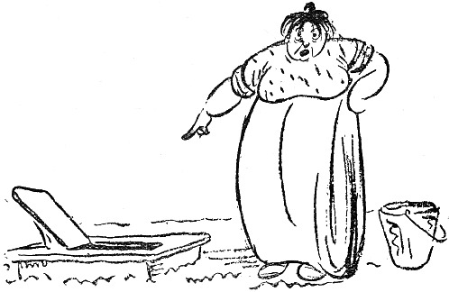

<@pagebreak 122/>

<h2>Der Brunnen.</h2>

Meine Frau hatte eine Wasserkaraffe in den Brunnen
fallen lassen, der zu unserer Sommerwohnung gehört.
Die Karaffe war untergegangen, und meine Frau kam
und sagte:

»Ich habe die Karaffe in den Brunnen fallen lassen!
Ich bin ganz unglücklich.«

Ich wurde gleich sehr böse, denn die Karaffe hatte
50 Öre gekostet, und ein Mann soll immer auf Ordnung
halten.

»Hast Du je gesehen, daß ich eine Karaffe habe fallen
lassen? Oder etwas anderes??? Nein!!! Ich verliere
<@pagebreak/>
nie etwas! Aber jetzt gehe ich und hole die Karaffe
wieder heraus.«

Ich ging nach dem Brunnen. Ich nahm eine lange
Stange und steckte sie in den Brunnen. Die erreichte
den Boden nicht. Ich holte noch eine Stange und
band sie an die andere Stange.

Ich rührte in dem Brunnen herum, bis das Wasser
ein dicker Lehmbrei geworden war. Dann ging ich auf
die Veranda und ruhte mich aus.

Da kam das Mädchen des Majors, der nebenan
wohnt, an den Brunnen:

»Warum sieht denn das Wasser wie Lehmbrei aus?«
sagte das Mädchen des Majors, der nebenan wohnt.

»Weil meine Frau eine Karaffe hat in den Brunnen
fallen lassen,« erwiderte ich.

Das Mädchen des Majors rannte nach Hause und
schrie den Major an:

»Jetzt haben sie Karaffen in den Brunnen geschmissen,
so daß das Wasser wie Lehmbrei aussieht!«

Der Major ging auf den Hof hinaus und schrie seine
ganze Familie an:

»Niemand darf Wasser aus dem Brunnen trinken!
Die Frau von dem Zeitungsschreiber hat das Wasser
vergiftet!«

Da zog ich meinen weißen Anzug an, nahm einen
Eimer in die Hand und schöpfte das ganze Wasser aus
dem Brunnen. Der Brunnen war 10 Meter tief und
faßte 200 Eimer.

Ich goß das ganze Wasser über das Erdbeerbeet des
<@pagebreak/>
Majors und stahl dann eine Leiter aus der Villa des
Konsuls.

Ich kletterte dann in den Brunnen und holte die
Karaffe heraus. Ich holte auch ein Beil, zwei Strumpfbänder,
einen Fuchsschwanz, einen Kuhschwanz, eine
Haarflechte, ein Korsett und eine Mundharmonika heraus.
Ich legte alles in den Eimer und ging auf die Veranda,
um mich auszuruhen.

Nach einer Weile kam das Mädchen des Majors,
der nebenan wohnt, nach dem Brunnen. Sie warf
einen Eimer in den Brunnen und zog den Eimer herauf.
Er war leer.

»Ach, Du mein Gott und Schöpfer,« sagte das Mädchen
des Majors, der nebenan wohnt, »warum ist denn kein
Wasser in dem Brunnen??!!«

»Weil ich die Karaffe, die meine Frau hat fallen
lassen, heraufgeholt habe,« rief ich.

Da rannte das Mädchen des Majors nach Hause
und schrie den Major an:

»Jetzt haben sie die Karaffe herausgeholt, so daß
das Wasser alle ist, und nun steht man da!«

Da ging der Major auf den Hof hinaus und schrie
seiner ganzen Familie zu:

»Nun kann keiner mehr Wasser aus dem Brunnen
holen, denn der Zeitungsschreiber hat das ganze Wasser
ausgeschöpft!«

Worauf der Major bei der Wege- und Wasserbau-Kommission,
bei der Ortspolizei und bei dem Landrat
des Kreises anklingelte.

<@pagebreak/>
Wir haben aber immer noch kein Wasser in dem
Brunnen. Das Mädchen des Majors hat gekündigt,
und der Major hat beim Reichsgericht und bei Seiner
Exzellenz dem Staatsminister angeklingelt.

Ich selber nehme die Sache ziemlich ruhig hin, denn
ich trinke Selterwasser, das ja sehr wohlschmeckend
ist, besonders, da man es ja nicht gut ungemischt trinken
kann.

