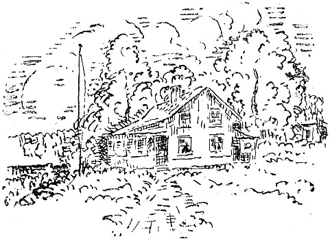

<@pagebreak 135/>

<h2>Das Landhaus.</h2>

Jonathan wohnte an der Peripherie der Stadt. Er
rannte die Treppen hinauf, an der Tür des Auditeurs,
eine Treppe, vorbei, an der des Majors, zwei Treppen,
des Obersten, drei Treppen, und dann war er an seiner
eigenen. Auf dem neuen Messingschild stand:

Jonathan Bonell.

Bonell drückte auf den Klingelknopf und horchte.
Seine junge Frau kam und machte auf. Jonathan umarmte
sie nicht und sagte auch nicht: »Guten Abend,
<@pagebreak/>
Liebling, hast Du lange gewartet, mein Teuerstes auf
Erden usw., wie es in Romanen vorkommt. Herr
Bonell sah wohl, daß seine Frau niedlich war. Aber
man hätte ihn mit glühenden Zangen kneifen müssen,
um ihn zu bewegen, seine Gedanken über das, was er
in dieser Hinsicht sah, zu äußern. Er liebte seine Frau,
aber er hatte es, weiß Gott, nie verraten. Damit hätte
er an Würde eingebüßt.

Jonathan hängte seinen Überzieher im Entrée auf
holte die Abendzeitung aus der Tasche und sagte:

»Na, ist jetzt alles in Ordnung?«

Frau Bonell antwortete:

»In Ordnung?! Die Möbel sind ja noch nicht gekommen.
Die Bettstellen sind das einzige, was hier
ist; wir werden wohl vorläufig vom Nachttisch essen
müssen. Aber, hör mal, Jonathan (Frau Bonell nahm
ihren Mann beiseite und flüsterte): »Sie ist gekommen,
— das Mädchen. Sie heißt Frieda.«

»Soso«, sagte Jonathan, »das werden wir ihr bald
abgewöhnen. Es gibt hübschere Namen.«

»Mach keinen Unsinn«, sagte Frau Bonell, »sondern
sage lieber, wo sie schlafen soll. Ihr Bett ist ja noch
nicht gekommen.«

»Klingle im Grand an. Zimmer nach der Straße.
Schlafzimmer und Salon. Balkon.«

»Du bist unausstehlich! Sie muß also heute Nacht
auf dem Fußboden schlafen!«

»Meinetwegen, wenn sie durchaus will.«

Dann schritt Herr Bonell durch die Wohnung. Drei
<@pagebreak/>
Zimmer und eine Mädchenkammer. 1000 Kronen Miete,
denn es war ein feines Haus. Herrn Bonell war es
klar, daß das 250 Kronen für das Vierteljahr ausmachte,
aber wo er das Geld hernehmen sollte, das wußte er nicht.

Die Tapeten waren einfarbig und sauber. Er schaltete
das elektrische Licht ein, — es brannte tadellos. Er
ging auf den Treppenflur und drückte auf den Knopf
der Nachtbeleuchtung. Die funktionierte auch. Er zog
die Uhr und sah nach, wie lange es brannte. Genau
drei Minuten.

»So, nun weiß man das.«

In dieser Wohnung, in diesem Hause wohnte Bonell
fünf Jahre.

Er lernte, daß der Portier 5 Kr. zu Weihnachten
und ebensoviel zu Pfingsten haben mußte, um nicht
mürrisch auszusehen. Er kam auch dahinter, daß der
Auditeur eine Treppe ein höchst wütender Herr war.

Bonell hatte eine Waschfrau, eine ältere Dame, mit
einem sehr langweiligen Gesicht. Der Auditeur begegnete
dieser Dame eines Morgens mitten auf der
Treppe. Es gab nichts, was den Auditeur so ärgerte,
als wenn ihm eine ältere Dame begegnete, wenn er
morgens fortging. Er blieb dicht vor der Waschfrau
stehen und spuckte ihr mitten ins Gesicht.

* * *

Bonell erfuhr die Sache, und er sah sie, wie sie war:
eine Beleidigung gegen ihn! Es war ja seine Waschfrau!
Er zog Hut und Überzieher an und lief zu dem
<@pagebreak/>
Auditeur hinunter. Er klingelte an der Tür. Der
Auditeur machte selber auf.

»Verzeihen Sie«, sagte Herr Bonell mit Würde,
»aber das war meine Waschfrau, der Sie heute Morgen
ins Gesicht gespuckt haben.«

»So? Das war Ihre?« sagte der Auditeur und schlug
die Tür zu.

Bonell ging etwas langsamer hinauf, als er hinunter
gegangen war. Im Korridor stand Frau Bonell und
fragte ängstlich: »Na, was hast Du mit ihm gemacht?«

»Ich habe ihm Bescheid gesagt«, sagte Bonell und
ging in sein Zimmer.

Eines Abends, als er zu Bett gehen wollte, sagte
Bonell zu seiner Frau.

»Es ist ein Wahnsinn, in solchem Hause zu wohnen!
Es ist ein Wahnsinn, in der Stadt zu wohnen! In der
Stadt soll man arbeiten, — die Stadt ist für Fabriken
und Druckereien und Elektrizitätswerke und Gas- und
Wasserleitung da, aber wohnen soll der Mensch auf
dem Lande! Ist das mein Heim? Ich wohne ja nicht
bei mir selber, ich wohne ja bei Obersten, Majoren und
Auditeuren, und sie wohnen bei mir, und dafür bezahle
ich Geld, das ich nie wieder bekomme! Mit einem Häuschen
auf dem Lande ist das ganz anders! Da bin ich
selber Herr, da tue ich, was ich will, und brauche mir
nicht anzuhören, wie eine alte Schachtel jeden Abend
unter mir singt!«

Am nächsten Sonntag fuhren Herr und Frau Bonell
aufs Land. Da war eine Villa zu verkaufen. Ach,
<@pagebreak/>
die war entzückend! Zu ebener Erde war ein großes
Zimmer, und oben waren vier Kabusen.

Auf der Bahnfahrt nach Hause faßte Frau Bonell
einen Türgriff an. Ihr weißer Handschuh wurde kohlschwarz.
So ein Zug! So eine Bahn! Da konnte
niemand wohnen! Und dann war kein Wasser da!

Am nächsten Sonntag fuhren sie nach einem andern
Vorort. Das war etwas ganz anderes! In die Elektrische
klettern zu können, wo man wollte in der Stadt,
und direkt herauszufahren! Ausgezeichnet!

Da war zufällig ein kleines Grundstück unbebaut.
Ein Arbeiter, der vorbei ging, sagte, daß es 30 Öre
pro Quadratfuß koste. Es waren 20000 Quadratfuß.

Hier wollten sie bauen. Sie sahen, daß das der
einzige Ort auf der Welt wäre, wo sie wohnen könnten.
Da gab es Wald und Gartenland.

Nun begann eine Zeit für Bonells! Sie sprachen
von weiter nichts als von der Villa, und wenn sie
nicht davon sprachen, so dachten sie daran. Sie maßen
Fußbodenflächen aus, tapezierten und lagen nachts wach,
um einig zu werden, ob sie Zentralheizung, offene
Kamine oder Öfen haben wollten. Sie blieben bei
offenen Kaminen: »Eigener Herd ist Goldes wert!«

Sie fuhren zu allen Tageszeiten hin, bei Regen, bei
Sonnenschein, bei Nebel, und schließlich fuhren sie eines
Abends spät mit dem letzten Wagen hinaus, um sich
anzusehen, wie die Wegebeleuchtung aussähe.

Alles war wunderschön, aber dann kam es: Herr
Bonell machte sich einen Vormittag frei und fuhr hinaus,
<@pagebreak/>
um festzustellen, wie lange die Fahrt dauerte. Es war
ein schöner Morgen.

Auf Herrn Bonells Bauplatz standen zwei dicke Herren
und hantierten mit einem Maßband. Jonathan lächelte,
grüßte und sagte:

»Ist das nicht ein herrlicher Platz für eine Villa?
Herrlich!«

»Ja«, sagte einer der Herren, »der ist gut. Ich bin
eben oben im Büro gewesen und habe den Platz gekauft.
Ich fange in der nächsten Woche an zu bauen.
Sieben Zimmer, Küche und …«

* * *

Jonathan Bonell wohnt noch immer in seiner Wohnung
über dem Obersten, über dem Major und über dem
Auditeur.

Und über seinen Anthrazitofen hat er mit roter
Schrift gemalt:

»Eigener Herd ist Goldes wert!«

