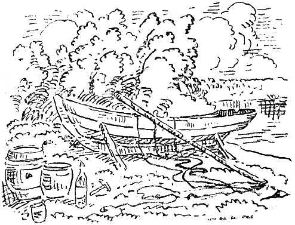

<@pagebreak 141/>

<h2>Das Segelboot.</h2>

Aplund hatte ein Segelboot. Er hatte es von einem
Manne, dem es faustdick hinter den Ohren saß, für
50 Kronen gekauft. Mit Segel und allem.

Ich wohne neben Aplund, und Aplund hat mich gebeten,
ihm bei der Auftakelung zu helfen. Wir takelten
das Boot auf, d.&nbsp;h. wir setzten zwei Segel mit verschiedenen
Namen nebst einem Mast in die Mitte des
Bootes und ließen dann die ganze Geschichte ins Wasser.

<@pagebreak/>
Ein erfahrener Seemann hätte erst das Boot ins
Wasser gesetzt und es dann getakelt, aber Aplund hat
schon immer etwas Originelles gehabt.

Als das Boot aufs Wasser gekommen war, sank es.
Es sank nicht langsam wie ein Granitstein, sondern
urplötzlich wie eine Anchovisbüchse mit einem Loch im
Boden.

Wir waren sehr überrascht, und Aplund flehte den
lieben Gott um einen Revolver und 22 Kronen an,
damit er nach Bästervik fahren könnte, um den Mann
zu erwischen, der ihm das Boot für 50 Kronen verkauft
hatte, und der es faustdick hinter den Ohren hatte.

Wir tranken dann einen Grog und überredeten einen
Jüngling, der am Ort wohnte, das Boot ans Land zu
bringen. Dann fuhren wir nach der Stadt, erledigten
Geschäfte, gingen in den Zirkus und das Variété und
waren mit verschiedenen Leuten zusammen.

Nach einer Woche fuhren wir ans Land zurück, um
das Boot zu dichten. Wir brachten Mennige, Watte,
Zement, zwei Liter Kognak, Nägel und Eisenblech mit.

Wir dichteten das Boot. Zuerst stopften wir Watte
in sämtliche Löcher, dann Mennige, dann Pech, dann
Teer und dann Eisenblech. Dann wurde alles ins
Wasser gesetzt. Dann sank alles.

Wir gingen und tranken einen Grog und beauftragten
den Jüngling, der am Orte wohnte, das Boot heraufzuziehen,
worauf wir wieder in die Stadt fuhren, in
den Zirkus und das Variété gingen und mit verschiedenen
Leuten zusammen waren.

<@pagebreak/>
Nach einer Woche fuhren wir in Gesellschaft eines
fremden Herrn mit Kragen und Röllchen aufs Land
zurück.

Das Boot stand auf den Strand gezogen da, mit
Segeln und allem. Der fremde Herr kaufte es sofort
für 200 Kronen bar. Aplund fragte, ob er segeln könne,
worauf er erwiderte:

»Na, ich bin doch kein Dauerschwimmer!«

Wir setzten das Boot nebst dem fremden Herrn ins
Wasser. Er segelte hinaus. Als er fünfzig Meter vom
Land entfernt war, sank die ganze Geschichte, das Boot,
die Segel, der fremde Herr, der Kragen und die Röllchen.

Wir standen ein Weilchen da und überzeugten uns,
daß es wirklich gesunken war, worauf wir hinaufgingen
und einen Grog tranken und dem Jüngling, der am
Ort wohnte, sagten, daß er das Boot heute Abend nicht
heraufzuziehen brauche.

