<@pagebreak 3/>

<h1>Der Dynamithund und andere Unmöglichkeiten</h1>

<h2>Merkwürdige Einzelheiten aus meinem
wunderlichen Leben.</h2>

Mein ganzes Leben ist eine Kette merkwürdiger Erlebnisse
gewesen.

Ich war kaum 3 Jahre alt, als ich von einem Verwandten
einen Stoß bekam, so daß ich eine Treppe
hinunterfiel und ein Loch in sie schlug, — ich selbst
entging dem sonst sicheren Tod durch einen schlauen
Handgriff.

Zur Erinnerung an dieses Ereignis habe ich eine
Narbe über dem linken Auge und eine Locke von dem
Haar des Verwandten behalten. Die Narbe pflege ich
sorgfältig, denn sie steht mir sehr gut und verleiht mir
ein interessantes Aussehen, wenigstens bei Abendbeleuchtung.

Im Alter von 6 Jahren verschwand ich aus meinem
lieben Elternhaus. Niemand wußte, wie das zugegangen
war. *Ich verschwand ganz einfach.*
Später habe ich mehrmals in unangenehmen Situationen
versucht, dasselbe zu tun, aber es ist mir immer mißlungen.
Die Wachsamkeit der Polizei ist heutzutage
<@pagebreak/>
auch größer als früher. Als ich beinahe 2 Stunden
verschwunden gewesen war, tauchte ich plötzlich wieder
zu Hause auf. Die Freude meiner Familie war ebenso
groß wie der Schmerz, der meines Vaters Spazierstock
mit seiner silbernen Krücke bei mir hervorrief.

Im Alter von 8 Jahren erhielt ich bei Semesterschluß
»Sehr gut« im Betragen. Meine Tante, bei der ich
damals erzogen wurde, war dadurch so überrascht, daß
sie plötzlich, ohne vorherige Warnung, starb und mir
ihr Vermögen von 60000 Pfund Sterling hinterließ.
(Meine Tante war väterlicherseits Engländerin.)

Das Vermögen war bald verpulvert, — mein Vormund
hatte das besorgt und keine Entschädigung dafür
verlangt. Er war eben eine edle Natur.

Mit kaum 22 Jahren machte ich eine Reise, auf der ich
mit dem später so berühmten Gentlemandieb Westermark-Rosén
bekannt wurde, der incognito (ohne Bewachung)
fuhr. Er bat, mir zur Erinnerung an die angenehme Fahrt
eine goldene Remontoiruhr mit Kette aus demselben Metall
überreichen zu dürfen. Als Herr Rosén mir die Uhr
schenkte, war sie noch im Besitze eines älteren, ziemlich
fetten Großhändlers, der uns gegenüber im Coupé saß.
Aber er war gerade eingeschlafen. Es war nämlich im
Sommer, und da schläft man ja so leicht ein. Ich trage
diese Uhr immer noch. Sie geht ziemlich gut, denn ich ziehe
sie morgens auf. Meine Tante (siehe oben) hatte gesagt:

»Ziehe die Uhr immer morgens auf, denn dann bist
Du vielleicht nüchtern.«

Westermark-Rosén sitzt jetzt im Gefängnis. Wenn
<@pagebreak/>
Sie ihm begegnen sollten, — Verzeihung! — dann grüßen
Sie ihn, bitte, von mir.

Also. Im Alter von 25 Jahren bestieg ich einen
Ballon. Der Ballon stieg von selber 2000 Meter. Da
platzte er, auch von selber, und ich fiel dicht neben einem
Kirchhof nieder, was meine Freunde sehr praktisch von
mir fanden. Von diesem Erlebnis habe ich weiter keinen
Schaden zurückbehalten, als daß der rechte Fuß etwas nach
innen geht. Es war nämlich gerade Ostwind an diesem Tag.

Ende der neunziger Jahre besuchte ich Hamburg und
machte dort die flüchtige Bekanntschaft einer Zahnathletin,
die im Zirkus Busch auftrat. Sie heiratete mich später.
Sie war eine gute Frau. Aber einmal hat sie mich so
stark in den Arm gebissen, daß ich mich scheiden lassen
mußte. Vor Gericht weinte sie laut und sagte, daß sie
das aus Zuneigung getan hätte. Der Richter aber, —
der selber verheiratet war, — war unerbittlich, und ich
wurde geschieden. Ich denke oft an sie. Sie hat sich
sozusagen in mein Gedächtnis festgebissen. Aber warum
sollen wir bei so trüben Erinnerungen verweilen, — sie
hatte blaue Augen.

Mein 30. Geburtstag wurde einfach und würdig bei
einem Freunde mit einem kleinen Feuerwerk gefeiert. Es
war eine helle Sommernacht, das Feuerwerk kam also
nicht recht zur Geltung. Aber die Villa war gegen Feuer
versichert, so daß der Schaden nicht so groß war,
wenn man die Schwiegermutter meines Freundes nicht
mitrechnet, die wir nicht übers Herz bringen konnten
zu wecken.

<@pagebreak/>
Natürlich habe ich noch viel mehr erlebt, aber warum
soll ich das unbekannten und vielleicht rohen Menschen
erzählen, die womöglich über meine Sorgen und Leiden
höhnisch lachen würden.

O Welt, wie bist Du grausam!

Hasse Zetterström.

P. S. Wenn die Polizei in Schweden einen Verbrecher
für ihr Verbrecheralbum photographiert, dann
macht sie zwei Aufnahmen. Schwab, der meinen
Charakter schon seit vielen Jahren kennt, ist der Ansicht,
daß von mir sechs Aufnahmen gebraucht werden.
Alle Bilder sind sehr gut gelungen, besonders das erste.

H. Z.

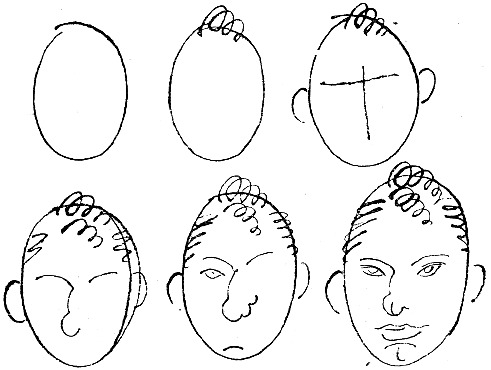

<@pagebreak/>

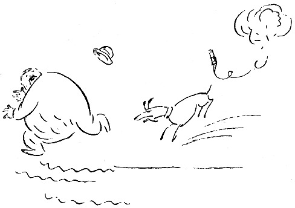

<h2>Der Dynamithund.</h2>

Abends kamen sie mit Lärm und Gepolter nach Hause,
brachten einen zerschossenen Vogel mit und fingen sofort
an, Karten zu spielen und zu trinken. Die Hunde wurden
unten im Flur festgekoppelt, und wenn einer der Herren
verlor, dann ging er hinunter und verprügelte seinen Hund.

Das war in der Bretagne, und mein Freund erzählte
von einer Jagd, die ein paar junge Leute mitgemacht
hatten. Durch diese Erzählung kamen wir auf Tiere
zu sprechen, und irgend jemand sagte:

»Da sind wir freundlicher zu unseren Hunden. Erinnerst
Du Dich noch an Bonells Grete, den Foxterrier?«

<@pagebreak/>
»Ja, das war ein schönes Tier! Ist sie tot?«

»Ja, sie ist eines natürlichen Todes gestorben. Aber
wenn es nach Bonell gegangen wäre, so wäre sie schneller
abgedampft. Bonell ist Mitglied des Tierschutzvereins
und setzt sich lebhaft für das schmerzlose Verenden der
kleineren Haustiere ein.«

»Es gibt ja besondere Anstalten für so was.«

»Ja, aber Bonell hatte kein richtiges Vertrauen dazu.
Er merkte, daß die Grete langsam alt zu werden begann.
Sie wich höflich aus, wenn sie unten auf dem Hof einer
großen Ratte begegnete, und derartiges deutet ja auf
Altersschwäche, wenigstens bei Hunden. Bonell wurde dadurch
aufrichtig verstimmt, denn nachdem seine Wirtschafterin,
die zwanzig Jahre bei ihm gewesen war, den Korbmacher
geheiratet hatte, stand er fast allein auf der Welt.

Er hatte nur die Grete. Er gab ihr bulgarische
Sauermilch, denn er dachte, daß das, was einem Menschen
hilft, auch einem Hunde gut tun müßte. Aber
die Grete weigerte sich, die Sauermilch zu genießen,
auch wenn sie — die Milch natürlich — gezuckert wurde.

Da beschloß Bonell, daß die Grete sterben sollte, um
ihr ein klägliches Alter zu ersparen. Sie sollte schmerzlos
sterben. Bonell überlegte nur die Art und Weise.

Ein Flintenschuß konnte versagen. Gift ebenfalls.
Endlich, nachdem er einige Tage nachgedacht hatte,
bekam Bonell einen guten Einfall. Er wollte sie mit
Dynamit in die Luft sprengen! Eine Dynamitpatrone
mit einer Zündschnur am Ende — und alles würde
in einer hundertstel Sekunde vorüber sein.

<@pagebreak/>
Bonell wählte sich einen Sonntag für das Experiment.
Teils war er an diesem Tage frei von Geschäften,
und teils fand er, es läge etwas Schönes und Stimmungsvolles
darin, sich gerade an einem Sonntag von
einer alten Freundin zu trennen.

Die Dynamitpatrone war in Ordnung, die Zündschnur
ebenfalls, als die Grete und ihr Herr einen Spaziergang
zum Tore der Stadt hinaus machten.

Es war ein schöner Sommersonntag. Die Leute
wanderten nach dem Walde hinaus, einige hatten Essen
mit und lagerten sich auf irgendeinem grünen Hügel.
Bonell und Grete gingen an allen Ausflüglern vorbei.
Sie sehnten sich nach verlassenen, ungestörten Gegenden.
Schließlich, gegen Mittag, erreichten sie einen einsamen
Waldpfad. Bonell folgte ihm und war bald im tiefsten
Wald. Ein stiller Friede herrschte in der Natur. Bonell
setzte sich auf einen Baumstamm, nahm den Hut
ab und holte tief Atem. Natur bleibt doch Natur,
dachte er bei sich. Der Mensch sollte mehr in der
Natur sein, dann wäre alles viel besser.

Die Grete lag Bonell zu Füßen, und treu schaute
sie in sein liebes Gesicht hinauf.

Bonell holte behutsam die Dynamitpatrone aus der
Tasche, und mit leichter Hand band er sie der Grete
an den Schwanz. Die Zündschnur befestigte er an der
Patrone. Dann erhob er sich, holte eine Streichholzschachtel
hervor, machte Feuer und zündete die Schnur an, die
sofort zu glühen anfing. Die Grete lag still. Sie war
vielleicht ein wenig müde nach dem langen Spaziergang.

<@pagebreak/>
Bonell sah die Zündschnur brennen, und plötzlich verstand
er, daß es hier auch sein eigenes Leben galt. Er
stülpte den Hut auf den Kopf und begann in den Wald
hineinzulaufen. Die Grete fand das Benehmen ihres
Herrn sehr eigentümlich — sicher drohte ihnen beiden
irgendeine Gefahr, und da lief die Grete hinter Bonell her.

Bonell wandte sich um. Diese Entwickelung hatte
er sich nicht gedacht. Der Hund war zwei Meter von
ihm entfernt, und er sah, wie die Zündschnur glühte.
Der Funke näherte sich …

Bonell lief schneller. Er war stark und das Laufen
nicht gewöhnt, aber er tat sein Bestes. Die Grete folgte ihm.

Hinein, durch den Wald ging die Jagd. Über Berghöhen
und Grashügel und durch Sümpfe und Moraste.
Manchmal waren sie drinnen im Gebüsch, zwischen
Strauchwerk und großen Büschen von Nesseln und
Disteln.

Bonell lief und lief. Die Grete kam näher. Mitunter
bellte sie, frisch und fröhlich, wie in ihrer Jugendzeit,
aber was fiel ihrem Herrn denn ein? Was trieb
er für ein Spiel? Wie erschrocken sah er aus, als er
sich umwandte?

Die Zündschnur glühte. Bonell konnte nicht mehr.
Ob er versuchen sollte, auf einen Baum hinauf zu kommen?
Aber das ging ja nicht mit dem Überzieher und bei
seiner Korpulenz.

Er lief weiter. Der Schweiß triefte, den Hut hatte
er verloren, den Stock hatte er fortgeworfen, und zwei
Hosenknöpfe waren ihm abgesprungen. Die Zündschnur …

<@pagebreak/>
Da, in seiner unbeschreiblichen Not, erblickte Bonell
zwischen den Bäumen blaues Wasser. Es galt, dort hinzukommen!
Hinaus in den See, und dann wäre er gerettet!

Er erreichte das Ufer, und ohne Bedenken stürmte
er weiter. Das Wasser spülte ihm um die Beine, die
Hosen klebten ihm fest, die Füße sanken in den Lehmboden.
Aber er hielt sich tapfer.

Als er zehn Meter gewatet war, stand ihm das
Wasser bis an die Kniee. Er drehte sich um und sah
zurück. — Die Grete war am Ufer geblieben. Sie
stand ganz still, und in ihrem kleinen Hundeköpfchen
war nur ein Gedanke: Ihr Herr war verrückt! Er
wollte sich ertränken!

Da ging sie entschlossen ins Wasser und schwamm
auf Bonell zu. Sie schwamm ruhig und schön, und
die ganze Zeit hielt sie den Schwanz über der Wasserfläche
— und die Zündschnur glühte!

Bonell dachte: Wenn sie heran ist, tauche ich sie unter,
und dann mag es gehen, wie es will! Ich kann nicht mehr!«

* * *

Mein Freund machte eine Pause in seiner Erzählung.
Aber die Spannung war zu stark. Wir fragten alle
zu gleicher Zeit:

»Nun — und was wurde?«

»Tja,« sagte der Erzähler, »als die Grete dicht an
Bonell herankam, wagte er doch nicht, sie unterzutauchen.
Er tauchte lieber selber ins Wasser, und der Hund tat es
ihm nach — und — da erlosch die Zündschnur.

Und dann kamen sie beide wieder fröhlich in die Höhe.«

<@pagebreak/>

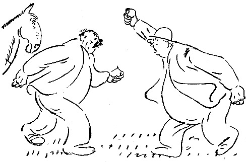

<h2>Das Pferd.</h2>

Ich wohne an der Peripherie der Stadt, in einem
verhältnismäßig modernen Haus mit elektrischem Licht,
das auch nachts brennt, wenn man es auszudrehen vergißt.

Unter meinem Fenster führt die Straße entlang, und
jenseits dieser liegt eine kleine eingezäunte Wiese. Die
Wiese liegt grün und schön da. Jeden Morgen sehe
ich sie an und freue mich, daß sie kein vierstöckiges Haus ist.

Da geschieht eines Tages etwas. Ein Pferd springt
auf der Wiese umher! Ein schönes, braunes, junges,
fröhliches Pferd. Es springt umher, weidet das Gras
ab und wedelt mit dem Schwanz vor lauter Freude, —
denn die Fliegen sind noch nicht so schlimm.

<@pagebreak/>

Alle sehen wir das Pferd von unseren Fenstern, und
wir sprechen nur von ihm. Die Kinder laufen auf die
Straße, hängen sich an den Zaun und wundern sich,
wo es hergekommen ist, aber niemand weiß es.

Die Jungens sprechen von ihm auf den Treppen, und
in den Läden hört man:

»So ein hübsches Pferd! Es sieht wie ein Reitpferd
aus!«

Aber die Jungens sind am meisten interessiert. Ob
man näher gehen kann? Und es streicheln? Es könnte
beißen.

Eines Tages erscheint schließlich Olof, der Nr. 35
wohnt, mit einem harten Brotkanten und gibt ihm den.
Das Pferd nimmt ihn, und schon ist es aller Freund.

Aber damn — — —

Ich komme eines Mittags nach Hause wie immer.
Und da sehe ich eine kleine Versammlung da unten auf
der Wiese. Irgend etwas ist passiert. Auf der Straße
steht der Schuster und redet mit dem Glaser. Ich habe
sie nie vorher draußen auf der Straße gesehen.

»Was ist geschehen? Was ist los?«

»Denken Sie mal, da ist ein Kerl, der das Pferd
stehlen will! Vor einer halben Stunde ist er gekommen
und gleich durch die Zauntür gegangen und wollte das
Pferd mitnehmen. Aber es waren Leute da unten, und
nun rechnen sie mit ihm ab.«

»Soso,« sagte ich und ging hinauf. Ich setzte mich
ans Fenster und beobachtete die kleine Gruppe, die da
unten debattierte. Dann sagte ich zu meiner Frau:

<@pagebreak/>
»Wem gehört eigentlich das Pferd?«

Meine Frau erwiderte:

»Ich glaube, das weiß niemand,«

»Es ist jemand da unten, der es holen will.«

»Das ist ja gemein.«

»Vielleicht gehört es ihm?«

»I bewahre!«

Ich stand plötzlich auf. Mir war einer der besten
Gedanken gekommen, die ich je gehabt habe.

Ich nahm meinen Hut und ging ruhig und gelassen
nach der Wiese hinunter. Da stand ein großer, vierschrötiger
Mann, der wie ein Bauer aussah, und hielt
das Pferd bei der Mähne. Er sah hochgradig verärgert
aus, und ich hörte ihn sagen:

»Soll ich mir mein eigenes Pferd nicht holen dürfen?!
Laßt mich gefälligst durch!«

»Sie wollen einfach das Pferd stehlen!« sagte Herr
Johansson, der Geschäftsführer in der Bonbonfabrik.

»Es ist mein Pferd! Ich habe es vorige Woche auf
dem Markt gekauft,« erwiderte der Mann.

»Das sollen Sie mal erst beweisen!« sagte jemand in der
Gruppe, und alle lachten.

Jetzt trat ich auf den zu, der behauptet hatte, daß
das Pferd ihm gehöre, sah ihm gerade ins Gesicht und
sagte:

»Sind Sie toll, Mensch, Sie wollen mir mein Pferd
wegnehmen?«

Der Mann ließ die Mähne des Pferdes los, der
Arm fiel ihm schlaff herunter, und er sah mich mit großen,
<@pagebreak/>
erstaunten Augen an. In die Gruppe kam Bewegung,
und die Leute sagten halblaut:

»Dem gehört das Pferd! Das hätten wir uns gleich
denken können!«

Der Mann, der versucht hatte, das Pferd zu stehlen,
fing an zu grinsen; er dachte: Einen so gelungenen Spaß
habe ich lange nicht erlebt! Als er das Pferd wieder
anfassen wollte, trat mein Portier hervor, hielt ihm die
Faust unter die Nase und sagte:

»Mach daß Du fortkommst, Du Gauner! Du hast
ja gehört, daß das Pferd dem Redakteur gehört! Schämst
Du Dich nicht?!«

Der Mann wurde plötzlich ernst, tat einen Schritt
auf mich zu und sagte:

»Sagen Sie noch einmal, daß das Ihr Pferd ist!«

»So oft Sie wollen,« sagte ich. »Ich habe es gekauft,
um morgens darauf zu reiten. In der nächsten
Woche kommt es in den Tattersall.«

»Eigentlich müßte man einen Schutzmann holen,«
sagte jemand.

»Ach was, laßt ihn laufen,« sagte ein anderer.

Der Mann sah uns an, einen nach dem andern, mich
am längsten, und dann ging er ganz plötzlich. Ich
streichelte das Pferd und tat, als gäbe ich ihm ein Stück
Zucker. Dann grüßte ich die Anwesenden freundlich und
ging nach Hause,

Ich hatte Mittag gegessen und Kaffee getrunken, und
dann legte ich mich auf mein Sofa, guckte an die Decke
und wartete. Die Abendzeitungen kamen, ich las sie
<@pagebreak/>
ruhig, beherrscht, und dann schlief ich ein. Ich erwachte
davon, daß das Dienstmädchen an die Tür klopfte und sagte:

»Ein Mann steht draußen. Er möchte mit — — —«

»Lassen Sie ihn hereinkommen!«

Ich blieb auf dem Rücken liegen, ruhig und gelassen.
Es war der Mann mit dem Pferd. Er blieb an der
Tür stehen. Ich sagte freundlich:

»Bitte, nehmen Sie Platz!«

Er setzte sich, und wir sahen uns an. Dann sagte er:

»Das war ein feines Ding, was Sie da unten mit
dem Pferd gedreht haben!«

»Sie müssen sich deutlicher ausdrücken,« sagte ich.

Er erhob sich rasch und stieß hervor:

»Das ist mein Pferd!«

»Bitte, bleiben Sie sitzen,« sagte ich, »und lassen Sie
uns ruhig reden. Sie sagen, daß es Ihr Pferd ist.
Ich behaupte, daß es *meins* ist. Können Sie mir
Ihren Kaufvertrag zeigen?«

»Nein,« sagte der Mann, »ich habe es bar bezahlt
und habe mir keine Quittung geben lassen. Können
Sie mir eine zeigen?«

»Das wäre möglich,« sagte ich, »aber ich brauche das nicht,
denn niemand zweifelt daran, daß das Pferd mir gehört.«

»Doch, ich!«

»Ja, Sie sind bisher der einzige, und es tut mir leid,
daß das der Fall ist. Es ist ein hübsches Tier; schade,
daß es seinetwegen zu Differenzen kommen soll.«

Der Mann saß schweigend da. Ich nahm mir eine
Zeitung. Einige Minuten verstrichen, dann sagte er:

<@pagebreak/>
»Wollen Sie mir das Pferd verkaufen?«

»Nichts ist unverkäuflich,« sagte ich. »Wieviel wollen
Sie geben?«

Er schnellte wieder in die Höhe und schrie:

»Das geht zu weit! Soll ich mein eigenes Pferd
kaufen?!«

»Sie wollen es ja haben,« sagte ich.

Er holte seine Brieftasche hervor.

»Was kostet es?«

»Es ist billig,« sagte ich. »Sie sollen es für 200 Kronen
haben. Sie machen ein gutes Geschäft. Ein so hübsches
Pferd findet man nicht jeden Tag. Zweihundert bar!«

Ich erhob mich vom Sofa, der Mann zählte zwei
blaue Scheine auf und legte sie wortlos auf den Schreibtisch.
Ich steckte sie in die Tasche, während er mir starr
in die Augen sah und sagte:

»Wollen Sie mir eine Quittung geben?«

»Das ist nicht nötig zwischen uns,« sagte ich. »Sie
können sich das Pferd holen.«

»Das kam mir da unten eben nicht so vor!«

»Beruhigen Sie sich!« Und ich schrieb auf einen Zettel:
*Ich habe nichts dagegen, daß das Pferd
fortgeführt wird.* Unterschrieb und gab dem Mann
den Zettel. Er las ihn, lächelte und sagte:

»Sie sind wirklich der gerissenste Mensch, der mir
vorgekommen ist!«

»Ich weiß,« sagte ich. »Sollte wieder mal etwas
mit Pferden zu machen sein, dann werde ich mich melden.«

Er nickte mehrmals, und dann ging er. Ich sah,
<@pagebreak/>
wie er unten den Zettel vorzeigte und das Pferd wegführte.

Am nächsten Morgen bekam ich einen Brief. Der
lautete:

»Herr Kompagnon! Wir haben gestern ein gutes
Geschäft gemacht, Sie und ich. Das Pferd gehörte
weder Ihnen noch mir, ich habe nie ein so schönes
Exemplar so billig gekauft. Ich bekomme sicher tausend
Kronen dafür. Wenn Sie nicht gekommen wären und
sich in die Sache eingemischt hätten, dann hätte ich es
umsonst gehabt. Ich habe lange nach dem Gaul geangelt.
Besten Dank jedenfalls! Wenn Sie wieder etwas vorhaben,
dann denken Sie an mich. Gute Provision! X.D.T.«

Ich habe den Brief zu meinen Sammlungen gelegt.
Ein Freund von mir vom Magistrat hat mir erzählt,
daß das Pferd der Stadt gehört. Mein Kompagnon
und ich können ruhig sein. Eine Behörde wie die Stadt
erfährt nichts, wenn so eine Kleinigkeit wie ein Pferd
verschwindet.

<@pagebreak/>

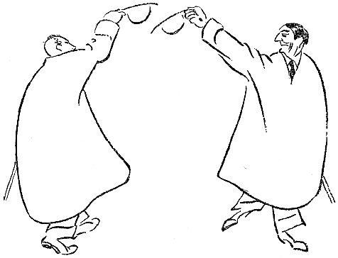

<h2>Der kluge Amerikaner.</h2>

Eines Tages sagte meine Frau:

»In die Wohnung unter uns sind Leute eingezogen.«

»Aussehen?«

»Nichts Besonderes. Sie fett, er banal.«

»Klavier?«

»Ja.«

»Grammophon?«

»Ja.«

»Lege doppelte Teppiche in mein Zimmer und laß
durch das Mädchen andeuten, das wir sämtliche Lärmparagraphen
des Gesetzes auswendig können.«

<@pagebreak/>

Die Leute unter uns in der Wohnung störten mich
nicht sehr. Sie spielten Klavier, dann und wann, damit
ich hören sollte, daß sie sich ein Klavier leisten könnten.
Das Grammophon kam mir heiser vor,

Die Frau war wirklich recht fett, sah aber ganz nett
aus. Der Mann war Großhändler und kam nachts
spät nach Hause. Dann zankten sie sich. Aber so ist
das ja bei allen verheirateten Leuten.

Ich konnte alles hören, was sie sich sagten, aber die
Unterhaltung wich sehr unbedeutend von dem ab, was
ich von früheren Ehepaaren in derselben Wohnung gehört
hatte.

Eines Nachts aber geschah etwas. Ich war früh zu
Bett gegangen, wie ich es zu tun pflege, als ich durch
ein Geräusch geweckt wurde. Irgendwo klopfte es.

Ich sprang aus dem Bett und öffnete die Tür. Nein,
da war es nicht. Ich horchte. Das Klopfen begann
von neuem. Es kam aus der Wohnung unter mir.
Es wurde unten an die Decke zu mir herauf geklopft.

Das belustigte und interessierte mich, und, dem Instinkt
des Augenblick folgend, klopfte ich auf meinem Fußboden
zurück. Da hörte ich eine Frauenstimme, die deutlich sagte:

»Bitte kommen Sie doch herunter zu mir!«

Ich stand mitten im Zimmer, leicht angezogen, wie
man es ist, wenn man direkt aus dem Bett gestiegen ist.
Ich fror um die Beine und fing an, mich anzuziehen.

Das Haus war still. Meine Familie schlief. Als
ich fertig angezogen war, klopfte es wieder, und als ich
das Klopfen erwidert hatte, sagte die Stimme:

<@pagebreak/>
»Wann kommen Sie?«

»Sofort,« antwortete ich, und dann schlich ich mich
in den Korridor hinaus, öffnete die Tür und ging nach
der Wohnung eine Treppe tiefer hinunter.

Die Dame, die geklopft hatte, stand in ihrer Entréetür.
Wir sagten beide nichts. Leise betrat ich die
Wohnung.

Das elektrische Licht brannte in einem Wohnzimmer,
das unter dem meinen lag. Die Dame, die ganz angekleidet
war, schien diese Nacht nicht im Bett gewesen zu
sein. Sie bat mich, Platz zu nehmen. Ich tat es,
indem ich sagte:

»Ich muß zugeben, daß dies immerhin ein außergewöhnliches
Ereignis in meinem Leben ist. Womit kann
ich dienen?«

»Sie müssen hier warten, bis mein Mann nach Hause
kommt. Ich fürchte mich, allein zu sein. Ich halte es
nicht aus, jede Nacht aufzusitzen und zu warten.«

»Ihr Mann ist vielleicht durch wichtige Geschäfte in
Anspruch genommen, die ihn verhindern, nach Hause zu
kommen,« sagte ich. »Das passiert mir auch manchmal.«

»*Die* Geschäfte kenne ich,« sagte die Dame. »Bitte,
hier haben Sie eine Zeitung zu lesen. Beliebt es Ihnen,
Patience zu legen, so sind hier Karten, oder wollen Sie
einen Likör trinken?«

»Meine Gnädige,« sagte ich, »ich will schlafen gehen.
Ich bin gewöhnt, um diese Zeit zu schlafen. Es war
unrecht von Ihnen, mich zu wecken, — ich gehe hinauf
in meine Wohnung.«

<@pagebreak/>
»Sie werden doch eine Dame nicht mitten in der
Nacht allein lassen?!«

»Das muß ich leider mit so vielen einsamen Damen
tun. Meine Frau ist auch allein.«

»Sie schläft.«

»Das will ich hoffen.«

Da hörten wir, wie ein Schlüssel in die Entrèetür
gesteckt wurde. Vorsichtig und leise, wie es ein verheirateter
Mann tut, wenn er nachts nach Hause kommt.

Es dauerte ein paar Augenblicke; er legte Hut und
Überzieher ab, dann stand er in der Türöffnung zum
Wohnzimmer. Die Augen blinzelten gegen das Licht,
und er atmete ein bißchen schwer nach den zwei Treppen.
Er hatte einen roten Kopf, und sein ganzes Gesicht
drückte tiefes und großes Erstaunen aus.

Schließlich sagte er:

»Was macht dieser Mensch hier mitten in der Nacht,
Julia?!«

»Ich will es Ihnen erklären,« sagte ich.

»Mit Ihnen habe ich nicht gesprochen,« sagte der
Mann und hielt sich an dem Türrahmen fest. »Meine
Frau soll antworten!«

»Gustav,« sagte Julia, »ich war so einsam, ich habe
vier Stunden auf Dich gewartet, ich wurde so unruhig,
daß Dir etwas zugestoßen wäre, ich wußte nicht, was
ich machen sollte, da klopfte ich an die Decke und habe
ihn gebeten, herunterzukommen. Ich *konnte* nicht
allein sein. Ich wollte ihm gerade einen Likör anbieten,
als Du kamst.«

<@pagebreak/>

Gustav machte einen Schritt ins Zimmer hinein und
sagte: »Du — — — bietest — — — fremden — — —
Personen — — — Likör — — — an, — — —
wenn — — — ich — — — weg — — — bin?!«

»Lassen Sie mich bitte zu Bett gehen,« sagte ich,
»ich bin so müde.«

»Bitte!« sagte Gustav, ohne die Verbindlichkeit im
Ton, die man bei einem Gastgeber gewöhnt ist.

Ich ging hinauf, schlich hinein, zog mich aus und
kroch ins Bett.

Ich lag lange und horchte, aber ich hörte nichts aus
der Wohnung unter mir. Alles war still und ruhig.

Was für ein schlaues, kleines Weib, dachte ich, —
sie zwingt den Mann, nachts früh nach Hause zu kommen!
Das wird nun ein tugendhafter Mann werden. Sicher!
Und dabei bin ich ihr behilflich gewesen. Aber ich bin
ein schlechter Gesellschafter gewesen, — es tut mir leid,
daß ich hinuntergegangen bin.

Dann schlief ich ein.

Gustav kam eine Zeitlang jeden Abend pünktlich nach
Hause. Ich hörte, wie sie plauderten und scherzten, ehe
sie zu Bett gingen.

Sie sind glücklich, dachte ich, und das ist dein Verdienst!

Aber eines Nachts, — gegen drei Uhr, — wurde ich
wieder durch ein Geräusch geweckt. Ich setzte mich im
Bett hoch. Es klopfte gegen den Fußboden.

Ich klopfte zurück, und dann horchte ich. Einen
Augenblick später hörte ich Julias Stimme:

»*Bitte*, kommen *Sie doch herunter zu mir*!«

<@pagebreak/>

Ich legte mich auf den Fußboden und antwortete:

»*Ich kann nicht hinunterkommen, ich habe
mir den Fuß verstaucht. Kommen Sie lieber
zu mir herauf*!«

Es wurde still, dann antwortete Julia:

»*Ich komme*!«

Erst schaltete ich das elektrische Licht ein und zog
mich an. Dann schlich ich mich in den Korridor hinaus,
öffnete und ließ meine Hausgenossin ein.

»Gehen Sie leise,« sagte ich, »meine Frau schläft.«

Julia trat ein, und wir saßen einander gegenüber,
genau wie unten bei ihr.

»Ist er heute Nacht wieder aus?« fragte ich.

»Ja, er hat wieder angefangen! Er muß einen Denkzettel
haben!«

»Frau Julia,« sagte ich, »ich werde Ihnen eine
kleine Geschichte erzählen. Ich hoffe, ich werde damit
fertig, bis Ihr Mann nach Hause kommt und meine
Frau aufwacht. Ich muß Ihnen diese Geschichte erzählen,
damit wir uns vollkommen verstehen. Hören Sie!
In Amerika war ein Mann wegen Untreue gegen
seine Frau angeklagt worden. Die Beweise waren erdrückend,
und die Geschworenen, die den Mann beurteilen
sollten, — — es waren lauter verheiratete Männer,
— — sollten sich gerade zurückziehen, als der Mann
bat, jedem einzelnen der Geschworenen eine Mitteilung
machen zu dürfen, die von großer Wichtigkeit für die
Beurteilung der Sache wäre.

Der Vorsitzende gewährte dem Mann diese Bitte, und
<@pagebreak/>
der Angeklagte flüsterte jedem Geschworenen schnell etwas
ins Ohr.

»*Was flüsterte der Lump*?« fragte Julia, die
meine Erzählung mit starkem Interesse angehört hatte.

»Jetzt,« sagte ich, »werde ich Ihnen das nicht verraten;
ihrem Manne werde ich es sagen, — — ich höre
seine Schritte auf der Treppe.«

Julia hatte sich erhoben und einen Schritt nach der
Tür getan.

»Kommen Sie!« sagte ich. »Wir wollen ihm entgegen
gehen!«

Ich nahm ihren Arm und führte sie durch den Korridor
und die Treppe hinunter. Die Nachtbeleuchtung
brannte, und auf dem Treppenabsatz stand Gustav mit
dem Hut im Genick und dem Wohnungsschlüssel in der
Hand. Höchst erstaunt sah er seine Frau an, die auf
das Geländer gestützt dastand.

»Jetzt, Frau Julia,« sagte ich, »können Sie erfahren,
was der Amerikaner den Geschworenen gesagt hat:

»*Wir verheirateten Männer halten zusammen*!«
sagte er. Gute Nacht!«

* * *

Am folgenden Tag traf ich Gustav auf der Straße.
Er grüßte sehr freundlich, und wir lächelten uns gegenseitig
an, — — wie früher die Augurn, — — wie
jetzt die verheirateten Männer.

Julia war ziemlich fett.

<@pagebreak/>

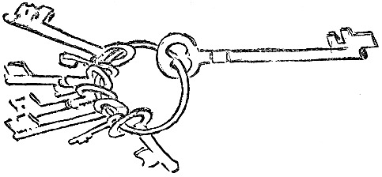

<h2>In der Elektrischen.</h2>

Neulich fuhr ich mal mit der Elektrischen. Es war
eine gewöhnliche, langweilige, mit ernsten, stillen Menschen
voll besetzte Elektrische. Ich war auch sehr still
und ernst. Nach einer Weile aber sagte ich zu Halldén,
der neben mir saß:

»Das mit dem Prinzen Eugen war doch schrecklich!«

»Tja,« sagte Halldén, »er hätte etwas vorsichtiger
sein müssen!«

Sämtliche Fahrgäste zuckten zusammen. Was war
<@pagebreak/>
denn mit dem Prinzen? Alle Blicke richteten sich auf
uns, und die Luft war mit Neugier gesättigt und dick
wie Grütze. Und diese unheimliche Stille, die grabesdumpf
mitten im Wagen stand!

Die Elektrische rollte weiter. Eine ältere Dame hielt
es nicht länger aus. Sie ging nach dem Hinterperron
und fragte den Schaffner:

»Was ist denn mit dem Prinzen Eugen?«

»Was weiß ich!« sagte der Schaffner.

»Ein paar Herren erzählten drin etwas von ihm. Es
soll ihm etwas zugestoßen sein.«

Der Wagen hielt an einer Haltestelle. Drei Herren
drängten sich gleichzeitig zum Wagen hinaus und riefen
nach der Abendzeitung. Der Schaffner stieg ab, ging
zu dem Wagenführer und sagte:

»Hast Du das vom Prinzen Engen gehört?«

Da kam ein Kontrollör, und der Wagen fuhr weiter.
Als wir ausstiegen, um umzusteigen, kam ein dicker Herr
schnaufend hinter uns her und fragte:

»Was ist denn eigentlich mit dem Prinzen Eugen?«

»Tja,« sagte ich, — »wenn Sie einen grünen Wagen
benutzen und damit bis zur Schleuse weiterfahren und
dort in einen weißen Wagen steigen, dann kommen Sie
nach der Sybillenstraße.«

Der dicke Herr steht noch immer auf demselben Fleck
und stiert vor sich hin. Er steht ganz still. Man muß
leise gehen, damit man ihn nicht weckt. Sein Hirn arbeitet.

Halldén und ich bestiegen einen weißen Wagen, um
<@pagebreak/>
weiter zu fahren. Eine ältere Frau drängte sich vor
mir hinauf und trat mir dabei auf die Lackstiefel. Sie
setzte sich ganz vorn in den Wagen, und ich blieb auf
dem Hinterperron.

Der Schaffner kam, um das Geld einzukassieren. Ich
gab ihm 20 Öre und sagte:

»Das ist für mich und die Dame da vorn.«

Der Schaffner ging in den Wagen, und als er zu
der älteren Dame kam, reichte sie ihm 10 Öre, aber
der Schaffner sagte:

»Ist schon bezahlt!«

»Nein, — ich habe noch nicht bezahlt,« protestierte
die Dame.

»Ihr Begleiter auf dem Hinterperron hat bezahlt,«
erwiderte der Schaffner.

»Ich habe keinen Begleiter,« sagte die Dame. »Wollen
Sie kein Geld haben?«

Der Schaffner antwortete nicht. Er hatte das Geld
bekommen. Das genügte. Dann sagte die ältere Dame:

»Aber ich wollte einen Umsteigeschein haben!«

Der Schaffner kam auf den Hinterperron hinaus
und sagte zu mir:

»Die Dame wollte ja einen Umsteigeschein haben!«

»Verzeihung, das habe ich vergessen,« sagte ich, »hier
haben Sie Geld, geben Sie der Dame einen Umsteigeschein.«

Der Schaffner ging hinein und händigte den Schein
aus.

Die Dame nahm ihn in Empfang und sagte:

<@pagebreak/>
»Fährt man hier immer umsonst?«

»Nein, Ihr Begleiter hat ja für Sie bezahlt,« erwiderte
der Schaffner.

Da erhob sich die ältere Dame, ging gerade und steif
durch den Wagen und stieg während der Fahrt ab.

Sie war sofort tot.

Man soll mir nie auf die Lackstiefel treten!

An der nächsten Haltestelle stieg mein Freund Björkman
auf. Er war schmutzig und schäbig. Er hatte
einen alten, verbeulten Hut auf und ganz lehmbeschmierte
Stiefel an.

»Wie Du aussiehst!« sagte ich.

»Ich bin draußen auf Lidingön gewesen und habe mir
mein Grundstück angesehen,« antwortete Björkman. »Ich
ziehe mich immer so an, wenn ich aufs Land fahre.
Es hat ja keinen Zweck, jetzt im Frühjahr für die Lehmhügel
etwas Anständiges anzuhaben.«

»Nein, natürlich nicht,« sagte ich.

Und als der Wagen das nächste Mal hielt, ging ich
zu den Fahrgästen hinein, nahm den Hut ab, blieb
mitten im Wagen stehen und sagte:

»Ist hier vielleicht jemand, der einem armen Teufel
auf dem Hinterperron, der nicht weiß, wie er zu Gelde
kommen soll, ein Almosen schenken will? Es ist ein
anständiger Kerl. Ich kenne ihn schon von früher her.
Er wird den besten Gebrauch von dem Gelde machen.«

Alle Fahrgäste guckten Björkman durch die Tür an;
er sah schäbig aus, und dann holte man die Portemonnaies
heraus. Es wurden 6 Kronen und 35 Öre.

<@pagebreak/>
Ich ging hinaus, überreichte Björkmann das Geld und
sagte:

»Du müßtest nun eigentlich hineingehen und Dich
bedanken. Aber wenn Du dich genierst, dann kann ich
es auch tun.«

Dann öffnete ich die Tür und sagte mit lauter Stimme:

»Björkman dankt vielmals!«

Ich stieg dann ab, Björkman aber blieb mit dem
Geld in der Hand stehen.

Er blieb auf dem Perron stehen und stierte vor sich
hin und fuhr immer hin und zurück mit dem Wagen,
bis zu dessen letzter Fahrt.

Dann hob ihn der Schaffner herunter.

Er hatte 3 Kronen und 40 Öre verfahren und hatte
also 2 Kronen und 95 Öre übrig.

Das war immerhin etwas!

<@pagebreak/>

<h2>Die Tür.</h2>

Fräulein Alice Akerholm kam aus der Stadt, um
meinen Freund Lindström und mich zu besuchen. Wir
freuten uns sehr, daß sie kam, denn sie brachte gute
Konserven und mehrere Flaschen Wein mit.

Fräulein Akerholm ist eine sehr angenehme und liebenswürdige
junge Dame, die oft sehr unmittelbare und
originelle Eingebungen hat.

Am Abend des ersten Tages sagte Lindström:

»Du schläfst im Gaststübchen. Wir haben extra ein
kleines Häuschen für Dich gemietet. Da kannst Du in
einem Patentbett schlafen, daß höchstens 1½ Meter zu
kurz ist. Du bist ziemlich lang, meine liebe Alice!«

Fräulein Akerholm war mit dem Gasthäuschen sehr
zufrieden. Sie wohnte drei Tage dort. Als sie abfuhr,
nahm sie den Schlüssel zur Haustür mit. Niemand
glaubte, daß Fräulein Akerholm den Schlüssel
<@pagebreak/>
gestohlen hätte; wir begriffen gleich, daß sie ihn aus
Irrtum mitgenommen hatte.

Wie sich später herausstellte, hatte sie ihn gar nicht
mitgenommen.

Da wir keinen Schlüssel hatten, konnten wir das
Häuschen nicht zuschließen, was uns drei Tage lang
beunruhigte und störte. Es wohnte zwar niemand
in dem Häuschen, — wir halten aber alle beide
auf Ordnung. Außerdem hatten wir das Häuschen
mit Schlüssel gemietet. Es mußte einen sehr schlechten
Eindruck machen, wenn wir es ohne Schlüssel zurückgaben.

Am vierten Tage sagte Lindström:

»Du mußt wegen des Schlüssels bei Alice anklingeln.
So geht das nicht. Was soll denn der Großhändler
Lewin, dem doch das Haus gehört, denken? Ich bin
zu Genauigkeit und Ordnung in allem erzogen. Alice
muß den Schlüssel herschicken.

Fräulein Akerholm erklärte, daß sie den Schlüssel
nicht gesehen hätte. Daß sie die Tür zugeschlossen und
den Schlüssel herausgezogen habe, nachher aber nicht
weiter an ihn gedacht hätte. In ihrem Gepäck könne
sie keinen Schlüssel finden. Es müsse ein Irrtum vorliegen.
Sie pflege nicht anderer Leute Schlüssel mitzunehmen.
Sicher läge der Schlüssel in oder vor dem
Häuschen. Sie grüßte herzlich und fügte hinzu, daß
sie einen Mückenstich am linken Bein habe.

Wir suchten aufs neue nach dem Schlüssel. Ohne
Erfolg. Wir stellten sämtliche Möbel auf den Kopf,
rüttelten sie, ließen sie los, packten sie wieder an und
<@pagebreak/>
schleuderten sie abermals von uns. Wir benahmen
uns genau so, wie man es immer tut, wenn man nach
einer Sache sucht, die man nicht findet. Aber wir fanden
keinen Schlüssel.

Nach drei Tagen schrieben wir an Fräulein Akerholm
und sagten ihr, daß, wenn sie den Schlüssel auch
nicht gehabt hätte, es doch ihre Pflicht wäre, einen
neuen anzuschaffen, denn sie hätte zuletzt den Schlüssel
in der Hand gehabt.

Fräulein Akerholm antwortete, daß ihr das Geschehene
sehr leid täte, erklärte aber gleichzeitig, daß sie unmöglich
einen Schlüssel anschaffen könnte, da sie ja nicht
wüßte, wie er sein müßte, um zu der Tür zu passen. Sie
könnte doch nicht gut zu einem Schlosser gehen und
sagen: »Wollen Sie so gut sein und einen Schlüssel
zu einem roten Häuschen mit Vorgarten machen.«
Kein Schlosser auf der Welt könne so einen Schlüssel
machen. Hochachtungsvoll usw.

»Das sind nur Ausflüchte,« sagte Lindström. Sie will
sich drücken. Aber sie muß einen Schlüssel besorgen!«

»Natürlich,« sagte ich. »*Wir schicken ihr die
Tür zum Maßnehmen*. Wir könnten ja auch
nur das Schloß schicken, aber das würde sie wahrscheinlich
auch verbummeln. *Wir schicken die Tür*!«

Am folgenden Tage wurde Fräulein Akerholm die
Tür geschickt, nach ihrer Wohnung in der Stadt. Wir
beauftragten einen Spediteur, ihr die Tür ins Haus
zu tragen.

Spät abends klingelte Fräulein Akerholm bei unserem
<@pagebreak/>
Amt an, man möchte doch mal hinschicken und nachsehen
lassen, ob bei uns zu Hause alles in Ordnung wäre.

Aber kein Schlüssel kam. Wir schrieben eine kleine
Postkarte und fragten ergebenst an, ob denn die Arbeit
im Gange wäre. Am Abend brachten zwei Männer
vom Dampfer her die Tür angeschleppt.

Wir saßen gerade auf der Veranda und besprachen
die Möglichkeit eines Dorschfanges am Husvudskär, als
die Tür kam. Sie war dieselbe geblieben, aber im
Schlüsselloch steckte ein Zettel, auf dem stand:

»Ihr könnt sonst jemand verulken. Ich habe keine
Zeit für Euch. Alice.

P. S. Übrigens fahre ich in ein paar Tagen nach
Kopenhagen.«

Fräulein Akerholm pflegt in Kopenhagen im Bristol
zu wohnen. *Wir sandten also die Tür nach
Hotel Bristol in Kopenhagen*. Das war eine sehr
mühselige und sehr kostspielige Sache. Aber wenn wir
uns mal etwas vorgenommen hatten, mußten wir es
auch durchführen.

Fräulein Akerholm kam ins Hotel. Der Portier erkannte
sie wieder, freute sich sehr und sagte:

»Es ist ein großes Kolli für Sie angekommen, gnädiges
Fräulein. Wir haben es auf dem Speicher, denn
es ist so groß.«

Fräulein Akerholm ging mit nach dem Speicher hinaus
und, nachdem zwei Leute der Bedienung 35 Minuten
mit Beil und Zange gearbeitet hatten, kam die Tür
zum Vorschein.

<@pagebreak/>
Fräulein Akerholm ging auf ihr Zimmer und weinte.

Dann schrieb sie eine Depesche:

»Was soll das heißen? Ich verbrenne die Tür! Alice.«

Wir antworteten umgehend:

»Die Tür gehört Lewin. Beschädigung strafbar.
Sende den Schlüssel. Dänisches Eisen geht auch.«

Darauf erhielten wir keine Antwort. Wir warteten
lange. Schließlich erfuhren wir, daß Fräulein Akerholm
weitergereist sei und die Tür im Bristol zurückgelassen
habe, wo sie noch im Speicherraum läge.

Wir gingen nun zum Tischler Lundström auf der Insel
und bestellten eine neue Tür nebst Schlüssel. Der Tischler
Lundström nahm Maß und fertigte eine nette Tür an,
aber weil es abends dunkel war, irrte er sich und nahm
schwarze Farbe statt rote zum Anstreichen der Tür.

Eine schwarze Tür paßt nicht so gut zu einem roten
Haus wie eine rote Tür, weshalb wir eines schönen
Vormittags, als die Sonne schien, das Häuschen schwarz
anstrichen. So hatte alles dieselbe Farbe.

Wir zogen dann fröhlich nach der Stadt und schrieben
dem Eigentümer der Insel:

»Die richtige Tür zu dem schwarzen Haus ist rot,
weil das Haus rot war. Aber nun ist das Haus
schwarz. Hochachtungsvoll usw.«

Lindström fand später den richtigen Schlüssel.

Eines Abends, als er sich auszog, fiel er ihm aus einer
Hosentasche.

Wie er dahingekommen war, war ihm total unverständlich.

<@pagebreak/>

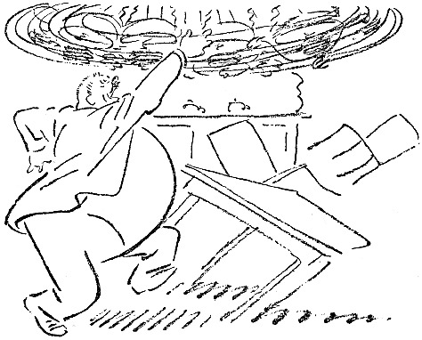

<h2>Lärm.</h2>

Man kann sich an Lärm gewöhnen, auch an nächtlichen.

Wenn man in einer verkehrsreichen Straße wohnt,
wird einem der Nachtschlaf durch Wagen und Autos
nicht gestört. Wohnt man aber an einem stillen und
ruhigen Ort, wo gleich in der Nähe ein Steinhammer
aufgestellt ist, so wird man gestört.

An den Lärm kann man sich nicht gewöhnen. Ich
habe es probiert. Und habe das Attest eines Polizeikommissars
<@pagebreak/>
über die Unmöglichkeit, das auszuhalten,
bekommen.

Der Steinhammer kam fort. Eigentümlich genug.

Der Lärm an sich ist übrigens nicht das Peinigende.
Das Peinigende ist *das Warten auf den Lärm*.

Ich weiß, daß der Steinhammer um sechs Uhr anfangen
wird, und ich werde um vier Uhr wach und
warte auf den Lärm. — — —

Eine Treppe tiefer wohnte einmal ein Herr, der mich
regelmäßig durch seine Unregelmäßigkeiten störte. Hätte
er um zehn Uhr abends damit angefangen, so wäre ich
eingeschlafen; aber vor ein Uhr begann er den Spektakel
nicht, und bis dahin lag ich und wartete und wartete.

Es fing damit an, daß er die Gigerlkönigin (eine
recht alte und abgeleierte Melodie, — aber der Mann
gehörte dieser Jahresklasse an) schon auf der Treppe
pfiff.

Am Takt der Melodie hörte ich den Grad seiner
Betrunkenheit heraus.

Wenn er hineingekommen war, hängte er sehr behutsam
Hut und Überzieher auf, ging dann ins Speisezimmer
und zündete sämtliche Kerzen in einem großen Kronleuchter
an.

Diesen Kronleuchter versetzte er in schwingende Bewegung,
ringsherum, ringsherum, wie ein Karussell, anfangs
langsam, dann aber in immer wilderer Fahrt. Währenddessen
gröhlte er toll vor Freude und guter Nachtlaune.

Nach dem Karussell mit dem Kronleuchter zog er sich
aus und nahm eine kalte Dusche in der Badestube. Ich
<@pagebreak/>
hörte das Rauschen des Wassers und wußte, wie weit
er gekommen war.

Nach der Dusche ging er in sein Zimmer, holte ein
Futteral mit Rasiermessern hervor und ging damit nach
der Mädchenkammer, wo er in der Stille der Nacht dem
vor Entsetzen erstarrten Mädchen das Deckbett wegzog
und sich hinsetzte, um ihr die Hühneraugen zu schneiden.

Dabei machte er keinen Lärm, *aber das Bewußtsein
dessen, was sich abspielte*, störte mich.

Der Mann war ruhig und sicher, er machte nie einen
Fehlschnitt. Außerdem hatte er ein gutes Herz, und
seine nächtliche Handlung war nur durch Wohlwollen
für das arme Mädchen diktiert.

Wenn er seine Operation ausgeführt hatte, ging er
zu Bett. Wahrscheinlich glücklich.

Wir wurden nie miteinander bekannt, aber wir begegneten
uns manchmal auf der Treppe, und er machte
einen sympathischen Eindruck, weil er nie versuchte, Bekanntschaft
anzuknüpfen.

Nach drei Jahren zog er nach einem anderen Stadtteil.
Unter den Umzugssachen sah ich sowohl das
Mädchen wie den Kronleuchter. An beiden sah man
keinerlei Spuren nächtlicher Abenteuer.

Haltbare Sachen!

<@pagebreak/>

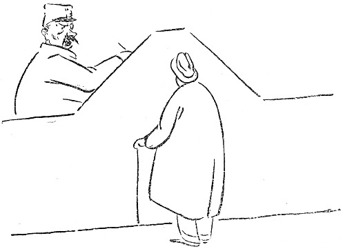

<h2>Der Tischler</h2>

Gegen Ende des Herbstes fing es an, kalt zu werden,
und wir entdeckten, daß unsere Fenster repariert werden
mußten. Wenn es regnete, lief das Wasser über das
Fensterbrett ins Zimmer, und wenn es windig war,
mußten wir vom Salontisch aus gegen den Wind Backbord
halten, um nicht dicht vor dem Sofa zu kentern.

Meine Frau, die ziemlich praktisch ist, sagte eines Tages:

»Es wird wohl am besten sein, wenn ein Tischler
herkommt und den Schaden besieht.«

<@pagebreak/>

Ich klingelte beim Wirt an und verlangte einen Tischler.

»Ich werde ihn schicken,« sagte der Wirt.

Wir warteten zwei Tage. Kein Tischler. Ich klingelte
aufs neue beim Wirt an. Er war sehr freundlich und
sagte, daß der Tischler sehr in Anspruch genommen sei.
Es wären viele Fenster in vielen Häusern reparaturbedürftig.

Ich richtete dann die schüchterne Frage an ihn, ob
es vielleicht noch einen Tischler in der Stadt gäbe, außer
diesem, der so in Anspruch genommen wäre.

Der Wirt sagte, daß das nicht der Fall wäre. Dieser
Tischler hätte ganz allein sämtliche Arbeiten in seinen
Häusern. Er würde in ein paar Tagen kommen.

In ein paar Tagen kam kein Tischler, aber zwei
Blumentöpfe, die im Fenster standen, wurden vom Wind
hinuntergefegt. Es war Erde drin und Blumen.

Ich klingelte wieder bei meinem Wirt an. Sein Buchhalter
antwortete:

»Der Direktor ist nicht hier, aber ich sehe durch das
Fenster, daß er über den Platz kommt.«

»Wie ist Ihr werter Name, mein Herr?« fragte ich.

»Anderberg,« sagte der Buchhalter.

»Gut. Wollen Sie, Herr Anderberg, so freundlich
sein und tun, was ich sage: Legen Sie den Hörer auf
den Tisch, machen Sie das Fenster auf und rufen Sie
dem Direktor, der über den Platz kommt, zu, daß der
Tischler, der in ein paar Tagen zu mir kommen sollte,
noch nicht hier gewesen ist.«

Es wurde fünf Minuten lang ruhig im Telephon.
<@pagebreak/>
Dann hörte ich die atemlose Stimme meines Hauswirtes:

»Der Mensch kommt heute!«

»Wann?« fragte ich. »Damit wir es uns ein bißchen
gemütlich machen können, bis er kommt!«

»Nachmittag!«

Nachmittags saßen wir alle da und warteten auf den
Tischler. Wir hatten das elektrische Licht in allen Zimmern
eingeschaltet und unsere besten Kleider angezogen. Es
herrschte große Spannung.

Um halb sieben klingelte es an der Tür. Wir erhoben
uns alle gleichzeitig und sagten:

»Das ist er!«

Die Kinder wetteiferten beim Aufmachen. Nach ein
paar Sekunden stand ein großer, kräftiger Mann in
Arbeitskleidung im Korridor. Ich ging auf ihn zu und sagte:

»Willkommen! Wir haben lange auf Sie gewartet,
aber wir freuen uns, daß Sie endlich gekommen sind.
Das ist meine Frau, und das sind meine Kinder. Die
haben sich auch sehr nach Ihnen gesehnt!«

Der Mann sah etwas verlegen aus. Er hatte augenscheinlich
nicht so viel Freundlichkeit von einer Familie,
die so lange auf das Reparieren der Fenster hatte warten
müssen, erwartet.

»Es ist vielleicht indiskret,« sagte ich, »aber könnte
ich im Interesse eines weiteren Verkehrs Ihren werten
Namen erfahren?«

»Persson,« sagte der Tischler.

»Aha, — Sie sind vielleicht mit dem Direktor Persson
verwandt?« sagte ich.

<@pagebreak/>
»Das kann schon sein,« sagte Persson, und dann
lachten wir alle miteinander.

»Es war ein recht kühler Herbst,« sagte ich, um auf
die Fenster zu kommen.

»Ja, ja,« sagte Persson. »Und ein strenger Winter
wird’s wohl werden. Es gibt so viele Ebereschenbeeren
und Eicheln.«

»Darf ich Ihnen eine Tasse Kaffee anbieten?« sagte
meine Frau.

»Ich bitte recht sehr,« sagte Persson.

Wir tranken Kaffee, und Persson stippte tapfer ein.

»Wollen wir uns nun die Fenster besehen?« fragte ich.

»Nun hören Sie aber auf, mich zu uzen, mein Herr,«
sagte Persson, ich komme von der Gasanstalt und möchte
um Bezahlung der letzten Vierteljahrsrechnung bitten.«

Am nächsten Tage telephonierte ich an den Wirt:

»Der Tischler, der gestern Nachmittag kommen sollte,
war kein Tischler! Wann kommt der, der einer ist?«

»Ich verspreche Ihnen bestimmt, daß er heute nachmittag
kommt, « sagte der Wirt, »bestimmt!«

Nachmittags klingelte die Entreeklingel.

»Das ist er!« sagten wir alle gleichzeitig.

Ich ging selber hin und öffnete. Auf dem Flur stand
ein Mann in Arbeitskleidung.

»Ich bin der Tischler,« sagte er.

Er sagte das, wie er gesagt haben würde:

»Darf es außer Sirup noch etwas sein?« So sanft
war seine Stimme.

Ich nahm in bei der Hand und führte ihn in die Wohnung.

<@pagebreak/>
»Das ist der Tischler,« sagte ich. »Er soll unsere
Fenster nachsehen. Der Wirt hat ihn sofort hergeschickt,
als er hörte, daß unsere Fenster in Ordnung gebracht
werden müssen.«

Der Tischler ging hin und besah sich die Fenster.
Von außen und von innen, und dann sagte er:

»Ich will nur nach Hause gehen und mein Handwerkszeug
holen, dann komme ich gleich wieder.«

Als er gegangen war, sagten wir fast alle gleichzeitig:

»Der — — kommt — — nie — — wieder!!!«

Fünf Minuten vergingen. Er kam nicht. Zehn
Minuten vergingen. Er kam nicht. Zwei Stunden
vergingen. Er kam nicht. Da sagte meine Frau:

»Dem Manne ist etwas passiert! Es muß ihm ein
Unglück zugestoßen sein!«

»Er ist entführt worden,« sagte unser Hausmädchen,
das Schauerromane liest. »Vor ein paar Tagen ist
erst ein Kind entführt worden.«

»Früher sind auch Jungfrauen entführt worden,«
sagte ich. »Jetzt passiert das nur noch selten. Jedenfalls
ist mir klar, daß ich für das Leben dieses Mannes
haftbar bin. Das war die letzte Stelle, die er besucht
hat. Wenn er nicht gefunden wird, kann es sehr möglich
sein, daß wir ihn getötet und in einen Kleiderschrank
versteckt haben. Um mich von diesem Verdacht zu reinigen,
muß ich mein Alibi beweisen. Das kann ich nur dadurch,
daß ich zur Polizei gehe und das Verschwinden
des Mannes melde. Er war von mittlerer Größe und
hatte blondes Haar.«

<@pagebreak/>
»Nein, er hatte dunkles Haar und dunklen Schnurrbart,«
sagte meine Frau.

»Er hinkte,« sagte mein ältester Sohn, um die Sache
etwas verwickelter zu machen.

Ich ging zur Polizei. An einer Tür stand:

»Meldungen von verlorenen Gegenständen.«

»Ein Tischler ist kein Gegenstand,« dachte ich, »aber
er ist verloren gegangen. Da gehe ich hinein.«

An einem Tische saß ein Kriminalbeamter und schrieb.
Er schrieb noch zwanzig Minuten, dann blickte er zu
mir auf und sagte:

»Der Name?!«

»Er hat mir seinen Namen nicht gesagt,« sagte ich.
Denn das hatte der Tischler nicht getan.

»Wo wohnen Sie?« fragte der Kriminalbeamte.

»Jungfernstraße 45.«

»Der Name?! Wie heißen Sie?«

»Das verstehe ich nicht!« sagte ich. »Soll das ein
Verhör sein? Ich habe nichts getan. Ich will nur
eine Person melden, die abhanden gekommen ist — — —«

»Der Name?!«

»Er hat mir seinen Namen nicht gesagt!«

»Wollen Sie die Untersuchung erschweren? Sie wollen
Ihren Namen nicht angeben, aber wir werden ihn schon
ermitteln!!!«

Da wurde mir klar, daß ich mich in einer ernsten
Lage befand, aus der mich nur eins retten konnte: Der
Beamtentrick! Ich sah dem Manne gerade in die Augen
und sagte mit fester Stimme:

<@pagebreak/>

»Holma, kolma, dolma, Himla, dimla, krimla, kro!
Sim, sam, so!!!«

Der Mann tat seine Pflicht, — er schrieb weiter
und sagte, ohne mich anzusehen, wie es ebenfalls seine
Pflicht verlangte:

»Sie können ja in acht Tagen wieder nachfragen;
da werden wir sehen, ob etwas ermittelt worden ist.«

Als ich am nächsten Tage zum Mittagessen nach
Hause kam, sagte meine Frau:

»Der Tischler ist hier gewesen und hat die Fenster
in Ordnung gebracht. Gestern hatte er keinen Kitt zu
Hause, so daß er erst heute kommen konnte.«

Da ging ich ans Telephon, um meinem Wirt zu
erzählen, daß der Tischler da gewesen wäre.

»Der Tischler — — — « sagte ich, aber ich kam
nicht weiter, denn der Hauswirt unterbrach mich und
schrie mit lauter Stimme:

»Ich verspreche bei allen Heiligen des Himmels, daß
er heute nachmittag kommt!!!«

Ich möchte wohl wissen, was für Heilige ein Hauswirt
eigentlich hat.

<@pagebreak/>

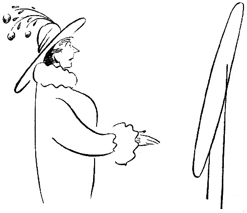

<h2>Ein Hut.</h2>

Wenn sich ein Mann einen Hut kaufen will, dann
geht er in einen Laden, in dem Hüte verkauft werden.

Mit entschuldigendem und scheuem Blick setzt er den
verschimmelten, verbeulten, mottigen Stoffetzen, den er
auf dem Kopf trägt, ab und sagt zu dem Verkäufer:

»Darf ich mir vielleicht einen Hut aussuchen?«

Dann holt der Verkäufer eine große, schwere, runde
Maschine und stülpt sie dem Mann auf den Kopf, so
daß der Mann auf einen Stuhl sinkt, weil ihm ist, als
<@pagebreak/>
wenn er einen Berg auf dem Kopfe hätte. Dann drückt
der Verkäufer auf eine Feder, so daß es in dem Kopf
des Mannes knackt, und dann sagt der Verkäufer:

»58!«

Er kann auch 63 sagen, aber dann ist es ein ungewöhnlich
dicker Kopf.

Hierauf bekommt der Mann einen Hut, der ihm genau
paßt, nachdem er (der Hut) umgepreßt und nach
allen Richtungen gezerrt worden ist und noch Korkstreifen
und zusammengekniffte alte Zeitungen hinter den
Schweißriemen gelegt worden sind.

Wenn der Mann auf die Straße gekommen ist, fliegt
ihm der Hut vom Kopf, und wenn er nach Hause gekommen
ist, legt er ihn auf einen Stuhl und setzt sich
drauf. Das wiederholt sich ziemlich häufig, zwei Jahr
lang, bis der Mann merkt, daß seine Wechsel nicht mehr
diskontiert werden. Dann borgt er sich 10 Kronen
von einem Freund und kauft sich einen neuen Hut.

So macht es ein Mann. Aber wie macht es eine
Frau? Z.&nbsp;B. meine Frau? —

Wir frühstückten neulich zusammen, ein ernstes,
schweigsames Frühstück, denn morgens ist niemand zu
Scherzen aufgelegt. Schweigend macht man sein Programm
für die Taten des Tages.

Beim Kaffee sagte meine Frau:

»Ich wollte Dich um etwas bitten. Ich brauche einen
neuen Hut.«

»Ja, weil es jetzt vierzehn Tage her ist, daß Du
Dir einen gekauft hast.«

<@pagebreak/>
»Ich habe mir seit dem Frühjahr keinen neuen Hut
gekauft. Ich kann doch im Winter keinen Sommerhut
tragen. Oder möchtest Du das?«

»Ich habe nichts dagegen. Ich trage keinen besonderen
Hut im Winter.«

»Du trägst keinen Strohhut im Winter.«

»Nein, aber vielleicht möchtest Du, daß ich es tue.
So daß die Leute sich amüsieren und ich mich erkälte.«

Pause.

Ich: »Was kostet denn ein neuer Hut?«

»Ich hatte mir gedacht, daß ich mir eine Form machen
lasse und dann meine alte Feder benutze.«

»Ich will wissen, was das kostet.«

»Das weiß ich nicht.«

»Dann gehe ich mit und kaufe den Hut. Es gibt
einfache, wirklich geschmackvolle und preiswerte Hüte.
Wir wollen so einen kaufen. Wir treffen uns um vier
Uhr vor Skillts Putzgeschäft.«

Wir trafen uns. Und tief ernst gingen wir hinein.

Das Putzgeschäft war voll mit Damen, die Hüte
aufprobierten, und während sie sie ausprobierten, sprachen
sie von Hüten, die sie früher gehabt hatten, von Federn
und Pleureusen und Schleifen.

Vor einem Spiegel stand Fräulein Nyqvist vom Theater,
die ich sehr bewundere. Sie probierte einen entzückenden
Pelzhut mit etwas rotem Samt auf. Ich
grüßte, denn ich habe Fräulein Nyqvist bei einem Diner
des Theaterdirektors kennen gelernt, und Fräulein Nyqvist
war gleich sehr erfreut und sagte:

<@pagebreak/>
»Wie nett! Jetzt können Sie mir aussuchen helfen!
Steht mir dieser? Finden Sie, daß er zu groß ist?
Soll ich das Rote dran lassen? Oder eine einfache
Feder nehmen?«

»Der ist großartig,« sagte ich. »Einfach wundervoll.
Man kann sich nichts Geschmackvolleres denken. Der
steht Ihnen vorzüglich.«

»Ja, aber er kostet 85 Kronen.«

»Das ist kein Preis für so einen Hut.«

Die Verkäuferin warf mir einen freundlichen Blick
zu, und in demselben Augenblick fühlte ich ein Kneifen
in meinem rechten Arm, ein hartes und energisches
Kneifen, und dann hörte ich meine Frau:

»Ich dachte, Du bist mitgegangen, um mir einen
Hut zu kaufen!«

»Sofort,« erwiderte ich und wandte mich an die Putzmacherin.

»Können wir einen einfachen und billigen Hut sehen,
aber geschmackvoll?«

Wir sahen uns einen einfachen und billigen Hut an.
Er war auch sehr geschmackvoll für einen Elefanten
oder ein jüngeres Nilpferd, das Sonntags am Nil kokettieren
will.

Meine Frau warf ihn hinter den Ladentisch.

Wir probierten einen anderen Hut auf.

»Der sitzt ja verkehrt herum,« sagte ich.

»Nein, der sitzt richtig,« sagte die Verkäuferin.

»Dann sitzt er nicht auf dem richtigen Kopf,« sagte ich.

Und dann warfen wir den auch hinter den Ladentisch.

<@pagebreak/>
Der nächste Hut.

Das war ein sehr hübscher Hut. Sehr einfach, aber
schick.

»Das ist der richtige Hut,« sagte ich. »Der steht
Dir. Den nehmen wir. Was kostet der?«

»185 Kronen,« sagte die Verkäuferin.

Ich ging auf die Straße und holte fünfmal tief Atem,
und dann ging ich wieder hinein.

Ein anderer Hut wurde aufprobiert.

»Der ist ausgezeichnet,« sagte ich. »Er paßt zu
Deinen Augen und Deinem Mund und Deinem Teint
und Deinem Haar, aber nicht zu Deiner Nase. Es
kommt sehr darauf an, wie ein Hut zur Nase paßt.
Eine etwas stülpnasige Person kann nicht jeden ixbeliebigen
Hut tragen.«

»Stülpnasig??!!« sagte meine Frau, und wir gingen
zu einem andern Hut über.

Wir gingen zu achtzehn andern Hüten über. Keiner
paßt. Das heißt, es ist möglich, daß alle paßten, aber
ich hatte vielleicht die unrichtige Frau für sämtliche achtzehn
Hüte mitgenommen.

Wir setzten uns, um uns auszuruhen, und dann begannen
wir von neuem.

Schließlich kauften wir den Hut, den wir zuerst aufprobiert
hatten, und dann gingen wir nach Hause, müde
und verdrossen.

Als wir in die Hauptstraße gekommen waren, trafen
wir Olga. Olga hatte genau denselben Hut auf wie
meine Frau.

<@pagebreak/>
»Hast Du gesehen, daß die Person denselben Hut auf
hatte wie ich?« sagte meine Frau.

»Er war ziemlich ähnlich,« antwortete ich.

»Es war derselbe Hut! Ich kann nicht denselben
Hut tragen wie die.«

»Ich kenne viele Herren, die denselben Hut tragen
wie ich.«

Acht Stunden Pause.

Am nächsten Tage verkaufte meine Frau den neuen
Hut an das Fräulein im Bäckerladen für 15 Kronen,
auf Abschlagszahlung. Und morgen will sie sich einen
neuen Hut kaufen.

Ich habe schon mit einem Dienstmann gesprochen,
der mitgehen soll. Er soll 2 Kronen pro Stunde haben,
eine Kiste Zigarren und 5 Kronen extra, wenn der Hut
billiger als 45 Kronen ist.

Später kann seine Frau den Hut bekommen.

Wahrscheinlich schon im nächsten Monat.

O, Ihr Frauen!

<@pagebreak/>

<h2>Der Badewannenhahn.</h2>

Adolph Blom lag im Bett und las die Morgenzeitung.
Seine Frau, die ziemlich früh aufsteht, weil sie zeitiger
schlafen geht als Blom, kam herein und sagte:

»Der Hahn im Badezimmer läuft.«

Blom hörte wohl, was seine Frau sagte, aber wenn
Blom die Zeitung liest, darf er nicht gestört werden.
Er las also den Artikel über den drohenden Kohlenmangel
zu Ende, legte dann die Zeitung fort und sagte:

<@pagebreak/>
»Mir war, als wenn Du etwas gesagt hättest.«

»Ich habe gesagt, daß der Hahn im Badezimmer läuft.«

»Dann wird wohl jemand dran gewesen sein.«

»Ich nicht,« sagte Frau Blom, »ich habe seit Donnerstag
nicht gebadet.«

»Ein Hahn geht nicht von selber kaputt,« sagte Herr
Blom und ging im bloßen Hemd nach dem Badezimmer.
Es tropfte vom Hahn in die Wanne. Blom hielt die
Hand unter und fühlte, daß es tropfte.

»Wollen wir einen Rohrleger herkommen lassen?«
fragte Frau Blom.

»Einen Rohrleger, — so’n Mensch kommt erst in
acht Tagen. Hol mal meinen Patentschlüssel, dann
werde ich die Mutter ein bißchen anziehen.«

»Patentschlüssel?!?!«

Herr Blom sah seine Frau an, dann sagte er:

»Ein Patentschlüssel ist ein Schraubenschlüssel, der
durch das Verstellen eines seiner Teile in verschiedene
Lagen gebracht werden kann. Diese Patentschlüssel sind
im höchsten Grade praktisch. Man kann sie bei den
verschiedensten Gelegenheiten verwenden, und sie passen
für alle Muttern. Bitte such’ meinen Patentschlüssel!«

»Bester Adolph, — sei nicht böse, — aber ich habe
nie solchen Schlüssel gesehen, — ich weiß nicht —«

Blom ging selbst, um den Schlüssel zu holen. Er
suchte ihn im Werkzeugkasten und fand ihn unter dem
Schreibtisch. Er ging ins Badezimmer zurück. Die
Familie war versammelt. Ein Regisseur beim Königlichen
Dramatischen Theater hätte sie nicht besser gruppieren
<@pagebreak/>
können. Der acht Jahre alte Karl-Erik war
der Wanne am nächsten. Frau Blom stand neben ihm,
und hinter ihnen stand Albertina, das Dienstmädchen,
mit einem Milchtopf in der Hand, denn sie war im
Milchladen gewesen.

Herr Blom setzte sich auf den Rand der Wanne,
legte den Schraubenschlüssel um die Hahnmutter und
drehte. Die Mutter bewegte sich nicht. Sie saß fest.

»Du mußt fester anziehen, Adolph,« sagte Frau Blom.

Adolph zog fester an. Als er über den Rand der
Wanne guckte, in die er hineingefallen war, hörte er
einen Schrei des Entsetzens. Der Patentschlüssel war
Karl-Erik mitten in die Stirn geflogen, und der Junge
schrie entsprechend.

»Immer steht Ihr im Wege,« sagte Blom.

»Tue Dir etwas Kaltes drauf,« sagte Albertina.

»Holen Sie doch Butter, Menschenskind, und stehen
Sie nicht da und gaffen! Dann wird es keine Beule!«
schrie Frau Blom.

Herr Blom blieb allein im Badezimmer. Er stieg
aus der Badewanne und fixierte den tropfenden Hahn
wie ein Boxer, ehe er auf seinen Gegner losgeht. Er
war ernst, ruhig und beherrscht. Er sagte sich:

»Wenn ein Hahn tropft, dann ist der Hahn entzwei;
am besten ist es also, den ganzen Hahn abzuschrauben
und zu untersuchen, wo der Fehler steckt.«

Blom praktizierte den Patentschlüssel wieder auf die
Mutter und drehte in der anderen Richtung. Das ging
leichter. Er schraubte den ganzen Hahn los, und im
<@pagebreak/>
Augenblick brauste das Wasser mit dickem Strahl aus
dem Rohr mitten ins Badezimmer hinein.

»He! Halloh! Herkommen!!!«

Albertine kam. Sie hielt die Hand vors Gesicht,
denn sie hatte Angst vor dem Patentschlüssel.

»Holen Sie etwas, was man ins Rohr stopfen kann,«
schrie Blom. »Sonst gibt’s eine Überschwemmung!«

Albertine rannte davon und kam mit einem Bierflaschenkorken
zurück.

»Rufen Sie meine Frau,« schrie Blom, »denken Sie,
man kann Bierflaschenkorken in ein Rohr stecken, das
dicker ist als eine Riesenschlange?!«

»Lieber, guter Herr Blom, seien Sie nicht böse!«
wimmerte Albertina, und dann kam Frau Blom.

Das Wasser strömte über den Fußboden des Badezimmers.
Frau Blom schürzte ihre Röcke hoch und sagte:

»Wenn Du die Hand vorhältst, Adolph, dann werde
ich nach dem Rohrleger telephonieren!«

Blom überlegte nicht —, er drückte die Hand auf
das Loch und hielt das Wasser etwas zurück. Das
Wasser war kalt, und die Hand wurde ihm bald steif.

Frau Blom kam wieder und meldete: »Vor morgen
früh kann kein Rohrleger hier sein.«

»Klingle beim Wirt an,« schrie Blom, »klingle bei
den Wasserwerken an, klingle beim Magistrat an,
klingle überall an, sage, daß sie das ganze Stadtviertel
abstellen sollen! Und stehe mir nicht im Wege, ich
muß die Hand wechseln!«

Frau Blom klingelte bei einer neuen Rohrlegerfirma
<@pagebreak/>
an. Sie weinte und flehte, und die Firma versprach
ihr, sofort einen Arbeiter zu schicken. Dieser Arbeiter
kam nach zwei Stunden sofort.

Blom hatte inzwischen 630mal die Hand gewechselt
und drei Pilsener getrunken. Albertina hatte gekündigt,
und Frau Blom ging zwischen dem Badezimmer und
der Entréetür hin und her und tröstete und ermunterte
und rang die Hände.

Im Schlafzimmer saß Karl-Erik und drückte ein
blankes Einkronenstück, das er von seiner Mutter bekommen
hatte, gegen die Stirn; es ertrug sich leichter so.

Der Arbeiter der Rohrlegerfirma kam. Frau Blom
wäre ihm um den Hals gefallen und hätte ihn geküßt,
wenn sie nicht so gut erzogen gewesen wäre,

Der Mann ging schnurstracks in das Badezimmer,
schloß die Tür hinter sich, sah Herrn Blom ein
Weilchen an, stellte sich dann auf den Rand der Wanne
und schraubte an einem Hahn, der etwas höher auf
dem Rohr saß, worauf das Wasser aufhörte zu laufen.

»Das hätten Sie auch allein machen können!« sagte
der Arbeiter der Rohrlegerfirma.

Blom überlegte einen Augenblick, dann ging er ins
Schlafzimmer, nahm die Krone von Karl-Eriks Stirn,
gab sie dem Rohrleger und sagte:

»Hier haben Sie. Aber sagen Sie nichts meiner Frau.«

Worauf Blom den Hahn, den er abgeschraubt hatte,
wieder anschraubte, den oberen Hahn wieder öffnete
und sich überzeugte, daß es genau so tropfte wie vorher.
Da kroch er ins Bett.

<@pagebreak/>

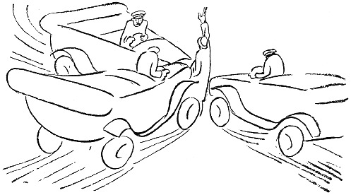

<h2>Der Hexenschuß.</h2>

Vor ein paar Tagen bekam ich einen Hexenschuß. Das
ist das Wenigste, was man in so kriegerischen Zeiten
verlangen kann. Ich bekam ihn auf der Straße, ohne vorherige
Warnung, und ich stand plötzlich ganz unbeweglich.

Mein erster Gedanke war: »Der Rücken ist mir auseinandergegangen!
Wenn ich ein bißchen warte, wächst
er vielleicht wieder zusammen!«

Ich stand mitten auf der Straße, mitten im Verkehr.
Straßenbahnwagen rollten, Autos jagten umher, Menschen
drängten sich, und Jungens radelten. Ein Auto
kam gerade auf mich zu, und hinter mir kam auch eins.
Ich dachte: »Wenn ich die rechte Hand hochstrecke,
halten sie vielleicht! Die Schutzleute machen es hier
so und in Berlin auch.«

<@pagebreak/>
Ich hielt den Arm hoch, und die Autos blieben
stehen. Ich hörte die Chauffeure rufen: »Was ist denn
los! Zum Donnerwetter, was will denn der?«

Ich versuchte, mich zurückzuziehen, zu gehen, aber es
gelang mir nicht. Noch ein Auto hielt, und dessen
Chauffeur rief: »Gehen Sie aus dem Weg! Ich muß
nach dem Zentralbahnhof, 12 Uhr 40!«

Meine rechte Hand erschlaffte, und ich dachte: »Jetzt
gilt es, stattdessen die linke hoch zu bekommen! Ehe
sie sich in Bewegung setzen!«

Zu spät — — die drei Autos fuhren mich um.

Der Verkehr stockte aufs neue, und einer der drei
Chauffeure kam zu mir heran. »Leben Sie?« fragte er.

»Noch ja,« sagte ich. »Aber lassen Sie sich durch mich
nicht stören. Ich habe einen Hexenschuß und kann mich sowieso
nicht bewegen. Ich bitte die Herren vielmals um Entschuldigung
und will natürlich die Kosten für alles tragen.«

»Ich muß nach dem Zentralbahnhof, 12 Uhr 40!«
sagte der dritte Chauffeur.

»Ich weiß,« sagte ich, »lassen Sie die Fahrgäste
meinetwegen nicht warten!«

Der andere Chauffeur sah mich an. Er sah freundlich
aus. Dann kam er auf mich zu, hob mich auf
und legte mich auf den Rücksitz in seinem Auto. Ich
gab ihm meine Adresse, und er fuhr mich nach Hause.
Er war so liebenswürdig, mich die Treppen hinaufzutragen.
Meine Frau öffnete, und als sie mich in den
Armen des freundlichen Chauffeurs sah, sagte sie: »Wie
spät ist es denn eigentlich?«

<@pagebreak/>
Ich habe lange überlegt, warum sie das wissen wollte.
Der Chauffeur trug mich hinein und setzte mich auf
einen Stuhl. Und als er fort war, sagte meine Frau:

»Kannst Du denn nicht gehen?«

»Doch,« erwiderte ich, »aber ich kann doch auch
mal auf Händen getragen werden. Ein auf Händen
getragener Schriftsteller — — —«

Meine Frau ging hinaus und weinte. Da klingelte
das Telephon. Das hing in Reichweite, und ich meldete
mich. Es war mein Freund B.

»Ich habe einen Hexenschuß,« sagte ich, »— kann
nicht gehen.« — »Ach,« sagte B., »den habe ich schon
häufig gehabt. Du mußt Antophontabletten nehmen,
dann bist du bald wieder auf dem Posten. Das ist
das einzige, was hilft.«

Nach einer Weile kam eine Frau herauf, die eine
Treppe tiefer wohnt. Sie hätte gehört, daß ich überfallen
und von zwei dänischen Juwelendieben beraubt
und von drei Schutzleuten nach Hause gebracht worden
wäre. Sie hätte auch erfahren, daß ich einen Hexenschuß
habe. Sie sagte:

»Mein Mann hat auch oft einen Hexenschuß. Oft
hat er einen Hexenschuß. Er legt dann Termogenwatte
auf. Termogenwatte legt er dann auf. Termogenwatte
ist das Beste gegen Hexenschuß. Gegen Hexenschuß ist
Termogenwatte das Beste.«

»Vielen Dank«, sagte ich. »Ich werde mir Termogenwatte
besorgen, Termogenwatte werde ich mir besorgen.«

Gleich darauf kam mein Freund, der Jäger.

<@pagebreak/>
»Hahaha«, sagte er. »Hexenschuß! Den habe ich
jeden Monat. Dann kann ich nicht mal die Augenbrauen
bewegen, so verflixt weh tut das! Aber es
gibt ein Mittel, nur eins, und das ist ein Katzenfell!
Du legst ein Katzenfell auf den Rücken, und über
Nacht bist Du wieder gesund.«

Da nahm ich Antophontabletten, legte Termogenwatte
auf den Rücken und wurde so gesund, daß ich in langsamem
Tempo ausgehen und mir ein Katzenfell besorgen konnte.

Ich ging in ein Ledergeschäft. Der Kommis war
eine junge, blonde Dame. Sie sah mich forschend an
und sagte: »Wozu soll das Fell sein?«

Ich errötete und sagte: »Ich wollte es bloß zum
Vergnügen haben. Ein Katzenfell kann man doch immer
gebrauchen.«

Dann brachte sie Katzenfelle. Sie hatten verschiedene
Farben: schwarz, grau und schwarzweiß.

»Was kosten diese Katzenfelle?« fragte ich.

»6,50,« sagte die Dame.

»Das ist teuer,« sagte ich. »Sie müssen wissen, mein
Fräulein, es braucht keine Rassenkatze oder eine Katze
mit besonders vornehmem Stammbaum zu sein. Ich
bin mit einer ganz gewöhnlichen Katze zufrieden. Die
einfache schwedische Hauskatze genügt mir.«

»Solche Katzenfelle führen wir nicht«, sagte die junge
Dame und stellte den Karton weg.

»Verzeihung«, sagte ich und kroch nach einem anderen
Geschäft, einem richtigen Pelzwarengeschäft. Da war
ein Herr, der bediente:

<@pagebreak/>
»Katzenfelle?« sagte er, wie nachsinnend; »Katzenfelle
das ist nicht mehr modern. Jetzt muß es Skunks sein.«

»Auch fürs Kreuz?« sagte ich. »Gegen Hexenschuß?«

»Soso«, sagte er, »solch ein Katzenfell? Das haben
wir für 2,50.«

Ich bekam das Fell. Es war weiß mit einem
schwarzen Fleck mitten auf dem Rücken.

»Arme Katze,« dachte ich, »du mußt wie ein bunter
Hund bekannt gewesen sein. Wie viele Steine und
alte Stiefel und Gummischuhe sind in deinem Leben
über dich hergerasselt! Aber jetzt hast du deine Bestimmung
erfüllt.«

Ich humpelte nach Hause und legte das Fell dahin,
wo es liegen sollte. Es blieb zehn Minuten liegen,
dann rutschte es in die Kniekehlen. Katzenfell ist glatt.

Ich war an diesem Tage zu Tisch geladen, und dann
und wann mußte ich den Gastgeber flüsternd bitten,
allein sein zu dürfen. Als ich auf diese Weise sechsmal
im Schlafzimmer gewesen und einmal von der
Dame des Hauses überrascht worden war, die sehr erstaunt
schien, als Sie mich halbnackt, mit einem Katzenfell
in der Hand, erblickte, sah ich ein, daß ich möglichst
unbemerkt nach Hause gehen mußte. Das gelang mir.

Ich kam auf die Straße, ohne daß mich jemand
gesehen hatte. Als ich ein Stück gegangen war, begegnete
ich einem großen Hund. Er blieb mit einem
Ruck stehen. Der Schwanz hob sich, und er knurrte
dumpf.

»Na, na,« sagte ich, »Freundchen!« Wie man so
<@pagebreak/>
zu Hunden zu sagen pflegt. Aber er knurrte weiter und kam
näher. Er schnupperte mit der Schnauze, und ich verstand,
daß er die »Fährte« des Katzenfell gefunden hatte.

»Freundchen,« sagte ich freundlich, »das ist eine tote
Katze, eine durch und durch tote Katze, also nichts von
Bedeutung!«

Da kam noch ein Hund. Das war ein Terrier.
Er bellte aus vollem Halse, und alle beide begannen,
um mich herumzuspringen und zu hüpfen. Ich ging
die Straße geradeaus, und je weiter ich ging, desto
mehr Hunde kamen. Ich konnte bis acht Stück zählen,
als ich die elektrische Lampe eines Kinos entdeckte.

Da flitzte ich hinein und fühlte plötzlich, daß das
Katzenfell von meinem Kreuz verschwunden war.

Ich erstand eine Karte zu einem der hinteren Plätze,
und es war dunkel im Zuschauerraum, als ich mich
setzte. Draußen hörte ich die Hunde bellen.

Ich kam mitten in ein Drama. Ein junger Mensch
saß an seinem Schreibtisch und schrieb folgendes, das
auf der Leinwand erschien:

»Ich libe dich, und wen ich dich nicht bekome, töte
ich mich. Dein Teudor.«

Gleich darauf wurde es hell, denn es war Pause.
Ich sah mich um. Hinter mir saß ein junges Mädchen
mit ihrer Mutter. Sie (das Mädchen) war süß. Nach
einer Weile hörte ich die Mutter sagen: »Das ist doch
wirklich unanständig!«

Das Drama unanständig, dachte ich. Vielleicht
schickt es sich nicht für meine Tugend.

<@pagebreak/>
»Ich finde es furchtbar«, sagte die Tochter. Wollen
wir gehen?«

Dann wurde ich ruhig, und ich fühlte, daß mir jemand
auf den Rücken tippte. Ich drehte mich schnell um und
blickte gerade in das erregte Gesicht der Mutter.

»Schämen sollten Sie sich!« sagte sie.

»Ich verstehe nicht«, sagte ich.

»Oh, ich bitte«, sagte die alte Dame, »das weiß ich
wohl! Wenn man in solcher Verfassung ist, dann soll
man nicht unter Leute gehen! Das meine ich!«

Ich spürte etwas, das mich im Genick kitzelte. Ich
faßte mit der Hand hin. Der Katzenschwanz ragte
zwischen Kragen und Hals heraus!!!

Die Alte glaubte, es wäre mein Hemdzipfel.

»Verzeihung,« sagte ich, ohne zu wagen, die junge
Tochter anzusehen, »es ist wirklich nicht mein Hemdzipfel!«

»Um so merkwürdiger«, sagte die Mutter; »komm,
Greta, wir gehen! Solche Geschmacklosigkeiten kann ich
nicht länger mit ansehen!«

Ich sah mir das Drama bis zum Schluß an —
Teudor bekam seine Geliebte — und als ich auf die
Straße kam, riß ich das Katzenfell am Genick entlang
heraus, warf es den wartenden, heulenden Hunden hin
und lief nach Hause. — Und der Hexenschuß war
ebenso schnell verschwunden, wie er gekommen war.

<@pagebreak/>

<h2>Die Hosenträger.</h2>

Richard und Georg kamen gleichzeitig in der Stadt
an und gingen in dasselbe Hotel. Es war ein kleines
Hotel von gutem Ruf.

Als die beiden sich morgens anzogen — sie hatten
ein gemeinschaftliches Zimmer —, sagte Georg:

»Was für Hosenträger hast Du denn da eigentlich?
Die sind ja entsetzlich!!!«

Richard besah sich seine Hosenträger. Ja, die waren
alt und häßlich.

»Lieber Freund,« sagte er dann, »das stimmt schon,
was Du da sagst, das sind abscheulich gewöhnliche Träger.
Das war mir bis jetzt gar nicht aufgefallen. Ich habe
sie an- und ausgezogen und nie richtig angesehen, aber
Du hast recht — sie sind entsetzlich.«

»Warte gefälligst einen Augenblick, dann hole ich
Dir ein Paar neue.«

Darauf ging Georg fort und kam gleich danach mit
einem Paar sehr feiner Hosenträger zurück. Sie waren
aus schwarzer Seide mit Goldbeschlägen, und Richard
dankte vielmals für das schöne Geschenk.

Dann knöpfte sich Richard die schönen, neuen Träger
an, und da das Fenster offen stand, warf er die alten
hinaus. Sie fielen auf die Straße.

Georg und Richard waren gerade fertig und wollten
<@pagebreak/>
zum Frühstück gehen, als es klopfte und ein junges
Zimmermädchen hereinkam. Sie trug Richards Hosenträger
in der Hand und sagte: »Hat einer der Herren
vielleicht die Hosenträger auf die Straße fallen lassen?
Ich habe sie eben herunterfallen sehen.«

Richard putzte einen Augenblick emsig seine Augengläser,
dann sagte er mit ernster Miene:

»Ich verstehe nicht, was Sie meinen. Ein Paar Hosenträger
aus dem Fenster fallen lassen?! Wie kann man
ein Paar Hosenträger durchs Fenster fallen lassen!
Was wollen Sie eigentlich? Kommen da mit einer
Beschuldigung zu uns herein! Hosenträger! Zeigen
Sie mal! Überhaupt was für welche! Mach mal
Deine Weste auf, Georg — nur die oberen Knöpfe —,
und zeige diesem werten Fräulein, daß Du ein Paar
Hosenträger hast! Und sehen Sie hier — habe ich
nicht auch welche? Ein Paar schwarze Seidenträger
mit Goldbeschlägen? Und da sollen wir solche Hosenträger
verloren haben? Rufen Sie mir den Portier!
Sofort!«

Das arme Zimmermädchen verschwand, blaß und erschrocken,
und der Portier kam die Treppen heraufgestürzt.

Richard hatte schon Hut und Mantel an. Er legte
beides wieder ab und forderte den Portier zum Sitzen
auf. Der Portier lehnte aber ab. Da schob Georg
einen Stuhl hinter ihn, und Richard zwang ihn zum Sitzen.

»Hier passieren ja wunderliche Sachen in Ihrem
Hotel! Gestern Abend kehren wir auf Empfehlung eines
guten Freundes hier ein — einfach fatal — und glauben,
<@pagebreak/>
daß es ein besseres Hotel ist. Wir nehmen ein Zimmer
zusammen, gehen abends noch aus, kommen früh zurück,
gehen zu Bett, schlafen gut, wachen morgens fröhlich
auf und ziehen uns an. Als wir fertig sind, kommt
ein Mädchen herein und sagt, daß wir ein Paar alte,
zerrissene, schmutzige Hosenträger haben auf die Straße
fallen lassen. Mein Herr, ich bin Maler, ich habe fünf
Jahre gearbeitet, ich habe sechzehn Bilder auf der Ausstellung,
und das hier ist mein Freund. Wie darf hier
jemand hereinkommen und uns beschuldigen, daß das
unsere Hosenträger sind!!«

Der Portier erhob sich. Georg aber drückte ihn
wieder auf den Stuhl. Der Portier:

»Die Sache ist ein bedauerlicher Irrtum, ich bitte
die Herren vielmals um Entschuldigung!«

»Natürlich! Erst wirft man uns etwas vor, was
nicht zu beweisen ist, und dann sollen wir sofort entschuldigen,
daß man uns beleidigt. Wir denken nicht
daran, das zu dulden! Mach deine Weste auf, Georg,
und zeige, daß Du ein Paar Hosenträger hast — nur
die oberen Knöpfe, Georg —, und sehen Sie hierher,
habe ich nicht ein Paar schwarzseidene Hosenträger mit
Goldbeschlägen? — Nein, mein Bester! Das geht zu
weit! Geben Sie mir meine Rechnung! Ich will bezahlen!
Ich will fort von hier! Bitte, besorgen Sie
ein Auto! Sofort! Tragen Sie unsere Sachen hinunter!«

Fassungslos und vollkommen gedemütigt blickte der
Portier auf die beiden beleidigten Gäste. Er wollte
den Mund auftun, um abermals eine Entschuldigung
<@pagebreak/>
zu stammeln. Aber Georg schnitt ihm mit einer großartigen
Geste das Wort ab.

»Bemühen Sie sich nicht weiter. Die Sache ist erledigt.«

Der bedauernswerte Portier zuckte die Achseln und
entfernte sich mit einem sehr roten Gesicht, in jeder Hand
einen Koffer.

Georg blickte ihm triumphierend nach.

»Das wäre ja noch schöner, wenn man sich derartige
Beleidigungen gefallen ließe.

Das Auto kam, und Georg und Richard fuhren fort.
Sie fuhren nach dem »Grand«. Da nahmen sie sich
zusammen ein Zimmer im dritten Stock.

Es war ein schöner Vormittag, und die Sonne brannte
ins Zimmer hinein. Und Georg sagte: »Wollen wir
ein bißchen Baccarat spielen?«

»Meinetwegen!« sagte Richard.

Da klopfte es. Ein Kellner kam herein und gab
ein Paket ab. Richard öffnete es.

Seine alten Hosenträger!

An der einen Öse war eine Karte befestigt, und auf
der Karte stand:

»Ich sende Ihnen hiermit Ihre Hosenträger. Da
Ihr Name darauf steht, weiß ich, daß es Ihre sind.

Mit Hochachtung

Erland Johansson, Portier.«

»Das ist gut!« lachte Richard.

Der Kellner ging, und da das Fenster offen stand,
warf Richard die alten Hosenträger wieder hinaus.

<@pagebreak/>
Dann setzen sich die beiden seelenruhig hin und spielten
Baccarat.

Und die alten Hosenträger fielen hinunter durch die
schöne Frühlingsluft und sanken still und leise auf einen
großen, wunderschönen Frühlingshut, der von einem
jungen Mädchen getragen wurde.

Sie hatte eine Verabredung mit ihrem Geliebten, um
den sich all ihre Gedanken drehten. Sie merkte wohl,
daß etwas auf ihren Hut gefallen war, da sie aber nichts
weiter davon sah und fühlte, beachtete sie es auch nicht
besonders.

Gleich darauf traf sie ihren Geliebten. Ihre Augen
strahlten vor Freude.

»Wie wunderschön es heute ist,« sagte sie.

»Ja, wunderschön,« sagte er.

Dann gingen sie Seite an Seite weiter. Als sie
aber ein Stück gegangen waren, erblickte er die Hosenträger.

Er blieb stehen und sagte:

»Was hast Du denn da auf Deinem Hut?«

»Das ist ja mein neuer Frühlingshut,« sagte sie und
lächelte.

Er reckte sich in die Höhe und nahm die Träger
herunter. Sie standen beide ganz still; dann sagte sie:

»Das sind ja ein Paar Hosenträger?! Wie sind die
bloß auf meinen Hut gekommen?«

»Das ist ja sehr merkwürdig!« sagte er ernst. »Hast
Du sie denn nicht gesehen, als Du den Hut aufgesetzt hast?«

»Was soll denn das heißen?«

<@pagebreak/>
»Nun — es liegen doch nicht ein Paar Hosenträger
auf einem Damenhut, ohne daß die betreffende Dame
den Mann dazu kennt! Wer ist es?!«

»Aber Artur!«

Er hielt die Hosenträger hoch in die Luft und sagte:

»Das ist der offenbarste Betrug, den ich je erlebt habe!«

Dann warf er die Hosenträger von der Brücke, auf
der sie gerade standen, ins Wasser hinunter und ging
allein fort.

Und das junge Mädchen faßte sich mit beiden Händen
an den Kopf, und seine blauen Augen leuchteten und
flimmerten von tausend Fragen.

Die Hosenträger schwammen ihren Weg weiter. Dann
sanken sie auf den Boden, auf den schmutzigen Boden.

Und Georg gewann inzwischen von Richard im
Baccarat die fünf Kronen, die die schwarzseidenen Hosenträger
gekostet hatten.

<@pagebreak/>

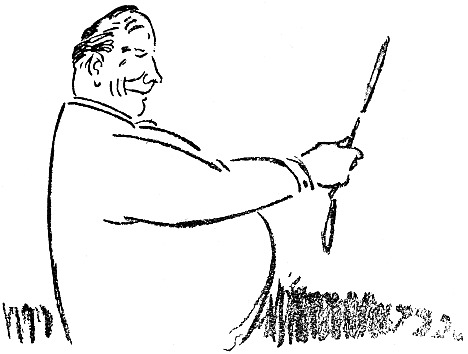

<h2>Das fröhliche Lächeln.</h2>

Jüngst erhielt ich ein Büchelchen mit dem Titel
»Hygienische Morgentoilette« von einem Sanitätsrat
Sperling.

Das Büchelchen enthielt ein neues Turnsystem, dessen
Vorteil in seiner Bequemlichkeit lag — alle Bewegungen
werden im Bette, liegend, ausgeführt, gleich nach dem
Erwachen. Kein Laufen, kein Abrackern am Reck, keine
Sprünge usw.; denn so etwas bringen wir ja heute
nur schwer fertig. Jetzt wollen wir lieber ein Turnen
<@pagebreak/>
im Liegen haben, und in einigen Jahren sind wir
hoffentlich so weit, daß wir uns darauf beschränken,
uns die verschiedenen Bewegungen nur zu denken, und
schon dabei gedeihen.

Also das System des Sanitätsrats Sperling gipfelte
in einer Übung, die bisher im Turnen unbekannt war:

»Wenn Du das System im Bette ausgeführt hast,
dann stehe auf, gehe vor einen Spiegel und nimm ein
fröhliches Aussehen an. Behalte dieses Aussehen
während des Tages — was auch geschehen mag!«

Als ich den Paragraphen zweimal durchstudiert hatte,
begriff ich, daß er mehr wert war als sämtliche Bewegungen
miteinander. Wer fröhlich ist, der ist auch gesund,
und man kann natürlich fröhlich sein — wenn
man sich nur dazu entschließt.

Ich entschloß mich also für die Fröhlichkeit. Ich
formte meinen Mund zu einem Lächeln, einem ungezwungenen
Lächeln, gewinnend, sympathisch, und ich
strich die Falte zwischen meinen Augen weg.

Ich sah aus, als hätte ich in der Lotterie gewonnen,
oder als hätte mein Feind — nicht gewonnen. Nach
einer Weile spannte es im Gesicht, aber ich hielt aus,
und mit freundlichem Lächeln und fröhlichen Augen
trat ich an den Frühstückstisch.

Meine Familie war vollzählig versammelt. Meine
Söhne stießen sich neckisch mit den Füßen unter dem
Tisch an, und meine Frau strich gerade ein Butterbrot
für meine Tochter, die auf einem Stuhl stand und eben
eine Tasse Schokolade umwarf.

<@pagebreak/>
Ich behielt die freundliche Maske bei. Meine Frau
sah mich mit großem Erstaunen an und sagte:

»Du siehst ja so komisch aus, ist Dir nicht wohl?«

»Ausgezeichnet«, sagte ich und lächelte strahlend.

Meine Söhne sahen mich an, und meine Tochter
sah mich auch an, und ihre Augen wurden groß vor
Erstaunen — solch eine Morgenlaune hatten sie noch
nie bei ihrem Vater gesehen. Nach einer Weile sagte
meine Frau:

»Der Gasmann kommt heute. Es macht 56 Kronen.«

»Ich schwärme für Gasleute, und 56 Kronen ist billig.«

Meine Frau erbleichte. Das war ihr neu. Sie
fügte schnell hinzu: »Und dann muß ich der Schneiderin
130 Kronen bezahlen.«

»Natürlich mußt Du das«, sagte ich. »Ich habe mich
schon danach gesehnt, Dir das Geld dazu zu geben.«

Wir aßen unser Frühstück unter allgemeiner Fröhlichkeit,
und als ich fortging, gab mir meine Familie unter
Hurrarufen die Treppe hinunter das Geleit.

Ich bestieg eine Elektrische, um nach meinem Bureau
zu fahren. Der Wagen leuchtete ordentlich auf vor
Freude, als ich einstieg.

Ein alter Bekannter, den ich jahrelang nicht gesehen
hatte, kam herein und setzte sich neben mich.

»Guten Tag, guten Tag, wie geht’s Dir, Du siehst
ja so vergnügt aus? Ist Dir was Spaßiges passiert?«

»I bewahre,« sagte ich, »man kann doch auch vergnügt
aussehen, ohne es zu sein!«

»Soso, das ist mir neu.«

<@pagebreak/>
»Ja,« sagte ich, »es gibt ja doch auch Menschen, die
intelligent aussehen, ohne es zu sein.«

Mein alter Bekannter zuckte zusammen und sagte:

»Versuche nur nicht, witzig zu sein! Das sollte wohl
ein Hieb für mich sein?!«

»Ich habe nie behauptet, daß Du intelligent aussiehst«,
sagte ich und lächelte genau so freundlich wie
vorher.

Mein Freund stieg aus.

Mir gerade gegenüber saß eine junge Dame. Sie
war allerliebst. Ich sah sie mit meinem strahlenden
Lächeln an, und sie errötete tief. Ich sah sie immerfort
an, bis ein Herr, der neben ihr saß, sagte:

»Kennst Du den Herrn, Anna?«

»Nein«, sagte Anna.

»Dann ist es höchst unverschämt von ihm, eine unbekannte
Dame zu beleidigen!«

Ich erhob mich und stieg aus, denn ich wollte keinen
Streit verursachen.

An der Haltestelle stand meine Tante. Sie trug
den rechten Arm in einer Binde und sah leidend aus.

»Wie geht’s?« fragte ich.

»Wie es geht?« sagte die Tante. »Ich bin von der
Leiter gefallen und habe mir den Arm gebrochen und
will jetzt nach der Klinik! Dabei ist übrigens nichts
zu lachen!«

»Ich lache ja gar nicht, Tante,« sagte ich, »ich lächele.
Ich sehe froh aus. Wenn wir alle etwas fröhlicher
aussähen, dann wäre es viel besser hier auf der Welt.
<@pagebreak/>
Wenn zum Beispiel Du, Tante, jetzt froh aussähst,
dann würde Dich der Arm nicht so sehr schmerzen.«

»Schon als Du noch ein kleiner Junge warst, habe
ich Deiner Mutter gesagt, daß Du ein Lümmel werden
würdest, und ich sehe, daß ich recht behalten habe.
Mach, daß Du fortkommst!«

Ich ging in mein Bureau. Als ich ins Wartezimmer
kam, saßen drei Leute da, die Empfehlungen haben
wollten, sechzehn Personen, denen ich ihre Manuskripte
durchsehen sollte, acht Personen, die mich zu Mittag
einladen, und zwei, die Geld von mir pumpen wollten.

Ich blieb an der Tür stehen, und mit einem Schlage
kehrte mein altes, ernstes Aussehen wieder, und mit
lauter Stimme verkündigte ich:

»Der persönliche Empfang fällt heute aus!«

Worauf ich in mein Privatbureau hineinging und
einen Brief an den Sanitätsrat Sperling schrieb, daß
sein neues Turnsystem mit dem fröhlichen Lächeln
nichts taugt. Wenigstens nicht für Geschäftsleute.

<@pagebreak/>

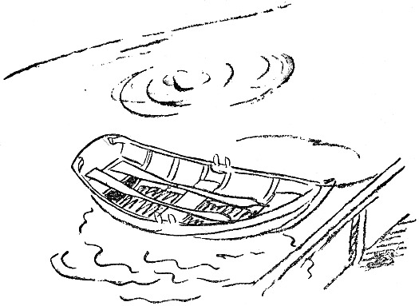

<h2>Boxe zu Hause.</h2>

Herr Blom kam mit zwei Paar Boxhandschuhen nach
Hause, die er auf einer Auktion gekauft hatte, das Paar
zu 75 Öre. Das ist billig, wenn man bedenkt, daß
das Boxen ein aufstrebender Sport ist.

Herr Blom nahm also die Handschuhe mit nach Hause,
und beim Mittagbrot sagte er zu Fritz und Oskar,
seinen zwölf und vierzehn Jahre alten Söhnen, die
gerade damit beschäftigt waren, sich unter dem Tisch
gegenseitig mit den Füßen zu stoßen:

»Heutzutage muß man sich verteidigen können! Ich
meine, nicht nur das eine Volk gegen das andere, sondern
auch rein individuell. Das eine Individuum muß sich
gegen das andere verteidigen können, wenn es angegriffen
wird.«

<@pagebreak/>
»Daß der Krieg auch gar kein Ende nimmt!« sagte
Frau Blom. »Seit gestern sind die Erbsen wieder
10 Öre teurer!«

»Die Verteidigung, von der ich spreche,« fuhr Herr
Blom fort, »ist eine Verteidigung, die in allen Lebenslagen
zu brauchen ist. Der große französische Schriftsteller
Metterlinck — —«

»Maeterlinck heißt er,« sagte Oskar, »und ist ein Belgier.«

»Nicht Papa verbessern!« rügte Frau Blom.

»Wenn er aber Unrecht hat,« sagte Oskar. »Ich
weiß, er heißt — —«

»Namen werden ja verschieden ausgesprochen,« sagte
Herr Blom, »einmal war ein Engländer bei mir im
Bureau, und der nannte mich Blaam, so daß wohl nicht
so leicht zu sagen ist, wie Metterlinck eigentlich heißt.
Jedenfalls hat dieser Schriftsteller irgendwo geschrieben,
daß der Mensch das einzige Tier sei, das sich von Natur
aus nicht verteidigen kann. Alle anderen Tiere können
sich verteidigen. Der Ochse hat seine Hörner, die Katze
ihre Krallen, die Schlange ihren Stachel.« — »Und was
hat der Regenwurm?« fragte Oskar.

»Der Regenwurm,« sagte Herr Blom und legte seine
Gabel mit einer halben Sardine hin, »der Regenwurm
hat eine schützende Ähnlichkeit mit dem Erdboden; er
ist nicht zu sehen.«

»Das hilft ihm nicht viel, wenn er an einem Angelhaken
im Wasser hängt und ein Barsch kommt,« sagte Oskar.

»Metterlinck meint,« fuhr Herr Blom fort, »daß der
Mensch zum Verteidigen seine Hände hat, aber daß er
<@pagebreak/>
diese Kunst vernachlässigt hat. Statt dessen benutzt er
Waffen, was roh und gemein ist. Ein Mensch, der
boxen kann, greift niemanden an, aber wenn er angegriffen
wird, verteidigt er sich mit ruhigem und kaltem
Blut und macht seinen Gegner schnell kampfunfähig,
ohne selbst nennenswert verletzt zu werden. Nach Tisch
werde ich Euch ein paar kleine Tricks im Boxen zeigen,
die ich vor ein paar Tagen bei einem Schauturnen gesehen
habe.«

Als die Familie gegessen hatte, zog sich Herr Blom
das eine Paar Handschuhe an und reichte Frau Blom
das andere:

»Ziehe diese hier an, Berta, ich will den Jungens
nur ein paar Stöße zeigen!«

»Ich denke nicht daran,« sagte Frau Blom, »ich raufe
mich nicht!«

»Es ist ja keine Rede von raufen, aber ich muß doch
jemand haben, an dem ich das vorführen kann. Also
ziehe Dir die Handschuhe an!«

Fritz reckte sich zum Fenster hinaus und rief auf die
Straße hinunter:

»Kommt rauf, zugucken, Jungens, Mama und Papa
hauen sich! Aber dalli!!!«

Frau Blom zog schließlich die Handschuhe an und
stellte sich ihrem Mann gegenüber. Es schien, als dächte
sie an etwas.

Herr Blom sagte: »Wenn Du jetzt den linken Arm
ausstreckst — —«

Frau Blom streckte den linken Arm aus, so daß ihre
<@pagebreak/>
Faust mit hartem Klatsch mitten in Herrn Bloms Gesicht
sitzen blieb.

Die Jungens kicherten.

Herr Blom fühlte eine brennende Hitze im Gesicht
und sagte etwas hart:

»Du mußt doch nicht loshauen, wenn ich keine Ahnung
habe!«

»Denkst Du, ein Boxer sagt vorher: Jetzt kommt die
Watschen!« sagte Frau Blom. »Ich haue, wann ich will!«

»So,« sagte Herr Blom und machte einen Ausfall
mit dem rechten Arm. Frau Blom wich aus, und die
Salonlampe, die Blom als Hochzeitsgeschenk von Frau
Bloms Großmutter bekommen hatte, fing den Stoß
auf. Aber schlecht. Die Glocke zersprang.

»Danke bestens«, sagte Herr Blom und stieß die Glasscherben
fort, und dann gab er seiner Frau einen Stoß
mitten in die Brust. Frau Blom schnappte nach Luft,
riß die Handschuhe ab und schrie:

»So ein Kerl, schlägt ein Weib, wenn es an nichts
denkt! Und mitten in die Brust, so daß man nicht
atmen kann! Was würden die Leute sagen, wenn sie
wüßten, wie Du Dich benimmst! Sich so zu betragen!
Uhuuuuu!«

Da klingelte es. Das war der Großhändler Larsson,
der zu Besuch kam. Frau Blom war sehr froh darüber,
warf einen Blick in den Spiegel und lachte und sagte:

»Wie nett, Herr Larsson, daß Sie mit herankommen!
Denken Sie sich, Olaf bringt mir gerade das Boxen
bei, das ist riesig spaßig!«

<@pagebreak/>
Herr Larsson legte Überzieher und Hut ab, und als
er hereinkam, sagte Blom: »Du, Larsson, Du solltest
boxen lernen! Wer nachts herumsumpft wie Du, kann
leicht überfallen werden! Zieh Dir die Handschuhe da
an, dann werde ich Dir ein paar Tricks zeigen!«

»Ach was,« sagte Larsson, »ich bin für so was zu
alt, aber als ich jung war, — da hättest Du sehen sollen!«

»Zieh Dir die Handschuhe an! Wir machen ein paar
Stöße! Nur zum Scherz!« Larsson zog die Handschuhe
an, stellte sich in regelrechte Boxerpositur und gab Blom
schnell und sicher einen Linkshieb gerade zwischen die
Augen.

Blom sah sechsunddreißig kleine Sterne und eine
mittelgroße Sonne, und als die Vision vorüber war,
sagte er:

»Du hast früher geboxt, Larsson, schwindle nicht!«

»Ja, ein bißchen, in Amerika, als ich noch jung war,«
sagte Larsson, und dabei kriegte Blom einen »*uppercut*«,
daß er schluckte und nahe daran war, in den Bücherschrank
hineinzusausen. »Kannst Du denn gar nicht zurückschlagen,
Olaf?!« sagte Frau Blom. — »Ich pariere
vorläufig bloß,« sagte Blom, und damit bekam er einen
Stoß gegen den rechten Backenknochen, daß ihm war,
als würde ihm das Genick ausgerenkt. Nach diesem
Stoß kam ein neuer, direkt unters Herz. Dann folgte
eine Serie Schläge rings um den Kopf und überallhin,
wo Larsson herankonnte.

Herr Blom hatte jedes Gefühl von Raum verloren
und von Zeit auch. Er wußte nur, daß er aus der
<@pagebreak/>
ganzen Geschichte herauswollte. Er lief ins Schlafzimmer,
Larsson verfolgte ihn. Blom erhielt einen
Schlag nach dem andern. Das Blut begann ihm langsam
aus der Nase zu tropfen, und Frau Blom stand
im Korridor und suchte im Telephonbuch nach einer
Unfallstation.

Blom verlor schließlich alle Besinnung. Er machte
einen Schritt rückwärts und stieß Larsson mit dem Fuß
gegen das rechte Schienbein!

Das wurde Bloms Unglück. Larsson war beleidigt.
Er vergaß, daß er Gast in der Familie war, daß er
hinaufgegangen war, um zu plaudern und einen Grog
zu trinken; die Wut packte ihn! Er wurde fürchterlich
in seinem Zorn. Er sah in Blom einen schändlichen
und rohen Feind, den es zu bekämpfen galt. Blom
schrie und brüllte, und Frau Blom hatte schon längst
ihr Telephonbuch hingeworfen und war auf die Straße
gelaufen, um einen Schutzmann zu holen. Bloms Gesicht
war total verschwollen, seine Augen stierten mit kindisch
blödem Blick geradeaus in den Weltenraum, seine Beine
zitterten unter ihm, und mit schlaffen, hängenden Armen
fing er einen Stoß nach dem andern auf, und zwischen
den Schlägen rief er seine Frau, seine geliebten Kinder,
die Polizei und einen Herrn, der eine Treppe tiefer
wohnte. Aber niemand antwortete. Niemand kam ihm
zu Hilfe gegen den rasenden Larsson.

Nach drei und einer halben Minute beharrlichen
Kampfes war Blom kampfunfähig. Er brach über einem
kleinen, niedlichen Nähtisch zusammen; ein Stecknadelbrief
<@pagebreak/>
drang ihm in die Nase und die Stopfnadel aus
einem Knäuel ins Zwerchfell.

Da kam Frau Blom mit dem Schutzmann! Larsson
wurde verhaftet.

Als die Sache schließlich zur Verhandlung kam, stellte
Blom Strafantrag wegen Hausfriedensbruches und grober
Körperverletzung unter erschwerenden Umständen. Larsson
wurde zu acht Monaten Gefängnis verurteilt. Und
Blom nimmt nun Unterricht im Boxen und wartet nur
auf Larssons Entlassung!

Und Frau Blom legt nun immer zwei Sicherheitsketten
vor die Eingangstür und hat mit dem Schutzmann,
der auf der Straße auf und ab geht, ein besonderes
Pfeifsignal verabredet.

<@pagebreak/>

<h2>Die Ruder.</h2>

Morgens, als ich nach dem Hafen hinunter kam, um
nach den Booten zu sehen, entdeckte ich, daß ein paar
Ruder in meinem Boot verschwunden waren.

Ich suchte auf der Brücke, am Strande und in den
Strandbuden. Sie waren nirgends zu finden.

»Es hat sie jemand gestohlen,« sagte Lars, der mit auf
die Suche gegangen war. »Irgendein Segler von den
Nachbarinseln ist nachts gekommen, hat die Ruder gesehen,
sie haben ihm gefallen, und er hat sie mitgenommen.«

<@pagebreak/>
»Das ist mir noch nie in dieser Gegend passiert,«
sagte ich. »Hier wird nichts »geliehen«. Wir glauben
an gegenseitige Ehrlichkeit.«

Wir standen schweigend da. Dann sagte Lars:

»Ist das eine Laufangel für Hechte, die Du da im
Boot hast?«

»Ja, das ist eine Hechtangel. Ich war gestern fischen
damit.«

»Hast Du etwas geangelt?«

»Ja, einen, der ein Kilo wog.«

»Sooo? Wo hast Du denn den ergattert?«

»Bist Du Polizist im Ort?«

»Nein, nur interessiert.«

»Ich habe ihn vor Norrön erwischt.«

»Dann hat auch der Norröer die Ruder genommen.
Er kann es nicht leiden, daß man in seinen Gewässern
wildert. Er ist in der Nacht hergerudert und hat die
Ruder geholt, um Dich zu bestrafen.«

»Soll ich ihn bei der Polizei anzeigen?«

»Dann zeigt er Dich wegen Wilderns an. Übrigens
hast Du ja keine Beweise, daß er die Ruder genommen
hat. Wenn er sie hat, dann hat er sie versteckt.«

»Oder ins Wasser geworfen.«

»Das tut er nicht. Er ist geizig. Ein paar Ruder
kann man immer gebrauchen.«

»Wollen wir hinfahren und sehen, ob er die Ruder hat?«

»Ja — — wenn wir recht dumm sind — — —.
Übrigens hat er das Landen an seiner Insel verboten.
Er jagt uns fort.«

<@pagebreak/>

»Ich *brauche* die Ruder!«

»Das sehe ich ein, denn Du hast einen Motor. Aber
ich habe eine andere Idee. Funktioniert der Motor?«

»Gestern lief er ausgezeichnet.«

»Das ist keine Garantie. Aber wir wollen versuchen.
Ich fahre nach Norrön und spreche ein paar Worte
mit ihm. Mich kennt er nicht. Ich werde an der
Meerseite landen, dann weiß er nicht, wo ich herkomme.«

Der Motor schnurrte los, und Lars fuhr ab. Nach
einer Stunde kam er zurück, und wir trafen uns am
Mittagstisch.

»Naaa?« sagte ich.

»Das war ein resoluter Kerl, der Norröer. Er wohnt
hübsch. Und Kühe hat er auch. Und Schafe.«

»Das gehört nicht hierher — — hatte er die Ruder?«

»Warte nur ab. Er kam mir vor dem Haus entgegen,
und da stellte ich mich vor: Mein Name ist Holmström,
Agent der Diebstahlsversicherungsgesellschaft. Ich
bin hergekommen, um Ihnen eine Versicherung anzubieten.«

»Was soll ich versichern?« fragte der Norröer. »Hier
wird nicht gestohlen.«

»Das kann man nicht wissen. Boote und Bootsutensilien
sind begehrte Sachen. Wenn etwas wegkommt,
so bekommt man Entschädigung von der Gesellschaft,
volle Entschädigung.«

»Sooo.«

»Ja, da ist ein Fall auf Ytterön passiert. Ein Ingenieur,
der dort wohnt, ist um ein paar Ruder bestohlen
<@pagebreak/>
worden. Das ist wahrscheinlich diese Nacht geschehen.
Die Ruder waren versichert. Sie hatten einen Wert
von 15 Kronen und jetzt bekommt er 30. Er ist recht
froh, daß er die Ruder los geworden ist.«

»Sooo — — —«.

»Das heißt: sollten die Ruder bis Sonntag gefunden
werden, so bekommt er natürlich nichts. Wollen Sie
sich nicht versichern lassen?«

»Ich werde es mir überlegen,« sagte der Norröer.

* * *

Wir aßen zu Mittag, und dann gingen wir ans
Meer und genossen den schönen Sonnenuntergang. Der
Abend war still und ruhig.

Am nächsten Morgen erwachte ich früh und ging
nach dem Hafen hinunter, um nach den Booten zu sehen.

*Die Ruder waren wieder zum Vorschein gekommen
und lagen an ihrem Platz im Boot*.

Dafür war die Laufangel fort.

Das war die Visitenkarte des Norröers.

<@pagebreak/>

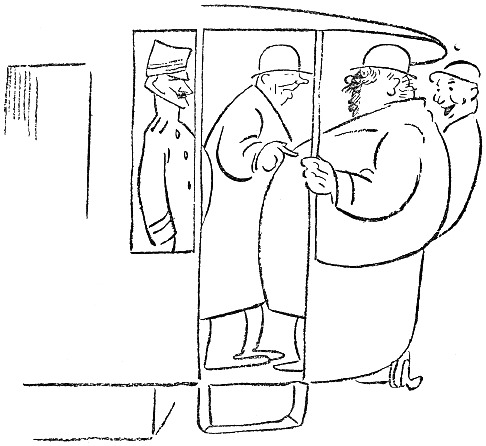

<h2>Bloms Unbekanntschaften.</h2>

Wir standen auf dem Hinterperron einer Elektrischen.
Wir waren fünf Fahrgäste, von denen Blom einer
war, und der sagte plötzlich zu mir:

»Wir alle sind steif und zugeknöpft. Wir können
nicht miteinander sprechen, ohne gegenseitig vorgestellt zu
sein. Da wäre wohl mal eine Reform am Platze.«

<@pagebreak/>
»Sieh mal,« sagte ich, »hier auf dem Perron stehen
drei Menschen. Da ein älterer, fetter Herr, da ein
junges, niedliches Mädchen und da ein Leutnant. Fange
doch ein Gespräch mit ihnen an. Leite Deine Reformarbeit
ein!«

Es leuchtete auf in Bloms Augen. Er wandte den
Blick nach dem älteren, fetten Herrn, sah ihn freundlich
und interessiert an und sagte schließlich in verbindlichem
Ton:

»Sie sind ziemlich fett, mein Herr.«

Ich beobachtete die drei Fahrgäste. Der Leutnant
lächelte, das junge Mädchen sah erschrocken aus, und
der ältere Herr, dem die Sache galt, bekam einen roten
Kopf und erwiderte:

»Was geht das Sie an?«

»Oho,« sagte Blom ebenso freundlich, »das geht mich
wohl etwas an. Eine fette Person ist nicht recht gesund.
Jede Korpulenz ist krankhaft. Das Individuum
hat kein Recht, sich auf irgend eine Weise aus der Gesellschaft
herauszustellen. Sollten Sie durch Ihre Korpulenz
nicht mehr imstande sein, sich zu ernähren, dann
muß ja ich eingreifen. Sie werden der Gesellschaft, —
d.&nbsp;h. mir, — zur Last liegen. Sie sehen also, daß
Ihre Korpulenz mich interessiert. Sie sollten etwas
tun, um sie los zu werden. Essen Sie abends? Trinken
Sie viel?«

Der ältere Herr hatte Mühe zu atmen; und als der
Schaffner aus dem Wagen herauskam, wandte er sich
an diesen und sagte mit angestrengter Stimme:

<@pagebreak/>
»Muß man sich hier auf dem Wagen beleidigen
lassen?«

Der Schaffner sah sich fragend nach uns anderen
um. Er konnte sich nicht besinnen, den älteren Herrn
beleidigt zu haben. Der Schaffner stand seit fünf
Jahren im Dienst der Elektrischen, er hatte alle Sorten
Leute gesehen, und so ließ er sich nicht aus der Fassung
bringen. Da er wußte, daß er den älteren Herrn nicht
beleidigt hatte, verkniff er sich die Antwort, denn er
war klug genug, keinen Streit ohne Ursache anzufangen.

Blom fuhr fort:

»Massage ist in vielen Fällen nützlich. Seifenmassage
mit türkischem Bad verbunden. Baden Sie nie?«

Der Wagen hielt, und der fette Herr stieg ab. Er
ging auf einen Schutzmann zu und sprach in aufgeregtem
Ton. Aber der Wagen rollte weiter.

»Nicht wahr,« sagte Blom und wandte sich an die
junge Dame, »wir haben entzückendes Wetter heute?«

Die junge Dame, die wirklich sehr niedlich war, stierte
geradeaus in die Luft, und der Leutnant lächelte fortwährend.

»Ich muß Ihr Schweigen als Zustimmung deuten,«
fuhr Blom fort. »Gestatten Sie mir gleichzeitig, Ihnen
sagen zu dürfen, daß Ihr kleiner Hut Sie ganz reizend
kleidet. Gerade die richtige Farbe und Form. Sie
haben einen guten Geschmack. Haben Sie ihn selber
ausgesucht?«

Die junge Dame richtete den Blick nach der Decke
des Perrons und las dreizehn Mal hintereinander:

<@pagebreak/>
»*Nichtabsteigen während derFahrtwegen
der damit verbundenen Lebensgefahr.*«

»*Nicht absteigen während der Fahrt wegen
der damit verbundenen Lebensgefahr.*«

»*Nicht absteigen*« …

Blom sah ihr die ganze Zeit in die Augen und
sagte:

»Ich habe Ihnen in meinem ganzen Leben nichts
Böses getan, und doch sind Sie so unfreundlich.
Wäre ich Ihnen auf einem Ball oder einem Diner begegnet,
so hätten Sie vielleicht mit mir geflirtet, wir
hätten uns vielleicht verlobt, wir wären vielleicht …«

Das junge Mädchen wurde feuerrot im Gesicht, sie
drängte sich durch die Fahrgäste und rief:

»Halten Sie Schaffner! Ich will absteigen!«

Sie stieg während der Fahrt ab, und der Leutnant
bot ihr freundlich den Arm. Als er seinen Liebesdienst
erledigt hatte, wandte er sich zu Blom und sagte:

»Sie sind kein Gentleman! Man behandelt eine
Dame nicht so, wie Sie es getan haben!«

Blom strahlte.

»Endlich!« sagte er. »Ausgezeichnet! Sie haben
richtig auf meine Absicht reagiert. Ich hoffe, daß Sie
mir dasselbe gesagt hätten, — das von dem Gentleman,
— auch wenn es hier zu Lande Duelle gäbe.
Dann wäre es übrigens riskant gewesen. So kann
ich weiter nichts zur Sache tun. Am allerwenigsten
kann ich böse werden.«

Der Leutnant antwortete nicht. Er stand in strammer
<@pagebreak/>
Haltung da, bis er einen Schritt zur Seite machte, um
einem Herrn, der einstieg, Platz zu machen.

Es war ein Mann in mittleren Jahren mit einem
frommen und freundlichen Kindergesicht. Er hatte dichtes,
lockiges Haar, und obendrauf saß ein kleiner Hut. Der
Mann blieb zwischen Blom und dem Leutnant stehen.
Der Wagen rollte weiter.

Vor der Kunstakademie unternahm Blom etwas, was
sogar mich überraschte. Er schnappte urplötzlich den
Hut von dem dichten, lockigen Haar des frommen Mannes
weg, sah sich das Haar an, und dann ließ er seine
freie Hand rasch in der wolligen Perrücke verschwinden.
Er wühlte in den Haarmassen herum, hin und her, und
dabei sagte er:

»Was für Haar! Was für Haar! Das ist das
herrlichste, was ich in meinem Leben angefühlt habe!
Was tun Sie, damit es so weich ist? Haben Sie Pomade
drin?«

Der fromme Mann ließ sich von Blom frisieren,
lächelte ganz freundlich und erwiderte ruhig:

»Mein Haar ist immer dicht gewesen. Ich brauche
nichts besonderes dafür, aber manchmal wasche ich es.
Meine Mutter hatte auch sehr dichtes Haar.«

Bloms Hand glitt sachte herab. Er hatte etwas
anderes erwartet. Er wußte nichts zu sagen, aber der
Leutnant sagte anstelle des Frommen:

»Daß Sie dulden, daß ein fremder Mensch Sie auf
diese Weise behandelt!«

»Ach,« antwortete der Mann mit dem frommen Aussehen
<@pagebreak/>
und dem dicken Haar, »ich bin Wärter in einer
*Anstalt für solche Leute gewesen*, ich weiß,
wie die zu nehmen sind, — nur *Milde* und *Geduld*,
— nur *Milde*, es hat keinen Zweck, grob zu sein.«

Blom setzte den kleinen Hut wieder dahin, wo er
ihn hergenommen hatte und sprang während der Fahrt
vom Wagen.

<@pagebreak/>

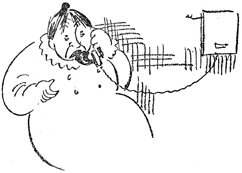

<h2>Dalströms Telephon.</h2>

Am 1. Mai zog ich in eine neue Wohnung. Das
heißt, für mich war sie neu. Dalström, der sie sechs Jahre
lang vor mir bewohnt hat, wird sie wohl kennen. Ich
kam abends nach Hause. Meine Familie war nicht anwesend.
Vermutlich hatte sie sich, müde und matt von
den Strapazen des Umzuges, eine Wohnung im Grand-Hotel
mit Aussicht nach dem Wasser gemietet.

Ich war, wie gesagt, allein. Man weiß, was das
heißt, allein in einer Wohnung zu sein, ohne elektrisches
Licht, zwischen Möbeln und Packkisten.

Ich saß mitten auf dem Fußboden und stierte auf
<@pagebreak/>
eine Wand. An der Wand hing ein Telephon, — Dalströms
Telephon. Das hing noch da wie eine Erinnerung,
und daneben hing der übliche Zettel mit den üblichen
Nummern, die in einer bürgerlichen Familie benutzt
werden: der Kohlenmann, der Milchladen, der Kaufmann,
die Friseurin, die Schneiderin und die Waschanstalt.
Dann stand da: Hilda 3048 und August 4375. Ich dachte
gerade ein bißchen über Hilda nach, als der Apparat plötzlich
klingelte. Ich hob das Mikrophon ab, sagte »Hallo«
und erhielt von einer Männerstimme folgende Mitteilung:

»Du bist ein Aas!«

Ich bin nicht gewöhnt, grob angeredet zu werden.
Eine Frau hat mich einmal, als sie nicht wußte, was
sie tat, einen Schuft genannt, aber das ist ihre Sache.

Ich trat erschrocken einen Schritt vom Telephon zurück
und erwiderte:

»Das muß ein Irrtum sein.«

»Irrtum?« sagte die Stimme, »den Deibel auch!
Irrtum! Den ganzen Tag habe ich hier gesessen und
auf das Geld gewartet, das Du heute früh herschicken
wolltest! Ich hatte mit dem Geld gerechnet, und wenn
ich es nicht bis morgen früh habe, mußt Du für die
Folgen aufkommen!«

Dann klingelte der Mann ab, und ich stand da. Ich
konnte nicht bei ihm anklingeln und ihm sagen, daß er
falsch verbunden gewesen war. Übrigens war er ja eigentlich
nicht falsch verbunden gewesen. Ich ging in die
Küche und drehte den Wasserhahn auf. Das ist merkwürdig
bei mir: sobald ich in eine Küche komme, drehe
<@pagebreak/>
ich den Wasserhahn auf. Dann kann ich dastehen und
das laufende Wasser anstarren, bis ich den Hahn plötzlich
wieder zudrehe und zu mir komme.

Diese Wasserleitung war wie alle anderen. Als das
Wasser zehn Minuten gelaufen war, drehte ich den Hahn
zu. Da klingelte das Telephon. Ich lief hin, um zu
antworten, und tat es auch. Eine fidele Frauenstimme sagte:

»Ich habe eine Kommode in der Wohlfahrtslotterie gewonnen!
Darüber freue ich mich riesig!«

»Ich freue mich auch riesig,« sagte ich. »Ist sie aus
Mahagoni?«

»Nein, aus Nußbaum, was viel feiner ist. Was
machst Du übrigens?«

»Ich? Nichts.«

»Dann komme ich einen Augenblick rauf. Berta ist
wohl nicht zu Hause.«

»Nein, Berta ist nicht zu Hause.«

»Ich komme über die Küchentreppe!«

Abläuten.

Ich dachte: »Wer ist das? Ist sie jung, ist sie niedlich,
soll ich die Küchentür zuschließen?«

Da klingelte es wieder und ein anderes weibliches
Wesen sagte:

»Kannst Du dir denken, er hat gesagt, er ist nicht
der Vater von dem Kind!«

»Er hat gesagt, daß er nicht der Vater von dem Kind
ist?« antwortete ich. »Das weiß doch die ganze Stadt,
daß er es ist!«

»Es genügt, daß ich es weiß,« sagte die Stimme.

<@pagebreak/>
»Tja, Du mußt es ja am besten wissen, »sagte ich, »Du
als seine Mutter!«

»Was redest Du da für Blech? Bin ich die Mutter
von Agdas Kind?«

»Ich meine, daß Du wie eine Mutter gegen das
Kind gewesen bist, — Du mit Deinem guten Herzen,
die niemals —«

»Ich habe die Range nie gesehen. Hat Berta schon
Preißelbeeren gekauft?«

»Ja gestern!«

»Was hat sie gegeben?«

»76 Öre pro Liter, aber sie waren reif, — fast kein
Abgang.«

»Bist Du verückt?! 75 Öre pro Liter! Auf dem
Heumarkt kosten sie 38! Kann ich mal mit Berta
sprechen? Du scheinst wieder getrunken zu haben!«

Bei dieser Beleidigung klingelte ich ab.

In diesem Augenblick kam meine Familie nach Hause.

»Bist Du zu Haus?« fragte meine Frau.

»Nein,« sagte ich, »ich bin ausgegangen,« denn ich
weiß, wie man geistreiche Fragen beantwortet.

»Ist was gewesen?« fragte meine Frau.

»Ja,« sagte ich, »das Telephon.«

Und ich dachte an die Dame mit der Nußbaumkommode,
die die Küchentreppe heraufkommen wollte. Ich beschloß,
nicht zu öffnen.

Da klingelte das Telephon. Meine Frau wollte sich
melden. Ich sagte zu ihr: »Tu’ das nicht! Du kannst
nicht wissen, was Du zu hören bekommst! Dieser Apparat
<@pagebreak/>
enthüllt die unheimlichsten Geheimnisse. Melde
Dich nicht!«

Folglich meldete sie sich. Sie sagte »Hallo«, und
ich sah, wie sie gleich darauf vor Freude aufleuchtete.
Sie senkte den Hörer einen Augenblick, wandte sich zu
mir und sagte:

»Er hat mich Liebling genannt!«

»Laß ihn weiter reden,« sagte ich. »Man kann nicht
wissen, wie das endet!«

Meine Frau horchte eine Weile, dann hängte sie den
Hörer an. Ich sah, daß sie ärgerlich war.

»Was wollte er?« fragte ich.

»Er hat Berta zu mir gesagt und wollte, daß ich
ihn in einer halben Stunde in der Regierungsstraße
erwarten sollte.«

»Gehst Du hin?« fragte ich.

Da klingelte es an der Küchentür.

»Die Dame mit der Kommode,« dachte ich, zog die Weste
glatt und ordnete die Krawatte und ging und
öffnete.

Es war ein Packer von einer Speditionsfirma, der
einen Korkenzieher haben wollte, den er vormittags vergessen
hatte. Er hätte sich sehr beunruhigt, daß er weggekommen
sein könnte. Als ich wieder ins Zimmer kam,
stand unser Dienstmädchen am Telephon und ich hörte
folgendes Gespräch:

»Zum Piepen! Och! Warum ooch? Det jlobe ick!
Jott wie schade! Och! Nich in de Hand! Wat meenen
Se? Ick heeße Amalje!«
<@pagebreak/>

Da ging ich hin, nahm Amalie den Hörer ab, hängte
ihn an, klingelte beim Amt an, ließ mich mit der Aufsicht
verbinden und verlangte die sofortige Sperrung des
Apparates.

Die Dame mit der Kommode kam bald darauf. Ich
öffnete, und als sie mich sah, errötete sie schüchtern,
und als sie meine Frau sah, sagte sie, daß sie sich geirrt
hätte.

Und das hatte sie ja auch.

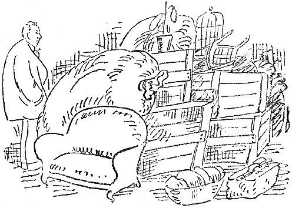

<@pagebreak/>

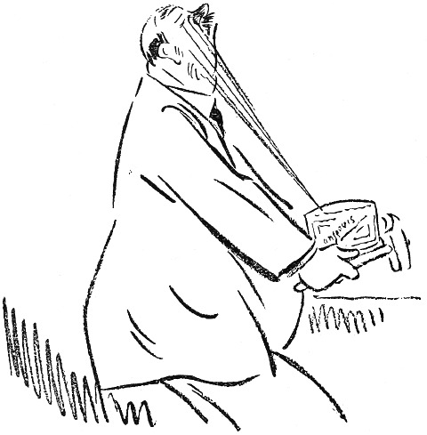

<h2>Die Anchovisbüchse.</h2>

»Diese Anchovis hier taugen nichts.«

»Das ist die beste Marke«, wandte Frau Blom sanftmütig
ein.

»Die beste Marke! Wie oft soll ich Dir sagen, daß
die Marke oder die Firma bei Anchovis absolut nichts
<@pagebreak/>
zu bedeuten hat! Sämtliche Anchovis sind, wenn sie
eingelegt werden, ganz gleich, — ganz gleich. Danach
kommt es darauf an, ob sie gegoren sind. Diese hier
sind nicht gegoren. Die taugen nichts.«

»Es ist schon am besten, daß Du Dir Deine Anchovis
selber kaufst, dann bekommst Du sie, wie Du sie haben
willst.

»Ja«, sagte Herr Blom, »es ist vielleicht, am besten,
daß ich alles kaufe. Den Kalbsbraten, die Erbsen, den
Speck und das Bier und den ganzen übrigen Kram.
Ich habe ja weiter nichts zu tun. Soll ich nicht auch
nach den Kindern sehen und mit dem Stubenmädchen
spazieren gehen?«

»Warum mußt Du denn mit dem Stubenmädchen
spazieren gehen?«

»Du darfst Dich nicht an einzelne Worte klammern.
Ich werde Anchovis kaufen.«

Herr Blom kaufte eine Büchse Anchovis. Die war
so gegoren, daß der Deckel sich bog. Das war die
richtige Sorte. Er konnte Anchovis kaufen. Voll Stolz
trug er sie nach Hause; der erwartete Triumph beschleunigte
seine Schritte.

»Hier siehst Du Anchovis, wie sie sein sollen. Ich
werde die Büchse selber aufmachen.«

Herr Blom ging nach der Küche. Die ganze Familie
stand um ihn herum. Niemand wagte zu sprechen.

»Was haben die Kinder hier zu suchen?« fragte
Herr Blom und sah sich um. »Habe ich nicht gesagt,
Ihr sollt nicht in der Küche sein? Warum gehorcht Ihr
<@pagebreak/>
nicht? Eure Mutter verzieht Euch wohl?! Macht die
Tür zu! Gebt den Büchsenöffner her!«

»Was?!«

»Den Büch-sen-öff-ner! Wissen Sie nicht, was das
ist, Amanda? Denken Sie, daß man Konservenbüchsen
mit Haarnadeln oder Feuerhaken oder alten Linealen
aufmacht?! Ja?«

»Wir machen sie immer mit so einem kleinen Dings
auf, das an der Büchse ist.«

»Es ist kein »Dings« an dieser Büchse, meine verehrteste
Amanda. Diese Büchse muß mit einem Büchsenöffner
aufgemacht werden. Es muß einer im Hause
sein! Er stand auf der Ausstattungsrechnung, als wir
uns verheirateten! Ich sehe es heute noch: An …
Ein Büchsenöffner … Kr. 1,50 stand da. Wer hat
eben geklingelt? Geht und macht auf! Ich bin nicht
zu sprechen. Laß doch Amanda gehen, warum mußt
Du denn rennen? Steh nicht da und guck durch die
Türritze! Wer war es?«

»Es war der elektrische Arbeiter …«

»Der elektrische Arbeiter! Was meinen Sie damit?
Ist der Kerl elektrisch?«

»Es war der Elektrizitätsarbeiter …«

»Hahaha, — elektrischer Arbeiter! Vorsicht, nicht berühren,
nicht wahr? Hahaha! Wo ist also der Büchsenöffner?«

»Hier ist er! Ich habe ihn eben gefunden!«

»Du hast ihn gefunden?! Diesen Büchsenöffner?!
Das ist nicht unserer! Den kenne ich nicht!«

<@pagebreak/>

»Du hast ihn Dir damals wohl nicht so genau angesehen.«

»So? Ich habe ihn mir nicht angesehen?! Was ich
einmal gesehen habe, erkenne ich auch wieder.«

»Na also, — ich bin zum Kapitän nebenan gegangen
und habe mir diesen geborgt, damit es keinen Zank gibt.«

»Du borgst Dir Hausgerät? Damit es keinen Zank
gibt?! Anderer Leute Büchsenöffner!! Wer weiß, wozu
der schon gebraucht worden ist!!«

Herr Blom verschwindet mit dem Apparat und kehrt
nach einer Weile wieder.

»Ich habe ihn mit Sublimat abgewaschen. Das wird
wohl etwas nützen. Gib mir ein Tuch, — nein, —
ein trockenes! Na also!«

Herr Blom stemmt den Öffner gegen den Deckel. Der
gibt nicht nach.

Frau Blom vorsichtig:

»Man klopft erst ein kleines Loch. Nimm den
Hammer.«

»Das kann man auch. Gib den Hammer her.«

Herr Blom klopft mit dem Hammer auf den Öffner.
Der Deckel bekommt ein Loch, und ein Strahl salziger
Lake spritzt Herrn Blom gerade in das rechte Auge.
Er läßt die ganze Geschichte fallen und tanzt umher:

»Ogottogottogott: Himmerherrgot! Au-u-u-uh!«

Er zieht sich nach dem Schlafzimmer zurück, und die
Damen beenden den Akt.

Als ihm ein bißchen wohler geworden ist, öffnet Frau
Blom leise die Tür und sagt:

<@pagebreak/>

»Bernhardchen, es waren *Heringe in Gabelbissen*
die Du gekauft hast!«

Bernhardchen stiert mit rotgeschwollenen Augen geradeaus
in die Luft. Dann macht er die Augen zu
und sieht sich in Gedanken die Straße entlang und in
das Delikatessengeschäft stürmen und über den Ladentisch,
gerade auf den nachlässigen Kommis springen,
den er mit einem einzigen Schlag zermalmt.

Laut aber sagt er zu seiner Frau:

»Hering in Gabelbissen, ist das etwa schlecht? Das
schmeckt ausgezeichnet, — mit Pellkartoffeln!«

Blom ist eben ein Mann!

<@pagebreak/>

<h2>Pilze.</h2>

Jetzt sind wir in der Pilzzeit. Nun müssen sie gesammelt
und eingemacht und auf Regale gestellt werden,
so daß man etwas hat, was man sich im Winter über ißt.

Als meine Frau Stachelbeer- und Himbeer- und
Johannisbeer- und Wachholderbeer- und Hagebutten- und
Brombeer- und Faulkirschen- und Ebereschenbeer- und
gemischtes Himbeerundblaubeerundpreißelbeergelee
eingemacht hatte, sagte sie:

»Jetzt muß ich aber wirklich mit dem Einmachen anfangen!«

<@pagebreak/>
Ich ging auf die Veranda und sah mir die Natur
an. Es war eine schöne Natur, und mittendrin ging
Janssons Kuh und graste ein bißchen Natur hier und
ein bißchen Natur da. Einen Teil lieferte sie gütigst
zurück, ein anderer Teil verschwand völlig.

Ich rief meine Frau. Sie kam sofort, denn sie dachte,
Leutnant Lindgren ritte gerade vorbei.

»Da geht Janssons Kuh«, sagte ich. »Es ist keiner
hier, der uns sieht. Wir wollen sie für den Winter einmachen.
Eingemachte Kuh, — das ist gut, wenn die
Zeiten knapp werden sollten.«

Meine Frau schleuderte mir denselben Blick zu, den
Cleopatra dem Sokrates zuwarf, ehe sie ihm den
Giftbecher reichte, und ging hinein und schrieb ein Rezept
über das Einmachen von rohgeschälten Gurken ohne
Kerne ab.

Ich dagegen ging hinaus. Auf der Dampferbrücke
saßen die Damen, und eine sagte:

»Ich habe gestern sechzehn Liter gepflückt, liebe Amelie.
August ißt am liebsten Schafpilze. Die werden in Butter
mit etwas Meerrettig geschwenkt. Butterpilze sind delikat.«

»Denken Sie sich, die Frau Doktor hat am Sonnabend
achtzehn Liter Pfefferlinge bekommen.«

»Sagte sie. Ich habe den Korb gesehen. Da haben
armselige drei Stück drin gelegen und nach einander geschielt.
Nein, Du, ich kenne die *Stellen*.«

»Die Majorin war gestern oben im Hag. Sie hat
einen Fliegenpilz mit nach Hause gebracht, und ihr Mann
mußte sich den ganzen Abend einschließen.«

<@pagebreak/>
Am nächsten Tage ging ich hin und pflückte Pilze.
Meine Frau kam mit, und wir trugen einen Waschkorb
zwischen uns.

Unterwegs begegneten wir der Frau Rendantin:

»Holden die Herrschaften Ihre Wäsche selber?« sagte
sie und lächelte süßlich-maliziös.

»Nein«, sagte ich, »wir pflücken Pilze. Ich habe
gestern eine Stelle im kleinen Hag gesehen. Wir haben
eben einen Waschkorb voll nach Hause getragen, und
jetzt wollen wir noch einen Korb holen.«

»Ach du meine Güte«, sagte die Frau Rendantin und
schlich zum Pächter und schenkte seinem Olof drei Kronen
und einen Apfel, den sie im Garten stiebitzt hatte, damit
er sich uns nachschleichen und nachsehen sollte, wo
wir blieben.

Und wir sammelten Pilze und Holz. Ich pflückte
Fliegenpilze und Rauchpilze und Karl-Johannspilze und
Pfefferlinge und noch mehr Fliegenpilze und Schieflinge
und Trieflinge und alles, was ich nur finden
konnte, und dann trugen wir alles nach Hause, und
dann sonderte ich die giftigen Pilze aus, und dann
legte ich sie in ein Körbchen und ging in die Küche
von Svensson. Da stand Svenssons Dienstmädchen,
das vor Dummheit beinahe schielt.

»Hier sind ein paar Pilze«, sagte ich. »Das sind
ausgesucht feine Pilze. Kochen Sie sie zu Mittag und
bestellen Sie der Herrschaft einen Gruß von mir. Das
ist eine kleine Überraschung.«

»Danke schön«, sagte Svenssons Mädchen und knixte
<@pagebreak/>
und warf das eine Auge durch das Fenster um die
Ecke herum und nach der See, wo ihr Schatz saß und
mit Olssons Boot in Perssons Fischwasser wilderte.

Die Familie Svensson wurde nachmittags zu Bett
gebracht; es geht ihr jetzt wieder besser.

Ich ging fort, um mehr Pilze zu sammeln. Als ich
aber nach dem Hag kam, standen Frau Hansson und
Frau Persson und Frau Jonsson und Frau Lönnblad
und Frau Höglund da, alle miteinander gebückt, die
Locken vornüber, und pflückten Pilze aus Leibeskräften.
Ich kam von hinten angeschlichen.

»Bitte bleiben Sie stehen, Frau Hansson«, sagte ich,
»ganz ruhig!«

Frau Hansson blieb unbeweglich stehen, denn sie
glaubte, daß sich an ihrem rechten Bein gerade eine
Kreuzotter hochschlängelte.

Ich nahm einen Anlauf, einen tüchtigen Anlauf, und
sprang über Frau Hansson Bock. Sie stand ausgezeichnet.
Dann rannte ich weiter.

»Bitte bleiben Sie stehen, Frau Persson«, rief ich.

Frau Persson blieb unbeweglich stehen, denn sie glaubte,
daß ihr eine Wespe unter das Korsett kriechen wollte.
Dann nahm ich einen Anlauf und sprang über Frau
Persson. Sie stand auch gut.

Darauf sprang ich über Frau Jonsson und Frau
Nilsson und Frau Lönnblad und Frau Höglund. Frau
Höglund stand nicht ganz so gut, — sie sackte in den
Kniekehlen, — sie ist 65 Jahr alt, — aber über sie
weg kam ich doch.

<@pagebreak/>
Ich war ein bißchen müde, aber ich konnte doch nach
Hause gehen und das Notwendigste packen, um mit dem
nächsten Dampfer nach der Stadt zu ziehen.

Es fängt nämlich jetzt abends an, etwas kühl zu
werden. Sonst ist der Sommer herrlich gewesen, gerade
richtig warm und gerade richtig windig.

Aber ich mache mir weiter nichts aus Wind.

<@pagebreak/>

<h2>Rosenlunds Zaubervorstellung.</h2>

Wir verkehren mit Rosenlunds, — nicht etwa, daß
ich damit prahlen will. Wir gehen zu ihren Gesellschaften,
weil man ja irgend wohin gehen muß. Dabei
pflege ich Rosenlund sein Geld abzugewinnen, wenigstens
das, was er zu Hause hat. Dann vergeht eine Zeit, ehe
wir wieder hingehen. Schon auf der Treppe höre ich Amalie
— Rosenlunds Gattin ziert dieser Name — wimmern:

<@pagebreak/>
»Aber Adolf! Wie kannst Du Dich so benehmen!
Dasitzen und alles verspielen, was Du hast, — und
noch dazu an so einen! Wo soll denn das hin? Aber
Adolf!«

Dann pflegt Adolf zu antworten:

»Hätte er nur nicht gerade diese Karten gehabt!
Hätte ich bloß das As gehabt! Dann hätte ich ihn
reingelegt! Hätte ich geahnt, daß die Kreuz acht da
steckte!«

Einmal machte ich dann die Entréetür auf, steckte ein
Einkronenstück dazwischen und sagte:

»Gerade oder ungerade, auf die Jahreszahl, Adolfchen!«

Beinahe hätte er mir die Finger abgeklemmt!

Da sagte meine Frau eines Tages zu Rosenlunds Frau:

»Sage mal, Amalie, könnten wir denn nicht ohne
das gräßliche Kartenklopfen zusammenkommen?«

»Aber, liebes Susannchen«, sagte Amalie, »die Herren
amüsieren sich doch so sehr dabei …«

»Ja, aber wir haben doch auch etwas zu sagen?!«
»Natürlich«, sagte Amalie.

In der nächsten Woche wurden wir zu Rosenlunds
eingeladen. Rosenlund klingelte an und tat geheimnisvoll.

»Wir haben am Mittwoch eine kleine Gesellschaft.
Nur ein einfaches Butterbrot …«

»Ich kenne Eure einfachen Butterbrote«, sagte ich,
»ich kenne sie tagelang«.

»Ihr kommt doch«, sagte Rosenlund, »nur Ihr seid
da und Carlssons und Fräulein Halldin …«

<@pagebreak/>
»Dann komme *ich*!«

»Und Fredrikssons und der junge Blomdahl …«

»Dann kommt *meine Frau* …«

»Und dann noch ein paar Leute. Ihr werdet etwas
zu sehen bekommen, was Ihr noch nie gesehen habt.«

»Hast Du etwa die Absicht, guten Whisky kommen
zu lassen?« sagte ich.

»Ich *werde eine Zaubervorstellung geben*!«

»Dann dürfen wohl die Kinder mitkommen? Sowas
macht ihnen Spaß.«

»Nein, keine Kinder. Es wird eine Seance in der
höheren Magie.«

»Danke sehr«, sagte ich, »wir werden kommen, lege
den Punsch und Fräulein Halldin auf Eis!«

Wir kamen. Es war wie immer bei Rosenlunds.
Die Frau des Hauses begrüßte im Salon. Sie trug
ein neues Kleid. Meine Frau sagte gleich, daß sie
früh nach Hause gehen müßte.

Carlssons waren vor uns da. Frau Carlsson hatte
einen neuen Stiftzahn in der oberen Perlenreihe. Ich
habe es gesehen. Aber ich habe nichts gesagt. Man
ist ja diskret.

Fräulein Halldin kam gleich darauf. Sie war süß.
Ich sagte ihr das. Sie lächelte. Meine Frau wiederholte,
daß sie früh nach Hause gehen würde.

Dann kam der junge Blomdahl. Er trug einen
Stehumlegekragen zum Smoking und hatte vorher eine
Stunde im Café gesessen. *Den* Duft merkte man schon
auf zwei Meter.

<@pagebreak/>
Rosenlund war in unruhiger und gemacht guter
Laune. Er rannte hin und her durch alle Türen, und
seine Frau sagte:

»Aber Adolf, was ist Dir denn?«

Und Rosenlund antwortete — mit den Augen:

»Schweig, Weib! Wenn ich nur wüßte, wo ich das
Coeur-As hingelegt habe, das ich für das Kartenkunststück
haben muß.«

Allmählich kamen wir ins Wohnzimmer. Da herrschte
eine gewisse Dämmerung. Rosenlund sagte, daß das
des magischen Effekts wegen notwendig sei.

»Hahaha«, sagte Carlsson.

Niemand weiß, warum Carlsson so oft, ohne jeden
Grund »hahaha« sagt. Wie soll das enden?

Rosenlund hatte Sitzplätze angeordnet, genau so wie
im Parkett. Fräulein Halldin saß neben mir. Wir
sprachen über schwedische Literatur, — Fräulein Halldin
hat ein Abonnement im Lesezirkel, — als Rosenlund
mit einer kleinen Glocke läutete.

»Geh und mach auf, Ernst«, sagte Frau Carlsson.

»Hahaha«, sagte Carlsson wieder.

»Meine Damen und Herren«, begann Rosenlund.
»Ich will Ihnen jetzt ein paar kleine Zauberkunststücke
zeigen. Natürlich kann kein Mensch zaubern, das heißt, —
hm, — ich meine, — es gibt nichts Übernatürliches.
Ich will Ihnen also zuerst ein paar kleine Kartenkunststücke
vormachen. Sie sehen hier ein gewöhnliches
Spiel Karten.«

»Darf ich es mal sehen?« fragte ich.

<@pagebreak/>
»Hier siehst Du es ja. Ich habe es ja hier.«

»Darf ich es vielleicht mischen?« fragte ich.

»Ich mische selber«, sagte Rosenlund.

»Hahaha«, sagte Carlsson.

Dann sollte ich eine Karte ziehen. Frau Carlsson
wollte nicht. Sie ist so schüchtern. Ich zog Coeur-Acht.
Ich legte sie schnell zurück und zog eine neue
Karte. Das war auch Coeur-Acht! Das ganze Spiel
bestand aus Coeur-Achten. Rosenlund mischte, machte
die Augen zu und dachte nach. Dann sagte er:

»Du hast Coeur-Acht gezogen!«

»Nein«, antwortete ich, »es war Piquebube«.

»Es war Coeur-Acht«, sagte Rosenlund.

»Piquebube!« sagte ich. »Darf ich noch einmal ziehen?«

»Nein, jetzt werde ich ein anderes Kunststück zeigen,
das noch nie ausgeführt worden ist«, sagte Rosenlund.
»Das ist der verschwindende Vogelbauer. Einen Augenblick,
bitte!«

Rosenlund rannte in ein anderes Zimmer. Nach
einer Weile hörten wir ihn rufen:

»Amalie, komm doch mal her!«

Amalie ging zu ihm hinein, und nachdem sie sich
eine Weile gezankt hatten, kam Rosenlund wieder heraus.
Er sah angestrengt aus und hielt einen Vogelbauer
vor dem Bauch. Er stellte sich vor uns hin,
stierte in die Luft und schrie aus Leibeskräften:

»*Geh*!«

Er wollte, daß der Bauer verschwinden sollte, ohne
daß man sah, wo er geblieben war. Es tut mir leid,
<@pagebreak/>
sagen zu müssen, daß das Kunststück völlig mißlang.
Der Bauer sollte zusammenklappen und in den Ärmel
hinaufrutschen, als Rosenlund »geh«! schrie und die
Arme ausstreckte. Der Bauer faltete sich aber zusammen
wie ein alter Regenschirm, schlug Rosenlund auf die
Nase und verfing sich in der Manschette.

Rosenlund schrie nach Handtüchern und Bleiwasser,
und Frau Rosenlund rang die Hände und rief:

»Hätten sie bloß Karten gespielt!«

Der junge Blomdahl sagte:

»Das ist ganz entsetzlich«, und Carlsson erwiderte:

»Hahaha, — famoses Kunststück, — hahaha!«

Allmählich beruhigte sich Rosenlund. Er lächelte fast
und sagte:

»Meine Herrschaften! Auch dem Geschicktesten kann
etwas danebengelingen. Ich werde das Kunststück ein
andermal wiederholen. Aber jetzt werde ich Ihnen
mein größtes Kunststück zeigen. Ich muß das elektrische
Licht einen Augenblick ausdrehen!«

»*Jaaa* nicht!« sagte Fräulein Halldin.

»Ausdrehen!« rief ich. Rosenlund drehte aus. Als
das Licht wieder eingeschaltet wurde, sah Carlsson
Fräulein Halldin an und sagte:

»Hahaha!«

Carlsson ist immer ein frecher Lümmel gewesen.

Rosenlund hielt ein Tuch in die Höhe. Es war leer.

»Hokus, Pokus!« sagte Rosenlund und holte eine
Schüssel mit Wasser unter dem Tuch hervor.

Wir klatschten wahnsinnig.

<@pagebreak/>
»Abwarten, es kommt noch mehr«, sagte Rosenlund.

»Hokus, Pokus!« Und er holte noch eine Schüssel
mit Wasser hervor, noch größer als die erste. Rosenlund
sah riesig vergnügt aus. Aber gerade, als er die
Schüssel auf den Tisch stellen wollte, entglitt sie ihm,
und er ließ alles miteinander, das Wasser und die ganze
übrige Geschichte, in den Schoß meiner Frau fallen.
Gerade bei ihr hätte ihm das nicht passieren dürfen. — —

Ich erinnere mich an nichts von dem, was später
geschah. Aber ich weiß, daß wir in einer geschlossenen
Droschke nach Hause fuhren. Das heißt, ich saß neben
dem Kutscher auf dem Bock. Frauen, die im Wasser
gelegen haben, sind nie mein Fall gewesen. Aber ich
war dennoch so freundlich, eine Fahrt um den Tiergarten
herum vorzuschlagen, ganz außen herum, damit
sie trocknen könnte.

In der darauffolgenden Woche spielten wir bei Rosenlunds
wieder Karten.

<@pagebreak/>

<h2>Die Mietskaserne.</h2>

Heute ist Sonntag und ein sehr schöner Tag. Gestern
sind wir in die Wohnung gezogen, und heute sind wir
froh wie über einen Schatz. Die Sonne brennt durch
die Fenster, ein hellblauer Himmel wölbt sich über der
großen Ebene, an deren Rand ich gerade noch eine
blaue Bucht sehen kann.

Ich höre die Trommel in der Nähe einer Kaserne,
und auf der Straße weint ein Kind, wahrscheinlich nur,

weil so schönes Wetter ist.

<@pagebreak/>
Unsere Zimmer sind renoviert, und wir haben die
Tapeten bekommen, die wir haben wollten. Die Kindermöbel
sind ganz neu, aber sie können das Anfassen
vertragen …

Ich schalte die elektrischen Kontakte ein: das Licht
brennt, und ich drehe den Wasserhahn im Badezimmer
auf: das Wasser läuft. Alles ist, wie es sein soll. Ich
fühle ein Bedürfnis auszugehen und eine schöne Blume
zu kaufen. Aber die Läden sind ja geschlossen.

Ich öffne das Fenster nach der Straße, und plötzlich
werden wir ganz still; wir hören die Töne des ältesten
und schnarrendsten Grammophons der Welt.

»Das ist nicht hier im Hause«, sagte meine Frau.

»Das ist gleich«, erwidere ich, »ich höre es doch aber!«

Ich verabscheue Grammophone. Warum werden sie
nicht verboten?!

»Mach doch das Fenster zu!«

»Ich höre es trotzdem, wenn ich es einmal gehört

Forst) -t-q-t — haben Sie — x-p-t-gesehen-rs-f-g-3-
Carlsson-h-t-ppuh—.

Ich gehe aus, aber ich kaufe keine Blume. All
Blumengeschäfte haben auf.

Heute ist die Klingelleitung entzwei. Man kann nicht
klingeln. Wir heften einen Zettel an die Tür: Klopfen!
Es ist uns immerzu, als wenn es klopft, und wir gehen
immerzu und machen auf. Keiner da!

<@pagebreak/>
Ich telephoniere an den Wirt:

»Es muß jemand kommen und die Klingel nachsehen!«

An diesem Tage kommt niemand, aber mein Freund
T., der aus dem Ausland gekommen ist, sucht mich auf
und klopft. Niemand hört ihn. Er geht wieder fort
und fährt ins Ausland, und ich sehe ihn nie wieder.

Am dritten Tage kommt ein Mann und sieht sich
die Klingelleitung an. Als er sie sich angesehen hat,
geht er fort. Er kommt nicht wieder. Ich überlege,
ob ich mir das Buch der Erfindungen in einem Antiquariat
kaufen soll, um mich über die Anlage und die
Reparatur von elektrischen Klingelleitungen zu belehren.

Meine Frau klingelt beim Wirt an. Er ist verreist.

«
«

Heute hat das elektrische Licht versagt.

»Haha«, sagte ich, denn ich habe Reservepfropfen, die
an etwas, das an der Wand im Vorderkorridor sitzt,
festgeschraubt werden.

Meine Pfropfen paßten nicht. Eine Petroleumlampe
hatten wir nicht.

Wir essen im Restaurant zu Mittag und gehen dann
nach Haus, um, jeder für sich dazusitzen und im Dunklen
zu brüten.

Eine Familie zieht unter uns ein, und das Grammophon
spielt im Nebenhaus. Die Klingelleitung ist kaputt.

Es ist zwei Uhr nachts. Ich werde wach. Ich höre
Gesang. Ich wecke meine Frau.

Der Gesang kommt von der Straße. Wir lugen
<@pagebreak/>
hinaus. Draußen stehen zwölf Herren und singen
»Schlaf in Ruh«…

Ich bin gerührt und sage:

»Das gilt mir: Man ist endlich dahintergekommen,
daß ich eine Huldigung verdiene!«

Nachdem der Gesang 45 Minuten gedauert hat, öffne
ich das Fenster und werfe eine faule Pflaume nach
dem ersten Tenor. Die Pflaume trifft ihn auf die Nase,
und er fährt fort zu singen.

Dann gehe ich wieder zu Bett. Einen Tenor kann
man nicht zum Stoppen bringen.

««
«

Am nächsten Morgen kommt der Herr, der unter uns
eingezogen ist, und bittet uns, die Brause nicht zu benutzen.
Das Wasser läuft in seinen Salon.

Wir telephonieren an den Wirt und bitten ihn, uns
einen kombinierten Brause- und Klingelleitungsreparatör
zu schien. Er verspricht, es sofort zu tun.

««
«

Heute hat die Frau des Mannes, der unter uns
wohnt, angefangen, Klavier zu spielen. Sie hat zwei Stunden
gespielt. Dann hat eine andere mitangepackt, und sie
selber hat dazu gesungen. Es war ein altes Kuplet:

»Willst Du mi—ar gehören?«
und Kairo, annahm!«

Wir zogen uns an und gingen ins Cafe. Da ist
die Musik besser.

<@pagebreak/>
Wir kamen ziemlich früh nach Haus. Der Gesang
dauerte immer noch an.

Da klingelte ich bei der nächsten Unfallstation an:

»Es ist jemand in der Frideborgstraße 62711 zu
Schaden gekommen. Kommen Sie sofort! Nehmen Sie
den Verbandkasten mit! Sie hören am Geschrei, wo
es ist!«

Es kam einer. Der Gesang hörte auf. Es klopfte
an unserer Tür, Wir weigerten uns aufzumachen.

+«
«

Mein Ansehen ist im ganzen Hause ruiniert, im
ganzen Viertel. Ich ziehe zum nächsten Ersten.

Und das ist so gekommen:

Ich erwache mitten in der Nacht und höre eine
Stimme, die sagt:

»Du hast meine Mutter nie geliebt!«

Ich glaube, daß ich träume, aber da stecke ich die
Stearinkerze an und merke, daß ich wach bin. Eine
zweite Stimme antwortet:

»Doch, — von weitem.«

Das ist eine Männerstimme. Der Mann unter uns.

Das Gespräch geht weiter:

»Du haßt alle meine Verwandten!«

»Jawohl!«

»Das habe ich mir gleich gedacht! Dann ist es am
besten, daß wir uns scheiden lassen!«

»Gern, wenn Du mich nicht in Ruhe schlafen lassen
kannst!«

<@pagebreak/>
Ich wecke meine Frau, und dann hecken wir einen
Plan aus, um sie zur Ruhe zu bringen und ihnen
gleichzeitig Angst zu machen.

Ich sage mit lauter Stimme:

»So, jetzt bist Du nach Hause gekommen! Hast Du
was ergattert?«

Da unten schweigen sie, und ich höre beinahe, wie sie
aufhorchen. Meine Frau antwortet in tiefem Baß:

»Das war ein feiner Einbruch! Fünfhundert Taler
und ein paar Eßwaren!«

»Ist kein Blauer gekommen?«

»Diesmal stand einer Schmiere, und dann haben
wir mit der Bolzenschere Nummer 3 gearbeitet. Die
arbeitet lautlos.«

»Fein! Morgen versuchen wir unsern großen Coup!

»Welchen?«

Ich flüstere heiser, aber laut:

»Die Privatbank! Aber sprich nicht so laut. Die
da unten können uns hören. Wir hören ja auch alles,
was sie sagen.

Es wird ganz still im Hause. Wir gehen wieder
zu Bett und schlafen mit glücklichem Lächeln ein.

««
«
Eines Tages begegnete ich der Frau unter uns auf
der Straße. Sie schrie auf und rannte in den Torweg.
Die Mädchen flüstern, als ich komme:
»Man kann es ihm gar nicht ansehen! Die arme
Frau!«

<@pagebreak/>
Mir ist aufgefallen, daß der Schutzmann des Viertels
seine Runde geändert hat. Er patrouilliert jetzt die
ganze Nacht vor unserem Hause auf und ab. Das ist
beruhigend für mich, wenn ich spät nach Hause komme.

Der Mann unter uns hat gestern einen Schlosser
kommen lassen. Der hat ein neues Schloß in die Tür
eingesetzt.

E
«

Mir liegt nichts daran, daß die Klingelleitung repariert
wird, — wir haben von nächster Woche an
eine andere Wohnung gemietet.

<@pagebreak/>
Der Brunnen.

Meine Frau hatte eine Wasserkaraffe in den Brunnen
fallen lassen, der zu unserer Sommerwohnung gehört.
Die Karaffe war untergegangen, und meine Frau kam
und sagte:

»Ich habe die Karaffe in den Brunnen fallen lassen!
Ich bin ganz unglücklich.«

Ich wurde gleich sehr böse, denn die Karaffe hatte
50 Öre gekostet, und ein Mann soll immer auf Ordnung
halten.

»Hast Du je gesehen, daß ich eine Karaffe habe fallen
lassen? Oder etwas anderes??? Nein!!! Ich verliere
<@pagebreak/>
nie etwas! Aber jetzt gehe ich und hole die Karaffe
wieder heraus.«

Ich ging nach dem Brunnen. Ich nahm eine lange
Stange und steckte sie in den Brunnen. Die erreichte
den Boden nicht. Ich holte noch eine Stange und
band sie an die andere Stange.

Ich rührte in dem Brunnen herum, bis das Wasser
ein dicker Lehmbrei geworden war. Dann ging ich auf
die Veranda und ruhte mich aus.

Da kam das Mädchen des Majors, der nebenan
wohnt, an den Brunnen:

»Warum sieht denn das Wasser wie Lehmbrei aus?«
sagte das Mädchen des Majors, der nebenan wohnt.

»Weil meine Frau eine Karaffe hat in den Brunnen
fallen lassen,« erwiderte ich.

Das Mädchen des Majors rannte nach Hause und
schrie den Major an:

»Jetzt haben sie Karaffen in den Brunnen geschmissen,
so daß das Wasser wie Lehmbrei aussieht!«

Der Major ging auf den Hof hinaus und schrie seine
ganze Familie an:

»Niemand darf Wasser aus dem Brunnen trinken!
Die Frau von dem Zeitungsschreiber hat das Wasser
vergiftet!«

Da zog ich meinen weißen Anzug an, nahm einen
Eimer in die Hand und schöpfte das ganze Wasser aus
dem Brunnen. Der Brunnen war 10 Meter tief und
faßte 200 Eimer.

Ich goß das ganze Wasser über das Erdbeerbeet des
<@pagebreak/>
Majors und stahl dann eine Leiter aus der Villa des
Konsuls.

Ich kletterte dann in den Brunnen und holte die
Karaffe heraus. Ich holte auch ein Beil, zwei Strumpfbänder,
einen Fuchsschwanz, einen Kuhschwanz, eine
Haarflechte, ein Korsett und eine Mundharmonika heraus.
Ich legte alles in den Eimer und ging auf die Veranda,
um mich auszuruhen.

Nach einer Weile kam das Mädchen des Majors,
der nebenan wohnt, nach dem Brunnen. Sie warf
einen Eimer in den Brunnen und zog den Eimer herauf.
Er war leer.

»Ach, Du mein Gott und Schöpfer,« sagte das Mädchen
des Majors, der nebenan wohnt, »warum ist denn kein
Wasser in dem Brunnen??!!«

»Weil ich die Karaffe, die meine Frau hat fallen
lassen, heraufgeholt habe,« rief ich.

Da rannte das Mädchen des Majors nach Hause
und schrie den Major an:

»Jetzt haben sie die Karaffe herausgeholt, so daß
das Wasser alle ist, und nun steht man da!«

Da ging der Major auf den Hof hinaus und schrie
seiner ganzen Familie zu:

»Nun kann feiner mehr Wasser aus dem Brunnen
holen, denn der Zeitungsschreiber hat das ganze Wasser
ausgeschöpft!«

Worauf der Major bei der Wege- und Wasserbau-Kommission,
bei der Ortspolizei und bei dem Landrat
des Kreises anklingelte.

<@pagebreak/>
Wir haben aber immer noch kein Wasser in dem
Brunnen. Das Mädchen des Majors hat gekündigt,
und der Major hat beim Reichsgericht und bei Seiner
Exzellenz dem Staatsminister angeklingelt.

Ich selber nehme die Sache ziemlich ruhig hin, denn
ich trinke Selterwasser, das ja sehr wohlschmeckend
ist, besonders, da man es ja nicht gut ungemischt trinken
kann.

<@pagebreak/>
Olssons Phonograph.

Agaton Olsson, Familienvater, Kolonialwaren en gros
und en detail, kam eines Nachmittags mit einem Paket
nach Hause. Das Paket stellte Agaton Olsson auf ein
Stiefelregal im Korridor, worauf er in seine Wohnung,
drei Stuben, Küche, Mädchenkammer und Anteil am Eisschrank,
eintrat. Herr Olsson sagte laut:

»Ich habe einen Phonographen gekauft, und jetzt
— — Teufel noch mal!«

Nun wurde das Paket vom Korridor hereingeholt
und dem jüngsten Sohn mit einem sauberen Taschentuch
die Nase geputzt. Die Hausfrau ordnete ihr Haar
in einen modernen Knoten, und die älteste Tochter
klingelte bei dem Kommis im Geschäft an und bat ihn,
so schnell wie möglich heraufzukommen.

Der Phonograph hatte 26 Kronen mit 10  Kassarabatt
gekostet: er bestand aus einem Trichter (Frau Olsson
benutzt ihn jetzt zum Kirschmarmeladedurchsieben) und
einer »Maschine«, deren Zylinder sich drehte, wenn man
auf einen Knopf drückte.

Agaton Olsson knöpfte die Weste auf, um Luft zu
kriegen, und begann folgende Rede:

»Meine Lieben! Wie Ihr wißt, habe ich mich immer
für die großen Erfindungen unserer Zeit interessiert, —
Ädisonn ist einer meiner alten Bekannten, — Telephong
<@pagebreak/>
habe ich, und der Gassparkocher, auf dem Eure Mutter
die ausgezeichneten Eierkuchen backt, von denen ich bemerkt
habe, daß Ihr sie immer noch nicht mit der gebührenden
Begeisterung eßt, ist auch eine Erfindung, die
von mir hoch eingeschätzt wird.

Ich habe nun einen Phonographen gekauft, und nun
— — Teufel noch mal! Ein Phonograph ist eine
Maschine, die sprechen, singen, Klavier spielen und wie
ein Orchester wirken kann. Ein Phonograph ist aber
viel mehr wert als ein Mensch, — dieser Phonograph
kostet deshalb auch 26 Kronen. Und jetzt wollen wir
ihn »Puppen« spielen lassen.

Unter Grabesstille, die nur durch einen Seufzer von
der ältesten Tochter unterbrochen wird, (der Kommis
aus dem Geschäft läßt auf sich warten!) jetzt Agaton
Olsson eine Walze auf den Zylinder, schraubt an einer
Schraube, die ein Geräusch verursacht, das an das
Magenknurren eines Elefanten erinnert, und der Phonograph
fängt an:

»Praumplexschrust — Z — ich — rot — gar.«

Dann wurde alles still, und Frau Olsson sagte

»Dieses Lied habe ich schon mal anders gehört!«

»Das ist möglich,« sagte Herr Olsson, »aber jetzt
wollen wir die »Wachtparade« nehmen.«

Olsson setzte eine neue Walze ein, und der Phonograph
begann: »Kommt ein Vogel geflogen« zu spielen,

— mit dem Refrain: »Ach, du lieber Augustin.«

»Ich gehe jeden Sonntag zur Wachtparade, — aber
das habe ich noch nie gehört,« sagte der Kommis.

<@pagebreak/>
»Sie sollten lieber runtergehen und Ihre Arbeit tun,«
sagte Herr Olsson, worauf er eine neue Walze einsetzte
und sagte:

»Jetzt werdet Ihr, — Teufel noch mal, — die Nationalhymne
zu hören bekommen, — die kennt Ihr ja doch,
— wie?«

Der Phonograph sagte kein Wort. Statt dessen
sagte Frau Olsson:

»Und für sowas bezahlt man nun 26 Kronen! Blödsinn!«

Agaton Olsson drehte den Apparat um, Gurte ihm
auf den Boden, lachte auf, als hätte er jahrelang etwas
gewußt, aber nicht verraten wollen!

»Ha—ha—ha—, das ist ein Phonograph, in den
man selber sprechen kann. Ich werde das Mädchen
nach unbesprochenen Walzen schien, drei Kronen: das
Stück, und dann sollt Ihr was erleben!«

Die Walzen kamen, Herr Olsson setzte eine ein und
flüsterte:

»Alles, — was — wir — sagen, — nimmt — diese
— Walze — auf. Wir — lassen — den Apparat —
bis — morgen — Abend — hier — auf — dem —
Vertikow — stehen, — dann — wollen — wir — hören,
— was — er — sagt.«

Darauf wurde der Apparat auf das Vertikow gestellt,
und die Familie verkehrte an diesem Abend nur durch
Zeichensprache miteinander.

Mittags, am folgenden Tag, konnte Frau Olsson
ihre Neugierde nicht bändigen, sondern holte den Apparat
herunter, drückte auf den Knopf und hörte dann die
Stimme des Dienstmädchens:

<@pagebreak/>

»Nicht doch, Herr Olsson, lassen Sie das sein, —
lassen Sie das, — Gott, — wenn die Frau käme, —
können Sie mich denn nicht in Ruhe lassen!«

Wir breiten einen schwarzen Schleier über die sprühende
Wut von Frau Olsson.

Als Agaton Olsson, Familienvater, Kolonialwaren
en gros und en detail, mittags nach Hause kam, gab
der Phonograph mit großer Deutlichkeit das Geräusch
wieder, das entsteht, wenn eine kräftige Hand eine fette
Kolonialwarenhändlerbacke trifft, — pang, — pang, —
pang!!!

Der Zylinder des Phonographen wird jetzt dazu benutzt,
die Puppenkleider des kleinsten Mädchens zu rollen.

<@pagebreak/>

Nächtlicher Besuch.

Ich wohnte in einer sehr hübschen Villa außerhalb
der Stadt, außerhalb des elektrischen Lichts, außerhalb
der Wasserleitung und außerhalb der Straßenreinigung.

Sie bestand innen aus einer Sammlung von Kabusen
und einem Korridor, den der Vorbesitzer in der Verkaufsannonce
Diele genannt hatte. Aber sonst war alles
herrlich.

Die Türen hingen ein bißchen schief, und das Wasser
lief von den Dachrinnen nie in die Gossen, denn es
waren keine Gossen da. Wir hatten keine Bäume vor
dem Haus, so war es Gott sei Dank im Sommer heiß,
und im Winter rodelten wir vom Dach herunter. Es
ging uns ausgezeichnet, denn wir waren jung verheiratet.

Aber diese Geschichte dreht sich um ein bestimmtes
Ereignis.

Eines Nachts, gegen Weihnachten, lag ich und zitterte
in meinem Bett, eine Treppe. Meine Frau befand sich
in ihrem Bett, aber sie zitterte nicht. Sie saß kerzengrade
im Bett, starr vor Entsetzen.

»Ich habe bestimmt etwas da unten gehört,« sagte sie.

»Ja,« sagte ich, »das ist Amalie.«

Amalie ist unser Mädchen.

<@pagebreak/>

»Sie spricht mit jemand,« sagte meine Frau.

»Sie spricht vielleicht aus dem Schlaf,« sagte ich.
»Sei still jetzt, und laß mich zufrieden, damit ich mich
in. Schlaf zittere und von Zentralheizung träume!«

»Das ist nicht zum Spaßen!« sagte meine Frau. »Ich
bin sicher, daß Männer zu Amalie kommen! Sie spricht«
mit einem!«

»Wer kann ihr das verbieten?« sagte ich. »Das tust
Du ja auch, mitten in der Nacht!«

Meine Frau weinte sich in Schlaf, aber ich lag wach.
Und plötzlich höre ich ein neues Geräusch, das mich
mehr als das andere ärgert. Ich höre Schnarchen!
zwei verschiedene Arten von Schnarchen, ein feineres
und ein gröberes.

Ich schleiche mich aus meinem Bett, so leicht angezogen,
wie man eben nachts ist, wenn man schlafen will.
Ich finde einen Lichtstummel und gehe leise, auf den
Zehenspitzen, die Treppen hinab.

Die Tür zu Amaliens Kammer steht offen, und ich
luge hinein. Auf dem Sofa sitzt Amalie, neben ihr
sitzt ein junger Mann im Wochentagsanzug, blauem
Jackett und Beinkleidern von derselben Farbe; er lehnt
seinen Kopf gegen Amaliens Schulter, und beide schnarchen.
Ich stehe ganz still, das Licht in der Hand, und
zittere mit den Unterschenkeln und denke:

»Wie soll ich es anfangen? Soll ich brüllen: Raus,
Mensch! Sie erlauben sich in meinem Hause zu schlafen?
Amalie zieht morgen! Aufstehen und packen!«

Da erwacht der Mann und entdeckt mich. Ich sehe
<@pagebreak/>
seinen erstaunten Augen an, daß er zuerst an Flucht
denkt, daß er aber dann überlegt:

»Oho! Netter Hausherr! Will Amalie besuchen!
Entdeckt aber, daß besetzt ist! Und weiß keinen Ausweg!
Ha!«

Nun fehlt einem, wenn man leicht angezogen, d. h.
nur im Hemd, ohne feste Manschetten ist, jeder Mut.
Man Lied wie ein Kind. Mit Erstaunen höre ich mich
selber sprechen:

»Was ist das für ein Spektakel! Schämen Sie sich
denn gar nicht, Amalie! (Amalie ist wach geworden
und stiert mich idiotisch an). Was soll gnädige Frau
dazu sagen? Und Sie (hier wandte ich mich an den
Mann)? Wer sind Sie? Mitten in der Nacht bei
einem Mädchen?!«

Der Mann erhob sich vom Sofa, und während Amalie
wie ein Schloßhund zu heulen anfing, sagte er:

»Ich liebe Amalie!«

»Ach Quatsch!« sagte ich, und zitterte so, daß mein
Licht hin- und herschlenkerte.

»Wir sind schon oft zusammengewesen.«

»Hier in meinem Hause?« (Ich habe es auf Ratenzahlung
gekauft und die erste Rate bereits bezahlt!)

»Wir wollen heiraten!«

Hier legte Amalie los:

»Ogottogottogott, so ein Jammer! Ich habe Dir
doch gesagt, Franz, daß man uns hören kann! Was
soll ich bloß anfangen? Ich unglückliches Wesen!
Ogottogottogott!«

<@pagebreak/>
Jetzt höre ich ein Geraschel von oben. Ich höre,
wie meine Frau wach wird. In Gedanken sehe ich sie
herunterkommen, ebensowenig bekleidet wie ich. Ich
sehe, wie Amalie rausgeworfen wird, und wie ich selber vierzehn
Tage lang die ganze grobe Arbeit verrichte. Amalie,
das einzige Mädchen, das wir länger als einen Monat in
diesem Haus ohne Gossen gehabt haben! Die Sache
muß geordnet werden!- Schnell!

»Nur Ruhe!« sagte ich. »Ruhe! Das ist gar nicht
so schlimm! Ich werde Euch helfen! Aber nicht verraten!
Schnell diesen Weg hinaus! Kommen Sie mit!«

Amalie fährt mit dem Kopf in die Sofaecke und
weint eine Mute in die Polsterung, und der Mann
folgt mir durch das Eßzimmer nach der Haustür.

Der Mond scheint. Meine Kniee schlagen vor Kälte
zusammen. Der Mann zieht die Mütze, sieht mich an
und sagt:

»Besten Dank.

Dann überlegt er einen Augenblick und flüstert schnell:

»Aber, — daß Sie mir Amalie in Ruhe lassen!«

Ich sehe ihn durch den Garten laufen, höre ihn aber
gerade, als ich hineingehen will, gedämpft rufen:

»Ich — habe — meine — Gummischuhe — vergessen!«

Das Licht war ausgegangen. Ich stürzte in die
Finsternis hinein und suche nach den Gummischuhen,
ein paar großen, gediegenen, und werfe sie, einen nach
dem andern in die Dunkelheit hinaus. Ich höre ein
dumpfes »Danke!« und dann war alles still.

<@pagebreak/>
Auf allen Vieren krieche ich die Treppen hinauf, —
dann knarren sie nicht so! — falle in mein Bett und
schlafe ein.

Amalie ist noch bei uns. Alles geht gut, denn sie
schnarcht nicht mehr. Meine Frau wird nie etwas erfahren,
aber ich selber habe mir ein paar neue Gummischuhe
kaufen müssen.

<@pagebreak/>

Das Landhaus.

Jonathan wohnte an der Peripherie der Stadt. Er
rannte die Treppen hinauf, an der Tür des Auditeurs,
eine Treppe, vorbei, an der des Majors, zwei Treppen,
des Obersten, drei Treppen, und dann war er an seiner
eigenen. Auf dem neuen Messingschild stand:

Jonathan Bonell.

Bonell drückte auf den Klingelknopf und horchte.
Seine junge Frau kam und machte auf. Jonathan umarmte
sie nicht und sagte auch nicht: »Guten Abend,
<@pagebreak/>
Liebling, hast Du lange göwartet, mein Teuerstes auf
Erden usw., wie es in Romanen vorkommt. Herr
Bonell sah wohl, daß seine Frau niedlich war. Aber
man hätte ihn mit glühenden Zangen kneifen müssen,
um ihn zu bewegen, seine Gedanken über das, was er
in dieser Hinsicht sah, zu äußern. Er liebte seine Frau,
aber er hatte es, weiß Gott, nie verraten. Damit hätte
er an Würde eingebüßt.

Jonathan hängte seinen Überzieher im Entree auf
holte die Abendzeitung aus der Tasche und sagte:

»Na, ist jetzt alles in Ordnung?«

Frau Bonell antwortete:

»In Ordnung?! Die Möbel sind ja noch nicht gekommen.
Die Bettstellen sind das einzige, was hier
ist; wir werden wohl vorläufig vom Nachttisch essen
müssen. Aber, hör mal, Jonathan (Frau Bonell nahm
ihren Mann je und flüsterte): »Sie ist gekommen,
— das Mädchen. Sie heißt Frieda.«

»Soso«, sagte Jonathan, »das werden wir ihr bald
abgewöhnen. Es gibt hübschere Namen.«

»Mach keinen Unsinn«, sagte Frau Bonell, »sondern
sage lieber, wo sie schlafen soll. Ihr Bett ist ja noch
nicht gekommen.«

»Klingle im Grand an. Zimmer nach der Straße.
Schlafzimmer und Salon. Balkon.«

»Du bist unausstehlich!« Sie muß also heute Nacht
auf dem Fußboden schlafen!«

»Meinetwegen, wenn sie durchaus will.«

Dann schritt Herr Bonell durch die Wohnung. Drei
<@pagebreak/>
Zimmer und eine Mädchenkammer. 1000 Kronen Miete,
denn es war ein feines Haus. Herrn Bonell war es
klar, daß das 250 Kronen für das Vierteljahr ausmachte,
aber wo er das Geld hernehmen sollte, das wußte er nicht.

Die Tapeten waren einfarbig und sauber. Er schaltete
das elektrische Licht ein, — es brannte tadellos. Er
ging auf den Treppenflur und drückte auf den Knopf
der Nachtbeleuchtung. Die funktionierte auch. Er zog
die Uhr und sah nach, wie lange es brannte. Genau
drei Minuten.

»So, nun weiß man das.«

In dieser Wohnung, in diesem Hause wohnte Bonell
fünf Jahre.

Er lernte, daß der Portier 5 Kr. zu Weihnachten
und ebensoviel zu Pfingsten haben mußte, um nicht
mürrisch auszusehen. Er kam auch dahinter, daß der
Auditeur eine Treppe ein höchst wütender Herr war.

Bonell hatte eine Waschfrau, eine ältere Dame, mit
einem sehr langweiligen Gesicht. Der Auditeur begegnete
dieser Dame eines Morgens mitten auf der
Treppe. Es gab nichts, was den Auditeur so ärgerte,
als wenn ihm eine ältere Dame begegnete, wenn er
morgens fortging. Er blieb dicht vor der Waschfrau
stehen und spuckte ihr mitten »ins Gesicht.

» ««
Bonell erfuhr die Sache, und er sah sie, wie sie war:

eine Beleidigung gegen ihn! Es war ja seine Waschfrau!
Er zog Hut und Überzieher an und lief zu dem
<@pagebreak/>
Auditeur hinunter. Er klingelte an« der Tür. Der
Auditeur machte selber auf.

»Verzeihen Sie«, sagte Herr Bonell mit Würde,
»aber das war meine Waschfrau, der Sie heute Morgen
ins Gesicht gespuckt haben.«

»So? Das war Ihre?« sagte der Auditeur und schlug
die Tür zu.

Bonell ging etwas langsamer hinauf, als er hinunter
gegangen. war. Im Korridor stand Frau Bonell und
fragte ängstlich: »Na, was hast Du mit ihm gemacht?«

»Ich habe ihm Bescheid gesagt«, ’ sagte Bonell und
ging ’in sein Zimmer.

Eines Abends, als er zu Bett gehen wollte, sagte
Bonell zu seiner Frau.

»Es ist ein Wahnsinn, in solchem Hause zu wohnen!
Es ist ein Wahnsinn, in der Stadt zu wohnen! In der
Stadt soll man arbeiten, — die Stadt ist für Fabriken
und Druckereien und Elektrizitätswerke und Gas- und
Wasserleitung da, aber wohnen soll der Mensch-auf
»dem »Lande! Ist das mein Heim? Ich wohne ja nicht
bei mir selber, ich wohne ja bei Obersten, Majoren und
Auditeuren, und sie wohnen bei mir, und dafür bezahle
ich Geld, das ich nie wieder bekomme! Mit einem Häuschen
auf dem -Lande ist das ganz anders! Da bin ich
selber Herr, da tue ich, was ich will, und brauche mir
nicht anzuhören, wie eine alte Schachtel jeden Abend
unter mir- singt!«

Am nächsten Sonntag fuhren Herr und Frau Bonell
aufs Land. Da war eine Villa zu verkaufen. — Ach,
<@pagebreak/>
die war entzückend! Zu ebener Erde war ein großes
Zimmer, und oben waren vier Kabusen.

Auf der Bahnfahrt nach Hause faßte Frau Bonell
einen Türgriff an. Ihr weißer Handschuh wurde kohlschwarz.
So ein Zug! So eine Bahn! Da konnte
niemand wohnen! Und dann war kein Wasser da!

Am nächsten Sonntag fuhren sie nach einem andern
Vorort. -Das war etwas ganz anderes! In die Elektrische
klettern zu können, wo man wollte in der Stadt,
und direkt herauszufahren! Ausgezeichnet!

Da war zufällig ein kleines Grundstück unbebaut.
Ein Arbeiter, der vorbei ging, sagte, daß es 30 Öre
pro Quadratfuß koste. Es waren 20000 Quadratfuß.

Hier wollten sie bauen. Sie sahen, daß das der
einzige Ort auf der Welt wäre, wo sie wohnen könnten.
Da gab es Wald und Gartenland.

Nun begann eine Zeit für Bonells! Sie sprachen
von weiter nichts als von der Villa, und wenn sie
nicht davon sprachen, so dachten sie daran. Sie maßen
Fußbodenflächen aus, tapezierten und lagen nachts wach,
um einig zu werden, ob sie Zentralheizung, offene
Kamine oder Öfen haben wollten. Sie blieben bei
offenen Kaminen: »Eigener Herd ist Goldes wert!«

Sie fuhren zu allen Tageszeiten hin,bei Regen, bei
Sonnenschein, bei Nebel, und schließlich fuhren sie eines
Abends spät mit dem letzten Wagen hinaus, um sich
anzusehen, wie die Wegebeleuchtung aussähe.

Alles war wunderschön, aber dann kam es: Herr
Bonell machte sich einen Vormittag frei und fuhr hinaus,
<@pagebreak/>
um festzustellen, wie lange die Fahrt dauerte. Es war
ein schöner Morgen.

Auf Herrn Bonells Bauplatz standen zwei dicke Herren
und hantierten mit einem Maßband. Jene lächelte,
grüßte und sagte:

»Ist. das nicht ein herrlicher Platz für eine Villa?
Herrlich!«

»Ja«, sagte einer der Herren, »der ist gut. Ich bin
eben oben im Büro gewesen und habe den Platz gekauft.
Ich fange in der nächsten 2000) an zu bauen.
Sieben Zimmer, Küche und …

» ««

Jonathan Bonell wohnt noch immer in seiner Wohnung
über dem Obersten, über dem Major und über dem
Auditeur.

Und über seinen Anthrazitofen hat er mit roter
Schrift gemalt:

»Eigener Herd ist Goldes wert!«

<@pagebreak/>

Das Segelboot.

Aplund hatte ein Segelboot. Er hatte es von einem
Manne, dem es faustdick hinter den Ohren saß, für
50 Kronen gekauft. Mit Segel und allem.

Ich wohne neben Aplund, und Aplund hat mich gebeten,
ihm bei der Auftakelung zu helfen. Wir takelten
das Boot auf, d. h. wir setzten zwei Segel mit verschiedenen
Namen nebst einem Mast in die Mitte des
Bootes und ließen dann die ganze Geschichte ins Wasser.

<@pagebreak/>

Ein erfahrener Seemann hätte erst das Boot ins
Wasser gesetzt und es dann getakelt, aber Aplund hat
schon immer etwas Originelles gehabt.

Als das Boot aufs Wasser gekommen war, sank es,
Es sank nicht langsam wie ein Granitstein, sondern
urplötzlich wie eine Anchovisbüchse mit einem Loch im
Boden.

Wir waren sehr überrascht, und Aplund flehte den
lieben Gott um einen Revolver und 22 Kronen an,
damit er nach Führersitz fahren könnte, um den Mann
zu erwischen, der ihm das Boot für 50 Kronen verkauft
hatte, und der es faustdick hinter den Ohren hatte.

Wir tranken dann einen Grog und überredeten einen
Jüngling, der am Ort wohnte, das Boot ans Land zu
bringen … Dann fuhren wir nach der Stadt, erledigten
Geschäfte, gingen in den Zirkus und das Variete und
waren mit verschiedenen Leuten zusammen.

Nach einer Woche fuhren wir ans Land zurück, um
das Boot zu dichten. Wir brachten Mennige, Watte,
Zement, zwei Liter Kognak, Nägel und Eisenblech mit.

Wir dichteten das Boot. Zuerst stopften wir Watte
in sämtliche Löcher, dann Mennige, dann Pech, dann
Teer und dann Eisenblech. Dann wurde alles ins
Wasser gesetzt. Dann sank alles.

Wir gingen und tranken einen Grog und beauftragten
den Jüngling, der am Orte wohnte, das Boot heraufzuziehen,
worauf wir wieder in die Stadt fuhren, in
den Zirkus und das Variete gingen und mit verschiedenen
Leuten zusammen waren.

<@pagebreak/>
Nach einer Woche fuhren wir in Gesellschaft eines
fremden Herrn mit Kragen und Röllchen aufs Land
zurück,

Das Boot stand. auf den Strand gezogen da, mit
Segeln und allem. Der fremde Herr kaufte es sofort
für 200 Kronen bar. Aplund fragte, ob er segeln könne,
worauf er erwiderte:

»Na, ich bin doch kein Dauerschwimmer!«

Wir setzten das Boot nebst dem fremden Herrn ins
Wasser. Er segelte hinaus. Als er fünfzig Meter vom
Land entfernt war, sank die ganze Geschichte, das Boot,
die Segel, der fremde Herr, der Kragen und die Röllchen.

Wir standen ein Weilchen da und überzeugten uns,
daß es wirklich gesunken war, worauf wir hinaufgingen
und einen Grog tranken und dem Jüngling, der am
Ort wohnte, sagten, daß er das Boot heute Abend nicht
heraufzuziehen brauche,

<@pagebreak/>
Merkwürdige Ermatteten aus meinem
eben

Der Donwnilhuund Ä See
Bad Pferd: 4-50 nie Pro Je Maler Je Er
Der kluge Amerikaner. 6 14.4 … 208
In der nie dieses 54 Los
Die Tür … 5 Ei Nr Deck Ihr
Lärm … « je Dr u — 36
Der Tischler … See Kleine
wie Zu Je Nr Ei Ein Er Eier Bein
Der Vadewannenhehn. — 088
Der Hexostschuß«… 5443 In So Eid
»Nie Davontragen: »5 11&nbsp;2000 Adel
Das fröhliche Lächeln … Geist
Loge Zu! Hause 4 2 12 Er der Ehe Arten:
Die Ruder 3 gen Eile Ihrer Ei … 82
Bloms Unbekanntschaften +. -. 5-5 …
Dalströms Telephon ck… oh 00&nbsp;100
Die Anchovisbüchse« … 4 + 217&nbsp;050. 5.0008
Holze gerne Nr Betreffend
Rosenlunds Zaubervorstellung Ehe Ich Heim Ton
Die Mietskaserne … 4 4 So Liebe
Der Brunnen … Je Dir Uns
Olssons: Phonograph. 4 8 M?
Nächtlicher Besuch … 4 2 Ihr
Das Landhaus … Essen Los 8&nbsp;4121.27 …

Das Stgelboot +55 0 4 In Ihr

<@pagebreak/>
Lustige Bücherei

Illustrierte Mk. 1.80 Bände

Eine Sammlung reizvoller Bücher mit köstlichen Erzählungen bester Autoren.

Die »Lustige Bücherei« bringt in entzückender Ausstattung kleine
Kabinettstücke humoristischer Erzählungskunst aus der Feder bester
Autoren, Die von ersten Künstlern reizend illustrierten Bände können
Allen, die in heiterer Unterhaltung Anregung: und Erholung suchen,
wärmstens empfohlen, werden.

Bisher erschienen:

1\. Bd.: Paul Schüler, Komm an mein!12. Bd.: Fr. W. v. Dest6ren Sie entäußert.
Buntes Titelbild von E. Heile- den schon. Durchschnitt von H. Karat.
Mann. Buntes Titelbild von E. Heilemann.

Bd.: Roda Roda, Die verfolgte!13 Wi

Geduld. Mit köstlichen Bildern und! eine Fett Arm Er
buntem Titelbild«, von W. Lacht. Buntes Titelbild von P. Krämer.
Hans Brennert, Jungfern

3\. Bd.
er ihr! 124. Bd. NäulShüller/ Das Hirsch
de Berges Gen viel Weib. Buchschmue und buntes Titel
4\. Bd.: Paul Schüler, So siehst Dr In Bild von IJ. Kommen.

aus! Buntes Titelbild von E. Beile (15. Bd.: Oskar Blumenthal, Lebensschwänke,
Buntes Titelbild von
5\. Bd.: Hans Brennert, Junger und Ob. Wennerberg.
Ihre Kai Art 26 In Ahenberg, Herrschte
… Bd.: Paul »Schüler, Du ahnst es Mr Er Ganges ein
nicht! Er (Bett der alle 9&nbsp;218 Kam 982D:
Mann. 7. Bd.:. Hans Land, Baron, Herd.:
Paul Schüler, Auf der Alm,! Gesichter von schlimmen Mädeln. Aktion
gibt’s da Hund! Sommer- liefert von W. Helwig. Buntes Liebst
Gelben Buntes Titelbild I von E Heilemann.

von E. Griechen 18. Ei Art. v. Reigenstein,

8\. Bd.: Fanny Rheinen, Theaterblut, 60 Ein der Liebe, JUluLustiges
aus dem Eingerieben. Nun liefert von G, v. Finetti. Buntes Titel Titelbild
von Raphael Kirchner. / — Eid von E, Heilemann.

9\. Bd.: Dieser Laverrenz,

Fahrten Mal fett Bis 19. Bd.: Hans- Escher, Der Kuß der

Gottes teils von B. Wennerberg. Cassata. Capriziöse Geschichten von
10\. Bd.: Alexander MoSzkowsti, Die verliebten Leuten. Zütustriert und

Ehe im Rückfall, Buntes Titelbild buntes Titelbild von L. Ehrenberger.
von E, Heilemann. 20. Ei also Zetterström, Der Hinab.:
Hans Khan, Auf der Kippe. mitsamt. Allerlei Unmöglichkeiten.
Gen Essen Alte Bengel E11 Sie As Erz Eier
Bild von E. Heilemann Schwab.

Zeder Band Mk. 1.80.« In allen See

Verlag der »Lulligen Blätter« (Dr. Eysler & Co.), G. m. b. 5. —
Berlin SW 68, Markgrafenstraße 77.

Weimar. — Druck von R. Wagner Sohn.
