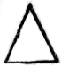

<@pagebreak 3/>

<h1>Die Gefangene von Trawalkor.</h1>

Frau Helene Tschong, die Gattin des reichsten Diamantenhändlers
Kalkuttas, hatte es sich nicht nehmen lassen, uns sofort
in ihrer Villa vier Zimmer herrichten zu lassen. Wir konnten
diese Einladung nicht gut ablehnen, zumal ja Frau Tschong
eine Landsmännin von uns war und wir mit ihrem Manne
bereits in Rangun auf etwas seltsame Weise bekannt geworden
waren.

Da wir beide nach den Aufregungen der letzten Tage, wo
wir ununterbrochen gegen allerlei Hinterlist hatten ankämpfen
müssen, vollständig erschöpft waren, zogen wir uns sofort in unsere
nebeneinander liegenden Schlafzimmer zurück. Harst hatte
lachend erklärt: »Unter acht Stunden mache ich’s diesmal nicht!«
— Dann hatte er die Verbindungstür unserer Zimmer zugedrückt.

Ich begann mich zu entkleiden. Zuweilen warf ich einen
Blick in den prachtvollen Park hinab, der die Villa des
Edelsteinhändlers umgab.

Da mir war’s, als hätte nebenan in Harsts Zimmer eine
Tür geklappt. Ich wußte: aus seinem Schlafgemach ging noch
eine zweite Tür auf den Flur hinaus.

Ich lauschte. — War er etwa nochmals hinab ins Erdgeschoß
gegangen? Hatte er noch etwas mit Frau Helene Tschong
zu besprechen?

Alles blieb still. Ich drückte sacht auf die Klinke. Die
Verbindungstür war verriegelt. —

Was bedeutete das?! Harst schloß sich nie ein, wenn wir
nebeneinander wohnten! Nie!

Ich klopfte leise. — Keine Antwort! — Und doch konnte
Harst noch nicht eingeschlafen sein!

Ich pochte stärker. — Jetzt wußte ich: er hatte das Zimmer
wirklich verlassen.

Da — meine Gedanken wurden abgelenkt: in Harsts Zimmer
hatte das Scharnier eines Koffers leise gequietscht —!

<@pagebreak/>
Des Koffers?! Nun, da konnte nur unser Requisiten-Koffer
in Betracht kommen! Also: Harst dachte gar nicht daran,
schlafen zu gehen, sondern — »machte Maske«!

Ich lächelte. — Warte, diesmal entwischt Du mir nicht!

Meine Müdigkeit war verflogen. In wenigen Minuten
hatte ich mich wieder fertig angekleidet, nahm meinen Strohut,
öffnete lautlos die in unseren Wohnsalon führende Tür und
gelangte dann ebenso lautlos in den Flur.

Harst wollte ja ohne Zweifel in einer Verkleidung nach der
Stadt. Und ich — wollte ihm folgen! Ich mußte erfahren,
was ihn trotz der hinter uns liegenden Strapazen schon wieder
von dannen trieb.

Im Erdgeschoß traf ich den Hausmeister, einen älteren,
sehr würdigen Inder.

»Die Mem Sahib ist nach der Stadt gefahren,« erklärte er.
Er glaubte, ich wollte Frau Tschong sprechen. (Mem Sahib,
Herrin).

Ich bat ihn, Harst gegenüber zu verschweigen, daß ich die
Villa verlassen hätte. — Ich ging dann auf Umwegen nach dem
Parktor. Dort stand ein nettes Häuschen für den Pförtner.
Ich trat ein und begann eine Unterhaltung mit dem ebenfalls
schon bejahrten Inder, stellte mich aber so, daß ich das Tor und
die nach der Villa führende Allee im Auge behalten konnte.

Nach zehn Minuten hörte ich eine laute, scheltende Stimme.
Der Gärtner, der vorhin die Wege geharkt hatte, brachte einen
zerlumpten, braunen Bettler mit scheußlichem Zottelbart am
Arm nach der Parkpforte.

Aha — da hatte ich ihn ja! Die Maske war tadellos. Nur
für mich nicht tadellos genug.

Ich nickte nur, verließ das Häuschen und lugte durch die
Gitterstäbe des Tores. Gegenüber auf der anderen Straßenseite
zog sich ebenfalls eine hohe Parkmauer hin. Und dort
humpelte nun der schmierige Inder entlang.

Aber — ich sah noch mehr! Und was ich sah, veranlaßte
mich, schleunigst hinter den gemauerten Pfeiler zu treten.

Auf dem Fahrdamm schob ein kleiner, magerer Chinese
einen zweiräderigen, mit Früchten beladenen Karren vor sich
her. Und dieser Chinese hatte soeben nach rückwärts zwei anderen
Chinesen, die sich jeder mit einem großen Sacke schleppten,
ein Zeichen gegeben.

Die Sache war zum mindesten verdächtig. Ich hatte den
<@pagebreak/>
Eindruck, daß die drei Gelbgesichter hier nur als Spione herumgelungert
hatten und nun hinter dem verkleideten Harst her
waren. Dieser Verdacht war ja insofern begründet, als wir
genau wußten, daß Kuma Tawi der von Harst unschädlich gemachten
Verbrechergeheimgesellschaft der »Eidechsen« angehört
hatte und daß sich Mitglieder dieser Bande noch auf freiem
Fuße befanden, die es nun vielleicht übernommen hatten, ihren
Genossen an dem deutschen Detektiv zu rächen.

Harst war, als ich jetzt wieder durch die Gitterstäbe lugte,
bereits um die Straßenbiegung verschwunden. Der kleine, den
Karren schiebende Chinese hatte ein schnelleres Tempo angeschlagen,
ebenso die beiden Sackträger.

Ich wartete noch eine Weile. Dann blieb ich stets etwa
hundert Schritt hinter diesen beiden Chinesen.

Nach zehn Minuten erreichten wir, stets in derselben Reihenfolge,
die Hauptverkehrsstraße, die den Maidan durchschneidet.
Hier, wo jetzt um die elfte Vormittagsstunde ein sehr lebhafter
Verkehr herrschte, rückten die drei Chinesen näher auf, und
ich tat dasselbe. Harst humpelte, sehr getreu Lahmheit vortäuschend,
langsam weiter. Zuweilen verlor ich ihn in dem
Menschen- und Wagengedränge aus den Augen.

Dann merkte ich, daß die beiden Sackträger unruhig wurden,
sah auch, daß der Karrenschieber ihnen wieder eifrig Zeichen
machte.

Ich gab mir alle Mühe, Harst zu entdecken: er war verschwunden!
— Daher also die Aufregung seiner Verfolger!

Ich trat an eine Plakatsäule und studierte scheinbar die
Reklameanzeigen. — Die Chinesen trennten sich jetzt. Jeder von
ihnen lief im Trab davon: der Karrenschieber geradeaus, die
beiden Sackträger nach rechts und links in Seitenwege hinein.
— Es war somit ganz offenbar: sie hatten es wirklich auf Harst
abgesehen gehabt.

Ich hastete jetzt vorwärts. Der Karrenschieber sollte mir
nicht entgehen. Ich wollte feststellen, was der Kerl noch beginnen
würde, um Harsts Fährte wiederzufinden.

Mein ahnungsloser Karrenschieber machte jetzt wieder halt.
Er hatte eingesehen, daß Harst einen so großen Vorsprung nicht
gewonnen haben könnte. Er setzte sich auf seinen Karren und
drehte sich eine Zigarette. Ich mußte also wieder den Harmlosen
spielen und nahm auf einer nahen Bank Platz.

<@pagebreak/>
Dann beobachtete ich zu meinem grenzenloser Erstaunen
folgendes:

Von der Stadt kam ein großes Geschäftsauto die Straße
entlanggerollt. Es war so ein Auto mit verschließbarem Kasten,
wie es die Geschäftshäuser zum Ausfahren der gekauften
Waren benutzen. Der Chauffeur trug eine Art Livree. Neben
ihm saß ein zweiter Mann. Beide waren jüngere Inder.

Das Auto glitt langsam an dem Karrenschieber vorüber.
Der Inder neben dem Chauffeur warf dabei mit kaum merklicher
Handbewegung ein Papierkügelchen zwischen die Früchte.

Der dürre Karrenbesitzer tat, als hätte er nichts davon gesehen.
Aber er tat nur so. Seine Augen hatten nur einen
Moment den Flug des Papierkügelchens belauert. Er rauchte
ruhig seine Zigarette weiter, wandte aber beständig den Kopf
bald hierhin, bald dorthin. Er mochte noch immer hoffen, Harst
irgendwo zu entdecken.

Es vergingen so etwa fünf Minuten. Dann geschah wieder
etwas Neues:

Von Süden her kam ein kleiner, mit Fässern beladener
Lastwagen heran. Der Kutscher bog zu spät dem Karren aus,
fuhr gegen das eine Rad und schleuderte den Karren über die
Bordschwelle auf den Reitweg. Nun lagen die ganzen Früchte
über den gelben Kies des Reitweges verstreut, und der kleine
Chinese brüllte dem Lastwagen eine Auslese von Schimpfworten
nach. Diese Gelegenheit benutzten zwei braune, kleine abgerissene
Burschen, sich die Taschen mit köstlichem Obst zu füllen. Ehe
der Karrenbesitzer zuspringen konnte, kniffen sie schon wieder
aus.

Der Gelbe suchte seine Früchte zusammen, richtete das
Wägelchen wieder auf und — das erkannte ich ganz deutlich!
— wühlte in dem Kies mit wachsender Aufregung umher, —
in dem Kies! Mithin suchte er nach dem Papierkügelchen.

Doch — es war offenbar nicht zu finden. Der Gelbe kniete
jetzt sogar am Boden, gab sich die größte Mühe, das winzige
Ding noch irgendwo aufzustöbern. Seinen Eifer, seine Enttäuschung,
seinen Ärger: all das konnte ich aus den Grimassen, die
er schnitt, ablesen.

Endlich gab er’s auf; setzte sich wieder auf den Karren und
stierte nun fast stumpfsinnig vor sich hin.

Nach einer Weile stellten sich die Sackträger bei ihm ein.

<@pagebreak/>
Die drei flüsterten, gestikulierten und — fingen von neuem zu
suchen an!

Merkwürdig: welchen Wert mochte wohl das kleine Ding für
sie haben? — Überhaupt: das, was ich hier beobachtete, hatte
ja recht viel Bedeutungsvolles an sich. Weshalb hatte der junge
Inder von dem Geschäftsauto aus das winzige, zusammengeballte
Papierstück auf den Karren geworfen?!

Ich konnte die vielerlei Fragen, die sich mir aufdrängten,
leider nicht nachprüfen, denn das Kleeblatt trennte sich wieder.
Die Sackträger schlenderten weiter, und dreißig Schritt hinter
ihnen folgte der Karrenmann.

Sie schlugen die Richtung nach Westen ein, dem Hugli-River
zu.

Am rechten Ufer des Hugli liegen die Riesenfabriken und
zahllose Eingeborenendörfer. Eigenartig ist, daß nicht eine einzige
Brücke über den Hugli führt. Es gibt lediglich eine Pontonbrücke,
die Kalkutta mit dem Fabrikort Howrah verbindet
und die zu bestimmten Stunden geöffnet wird, um die Schiffe
durchzulassen. —

Ich blieb den geheimnisvollen drei Chinesen stets auf den
Fersen. So kamen wir denn an die Docks am Flußufer, wo die
Gelben in einem Bootshafen einen Nachen losketteten und
schnell den Fluß überquerten.

Ich fand kein Boot, das mich übergesetzt hätte. Ärgerlich
und enttäuscht mußte ich kehrtmachen. Ich hätte mir diese
Stunde, die ich für die Verfolgung gebraucht hatte, sparen
können.

Die Enttäuschung wirkte so stark, daß ich mich plötzlich zum
Umsinken müde fühlte. Ich nahm einen Wagen und ließ mich
zurück zur Villa Tschong fahren. Als ich mein Schlafzimmer
betrat, fand ich auf dem Kopfkissen meines Bettes ein zerknittertes,
viereckiges Blättchen Papier, auf dem lediglich in roter
Tinte arabische Zahlen und ein gleichseitiges Dreieck zu sehen
waren.

Nur Harst konnte mir diesen Wisch hingelegt haben. Er
mußte also bereits zu Hause sein.

Ich drückte auf die Klinke der Verbindungstür. Die Tür
war jetzt nicht mehr verriegelt.

Harst lag in seinem Bett und atmete tief und ruhig.

— Was bedeutete das alles nun — was?!

* * *

<@pagebreak/>
Ich stand in der halb geöffneten Tür und lauschte. Schlief
Harald wirklich? Verstellte er sich nur? — Ich hüstelte. Er
regte sich nicht. Und ich wußte Bescheid: er schlief nicht! Denn
er wäre bei seinem leisen Schlaf durch das Räuspern sofort geweckt
worden. Er wollte also nicht gestört sein.

Ich schloß die Tür wieder, begann mich zu entkleiden.

Aber — der verdammte zerknitterte Zettel übte auf mich
eine geradezu magische Wirkung aus. Ich hatte ihn auf das
Nachtschränkchen gelegt. Meine Augen kamen nicht davon los.

Als ich schon bei zugezogenen Vorhängen im Bett lag, schaltete
ich das elektrische Nachtlämpchen wieder ein und nahm den
Zettel in die Hand. Er war genau quadratisch bei etwa 17 Zentimeter
Seitenlänge. In einer Linie standen oben die recht
kindlich hingemalten roten Ziffern:

7 9 2 6 2 3 2 6 7 14 15 119

Darunter befand sich das gleichseitige Dreieck, mit der
Grundlinie nach unten. Das Ganze sah so aus:

<table style="border-style: none; border-spacing: 0; padding: 0; margin-left:auto; margin-right:auto;">
<tr><td class="centered">7 9 2 6 2 3 2 6 7 14 15 119</td></tr>
<tr><td class="centered"></td></tr>
</table>

Der verwünschte Zettel! — Wahrhaftig, nun war ich schon
dabei, mir den Kopf darüber zu zerbrechen, was er wohl bedeuten
könnte. Wichtig war er ja auf jeden Fall. Sonst hätte
Harst ihn mir nicht auf das Kopfkissen gelegt.

Wichtig —! Und — er war so vollständig zerknittert! Gerade
so, als ob er ganz eng zusammengeballt gewesen wäre —
zu einem Kügelchen!

Es gab mir einen förmlichen Ruck durch den Körper dieser
Gedanke: Papierkügelchen!

Ja — das Papierkügelchen! — Ich zweifelte nicht im geringsten
mehr: es war dasselbe, das mir schon vorhin so viele
Rätsel aufgegeben hatte!

Dasselbe! Alsso hatte Harst es irgendwie an sich gebracht!

Ich lächelte plötzlich. Ich dachte an die beiden kleinen braunen
Spitzbuben, die das Obst mit hastigem Griff zusammengerafft
hatten und dann davongeeilt waren.

Bestellte Arbeit — ohne Frage! Und zwar von Harst bestellte
Arbeit! Ihm war ja alles möglich. Er hatte ja schon
ganz andere Dinge fertiggebracht!

<@pagebreak/>
Diese Überzeugung, daß Harald jetzt fraglos bereits wieder
irgend einer sich anspinnenden Schurkerei (denn was diese Gelben
unternahmen, war ja zumeist eine gerissene Teufelei) auf
die Spur gekommen sein mußte, beruhigte mich so sehr, daß ich
dann in kurzem einschlief.

»Bitte beeile Dich mit Deiner Toilette, mein Alter« sagte
er und zog die Fenstervorhänge auf. »Sofort wird die Polizei
hier sein. Um Deine Gedanken schleunigst aus dem Traumreich
in die Wirklichkeit hinüberzulenken, will ich Dir nur mitteilen,
daß Kuma Tawi, Tschongs schuftiger Bruder, uns glänzend
bemogelt hat und noch lebt. Nur zum Schein versank er im
Flusse, als ob ein Krokodil ihn hinabzöge. In Wahrheit ist er
nur allzu lebendig.«

»Meine Hochachtung, Harald,« sagte ich lächelnd. »Das
Papierkügelchen hast Du überaus geschickt in Deinen Besitz gebracht.«

Er schaute auf. »So, Du hast die Sache also durchschaut.«

»Nicht völlig. Manches ist mir unklar. Nur die beiden
braunen kleinen Obstdiebe erkannte ich als »bestellte Arbeit«.
Ebenso sah ich, daß das Kügelchen von dem Geschäftsauto aus
in den Karren des Chinesen geworfen wurde. Diese Art Nachrichtenübermittlung,
bei der so viel Vorsicht und Schlauheit aufgewandt
wurde, deutete auf eine ganz große Lumperei hin.«

»Ja, das ist die Entführung einer Dame stets,« nickte Harst
mit auf den Zettel gerichteten Augen.

»Entführung?« — Ich reckte das Worte vor Überraschung
über Gebühr.

»Frau Helene Tschong ist von ihren Vormittagsbesorgungen
nicht zurückgekehrt,« erklärte er leise. »Natürlich steckt Kuma
Tawi dahinter. Er war einer der beiden chinesischen Sackträger.«

»Woher weit Du denn, daß Frau Tschong verschwunden
ist?« fragte ich.

»Der indische Hausmeister der Tschongs weckte mich vor einer
Viertelstunde, indem er stark an die nach dem Flur hinausgehende
Tür meines Zimmers pochte. Ich ließ ihn ein, und da
erzählte er mir dann, daß er soeben die Polizeidirektion telephonisch
davon verständigt hätte, Frau Tschong sei aus einem
kleinen Hotel am Hafen nicht wieder herausgekommen. Sie
hatte dem Kutscher ihres eleganten Wagens befohlen, an der
nächsten Straßenecke auf sie zu warten, sie würde in einer halben
<@pagebreak/>
Stunde spätestens wieder da sein. Als nun 2 ½ Stunden
verflossen waren, schickte der unruhig gewordene Kutscher, der
seine Herrin im Hotel d’Angleterre hatte verschwinden sehen, einen
Polizeibeamten in das betreffende Haus. Dieser kehrte
mit der Meldung zurück, im Hotel wüßte niemand etwas von
Frau Tschong. Da ist denn der Kutscher schnell nach Hause gefahren,
hat dem alten Hausmeister Pfara Donki die Sache gemeldet,
und dieser wandte sich sogleich an die Polizei.«

»Hm — und der Beweis, daß eine Entführung vorliegt?«
meinte ich gedehnt.

»Der Beweis dafür ist das von uns Beobachtete, mein
Alter. Da ich der Polizei nicht alles mitteilen möchte, was
uns jetzt schon bekannt ist, wollen wir die Angelegenheit schnell
unter uns durchsprechen. — Daß das Kuma Tawi-Abenteuer
noch eine Fortsetzung haben würde, befürchtete ich bereits
morgens, als wir hierher kamen und Frau Tschong das Geld
brachten. Ich bemerkte nämlich auf der Straße nach Süden
unweit der Villa zwei Chinesen, die ihre Rückenlast, vollgepackte
Säcke, wie um sich auszuruhen auf die Bordschwelle gestellt
hatten. Die beiden standen mit dem Rücken nach der
Parkpforte hin. Aber sie sahen trotzdem ganz genau, wer die
Pforte passierte, — genau so, wie ich sah, daß der eine von
ihnen einen Spiegel in der Hand hatte, mit dessen Hilfe er
nach rückwärts beobachtete. Wenn man derartige Hilfsmittel gebraucht,
muß man sich vorher überlegen, ob die Sonne nicht
gerade diesen in der Hand verborgenen Hohlspiegel trifft und
ihn bei einer gewissen Stellung wie einen Diamant aufleuchten
läßt. — Du wirst zugeben, mein Alter, daß dieser aufblitzende
Spiegel die Leute sofort verdächtig machte. Als wir
dann Frau Tschong das Geld übergeben und uns in unsere
Gastzimmer zurückgezogen hatten, überdachte ich diese »Spiegelszene«
nochmals und kam zu dem Entschluß, mich sofort zu
überführen, ob die Kerle draußen auf der Straße noch immer
herumlungerten.«

»Gut — das weitere kenne ich: Du spieltest einen braunen
Bettler und ließest Dich von dem Gärtner an die frische
Luft setzen. Dann folgten Dir der Karrenmann und die Sackträger.
Aber — wohin warst Du im Maidan-Park so plötzlich
verschwunden?«

Harst lächelte schwach. »Oh — ich fuhr auch an Dir vorüber,
lieber Alter. Du hast doch später den mit Fässern
<@pagebreak/>
beladenen Wagen bemerkt, der den Obstkarren umwarf. — Nun,
als dieser Wagen von der Stadt, also von Norden her in Sicht
kam, wollte ich die Reihenfolge unseres Spaziergangs etwas
ändern, das heißt, ich wollte mich ungesehen zwischen den Karren
und die Sackträger einschieben. Das konnte ich nur, indem
ich mich blitzschnell hinten auf den Lastwagen schwang und
zwischen die leeren Tonnen kroch. Der Lenker hat dann von
mir 5 Pfund erhalten und gehorchte dafür wie ein begabter
Gehilfe. Wir machten kehrt und blieben etwa zwanzig Meter
hinter dem Obstkarren halten, der bereits an der Bordschwelle
des Reitweges stand. Durch das Spundloch eines Fasses, dessen
Deckel ich von innen festhielt, konnte ich gerade so gut wie Du
von Deiner Bank aus erkennen, daß man dem Karrenmann
das Kügelchen zuwarf. Mein Kutscher, der sich an den Hinterrädern
verabredungsgemäß zu schaffen machte, mußte dann
zwei braune Straßenjungen bestechen, die ihre Aufgabe tadellos
erledigten, nachdem die Obstladung durch meinen Tonnenwagen
umgekippt worden war. Sie stahlen Früchte, hoben
das Kügelchen mit auf und trafen mit meinem Wagen 100
Meter weiter wieder zusammen, erhielten je ein Pfund und
die Anweisung, den drei Chinesen zu folgen und mir hier nachher
zu berichten, wo diese wohnten oder für längere Zeit eingekehrt
waren. Ich selbst konnte nun also auf Umwegen getrost
nach Hause gehen, zumal ich ja wußte, daß auch Du hinter
den dreien her warst.«

»Alles sehr schön,« meinte ich jetzt. »Nur — wo ist bei
alledem der Beweis, daß Frau Tschong entführt wurde. Sie
ist zu ihrem Wagen nicht zurückgekehrt, gut. Doch, sie kann ja
auch eine unerwartete Abhaltung gehabt haben!«

»Zunächst, lieber Alter: in dem einen Sackträger erkannte
ich trotz des falschen Bartes und mancher anderen künstlichen
Gesichtsveränderungen unseren »Freund« Kuma Tawi. Der
Halunke hatte nämlich bei seiner Maske eins vernachlässigt:
die nackten, in Sandalen steckenden Füße! — Dieser gebildete
Chinese gibt ja sehr viel auf sein Äußeres, genau so wie sein
Bruder, der Juwelenhändler. Die Sandalen ließen die Zehen
frei. Also präsentierten sich die Zehennägel in all ihrer Gepflegtheit
trotz der Staubschicht darauf.«

»Man muß Deine Augen haben, um derartiges zu bemerken,«
meinte ich.

»Dafür habe ich ja auch einen Beruf erwählt, bei dem man
<@pagebreak/>
das Gras wachsen hören und durch ein Brett sehen können
muß, wenn’s nottut,« sagte Harst völlig ernst. »Doch — zurück
zu Frau Tschongs Verschwinden. — Es steht fest, daß
Kuma Tawi sich in der Nähe der Villa von morgens an herumgedrückt
hat; weiter, daß aus einem Geschäftsauto dem Karrenmann
eine Papierkugel mit einer Geheimschrift zugeworfen
wurde; schließlich, daß Frau Tschong, als diese Papierkugel
zwischen die Früchte flog, bereits zwei Stunden im Hotel
d’Angleterre geweilt hatte. Diese Zeitangabe habe ich von
dem Kutscher, der die Dame nach der Stadt gefahren hatte.«

»Ah — Du ließest Dir den Kutscher heraufkommen?«

»Natürlich. Der Hausmeister schickte ihn mir. Ich richtete
nur ein paar Fragen an den Mann, der bei Tschongs schon
acht Jahre diese Stellung innehat und einen vorzüglichen
Eindruck macht. — Eine meiner Fragen lautete: »Sahen
Sie von der Straßenecke aus ein Geschäftsauto in der Nähe
des Hotels halten, als Sie auf Ihre Herrin warteten?« —
Und der Kutscher, ein Eurasier (Mischling zwischen Europäer
und Inderin) antwortete: »Jawohl, Master Harst, nachdem
ich eine Stunde etwa gewartet hatte, verließ ein Geschäftsauto,
das jedoch keinen Firmennamen zeigte, die Hofeinfahrt des
Hotels.« — Begreifst Du die Sache nun, mein Alter? Man
hat Frau Tschong dort in das Hotel gelockt, hat sie überfallen
und — in dem Auto verschleppt. Die Papierkugel kann
nur die Nachricht von dem geglückten Streich enthalten, bei
dem Kuma Tawi sich absichtlich nicht persönlich beteiligt hat.
So, das ist meine Ansicht über Frau Tschongs Verschwinden.
Wenn Du, mein Alter, die einzelnen Vorfälle zwangloser und
besser aneinanderreihen und ergänzen kannst, so tue es. Jedenfalls
werden wir hier wieder gegen eine ganze Bande zu
kämpfen haben. Drei davon kennen wir bereits, nämlich
Kuma Tawi, den Karrenschieber und den zweiten Sackträger.
Außerdem dann noch die beiden Inder auf dem Auto, also bisher
fünf Mann. Es dürften aber noch mehr daran beteiligt
sein.«

Ich konnte zu alledem nur zustimmend nicken. Harsts
Kombinationen mochten kühn sein. Aber sie waren durchaus
logisch. Und — er irrte sich in dieser Hinsicht ja so selten! —
Nur eins war mir noch nicht klar: Weshalb die drei Chinesen
die Villa so lange überwacht hatten, bis Harst heraustrat, den
sie also trotz seiner Verkleidung sofort erkannt hatten. Gewiß,
<@pagebreak/>
die Vermutung lag nahe, daß diese Überwachung uns beiden
als den gefährlichsten Gegnern Kuma Tawis galt. Immerhin
war es aber von Kuma Tawi doch sehr unvorsichtig, sich
so lange in nächster Nähe eines Harald Harst aufzuhalten.
— Als ich Harsts Meinung hierüber hören wollte, erwiderte
er nur: »Um eine Überwachung allein wird es sich hier nicht
handeln. Die Leute wollen fraglos mehr, als uns lediglich
nicht aus den Augen zu verlieren. — Falle!«

Ich verstand dieses »Falle« sofort, sagte mit einem leisen
Gefühl des Unbehagens: »Wir werden uns mithin sehr inachtnehmen
müssen, daß wir nicht in eine Falle geraten. Kuma
Tawi dürfte uns kaum schonen, wenn er uns in seine
Gewalt bekommt. — Noch etwas, Harald,« fügte ich nach
kurzer Pause hinzu. »Du hast also die Geheimschrift auf dem
Zettel noch nicht entziffert? Und — was bedeutet das
Dreieck?«

»Entziffert?! Dazu werden Berechnungen nötig sein.
Ich glaube vorläufig nur erkannt zu haben, daß die Spitze des
Dreiecks kaum durch Zufall gerade unter der Zahl 7 steht, so
daß die Spitze also wie ein Pfeil darauf hinweist. Das muß
von Wichtigkeit sein. Die 7 wird so etwas wie der Schlüssel der
Zahlenschrift sein, das Dreieck aber lediglich eine Verschleierung
eines Pfeiles oder dergleichen, der diese 7 aus den anderen
Ziffern hervorheben sollte. — Da — es klopft. Das dürfte
Detektivinspektor Blosley sein.«

Ich war inzwischen mit meiner Toilette fertig geworden.
Blosley, der einen älteren Kollegen vertrat, war zu sehr Engländer,
um Harst direkt zu bitten, ihm bei den bevorstehenden
Ermittlungen zu helfen. Harst wieder verriet nichts von dem,
was er wußte. Die Unterhaltung mit dem Beamten hatte etwas
Gezwungenes an sich. Der Hausmeister, der ihr beiwohnte,
war ehrlicher. Er sagte ganz offen, daß er als Vertreter des
abwesenden Hausherrn Harst bitten möchte, sich dieser Sache
anzunehmen.

Blosley erklärte darauf, die Untersuchung sei ja bereits in
vollem Fluß; seine Beamten durchstöberten jetzt schon das
kleine Hotel.

Das hieß so viel als: Eure Einmischung ist nicht erwünscht.

Harst erwiderte nun erst dem Hausmeister, der Fall läge
so einfach, daß wir wohl kaum nötig wären.

In demselben Moment erschien der Kutscher, der Frau
<@pagebreak/>
Tschong nach der Stadt gefahren und den Blosley hatte vernehmen
wollen.

Der schlanke, hübsche Eurasier erzählte sehr eingehend,
wo er mit seiner Herrin zwecks Besorgungen gewesen, bevor
sie nach dem Hotel zu fahren ihm befahl. Er nannte hintereinander
vier Geschäfte, zuletzt ein amerikanisches Warenhaus,
Gebrüder Smollins. — Auf Blosleys Frage, ob er gemerkt
hätte, daß Frau Tschong von irgend jemandem angesprochen
worden sei, schüttelte er den Kopf. »Von niemanden — ganz
bestimmt nicht. Wenigstens nicht auf der Straße vor den
Geschäften.«

Dann fügte der Kutscher von selbst hinzu: »Aber das
Auto sah ich, nach dem Mr. Harst sich erkundigt hat.«

Ah — nun saß Harald mit seiner Verheimlichung unserer
Vormittagserlebnisse fest!

Blosley schaute Harst überrascht an.

»Ein Auto?« fragte er.

»Ja,« meinte Harst. »Die Annahme liegt doch so nahe,
daß Frau Tschong aus dem Hotel sofort weggeschafft worden
ist. Dazu eignet sich zum Beispiel ein geschlossenes Geschäftsauto
ohne Firmennamen sehr gut. In dem Kasten des
Kraftwagens kann man sogar mehrere Leute verbergen.«

Blosley wandte sich wieder an den Eurasier. »Sie sahen
also ein solches Auto?«

»Ein großes, hellgrün gestrichenes,« antwortete der Kutscher
eifrig. »Vorn saßen zwei Inder. Der eine trug eine Art
Livree, wie dies in größeren Geschäften seit einiger Zeit üblich.
Der Chauffeur hatte nur einen gelben Leinenanzug an und
einen Turban auf dem Kopf. Mehr weiß ich nicht, denn das
Auto fuhr von der anderen Seite die Hafenstraße hinunter.«

Blosley lächelte. »Nun, sollte dies Auto bei dieser Sache
irgendwie eine Rolle spielen, dann werden wir’s bald haben.
— Ich hätte hier nichts mehr zu tun. Auf Wiedersehen, meine
Herren.«

Das klang wieder sehr kühl. Wir verbeugten uns, und
der Hausmeister geleitete den Inspektor dann hinunter.

* * *

Der Hausmeister hatte nun schon vorher gebeten, ganz
zwanglos auch in Abwesenheit Frau Tschongs über die Villa
und deren Dienerschaft zu verfügen. Wir begaben uns nun
<@pagebreak/>
zunächst in das Speisezimmer hinunter, wo ein Mittagessen
zu sieben Gängen unserer schon wartete.

In der Villa Tschong gab es nur indische Diener. Der
Koch war sogar ein Europäer, ein geborener Züricher, der uns
die Suppe selbst servierte, nur um Gelegenheit zu haben, mit
Harst ein paar Worte zu wechseln. Der Mann hieß Büngli
und machte aus seiner Bewunderung für den »großen Detektiv«
gar kein Hehl. Von ihm erfuhren wir aber auch so manches,
was für uns recht interessant war. Büngli betonte, daß
Frau Helene Tschong sowohl bei der Dienerschaft und den Eingeborenen,
als auch bei der Europäerkolonie Kalkuttas sehr
beliebt sei. Ihre Ehe mit dem Edelsteinhändler sei die denkbar
glücklichste und Frau Tschong würde wohl restlos zufrieden
sein, wenn sie nicht so sehr um den Verlust ihrer Schwester
trauerte, die vor zwei Jahren während der Überfahrt von
Bremen nach Kalkutta tödlich verunglückte.

Inzwischen hatte auch der alte Hausmeister Pfara Donki
sich im Speisezimmer eingefunden. Er ergänzte Bünglis Angaben
noch, indem er eine große Photographie Fräulein Anna
Mirzbachs holte und sie uns zeigte. Die beiden Schwestern
hatten große Ähnlichkeit miteinander. — Die jüngere, unverheiratete
besaß ein liebreizendes Gesicht mit ein Paar sehr
seelenvollen Augen. Für meinen Geschmack war sie schöner
als Frau Tschong.

Pfara Donki berichtete nun, daß das Fräulein für längere
Zeit zu Tschongs hätte zu Besuch kommen wollen. Erst kurz
vor Kalkutta sei das Unglück bei regnerischem Wetter gegen
Abend passiert. Matrosen des Dampfers hörten einen Schrei
und sahen auch einen Körper in die See stürzen. Die ausgesetzten
Rettungsboote fischten dann lediglich eine Ölkappe auf,
die als Fräulein Mirzbach gehörig erkannt wurde. Sie selbst
war ertrunken. Ihr Körper wurde nie gefunden, obwohl der
Unglücksfall sich dicht vor der Hugli-Mündung ereignete.
Harst hatte bisher still zugehört.

»War damals denn starker Seegang?« fragte er jetzt.

»Nein, Mr. Harst. Nur starker Regen. Niemand vermochte
sich zu erklären, wie Fräulein Mirzbach über die Reling
des Promenadendecks in die See stürzen konnte. Sie muß
sich gerade zu weit übergelehnt haben.«

Harst nickte zerstreut, und Pfara Donki fügte hinzu: »Wollen
die Herren nicht doch die Polizei bei den Nachforschungen
<@pagebreak/>
so etwas unterstützen? — Gewiß, Inspektor Blosley ist nicht
gerade sehr höflich zu Ihnen gewesen. Es mag da so etwas
Eifersüchtelei mitsprechen. Aber —«

Harst fiel ihm schon ins Wort. »Keine Sorge, bester Pfara
Donki. Wir sind Ihres Herrn Freunde, genießen hier Gastfreundschaft
und halten es für unsere Pflicht, nichts unversucht
zu lassen, Frau Helene schleunigst zu befreien. Zur Zeit ist ja
die Polizei noch an der Arbeit. Da würden wir uns also gegenseitig
nur stören. Wenn wir aber das vorzügliche Mittagessen
eingenommen haben, werden wir ohne Säumen die Sache
auf unsere Art in Angriff nehmen. Dazu ist nötig, daß unser
Koffer, der die Signatur 3 hat, sofort in den Pavillon geschafft
wird, der dort hinten an der Parkmauer steht, wie ich vorhin
bemerkte. Er scheint bewohnbar zu sein. Lassen Sie also jetzt
erst mal den einen Koffer dorthin bringen und geben Sie mir
den Schlüssel zu dem Pavillon. Dann kann gegen Abend der
Pavillon für uns als vorläufige Wohnung hergerichtet werden.
Haben Sie noch einen zweiten Schlüssel dazu, Pfara Donki?«

Der Koch und der Hausmeister hatten jetzt häufiger seltsame
Blicke ausgetauscht. Nun platzte Büngli mit ein paar
Worten heraus, die genug besagten:

»Nur nicht in den Pavillon, Mr. Harst, nur nicht!«

»Na nu? Weshalb denn nicht?«

»Weil — weil es dort nicht geheuer ist!«

Ich lachte auf. Harst blieb jedoch völlig ernst.

»Nicht geheuer? — Erklären Sie mir das genauer,«
meinte er.

»Nun — man hat in dem Pavillon wiederholt nachts ein
seltsames Licht und eine noch seltsamere Gestalt beobachtet, Herr
Harst. Aber nie fanden wir ein lebendes Wesen dort, wenn wir
überraschend eindrangen. Das Licht und die Gestalt blieben
monatelang aus, erschienen dann wieder. So geht das schon
ein paar Jahre. Wir haben uns schließlich daran gewöhnt.«

Pfara Donki flüsterte jetzt hastig: »Und in der verflossenen
Nacht, etwa morgens um 4 Uhr kurz vor Tagesanbruch habe
ich das Licht abermals seit längerer Zeit gesehen. — Es gibt
übrigens nur einen Schlüssel zu dem kleinen Häuschen, das
aus den Resten eines verfallenen Hindutempelchens errichtet
wurde. Es war so eine Laune meines Herrn, Mr. Harst.
Der Pavillon steht jetzt zehn Jahre, und die Villa ist vor zwölf
Jahren erbaut.«

<@pagebreak/>
»Gut, dann lassen Sie also sofort unsere ganzen Sachen
und auch die Betten und so weiter hinüberschaffen, Pfara Donki,
und verbieten Sie den Dienern, fortan den hinteren Teil des
Parkes zu betreten. Sagen Sie nur gleich, daß ich auf jeden
Menschen schieße, der sich in der Nähe des Pavillons herumdrückt.«

Um ½ 5 nachmittags gingen wir in unser neues Heim hinüber.

Der viereckige Raum war bereits als gemeinsames Schlafzimmer
für uns hergerichtet. Nachdem Pfara Donki sich überzeugt
hatte, daß die Diener nichts vergessen hatten, verabschiedete
er sich. Harst rief ihm noch nach, er solle uns doch sofort
einige kalte Speisen und auch Getränke schicken, damit wir
nachher uns ein Abendbrot allein zusammenstellen könnten.
— Bereits zehn Minuten später erschienen zwei Diener mit
einem Riesenkorb, dessen Inhalt sie in einen Wandschrank der
Halle verstauten. Auch eine Teemaschine hatte der Hausmeister
mitgeschickt.

Dann waren wir allein. Harst schlug mir leicht auf die
Schulter.

»Ein großartiges Quartier, mein Alter, mit einem Geist
als Zugabe! — So, nun wollen wir uns ein wenig kostümieren.
Ich werde ein älterer, würdiger Engländer werden und
Du mein indischer Diener, auch schon gesetzteren Alters.«

Um ½ 6 gelangten wir durch die hintere Parkpforte, deren
Schlüssel uns der Hausmeister aus eigenem Antrieb gegeben
hatte, auf einen schmalen Fußweg, der zwischen Gärten eine
Strecke entlanglief und schließlich dicht vor dem Maidan in eine
Fahrstraße einmündete. Hier nahmen wir einen Wagen. Ich
kletterte mit der braunledernen Reisetasche »als Diener« zum
Kutscher auf den Bock. So fuhren wir vor dem Hotel d’Angleterre
vor. Harst trug sich als Mr. Steward, Kaufmann aus
Dehli, ins Fremdenbuch ein und belegte und bezahlte auch gleich
zwei Zimmer für drei Tage.

Das Hotel gehörte einem Wiener, einem früheren Kellner
namens Meidinger. Es war peinlich sauber bei aller Einfachheit.
Harst verstand es dann, den in Österreich bekannten
Engländer zu spielen, begann über Wien zu sprechen und machte
Meidinger schnell vertraulich. Dieser erzählte ihm schon in der
Vorhalle, das er heute viel Ärger gehabt hätte. Die Polizei
<@pagebreak/>
suche eine Dame, die hier in seinem Hotel verschwunden sein
solle, und das sei ein Unsinn.

Ich stand in respektvoller Haltung dabei und hörte alles
mit an. Dieser Meidinger log nicht. Das merkte man sofort.

Dann fügte er noch empörter hinzu: »Am tollsten bei der
Geschichte ist, daß offenbar ein Geschäftsauto, das ein Bekannter
auf meinem Hofe seit langem untergestellt hat, mit zu dieser
Entführung benutzt worden ist. Der Kraftwagen gehört
dem Kaufmann Estromelle, dem Seidenhändler aus der Nelsonstraße.
Estromelle braucht ihn selten, nur zum Abfahren
von Waren von den Dampfern und vom Güterbahnhof. Ich
kümmere mich nie um das Auto. Es steht auf dem Hofe
in einem offenen Schuppen, und Estromelles Leute holen es,
wann sie wollen. Die Hofeinfahrt ist tagsüber offen. Gewiß,
der Kraftwagen fuhr heute davon und kam nach einer Stunde
zurück. Aber ich habe deswegen noch nicht mal den Kopf gehoben.
Jetzt macht dieser verrückte Inspektor Blosley mir den
Vorwurf, ich steckte mit den Banditen, die Frau Tschong verschleppt
haben, unter einer Decke. Lächerlich! Ich wurde natürlich
saugrob. Das half. Aber der Ärger sitzt mir noch in
den Nerven.«

»Treten wir mal in Ihr Kontor ein.« meinte Harst.

Hier gab er sich dem Wiener zu erkennen. »Wenn ich Sie
für mitschuldig hielte,« erklärte er, »würde ich Mr. Steward
geblieben sein. So aber arbeiten wir besser gemeinsam. Kann
ich mir mal das Auto an sehen?«

Wir gingen durch den Hinterausgang auf den langgestreckten
Hof und in den Schuppen. Harst besichtigte die Gummireifen
sehr sorgfältig, sogar mit der Lupe. Dann kletterte er
in den Wagenkasten hinein, der hinten eine Tür hatte. In
einer Ecke lagen alte Decken und Säcke, um die Seidenballen
einzuschlagen. Harst hatte seine Taschenlampe eingeschaltet
und warf diese Decken nun einzeln mir zu.

»Schau’ sie Dir an,« meinte er. »Vielleicht haben sie Frau
Tschong als Sitz gedient. Und vielleicht findet sich irgend etwas
darin.«

Meidinger half mir. Wir fanden nichts.

Harst kletterte wieder heraus. Wir warfen die Decken und
Säcke in den Wagenkasten zurück. Nachher sah sich Harst auch
<@pagebreak/>
den Hof noch an. Linker Hand gab es da eine Grenzmauer nach
dem Nachbargrundstück.

»Wer wohnt dort?« fragte Harst.

»Das Haus steht leer. Es ist eine baufällige Baracke, die
nächstens abgerissen wird. Ich habe sie gekauft, da ich mein
Hotel vergrößern will.«

Harst ging an der Mauer entlang, machte kehrt und stellte
eine Leiter an das wagerechte Schuppendach, das mit der
Mauerkrone fast in einer Linie lag. Er stieg nach oben und
schaute in den Nachbarhof hinab. Dann turnte er über die
Mauer und verschwand.

Wir mußten eine Viertelstunde warten, bevor wir Harald
wieder erblickten. Aber er kam durch die Hofeinfahrt von
der Straße her.

»Na — dieser Teil der Sache ist nun geklärt,« sagte er mit
jener Lebhaftigkeit, die stets verriet, daß er dem Endziele recht
nahe war. »Frau Tschong ist nie hier im Hotel gewesen. Der
Kutscher hat nicht genau beobachten können, welches Haus seine
Herrin betrat. Der Hoteleingang liegt an der linken Hausseite,
und die Haustür der Baracke nebenan liegt rechts, also
beide Eingänge dicht nebeneinander. Da Frau Tschong dem
Kutscher befahl, nach dem Angleterre-Hotel zu fahren, nahm
dieser an, die Dame wäre auch ins Hotel eingebogen, während
sie in Wahrheit das leere Haus besuchte und dort gleich im Flur
überfallen und durch Chloroform betäubt worden ist. Im Flur
fand ich zwei Lockennadeln und den Gummistöpsel eines Fläschchens,
der noch nach Chloroform riecht. Dann wurde Frau
Tschong in den Schuppen geschafft. In der Mauer sind acht
Steine gelockert. Durch dieses Loch hat man sie hindurchgezwängt.
Vom Schuppen aus sieht man die losen Steine nicht,
da ein Haufen leere Kisten davor steht.«

»Wir müssen uns jetzt verabschieden,« meinte Harst.
»Schraut, hole die Reisetasche. Über die beiden Zimmer können
Sie verfügen, bester Meidinger. Ich bin hier mit meiner
Arbeit fertig.«

»Und — wo geht’s nun hin?«

»In das amerikanische Warenhaus, wo Frau Tschong zuletzt
war, bevor sie dem Kutscher hierher zu fahren befahl. Ich
nehme an, daß man ihr dort auf irgend eine Weise nahegelegt
hat, das rote Haus neben dem d’Angleterre aufzusuchen. Vielleicht
erinnert einer der Verkäufer sich, daß Frau Tschong von
<@pagebreak/>
jemand angesprochen wurde. — Leben Sie wohl, Herr Meidinger.
Und — schweigen Sie!« —

Wir machten uns zu Fuß nach dem Kaufhaus auf. Wir
hatten nur fünf Minuten zu gehen. Es war jetzt ½ 7, und um
7 war Geschäftsschluß.

Das Warenhaus, ein riesiger Neubau mit breitem Portal,
erinnert so etwas an Wertheim-Berlin, Leipziger Straße. Wir
traten ein. Ein chinesischer Türhüter riß die große Pendeltür
auf. Ich blieb stets bescheiden als Diener hinter Harst. Mein
»Herr« machte sehr bald an einem Verkaufsstand halt, wo es
Toilettenartikel für Damen gab. Er verlangte einen Augenbrauenstift,
zahlte an der Kasse und — wandte sich dem Ausgang
wieder zu.

Ich war mit Recht überrascht. Hatte Harst hier denn bereits
etwas entdeckt?!

Auf der Straße winkte er ein leeres Taxameterauto heran.
Wir stiegen ein und fuhren bis zu jenem Fußgängerweg, der
an der Hinterseite der Villa Tschong entlangführte.

Als wir nun nebeneinander diesen Pfad dahinschritten,
fragte ich sofort: »Weshalb bliebst Du nicht länger in dem
Kaufhause?«

»Weil es zwecklos gewesen wäre, genau so zwecklos, wie
mein Bemühen, Dir Detektivaugen anzugewöhnen. Der chinesische
Türöffner war der zweite Sackträger.«

Ich war so verdutzt, daß ich ein »Nicht möglich!« stammelte.

»Er war’s,« sagte Harald kurz. »Der Kerl hat eine Narbe
auf der linken Wange, offenbar von einem Messerschnitt. Das
genügt zum Wiedererkennen. Der Halunke wird sich heute bis
Nachmittag haben beurlauben lassen. Und er war’s, der seinen
Stellvertreter veranlaßte, Frau Tschong den Zettel zuzustecken.«

»Welchen Zettel?«

»Nun, den ich im Flur des leeren Hauses in einer breiten
Dielenritze fand, zum Fidibus zusammengelegt. Frau Tschong
wird ihn in der Hand gehabt haben, als man sie überfiel. Da
ist das schmale Papier ihr aus der Hand und in die Spalte
zwischen die morschen Dielen gefallen.«

»Das klingt allerdings wahrscheinlich. Was steht auf dem
Zettel?«

»Du kannst ihn nachher lesen. — Du merktest wohl, daß
ich an der Kasse des Kaufhauses mit der Kassiererin sprach. Ich
<@pagebreak/>
sagte, vormittags sei doch ein anderer Türhüter da gewesen, als
ich Einkäufe erledigte. Ob die Leute denn nicht den Tag über
Dienst hätten? — Sie erwiderte, der eigentliche Pförtner sei
bis nachmittags 3 Uhr beurlaubt gewesen und hätte einen
Freund als Aushilfe gestellt. — Dieser Freund, mein Alter,
hat Frau Tschong ganz sicher den Zettel zugesteckt, als sie in das
Kaufhaus hineinging.«

Wir schlossen die hintere Parkpforte auf und gingen in
unser neues Heim, den hübschen Pavillon. Es war bereits
dämmerig, und Harst schaltete sofort das Licht in der Wohnhalle
ein.

Ich trug die Reisetasche in unser Schlafgemach. Harst hatte
sich vorn in einen Korbsessel gesetzt und studierte den Zettel, —
den Zettel, der Frau Tschong nach dem leeren Hause gelockt
hatte.

Ich stellte die Reisetasche auf den obersten unserer Koffer
und packte sofort die Sachen aus, die ich zum Schein hineingetan
hatte. Ich hörte Harst trotz der geschlossenen Tür ganz deutlich
das bekannte Lied aus Rigoletto pfeifen: »Ach — wie so
trügerisch sind Frauenherzen —«

Dann brach er mitten drin ab.

Ich war nun fertig, öffnete die Verbindungstür und betrat
die Wohnhalle. Harsts Sessel stand mit dem Rücken nach
der Tür hin. Er saß mit gesenktem Kopf dort. Aber — wir
hatten Besuch bekommen!

Wahrhaftig — im Sessel Harst gegenüber hatte kein anderer
als unser Hausherr, der Edelsteinhändler, Platz genommen.

Er erhob sich jetzt schnell, eilte mir entgegen rief:

»Lieber Herr Schraut, welches Unheil. Meine Frau ist
verschwunden!«

Er reichte mir die Hand. Er sprach das Deutsche fast fehlerfrei.

»Wir werden sie finden, lieber Herr Tschong,« tröstete
ich ihn.

Er trug genau denselben Anzug wie damals, als wir ihn
in Rangun unter so merkwürdigen Umständen kennengelernt
hatten. Sein bartloses, intelligentes Gesicht mit der goldenen
Brille sah jedoch recht wenig schmerzerfüllt aus, fand ich. Mehr
<@pagebreak/>
noch: Der Ausdruck seiner Augen gefiel mir nicht. Es war etwas
wie versteckter Hohn darin.

Er hielt meine Hand noch immer in der seinen. »Hoffen
Sie wirklich, Helene wieder befreien zu können?« meinte er
hastig. »Haben Sie schon eine Spur entdeckt?«

»Aber gewiß. Das kann Ihnen Harald jedoch viel besser
erzählen. Zum Beispiel die —«

Ich wollte »Papierkugel« sagen, doch — da trat etwas so
Unerwartetes ein, daß ich unwillkürlich aufschrie:

Harst war plötzlich mitsamt seinem Sessel nach hinten umgekippt!

Und — jetzt erst sah ich: Harst war mit dünnen, weißen
Stricken an dem Korbsessel festgebunden und hatte einen Knebel
im Munde!

Bevor ich noch recht wußte, was eigentlich geschehen, hielt
mir Tschong eine Pistole vor das Gesicht.

»Keinen Laut, keine Bewegung!« drohte er.

Nun endlich kam mir die Erleuchtung: es war gar nicht
Tschong! Es war sein Zwillingsbruder Kuma Tawi. Die
beiden sahen sich ja zum Verwechseln ähnlich, sprachen beide
gleich gut meine, unsere Muttersprache.

Von hinten packte man jetzt meine Arme, riß sie nach rückwärts.
Ich fühlte, wie man mir die Handgelenke fesselte, —
und so roh fesselte, daß ich vor Schmerz hätte aufschreien
mögen.

Dann setzte man mich in den zweiten Sessel, band mich
fest, richtete Harsts Sessel wieder auf.

Kuma Tawi und zwei andere Chinesen waren unsere Überwinder.
— Unser Todfeind rückte sich jetzt einen dritten Stuhl
heran. Mir hatte man keinen Knebel zwischen die Zähne geschoben.
Dafür stand hinter mir einer der Chinesen mit einem
Revolver und drückte mir die Mündung gerade ins Genick.
Und dieser kleine Kerl war — der Karrenschieber! Ich
hatte ihn sofort erkannt.

Kuma Tawi musterte Harst höhnisch und rachsüchtig.

»Sie haben sich und den Sessel nur nach hinten übergekippt,
um Ihren Freund Schraut zu warnen!« sagte er nun. »Das
hilft Ihnen nicht viel. Schraut wird sofort alles genau berichten
— alles! Tut er es nicht, so drückt mein braver Gehilfe
San Pio ab. Also, Herr Max Schraut, — zunächst die Frage:
wer hat die beiden braunen Jungen hinter uns her geschickt?
<@pagebreak/>
Die Burschen kamen uns in einem Kahn über den Fluß nachgerudert.
San Pio merkte, daß es dieselben waren, die ihm
Obst gestohlen hatten, als der Karren seine Ladung auf den
Reitweg geschüttet hatte. Die Jungen liegen jetzt auf dem
Grunde des Hugli.«

»Ich habe die Jungen mit Geld erkauft,« erwiderte ich
gleichmütig — scheinbar gleichmütig! Die kalte Revolvermündung
auf der Haut war doch recht unangenehm.

»Das dachte ich mir,« erklärte Kuma Tawi. »Sie waren
vormittags also auch hinter uns her? In welcher Verkleidung?«

»In gar keiner. Ich war im Straßenanzug und saß auf
einer Bank neben der Straße, als der Karrenschieber die vielen
Zigaretten rauchte.«

»Und wo war Harst?«

»Schon zu Hause: er kroch auf einen Lastwagen unter ein
paar Bündel Heu und fuhr so an Ihnen vorüber. Er wußte
eben, daß ich das Weitere erledigen würde und besser wie er,
den Sie doch trotz der Verkleidung erkannt hatten.«

»Hm — weshalb versicherten Sie mir denn soeben — mir
als Tschong, daß Sie beide Frau Tschong schon finden würden.«

»Weil wir auf gute Nachricht von den beiden Jungen rechneten,
die Sie — ermordet haben!«

»Ah — also deshalb!« Er lachte ironisch auf. »Hat Harst
mich denn erkannt? Vermutete er sofort, ich sei der »Macher«
dieser Entführung?«

»Allerdings erkannte er Sie. Und daß nur Sie diesen
Streich ausgeführt haben könnten, war doch ziemlich klar.«

Kuma Tawi nickte. Er schaute Harst an, winkte dann San
Pio und sagte: »Nimm Harst den Knebel heraus und stelle Dich
hinter ihn.«

»Mein lieber Freund,« begann der Verbrecher nun mit
blutigem Hohn, »Sie sehen, daß ich diesmal der Sieger bin.
Und — ich werde es bleiben. Denn Sie beide sollen den nächsten
Morgen nicht mehr erleben. Im Hugli-River ist noch viel
Platz für steinbeschwerte Säcke, in denen sich deutsche Schnüffler
befinden, und die Krokodile wollen doch auch mal Europäerfleisch
kosten. — Ja — ich werde mir jetzt sogar noch die
810 000 Mark holen, die Sie mir gestern abjagten. Ich weiß
in der Villa meines Bruders Bescheid. Frau Helene hat das
Geld sicher in das Geheimfach im Arbeitszimmer Tschongs
<@pagebreak/>
getan. Die Sache wird ganz glatt sich erledigen lassen. San Pio
und ich werden uns mit Hilfe Ihres Requisitenkoffers gründlich
verkleiden, werden dann in die Villa gehen und dem Hausmeister
vorreden, wir seien Harst und Schraut und wir wollten nur
mal die Zimmer durchsuchen. Ich wette, wir haben das Geld in
spätestens einer Stunde. Dann nehmen wir Sie beide mit und
— bereiten den Hugli-Krokodilen eine kleine Freude. — Was
sagen Sie zu dem Plänchen Herr Harald Harst, Überdetektiv
auf dem — Aussterbeetat?«

»Es wird gelingen. Der Hausmeister wird sich täuschen
lassen,« erklärte Harst gelassen.

»Na also! — Wie kamen Sie eigentlich auf die Idee, hier
Ihre Wohnung aufzuschlagen, hier in dem verrufenen Pavillon?«

»Ich wollte unbemerkt ein- und ausgehen können. Dazu
eignete sich der Pavillon am besten, den ja auch Sie stets als
Quartier benutzt haben, wenn Ihre Verbrecherfahrten Sie hierher
führten. Sie waren der Geist, den die Dienerschaft Tschongs
fürchtet. Es muß hier einen unterirdischen Gang noch aus den
Zeiten des alten Hindutempels geben. Mit Hilfe dieses Ganges
und einer Geheimtür konnten Sie dieses Quartier unbemerkt
verlassen und betreten und auf diese Weise haben Sie
sich in unserer Abwesenheit hier auch eingeschlichen, sahen unsere
Koffer und die Betten und merkten zu Ihrer Freude, daß
Schraut und ich hier logieren wollten. Dann verbargen Sie
drei sich hinter den Fenstervorhängen, drückten mir die Kehle
zu und — Aber das wissen Sie ja alles viel besser als ich.«

Kuma Tawi winkte wieder. San Pio schob Harst den Knebel
in den Mund. Dann verschwanden die beiden in unserem
Schlafgemach. Der dritte Chinese, ein langer Kerl mit nur
einem Auge und einem dünnen Vollbart, blieb als Wächter bei
uns. Bei mir verzichtete man auf den Knebel. Nun — jeder
Hilferuf wäre hier auch zwecklos gewesen.

Nach einer Viertelstunde kehrten Kuma Tawi und der
kleine Halunke, der wirklich etwa meine Größe hatte, als bärtige
Inder der reicheren Stände in die Halle zurück. Die Masken
waren tadellos. — Kuma Tawi untersuchte unsere Fesseln,
die aus Stricken bestanden, die aus Pferdehaaren gedreht waren
— also unzerreißbar. Auch ich erhielt jetzt einen Knebel.
Dann rückte man die Sessel mit dem Rücken aneinander und
San Pio wickelte eine Pferdehaarschnur mehrfach um unsere
<@pagebreak/>
Hälse. Wenn wir jetzt die Sessel umgekippt hätten, würden
wir uns der Gefahr ausgesetzt haben, uns selbst zu erwürgen.
Diese Stellung der Korbsessel war schlau durchdacht. Die
Schnur um unsere Hälse machte uns völlig wehrlos.

Der dritte Chinese, den Kerl nannten sie Shanki, setzte sich
mit gespanntem Revolver in den dritten Sessel. Dann schaltete
Kuma Tawi das Licht aus und verließ mit dem Kleinen
den Pavillon.

Wir waren mit unserem Wächter allein. Der lange Gelbe
rauchte jetzt in einem fort Zigaretten und blies uns den Rauch
gegen die Köpfe. In der Halle herrschte ein mystisches Halbdunkel.

Ich kam erst jetzt so recht eigentlich zur Besinnung. Und
als ich nun unsere Lage überdachte, erinnerte ich mich an den
Koch Büngli und dessen Warnungen vor dem verrufenen Pavillon.
Wir befanden uns fraglos hier in einer sehr üblen
Patsche. Wie sollten wir uns hier befreien, wo drei Schritt vor
uns der Einäugige mit dem gespannten Revolver saß?! Das
war ausgeschlossen.

Wir saßen Rücken an Rücken, Harald und ich. Unsere
Hände lagen gefesselt im Kreuz. Aber — die Korbsessel waren
hinten nicht völlig dicht. Die Rückenlehne bestand unten nur
aus Weidenstäbchen, die etwa 5 Zentimeter Zwischenraum
hatten.

Ich fühlte plötzlich eine Berührung meiner Hände.

Das wirkte wie ein Blitz. Aber wie ein Blitz, der sofort betäubt.
Ich saß regungslos, wartete.

Die Berührung wiederholte sich. Harst mußte die Hände
durch die Stäbe geschoben haben! — Er hüstelte jetzt. Unser
Wächter blies uns noch immer mit Zigarettenrauch an. Auch
ich begann zu krächzen und — schob meine Hände gleichfalls
durch die Stäbe, spürte nun genau, wie Harald sie betastete und
nach dem Knoten der Pferdehaarschnur suchte. Ich half ihm
dabei, indem ich die Hände so drehte, daß er mit den Fingerspitzen
bequemer an die Knoten herankonnte. — Aber — jetzt
rüttelte er nur an dem Knoten, ließ wieder los, wiederholte das
mehrmals, bis ich ihn endlich verstand: ich sollte ihm die Hände
freimachen!

Und ich versuchte es. — Wir husteten, krächzten abwechselnd.
Unser Wächter lachte schadenfroh. Und diese Geräusche
<@pagebreak/>
übertönten das Knistern der Korbsessel, wenn wir die Arme zu stark
bewegten.

Dann — der Knoten war gelöst! Ich wickelte noch die
Schnur ab. Harst hatte die Hände zur Verfügung. Ich atmete
auf. Ich wußte: bald würden wir die Sieger sein!

Harst rutschte jetzt sehr auffällig auf seinem Stuhle hin
und her. Der Gelbe fiel prompt darauf herein, stand auf,
fragte: »Was hast Du, weißer Schuft?! Sitz still, oder —«

Er hatte sich über Harst gebeugt. Zwei Hände fuhren blitzschnell
nach vorn. Der Revolver flog in eine Ecke, und der Einäugige
erhielt einen Boxhieb gegen den Magen, daß er halb
ohnmächtig nach hinten überfiel. Ehe er sich noch erholt hatte,
war Harst schon völlig frei. —

Und fünf Minuten drauf schien die Situation in der Halle
genau so zu sein wie vordem. Wir saßen auf unseren Korbstühlen
Rücken an Rücken, und der Chinese mit dem Rücken
nach dem Eingang in dem seinen — nur gefesselt und geknebelt.

Wir brauchten nicht mehr lange zu warten. — Jetzt flüchtige
Schritte auf der Treppe. Die Tür ging auf; das Licht
wurde eingeschaltet.

Blendende Helle. Und Kuma Tawi rief sofort:

»Gratulieren Sie mir, Herr Harst —«

Er verstummte. Wir waren aufgesprungen, und unsere
Repetierpistolen unterstützten Harsts Kommando:

»Hände hoch!«

Kuma Tawi erbleichte. Eine ungeheure Wut verzerrte sein
bärtiges, geschminktes Gesicht.

»Schraut — binden!« befahl Harst.

Ich nahm zuerst Kuma Tawi vor. Er wurde an den einen
Sessel gefesselt, San Pio an den anderen. — Die beiden
kannten Harst, wußten daß er nie vorbeischoß.

»So,« meinte Harald nun. »Jetzt wollen wir Ihnen die
Freude machen, zusehen zu dürfen, wie wir eine rote Ziffernschrift
enträtseln.« Er rückte den Tisch so, daß die drei Verbrecher
auf der einen Längsseite saßen, wir auf der anderen.

Er holte aus seinem Taschenbuche den Zettel mit den Zahlen
und dem Dreieck hervor, legte ihn vor sich hin und nahm
Papier und Bleistift zur Hand.

»Den Zettel haben die beiden von Ihnen ermordeten Jungen
als Papierkugel gefunden,« sagte Harst so nebenbei.

<@pagebreak/>
Kuma Tawis Augen waren ganz weit aufgerissen — vor
Angst! Schweißperlen erschienen auf seiner Stirn.
Harst deutete jetzt auf den Zettel. »Lieber Alter, sieh Dir
mal die Zahlen genau an. Es sind:

7 9 2 6 23 26 7 14 15 119

Zunächst weist die Spitze des Dreiecks auf die einzige 7,
die die Ziffernreihe enthält. Dann — und dies ist ebenfalls
sehr wichtig — kannst Du, wenn Du die Ziffern zum Teil zu
zweien gruppierst, zweimal die Zahl 26 finden. Und — 26
Buchstaben hat das Alphabet! Das mag ein Zufall sein. Ich
glaube es aber nicht und will daher mal das Alphabet aufschreiben
und die Buchstaben numerieren. So —«

<table style="border-style: none; border-spacing: 0; padding: 1; text-align: center;">
<tr><td>A</td><td>B</td><td>C</td><td>D</td><td>E</td><td>F</td><td>G</td><td>H</td><td>I</td><td>J</td><td>K</td><td>L</td><td>M</td><td>N</td><td>O</td><td>P</td><td>Q</td></tr>
<tr><td>1</td><td>2</td><td>3</td><td>4</td><td>5</td><td>6</td><td>7</td><td>8</td><td>9</td><td>10</td><td>11</td><td>12</td><td>13</td><td>14</td><td>15</td><td>16</td><td>17</td></tr>
<tr><td>R</td><td>S</td><td>T</td><td>U</td><td>V</td><td>W</td><td>X</td><td>Y</td><td>Z</td></tr>
<tr><td>18</td><td>19</td><td>20</td><td>21</td><td>22</td><td>23</td><td>24</td><td>25</td><td>26</td></tr>
</table>

»Wenn wir nun anstelle der beiden 26 den Buchstaben Z
setzen, so können wir auch gleich die beiden ersten Ziffern 7 und
9 durch die Buchstaben ergänzen, was dann so aussieht: G J
Z 23 Z — usw. Diese 23 hinter dem ersten Z kann nun sein
entweder 9 und 3 oder 23, also entweder B C oder W — Fügen
wir mal versuchsweise beides ein — G Z Z B C und G J
Z W worauf dann beide Male das zweite Z folgen würde.
Das aber ergibt keinen Sinn. — Nehmen wir nun die durch die
Dreieckspitze gekennzeichnete 7 zu Hilfe. Mit dieser Zahl muß
es ja eine besondere Bewandtnis haben. Sie entspricht dem
Buchstaben G. Mit diesem G haben wir kein Glück gehabt, wie
das G J Z B C Z beweist. Drehen wir also den Spieß um und
zählen wir im Alphabet den siebenten Buchstaben von hinten ab.
Dann haben wir T. Machen wir’s genau so mit den andern.
Nun sieht die Sache schon vernünftiger aus:

T R A W A T L K O R

habe ich hier zusammengestellt, allerdings nach einigen Proben.
Denn Trawalkor ist ein kleines Fürstentum, zwei Meilen von
Kalkutta ab, dessen Residenz ebenfalls Trawalkor heißt. Es ist
mithin ein Buchstabe, nämlich ein T in dem Namen zu viel,
und zwar gerade das T, das durch das Dreieck gekennzeichnet ist.
— Ich gebe zu, dieses Resultat überrascht mich. Ich war auf
eine andere Lösung vorbereitet. Aber Trawalkor hat Sinn,
und die Residenz ist von Kalkutta aus im Auto in zwanzig Minuten
zu erreichen, auch in einem Geschäftsauto, Kuma Tawi.«

<@pagebreak/>
Der Bruder des Edelsteinhändlers schaute vor sich hin.
Sein Gesicht war förmlich erstarrt. Auch die beiden anderen
stierten an uns vorbei.

Harald lächelte »Ihre Mienen besagen genug. Trawalkor
ist der Ort, wohin Frau Tschong gebracht wurde.«

Da fuhr Kuma Tawis Kopf in die Höhe. »Suchen Sie doch
dort!« zischte er. »Sie werden —« Er biß die Zähne zusammen,
senkte den Kopf wieder.

»Ich merke, daß ich mich hinsichtlich der Dreieckspitze und der
im Namen Trawalkor überflüssigen Ziffer 7 geirrt habe,« erklärte
Harst nach kurzem Nachdenken. »Ich glaubte, die 7 würde
der Schlüssel zu der Zahlenschrift sein. Aber sie ist wohl doch
der Schlüssel zu etwas anderem.«

Kuma Tawi schaute flüchtig auf, senkte den Blick sofort
wieder. Und dieser Blick hatte wie gebannt vor jähem Schreck
ausgesehen.

Harst nickte mir zu, holte dann aus der Westentasche den
anderen Zettel hervor, hielt ihn mir hin. Da stand in einer zitterigen
Damenhandschrift:

> »Helene, die Toten stehen auf! Komm’ sofort in das
Haus links neben dem Hotel d’Angleterre.«

»Begreifst Du?!« meinte Harald. »Frau Tschong muß die
Schrift als die ihrer angeblich toten Schwester erkannt haben.
Deshalb folgte sie diesem Rufe und ging in — die Falle. —
Ich bezweifelte gleich, als der Hausmeister uns die Todesart
Fräulein Anna Mirzbachs schilderte, daß das junge Mädchen
wirklich tot sei. Dann fand ich diesen Zettel. Man wird
Anna Mirzbach gezwungen haben, ihn zu schreiben. Und —
Sie, Kuma Tawi, zwangen sie dazu!«

Der Verbrecher stieß eine heisere Lache aus, schwieg aber.

Harst erhob sich. »Geh’ jetzt nach der Villa hinüber,« sagte
er zu mir. »Rufe Blosley telephonisch an und bitte ihn, im
Auto mit vier Beamten herzukommen. Er soll diese drei Leute
wegbringen lassen, und dann werden wir mit ihm nach Trawalkor
fahren und — suchen.« Eine kleine Pause. »Wäre es
nicht besser, Kuma Tawi, Sie legten ein Geständnis ab. Oder
Sie täten’s, San Pio?«

Der kleine Kerl rief Harst eine nicht wiederzugebende Gemeinheit
zu. Aber der Einäugige war weniger frech, erklärte
nun:

»Mr. Harst, es ist richtig, Frau Tschong befindet sich in
<@pagebreak/>
Trawalkor. Wo dort aber, das weiß ich nicht. Von einer Dame
namens Mirzbach habe ich noch nie etwas gehört.«

»Schuft!« zischte Kuma Tawi ihn an. »Du wirst —« Er
beendete den Satz nicht.

* * *

Und Inspektor Blosley erschien — mit sehr bescheidenem
Gesicht! War überhöflich, war sogar ehrlich genug zuzugeben,
daß er aus Ehrgeiz den Fall Tschong allein hätte erledigen
wollen. — Dann wurden Kuma Tawi und San Pio abgeführt.
Der Einäugige gab noch an, daß der eine der Inder, die Frau
Tschong im leeren Hause überfallen und dann das Geschäftsauto
zu deren Transport benutzt und nachher wieder zurückgebracht
hätten, von Kuma Tawi den Zettel mit der Weisung erhalten
hatte, ihn auf den Obstkarren zu werfen als Zeichen,
daß sie den Streich ganz unbehelligt erledigt hätten. Kuma Tawi
sei ihnen dann allein in einem Personenauto gefolgt. Das
sei alles, was er wisse. Die beiden Inder kenne er persönlich
nicht. Es dürften aber wohl Leute aus Trawalkor sein. — Er
zeigte uns dann noch die Geheimtür im Fußboden der Halle und
erklärte der unterirdische Gang münde 200 Meter weiter nach
Westen in den Ruinen eines anderen kleinen Hindutempels.
— Auf Harsts Bitte ließ Blosley den Kerl dann laufen. Wir
drei aber und noch ein Geheimpolizist machten uns nun auf
den Weg nach Trawalkor.

Dieses Miniatur-Fürstentum liegt östlich von Kalkutta.
Die Straße dorthin war in leidlich gutem Zustand. Unser
Auto schaffte die zwei Meilen in weniger als zwanzig Minuten,
hielt genau um ½ 9 abends vor dem Polizeigebäude der Residenz,
wo uns der dortige Polizeidirektor, ein Engländer namens
Champlay, nach Anhören des Sachverhalts bedeutete, es
sei ganz ausgeschlossen, daß hier in der Stadt mit ihren nur
10 000 Einwohnern zwei Europäerinnen gefangengehalten
würden. — Harst behauptete nämlich, auch Fräulein Mirzbach
müsse sich hier befinden, was Champlay ungläubig belächelte.

Harald blieb jedoch bei seiner Behauptung. »Die beiden
Damen sind hier!« sagte er bestimmt. »Wenn nicht in der
Stadt selbst, dann in der Nähe.« Er holte den Zettel mit den
Zahlen und dem Dreieck hervor, zeigte ihn Champlay und
fragte: »Gibt es vielleicht in der Umgegend von Trawalkor ein
Gebäude, das einem Chinesen gehört?« — Der Inspektor verneinte.

<@pagebreak/>
»Oder eine Besitzung, die irgendwie mit einem Dreieck etwas
zu tun hat oder mit der Zahl 7?« forschte Harst hartnäckig
weiter.

Da schlug Champlay sich plötzlich gegen die Stirn. »Himmel
— Sie haben recht, Mr. Harst! Die »Triangel-Farm«
nennt man hier seit langen Jahren eine kleine Plantage, die
von drei Flüßchen begrenzt wird und auf der ein uralter Turm
steht, ein sehr merkwürdiges Bauwerk, das dreieckig ist! Die
Farm ist Eigentum eines Franzosen, seit vielleicht zwei Jahren.
Der Mann lebt ganz zurückgezogen, hält sich nur zwei indische
Diener. Was er treibt, weiß so recht niemand. Er heißt Gaston
Vinzelle, und —«

Harst winkte ab. »Genug davon. Wie weit ist es bis zu
der Farm und dem Turm?«

»Zu Fuß vielleicht eine halbe Stunde —«

»Dann benutzen wir noch für den Hauptteil des Weges das
Auto. Vorwärts! In solchen Fällen verliere ich nicht gern
auch nur eine einzige Minute.« — Der Kraftwagen passierte
nach fünf Minuten eine Holzbrücke. — »Wir sind auf der
Triangel-Farm,« erklärte Champlay.

Harst ließ halten. In aller Stille schlichen wir den
Farmgebäuden zu, die inmitten eines gutgepflegten Gartens
lagen. Alles hier machte, und das erkannte man selbst jetzt nach
Eintritt der Dunkelheit, einen sehr sauberen Eindruck. In
dem einstöckigen, weißgestrichenen Wohnhause waren zwei Fenster
erleuchtet. Um das ganze Haus lief, wie bei allen Bungalows
(ländliche Europäerwohnungen), eine überdachte Veranda
herum. Unbemerkt gelangten wir auf die Veranda und vor
die erleuchteten Fenster. Die Vorhänge waren nur lässig zugezogen
und schlossen in der Mitte nicht.

Nun kam für uns die nie geahnte Überraschung, kam der
völlig unerwartete Abschluß dieses Abenteuers.

Das Zimmer, zu dem die beiden Fenster gehörten, halb
Speise-, halb Wohnzimmer, beherbergte zwei Personen: eine
blonde, sehr blasse Frau, die durch Kissen gestützt in einem Lehnstuhl
saß, und einen schlanken, gut aussehenden Europäer, der
neben der Kranken Platz genommen hatte.

Da die oberen Fenster weit geöffnet waren, konnte man
unschwer jedes Wort verstehen, das der Mann — es war Gaston
Vinzelle — zu der Frau jetzt sprach. Sein Deutsch klang etwas
hart, war aber fehlerfrei.

<@pagebreak/>
»Mein Liebling. Verlaß Dich darauf: Deine Schwester wird
schon noch kommen! Der Zettel muß seine Wirkung tun. Dann
werden wir mit Helene beraten, wie wir am besten die Öffentlichkeit
darüber aufklären, daß Du noch am Leben, daß Du
mir verziehen und mich lieben gelernt hast und nun mein angebetetes
Weib werden willst. Kuma Tawi wird Helene schon
sicher hierher geleiten. Er hat das Geld bereits erhalten und er
ist schlau.« Er streichelte ihre zarten Hände, fuhr fort: »In
dieser Beziehung müssen wir Deine Krankheit beinahe segnen,
da sie es gewesen, die uns nun endlich zu dem Entschluß kommen
ließ, all diesen Geheimnissen ein Ende zu machen.«

Harst flüsterte jetzt plötzlich: »Warten Sie hier auf mich
und Schraut. Wir werden die Sache sofort klären.«

Wir läuteten dann an der Haustür. Die beiden Fenster
wurden dunkel. Nach einer Weile erschien ein indischer Diener.

»Mr. Vinzelle ist daheim. Hier, bringe ihm meine Karte,«
sagte Harst kurz und trat in die Vorhalle. Der Diener hatte
die Laterne die er mitgebracht hatte, stehen lassen. Kaum war
er nach links im Hausgang verschwunden, als wir hinter ihm
drein huschten.

Hinter einer Tür hörten wir flüstern. Harst drückte die
Tür auf, sagte sofort:

»Mr. Vinzelle, es liegt für Sie kein Grund zur Beunruhigung
vor. Ich komme als Freund, der eine große Schurkerei,
deren Opfer Sie geworden, Ihnen mitteilen will. Mein Name
bürgt Ihnen für die Wahrheit meiner Worte. Ich bin der Liebhaberdetektiv
Harald Harst.«

Gleich darauf stellte uns Vinzelle seine Braut, Fräulein
Anna Mirzbach vor. Wir erfuhren nun die abenteuerliche
Geschichte dieser Liebe, die bei Vinzelle auf dem Dampfer begonnen
hatte, der Anna Mirzbach nach Kalkutta geführt hatte.
Vinzelle war in seiner tollen Leidenschaft, die die Geliebte damals
nicht erwiderte, zu allem fähig. Mit Hilfe von bestochenen
Matrosen inszenierte er den Unfall und brachte Anna Mirzbach,
die einen Schlaftrunk erhalten hatte, nach dem alten
Turme der Triangel-Farm, deren Besitzer er seit einem halben
Jahre war. Er hatte seine Gefangene dann so zart und
liebevoll behandelt, daß seine Liebe allmählich gleiche Gefühle
in ihr weckte. Immerhin vergingen darüber fast anderthalb
Jahre. Jetzt vor etwa vier Wochen war Anna Mirzbach recht
schwer an Fieber erkrankt. Da war Vinzelle vor drei Tagen
<@pagebreak/>
in Kalkutta Kuma Tawi begegnet, den er nur oberflächlich und
unter einem anderen Namen kannte. Er hatte ihn gefragt, ob
er es übernehmen würde, Frau Tschong den Zettel zu übermitteln
und sie dann auch nach der Triangel-Farm zu bringen. Dafür
hatte Kuma Tawi 100 Pfund erhalten. Natürlich hatte
die Sache ohne jede Gewaltanwendung erledigt werden sollen.

Hier unterbrach Harst Vinzelle. »Das weitere kann ich
Ihnen schildern. Der Verbrecher hat den Zettel dazu benutzt,
Frau Tschong in eine Falle zu locken und zu entführen. Ihre
beiden Diener wird er bestochen haben. Sie halfen ihm. Der
der uns soeben die Haustür öffnete, war der Chauffeur des
Autos, mit dem Frau Tschong verschleppt wurde. Kuma Tawi
hat heute dann dieselbe Summe, die er schon einmal erpreßt
hatte, gestohlen. Er ist jedoch gleich nachher verhaftet
worden, und das Geld wurde so gerettet. Frau Tschong hat er
fraglos zu einem neuen Erpressungsversuch benutzen wollen.
Er hält sie jetzt dort verborgen, wo auch Ihre Braut offenbar
zuerst als Gefangene, wenn auch als eine mit aller Rücksicht
behandelte Gefangene lebte: in dem dreieckigen alten Turme!«

Vinzelle sprang auf »Im Turme?! Auf meinem Grund
und Boden?! Dann können nur meine Diener diesem Schuft
das Geheimnis des Turmes verraten haben!«

»So wird es sein,« nickte Harst. »Und zwar durch eine
ziemlich primitive Geheimschrift. — Hier ist der Zettel mit den
roten Zahlen und dem Dreieck. Sehr wahrscheinlich hat die
Ziffer 7, auf die die Dreieckspitze hinweist, mit dem Geheimnis
des Turmes etwas zu tun.«

»Allerdings, Herr Harst. Der Turmeingang ist zugemauert.
Dafür gibt es an der Nordecke sieben Meter über dem Boden
eine Geheimtür, die in zwei recht behagliche Gemächer
führt, deren Fenster nach innen, nach dem Lichtschacht des mächtigen
Bauwerks, gehen. — Brechen wir sofort auf. Wenn Helene
Tschong sich dort befindet ist sie in kurzem frei.«

Und — sie war dort! — Aufschluchzend umklammerte sie
Harst, der das arme Weib dann jedoch schnell zu beruhigen
wußte. Vorsichtig brachte er ihr noch die frohe Botschaft bei,
daß ihre Schwester wirklich lebe. — Wir wurden Zeugen der
Wiedersehensszene. Dann kehrten wir nach Kalkutta in unseren
Pavillon zurück. Wir waren müde und abgespannt. Beim
Zubettgehen sagte Harst noch zu mir: »Diesmal hat mir mein
Liebhaberberuf wirklich Freude gemacht, trotzdem ich mich in
<@pagebreak/>
manchen Punkten dieses Problems gründlich geirrt habe. Wer
konnte aber auch ahnen, daß es in Trawalkor bereits eine
Gefangene gegeben und daß die Allmacht Liebe alles so glücklich
gewendet hatte!« —

Kuma Tawi und San Pio wurden später zum Tode verurteilt
und gehängt. Wir blieben noch eine Woche als Gäste
bei Tschongs und machten auch noch die Hochzeit des jungen
Paares mit. Dann führte uns eine neue Aufgabe an die Grenze
des Himalayalandes Nepal.

