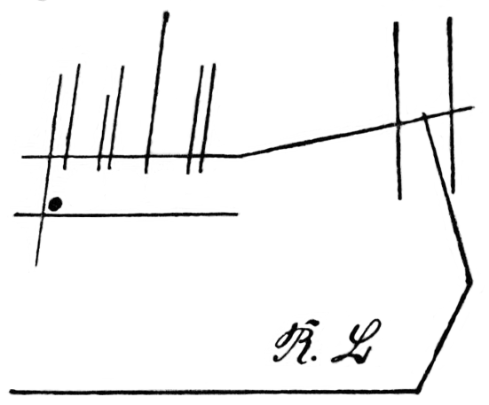
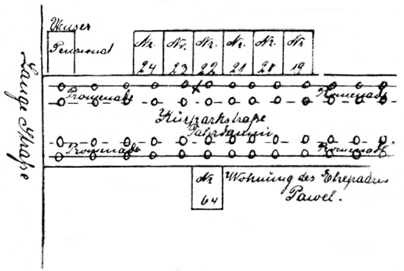

<@pagebreak 3/>
 
<h1>Ein gefährlicher Auftrag.</h1>

<h2>Erstes Kapitel.</h2>
<h3>Die Fensterscheibe.</h3>

Das war an jenem Junivormittag eine peinliche Überraschung
für uns, als wir mit dem Gemeindevorsteher des
Ortes Dalldorf das in der Nähe der bekannten Irrenanstalt
gelegene Häuschen und jenes Zimmer betraten, wo wir vor
kaum vierzig Minuten die Leiche der schönen Rosa Linden
eingeschlossen hatten, die schon vor ihrem Geständnis Gift
genommen und durch einen freiwilligen Tod die beiden an
ihren nahen Verwandten begangenen Morde gesühnt hatte.

Die Leiche war verschwunden. Das eine Fenster war
nur angelehnt. Und wir standen und starrten sprachlos auf
das Bett, dessen Steppdecke noch tief eingedrückt war. Dort
hatte die Tote gelegen. Dort hätte sie noch liegen müssen,
wenn —

Und das, was ich nun dachte, kleidete Harald Harst in
die leisen Worte:

»Sie hat uns abermals überlistet! Sie hat damit gerechnet,
daß sie eine geraume Zeit allein bleiben würde.
Es war nichts als eine tiefe, künstliche Bewußtlosigkeit von
kurzer Dauer mit allen äußeren Anzeichen des bereits eingetretenen
Todes.«

Der Gemeindevorsteher machte ein ungläubiges Gesicht.

»Ist so etwas denn möglich, Herr Harst?« meinte er.

»Für Rosa Linden ja. Ihr Vormund, der Chemiker
Athanasius Prikola, hat in seinem Laboratorium Gifte aller
Art, auch solche, die lediglich Ohnmachten hervorrufen. Er
weilte längere Zeit im Ausland, besonders in Japan. Von
dort brachte er Pflanzengifte mit, deren Wirkung hier bei
uns noch völlig unbekannt ist.«

»Und was nun?« fragte der Gemeindevorsteher.

<@pagebreak/>
»Gehen wir nach der Anstalt hinüber, Herr Gemeindevorsteher,«
sagte Harst kurz und etwas geistesabwesend. »Ich
erzählte Ihnen ja bereits, daß Rosa Linden zu dem als
Mörder verhafteten und jetzt zur Beobachtung seines Geisteszustandes
der hiesigen Irrenanstalt überwiesenen Nervenarzte
Dr. Karl Möckern in vertrauteren Beziehungen stand und
mir gegenüber vor ihrem »Scheintode« zugegeben hat, daß
sie Möckern aus der Anstalt befreien wollte. Vielleicht hat
sie dies wirklich fertig gebracht. Sie kann viel, dieses junge
Weib, sehr viel.«

Zehn Minuten darauf standen wir dem Direktor der
Anstalt gegenüber. Der Geheime Medizinalrat schüttelte
zweifelnd den Kopf, als Harald erklärte, es wäre zweckdienlich,
einmal nachzusehen, ob der Untersuchungsgefangene
Möckern sich noch in seinem Zellenzimmer befinde.

Und abermals vier Minuten später war festgestellt, daß
Dr. Möckern die Flucht ergriffen hätte.

Der betreffende Wärter sagte folgendes aus: Vor einer
Viertelstunde war zu dem Oberarzt ein jüngerer Herr mit
einem Ausweis der Staatsanwaltschaft gekommen, hatte sich
als Assessor Linden vorgestellt und auf Grund des Ausweises
Möckern sofort zu sprechen verlangt.

Man hatte den Assessor in die Zelle geführt. Der
Wärter war vor der Tür stehen geblieben. Gleich darauf
hatte der Assessor die Tür wieder öffnen lassen und dem
Wärter den angeblich bewußtlos daliegenden Möckern gezeigt.
»Holen Sie den Oberarzt als Zeugen und bringen
Sie Papier, Feder und Tinte mit. Möckern wird ein Geständnis
ablegen, wenn er wieder zu sich kommt.« — So
hatte der Assessor den Wärter entfernt.

Als der Oberarzt und der Wärter nach acht Minuten
etwa die Zelle betraten, war sie leer. Und diese Entdeckung
hatten sie etwa zu derselben Zeit gemacht, als
wir bei dem Geheimen Medizinalrat weilten.

Die Flüchtlinge konnten also noch nicht weit gekommen
sein. Das ganze Anstaltspersonal wurde alarmiert. Harst
gab sich die erdenklichste Mühe, herauszubringen, wo Möckern
und dessen Geliebte in diesem so fest verschlossenen Hause
geblieben sein könnten.

Ich will mich hier mit Einzelheiten nicht aufhalten.
<@pagebreak/>
Es wurde bis zum Abend gesucht. Nichts wurde versäumt,
um der Flüchtlinge habhaft zu werden.

Um neun Uhr abends gab Harald die Sache auf.

»Ich stehe vor einem Rätsel,« sagte er zu dem Geheimrat.
»Ich behaupte, die Flüchtlinge befinden sich noch
in der Anstalt. Lassen Sie bitte scharf Wache halten. Ich
komme morgen in aller Frühe wieder her.«

Wir gingen dann durch den prächtigen Vorsommerabend
dem kleinen Häuschen zu, wo Rosa Linden uns abermals
so schlau getäuscht hatte.

Harald war sehr schweigsam. Ich störte ihn nicht in
seinen Gedanken. Ich grübelte darüber nach, wo das Paar
geblieben sein könnte. Wenn ein Harald Harst Leute sucht,
die eben erst flüchtig geworden sind, und wenn er sie nicht
findet, müssen diese Leute schon einen ganz ungewöhnlichen
Trick ersonnen haben, sich unsichtbar zu machen. — Welches
war dieser Trick? Wir hatten nun doch als Liebhaberdetektive
in all den Jahren bereits übergenug Erfahrungen
jeder Art gesammelt; Harsts Name war für die Welt der
eines außerordentlichen Genies; und doch: hier hatte er
versagt! —

Wir fanden das alte Ehepaar, dem das Häuschen gehörte,
im Garten sitzen. Harst fragte, ob sie ihm eine
Fensterscheibe aus dem Zimmer, in dem Rosa Lindens »Leiche«
gelegen hätte, verkaufen würden.

Die Gesichter der alten Leute waren zum Malen!

Harst bezahlte die Scheibe sehr gut, nahm sie eigenhändig
aus dem Fensterrahmen heraus, wickelte sie in eine
Zeitung und verabschiedete sich. Die Leutchen glaubten sicher,
das sei so einer »mit ’m ganz großen Klaps« gewesen.

Wir fuhren heim. Unterwegs konnte ich mich doch nicht
länger beherrschen.

»Wozu die Scheibe, Harald?«

»Zum Andenken an den größten Reinfall, den ich je
erlebte, mein Alter.«

»Dann hättest Du besser das Bett kaufen sollen. Denn
darauf hat doch Rosa Linden gelegen — die falsche Tote.«

»Die Fensterscheibe ist ein weit persönlicheres Andenken
an sie. Wenn Du bessere Augen hättest, würdest Du gemerkt
haben, daß in die Scheibe mit einem Diamanten ganz
fein allerlei eingeritzt war.«

<@pagebreak/>
»Ah — deshalb also!«

»Ja — deshalb! — Als ich mich am Fenster bückte
und scheinbar in den Garten hinausschaute, sah ich mir diese
feinen Kratzer auf dem Glase genau an. Zu Hause kannst
Du dasselbe tun.« —

Nach dem Abendbrot kam dann in Haralds Arbeitszimmer
die Scheibe heran.

Ich prüfte die Striche, die Harst »feine Kratzer« genannt
hatte. Wenn nicht unter diesen Strichen die Buchstaben
R&nbsp;L gestanden hätten, würde ich gesagt haben,
Rosa Linden wäre meines Erachtens nicht die, die dies
alles eingeritzt hätte, da es ja nichts als willkürliche Versuche
wären, mit einem Diamanten die obere Glasschicht
zu zerstören.

Ich muß diese Striche hier genau so wiedergeben, wie
ich sie auf der Scheibe vorfand, denn all dies wurde später
sehr bedeutungsvoll. Die Fensterscheibe besitzt Harald heute
noch.

Ich habe das eingeritzte Bild hier lediglich insofern
korrigiert, als ein Teil der Striche aus Bogenlinien bestand.
Man sah aber genau, daß diese krummen Linien
nur auf die Ungeübtheit Rosa Lindens, einen Diamanten
<@pagebreak/>
in dieser Weise als Zeichenstift zu benutzen, zurückzuführen
war.

Ich deute hier schon durch das Wort *Zeichen*stift
an, daß es sich doch um eine Zeichnung handelte, um die
Skizze irgendeiner Örtlichkeit.

Das war auch Haralds Ansicht. Und ich bekehrte mich
sehr bald zu derselben Meinung, nachdem Harst das Ganze
auf ein Stück Papier so in geraden Linien übertragen hatte,
wie ich es oben wiedergegeben habe.

»Sieh mal,« sagte er dann, »die Linden hat den Doktor
aus der Anstalt befreien wollen. Nur deshalb begab sie
sich nach Dalldorf und mietete das Zimmer in dem Häuschen.
Diese Befreiung hatte sie vorbereitet. Beweis: die
gefälschte Legitimation für »Assessor Linden«. Sie konnte
nun nicht voraussehen, ob ihr diese Befreiung so gut glücken
würde, daß sie Doktor Möckern ohne Zeugen sprechen konnte.
Ihm einen Zettel zuzustecken, war zu gefährlich. Wie sollte
sie also mit ihm, falls er allein entwich, einen Treffpunkt
vereinbaren? Da mag sie eben die Skizze zu Hilfe genommen
haben. Wenn sie Möckern zuflüsterte: »Häuschen
Schliephake, hier, linke Fensterscheibe«, so ging das schnell,
und er konnte sich das Weitere zusammenreimen. Schliephake
heißen ja die alten Leutchen, denen das kleine Haus
gehört. — So *kann* man den Zweck der Skizze deuten.
Ob die Deutung richtig ist, weiß ich nicht. Es gibt nur
noch eine einzige andere; die scheidet aber aus.«

»Und die wäre?«

»Die Skizze sollte mich irreführen, falls ich dem Pärchen
auf die Spur käme. — Doch, die Deutung erscheint nur noch
gesuchter als die erste. Sie gefallen mir beide nicht. Aber
ich finde nichts Besseres.«

Er schloß die Scheibe weg, ohne das Thema weiter
irgendwie zu erörtern. —

Drei Tage darauf kam Nachricht aus Hamburg, daß
dort ein verdächtiges Paar logiere. Wir fuhren hin, fanden
das Nest leer, aber stellten doch wenigstens das eine mit
aller Bestimmtheit fest, daß es tatsächlich Möckern und die
Linden gewesen waren.

Vier Tage später waren wir in London. Hier hatten
die beiden als älteres, grauhaariges Ehepaar gewohnt. Die
<@pagebreak/>
Spur ging nun für lange Zeit verloren, wir kehrten heim.

So gingen drei Wochen hin. Dann — endlich eine
Sache, die nicht so alltäglich begann.

<h2>Zweites Kapitel.</h2>
<h3>Der Mord in der Kurparkstraße.</h3>

> Seebad W…, Langestraße 1.

<blockquote>
2. Juli 19..

Sehr geehrter Herr Harst!
</blockquote>

> Ich bin man eine einfache Frau, wenn ich auch
ein großes Pensionat habe. Meine Gäste wissen schon,
daß ich man bloß eine Dorfschule besucht habe. »Die
Hauptsache ist gutes Essen und nicht gutes Deutsch,«
sagt der Herr Regierungsrat Schlimy immer. Also Sie
werden entschuldigen, wenn ich Sie nicht so von allem
unterrichten kann, wie eine gelehrte Dame. Deshalb
möcht ich Sie bitten, mich mündlich zu verhören. Es
geht um meine Existenz. Ich komme am dritten des
Monats abends nach Berlin. Ich will Ihnen gern
für Ihre Mühe ein paar hundert Mark bezahlen. Detektive
sind teuer, sagt Herr Regierungsrat Schlimy.
Und das ist eins von den Opfern. Ich werde am
vierten vormittags elf Uhr bei Aschinger am Bahnhof
Friedrichstraße sein. Sie werden mich gleich rausfinden.
Ich bin leider sehr dick und habe ein Muttermal
im Gesicht.

<blockquote>
Hochachtungsvoll

Frau Anna Drewke,

Pensionsinhaberin.
</blockquote>

Dieser Brief traf erst am vierten morgens ein.

»Ich glaube, es wird sich um Diebstähle handeln,«
sagte ich. »Frau Drewke wird ihren Gästen den Schaden
ersetzt haben, und diese Summen müssen beträchtlich sein.«

»Ganz recht. Dasselbe nehme ich an.« —

Um elf Uhr betraten wir die Bierabteilung des Aschingers
am Friedrichstraßenbahnhof.

<@pagebreak/>
Allerdings, — Frau Drewke war nicht zu übersehen!
Ich schätzte auf 230 Pfund in Kleidern.

Es war ein heißer Vormittag, und sie betupfte sich
dauernd das krebsrote Gesicht mit dem Taschentuch. Dieses
pausbäckige Gesicht mit dem fast talergroßen Muttermal auf
der linken Wange und der Knollennase wirkte noch ausdrucksloser,
weil die Augenbrauen völlig fehlten.

Das Provinzkostüm unserer Klientin, ein hochgeschlossenes
Kleid mit Perlstickerei, machte die massigen Formen noch
auffallender. Wie so oft hatte auch diese »dickste Dame
der Welt« eine dünne, piepsende Stimme. — Die Begrüßung
war ihrerseits etwas verlegen.

»Ich hab’ erst nach dem Brief erfahren, daß Sie so’n
berühmter Herr sind, Herr Harst,« erklärte sie dann. »Sonst
hätt’ ich gar nicht —«

»Schon gut, Frau Drewke. Für lange Vorreden bin
ich nicht,« fiel ihr Harald ins Wort. »Wir wollen auch
gleich die Honorarfrage erledigen. Ich nehme nie Bezahlung
an. Ich bin Liebhaberdetektiv. So, und nun werde ich
fragen, und Sie antworten. So kommen wir am schnellsten
zum Ziele.«

Die Sachlage war folgende: Frau Drewke hatte das
Pensionat in W. erst in diesem Frühjahr gekauft. Sie hatte
früher in Mecklenburg ein kleines Hotel besessen. Ihre
Pensionsvilla in W. hieß »Haus am Meer« und war ein
Holzgebäude mit 24 Fremdenzimmern. Die Saison in W.
hatte diesmal des günstigen Wetters wegen sehr früh begonnen.
Schon am 15. Juni waren über die Hälfte der
Zimmer besetzt. Leider hatten dann jedoch am 17. Juni die
geheimnisvollen Diebstähle begonnen. Stets nachts wurden
den Gästen aus den verschlossenen Zimmern Schmucksachen
und Geld gestohlen. Frau Drewke hatte, um den Ruf der
Pension nicht zu gefährden, die Verluste den Gästen zurückerstattet.
Die Polizei in W. war machtlos gegenüber
diesen Dieben oder diesem einzelnen Diebe. Selbst nächtliche
Wachen in den Fluren hatten nichts geholfen. Vor
den Augen der Polizeibeamten waren wieder ein paar Gästen
Wertgegenstände gestohlen worden. Die Verluste Frau
Drewkes betrugen bisher etwa 9000 Mark. Und das war
für die Zeit vor dem Kriege immerhin recht viel. Jetzt
war das Pensionat ganz besetzt. Am zweiten Juli früh (an
<@pagebreak/>
diesem Tage schrieb die Drewke dann den Brief an Harald)
war abermals einer älteren Dame eine Börse mit 500 Mark
nachts unter dem Kopfkissen hervorgezogen worden. Da hatte
denn der Regierungsrat Schlimy Frau Drewke geraten (er
hatte seine goldene Uhr nebst Kette eingebüßt), sich an
Harald Harst zu wenden.

Der Fall hatte in der Tat, obwohl es sich nur um
gewöhnliche Hoteldiebstähle handelte, recht rätselhafte Seiten.
Harst schien die Sache zu interessieren.

»Vorläufig bin ich hier noch beschäftigt,« erklärte er
der gemütlichen Dicken. »In fünf bis sechs Tagen werde
ich jedoch zu Ihnen nach W. kommen. Ich schreibe vorher
noch. Sollten jetzt zwei Zimmer frei werden, so vermieten
Sie sie nur immer auf Tage, damit wir sofort einziehen
können. Natürlich sehen wir dann etwas anders aus.
— Haben Sie jemandem erzählt, daß Sie sich an mich gewandt
haben?«

»Nein. Nur der Herr Regierungsrat und meine Cousine
wissen davon.«

»Sehr gut. Bitten Sie sie, daß sie schweigen.«

Wir verabschiedeten uns. Als wir mit der Stadtbahn
heimfuhren, sagte Harst plötzlich:

»Ich sehne mich nach Seebädern. Also: nachmittags
vier Uhr heute vom Stettiner Bahnhof; Du als ältere
Dame, die wegen eines Gesichtsleidens stets Schleier trägt,
und ich als Gymnasialprofessor mit Naturforscherneigungen.«

Zu Hause fanden wir Besuch vor, und zwar einen Herrn
Sanitätsrat Schlimy, der in Lichterfelde wohnte. Er kam
seines Bruders Arthur wegen. Und dies war der von Frau
Drewke so oft zitierte Regierungsrat.

Arthur Schlimy war in der vergangenen Nacht, also
der vom 3. zum 4. Juli, unweit des Pensionats »Haus
am Meer« mit einer furchtbaren Schädelwunde auf dem
Promenadenwege der Kurparkstraße gegen zwei Uhr
morgens von einem Polizeibeamten tot aufgefunden worden.
Er war Junggeselle gewesen, 49 Jahre alt, sehr lebenslustig
und ein großer Verehrer der pommerschen Küste. Man
hatte den Sanitätsrat Max Schlimy sofort telegraphisch benachrichtigt.

»Ich habe nun von meinem Bruder gestern, am dritten,
früh einen Brief erhalten, Herr Harst, der mit der Hauptgrund
<@pagebreak/>
meines Besuches bei Ihnen ist,« fuhr er jetzt fort.
»Bitte, hier ist der Brief. Ich werde Ihnen die wichtigen
Sätze vorlesen.

> »— Ich schrieb Dir letztens von den Diebstählen hier
in der Pension. Auch meine Uhr nebst Kette haben dran
glauben müssen. Seit dem Tage, als ich sie vermißte,
habe ich nun so etwas den Amateurdetektiv gespielt.
Ich hoffe, den Dieben auf der Spur zu sein. Ich
habe Frau Drewke geraten, sich an Harald Harst zu
wenden. Bis er hier eintrifft, hoffe ich den Fall zu
erledigen und ihm ein ausgebrütetes Problem-Ei offerieren
zu können. Wenn er dann meiner Ansicht ist,
machen wir gemeinsam die Mausefalle zu und die Bande
dingfest, denn es sind mindestens ihrer drei, die hier
im Trüben fischen, eine Redensart, die man im Seebad
mit Recht gebrauchen kann.««

Harald sagte jetzt:

»Vielleicht vermuten wir beide das gleiche, Herr Sanitätsrat.
Ihr Bruder wurde ermordet, weil die Diebe wußten,
daß er ihnen gefährlich werden könnte.«

»Ja, Herr Harst. Genau dasselbe vermute ich.«

»Nun, wir, Schraut und ich, fahren nachmittags nach
W. Ich werde dann versuchen, die Mörder zu entdecken.«

»O — auch ich fahre mit dem gleichen Zuge. Ich
will die Leiche Arthurs hier nach Berlin bringen. Wir
könnten dann —«

»— leider die Reise nicht gemeinsam machen,« vollendete
Harald.

»Hm — ich verstehe! Ich werde natürlich verschweigen,
daß Sie nach W. kommen.«

Bald darauf waren wir allein. —

Abends um halb neun an demselben Tage erhielt die
Pension »Haus am Meer« drei neue Gäste. Zufällig waren
Zimmer frei. Der Gymnasialprofessor Ernst Mendel wurde
in Zimmer Nr. 12 untergebracht, das bisher Arthur Schlimy
innegehabt hatte. Frau Therese Griep, Rentiere, bekam
Nr. 14, und der Sanitätsrat Schlimy Nr. 21. Nr. 12 und
14 waren von Frau Drewke, die schon mit dem Mittagszuge
heimgereist war, aber nur für Tage abgegeben worden.

Professor Mendel und die mit einem Gesichtsleiden behaftete
Frau Griep hatten nun ganz genau vereinbart, wo
<@pagebreak/>
sie sich treffen wollten, nachdem sie auf ihren Zimmern
gespeist und ihre Koffer ausgepackt hatten.

Mendel war ein in einen engen, altmodischen Rock eingeknöpfter,
brilletragender, kurzsichtiger Herr mit struppigem,
graublondem Bart und vornübergebeugter Haltung. Er
stotterte etwas und war sehr unbeholfen, hatte dabei aber
stets ein gütiges, bescheidenes Lächeln auf den Lippen.

Frau Therese Griep war so ungefähr vom gleichen
Schlage. Unser Requisitenschrank in der Blücherstraße 10
enthielt ja auch vollständige Frauenausstattungen, so daß
»Frau Griep«, auch was Wäsche und so weiter betraf,
völlig echt wirkte. —

Das Seebad W. ist gleichzeitig Hafenstadt mit etwa
10&nbsp;000 Einwohnern. Der dortige Kriminalkommissar Flügel
wohnt in der sogenannten Altstadt. Er war gegen halb
zehn Uhr abends in seinem Garten gerade mit Begießen
der Gemüsebeete beschäftigt, als er von jenseits des Staketenzaunes<@refnote 1/>
angerufen wurde.

»Einen Augenblick bitte, Herr Kommissar,« hatte sich
ein älterer Herr mit goldener Brille gemeldet. »Würden
Sie mir ein paar Worte unter vier Augen gestatten?«

Herr Gottlieb Flügel ging an den Zaun.

»Mein Name ist Mendel — Professor Ernst Mendel,«
erklärte der Fremde nun. »Sie haben da wunderschönes
Spalierobst. Ich bin selbst großer Gartenfreund.« Dann
schaute Mendel sich um. Weit und breit war mit Ausnahme
Frau Grieps keine Menschenseele zu bemerken. »Wenn
Sie mir als Beamter versprechen, verschwiegen zu sein, und
zwar jedem, aber auch jedem gegenüber, dann —«

Flügel musterte den merkwürdigen Herrn scharf. Der
lächelte jetzt nicht mehr sein gütiges, freundliches Lächeln,
sondern blickte dem Kommissar ebenso starr in die Augen
und dies mit so völlig verändertem Gesichtsausdruck, daß
Flügel unsicher fragte:

»Wer — wer sind Sie eigentlich?«

»Eigentlich heiße ich Harald Harst, und die Dame dort
heißt »eigentlich« Max Schraut.«

Flügel stieß ein geradezu freudiges: »Ah — Herr Harst!«
aus.

Gleich darauf saßen wir in Flügels bescheiden eingerichtetem
Arbeitszimmer.

<@pagebreak/>
»Ja,« meinte er achselzuckend, »über diesen Mord läßt
sich nicht viel sagen, verehrter Herr Harst. Die Waffe des
Mörders kann die stumpfe Seite eines Handbeils gewesen
sein — kann! Von dem Mörder wissen wir nichts, gar
nichts. Nicht einmal unser vorzüglicher Polizeihund Lux hat
eine Fährte aufgenommen.«

Harst stellte noch mehrere Fragen. Aber der Fall blieb
dunkel wie bisher. Der Regierungsrat Schlimy hatte auf
der Promenade in einer Blutlache auf dem Rücken gelegen,
als der Polizeiwachtmeister Schülke ihn fand. Schülke war
gerade auf einem Rundgang durch das Strandviertel begriffen
und hatte den Polizeihund bei sich gehabt. Er erkannte
sofort, daß der gutgekleidete Herr bereits tot war,
hatte schnell durch einen Passanten den Kommissar und den
Kreisarzt holen lassen und bis zu deren Eintreffen mit dem
Hunde die Umgebung abgesucht. Der Kreisarzt hatte erklärt,
der Tod sei vor etwa einer Dreiviertelstunde eingetreten.
Flügel wieder hatte dann im Laufe des Tages ermittelt,
daß Arthur Schlimy bis gegen halb zwei Uhr morgens
in der Kurhaus-Bar gesessen hatte und allein nach Hause
gegangen war. Ferner hatte ein junges Ehepaar, das in
einer dem Fundorte der Leiche gegenüberliegenden Villa
wohnte und noch wach gewesen war, durch die halb offenen
Fenster einen kurzen Aufschrei vernommen und hinterher noch
ein Geräusch, als ob ein dickerer Stock mitten durchbräche.
Der junge Ehemann war sofort aufgestanden und hatte sich
zum Fenster hinausgelehnt, hatte auch auf der Promenade
eine lang ausgestreckte Gestalt bemerkt, sich schnell angekleidet
und erst auf eine persönliche Einmischung verzichtet,
als er bei einem nochmaligen Blick durch das Fenster feststellte,
daß der Polizeiwachtmeister bereits um die Männergestalt
dort unten sich bemühte.

Dieser Herr namens Pawel war also derjenige Zeuge,
der den Tatort unmittelbar nach dem Todesschrei des Opfers
und auch das Opfer selbst, den ermordeten Regierungsrat,
gesehen hatte. Pawel hatte erklärt, daß er etwa drei
Sekunden nach dem Aufschrei, der wie ein halb erstickter Hilferuf
geklungen hätte, am Fenster gewesen sei.

Dies war ungemein wichtig, wenn man die Aussagen
zweier anderer Zeugen noch mit berücksichtigte.

Es hatten nämlich an der Kreuzung der Kurpark- und
<@pagebreak/>
der Langen Straße zwei Kellner gestanden, die soeben erst
von ihrer Arbeitsstelle gekommen waren. Von dort, wo sie
sich gemütlich unterhalten hatten, bis zu dem Fundort der
Leiche waren es genau 61 Meter. Auch diese beiden Leute
hatten den Aufschrei und ebenso das nachfolgende Geräusch
gehört und sich sofort nach dem Aufschrei umgewandt und
festzustellen versucht, was es dort gäbe. Sie hatten jedoch
den hingestreckten Körper nicht wahrnehmen können, da die
Baumreihe der Promenade ihnen wie eine Mauer die Aussicht
versperrte. Eins jedoch hätten sie sehen müssen: falls
sich jemand vom Tatorte entfernte! — Sie behaupteten
nun mit aller Bestimmtheit, daß sie kein lebendes Wesen
in der Nähe erspäht hatten. Sie waren nach einer Weile
völlig ahnungslos nach Hause gegangen. Dann war auch
schon der Wachtmeister Schülke mit dem Polizeihunde erschienen.

Gerade dort nun, wo der Regierungsrat ermordet worden
war, standen die neuen Häuser der Kurparkstraße, sechs
an der Zahl, ohne Zwischenraum dicht nebeneinander. Es
war mithin ausgeschlossen, daß der Mörder etwa blitzschnell
sich hätte über einen Zaun schwingen und in einem
Garten verschwinden können. Diese Häuser waren keine
Pensionsvillen, sondern enthielten sämtlich nur vornehmere
Winter- bzw. Dauerwohnungen und waren verschlossen gewesen.

Das Rätselhafte des Falles lag also darin, daß der
Täter sich sozusagen unmittelbar nach dem heimtückischen,
tödlichen Hiebe, der das Opfer von hinten traf, unsichtbar
gemacht hatte.

Harald schien nun durch die an den Kommissar gerichteten
Fragen die Gewißheit erlangt zu haben, daß von
seiten der Polizei alles geschehen war, um diesen wichtigen
Umstand, wo der Mörder geblieben, zu klären.

»Ist der Tote an Ort und Stelle photographiert
worden?« fragte er jetzt den Kommissar.

»Das nicht, Herr Harst. Aber ich habe die Lage der
Leiche genau aufgezeichnet und die wichtigen Entfernungen
nachgemessen. Bitte, hier ist meine Skizze.«

Harald und ich betrachteten sie gemeinsam. Ich muß
sie hier notwendig mit ein paar Strichen und Zahlenangaben
mit anführen.

<@pagebreak/>

Die Entfernung von der Hausfront bis zur *äußeren*
Baumreihe beträgt 2,75 Meter. Die Promenaden sind 4
Meter breit. — Die Leiche lag also nur mit dem Oberkörper
innerhalb der nördlichen Promenade. —

Harst reichte Flügel die Skizze zurück.

»Danke, jetzt bin ich im Bilde,« meinte er. »War der
Tote beraubt? War der Hut des Toten durch den Hieb
gleichfalls getroffen worden?«

»Der Regierungsrat hatte alles bei sich. Es fehlte
nichts. Der Mörder hat auch gar nicht die Zeit gehabt,
ihn auszuplündern. Sonst wäre er von den Kellnern fraglos
gesehen worden. Seinen Strohhut muß Herr Schlimy in
der Hand getragen haben. Er lag unbeschädigt neben den
Füßen des Toten.«

»Mithin hat der Mörder sich von hinten an sein Opfer
herangeschlichen und es niedergeschlagen,« meinte Harst.
»Ich gebe zu: der Fall hat manches Seltsame an sich. Und
nun das Geräusch, das gleich nach dem Aufschrei zu vernehmen
war und das so geklungen haben soll, als ob ein
dickerer Stock zerbrochen würde?«

»Ja — dieses Geräusch braucht ja nicht notwendig
mit der Tat zusammenzuhängen, denke ich mir, Herr Harst.
Es kann irgendwoher aus größerer Entfernung gekommen
<@pagebreak/>
sein. Es ist jedenfalls sehr schwer, es irgendwie in Beziehung
zu dem Morde zu bringen.«

»Wo befindet sich die Leiche? Kann ich sie mir mal
ansehen?«

»Gewiß. Sie liegt in der Leichenhalle des hiesigen
Krankenhauses, die gleichzeitig Sezierraum ist. Ich bin gern
bereit, Sie hinzuführen.«

»Wir wollen lieber vermeiden, daß man uns zusammen
sieht. Wie wär’s, wenn wir uns um 11 Uhr, also nach
einer halben Stunde, vor der Halle träfen? Bitte sagen
Sie auch niemand im Krankenhause, weshalb Sie noch so
spät in die Halle hinein wollen.«

»Einverstanden, Herr Harst.«

Gleich darauf brachen wir auf.

Das Haus Flügels lag unweit der östlichen Hälfte des
Kurparks. Wir schritten eine durch elektrische Lampen erleuchtete
Allee entlang. Harst hatte seinen Arm in den
meinen geschoben. Der Herr Professor Mendel tat also recht
vertraut mit Therese Griep. Ich hielt dies für reichlich
unvorsichtig.

»Harald, und wenn uns zufällig jemand aus der Pension
trifft und uns nachher als Mendel und Frau Griep wiedererkennt,
die doch so tun, als wären sie einander fremd?!«
wagte ich zu bemerken.

Seine Antwort lautete so, daß ich plötzlich wie angewurzelt
stehen blieb.

<h2>Drittes Kapitel.</h2>
<h3>Das gefährliche Haus.</h3>

»Meine Theorie über diesen Fall dürfte so ziemlich
stimmen,« sagte er. »Und weil ich davon überzeugt bin,
ist jede Vorsicht überflüssig.« Er machte eine kurze Pause.
»Nein — wir müssen doch vorsichtig sein. Der Mörder
darf nicht herausfühlen, daß wir uns so gar keine Mühe
geben, ein Fremdsein zwischen uns zu heucheln. Wir müssen
doch so tun, als hielten wir es weiter für nötig, unsere
Rollen hier streng durchzuführen. Sonst merkt er, daß —
wir etwas gemerkt haben, nämlich die inneren Zusammenhänge
all dieser Dinge.«

<@pagebreak/>
Harald blieb jetzt unter einer der elektrischen Lampen
stehen und holte aus der inneren Brusttasche seines Rockes
den Stadtplan von W. hervor, faltete ihn ganz auseinander
und hielt ihn mir so hin, daß ich den Plan richtig
vor mit hatte.

»Hier ist die Kurparkstraße,« sagte er nun. »Wir haben
noch Zeit. Schlendern wir sie einmal entlang.«

Wir setzten unseren Weg schweigend fort. Ich hatte
Stoff genug zum Nachgrübeln. Nach zehn Minuten erreichten
wir die Villa Nr. 19 in der Kurparkstraße.

»Gehen wir langsamer, mein Alter,« erklärte Harald
leise.

Wir kamen an Nr. 21 vorüber. Harst hatte die Augen
bald hier, bald dort.

»Ah — ganz wie ich’s mir gedacht hatte,« flüsterte er.

»Was denn?«

»Na — die Umgebung des Tatortes. Das Verbrechen
ist wirklich in der Art seiner Ausführung ein Problem.«

Die niedrig gehaltene, breitästige Linde, die etwas rechts
vor der Mitte des Hauses Nr. 22 stand, schien Haralds
lebhaftes Interesse zu erwecken. Er blickte sich erst vorsichtig
nach allen Seiten um, murmelte dann:

»Ja — schlaue Bande! Schleicht uns nicht nach. Weiß
eben, das ich es merken würde und will unerkannt bleiben.«

Dann hatte er die Krone der Linde zum Gegenstand
seiner Studien gewählt, hielt mir einen kleinen Vortrag über
die Art, wie man Promenadenbäume künstlich in die Breite
wachsen läßt, veränderte mehrfach seinen Standort und ließ
dann mit einem Male ein leises: »Auch das stimmt also!«
hören.

Er deutete nach oben. »Siehst Du, daß der eine Ast
dort eingeknickt ist. Die Bruchstelle schimmert hell.«

Ja, auch ich fand die Stelle heraus. Es war ein ziemlich
starker Ast.

»Sehr wichtig!« meinte Harst. »Diesen Fall könnte man
dem Leiter einer Detektivschule empfehlen.«

Mir ging ein Licht auf.

»Der Mörder hockte in den Ästen,« sagte ich schnell.
»Er hat den Regierungsrat von oben erschlagen.«

»Ganz recht: von oben!« nickte Harst. »Wir wollen
hier nicht zu lange verweilen. Dort etwa hat die Leiche
<@pagebreak/>
gelegen. Also etwa an der Peripherie der Baumkrone. Merke
Dir das.«

Er zog mich weiter. »Geh jetzt schlafen, mein Alter.
Ich werde allein nach der Leichenhalle pilgern. Ansehen
werde ich mir den Toten nicht. Es hat das keinen Zweck
mehr. Meine Theorie ist richtig. Der eingeknickte Ast besagt
genug. Ich warne Dich nun vor folgendem: Lasse in
Deinem Zimmer nie nachts die Fenster offen. Binde auch
den Schlüssel, wenn Du Dich eingeschlossen hast, so im
Schlüsselloch oben am Drücker fest, daß er von außen weder
herausgestoßen, noch mit einer Diebszange herumgedreht
werden kann. Genieße in der Pension nichts, was sich zur
Beibringung von Betäubungsmitteln eignet, besonders trinke
kein Wasser abends aus der Karaffe. Hungere lieber bis
morgen und schütze eine Magenverstimmung vor. Ich will
die Sache hier nach Möglichkeit schon morgen erledigen.
So, nun gute Nacht, mein Alter. Auf Wiedersehen. Ereignet
sich etwas Wichtiges, so komme zu mir. Ich bleibe
wach, wenn ich mich auch ins Bett legen werde. Klopfe
viermal leise an.«

Er drückte mir die Hand und ging davon.

Kein Wunder, daß ich nun mit recht gemischten Gefühlen
das Pensionat betrat. Diese Villa »Haus am Meer«
schien ja eine ganz gefährliche Räuberhöhle zu sein.

Im unteren Flur traf ich Frau Drewke. Auch sie
wußte nicht, wer »Mendel« und »Frau Griep« eigentlich
waren. Sie war nicht übermäßig liebenswürdig zu mir und
betonte jetzt nochmals, daß ich mein Zimmer, wie wir vereinbart
hätten, jederzeit räumen müsse.

»Ich erwarte Gäste, die sich schon vor längerer Zeit
angemeldet haben,« fügte sie hinzu. — Dasselbe hatte sie
mir schon vor drei Stunden vorgebetet. Diese Gäste waren
Harst und ich. Sie hätte ahnen sollen!

Auf Harsts Veranlassung hatte mir seine Mutter eine
Brillantbrosche mit einem einzelnen, sehr schönen Stein für
diese »Sommerreise« geliehen. Ich merkte jetzt, wie sehr
der Brillant Frau Drewkes Beachtung, vielleicht auch ihren
Neid erregte. Sie schaute immer wieder hin. Ich stand
mit dem Gesicht nach der Flurlampe, und der wundervolle
Stein sprühte sicherlich in allen Farben.

»Verstehen Sie etwas von Weinen, gnädige Frau?«
<@pagebreak/>
fragte sie nun. »Ich habe da gestern dreißig Flaschen Portwein
gekauft, und nun behauptet einer der Herren, der
Wein schmecke nach dem Pfropfen.«

Als Frau Drewke von dem Portwein zu sprechen begann,
ging es mir wie ein gelinder elektrischer Schlag durch
den Körper. Ich dachte an Haralds Warnung: »Nichts
in der Pension genießen!« Mit einem Male war diese
dicke, harmlose Person für mich ein Wesen anderer Art
geworden.

»Dürfte ich Ihnen ein halbes Gläschen zum Schmecken
bringen?« sagte sie jetzt nach kurzer Pause. »Ich möchte
gern ein ganz unparteiisches Urteil über den Wein hören.«

»Oh — wenn ich Ihnen damit einen Gefallen tun
kann,« meinte ich. »Schicken Sie mir den Wein nur auf
mein Zimmer. Ich will Ihnen dann morgen früh berichten,
was ich davon halte.«

»Meinen herzlichsten Dank. — Gute Nacht, gnädige
Frau.«

Ich stieg die Treppe zum ersten Stockwerk empor. Dort
lagen unsere Zimmer. Sehr bald erschien eins der Stubenmädchen
mit einem Nickeltablett, auf dem das Glas Portwein
stand. Das Stubenmädchen machte auch gleich das
Zimmer zur Nacht fertig. Ich tat, als ob ich an dem
Wein nippte, sagte: »Der Wein ist vorzüglich.« Nach einer
Weile konnte ich das Glas unbemerkt in eine Vase entleeren,
tat wieder, als ob ich trank, und erklärte: »Bestellen Sie
Frau Drewke nur, der Wein sei ohne jeden Beigeschmack.«

Zehn Minuten später legte ich mich im Dunkeln in
Kleidern zu Bett. Ich verzichtete darauf, Harsts Rat zu
befolgen und den Türschlüssel innen am Drücker festzubinden.
Ich hatte mir schnell noch — ebenfalls im Dunkeln
— eine Waffe hergestellt, die gefährlich und geräuschlos war.
Einen Schuhputzlappen größeren Formats hatte ich mit
Sand aus einem Blumentopf zu einem Viertel gefüllt. Dann
hinter die Sandkugel einen Knoten gemacht, dessen Enden
den Handgriff bildeten. Es war dies also nichts als ein
Totschläger.

Ich nahm mir vor, auf keinen Fall einzuschlafen. Es
wurde ein harter Kampf gegen die Geister des Schlafes;
ein sehr harter Kampf.

Kurz nach ein Uhr schlummerte ich doch ein. Es
<@pagebreak/>
handelte sich aber nur um jenen Halbschlaf, in dem wir
alles ringsum sehr wohl wahrnehmen und diese Eindrücke
mit in unseren Träumen sozusagen verwerten.

Ich träumte — Ich hatte an der Tür ein leises Geräusch
gehört, war aufgestanden und neben die Tür getreten.
Diese öffnete sich. Eine dunkle Gestalt erschien, die
in der Linken eine Petroleumlampe und in der Rechten eine
Flasche Portwein trug. Die Lampe brannte, war aber ganz
tief heruntergeschraubt. Als ich einen Blick auf das von der
Lampe matt erleuchtete Gesicht des Eindringlings warf, lief
mir ein eisiger Schauer über den Leib. Das Gesicht war
das eines Totenschädels —

Da erwachte ich. Mein Herz jagte. Ich fühlte die
Aufregung, das Entsetzen noch in allen Nerven. Ich lag
ganz still und lauschte, wagte zunächst nicht, die Augen
aufzumachen.

Ich lauschte —

Und — ich hörte etwas: das Rauschen von Frauenröcken
und das kurze Knarren einer Diele —

Ich bezwang mich, öffnete die Lider ganz wenig nur.
Und — in meinem Zimmer strahlte wirklich ein ungewisses
Licht —!

Meine Hand suchte den Totschläger, den ich rechts unter
dem Zudeck verborgen hatte. Die Augen hatte ich wieder
geschlossen. Und ich bewegte die rechte Hand zum Schein
wie im Schlafe hin und her, atmete noch tiefer und ließ
sogar ein paar Schnarchtöne hören.

Dann — flog mir etwas über das Gesicht: ein weiches,
großes Sofakissen — Und auf diesem Kissen mußte ein
in Chloroform getauchtes Wattestück befestigt sein. Ich
spürte sofort den widerlich süßen Geruch.

Bevor ich jedoch noch an Gegenwehr oder an einen
Hilferuf auch nur denken konnte, wurden meine Arme gepackt,
und eine schwere Last ruhte auf meinen Beinen.

Ich merkte: ich konnte diese Angreifer nicht mehr loswerden.
So wandte ich denn den alten Trick an und wehrte
mich nur schwach, hielt den Atem an und tat so, als ob
ich langsam die Besinnung verlöre. Schließlich mußte ich
dann ja doch Atem holen, aber die Betäubung, die das
Chloroform herbeiführte, konnte jetzt nur kurz sein. Bevor
ich bewußtlos wurde, vernahm ich noch eine Frauenstimme,
<@pagebreak/>
die mir so merkwürdig bekannt vorkam und die doch
nicht die der brillantenlüsternen Frau Drewke war. Die
Stimme sagte im Flüsterton:

»Ich denke, er hat genug. Er liegt ganz still —«

»Noch eine halbe Minute. Dann nimm das Kissen
weg,« erwiderte eine tiefere, heisere Stimme.

Da war es mit meiner Wahrnehmungsfähigkeit zu
Ende.

Aber: der Trick hatte doch geholfen. Ich kam wieder
zu mir, als man mich wie ein Bündel die Treppe hinabtrug.
Es waren zwei Personen, die es taten. Dann wurde ich
— ich war an Händen und Füßen gefesselt — auf eine
Schütte Stroh geworfen und mit einer Leinwand zugedeckt.

Ich hörte, daß die beiden Personen sich entfernten. Ich
rollte mich etwas zur Seite und stieß an eine Holzwand
an. Bald wußte ich: ich lag in einem viereckigen, oben
offenen Kasten!

Da vernahm ich abermals Schritte. Dann flog etwas
neben mich, — etwas, ein Mensch!

Und dann — rumpelte der Kasten vorwärts. Es war
ein zweiräderiger Handwagen. Und der Mensch neben mir
konnte nur Harst sein.

Die Fahrt über das Steinpflaster dauerte nicht allzu
lange. Dann ging es über einen Holzsteg bedeutend schneller
weiter. Dieser Steg konnte nur einer der am Strande
zwischen den Badeanstalten entlanglaufenden, aus Brettern
hergestellten Promenadenwege sein.

Jetzt hielt der Handwagen. Man hob mich heraus.
Die Leute schleppten mich offenbar einen Bootssteg entlang.
Dann begann der Boden unter mir und meinen Trägern
zu schwanken: Wir hatten ein Boot betreten.

Wieder warf man mich recht roh auf harte Dielen.
Dann Stille; dann — wurde mein Leidensgefährte herbeigebracht.

Schade, daß ich nichts von den Leuten erspähen konnte,
die uns hier auf ein Boot verluden. Sie waren doch so
vorsichtig gewesen, mir um den Kopf lose eine Decke zu
wickeln.

Jetzt — jetzt ertönte das knatternde Geräusch eines angelassenen
Bootsmotors; jetzt verrieten mir die Schwankungen,
daß wir in die See hinaussteuerten.

<@pagebreak/>

<h2>Viertes Kapitel.</h2>
<h3>Das sinkende Motorboot.</h3>

»Na — munter, mein Alter?« rief Harald mich da an.

»Ja, vollständig.«

Ich spürte, wie er sich an meinem Körper entlangschob.
Dann mußte er mit seinen auf dem Rücken gefesselten
Händen die meinen Kopf umhüllende Decke gepackt
haben. Allmählich zerrte er mir die Decke ab. Ich
hatte den Kopf frei.

Ich sah, daß wir uns in der Kajüte eines jener Motorboote
befanden, die im Sommer den Verkehr zwischen dem
Seesteg und dem Hafen von W. vermittelten und von denen
einige bei ruhiger See stets am Seestege vertäut liegen.

Ich sah weiter, daß der Mond schräg über uns stand.
Sein weiches Licht fiel durch die Fensterreihe der Steuerbordseite
in die Kajüte hinein. Aber — außer Harst erblickte
ich keine lebende Seele. Und dabei hatten diese Boote doch
das Steuerrad in der Mitte und daneben den Regulierhebel
des Motors.

Ich beeilte mich, Harst denselben Liebesdienst zu erweisen,
befreite ihn von der Decke, die man auch ihm um den
Kopf gebunden hatte, und sagte dann sofort:

»Wir scheinen allein an Bord zu sein, Harald.«

»Jawohl — sind wir! Das heißt: noch ein Dritter
fährt mit, unsichtbar als Fahrgast, und doch mit dabei:
der Sensenmann!«

»Der — der Tod?« stammelte ich.

Wir saßen jetzt nebeneinander auf der Holzbank.

Harst nickte.

»Die Schufte haben vorher Löcher in den Boden des
Motorbootes geschlagen. Merkst Du nicht, daß das Boot
jetzt weit weniger schwankt? Es ist eben tiefer eingesunken
durch das Gewicht des Wassers, das bereits eingedrungen
ist, und fährt daher ruhiger. Es wird in einer Viertelstunde
wegsacken, nehme ich an. Wir beide sollen also samt dem
Boot spurlos verschwinden.«

»Eine falsche Spekulation,« meinte ich gelassen. »In
einer Viertelstunde sind wir die Fesseln los —«

»So?! — Bitte, bück’ Dich mal und beschau Dir Deine
Fußfesseln. Das sind verzinkte Drähte, mein Alter! Die
<@pagebreak/>
kann man weder abstreifen noch irgendwie an einer scharfen
Kante durchfeilen.«

»Aber — aufdrehen können wir die Drahtenden, —
einer dem andern!«

»Hm, wird Dir schwerfallen. Die Drähte sind zu stark.
Sie wurden mit einer Zange zusammengedreht. Mit den
Fingern ist da nichts auszurichten.«

»Versuchen kann man’s!« erklärte ich noch immer hoffnungsfreudig.

»Gib Dir keine Mühe. Es ist unmöglich. Ganz unmöglich.
Das wissen die Schurken sehr wohl.«

»Und — und nun?! — Es muß doch irgendetwas
geschehen, damit wir hier nicht elend ersaufen, Harald!«

»Geschehen?! — Bitte — Vorschläge! Ich fürchte,
daß —«

Er verstummte plötzlich. Ich schaute ihn von der Seite
an. Seine Blicke waren nach links gerichtet. Auch die
Pendeltüren der kleinen Kajüte hatten Fenster. So konnte
man draußen in der Mitte des Schiffleins das Steuerrad und
den erhöhten Stand für den Bootsführer erkennen.

»Nein,« sagte er nun, ohne den ersten Satz zu beenden.
»Ich fürchte jetzt nichts mehr! Der Mann bleibt
eben ein Dilettant des Verbrechens. Er hat nichts hinzugelernt
— gar nichts! Was nützt es ihm, daß er das
Steuerrad festgebunden hat und daß das Boot mit uns
immer leidlich geradeaus in die Ostsee hinausjagt?! Was
nützen die Zinkdrahtfesseln, wenn das Steuerruder, wie Du
von hier aus erkennst, durch einen Strick in derselben Stellung
festgehalten wird?! Die Knoten eines Strickes lassen sich
mit den Zähnen öffnen.«

Er hatte sich erhoben und hüpfte mit seinen gefesselten
Füßen gewandt auf die Pendeltür zu.

Wie viel Wasser bereits eingedrungen war, merkte ich
jetzt daran, daß meine Sohlen in der Nässe herumpatschten,
als ich nun schleunigst Harst folgte. Die Pendeltüren hatte er
aufgestoßen, und ich sah, daß er schon an den Knoten des
Strickes zu zerren begann, bevor ich noch die Tür erreicht
hatte.

Dann stand ich neben ihm. Helfen konnte ich ihm nicht.
Er brauchte auch keine Hilfe. Der Strick fiel herab.

»Mit den Schultern die Radspeichen halten — Du rechts,
<@pagebreak/>
ich links,« rief er. »So — jetzt drücke ich das Rad nach
oben! Aufgepaßt! — Ah — das Boot ändert schon den
Kurs! Wir müssen nach Osten zu, mein Alter. An Land
zurück können wir nicht. Aber dort der Strich ist die Westmole
des Hafens, und deren Spitze werden wir gerade noch
erreichen.«

Das Boot lief jetzt den neuen Kurs, und ich konnte
endlich mit der Frage an Harald herantreten, die mir schon
auf den Lippen brannte.

»Du sprachst da soeben von einem Manne, von einem
Dilettanten des Verbrechens? Wer ist dieser Mann?«

»Wie — Du fragst noch?! Ist Dir denn noch immer
kein sogenanntes Licht aufgegangen?«

»Leider nein. Wer ist dieser Mann also?«

»Hm — wer kann es nur sein? Doch natürlich nur
der Mörder Arthur Schlimys, den der Mensch umbrachte,
weil Schlimy ihm auf der Spur war.«

»Auf der Spur?«

»Ja — denke an die Diebstähle im »Haus am Meer« und
an den Brief, den der Regierungsrat an seinen Bruder
geschrieben hatte und in dem er sich etwa so ausgedrückt
hatte: Ich hoffe, Harst ein ausgebrütetes Problem-Ei offerieren
zu können. — Er war den Dieben also auf der
Spur! Und da haben sie ihn stumm gemacht.«

»Sie — sie?! Du sprachst doch soeben von einem
Manne?«

»Es sind eben zwei, ein Mann und ein Weib. Und
sie wohnen zum Teil Langestraße Nr. 1, zum Teil Kurparkstraße
Nr. 22, also in jenem Hause, vor dem Schlimy tot
aufgefunden wurde.«

Ich begriff noch immer nichts. »Was heißt das: zum
Teil wohnen sie dort, zum Teil dort?«

»Oh — das kann ich Dir jetzt nicht im einzelnen erklären,
mein Alter. Nein — dazu sind meine Gedanken
doch zu sehr dort vorwärts an der Spitze der Westmole
und fragen diese künstliche, schmale Halbinsel mit leisem
Bangen, ob wir sie auch erreichen werden. Schau’, das
Wasser bespült schon das Verdeck. Wie lange noch, und
der Motor wird aussetzen. Vorläufig funktioniert er noch.«

<@pagebreak/>
Und da gerade geschah das Verhängnisvolle: der Motor
verstummte jäh!

Harsts Gesicht, vom Mondlicht beschienen, hatte einen
Ausdruck wie das eines dem Tode geweihten, altrömischen
Gladiators.

Dann schnellte sein Kopf mehr ins Genick.

»Ich will nicht sterben — noch nicht!« rief er leise.
»Es muß hier an Bord der Vorschrift gemäß Rettungsringe
geben!«

Er hüpfte in die Kajüte zurück. Unter den Bänken
standen Kisten. Und — er fand die Rettungsringe! Er
holte sie mit den Zähnen heraus — für jeden von uns
zwei.

»Hineinsetzen müssen wir uns wie in ein Trapez,« meinte
er. »Das Motorboot beginnt zu sinken —!«

Wir hatten uns wieder auf Deck begeben. Harst zeigte
mir, wie ich die Rettungsringe benutzen solle.

Das Boot lag nur noch mit der Kajüte über Wasser,
und dieses reichte uns nun bis unter die Arme. Die Auftriebskraft
der Rettungsringe begann zu wirken. Sie genügten
vollauf, uns zu tragen. Das Boot schoß jetzt gurgelnd
in die Tiefe. Wir aber schwammen bis zur halben Brust
im Wasser. Und der Strick, der das Steuerrad gehalten
hatte, hielt uns beide nun dicht nebeneinander.

»In einer Stunde sind wir an Land,« meinte Harald.
»Und dann — wehe Euch beiden, die Ihr Euch durch die
Glasfensterskizze verraten habt!«

Da — endlich fiel es mir wie Schuppen von den
Augen! Endlich!

Doktor Karl Möckern und Rosa Linden! Also die beiden
waren es, die beiden!

»Hast Du diese Skizze noch leidlich im Gedächtnis, mein
Alter?« fragte Harald nun. »Gut — beginnen wir mit
den wagerechten Strichen. Der oberste und längste ist
der Strand von W.; der zweite ist die Kurparkstraße; der
dritte die südliche Stadtgrenze. Die senkrechten Striche, die
die oberste Linie schneiden, sind die Bäder, der Seesteg und
die Molen des Hafens; der Strich, der zwischen den Molen
im Winkel nach Süden führt, bedeutet den Fluß. Die zweite
Wagerechte wird von einer Senkrechten, der Langen Straße,
geschnitten, und der Punkt an der rechten oberen Seite der
<@pagebreak/>
Langen Straße ist das »Haus am Meer«. Das Ganze also
ist eine Skizze von W. und war ein — Wink für Möckern,
daß er Rosa Linden, falls sie nicht gemeinsam fliehen
könnten, im Pensionat »Haus am Meer« treffen würde.«

»Donnerwetter! Wann hast Du dies herausgefunden?«

»Erst an diesem Abend, als ich mir den Stadtplan von
dem Portier lieh und darauf die Badeanstalten, den Seesteg
und die Molen wie dicke Striche von der Strandlinie
nordwärts zeigen sah. — Merkst Du übrigens, daß wir
hier in einer Bogenströmung uns befinden, die dem Winkel
zwischen Westmole und Strand zustrebt? In zehn Minuten
werden wir auf dem Trockenen sein.«

»Und dann?«

»Dann werden wir an den scharfen Rändern der Granitquadern
der Mole unsere Drahtfesseln durchfeilen, werden
Kommissar Flügel herausklingeln, ihn um ein Quartier bis
vormittags zehn Uhr etwa bitten und hierauf die beiden
Leute festnehmen, auf die wir es abgesehen haben, wobei
es auch für Dich noch einige Überraschungen geben
wird.«

»Es wäre mir angenehmer, Du verringertest diese Überraschungen
dadurch, daß Du mir wenigstens einige Fragen
erlaubtest.«

»Frage nur.«

»So — dann will ich mit der Vorgeschichte dieses
Abenteuers beginnen, mit der Flucht Rosa Lindens. Wenn
sie für Möckern die Skizze in die Fensterscheibe eingeritzt
hat, muß sie doch sowohl den Badeort hier als auch das
Pensionat »Haus am Meer« sehr genau gekannt haben.«

»Ah — Du sprichst da von ganz Nebensächlichem, —
nebensächlich, weil selbstverständlich. Sie muß nicht nur das
Pensionat, sondern auch Frau Drewke so genau gekannt
haben, daß sie wußte, dort einen sicheren Unterschlupf zu
finden. Ich behaupte, die dicke Drewke ist ein Wolf im
Schafskleide und — heißt gar nicht Drewke. Besinne Dich
mal auf unseren vorigen Fall, auf »Die Jupiter-Zündhölzer«.
Rosa Linden war nach dem frühen Tode ihrer
Eltern bei zwei älteren unverheirateten Verwandten untergebracht.
Ihr Vormund erwähnte nun so nebenbei, —
vielleicht ist Dir diese Einzelheit noch gegenwärtig, daß
Rosa Linden bei diesen Verwandten ganz besonders vertraut
<@pagebreak/>
mit deren Wirtschafterin stand, die an dem ebenso
reizenden wie moralisch völlig verderbten Mädchen förmlich
einen Narren gefressen hätte. Diese Wirtschafterin kann
recht gut die jetzige Pensionsinhaberin sein.«

»Und sie ist mit im Komplott?«

»Ohne Zweifel. Bedenke die Geschichte mit dem Portwein,
den Du probieren solltest. Außerdem ist mir ja was
Ähnliches passiert, nur etwas weit Raffinierteres. Ich
habe dies Dir gegenüber vorhin nur angedeutet. Ich wurde
auf andere Weise wehrlos gemacht. Niemand drang in
mein Zimmer ein, um mich zu betäuben. Ich hatte auf
dem Tische eine Schachtel mit Zigaretten stehen lassen. Als
ich nach Hause kam, rauchte ich eine davon. Du weißt, ich
ziehe den Rauch stets in die Lungen ein. Nach drei Zügen
befiel mich ein starker Schwindel und steigerte sich bis zur
Ohnmacht. Die Bande hatte also die Zigaretten in meiner
Abwesenheit besonders präpariert. Oder besser: Möckern tat
es, und die Drewke hat die Zigarettenschachtel dann wieder
an Ort und Stelle gebracht.«

»Diese dicke, gemütliche, biedere Frau?! Wer hätte ihr
derartiges zugetraut! — Bei mir hat ja lediglich das Glas
Portwein den Verdacht erregt. Nein, auch ihr Interesse
für meine Brillantbrosche war sehr merkwürdig. Du wirst
schon recht haben, Harald: sie steht mit Möckern und Rosa
Linden im Bunde.«

»Gewiß. Es muß so sein, mein Alter. Wie hätte man
uns gefesselt die Treppe auf den Hof hinuntertragen und
dort in dem Handwagen verladen können, wenn nicht eine
dritte Person Wache gestanden hätte?! Ich nehme sogar
mit aller Bestimmtheit an, daß die Diebstähle in dem
Pensionat lediglich den Zweck gehabt haben, uns hierher
zu locken. Die Diebe sind das Dreikleeblatt Möckern, Rosa,
Drewke. Nur so lassen sich die Diebstähle erklären. Die
Drewke als Pensionsinhaberin konnte nachts, ohne Argwohn
zu erregen, durch das Haus schleichen. Und geholfen
hat ihr dabei hauptsächlich Rosa Linden, während Möckern
nur die Tränke braute, durch die man die zu Bestehlenden
in einen todähnlichen Schlaf versetzte. War die Hausbesitzerin
mitbeteiligt, dann konnte getrost auch die Polizei ein
paar Nächte die Flure bewachen.«

»Aber — die Drewke hat doch pekuniäre Verluste durch
<@pagebreak/>
diese Diebereien gehabt! Sie mußte den Schaden ersetzen,«
warf ich ein.

»Ja — und behielt dafür das Geraubte! Der Schaden
kann also nur recht gering gewesen sein.« — Dann fügte
er hinzu: »Ich habe bereits Grund unter den Füßen. Die
Brandung da vor uns ist nur schwach.«

Zehn Minuten darauf hatte Harald seine Fesseln auf
der Mole durchgefeilt. Auch ich war dann in kurzem frei.
Das Bad hatte uns nichts geschadet. Die Nacht war warm,
und um in den nassen Kleidern uns nicht zu erkälten,
schlugen wir nun einen leichten Trab an.

Bald hatten wir das Haus des Kommissars erreicht.
Flügel erschien im Schlafrock an der Haustür und nahm
uns sofort mit hinein.

Was wir nun mit dem Kommissar für den Vormittag
genau vereinbarten, ersieht der Leser aus den folgenden
Ereignissen.

<h2>Fünftes Kapitel.</h2>
<h3>Die Probe aufs Exempel.</h3>

»Es geht nicht anders, Herr Kommissar,« hatte Harst
erklärt. »Ich kann den Mörder nur auf eine Art und Weise
überführen, die Ihnen etwas stark romantisch oder sensationell
erscheinen mag. Sie müssen meine Anordnungen auf
das Genaueste befolgen. Der kleinste Fehler stellt den Erfolg
in Frage. Es ist sozusagen die Probe aufs Exempel,
die ich machen will.«

Um elf Uhr vormittags schickte Frau Drewke zur Polizei
und ließ melden, daß zwei ihrer Mieter über Nacht verschwunden
seien. Um halb zwölf erschien der Kommissar
im Pensionat »Haus am Meer« in Begleitung zweier älterer
Fischer in hohen Stiefeln und völlig »echten« Seemannsanzügen.

Frau Drewke empfing Flügel in dem gemeinsamen
Salon.

»Ich bringe hier gleich die beiden Männer mit, die
in der vergangenen Nacht von ihrem Fischkutter aus etwas
beobachtet haben, das mit Ihrer Meldung und der Anzeige
<@pagebreak/>
des Motorbootbesitzers Klaassen zusammenhängen kann,«
begann Flügel sofort. Und das, was er sagte, war nichts
als »die Rolle«, die Harst ihm vorgeschrieben hatte.

»Klaassen ist nämlich sein am Seesteg vertäut gewesenes
Motorboot verschwunden, und diese beiden Fischer aus Zinnowitz
haben nun in der Nacht ein sinkendes Motorboot bemerkt,
auf dem sie einen Herrn und eine Dame sahen. Ehe
sie aber mit ihrem Fischkutter herankamen, sackte das Motorboot
schon weg. Der Herr und die Dame hatten laut um
Hilfe gerufen, aber sonderbarerweise nicht gewinkt. Sie sind
ertrunken.«

»Mein Gott — die Ärmsten!« rief Frau Drewke in
ehrlichem Mitgefühl.

Die beiden Fischer — der eine war groß und schlank,
der andere kleiner und dicker, standen an der Salontür,
und der Größere raunte dem Dickeren jetzt zu: »Entweder
ist sie eine vollendete Heuchlerin, oder sie weiß wirklich
von nichts. Wenn sie nichts weiß, liegt der Fall ein wenig
anders, als ich dachte.«

Inzwischen hatte der Kommissar schon gefragt:

»Frau Drewke, kannten Sie die beiden Gäste, den Professor
und Frau Griep, genauer?«

»Nein. Sie waren erst gestern abend angekommen. Sie
waren mir bis dahin ganz fremd.«

Auch dies klang durchaus ehrlich. Und doch: Frau Drewke
mußte unsere Masken als Mendel und Griep ja sogleich
durchschaut und mit Möckern und Rosa Linden das Nähere
zu unserer Beseitigung vereinbart haben.

Jetzt trat der größere der Fischer vor und sagte in
halbem Flüsterton:

»Frau Drewke, Sie waren doch vor drei Tagen in
Berlin und hatten eine Unterredung mit dem Liebhaberdetektiv
Harald Harst, nicht wahr?«

Die Drewke schaute den Fischer verwundert an.

»Wer — wer sind Sie?! Sie sind doch kein gewöhnlicher
Fischer!«

»Nein — ich bin jener Harald Harst, mit dem Sie
sich im Aschinger am Friedrichstraßenbahnhof in Berlin
trafen, nachdem Sie ihm einen Brief geschrieben hatten.«

»Ich — einen Brief geschrieben?! Und — mit Ihnen
<@pagebreak/>
soll ich mich getroffen haben?! Aber Herr Harst! Sie
scherzen!«

»Nun denn, — ja, es war nur ein halber Scherz,
Frau Drewke. — Weshalb wollten Sie denn aber gestern
abend an Frau Griep und Professor Mendel die Zimmer
nur tagweise abgeben?«

Jetzt wurde sie doch verlegen. »Weil — weil ich eben
noch Gäste erwarte, die —«

»Schon gut. Also sollten die Zimmer nicht für Harst
und dessen Freund Schraut bereitgehalten werden?«

»Aber nein doch! Keine Rede davon. Ich kenne Herrn
Harst ja gar nicht.«

»So, danke. Ich sehe nun bereits ganz klar. Wissen
Sie auch, Frau Drewke, daß Sie von Fräulein Rosa Linden
in heimtückischster Weise ausgenutzt worden sind?«

Die Drewke war jetzt flammend rot.

»Bitte — versuchen Sie nicht, mich zu belügen, Frau
Drewke,« fuhr Harst fort. »Waren Sie nicht einmal Wirtschafterin
im Hause der Verwandten der Linden?«

»Ja —« Das kam sehr zögernd heraus.

»Heißen Sie wirklich Anna Drewke?«

»Eigentlich Anna Janson, geborene Drewke. Ich bin
von meinem Manne geschieden.«

»Wußte Rosa Linden, daß Sie sich hier in W. angekauft
hatten? — Nicht wahr, sie wußte es. Und vor
etwa vierzehn Tagen erschien sie dann hier und erzählte
Ihnen, sie würde zu unrecht von der Polizei als Giftmörderin
verfolgt. Sie sollten ihr doch Unterkunft gewähren.
Und, da Sie Rosa Linden stets sehr geliebt hatten, taten
Sie es, meldeten Rosa als Kurgast unter dem Namen Fräulein
Janson an und gaben sie als Ihre Cousine aus. —
Dieses Fräulein Agnes Janson ist angeblich 53 Jahre alt,
sehr kränklich und verläßt nur selten ihr Zimmer, sitzt
meistens am Fenster und liest. Sie bewohnt im Parterre
Nr. 4 und kann durch das Fenster bequem nachts ein- und
ausgehen. All dies habe ich von dem Stubenmädchen erfahren.
Nur von den nächtlichen Ausgängen der Janson-Linden
ahnt das Mädchen ebensowenig wie Sie.«

Frau Drewke machte ein ganz bestürztes Gesicht zu
diesen Vorhaltungen. Und dieser Gesichtsausdruck war nicht
erheuchelt.

<@pagebreak/>
»Haben Sie durch Rosa Linden hier nicht einen Herrn
kennengelernt, der sich Zahnarzt Dr. Schönfelder nennt und
Kurparkstraße 22, ersten Stock bei Oberst a. D. Wilhelmi
als Kurgast wohnt?«

»Ja — Doktor Schönfelder hat mir auch gleich, als
ich ihn zum ersten Male in Rosas Zimmer traf, die Zähne
gratis nachgesehen und will mich im Herbst in Berlin ebenfalls
gratis behandeln. Mir fehlen ein paar Plomben,
und —«

»Aha — Zähne nachgesehen! Frau Drewke, wissen Sie,
was er dabei getan hat? Er hat Sie — hypnotisiert!
Und Sie müssen ein vorzügliches Medium sein. Sie haben
auf Schönfelders Befehl, ohne es zu wissen, mitgeholfen,
hier die Diebstähle zu begehen, haben dann noch den Schaden
ersetzen müssen, während Rosa Linden und Schönfelder die
Beute einsteckten. Sie sind dann ebenso auf seinen Befehl
zu Einkäufen nach Berlin gefahren, haben dort mit mir
verhandelt und — ahnen nichts davon, obwohl Sie mir
vorher sogar einen Brief geschrieben haben! Sie wurden
von den beiden eben dazu benutzt, mich und Schraut herzulocken.
Und fraglos sind Sie auch in der verflossenen
Nacht den beiden wieder ganz ahnungslos behilflich gewesen,
den Professor und Frau Griep zu beseitigen.«

Frau Drewkes Gesicht sah jetzt so hilflos-töricht wie
das eines Kindes aus. Nichts sprach mehr für ihre Harmlosigkeit
und für die Richtigkeit all dieser Behauptungen
Haralds als diese gänzlich fassungslose Miene.

»Aber darauf besinnen Sie sich doch noch, daß der
Regierungsrat Schlimy Ihnen riet, sich an mich zu wenden?«
fragte Harst nun.

»Ja. Herr Schlimy hat in meinem Namen an Sie
geschrieben, Herr Harst. Das weiß ich bestimmt. Ich habe den
Brief ja selbst —« Sie schwieg, fügte unsicher hinzu: »Nein
— Rosa wollte ihn in den Kasten werfen.«

Harst nickte. »Und sie hat es natürlich nicht getan.
— Gehen wir hinunter zu Rosa Linden.« —

Am Fenster von Nr. 4 saß die recht geschickt als alte
Jungfer zurechtgeschminkte Geliebte des verbrecherischen
Arztes Dr. Möckern. Sie hatte sich bei unserem Eintritt
nicht erhoben. Der als Fischer völlig unkenntliche Harst
schritt auf sie zu, sagte: »Fräulein Linden, Sie sehen, daß
<@pagebreak/>
Ihr Plan mißglückt ist. Ich lebe und ich habe die Beweise,
daß Sie und der angebliche Schönfelder Frau Drewke
in schändlichster Weise zu Ihrem Werkzeug gemacht haben.«

Rosa Linden stand langsam auf. Ihren Mund umspielte
ein haßerfülltes Lächeln. »Schade, — es war alles
so gut überlegt!« meinte sie. »Verhaften Sie mich nur.
Mir können Sie nichts anhaben — gar nichts!«

Erst später wurde uns klar, was sie mit dieser Äußerung
hatte andeuten wollen. —

Sie wurde dann in ihrem Zimmer durch einen Polizeibeamten
bis zu ihrer Abführung ins Untersuchungsgefängnis
bewacht.

Wir beiden Fischer aber begaben uns nach Kurparkstraße
Nr. 22. Dort im Hausflur wartete ein anderer Polizeibeamter
in Zivil auf uns, meldete: »Doktor Schönfelder
ist spazieren gegangen.«

Wir läuteten oben bei Oberst Wilhelmi an. Der alte
Herr öffnete selbst. Harst stellte sich vor und wurde durch
den Polizeibeamten legitimiert. Der Oberst ließ uns ohne
weiteres in Möckerns Zimmer ein.

Hier packte der Beamte den Karton aus, den er —
auf Haralds Geheiß — mitgebracht hatte. Es kamen ein
gewöhnlicher Schleuderball aus Leder und ein etwa sieben
Meter langer Strick zum Vorschein.

Zu dem Zimmer gehörte ein Balkon mit Blumenkästen
auf dem Rande des innen mit Blech verkleideten Gitters.
Hier setzten wir beide uns auf Stühle und warteten. Der
Beamte aber patrouillierte vor dem Hause auf und ab.

Ich wußte noch immer nicht, was sich eigentlich abspielen
sollte. Harst war sehr ruhig; ich desto aufgeregter
und gespannter. Harald hatte die Schlaufe des Schleuderballs
an das eine Ende des langen Strickes geknotet. Strick
und Ball lagen jetzt neben ihm.

Es wurde halb eins. Dann ertönte von unten das
verabredete Zeichen: ein leiser Pfiff.

Harald lugte über das Balkongitter.

»Er kommt —!« flüsterte er.

Noch eine halbe Minute. Nun beugte er sich über
das Gitter, rief dem angeblichen Schönfelder zu.

»Einen Augenblick, Herr Doktor. Bleiben Sie stehen.
<@pagebreak/>
Ich will Ihnen nur zeigen, wie Sie den Regierungsrat
Schlimy ermordet haben.«

Er packte den Ball, schleuderte ihn nach dem vor
Überraschung wie gebannt an derselben Stelle Verharrenden
und traf Möckern gerade gegen die Brust. Der Ball
war durch die äußeren unteren Äste der Linde geflogen.
Harst riß ihn jetzt wieder zurück und zog ihn mit Hilfe
der Leine nach oben.

Den nach hinten taumelnden Möckern hatten zwei Polizeibeamte
gepackt. Auch Kommissar Flügel war dort jetzt
aufgetaucht.

»So ermordeten Sie Schlimy!« rief Harald wieder. »Nur
hatten Sie ein schweres Eisengewicht an den Strick geknotet,
das den Regierungsrat gegen den Hinterkopf traf.
Die Lage der Leiche halb außerhalb der Baumreihe und
der Ast, den Sie einknickten, als das Eisengewicht beim
Zurückziehen sich festgeklemmt hatte, verrieten mir die Art
der Ausführung dieses Verbrechens.«

Doktor Möckern bekam jetzt einen förmlichen Tobsuchtsanfall
vor Wut. Und in dieser haßsprühenden Wut verriet
er sich, gab gegen seinen Willen zu, daß Harst das Richtige
hinsichtlich dieses außergewöhnlichen Mordes herausgefunden
hatte. —

In Möckerns Koffer lagen auch all die Wertsachen,
die bei Frau Drewke geraubt worden waren.

Aber dieser verschlagene Mörder hüllte sich jetzt in beharrliches
Schweigen. Dasselbe tat Rosa Linden. — Was
aus den beiden geworden, kann ich in dieser Erzählung
nicht mehr berichten.

An jenem Tage in W., als Möckern und Rosa Linden
verhaftet wurden, ahnten wir nicht, daß unser Aufenthalt
in der Heimat so sehr bald beendet sein sollte. Das nächste
Problem, »Die verschwundene Brigg«, brachte uns bereits
wieder dem Lande näher, das ich an Harsts Seite so sehr
lieben gelernt hatte, — dem Zauberlande Indien, dem
südöstlichen Asien!

