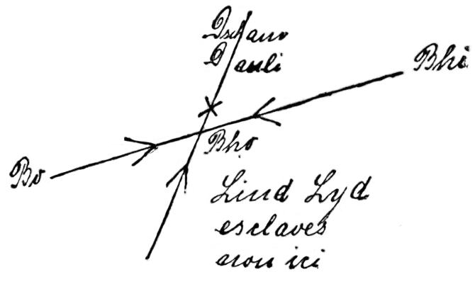

<@pagebreak 36/>

<h1>Das Teehaus in Bhopal.</h1>

<h2>Erstes Kapitel.</h2>

Wir hatten uns fünf Tage lang die redlichste Mühe
gegeben, festzustellen, wohin der Beduinenscheich Umri
Schomar mit seiner Schar und der uns abermals entwischten
Rosa Linden sich gewandt hatte. Von Schloß Medsur
aus hatten wir mit unseren vorzüglichen Reitkamelen, geführt
von einem arabischen Diener Lady Lydia Pimbertons,
weite Ausflüge in die Umgebung gemacht. Alles vergeblich.
Selbst Harald Harsts geübte Detektivaugen hatten auf den
harten Felsen der Schluchten und Berge des Sinai-Gebirges
keinerlei Spuren der Flüchtlinge entdecken können.

Lord Allan Pimberton, den Harald in diesem auf den
Westabhängen des Sinai-Gebirges erbauten Schlosse des
Mordes an Lord Percy Pimberton überführt hatte, war
in das Polizeigefängnis von Suez in Untersuchungshaft abgeführt
worden. Am sechsten Tage nach seiner Verhaftung
brachte eine Polizeipatrouille aus Suez die Nachricht, daß
der Mörder sich vorgestern in seiner Zelle erhängt hatte
und bald darauf beerdigt worden war.

Wir saßen mit Lady Lydia, der Witwe Lord Percys,
im Speisesaal des Schlosses beim Abendessen.

»Morgen früh heißt es also Abschied nehmen, Mylady,«
meinte Harald zu der schönen Schloßherrin.

Lady Lydias wundervolle Augen hingen mit besonderem
Ausdruck auf dem Gesicht meines Freundes. Sie seufzte
leise, errötete etwas und sagte dann:

»Ich werde Sie hier sehr vermissen, sehr. Ich schulde
Ihnen ja so unendlich viel Dank, Mr. Harst.«

»Dank?! Nun gut, Mylady. Dann erfüllen Sie mir
eine Bitte. Ich habe gemerkt, daß Sie, wenn wir über
die Mumiengrotte jenes Tales nördlich des Schlosses
sprachen, schnell das Thema wechselten. Ah, Mylady, —
weshalb werden Sie denn abermals so unruhig und verlegen?
Hängt denn mit diesen Mumien, zu denen die Inschriften
gehören dürften, ein Geheimnis zusammen, das
Sie mir nicht verraten dürfen?«

Lady Lydia machte eine hastige Handbewegung.

<@pagebreak/>
»Mr. Harst — ich bitte Sie, sprechen Sie nicht hierüber.
Wirklich nicht, — unterlassen Sie es! Ich darf Ihnen
keinerlei Auskunft geben, und ich möchte doch wiederum
nicht undankbar erscheinen. Meine Zunge bindet ein furchtbarer
Eid.«

Sie sah plötzlich ganz verängstigt aus, so daß Harald
schnell erklärte:

»Entschuldigen Sie, Mylady. Das konnte ich nicht ahnen.
Gut — reden wir von anderen Dingen. Also morgen in
aller Frühe werden Schraut und ich hoch zu Reitkamel die
Suche nach Rosa Linden in noch nachdrücklicherer Art als
bisher von neuem und diesmal allein aufnehmen, da der
Führer, den Sie uns liebenswürdigst bisher mitgegeben hatten,
sich stets alle Mühe gab, uns nicht die Richtung nach Südost
einschlagen zu lassen.«

Lady Lydia war jetzt ganz bleich geworden und starrte
Harald mit großen, entsetzten Augen an, rief dann leise:

»Oh — tun Sie das nicht, Mr. Harst. Auch Percy
und ich haben es bitter —«

Sie schwieg plötzlich, erhob sich und fügte völlig verwirrt
hinzu:

»Gehen wir in den Park. Ich möchte diesen letzten
Abend mit Ihnen recht angenehm verbringen, Mr. Harst.
Sie müssen mir erzählen, wie Sie Detektiv wurden und Ihre
Braut durch Mörderhand verloren.«

Ich schützte Arbeit vor, erklärte, ich müßte mir noch
über unsere letzten Abenteuer Notizen machen, und ließ die
beiden allein.

Ich ging in unsere Zimmer nach oben und setzte mich
mit einer guten Zigarre an das offene Fenster unseres Wohnsalons.

Mir wurde der Abschied von Schloß Medsur schwer.
Die Bergeinsamkeit, in der es sich mit seinen zwei Türmen
trotzig emporreckte, hatte bei aller Einsamkeit etwas Erhaben-Gigantisches
an sich. Und nun sollte ich die Behaglichkeit
dieses Salons hier und unserer Schlafzimmer schon
morgen mit der Wildnis des Sinai-Gebirges für längere
Zeit vertauschen, sollte an Harsts Seite eindringen in das
unerforschte Gebiet —!

Meine Gedanken wurden hier jäh abgelenkt. Meine
Augen hatten ganz zufällig drüben auf dem Vorsprung des
<@pagebreak/>
nächsten Berges eine Gestalt entdeckt, — einen Menschen,
dessen hellbrauner Mantel sich von dem schwarzen Gestein
recht scharf abhob.

Der Mann da drüben war mit bloßem Auge nicht
genau zu erkennen. Da ich sofort in ihm womöglich einen
Späher der Beduinenhorde Scheich Umri Schomars vermutete,
stand ich langsam auf, holte mein Fernglas und
richtete es auf die regungslos dastehende Gestalt.

Ich zuckte zusammen, als ich; das Glas eingestellt hatte.
Ich glaubte im ersten Moment an eine Sehtäuschung, an
ein Trugbild, das mir lediglich meine Phantasie vorgaukelte.

Der Mann dort hatte nämlich in allem die größte Aehnlichkeit
mit jenen Mumien, die wir in der Grotte gefunden
hatten, wo wir Rosa Linden gefangen nahmen —!

Ja — die allergrößte Aehnlichkeit! Das war dasselbe
mönchsartige Gewand, derselbe graue Vollbart, derselbe kahl
geschorene Kopf mit der dicken Scheitellocke —!

Ich beobachtete den Menschen weiter. Er lehnte an
der Felswand und drehte nur hin und wieder den Kopf.

Das Abendrot verschwand. Die Schatten der Dämmerung
senkten sich über die Schluchten und Berge des Sinai.
Die Gestalt drüben wurde immer undeutlicher.

Ich hob das Fernglas wieder an die Augen.

Aber — ich suchte jetzt umsonst. Die Gestalt war verschwunden.
Dann wurde es schnell dunkler und dunkler.
Nochmals schaute ich nach dem Manne aus, konnte jedoch
nichts mehr erkennen.

Mit Ungeduld erwartete ich Haralds Erscheinen. Erst
gegen zehn Uhr fand er sich ein. Ich berichtete ihm sofort,
was ich dort drüben bemerkt hatte.

»Das wäre ein weiterer Beweis für die Existenz eines
bisher unbekannten Kopten-Klosters im Sinai-Gebirge,«
meinte Harald leise.

»Wofür?« Ich hatte den Namen vor »Kloster« nicht
genau verstanden.

»Kopten-Kloster, mein Alter. Sollten Deine Schulreminiszenzen
nicht hinreichen, so will ich Dich dahin belehren,
daß die Kopten die christlichen Nachkommen der alten
Aegypter sind, die heute noch in Aegypten, im Sudan und
in Abessinien in einer Stärke von rund einer Million
leben.«

<@pagebreak/>
Er schwieg und starrte zum Fenster in die Dunkelheit
hinaus. Wir hatten das Licht noch nicht angezündet. Das
Schloß besaß eine Acetylengas-Anlage.

»Viermal schaute sie nach der Uhr —,« sagte er dann,
wie zu sich selber sprechend. »Viermal! Und — sie hatte
doch nichts zu versäumen —!«

»Lady Lydia natürlich,« meinte ich.

»Ja. Wenn man dieses Interesse für ihre Armbanduhr
berücksichtigt und ferner ihre steigende Nervosität, je
mehr die Zeiger sich der 10 näherten, dann —«

Er schwieg abermals, erklärte nun sehr lebhaft:

»Wir wollen noch einen Spaziergang machen. Nehmen
wir aber für alle Fälle unser Handwerkszeug mit. Man
kann nie wissen —!«

Gleich darauf eilten wir die Treppen hinab. Der
arabische Pförtner am Parkeingang teilte uns dann auf
Harsts Frage mit, daß Lady Lydia vor kaum fünf Minuten
mit ihrer Tigerdogge Hektor das Schloß verlassen habe.

»Wie war sie gekleidet?« wollte Harald wissen.

»Langer Seidenmantel und Schleier um den Kopf,
Effendi« dienerte der alte Araber.

Harst eilte schon den Serpentinenweg ins Tal hinab.
Als wir die Talsohle erreicht hatten, schlug er einen langen
Trab an.

»Du mußt jetzt führen, mein Alter,« rief er leise.
»Dieser Koptenmönch hängt mit diesem späten Spaziergang
der Lady fraglos zusammen.«

Ich fand mich trotz der Dunkelheit gut zurecht. Die
nähere Umgebung des Schlosses kannten wir jetzt zur Genüge.

Nun ging es den Berg hinan, auf dessen terrassenartigem
Vorsprung der Mann gestanden hatte.

Da — hoch über uns ein kurzes Aufheulen. Dann
polterte eine Steinlawine herab. Einzelne Felsbrocken sausten
uns um die Köpfe.

Wir waren stehen geblieben.

»Die Dogge!« flüsterte Harald. »Hier ist fraglos irgendeine
Teufelei im Gange — Weiter!«

Aber er verharrte trotzdem regungslos an derselben
Stelle. Links von uns war plötzlich ein klägliches Winseln
laut geworden.

<@pagebreak/>
Harald lauschte noch einige Sekunden. »Wir haben jetzt
keine Zeit für den Hund. Erst die Lady —!« stieß er dann
hervor.

Wir kletterten höher. Der Weg wurde immer schwieriger.
Wir vermieden nach Möglichkeit jedes Geräusch.

Endlich erreichten wir die Terrasse. Harst kroch auf
allen Vieren mir voran. Doch — die Felsabplattung war
leer.

Dann sah ich ganz dicht am Abhang etwas Helles
schimmern. Es war Lady Lydias leicht nach Parfüm duftendes
Spitzentüchlein.

»Sie hat es vielleicht absichtlich fallen lassen, um uns
ein Zeichen zu geben,« meinte Harst. »Sie rechnet damit,
daß wir sie überall suchen werden.«

»Sie ist entführt worden?« fragte ich rasch.

»Ja. Alles spricht dafür. Sehen wir jetzt nach Hektor.
Man hat den Hund niedergeschlagen und den Abhang hinabgeworfen.
Wozu das, wenn man es nicht auf die Lady
abgesehen hatte?!«

Er begann bereits wieder den Abstieg. An eine Verfolgung
des Mönches, der wahrscheinlich noch Helfershelfer
gehabt hatte, war ja bei der Finsternis nicht zu denken.

Wir fanden die prächtige Dogge halb begraben unter
Steingeröll. Sie wimmerte nur schwach. Es war kein
leichtes Stück Arbeit, sie ins Schloß zu tragen. Hier erregte
unser Erscheinen mit dem so übel zugerichteten Hunde,
der seine Herrin nie verließ, einen wahren Aufstand. Der
Hausmeister, ein Engländer namens Prigrave, der schon
bei den Eltern des ermordeten Lord Percy Diener gewesen
war, wurde von Harald sofort eingehend ausgefragt, nachdem
wir die Dogge, die durch einen Schlag auf den Kopf
schwer betäubt worden war, durch zweckmäßige Behandlung
wieder zum Bewußtsein gebracht hatten.

<h2>Zweites Kapitel.</h2>

Prigrave wollte erst nicht recht mit der Sprache herausrücken.
Dann gab er zu, daß Lord Percy und Lady
Lydia einmal einen Jagdausflug gemacht hätten und erst
nach fünf Tagen völlig erschöpft zurückgekehrt seien. Das
<@pagebreak/>
wäre vor drei Jahren etwa passiert. Der Lord habe damals
erklärt, sie hätten sich verirrt gehabt.

»Haben Sie mal gehört, daß es hier im Südosten im
Gebirge ein Kopten-Kloster gibt, Prigrave?« fragte Harald
nun, da der Hausmeister sich abermals in Schweigen hüllte.

»Die Beduinen der Sinai-Halbinsel besitzen einen reichen
Sagenschatz,« meinte Prigrave ausweichend.

»Ist irgendwie zu Ihrer Kenntnis gelangt, daß Lord
Percy Beziehungen zu Koptenmönchen unterhielt? — Verhehlen
Sie mir nichts Prigrave. Ich wiederhole: die Lady
ist fraglos entführt worden.«

Der alte Hausmeister knetete verlegen seine Hände.

»Ich — ich habe Lord Percy geloben müssen, über all
das zu schweigen, Mrs. Harst. Meine Zunge bindet ein
Eid.«

»Nun gut. Ich will nicht weiter in Sie dringen. Ich
bin überzeugt, daß der Lord und die Lady damals bei
jenem Jagdausflug das verborgene Kloster entdeckt haben
und daß man sie nur freigelassen hat, nachdem sie durch
einen Schwur sich zum Schweigen verpflichtet und auch versprochen
hatten, eine gewisse Abgabe an das Kloster zu
entrichten. Lady Lydia wußte, daß sie heute dort auf der
Felsterrasse erwartet wurde. Ich behaupte, sie wollte einem
Vertreter des Klosters die Abgabe aushändigen. Vorhin
habe ich den Pförtner ausgeforscht. Er erklärte, seit dem
Tode Lord Percys sei die Lady jeden Monat einmal zu
später Stunde, nur von der Dogge begleitet, in das Tal
hinabgestiegen und stets nach etwa einer Stunde zurückgekehrt.«

Prigrave stand mit gesenktem Kopfe da.

»Gehen Sie,« meinte Harsts »Wir werden Ihre Herrin
suchen. Der Mond ist soeben über den Bergen aufgetaucht.
Diese Beleuchtung genügt uns. Lassen Sie unsere Reitkamele
satteln und sorgen Sie dafür, daß wir Proviant
und Trinkwasser für drei Tage mitbekommen.«

Gegen 1 Uhr morgens brachen wir auf. Aus dem
Gewehrschranke des Lords nahmen wir auch diesmal jeder
eine zwölfschüssige Winchesterbüchse und genügend Patronen
mit. Die Dogge hatte sich bereits so weit erholt, daß sie
uns begleiten konnte, Sie hinkte zwar noch, aber das kluge
Tier schien zu wissen, worum es sich handelte.

<@pagebreak/>
Der Mond stand im abnehmenden Viertel. Die von
Silberglanz überflossene, wilde Gebirgsszenerie hatte ihre
besonderen Reize. Wir führten die Reitdromedare am Zügel,
ließen Hektor dann auf der Felsterrasse die Witterung des
Taschentuchs der Lady nehmen und erlebten auch die Freude,
daß der Hund sofort mit der Nase auf dem Boden der
Südecke der Terrasse zulief, wo ein Felsgrat im Bogen
in ein Tal hinablief.

Harst band die Dogge jetzt an eine Leine. Im Tale
saßen wir auf. Der Hund gewann seine Bewegungsfähigkeit
immer mehr zurück. In flottem Trabe ging es das
Tal entlang nach Süden zu. Dann schwenkte Hektor in
ein östliches Quertal ein. Hier fanden wir die ersten untrüglichen
Zeichen, daß mehrere Leute hinter ein paar Felsbrocken
gelagert hatten. Hier auch wurde Hektor unsicher,
lief hin und her und winselte.

»Man hat die Lady an dieser Stelle auf ein Pferd
gehoben,« meinte Harald, der tief gebückt den Boden mit
der Taschenlampe ableuchtete. »Ah — ein Stück schottische
Seide! Das stammt von Lady Lydias Mantel! Wenn sie
nur so klug wäre, weitere Stücke heimlich wegzuwerfen!
— Schraut, Schraut!« rief er plötzlich ganz erregt, »da —
schau’ Dir dies an!«

Er hielt mir auf der flachen Hand einen Zigarettenstummel
hin.

»Marke Lord Palmerston, mein Alter,« fuhr er fort.
»Die Lieblingszigarette Lord Allans, des angeblichen Selbstmörders!
Dazu eine Marke, die so selten geraucht wird.«

»Angeblichen Selbstmörders?! Angeblichen?!« Ich war
völlig verblüfft. Wie kam Harald denn auf diesen
Gedanken. Sollte der Selbstmord Lord Allans wirklich
Schwindel sein?!

»Vorläufig habe ich lediglich als Beweis für dieses
»angeblich« diesen Zigarettenstummel und Allan Pimbertons
Charakter. Ein so lebenslustiger und genußhungriger Mensch
bringt sich nicht so leicht um. Wer weiß, auf welche Weise
man die Polizei in Suez getäuscht hat. Du darfst nicht
vergessen, daß dieser Allan weite Reisen gemacht hat. Vielleicht
hat er in Indien — daß er dort gewesen, erzählte
er selbst uns ja — dasselbe Nervengift sich verschafft, mit
dem ein Geck Warbatty die Polizei in Madras so gründlich
<@pagebreak/>
hinters Licht führte. Du besinnst Dich. Du hast dieses
Abenteuer ja in etwas sensationeller Aufmachung unter dem
Titel »Der Fakir von Nagpur« bereits veröffentlicht. —
Doch, ob ich mit alledem recht habe, wird die Zukunft
lehren. Die größere Sorge ist jetzt, die Spur der Räuber
Lady Lydias nicht zu verlieren. Der Hund versagt jetzt,
wie Du siehst. Wenn wir ihm nur klarmachen könnten,
der Spur der Reiter zu folgen. Sonst wird es für uns ein
sehr mühseliges Geschäft, vielleicht auch ein ergebnisloses.«

Leider versagte Hektor jetzt vollkommen. Als Harald
einmal aus Unachtsamkeit die Leine fallen ließ, benutzte der
Hund sofort diese Gelegenheit, auf der Fährte im Galopp,
zurückzulaufen. Er mochte hoffen, seine Herrin im Schlosse
wiederzufinden. Wir kümmerten uns nicht weiter um ihn.
Nachdem Harald dann in diesem Quertale nach Südost zu
auf dem felsigen Boden noch ein paar Stücke Hanfschnur
und einige Wollfasern gefunden hatte (er deutete diese dahin,
daß die Entführer der Lady hier ihren Pferden die
Hufe mit Stücken von einer Wolldecke umwickelt hatten),
begann für uns, besser für Harald, die äußerst schwierige
Arbeit, eine Spur zu verfolgen, die sich lediglich hier und
da durch verschobene Steinchen und an zackigen Bodenerhebungen
hängengebliebene Wollfaserchen kennzeichnete.

Als der Morgen graute, gelangten wir in eine von
Bergen eingeschlossene Sandebene. Die Leute vor uns waren
am Rande dieser Ebene auf festem Boden entlanggeritten.

Bei Sonnenaufgang bemerkte Harst in einem Dornendickicht
auf einem Zweige hängend einen zweiten Seidenstoffetzen
aus Lady Lydias Mantel. Hier bog die Spur auch
wieder in die Berge ab. Wir näherten uns jetzt einer
Reihe sehr schroffer Abhänge, die steil wie Mauern emporwuchsen
und sich, soweit das Auge reichte, nach Süden
zu erstreckten.

Harst war wieder abgestiegen. Ich führte sein Reitkamel.

»Auch nicht die geringste Fährte!« rief er mir ungeduldig
zu. Er kniete jetzt und hatte den Kopf ganz dicht
über dem aus grauschwarzem Granit bestehenden Boden,
rutschte Schritt für Schritt weiter und sagte dabei noch
etwas, das ich jedoch nicht verstand.

<@pagebreak/>
Ich ließ mein Reittier niederknien und stieg ab. Haralds
Dromedar tat sich von selbst nieder. Ich band nur die
beiden Zügel zusammen und schritt dann auf Harst zu. Inzwischen
hatte er sich einige dreißig Meter entfernt und
stand nun aufgerichtet etwa drei Meter von der Steilwand
ab, die hier jedes Vordringen unmöglich machte.

Er streckte mir den Zeigefinger der rechten Hand entgegen.

»Da — sehr wichtig, mein Alter!« meinte er.

Die Fingerspitze war mit einer braunschwarzen Masse
bedeckt.

»Was soll das?« fragte ich.

»Rieche!«

Ich tat es. Das Zeug am Finger reicht etwas nach
schlechtem Oel und auch wie Teer etwa.

»Wagenschmiere nennt man das,« lächelte Harald. Ja
er lächelte! Seine vorhin nicht gerade glänzende Laune hatte
sich sehr gebessert. Weshalb nur?!

Ich schaute ihn forschend an.

»Ist die Wagenschmiere wirklich so wichtig?« fragte
ich.

»Und ob!« Er deutete auf den Felsboden. Zunächst
sah ich nichts als rissiges, grauschwarzes Gestein. Ich bückte
mich. Nun bemerkte ich kleinere und größere Flecke, die
etwas glänzten. Und dann nahm ich auch in einer kleinen
Spalte eine ganze Menge Wagenschmiere wahr.

Ich richtete mich wieder auf.

»Interessant, wie?!« meinte Harald augenzwinkernd.

Ich habe stets den Ehrgeiz gehabt, Harald wenigstens
so etwas hinter seine geistvollen Kombinationen, hinter diese
Berufsschliche, zu kommen. Manchmal gelang es mir. Diesmal
versagte ich — genau wie die Dogge, die ihrer Herrin
Spur verloren hatte.

»Bringe die Reitkamele erst mal irgendwo in der Nähe
unter, mein Alter,« fuhr Harst schon fort. »Beeile Dich.
Laß auch die Büchsen in dem Versteck. Sie dürften uns
nur hinderlich sein. Schnell doch! Wir müssen diese Banditen
überraschen, bevor sie noch mit unserem Erscheinen rechnen.
Jetzt halten sie sich noch für völlig sicher. Sie denken,
das Verschwinden der Lady wird erst heute früh bemerkt
werden und dann erst werden wir die Suche beginnen.
<@pagebreak/>
Ihre gegen uns gerichteten Vorsichtsmaßregeln dürften also
nicht früher als heute abend einsetzen. Bis dahin müssen
wir Lady Lydia also befreit haben. — So geh’ doch! Ich
erkläre Dir nachher schon alles.«

Ich gehorchte sehr zögernd. Ich führte die Dromedare
in eine nahe Schlucht, in deren hinterstem Ende ich
eine aus Felsbrocken durch Zufall gebildete Naturhütte als
recht gutes Versteck fand.

Als ich dann nach vielleicht zwanzig Minuten zu Harald
zurückkehrte, saß er auf dem kahlen Gestein mit dem Rücken
gegen die Steilwand und rauchte sehr behaglich eine seiner
Mirakulum-Zigaretten. Er stand sofort auf, drehte sich mit
dem Gesicht der Felswand zu, hob den rechten Arm und
griff in eine Spalte hinein, die sich wie ein Riß nach oben
zu fortsetzte. Ich sah, daß er nun in der Spalte an irgend
etwas mit aller Kraft zog.

»Bitte — oben!« sagte er dabei.

Ich schaute empor. — In einer Höhe von vielleicht
zwanzig Meter bildete die Steilwand die erste terrassenartige
Ausbuchtung. Dort wuchsen stachlige Rankensträucher,
die zum Teil weit überhingen.

Da — mit einem Male schob sich von dieser Terrasse aus
dem Gestrüpp heraus ein dicker Balken vor, der vorn ein
Rad hatte, über das ein dickeres Tau lief. Jetzt rollte
das eine Ende dieses Taues, welches mit einem Stück
Eisen beschwert war, zu uns herab. Dann fiel aus den
Ranken auch das andere Ende heraus. Ich fing es auf,
rief gleichzeitig:

»Die Wagenschmiere diente zum Schmieren des Rades
da oben! Jetzt begreife ich!«

Die Flecke von Wagenschmiere, die man auf dem Steinboden
nicht sorgfältig genug ausgerieben hatte, befanden
sich ja gerade unter dem Ende des Balkens.

»Allerdings,« erklärte Harald vergnügt. »So ist es,
mein Alter. Am schwierigsten war das hier in der Felsspalte
verborgene Tau zu finden, das den Balken vorschiebt,
wenn man daran zieht. — So, nun werde ich mal zunächst
an den beiden Tauenden emporklettern —«

Auf nähere Einzelheiten bei der Beschreibung dieses
primitiven Personen- und Lastenaufzugs will ich mich nicht
einlassen. Er war primitiv, aber praktisch, und man konnte
<@pagebreak/>
damit fraglos sogar Tiere emporbefördern. — Es kostete
mich dann manchen Tropfen Schweiß, ebenfalls nach oben zu
gelangen. Es gab hier in der Rückwand der Terrasse eine
Felskluft, die schon nach wenigen Metern eine scharfe Biegung
machte und in eine oben offene Spalte überging,
die wie ein Kanon zwischen himmelhohen Wänden entlanglief.
Der Boden der Spalte zeigte überall deutliche Spuren
eines lebhaften Verkehrs. Dieser Weg mußte sehr oft begangen
werden. Nach etwa fünf Minuten kamen wir ins
Freie. Wir standen jetzt auf der obersten eines Dutzends
terrassenartiger Abstufungen, die sich allmählich in ein sehr
großes Tal hinabsenkten. Der erste Blick über dieses Tal
hin entlockte mir einen Ausruf des Staunens.

Ein wahrer Garten Eden lag hier eingebettet zwischen
den schroffen, unwirtlichen Bergen; Palmenhaine, weite
Felder, Gebüschgruppen, im Sonnenlicht glitzernde Wasserläufe
und ein kleiner See schufen ein köstliches Bild einer
fruchtbaren Landschaft.

Und dort — ganz weit entfernt — sah ich nun auch
ein mächtiges Bauwerk emporragen, düster und trutzig wie
eine Raubburg. Ein einziger Turm reckte sich aus dem
Gemäuer dem Himmel entgegen. Und auf der Spitze dieses
Turmes funkelte und gleißte ein mächtiges, offenbar vergoldetes
Kreuz.

»Harald — wie wunderbar schön!« sagte ich leise.

Keine Antwort. Ich drehte mich nach ihm um. Er
stand da, hatte mit beiden Händen einen Seidenstoffetzen
glatt gezogen und schien das schottische Muster mit mir
unverständlichem Interesse zu besichtigen.

»Ja — es ist wunderbar!« meinte er nun, ohne aufzusehen.
»Dieses ist der dritte Fetzen aus Lady Lydias
Mantel; der wichtigste ist’s. — Ah — wenn es das wäre!«
rief er dann leise. »Wenn diese Schurken — Doch nein,
wie sollten sie die Frauen gerade bis dorthin schaffen —«

Er stierte noch immer auf das etwa zwei Handbreit
große Stück Seide.

Ich fragte nichts, regte mich nicht. Harald hatte die
Augen jetzt fast völlig zugekniffen. Auf seiner Stirn erschienen
die charakteristischen drei Falten. Die Haut über
den Backenknochen zog sich straff.

<@pagebreak/>
Ich kannte alle diese Anzeichen höchster geistiger Anspannung
längst. Deshalb schwieg ich auch.

»Und doch — es muß so sein, es muß!« murmelte
er jetzt. »Wenn man die Frauen wirklich dorthin schaffen
sollte, dann — dann spielt hier noch ein Geheimnis besonderer
Art mit.«

Er schob den Seidenfetzen in die Tasche, blickte über
das Tal hin.

»Jetzt haben wir für diesen Ort keine Zeit, mein Alter,«
sagte er kurz. »Aber — wir werden hierher zurückkehren
und Abrechnung halten. — Vorwärts — zurück nach Schloß
Medsur und nach Suez. Frage jetzt nichts. Ich habe übergenug
zu denken.«

Ich war enttäuscht, andererseits aber auch froh, daß
wir das Koptenkloster dort drüben nicht besuchten. Harmlos
wäre diese Visite fraglos nicht gewesen —!

Wir ließen uns wieder mit Hilfe des primitiven Aufzugs
in das Tal hinab. Harst zog den Balken wieder ein.

Nichts verriet, daß Fremde das offenbar Jahrhunderte
alte Geheimnis dieser verborgenen Koptensiedlung jetzt
kannten.

Unbehelligt langten wir am Spätnachmittag in Schloß
Medsur an. Der Hausmeister gab uns einen Diener als
Führer mit. Der junge Araber brachte uns dann auch auf
kürzestem Wege nach Suez.

<h2>Drittes Kapitel.</h2>

Der Leser mag sich bereits wundern, weshalb ich
dieses Abenteuer ausgerechnet »Das Teehaus in Bhopal«
betitelt habe.

Titel für Filme, Theaterstücke, Romane und so weiter
zu finden, ist nicht leicht. Der Titel macht alles, sagt man.
So hat unlängst eine amerikanische Filmfabrik ein Preisausschreiben
für zugkräftige Filmtitel veröffentlicht, und nach
den besten Titeln sollen dann die Stücke geschrieben werden.
So unglaublich das klingt, — es ist Tatsache.

Nun — den Vorwurf einer ähnlichen Effekthascherei
wird der Leser mir nicht machen können, wenn er erst dieses
unser Abenteuer ganz kennt. —

<@pagebreak/>
Ich überspringe jetzt einen Zeitraum von einer Woche.
— Wir hatten in Suez Kabinenplätze auf einem nach London
bestimmten Passagierdampfer genommen, der nur Aden anlief,
also fast ohne Aufenthalt die Fahrt erledigte. Von
Bombay reisten wir mit der zentralindischen Bahn bis Sehar,
einem Städtchen westlich der Residenz des indischen Vasallenstaates
Bhopal. Hier in Sehar nehme ich dann den Faden
der Erzählung wieder auf.

Wir waren dort abends gegen zehn Uhr eingetroffen,
ließen unsere Koffer auf dem Bahnhof, nahmen nur eine
große Handtasche mit und begaben uns zu Fuß nach dem
Hause des Polizeimeisters, der, wie Harald schon in Bombay
erfahren hatte, ein verabschiedeter Major der indischen
Kolonialarmee namens Sampson war.

Mr. Sampson, ein etwas poltriger alter Herr mit
weißem Schnurrbart, empfing uns mit größter Liebenswürdigkeit.
Ihm war der Name Harald Harst nicht fremd,
und er betonte wiederholt, daß es ihm eine Ehre sei, uns
als Gäste bei sich zu sehen.

Nachdem wir schnell einen Imbiß eingenommen hatten,
gingen wir in Sampsons Arbeitszimmer hinüber und nahmen
an einem runden Tische in einer behaglichen Ecke Platz.
Harst hatte den Major sofort nach der ersten Begrüßung
gebeten, vor der Dienerschaft so zu tun, als wären wir
beide Engländer und alte Bekannte Sampsons. Nähere Erklärungen
wollte Harald erst später abgeben.

»Wir können hier doch nicht belauscht werden,« sagte
er nun leise. »Das, was uns nach Sehar geführt hat,
spielt nämlich ein wenig auf politisches Gebiet über, und
mit der Begum von Bhopal soll in manchen Dingen nicht
zu spaßen sein.« (Der Vasallenstaat Bhopal wird von
mohammedanischen Fürstinnen regiert, die den Titel »Begum«,
die Erhabene, führen).

Der Major machte ein ganz entsetztes Gesicht. »Um
Himmels willen, Mr. Harst, — nur nicht Politik!« flüsterte
er. »Ich befinde mich ja als Polizeimeister hier in der
unangenehmen Zwitterstellung, von der Begum das Gehalt
zu beziehen, aber jedem Wink des englischen Residenten
in Bhopal gehorchen zu müssen.« (Die abhängigen Staaten
in Britisch-Indien werden von sogenannten Residenten dauernd
beaufsichtigt).

<@pagebreak/>
Harst winkte ihm beruhigend zu. »Keine Sorge, Mr.
Sampson. Ich werde sehr vorsichtig sein. Deshalb ist es
auch am besten, wir unterhalten uns auch weiter nur
flüsternd. — Vor sechs Jahren war Lord Percy Pimberton
in Bhopal Resident, wie ich in Suez in Erfahrung gebracht
habe.«

»Allerdings,« nickte der Major.

»Lord Pimberton ist tot, ist ermordet worden,« fuhr
Harald fort und schilderte dann ganz kurz unsere Erlebnisse
in Schloß Medsur. »Ich habe nun in Suez von dem
dortigen englischen Hafenkommandanten, der Lord Percy
genauer kannte, weiter gehört, daß er während seines Aufenthaltes
hier in Bhopal mit einem Minister der Begum
sehr ernsthafte Differenzen gehabt haben soll.«

»Ganz recht,« meinte der Major eifrig. »Er ließ den
Minister Dscham Dauli verhaften und erzwang dessen Absetzung.
Ein halbes Jahr darauf verließ er Bhopal, weil
er das Klima nicht vertrug.«

»Ja, er kehrte nach London zurück, lernte hier die bildschöne
Operettensängerin Lydia Morgan kennen, heiratete
sie, zog mit ihr in die Einsamkeit nach Schloß Medsur und
wurde dort vor etwa fünf Monaten von seinem Bruder
Allan ermordet, der auf sehr raffinierte Art in Suez als
Polizeigefangener eine Selbstentleibung vortäuschte, drei Beamte
bestochen hat und entfloh. — Hiermit komme ich zum
Hauptpunkt unserer Besprechung.« Er faßte in die Brusttasche
seines Sportjacketts, holte seine Brieftasche hervor und entnahm
ihr jenes Stück Seide, das er damals in dem Tale
gefunden, wo in der Ferne uns das Koptenkloster entgegengewinkt
hatte. — Er reichte Sampson den Seidenfetzen
und erklärte:

»Sie sind ja selbst Fachmann in diesen Dingen, Mr. Sampson.
Wollen Sie sich nun mal diese etwas eigenartige
schriftliche Mitteilung ansehen. — Auch Dir, mein
Alter,« wandte er sich an mich, »empfehle ich diesen Fetzen
Stoff zu eingehendster Beachtung.«

Ich rückte mit meinem Korbsessel ganz dicht an den
des Majors heran. Sampson hatte das Stück Seide auf
den Tisch gelegt und hielt es glatt gespannt. In dem
mittelsten grünen Streifen war mit Bleistift ein Kreuz gezeichnet.
Nun, es ist besser, ich gebe diese Zeichnung mit
<@pagebreak/>
allen Einzelheiten hier wieder. Das ist klarer als eine Beschreibung
mit Worten.

»Als ich diese Zeichnung bemerkte,« fuhr Harald fort,
»mußte ich mein Hirn gehörig anstrengen, bevor ich wußte,
was mir Lady Lydia damit hatte klarmachen wollen. Zum
Glück kenne ich ja Zentralindien sehr genau. So konnte
ich denn zunächst herausfinden, daß mit Bo nur Bombay
mit Bho nur die Residenz Bhopal des gleichnamigen
Vasallenstaates und mit Bhi die Stadt Bhilsa gemeint sein
konnten, während der wagerechte Strich nur die Bahnlinie
darstellen sollte. Die beiden Pfeilspitzen auf diesem Strich
deuteten auf Bhopal hin, ebenso die dritte des unteren
Teiles des schrägen Querstrichs. Mithin sollte meine Aufmerksamkeit
auf Bhopal gelenkt werden. — Was ich aus
dem

> Dsch/am
> D/auli

herauslesen sollte, blieb mir fürs erste verborgen. Dafür
hatte ich aber die fünf Worte Lind, Lyd, esclaves, non,
ici in einer Weise enträtselt, die mir sofort als die einzig
mögliche und richtige erschien. — Lady Lydia hat, als
sie diese Zeichnung anfertigte, sich sehr beeilt. Das erkennt
man an der Undeutlichkeit der Buchstaben. Sie hat
den Bleistift wiederholt mit der Zunge angefeuchtet, denn
<@pagebreak/>
Seide nimmt Bleistiftschrift schlecht an. Sie wollte außerdem
aber auch eine Mitteilung für mich zurücklassen, die
ein Unberufener nicht entziffern sollte. Sie hat dazu den
richtigen Weg gewählt, besonders dadurch, daß sie die
wichtigsten Worte in französischer Sprache unter die Zeichnung
setzte. Englisch wird im Orient weit häufiger auch von
Eingeborenen verstanden als französisch. — »Lind Lyd«
konnte nur heißen Linden und Lydia. »Esclaves« heißt
Sklaven, »non ici« nicht hier. Die drei Pfeilspitzen aber wiesen
nach Bhopal hin. Und das Ganze sollte mithin besagen:

> Die Linden und ich, Lady Lydia, sollen als Sklavinnen
nach Bhopal verkauft werden (oder »sind schon verkauft«)
und befinden uns *nicht* mehr *hier*.

Diese Deutung, Mr. Sampson, war ja insofern nicht
so sehr phantastisch, als ich bereits argwöhnte, Lord Allan
könnte aus Suez entwichen sein, und weil ich wußte, daß
er Indien über ein Jahr bereist hatte. Konnte er da nicht
hier in Bhopal Beziehungen zu Leuten angeknüpft haben,
die für europäische Sklavinnen hohe Preise bezahlen, konnte
er Lady Lydia nicht aus Rache an den Harem irgendeines
mohammedanischen Großen dieses Landes verschachert haben?
— Als ich hieran dachte, glaubte ich nun auch für die
Worte Dscham Dauli eine Erklärung gefunden zu haben,
ebenso für das kleine Kreuz unter diesen Worten. Es konnte,
sagte ich mir, dies Dscham Dauli der Name des Käufers
und das Kreuz dessen Haus in oder bei Bhopal sein.
Jedenfalls mußte dieses Haus im nördlichen Teile der Stadt
oder im Norden liegen. In Suez erfuhr ich dann, daß
der Minister der Begum, den Lord Percy gestürzt hatte,
Dscham Dauli hieß. Von dem Moment an zweifelte ich
auch nicht eine Sekunde länger, auf der richtigen Fährte
zu sein. Ich behaupte also: Rosa Linden ist von dem
Beduinenscheich an einen Angehörigen des Koptenklosters
verkauft worden, der dann auch Lady Lydia auf Betreiben
Lord Allans in seine Gewalt brachte und beide Frauen
hier nach Bhopal an den Harem Dscham Daulis weiterverschachert
hat. Der ehemalige Minister soll ja enorm
reich sein und sogar eine eigene Jacht besitzen, ebenso nur
im eigenen Salonwagen reisen. Mit dieser Jacht können
die Frauen bis an die Küste Vorderindiens gebracht und
dann in dem Salonwagen weiter hierher verschleppt worden
<@pagebreak/>
sein. Bei alledem sprechen noch fraglos Umstände mit, die
sich meiner Kenntnis vorläufig entziehen. Es muß da meines
Erachtens zwischen Dscham Dauli und Lord Allan Pimberton
Beziehungen geben, die recht fragwürdiger Art sind.«

Harald schwieg. — Der Major schüttelte den Kopf
und meinte:

»Mr. Harst, ich fürchte, Sie werden die beiden Frauen
nicht mehr retten können, falls sie sich wirklich schon im
Dscham Daulis Palast als Haremsdamen befinden. Dscham
Dauli ist nicht mehr Minister. Aber — Sie kennen ja die
Macht des Geldes! An ihn wagt sich niemand heran, niemand!
Der Nachfolger Lord Percy Pimbertons, der Resident
Sir Douglas Holgrave, riskierte es und — kam auf
einer — Tigerjagd ums Leben — hm ja, — Sie verstehen!
Hier in Indien gibt es eben andere Möglichkeiten, Leute
umzubringen, als drüben im alten Europa. Ich rate Ihnen
dringend, sich mit dieser Sache nicht die Finger zu verbrennen.
Ihre Kombinationen mögen stimmen. Besser ist
jedoch, Sie bilden sich ein, sie stimmen nicht, und reisen
wieder ab.«

Harald lächelte und blies ein paar tadellose Rauchringe.

»Mr. Sampson, die Jacht Dscham Daulis ankerte an
demselben Tage in Suez, als Lord Allan dort aus dem
Gefängnis entwich,« sagte er dann langsam. »Und vorgestern
traf dieselbe Jacht im Hafen von Bombay ein.
Dort stand schon der Salonwagen Dscham Daulis bereit.
Und unter dem Gepäck des Exministers, das von der Jacht
in den Salonwagen geschafft wurde, befanden sich zwei
Riesenkoffer, in denen man sehr gut Frauen unterbringen
konnte. Dscham Dauli ist dann mit diesem Salonwagen gestern
abend in Bhopal eingetroffen. — Sie sehen, Mr. Sampson,
ich gehe allen Dingen auf den Grund. Mir bleibt
so leicht nichts verborgen. Was ich mir vornehme, führe
ich auch aus. — Ich bin nun hier zu Ihnen gekommen,
um mich in aller Heimlichkeit ein wenig verwandeln zu
können. Sie haben unsere Koffer ja bereits vom Bahnhof
holen lassen. Wir werden uns jetzt auf unser Fremdenzimmer
zurückziehen. Wenn wir morgen früh nicht mehr da sind,
sagen Sie nur Ihren Dienern, wir hätten einen Jagdausflug
vor.«

<@pagebreak/>
»Her mit Ihrer Hand,« rief erfreut der Major. »Ich
werde Ihnen helfen! Meinetwegen kann der verdammte
Dscham Dauli nachher eine seiner bekannten Teufeleien ersinnen,
die —«

»Ah — er ist deshalb also berüchtigt —,« fiel Harald
ihm ins Wort.

»Und ob. Er hält in seinem Palast etwa zweihundert
Diener, die jedem seiner Winke gehorchen. Außerdem besitzt
er mehrere Plantagen, und seine Arbeiter dort gehen
gleichfalls für ihn durchs Feuer. Sein Palast im Norden
der Stadt ist uralt. Sie kennen ja diese alten indischen Paläste.
Wenn die Mauern reden könnten, würden sie nette Schauergeschichten
erzählen. — Sie wollen also mit Ihrem Freunde
Schraut in einer Verkleidung nach Bhopal. Und dann —?«

»Was würden Sie tun, Mr. Sampson?«

»Ich — ich?! Ich — würde schleunigst wieder umkehren.«

»Ganz recht. Das werde ich auch, wenn ich — die
beiden Frauen befreit und Lord Allans Verhaftung ermöglicht
habe.«

»Um Himmels willen, — gedenken Sie etwa in den
Palast Dscham Daulis einzudringen? Ich warne Sie! Sie
kommen bestimmt nicht wieder lebend heraus!«

»Abwarten, Mr. Sampson. — Doch, jetzt wollen wir
mit der Maskerade beginnen. Sie könnten mit in unser
Zimmer kommen. Ich möchte Sie noch allerlei fragen.
Mit dem Morgenzuge um 4 Uhr will ich weiter nach
Bhopal.«

<h2>Viertes Kapitel.</h2>

Wir waren in Bhopal, als indische Kaufleute verkleidet,
in einem kleinen Hotel am Bahnhof abgestiegen,
das einem Franzosen gehörte. Unsere Masken, bis ins
kleinste sorgfältig durchgeführt, schützten uns genügend. Um uns
durch unsere mangelhaften Sprachkenntnisse nicht zu
verraten, hatten wir uns als in Kalkutta daheim ausgegeben,
da dort ein ganz anderer Dialekt gesprochen wird.
Monsieur Plicart, der Hotelbesitzer hielt uns fraglos für
»echt«.

<@pagebreak/>
Am ersten Tage schon hatten wir mit unserer Arbeit
begonnen. Es lag Harald daran, festzustellen, ob die beiden
großen Koffer aus dem Salonwagen Dscham Daulis auch
wirklich nach dessen Palast geschafft worden waren. Dies
sollte ich erledigen. Er selbst wollte versuchen, sich mit
einem der Diener des Exministers anzufreunden.

Erst am Abend sahen wir uns wieder. Ich hatte mir
die kleine Residenz inzwischen gründlich angeschaut, war
eigentlich den ganzen Tag auf den Beinen gewesen und
daher todmüde. Aber — Erfolge hatte ich leider nicht aufzuweisen.
Lediglich das eine konnte ich Harald mitteilen,
daß das Gepäck Dscham Daulis auf einem Tafelwagen vom
Bahnhof abgefahren worden war und daß dieser Wagen
zum Palaste des Exministers gehörte.

Wir saßen nebeneinander auf dem Rohrsofa in unserem
großen Fremdenzimmer. Auf dem Tische vor uns brannte
eine elektrische Stehlampe. Ich hatte gleich bei der Begrüßung
gemerkt, daß Harald sehr abgespannt zu sein schien.
Er saß auch jetzt in sich zusammengesunken da und hatte
die Augen halb geschlossen.

»Tröste Dich,« sagte er leise. »Dafür habe ich desto
mehr Glück gehabt. Der Kutscher des Gepäckwagens ist
ein verheirateter Hindu und wohnt nicht im Palast, sondern
hier in der Stadt. Ich war auch am Bahnhof. Und dort
erfuhr ich den Namen und die Wohnung des Kutschers,
der ein älterer Mann ist und Achmed ben Sirdar heißt.
Sein Häuschen liegt neben einer Teestube, die einem Chinesen
gehört. In diesem Teehause habe ich vier Stunden lang
in einer Koje der geheimen Opiumhöhle zugebracht — scheinbar
auch im Opiumrausch wie dieser Achmed ben Sirdar.
Mir ist noch jetzt ganz übel von dem süßlichen Dunst in
dem niedrigen Kellerraum. Der alte Hindu lag in der
Nebenkoje. Als er erwachte, haben wir uns so etwas angefreundet.
Opiumraucher betrachten sich als Brüder. Das
gemeinsame Laster bringt sie einander schnell näher. Heute
um elf Uhr wollen wir uns wieder dort im Teehause treffen.
Sirdar möchte mir ein paar antike Goldarbeiten verkaufen.
Lege Dich deshalb am besten nieder und schlafe noch eine
Stunde, bevor wir zu dem mageren Herrn Tschi Long gehen
und mit Sirdar Geschäfte machen.«

<@pagebreak/>
»Du hoffst also, durch den Kutscher etwas zu erreichen?«
fragte ich.

»Ja — sehr sogar. Der alte Halunke ist offenbar einer
der Intimen des Exministers. Er prahlte damit, daß er
bereits 20 Jahre im Dienste des mächtigen Dscham Dauli
stehe. Und Geld muß er auch haben. Sein Häuschen ist
recht sauber und schmuck. — So, nun Ruhe Dich aber
noch eine Weile aus, mein Alter. Ich habe noch meine
Jacke zu flicken. Die Rückennaht ist aufgetrennt. Bei Dir
übrigens auch, wie ich vorhin bemerkte. Ziehe sie also
aus —«

Ich tat es, wollte mir den Schaden ansehen. Harald
riß mir die Jacke aber aus der Hand und meinte:

»Vertrödle doch nicht unnötig Zeit —!«

Mir erschien dies Benehmen etwas seltsam. Ich war
aber wirklich hundemüde und legte mich auf mein Bett.
Harald hantierte am Tisch mit Nadel und Zwirn herum.
Wir trugen als indische Kaufleute gelbliche Leinenanzüge
von europäischem Schnitt, dazu bastseidene Hemden mit
weichem Kragen.

Dann schlummerte ich ein. Um halb elf weckte Harald
mich. Wir nahmen wie immer unsere Taschenlampen und
Repetierpistolen mit. Harst riet mir, die Pistole mit einem
Stück Leinenband um das Knie zu befestigen. Er krempelte
sein weites Beinkleid auf und zeigte mir, daß auch ihm
die kleine Clement-Pistole vorn am Schienbein des rechten
Fußes hing.

Ich schaute ihn mißtrauisch an. »Harald, Du — Du
verbirgst mir etwas!« flüsterte ich. »Noch nie bist Du so
vorsichtig gewesen, und —«

»Noch nie hatten wir es mit einem Dscham Dauli zu
tun!« unterbrach er mich. »Mach’ fix! Ich hoffe, daß noch
in dieser Nacht die Entscheidung fällt —«

In der Vorhalle des Hotels trafen wir mit Monsieur
Plicart, dem Besitzer, zusammen.

»Ah, wohl das Nachtleben Bhopals studieren, he?!«
grinste er. »Empfehle das Teehaus des Chinesen Tschi
Long. Es liegt dicht am Flusse. Jeder kennt es hier —!«
Er zwinkerte mit den Augen. Und Harald zwinkerte gleichfalls.
»War schon da, Mr. Plicart,« sagte er auf englisch.

Wir schritten die Bahnhofstraße entlang, dem
<@pagebreak/>
Eingeborenenviertel zu. Nach etwa hundert Schritt trat ein baumlanger,
schmieriger Inder an uns heran, flüsterte: »Lord
Scheldon —!«

»Lord Scheldon,« wiederholte Harald.

Und der Inder darauf: »Sie sind da —«

Wir gingen weiter. Ich war so ziemlich sprachlos. Was
bedeutete das nun wieder? — Lord Scheldon? Den
Namen hatte ich doch letztens gehört? — — Ah, richtig,
Sampson hatte ihn genannt. Lord Scheldon war der jetzige
englische Resident in Bhopal, also der eigentliche Machthaber
hier.

»Du, was sollte das soeben?« fragte ich Harald.

»Es war einer der Treiber, die das Wild einkreisen
helfen —«

Ich überlegte. »Dann — dann hast Du Dich mit
dem Residenten in Verbindung gesetzt, und —«

»Ganz recht. Das habe ich. — Eine wundervolle Nacht
übrigens. Wenn es hier in den Gassen nur nicht so stinken
würde —« Er wich also weiteren Fragen aus.

Nach fünf Minuten kamen wir auf einen freien Platz.
Rechter Hand war ein Haus völlig erleuchtet. Aus der
breiten, offenen Tür klang Musik heraus.

»Das Häuschen links davon ist das des Kutschers,«
meinte Harald. »Der Kerl hat es also sehr bequem, sich
einen Opiumrausch zu holen.«

Vor dem Teehause hockten mehrere Bettler, für Indien
selbst nachts ein durchaus gewöhnlicher Anblick. Einer davon
kroch auf allen Vieren zu uns heran, reckte uns die
eine Hand entgegen —

»Lord Scheldon,« flüsterte er. — Und dann wiederholte
sich genau dasselbe wie vorhin. Genau dieselben Worte
fielen.

Wir betraten das Teehaus. Es war ein einziger großer
Raum, durch niedrige Holzwände in kleinere Zellen abgeteilt,
die zumeist vorn Vorhänge hatten.

Nur wenige Tische standen frei da. An einem dieser
Tische saß ein Hindu mit langem, grauen Bart und pockennarbigem
Gesicht. Harst steuerte auf den Tisch zu. — Es
war der Kutscher Achmed ben Sirdar. Er stand sofort auf,
sagte leise: »Nicht hier, — unten!« nahm ein in Leinwand
gehülltes Paket vom Tisch und ging uns voran am
<@pagebreak/>
Schanktisch vorüber durch eine niedrige Tür auf den Hof,
wandte sich einem halb verfallenen Stalle zu, in dem eine
durch Gerümpel verdeckte Falltür dann den Zugang zu einer
Holztreppe freigab. Gleich darauf standen wir in der Opiumhöhle,
einem fensterlosen Kellerraum, wo mir schon nach den
ersten Atemzügen beinahe schwindelig wurde.

Achmed ging in eine Art Alkoven, wo eine einzige Holzpritsche,
mit Kissen bedeckt, stand. Eine stinkende Oellampe
spendete hier spärliches Licht. Wir drei hatten kaum auf
der Pritsche Platz genommen, als Achmed das Paket öffnete.
Es enthielt sechs wunderschöne, kleine antike Vasen, offenbar
aus reinem Golde. Harst begann zu handeln. Achmed
beherrschte das Englische leidlich. Er forderte einen ganz
unerhörten Preis. Als Harald die Hälfte bot, sprang er
wie ein Verrückter auf und tanzte vor uns umher.

»Nur 1000 Pfund Sterling — nur 1000 Pfund!« geiferte
er. »Was denkst Du Dir, he?! Das ist reines Gold und —«

Da traf mein Ohr wie ein Hauch ein hastig geflüstertes
Wort Haralds:

»Achtung —!«

Ich hatte schon vorher geahnt, daß es mit diesem Alkoven
etwas Besonderes auf sich haben müsse. Ich fühlte,
wie mir das Herz zu jagen begann. Meine Augen verfolgten
jede Bewegung des alten, ausgemergelten Schuftes.

Da — wieder hüpfte er scheinbar vor Wut in die
Höhe, streckte den rechten Arm aus, ergriff oben an der
Decke etwas wie einen Glockengriff —

Ich wollte hochschnellen und ihm an die Kehle.

Harst riß mich zurück —

In demselben Moment kippte die Pritsche nach hinten
um, und wir rutschten samt den Kissen ab, sausten abwärts,
fielen übereinander —

Eine höhnische Stimme sagte in tadellosem Englisch:

»Ah — welch’ erfreuliches Wiedersehen, meine Herren!
Bitte, bleiben Sie ruhig liegen, oder wir drücken ab —«

Wir lagen auf dem feuchten Sandboden eines tieferen
Kellergeschosses. Drei Männer standen dicht vor uns. Zwei
hatten brennende Laternen in der Linken; alle drei aber
in der Rechten Revolver.

»Mr. Schraut, stehen Sie jetzt zunächst auf!« befahl
<@pagebreak/>
Lord Allan Pimberton, denn er war es, freilich äußerlich
sehr verändert.

Der Mann, der mir nun die Hände mit Riemen auf
dem Rücken fesselte, war Dscham Dauli, der Exminister der
Begum von Bhopal. Alles in allem war er eine imposante
Erscheinung, mit langem, glänzend schwarzem Bart,
einer messerscharfen Nase und ein paar hochmütig-stechenden
Augen. Der dritte Mann von hellerer Gesichtsfarbe war
ein Greis mit grauem, kurz gehaltenem Vollbart. Alle drei
trugen indische Tracht, ein mantelartiges, faltiges Gewand
aus bräunlichem Wollstoff und Sandalen, dazu Turbane.

Jetzt kam die Reihe an Harst. Er ließ sich ebenfalls
ruhig fesseln. Dann durchsuchte Dscham Dauli unsere Taschen
und nahm uns die Taschenlaternen, die Messer und die
Brieftaschen ab. Die Clement-Pistolen fand er nicht.

»Ah — so sehr sicher fühlten Sie sich!« spöttelte Lord
Allan wieder. »Nun, Pistolen hätten Ihnen auch nichts genützt.
Wir hatten alles genügend zu Ihrem Empfang vorbereitet.
Als Sie, Mr. Harst, heute Achmed hier ausfragten,
wo er denn die beiden großen Koffer hingefahren
hätte, genügte ihm das. Wir rechneten mit Ihrem Erscheinen,
und unsere Vertrauten waren gewarnt. Der Handel
mit den Goldsachen war nur ein kluger Trick von Achmed,
Sie herzulocken.«

Harst stand mit gesenktem Kopf da und schwieg.

»Sie ahnen wohl schon, daß Ihre Stunden gezählt sind,
Mr. Harst,« meinte Allan auflachend. »Ja — auch ein
so berühmter Mann wie Sie macht mal Dummheiten! Bevor
Sie beide aber den Schlammgrund der Betowa, in
einen Sack eingenäht und mit Steinen beschwert, kennenlernen,
wollen wir Ihnen noch die kleine Freude machen,
Lady Lydia und ihre Landsmännin Rosa Linden wiederzusehen
—«

Man führte uns jetzt durch einen Gang und über eine
kurze Treppe in einen anderen, ganz wohnlich ausgestatteten
Kellerraum. An der Decke hing eine große Petroleumlampe.
Der Raum hatte im ganzen vier Türen. Drei davon waren
sehr schmal und niedrig und lagen nebeneinander an der
einen Schmalseite. Sie hatten oben vergitterte kleine Schiebefenster
und machten den Eindruck von Zellentüren, da sie
außen schwere Riegel und Schlösser besaßen.

<@pagebreak/>
An der einen Längswand stand ein Diwan, davor ein
langer Tisch, um den sechs Rohrsessel gruppiert waren.
Harald und ich mußten uns in zwei dieser Sessel an die
eine Schmalseite des Tisches setzen, die Gesichter nach den
Zellentüren hin.

Der Greis mit dem kurzen grauen Vollbart — seine
Züge hatten einen ganz besonderen Schnitt — schloß dann
zwei der Zellentüren auf, öffnete sie, rief befehlend:

»Kommen Sie heraus!« — Sein Englisch war gleichfalls
tadellos.

Und dann — dann erschien zuerst Lady Lydia Pimberton,
leichenblaß, schwankend vor Schwäche. Der Greis
deutete auf einen der Sessel uns gegenüber.

Lady Lydia streifte uns nur mit einem flüchtigen Blick.
Sie erkannte uns nicht. Sie sank in den Sessel; der Kopf
fiel ihr matt auf die Brust.

Jetzt tauchte auch Rosa Linden aus dem finsteren Loche
auf. Ihr hatte dieses Abenteuer weit weniger geschadet.
Sie war noch recht frisch, und dies bekam denn auch der
graubärtige Alte sofort zu spüren. Wie eine Katze schoß
sie auf ihn los, kreischte: »Schuft, Du hast den Scheich
bestochen, daß er mich Dir überließ! Sklavenhändler,
Mädchenhändler, Du —«

Während dieser lebhaften Szene hatte Harald mir zuflüstern
können:

»Die Naht auf dem Rücken! Aber behutsam!«

<h2>Fünftes Kapitel.</h2>

Lord Allan und Dscham Dauli hatten auf dem Diwan
Platz genommen. Ihre Revolver legten sie vor sich auf
den Tisch. Der Graubart stand daneben.

»Lady Lydia und Miß Linden,« begann Allan mit ironischer
Höflichkeit, »Sie gestatten, daß ich Ihnen hier in
Freiheit dressiert vorführe — erstens den Meister-Detektiv
des Weltalls, Mr. Harald Harst, — zweitens dessen Privatsekretär
und Freund Max Schraut —«

Lady Lydia schnellte hoch und rief:

»Oh — Sie — Sie! Und — und ich hatte doch auf
Ihre Hilfe —«

<@pagebreak/>
Allan lachte schallend dazwischen.

»Hilfe, Hilfe?! Nein, teuerste Lady, von dieser Seite
haben Sie keine Hilfe mehr zu erwarten! So wahr Sie
und Rosa Linden morgen nach dem Harem Dscham Daulis
geschafft werden, so wahr werden Harst und Schraut noch
in dieser Nacht im Flusse ersäuft! Das ist meine Rache,
Lady Lydia, weil Sie erstens meinen Bruder Percy mir
seinerzeit vorzogen und dann durch den verfluchten Köter
mich des Mordes an Percy überführen halfen.«

»Auch Sie, Miß Linden, sollten sich freuen, Ihren Verfolger
los zu werden,« fuhr Allan fort. »Sie haben doch
ein paar Menschenleben auf dem Gewissen, und da ist es
auch für Sie besser, diese beiden Schnüffler verschwinden
für immer.«

Rosa Linden regte sich nicht, behielt die Augen halb
geschlossen.

»So, nach dieser scherzhaften Wiedersehensszene zur
Sache!« fügte Lord Allan nach kurzer Pause hinzu. »Bevor
Sie beide, Mr. Harst und Mr. Schraut, diese Sessel
mit dem weit weicheren Schlammgrunde der Betowa vertauschen,
möchten wir gern erfahren, wie Sie so schnell
herausgefunden haben, wohin wir Lady Lydia entführt
hatten.« — Er blickte Harald fragend an.

Ich gebe zu, daß ich Harald diesmal einfach nicht verstand.
Weshalb hatte er nur den Kutscher Achmed so auffällig
ausgefragt? Weshalb hatte er mir dies verschwiegen?
Und — was nützten uns jetzt unsere Pistolen, die in unseren
Hosenbeinen steckten?! Nichts — gar nichts! Genau so wenig
konnten uns die Leute des Residenten helfen, die draußen
postiert waren. Selbst wenn dieses Haus durchsucht werden
sollte: man würde uns doch nicht finden!

»Dort vor Ihnen liegt meine Brieftasche, Allan Pimberton,«
sagte Harald sehr ruhig und beugte den Oberkörper
etwas vor. »Oeffnen Sie sie. Sie werden darin ein Stück
Seide aus Myladys Mantel finden mit einer Zeichnung
darauf. Diese Zeichnung, in aller Eile angefertigt, ist in
ihrer Art ein Meisterstück. — Mylady, ich kann Ihnen
nur meine Anerkennung deswegen aussprechen.« Er verbeugte
sich nach Lady Lydia hin so tief und respektvoll,
daß der Rohrsessel leise knarrte.

Lord Allan griff nach der Brieftasche und fauchte
<@pagebreak/>
gleichzeitig Harald wütend an: »Wie dürfen Sie es wagen, mich
lediglich mit Allan Pimberton anzusprechen?!«

Wieder verneigte Harst sich; wieder knarrte der Sessel.
»Entschuldigen Sie, Mylord,« erklärte Harald dazu.

Allan und Dscham Dauli besichtigten den Seidenfetzen.

»Ah — also auf die Weise!« meinte Pimberton und
lachte kurz auf. »Na — dieses Seidenstück hat leider auch
nichts geholfen, Lady Lydia!«

»Gestatten Sie eine Frage, Mylord,« sagte Harald jetzt
mit überhöflicher neuer Verbeugung. »Ich habe Ihnen soeben
über diesen Punkt Aufschluß gegeben. Würden Sie
mir jetzt vielleicht erklären, wie Sie Dscham Dauli kennen
gelernt haben? — Ich bin in allem ein sehr gründlicher
Mensch, und ich würde ungern sterben, wenn ich nicht vorher
über alle Einzelheiten dieser Entführung genau unterrichtet
wäre.«

Allan Pimberton machte ein recht verdutztes Gesicht.
Er fühlte sehr wohl heraus, welch’ überlegene Ironie durch
Harsts Sätze hindurchklang. Ihm schien es unbegreiflich,
daß ein Mensch in dieser Lage noch den Mut zu derartigen
Bemerkungen fand.

»Meinen Sie das im Ernst?« fragte er unsicher.

»Allerdings, Mylord. — Gewiß, das meiste über diesen
Ihren Rachefeldzug gegen die Frau, die Ihre Liebe zurückwies,
kann ich mir selbst zusammenreimen. Wollen Sie
mir daher vielleicht nur einige Fragen gestatten? — Ich
nehme Ihr Schweigen als Zustimmung. — Also: Lord
Percy und Lady Lydia hatten an das verborgene Koptenkloster
monatlich einen Tribut zu zahlen. Sie, Mylord, werden
einmal dem Abgesandten dieses Klosters nachgeschlichen sein
und lernten das Geheimnis des Zugangs zu dem fruchtbaren
Tale auf diese Weise gleichfalls kennen. Und —
jener Mann da« — er machte mit dem Kopf eine Bewegung
nach dem graubärtigen Alten hin — »ist ebenfalls
ein Koptenmönch. Sein Gesichtsschnitt verrät das. Vielleicht
ist dieser Mann derselbe, den Sie, Mylord nach Ihrem
Entweichen aus dem Gefängnis in Suez in Gemeinschaft
mit Dscham Dauli auflauerten, da Sie wußten, daß es
gerade der Tag war, wo der Tribut abgeholt wurde.«

»Allerhand Achtung!« meinte Allan Pimberton. »Bisher
<@pagebreak/>
haben Sie gut geraten. Nun sind Sie mit Ihrer Weisheit
aber wohl in die Sackgasse geraten —«

»Durchaus nicht, Mylord, durchaus nicht.« Eine neue
Verbeugung; neues Knarren des Rohrsessels. — Jetzt merkte
ich: diese Verbeugungen Haralds hatten einen bestimmten
Zweck. — Vielleicht versuchte er, die Riemen zu lockern,
die seine Handgelenke auf dem Rücken umschnürten; vielleicht
sollte der Sessel knarren, um ein anderes Geräusch zu übertönen!

Aber — ich hatte ja selbst bereits wiederholt meine
Hände gedreht und die Schlingen zu lockern gesucht. Die
Riemen waren aber so brutal festgezogen, daß sie tief in
die Haut eingeschnitten. Jede Bewegung verursachte
Schmerzen. — Nein — es war ausgeschlossen, diese Fesseln
loszuwerden! — Trotzdem: irgend etwas führte Harald
im Schilde — aber was — was?

»Ja — Sie beide lauerten dem Abgesandten des Klosters
auf und wußten ihn dahin zu bringen, daß er mit Ihnen
gemeinsame Sache machte,« fuhr Harst fort. »Die Lady
wurde dann mit Hilfe der Winde in das verborgene Tal
geschafft und hier dicht am Ende des Felsenganges nur so
lange belassen, bis der Kopte Rosa Linden gleichfalls herbeigeholt
hatte. Diese Zeit benutzte die Lady dazu, die
Zeichnung anzufertigen.«

Ich schaute zu Lady Lydia hinüber. Sie nickte eifrig.

»Dann wurden die beiden Frauen weggebracht — an
die Küste des Golfes von Suez, wo Dscham Daulis Jacht
an einer bestimmten Stelle wartete. — So — jetzt bin
ich wirklich etwas in der Sackgasse. Ich vermute, daß Dscham
Dauli seit langem die Absicht gehabt hat, sich an Lord Percy,
der ihn um Amt und Würden brachte, zu rächen. Ich
vermute dies und bringe mit diesen Racheplänen das Erscheinen
seiner Jacht in Zusammenhang.«

Da meldete sich der Exminister. »Lord Allan war mir
bereits seit vier Monaten persönlich bekannt,« sagte er in
fließendem Englisch. »Ich erfuhr von Lord Percys Verschwinden.
Dieses kam mir sehr ungelegen, da es meine
Rache störte. Ich traf mit Allan in Suez damals zusammen.
Wir wurden Freunde. Er versprach mir, die Lady für meinen
Harem mir in die Hände zu spielen. Wir verabredeten,
daß ich vier Monate später wieder in Suez mich einfinden
<@pagebreak/>
sollte. Ich kam gerade zur rechten Zeit, um Allans
Flucht fördern zu können.«

»Danke,« sagte Harald kalt. »Selten haben zwei größere
Schurken sich zusammengetan als Sie beide. — Nicht wahr
— hier sollte nun auch der Kopte den Kaufpreis für Lady
Lydia und Rosa Linden erhalten?«

»Ja — ja!« lachte Allan Pimberton heiser vor Wut.
»Wo nehmen Sie — Sie Lump nur die Frechheit her —«

»Gestatten Sie, Mylord,« fiel Haralds ihm ins Wort
und verneigte sich wieder. »Es ist das von mir keine Frechheit.
Wir haben eben nur die Rollen vertauscht— «

In demselben Moment fuhren seine Arme nach vorn;
ein Griff, und die beiden Revolver auf dem Tisch waren
in seinen Händen —

»Sitzen Sie still — oder —!« rief er jetzt drohend.
»Ich schieße nie vorbei —!«

Die drei Verbrecher waren so sprachlos, daß sie kein
Glied rührten.

»Schraut!!« rief Harald wieder. »Unten in der etwas
aufgetrennten Rückennaht Deiner Jacke steckt in einem Täschchen
ein offenes Federmesser. Es wird Dir schnell wie mir
gelingen, die Riemen zu durchschneiden.«

[Im Scan fehlt hier eine halbe Seite]
 
<@pagebreak/>
Er legte den einen Revolver auf den Tisch zurück.
Es genügte ja, wenn er nur den anderen in der Rechten
behielt.

»Ich habe mich mit Lord Scheldon in Verbindung
gesetzt,« sagte er nun. »Das Teehaus und auch das Häuschen
Achmeds sind von Militär in Zivilkleidern umstellt. Ein Entrinnen
für Sie gibt —«

Er tat plötzlich einen Satz —

Er kam zu spät —

Rosa Linden hatte sich plötzlich vorgeschnellt, den Revolver
vom Tische aufgerafft —

Zweimal drückte sie auf den Kopten ab —

Der Mensch fiel nach vorn, lag regungslos —

»Herr Harst,« rief sie, »der Elende hat —«

Sie drückte zu früh ab. Die letzten Worte verschlang
der Knall des dritten Schusses, den sie gegen die eigene
Stirn abgefeuert hatte.

Ich fing die Umsinkende auf — Sie war tot — Schläfenschuß —

Gleich darauf hatte Harst die Leute Lord Scheldons
herbeigeholt. Die beiden Verbrecher wurden gefesselt nach
der englischen Residentur gebracht —

Beide, Lord Allan und Dscham Dauli, vergifteten sich
wenige Tage später. Auf Haralds Veranlassung wurden
die Leichen jedoch sehr genau untersucht, ob wirklich auch
der Tod eingetreten war. Den Ellora-Smaragd hatte Allan
Pimberton bei sich getragen. Harst sorgte dafür, daß das
Kleinod dem Ellora-Tempel zurückgegeben wurde, aus dem
es vor vielen Jahren geraubt worden war. —

Bevor wir dann unsere Absicht, das geheime Koptenkloster
im Sinai-Gebirge zu besuchen, verwirklichen konnten,
hatten wir in Indien noch zwei Probleme zu erledigen,
von denen das interessanteste war —

> *Die Gespenster-Rikscha,*

über die ich nun im folgenden Bande dem Leser recht Seltsames
zu berichten habe.
